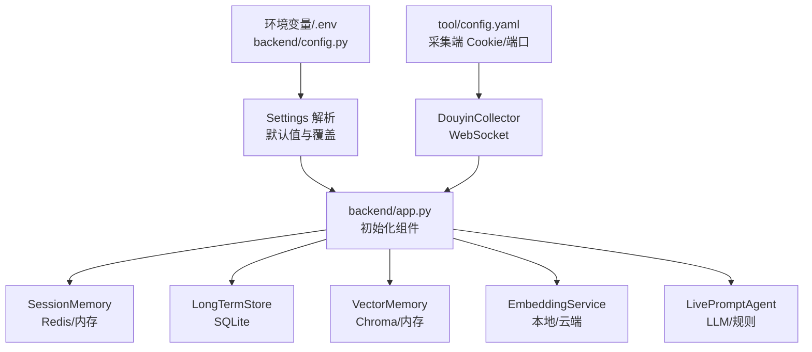
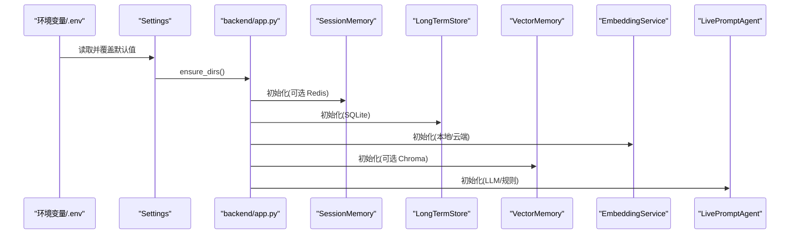
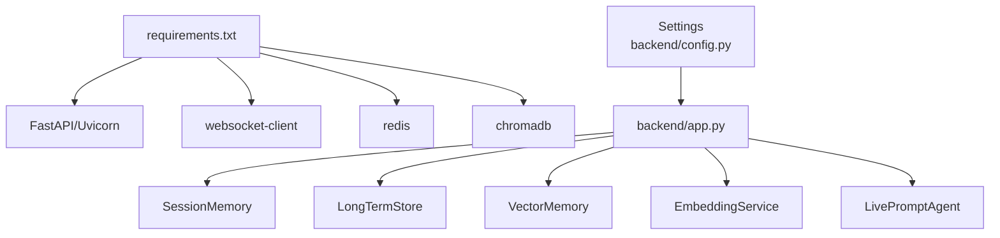

# 配置管理

<cite>
**本文引用的文件**
- [backend/config.py](file://backend/config.py)
- [backend/app.py](file://backend/app.py)
- [backend/services/collector.py](file://backend/services/collector.py)
- [backend/memory/session_memory.py](file://backend/memory/session_memory.py)
- [backend/memory/vector_store.py](file://backend/memory/vector_store.py)
- [backend/memory/embedding_service.py](file://backend/memory/embedding_service.py)
- [backend/memory/long_term.py](file://backend/memory/long_term.py)
- [backend/services/agent.py](file://backend/services/agent.py)
- [backend/schemas/live.py](file://backend/schemas/live.py)
- [tool/config.yaml](file://tool/config.yaml)
- [requirements.txt](file://requirements.txt)
- [README.md](file://README.md)
- [USAGE.md](file://USAGE.md)
</cite>

## 目录
1. [简介](#简介)
2. [项目结构](#项目结构)
3. [核心组件](#核心组件)
4. [架构总览](#架构总览)
5. [详细组件分析](#详细组件分析)
6. [依赖分析](#依赖分析)
7. [性能考量](#性能考量)
8. [故障排查指南](#故障排查指南)
9. [结论](#结论)
10. [附录](#附录)

## 简介
本文件为 DouYin_llm 项目的配置管理文档，聚焦于环境变量优先级与覆盖规则（.env > 当前 shell > 代码默认值）、直播采集配置、后端进程配置、模型与提示词配置、向量与嵌入配置、可选依赖（Redis、Chroma）的启用条件与配置方法、配置验证与错误处理、动态配置更新策略、不同部署环境下的配置策略与安全注意事项，以及性能调优与监控指标建议。

## 项目结构
- 后端配置集中于 backend/config.py，通过 Settings 类统一读取环境变量与默认值，并在应用启动时进行目录创建与解析。
- 后端应用入口 backend/app.py 初始化会话内存、长期存储、向量记忆、嵌入服务与智能代理，并注册 FastAPI 接口。
- 可选依赖通过 requirements.txt 声明，运行时根据配置自动启用或降级。

图表来源
- [backend/config.py:12-113](file://backend/config.py#L12-L113)
- [backend/app.py:24-36](file://backend/app.py#L24-L36)
- [backend/memory/session_memory.py:17-31](file://backend/memory/session_memory.py#L17-L31)
- [backend/memory/vector_store.py:59-84](file://backend/memory/vector_store.py#L59-L84)
- [backend/memory/embedding_service.py:18-48](file://backend/memory/embedding_service.py#L18-L48)
- [backend/services/agent.py:23-60](file://backend/services/agent.py#L23-L60)
- [tool/config.yaml:1-16](file://tool/config.yaml#L1-L16)

章节来源
- [backend/config.py:12-113](file://backend/config.py#L12-L113)
- [backend/app.py:24-36](file://backend/app.py#L24-L36)
- [tool/config.yaml:1-16](file://tool/config.yaml#L1-L16)

## 核心组件
- 环境变量与默认值：Settings 类集中定义所有配置项，优先从 os.getenv 读取，否则采用代码默认值。
- 目录与路径：ensure_dirs 创建 data、SQLite 数据库目录与 Chroma 存储目录。
- LLM 解析：resolved_llm_base_url 与 resolved_llm_model 根据 LLM_MODE 推导最终服务地址与模型名。
- 嵌入签名：embedding_signature 基于 embedding_mode 与 embedding_model 生成向量集合后缀，避免冲突。

章节来源
- [backend/config.py:40-113](file://backend/config.py#L40-L113)

## 架构总览
配置在系统中的流转如下：
- 启动阶段：.env 与当前 shell 环境变量被读取并覆盖默认值；随后应用初始化各组件。
- 运行阶段：组件按配置选择 Redis/Chroma/本地嵌入等能力，异常时自动降级至本地回退方案。
- 动态更新：部分设置（如 LLM 模型与系统提示词）可通过后端接口在线修改并持久化。

图表来源
- [backend/config.py:77-113](file://backend/config.py#L77-L113)
- [backend/app.py:24-36](file://backend/app.py#L24-L36)
- [backend/memory/session_memory.py:17-31](file://backend/memory/session_memory.py#L17-L31)
- [backend/memory/vector_store.py:59-84](file://backend/memory/vector_store.py#L59-L84)
- [backend/memory/embedding_service.py:18-48](file://backend/memory/embedding_service.py#L18-L48)
- [backend/services/agent.py:23-60](file://backend/services/agent.py#L23-L60)

## 详细组件分析

### 环境变量优先级与覆盖规则
- 优先级顺序：.env 文件 > 当前 shell 环境变量 > 代码默认值。
- .env 加载逻辑：项目启动时自动读取根目录 .env，逐行解析 KEY=VALUE，去除引号后写入 os.environ。
- 代码默认值：Settings 中为每个配置项提供合理默认值，确保本地开箱即用。

章节来源
- [backend/config.py:12-37](file://backend/config.py#L12-L37)
- [README.md:95-98](file://README.md#L95-L98)

### 直播采集配置
- ROOM_ID：当前监听的抖音直播间标识，必须与采集端 tool/config.yaml 保持一致。
- COLLECTOR_ENABLED：是否启用内置 DouyinCollector。
- COLLECTOR_HOST / COLLECTOR_PORT：采集端 WebSocket 地址。
- COLLECTOR_PING_INTERVAL_SECONDS：向采集器发送 ping 的间隔。
- COLLECTOR_RECONNECT_DELAY_SECONDS：断线后重连等待时间。
- 采集端 tool/config.yaml：包含端口与 Cookie 配置（可选）。

章节来源
- [backend/config.py:46-51](file://backend/config.py#L46-L51)
- [backend/services/collector.py:54-98](file://backend/services/collector.py#L54-L98)
- [tool/config.yaml:4-16](file://tool/config.yaml#L4-L16)

### 后端进程配置
- APP_HOST / APP_PORT：FastAPI 监听地址。
- SESSION_TTL_SECONDS：SessionMemory 过期时间（秒）。
- REDIS_URL：为空使用进程内内存，设置后启用 Redis SessionMemory。
- 数据目录：DATA_DIR、DATABASE_PATH、CHROMA_DIR。

章节来源
- [backend/config.py:44-56](file://backend/config.py#L44-L56)
- [backend/config.py:52-54](file://backend/config.py#L52-L54)
- [backend/app.py:24](file://backend/app.py#L24)
- [backend/memory/session_memory.py:17-31](file://backend/memory/session_memory.py#L17-L31)

### 模型与提示词配置
- LLM_MODE：可选 heuristic/qwen/openai，决定是否启用在线模型。
- LLM_BASE_URL：OpenAI 兼容 API Endpoint，若为空按 LLM_MODE 推导。
- LLM_MODEL：模型名称，可被前端覆盖。
- LLM_API_KEY / DASHSCOPE_API_KEY：模型鉴权；若为空会尝试兼容 DashScope Key。
- LLM_TIMEOUT_SECONDS / LLM_TEMPERATURE / LLM_MAX_TOKENS：推理超时、温度与最大输出 token。
- LLM 设置持久化：通过 /api/settings/llm 接口保存模型与系统提示词到 SQLite。
- 模型状态：Agent 维护当前模式、模型、后端、结果与错误信息。

章节来源
- [backend/config.py:57-64](file://backend/config.py#L57-L64)
- [backend/services/agent.py:23-60](file://backend/services/agent.py#L23-L60)
- [backend/services/agent.py:302-437](file://backend/services/agent.py#L302-L437)
- [backend/app.py:224-235](file://backend/app.py#L224-L235)

### 向量与嵌入配置
- DATA_DIR / DATABASE_PATH / CHROMA_DIR：数据与索引存储位置。
- EMBEDDING_MODE：cloud/local/hash fallback。
- EMBEDDING_MODEL / EMBEDDING_BASE_URL / EMBEDDING_API_KEY：云端嵌入配置。
- LOCAL_EMBEDDING_DEVICE / LOCAL_EMBEDDING_BATCH_SIZE：本地 SentenceTransformers 设备与批大小。
- 语义检索阈值与召回：SEMANTIC_EVENT_MIN_SCORE / SEMANTIC_MEMORY_MIN_SCORE / SEMANTIC_EVENT_QUERY_LIMIT / SEMANTIC_MEMORY_QUERY_LIMIT / SEMANTIC_FINAL_K。
- 向量集合签名：embedding_signature 用于区分不同嵌入配置的集合。

章节来源
- [backend/config.py:65-76](file://backend/config.py#L65-L76)
- [backend/memory/embedding_service.py:18-102](file://backend/memory/embedding_service.py#L18-L102)
- [backend/memory/vector_store.py:59-108](file://backend/memory/vector_store.py#L59-L108)
- [backend/config.py:106-109](file://backend/config.py#L106-L109)

### 可选依赖与启用条件
- Redis：SessionMemory 在存在 redis 包且 REDIS_URL 非空时启用，否则使用进程内队列。
- Chroma：VectorMemory 在存在 chromadb 包时启用，否则使用内存回退索引。
- 本地嵌入：SentenceTransformers 仅在 embedding_mode=local 时使用，缺失时报错。

章节来源
- [backend/memory/session_memory.py:17-31](file://backend/memory/session_memory.py#L17-L31)
- [backend/memory/vector_store.py:59-84](file://backend/memory/vector_store.py#L59-L84)
- [backend/memory/embedding_service.py:50-63](file://backend/memory/embedding_service.py#L50-L63)
- [requirements.txt:1-6](file://requirements.txt#L1-L6)

### 配置验证与错误处理
- 目录校验：ensure_dirs 自动创建 data、SQLite 与 Chroma 目录。
- LLM 回退：EmbeddingService 与 LivePromptAgent 在云端/本地失败时自动降级至哈希嵌入或启发式规则。
- 网络与解析异常：Agent 对 HTTP 错误、网络错误、超时、JSON 解析失败等情况进行分类记录与状态标记。
- 采集器健壮性：Collector 支持 ping 与重连，断线后按配置延迟重试。

章节来源
- [backend/config.py:77-83](file://backend/config.py#L77-L83)
- [backend/memory/embedding_service.py:33-48](file://backend/memory/embedding_service.py#L33-L48)
- [backend/services/agent.py:302-437](file://backend/services/agent.py#L302-L437)
- [backend/services/collector.py:118-140](file://backend/services/collector.py#L118-L140)

### 动态配置更新
- LLM 设置在线编辑：/api/settings/llm GET/PUT 接口读取与保存模型与系统提示词。
- 房间切换：/api/room 支持运行时切换房间并返回新快照。
- 模型状态上报：/api/events/stream 与 WebSocket /ws/live 推送当前模型状态。

章节来源
- [backend/app.py:224-235](file://backend/app.py#L224-L235)
- [backend/app.py:144-156](file://backend/app.py#L144-L156)
- [backend/app.py:252-285](file://backend/app.py#L252-L285)

### 不同部署环境下的配置策略与安全考虑
- 本地开发：.env 填写 ROOM_ID、LLM_MODE、API Key；可禁用 Redis/Chroma 以简化依赖。
- 生产部署：通过环境变量注入敏感信息（如 API Key），避免硬编码；使用 REDIS_URL 启用跨进程共享；确保 DATA_DIR、DATABASE_PATH、CHROMA_DIR 的持久化卷挂载。
- 安全建议：避免将真实 Cookie 提交到仓库；对 API Key 进行最小权限管理；限制前端可编辑范围，必要时增加鉴权。

章节来源
- [USAGE.md:24-48](file://USAGE.md#L24-L48)
- [README.md:46-53](file://README.md#L46-L53)

## 依赖分析
- 运行时依赖：FastAPI、Uvicorn、WebSocket 客户端、Redis、Chroma。
- 可选依赖：SentenceTransformers（本地嵌入）、redis、chromadb。
- 组件耦合：Settings 作为全局配置源，被 app、collector、memory、agent 等模块广泛依赖。

图表来源
- [requirements.txt:1-6](file://requirements.txt#L1-L6)
- [backend/config.py:40-113](file://backend/config.py#L40-L113)
- [backend/app.py:24-36](file://backend/app.py#L24-L36)

章节来源
- [requirements.txt:1-6](file://requirements.txt#L1-L6)
- [backend/config.py:40-113](file://backend/config.py#L40-L113)

## 性能考量
- 会话内存：Redis 模式下 TTL 控制热数据生命周期；内存模式下使用固定长度队列，避免无限增长。
- 向量检索：通过最小分数与查询上限控制召回规模，Final K 控制最终返回数量；云端嵌入需合理设置超时。
- 本地嵌入：调整 batch size 与设备（CPU/GPU）以平衡吞吐与延迟。
- 采集重连：适当增大 ping 间隔与重连延迟，减少抖动对后端的影响。

章节来源
- [backend/memory/session_memory.py:17-31](file://backend/memory/session_memory.py#L17-L31)
- [backend/memory/vector_store.py:92-108](file://backend/memory/vector_store.py#L92-L108)
- [backend/memory/embedding_service.py:65-73](file://backend/memory/embedding_service.py#L65-L73)
- [backend/services/collector.py:118-140](file://backend/services/collector.py#L118-L140)

## 故障排查指南
- 采集端未启动或房间号不匹配：检查 ROOM_ID 与 tool/config.yaml；确认 WebSocket 地址与端口。
- LLM 失败回退：查看模型状态与错误码；检查 API Key、网络连通性与超时设置。
- 向量检索无效：确认 Chroma 可用与集合签名一致；调整相似度阈值与查询上限。
- Redis/Chroma 缺失：根据 requirements 安装对应包；或接受内存回退模式。

章节来源
- [USAGE.md:198-240](file://USAGE.md#L198-L240)
- [backend/services/agent.py:302-437](file://backend/services/agent.py#L302-L437)
- [backend/memory/vector_store.py:59-84](file://backend/memory/vector_store.py#L59-L84)

## 结论
本配置体系以 .env 为核心入口，结合运行时解析与默认值，实现了灵活可控的部署与运行时行为。通过可选依赖与回退机制，系统在不同环境中均能稳定运行。建议在生产环境强化安全与可观测性，持续优化嵌入与检索参数以提升体验。

## 附录

### 配置项一览与来源
- 直播采集
  - ROOM_ID、COLLECTOR_ENABLED、COLLECTOR_HOST、COLLECTOR_PORT、COLLECTOR_PING_INTERVAL_SECONDS、COLLECTOR_RECONNECT_DELAY_SECONDS
  - 来源：[backend/config.py:46-51](file://backend/config.py#L46-L51)，[tool/config.yaml:4-16](file://tool/config.yaml#L4-L16)
- 后端进程
  - APP_HOST、APP_PORT、SESSION_TTL_SECONDS、REDIS_URL、DATA_DIR、DATABASE_PATH、CHROMA_DIR
  - 来源：[backend/config.py:44-56](file://backend/config.py#L44-L56)，[backend/config.py:52-54](file://backend/config.py#L52-L54)
- 模型与提示词
  - LLM_MODE、LLM_BASE_URL、LLM_MODEL、LLM_API_KEY、DASHSCOPE_API_KEY、LLM_TIMEOUT_SECONDS、LLM_TEMPERATURE、LLM_MAX_TOKENS
  - 来源：[backend/config.py:57-64](file://backend/config.py#L57-L64)，[backend/services/agent.py:23-60](file://backend/services/agent.py#L23-L60)
- 向量与嵌入
  - EMBEDDING_MODE、EMBEDDING_MODEL、EMBEDDING_BASE_URL、EMBEDDING_API_KEY、LOCAL_EMBEDDING_DEVICE、LOCAL_EMBEDDING_BATCH_SIZE、SEMANTIC_* 系列
  - 来源：[backend/config.py:65-76](file://backend/config.py#L65-L76)，[backend/memory/vector_store.py:92-108](file://backend/memory/vector_store.py#L92-L108)
- 可选依赖
  - Redis、Chroma、SentenceTransformers
  - 来源：[requirements.txt:1-6](file://requirements.txt#L1-L6)，[backend/memory/session_memory.py:17-31](file://backend/memory/session_memory.py#L17-L31)，[backend/memory/vector_store.py:59-84](file://backend/memory/vector_store.py#L59-L84)，[backend/memory/embedding_service.py:50-63](file://backend/memory/embedding_service.py#L50-L63)