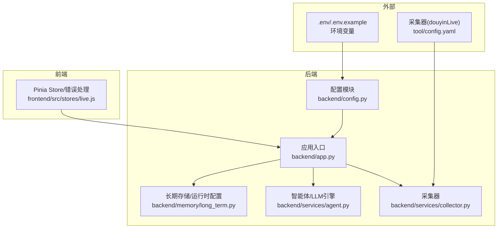
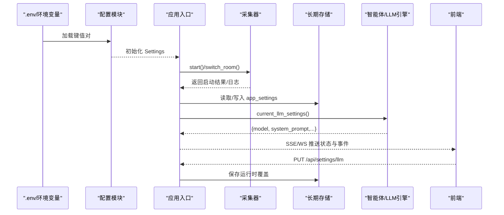
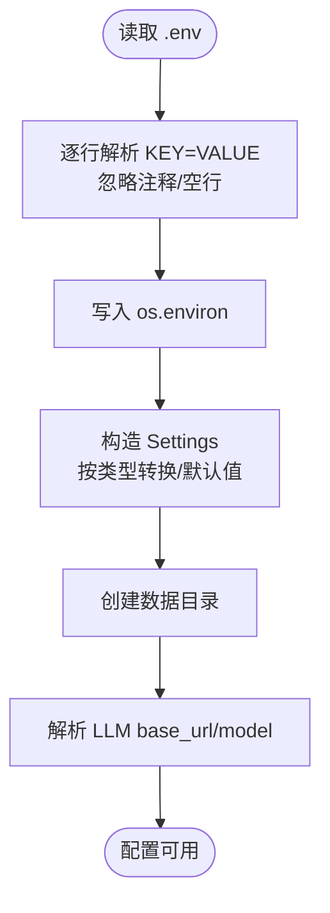
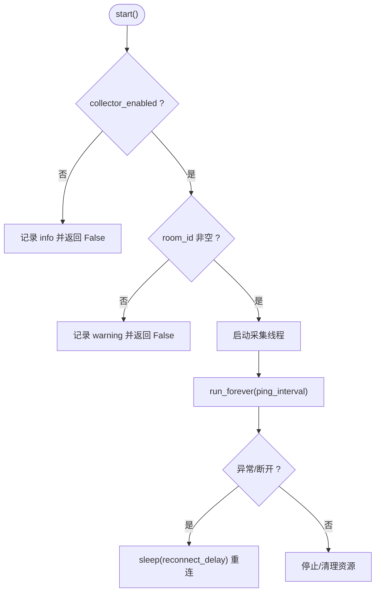
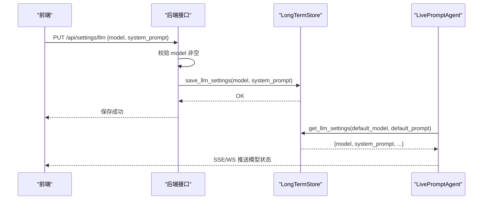
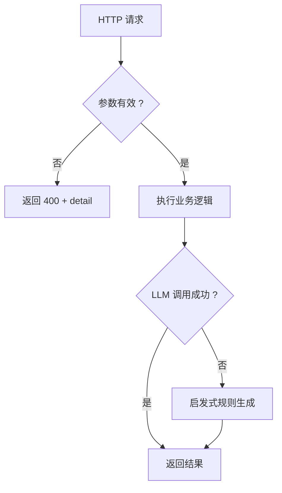
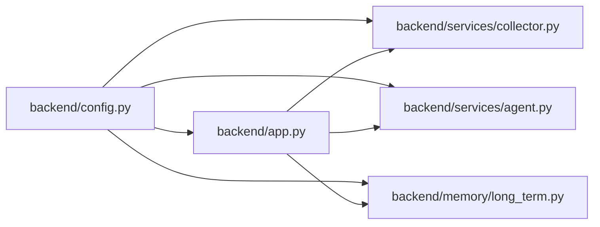

# 配置验证与错误处理

<cite>
**本文引用的文件**
- [backend/config.py](file://backend/config.py)
- [backend/app.py](file://backend/app.py)
- [backend/services/collector.py](file://backend/services/collector.py)
- [backend/services/agent.py](file://backend/services/agent.py)
- [backend/memory/long_term.py](file://backend/memory/long_term.py)
- [tests/test_empty_room_bootstrap.py](file://tests/test_empty_room_bootstrap.py)
- [tests/test_llm_settings.py](file://tests/test_llm_settings.py)
- [README.md](file://README.md)
- [USAGE.md](file://USAGE.md)
- [tool/config.yaml](file://tool/config.yaml)
- [frontend/src/stores/live.js](file://frontend/src/stores/live.js)
- [docs/superpowers/specs/2026-04-13-llm-settings-design.md](file://docs/superpowers/specs/2026-04-13-llm-settings-design.md)
</cite>

## 目录
1. [简介](#简介)
2. [项目结构](#项目结构)
3. [核心组件](#核心组件)
4. [架构总览](#架构总览)
5. [详细组件分析](#详细组件分析)
6. [依赖分析](#依赖分析)
7. [性能考量](#性能考量)
8. [故障排查指南](#故障排查指南)
9. [结论](#结论)
10. [附录](#附录)

## 简介
本文件聚焦于 DouYin_llm 项目的配置验证与错误处理机制，涵盖以下方面：
- 配置项的验证规则与数据类型检查
- 配置加载失败时的错误处理策略与降级方案
- 无效配置的检测方法与错误信息格式
- 配置兼容性检查与版本升级时的迁移指南
- 配置安全验证（敏感信息加密、访问控制）
- 配置变更的回滚机制与应急处理流程
- 配置问题的诊断工具与调试方法
- 常见配置错误的解决方案与预防措施

## 项目结构
后端配置主要集中在 backend/config.py，应用入口在 backend/app.py，采集器在 backend/services/collector.py，LLM 提示词与运行时配置持久化在 backend/memory/long_term.py，前端通过 SSE/WebSocket 订阅后端状态与事件。

**图表来源**
- [backend/config.py:1-113](file://backend/config.py#L1-L113)
- [backend/app.py:1-285](file://backend/app.py#L1-L285)
- [backend/services/collector.py:1-200](file://backend/services/collector.py#L1-L200)
- [backend/services/agent.py:1-200](file://backend/services/agent.py#L1-L200)
- [backend/memory/long_term.py:1-200](file://backend/memory/long_term.py#L1-L200)
- [frontend/src/stores/live.js:482-515](file://frontend/src/stores/live.js#L482-L515)
- [tool/config.yaml:1-16](file://tool/config.yaml#L1-L16)

**章节来源**
- [backend/config.py:1-113](file://backend/config.py#L1-L113)
- [backend/app.py:1-285](file://backend/app.py#L1-L285)
- [README.md:1-223](file://README.md#L1-L223)

## 核心组件
- 配置加载与解析：优先从 .env 与环境变量读取，其次使用代码默认值，确保本地开箱即用。
- 采集器启动策略：当 ROOM_ID 为空或禁用时，采集器跳过启动并记录警告日志。
- LLM 设置持久化：通过 SQLite 表 app_settings 存储运行时覆盖项，支持前端在线修改并持久化。
- 错误处理与降级：HTTP 接口对必填参数进行校验并返回 400；LLM 失败时回退启发式规则；前端通过 SSE/WS 自动重连与状态提示。

**章节来源**
- [backend/config.py:40-113](file://backend/config.py#L40-L113)
- [backend/services/collector.py:61-99](file://backend/services/collector.py#L61-L99)
- [backend/memory/long_term.py:176-181](file://backend/memory/long_term.py#L176-L181)
- [backend/app.py:144-156](file://backend/app.py#L144-L156)
- [backend/services/agent.py:37-60](file://backend/services/agent.py#L37-L60)

## 架构总览
下图展示了配置加载、采集器启动、LLM 设置覆盖与错误处理的整体流程。

**图表来源**
- [backend/config.py:12-37](file://backend/config.py#L12-L37)
- [backend/app.py:24-35](file://backend/app.py#L24-L35)
- [backend/services/collector.py:61-99](file://backend/services/collector.py#L61-L99)
- [backend/memory/long_term.py:176-181](file://backend/memory/long_term.py#L176-L181)
- [backend/services/agent.py:48-59](file://backend/services/agent.py#L48-L59)
- [frontend/src/stores/live.js:482-515](file://frontend/src/stores/live.js#L482-L515)

## 详细组件分析

### 配置加载与验证规则
- 优先级：.env/.env.example > 环境变量 > 代码默认值
- 数据类型转换：整数、浮点数、布尔值、路径对象均通过显式转换实现，避免字符串导致的运行时异常
- 目录确保：运行前自动创建 data、SQLite 目录、Chroma 目录
- LLM 解析：根据 LLM_MODE 推导 base_url 与 model 名称，确保兼容不同供应商
- 嵌入签名：基于 embedding_mode 与 embedding_model 生成稳定签名，便于缓存与重建

**图表来源**
- [backend/config.py:12-37](file://backend/config.py#L12-L37)
- [backend/config.py:77-113](file://backend/config.py#L77-L113)

**章节来源**
- [backend/config.py:12-37](file://backend/config.py#L12-L37)
- [backend/config.py:40-113](file://backend/config.py#L40-L113)
- [README.md:95-142](file://README.md#L95-L142)

### 采集器启动与错误处理
- 启动条件：collector_enabled 为真且 ROOM_ID 非空，否则跳过并记录日志
- 连接与重连：WebSocket 运行时捕获异常并按 ping 间隔重连，断线记录 warning
- 房间切换：switch_room 校验非空，失败抛出异常；成功后更新 settings.room_id 并重启采集
- 事件处理：丢弃非 JSON 消息；事件处理异常记录日志但不中断主线程

**图表来源**
- [backend/services/collector.py:61-99](file://backend/services/collector.py#L61-L99)
- [backend/services/collector.py:118-140](file://backend/services/collector.py#L118-L140)
- [backend/services/collector.py:145-196](file://backend/services/collector.py#L145-L196)

**章节来源**
- [backend/services/collector.py:61-99](file://backend/services/collector.py#L61-L99)
- [backend/services/collector.py:118-140](file://backend/services/collector.py#L118-L140)
- [tests/test_empty_room_bootstrap.py:25-48](file://tests/test_empty_room_bootstrap.py#L25-L48)

### LLM 设置持久化与覆盖
- 运行时覆盖：app_settings 表存储 llm_model_override 与 system_prompt_override
- 优先级：SQLite 覆盖 > .env 默认值 > 代码兜底
- 接口约束：PUT /api/settings/llm 校验 model 非空，允许 system_prompt 为空并回退默认
- 测试验证：覆盖项持久化与回退行为通过单元测试覆盖

**图表来源**
- [backend/app.py:229-235](file://backend/app.py#L229-L235)
- [backend/memory/long_term.py:176-181](file://backend/memory/long_term.py#L176-L181)
- [backend/services/agent.py:48-59](file://backend/services/agent.py#L48-L59)
- [docs/superpowers/specs/2026-04-13-llm-settings-design.md:137-166](file://docs/superpowers/specs/2026-04-13-llm-settings-design.md#L137-L166)
- [tests/test_llm_settings.py:24-63](file://tests/test_llm_settings.py#L24-L63)

**章节来源**
- [backend/app.py:229-235](file://backend/app.py#L229-L235)
- [backend/memory/long_term.py:176-181](file://backend/memory/long_term.py#L176-L181)
- [backend/services/agent.py:48-59](file://backend/services/agent.py#L48-L59)
- [docs/superpowers/specs/2026-04-13-llm-settings-design.md:137-166](file://docs/superpowers/specs/2026-04-13-llm-settings-design.md#L137-L166)
- [tests/test_llm_settings.py:24-63](file://tests/test_llm_settings.py#L24-L63)

### 错误处理与降级策略
- HTTP 参数校验：/api/room、/api/viewer/notes 等接口对必填字段进行校验并返回 400
- LLM 失败降级：智能体在 LLM 调用失败或命中关键词时回退启发式规则
- 前端错误展示：Store 从响应体提取 detail 或回退到状态文本，统一错误呈现
- SSE/WS 自动重连：前端监听 onerror 并进入重连状态，onopen 切换为 live

**图表来源**
- [backend/app.py:144-156](file://backend/app.py#L144-L156)
- [backend/app.py:196-222](file://backend/app.py#L196-L222)
- [backend/services/agent.py:105-142](file://backend/services/agent.py#L105-L142)
- [frontend/src/stores/live.js:197-212](file://frontend/src/stores/live.js#L197-L212)
- [frontend/src/stores/live.js:482-515](file://frontend/src/stores/live.js#L482-L515)

**章节来源**
- [backend/app.py:144-156](file://backend/app.py#L144-L156)
- [backend/app.py:196-222](file://backend/app.py#L196-L222)
- [backend/services/agent.py:105-142](file://backend/services/agent.py#L105-L142)
- [frontend/src/stores/live.js:197-212](file://frontend/src/stores/live.js#L197-L212)
- [frontend/src/stores/live.js:482-515](file://frontend/src/stores/live.js#L482-L515)

### 配置安全验证与访问控制
- 敏感信息处理：LLM_API_KEY/DASHSCOPE_API_KEY 通过环境变量注入，避免硬编码
- 访问控制：后端与前端当前为公开接口，未实现鉴权与多租户隔离，建议在生产环境增加认证与授权
- Cookie 安全：采集器配置文件中包含 Cookie 示例，强调不可提交至仓库，应使用本地私有配置

**章节来源**
- [backend/config.py:60-61](file://backend/config.py#L60-L61)
- [README.md:209-211](file://README.md#L209-L211)
- [tool/config.yaml:10-16](file://tool/config.yaml#L10-L16)

### 配置兼容性检查与迁移指南
- 兼容性：LLM_MODE 与 resolved_llm_base_url/resolved_llm_model 的映射确保不同供应商的兼容
- 迁移策略：新增 app_settings 表作为运行时覆盖层，升级时保留 .env 默认值与代码兜底，避免破坏性变更
- 版本升级：建议在升级前备份 data/live_prompter.db，升级后验证 /health 与 /api/settings/llm 接口

**章节来源**
- [backend/config.py:84-104](file://backend/config.py#L84-L104)
- [backend/memory/long_term.py:176-181](file://backend/memory/long_term.py#L176-L181)
- [README.md:95-142](file://README.md#L95-L142)

### 配置变更回滚与应急处理
- 回滚策略：删除 app_settings 中的覆盖项即可回退到 .env 默认值；若需彻底回滚，可删除 data/live_prompter.db 并重建
- 应急处理：采集器断线时自动重连；前端检测到错误进入重连状态；后端记录异常日志并继续运行
- 降级方案：LLM 失败时回退启发式规则；采集器禁用或 ROOM_ID 为空时跳过采集

**章节来源**
- [backend/services/collector.py:118-140](file://backend/services/collector.py#L118-L140)
- [backend/services/agent.py:105-142](file://backend/services/agent.py#L105-L142)
- [tests/test_empty_room_bootstrap.py:25-48](file://tests/test_empty_room_bootstrap.py#L25-L48)

## 依赖分析
- 配置模块被应用入口与各服务模块依赖，形成中心化配置源
- 采集器依赖 Settings 的 ROOM_ID、HOST、PORT、PING 间隔与重连延迟
- 智能体依赖 Settings 的 LLM_MODE、base_url、model、超时与最大 token
- 长期存储依赖 SQLite 文件路径与 app_settings 表结构

**图表来源**
- [backend/config.py:1-113](file://backend/config.py#L1-L113)
- [backend/app.py:13-35](file://backend/app.py#L13-L35)
- [backend/services/collector.py:16-53](file://backend/services/collector.py#L16-L53)
- [backend/services/agent.py:23-28](file://backend/services/agent.py#L23-L28)
- [backend/memory/long_term.py:44-47](file://backend/memory/long_term.py#L44-L47)

**章节来源**
- [backend/config.py:1-113](file://backend/config.py#L1-L113)
- [backend/app.py:13-35](file://backend/app.py#L13-L35)
- [backend/services/collector.py:16-53](file://backend/services/collector.py#L16-L53)
- [backend/services/agent.py:23-28](file://backend/services/agent.py#L23-L28)
- [backend/memory/long_term.py:44-47](file://backend/memory/long_term.py#L44-L47)

## 性能考量
- 配置解析：.env 逐行扫描与正则清洗，建议保持 .env 简洁，避免过多注释与空行
- 采集器：ping_interval 与 reconnect_delay 影响网络抖动下的稳定性；建议根据网络质量调整
- LLM：max_tokens 与 temperature 影响生成时延与稳定性；建议结合业务场景优化
- 存储：SQLite journal_mode 调整与索引重建有助于提升写入性能

[本节为通用指导，无需列出具体文件来源]

## 故障排查指南
- 配置加载失败
  - 现象：采集器未启动、房间号为空、健康检查异常
  - 排查：检查 .env 是否存在、KEY=VALUE 格式是否正确、环境变量是否覆盖
  - 参考：[backend/config.py:12-37](file://backend/config.py#L12-L37)，[tests/test_empty_room_bootstrap.py:14-23](file://tests/test_empty_room_bootstrap.py#L14-L23)
- LLM 设置保存失败
  - 现象：PUT /api/settings/llm 返回 400
  - 排查：确认 model 非空；system_prompt 可为空但会被回退默认
  - 参考：[backend/app.py:229-235](file://backend/app.py#L229-L235)，[docs/superpowers/specs/2026-04-13-llm-settings-design.md:137-166](file://docs/superpowers/specs/2026-04-13-llm-settings-design.md#L137-L166)
- 采集器断线/重连
  - 现象：前端状态变为 reconnecting，后端日志出现 warning
  - 排查：检查 HOST/PORT、网络连通性、ping_interval 与 reconnect_delay
  - 参考：[backend/services/collector.py:118-140](file://backend/services/collector.py#L118-L140)，[frontend/src/stores/live.js:482-515](file://frontend/src/stores/live.js#L482-L515)
- LLM 失败降级
  - 现象：顶部状态显示 fallback
  - 排查：检查 API Key、网络访问、超时与限流
  - 参考：[backend/services/agent.py:105-142](file://backend/services/agent.py#L105-L142)，[USAGE.md:209-218](file://USAGE.md#L209-L218)
- 数据库与索引
  - 现象：写入失败或性能下降
  - 排查：确认 SQLite 文件路径、journal_mode、索引是否存在
  - 参考：[backend/memory/long_term.py:44-54](file://backend/memory/long_term.py#L44-L54)，[README.md:195-197](file://README.md#L195-L197)

**章节来源**
- [backend/config.py:12-37](file://backend/config.py#L12-L37)
- [tests/test_empty_room_bootstrap.py:14-23](file://tests/test_empty_room_bootstrap.py#L14-L23)
- [backend/app.py:229-235](file://backend/app.py#L229-L235)
- [docs/superpowers/specs/2026-04-13-llm-settings-design.md:137-166](file://docs/superpowers/specs/2026-04-13-llm-settings-design.md#L137-L166)
- [backend/services/collector.py:118-140](file://backend/services/collector.py#L118-L140)
- [frontend/src/stores/live.js:482-515](file://frontend/src/stores/live.js#L482-L515)
- [backend/services/agent.py:105-142](file://backend/services/agent.py#L105-L142)
- [USAGE.md:209-218](file://USAGE.md#L209-L218)
- [backend/memory/long_term.py:44-54](file://backend/memory/long_term.py#L44-L54)
- [README.md:195-197](file://README.md#L195-L197)

## 结论
本项目通过中心化配置、严格的类型转换与默认值、运行时覆盖与降级策略，实现了较为稳健的配置体系。建议在生产环境中补充鉴权与审计、敏感信息加密与最小权限原则，并建立完善的配置变更审批与回滚流程，以进一步提升安全性与可维护性。

[本节为总结性内容，无需列出具体文件来源]

## 附录
- 常用配置项与默认值参考：[README.md:95-142](file://README.md#L95-L142)
- 快速上手与调试：[USAGE.md:1-256](file://USAGE.md#L1-L256)
- 采集器配置示例：[tool/config.yaml:1-16](file://tool/config.yaml#L1-L16)