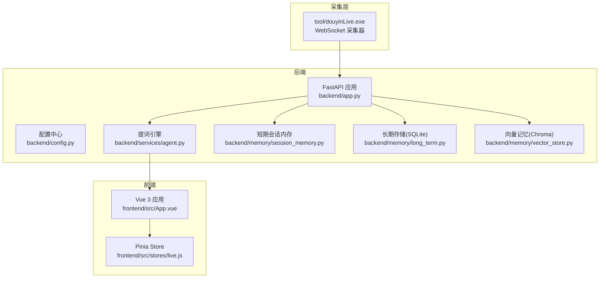
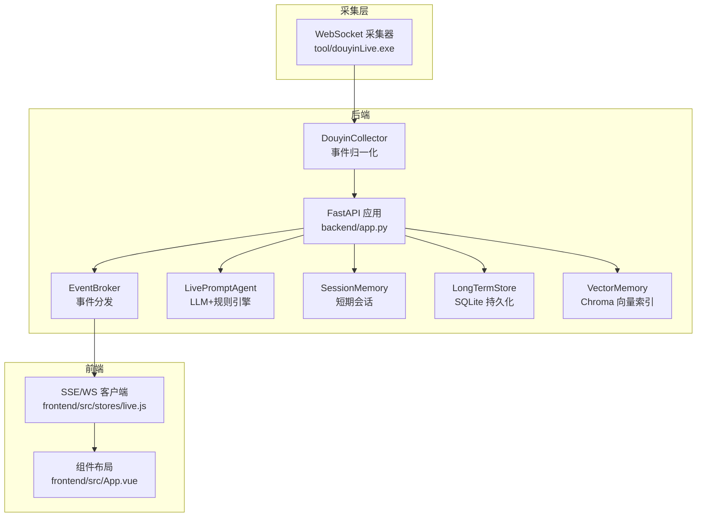
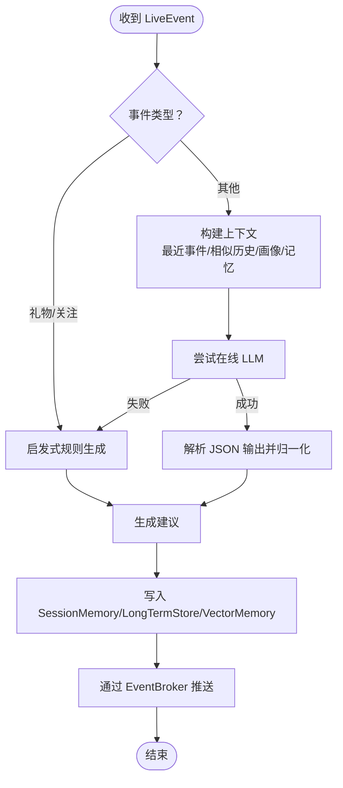
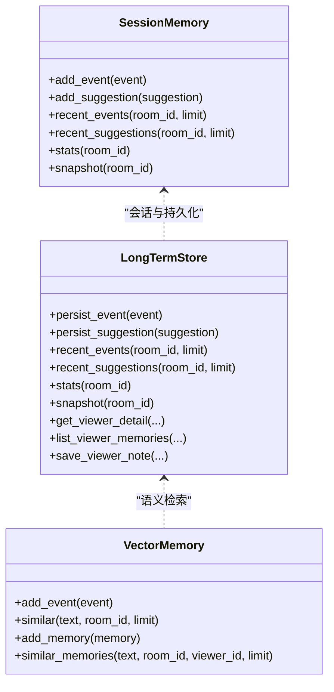
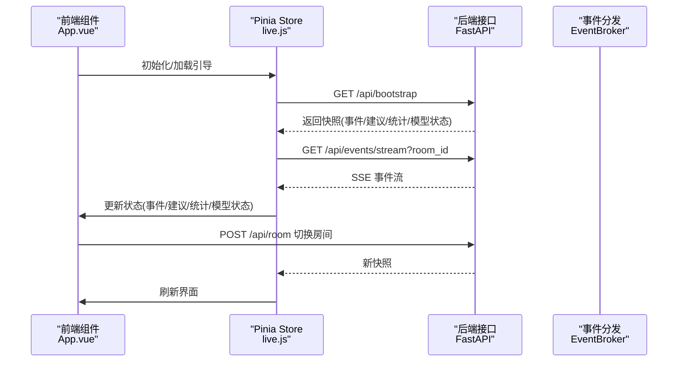
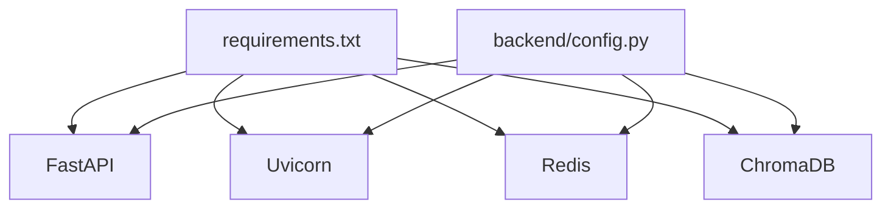

# 项目概述

<cite>
**本文引用的文件**
- [README.md](file://README.md)
- [USAGE.md](file://USAGE.md)
- [backend/app.py](file://backend/app.py)
- [backend/config.py](file://backend/config.py)
- [backend/services/agent.py](file://backend/services/agent.py)
- [backend/memory/session_memory.py](file://backend/memory/session_memory.py)
- [backend/memory/long_term.py](file://backend/memory/long_term.py)
- [backend/memory/vector_store.py](file://backend/memory/vector_store.py)
- [backend/schemas/live.py](file://backend/schemas/live.py)
- [frontend/src/App.vue](file://frontend/src/App.vue)
- [frontend/src/main.js](file://frontend/src/main.js)
- [frontend/src/stores/live.js](file://frontend/src/stores/live.js)
- [requirements.txt](file://requirements.txt)
- [tests/test_agent.py](file://tests/test_agent.py)
- [tests/test_embedding_service.py](file://tests/test_embedding_service.py)
</cite>

## 目录
1. [简介](#简介)
2. [项目结构](#项目结构)
3. [核心组件](#核心组件)
4. [架构总览](#架构总览)
5. [详细组件分析](#详细组件分析)
6. [依赖关系分析](#依赖关系分析)
7. [性能考量](#性能考量)
8. [故障排查指南](#故障排查指南)
9. [结论](#结论)
10. [附录](#附录)

## 简介
DouYin_llm 实时直播智能提词系统是一套面向抖音直播间的实时提词工作栈，目标是将抖音直播的原始事件流（评论、礼物、关注等）转换为结构化数据，结合 LLM 与启发式规则生成提词建议，并通过前端仪表板实时展示，帮助主播在直播过程中获得即时、连贯且个性化的发言建议。

系统由三部分组成：
- 采集层：本地 WebSocket 采集器（tool/douyinLive-windows-amd64.exe）抓取抖音直播事件并转发至后端。
- 后端：FastAPI 服务，负责事件归一化、持久化、记忆抽取、提词生成与实时推送。
- 前端：Vue 3 应用，通过 Pinia Store 管理状态，以多面板形式展示状态条、主提词卡、事件流与观众工坊。

项目强调“可选依赖”与“双通道提词”：当在线 LLM 可用时优先使用，失败或特定场景下自动回退到启发式规则，兼顾稳定性与时延；同时提供语义记忆系统（短期会话、长期 SQLite、向量 Chroma）与多面板前端布局，满足不同使用场景。

## 项目结构
项目采用“后端/前端/工具/文档/测试”的分层组织方式，便于独立开发与部署：
- backend：后端服务与数据层，包含 FastAPI 应用、配置、服务与内存模块。
- frontend：Vue 3 前端应用，包含组件、状态管理与国际化。
- tool：采集器可执行文件与配置示例。
- tests：后端与嵌入服务的单元测试。
- docs/superpowers：设计稿与实施计划。
- data/logs：数据与日志目录（按需创建）。

图示来源
- [backend/app.py:108-127](file://backend/app.py#L108-L127)
- [backend/config.py:40-113](file://backend/config.py#L40-L113)
- [backend/services/agent.py:23-60](file://backend/services/agent.py#L23-L60)
- [backend/memory/session_memory.py:17-113](file://backend/memory/session_memory.py#L17-L113)
- [backend/memory/long_term.py:44-187](file://backend/memory/long_term.py#L44-L187)
- [backend/memory/vector_store.py:59-85](file://backend/memory/vector_store.py#L59-L85)
- [frontend/src/App.vue:1-139](file://frontend/src/App.vue#L1-L139)
- [frontend/src/stores/live.js:75-846](file://frontend/src/stores/live.js#L75-L846)

章节来源
- [README.md:32-44](file://README.md#L32-L44)
- [USAGE.md:1-256](file://USAGE.md#L1-L256)

## 核心组件
- 采集器（DouyinCollector）
  - 与本地 WebSocket 采集器对接，接收并标准化为统一的 LiveEvent，随后交由事件处理流程。
- FastAPI 应用（backend/app.py）
  - 提供健康检查、房间切换、事件注入、观众画像与笔记、LLM 设置、SSE/WS 实时流等接口。
- 提词引擎（LivePromptAgent）
  - 根据事件类型与上下文决定是否调用在线 LLM；失败或命中特定关键词时回退启发式规则；生成结构化建议并附带置信度与来源。
- 记忆系统
  - SessionMemory：短期会话（Redis/内存），用于最近事件与建议的快速读写。
  - LongTermStore：SQLite 存储，持久化事件、建议、观众画像、礼物、会话、笔记与记忆。
  - VectorMemory：Chroma 向量索引，支持事件历史与观众记忆的语义检索。
- 前端仪表板（Vue 3 + Pinia）
  - 包含状态条、主提词卡、事件流、观众工坊与 LLM 设置面板，支持过滤、切换房间、主题与语言切换、笔记 CRUD。

章节来源
- [backend/app.py:73-102](file://backend/app.py#L73-L102)
- [backend/services/agent.py:105-142](file://backend/services/agent.py#L105-L142)
- [backend/memory/session_memory.py:42-113](file://backend/memory/session_memory.py#L42-L113)
- [backend/memory/long_term.py:454-557](file://backend/memory/long_term.py#L454-L557)
- [backend/memory/vector_store.py:149-317](file://backend/memory/vector_store.py#L149-L317)
- [frontend/src/App.vue:67-139](file://frontend/src/App.vue#L67-L139)
- [frontend/src/stores/live.js:440-523](file://frontend/src/stores/live.js#L440-L523)

## 架构总览
系统采用“采集-后端-前端”的三层架构，数据在后端完成归一化、持久化与语义检索，再通过 SSE/WS 推送到前端，形成闭环。

图示来源
- [backend/app.py:105-127](file://backend/app.py#L105-L127)
- [backend/services/agent.py:23-60](file://backend/services/agent.py#L23-L60)
- [backend/memory/session_memory.py:17-113](file://backend/memory/session_memory.py#L17-L113)
- [backend/memory/long_term.py:44-187](file://backend/memory/long_term.py#L44-L187)
- [backend/memory/vector_store.py:59-85](file://backend/memory/vector_store.py#L59-L85)
- [frontend/src/stores/live.js:474-523](file://frontend/src/stores/live.js#L474-L523)
- [frontend/src/App.vue:67-139](file://frontend/src/App.vue#L67-L139)

## 详细组件分析

### 提词引擎（LivePromptAgent）
- 双通道生成策略
  - 在线 LLM：优先尝试 OpenAI 兼容接口；失败或命中关键词时回退启发式规则。
  - 启发式规则：针对礼物、关注、价格/购买咨询、身材/健身等场景给出高置信度建议。
- 上下文构建
  - 结合最近事件、相似历史互动、用户画像与观众记忆，提升建议的连贯性与个性化。
- 输出结构
  - 返回结构化建议，包含优先级、回复文本、语气、理由、置信度与引用来源。

图示来源
- [backend/services/agent.py:105-142](file://backend/services/agent.py#L105-L142)
- [backend/services/agent.py:200-217](file://backend/services/agent.py#L200-L217)
- [backend/services/agent.py:228-300](file://backend/services/agent.py#L228-L300)
- [backend/app.py:73-102](file://backend/app.py#L73-L102)

章节来源
- [backend/services/agent.py:23-60](file://backend/services/agent.py#L23-L60)
- [backend/services/agent.py:83-142](file://backend/services/agent.py#L83-L142)
- [tests/test_agent.py:41-176](file://tests/test_agent.py#L41-L176)

### 记忆系统（SessionMemory/LongTermStore/VectorMemory）
- SessionMemory
  - 优先使用 Redis；若不可用则回退到进程内队列，保证短期事件与建议的高效读写与 TTL 控制。
- LongTermStore（SQLite）
  - 表结构覆盖事件、建议、观众画像、礼物、会话、笔记与记忆；提供索引与聚合查询，支持增量重建与列迁移。
- VectorMemory（Chroma）
  - 事件历史与观众记忆的向量检索；支持本地哈希嵌入作为降级方案；提供相似度评分与重排序逻辑。

图示来源
- [backend/memory/session_memory.py:17-113](file://backend/memory/session_memory.py#L17-L113)
- [backend/memory/long_term.py:44-187](file://backend/memory/long_term.py#L44-L187)
- [backend/memory/vector_store.py:59-317](file://backend/memory/vector_store.py#L59-L317)

章节来源
- [backend/memory/session_memory.py:17-113](file://backend/memory/session_memory.py#L17-L113)
- [backend/memory/long_term.py:454-557](file://backend/memory/long_term.py#L454-L557)
- [backend/memory/vector_store.py:149-317](file://backend/memory/vector_store.py#L149-L317)

### 前端仪表板（Vue 3 + Pinia）
- 布局与组件
  - 顶部状态条展示连接、模型、统计；中间主提词卡展示当前建议；右侧事件流支持筛选与清空；底部观众工坊支持查看与编辑笔记。
- 状态管理
  - Pinia Store 统一管理房间号、过滤器、主题/语言、ViewerWorkbench 状态与 LLM 设置；通过 SSE/WS 实时订阅事件与建议。
- 交互与体验
  - 支持切换房间、主题切换、语言切换、笔记增删改；错误提示与加载状态完善。

图示来源
- [frontend/src/App.vue:47-64](file://frontend/src/App.vue#L47-L64)
- [frontend/src/stores/live.js:440-523](file://frontend/src/stores/live.js#L440-L523)
- [backend/app.py:138-156](file://backend/app.py#L138-L156)
- [backend/app.py:252-271](file://backend/app.py#L252-L271)

章节来源
- [frontend/src/App.vue:67-139](file://frontend/src/App.vue#L67-L139)
- [frontend/src/stores/live.js:75-846](file://frontend/src/stores/live.js#L75-L846)

## 依赖关系分析
- 后端依赖
  - FastAPI、Uvicorn、websocket-client、Redis、ChromaDB（可选）。
- 配置优先级
  - .env > 环境变量 > 代码默认值；支持 LLM 模式、嵌入模式、会话 TTL、向量检索阈值等。
- 数据与日志
  - SQLite 文件与 Chroma 目录位于 data/；日志目录 logs/。

图示来源
- [requirements.txt:1-6](file://requirements.txt#L1-L6)
- [backend/config.py:40-113](file://backend/config.py#L40-L113)

章节来源
- [requirements.txt:1-6](file://requirements.txt#L1-L6)
- [backend/config.py:40-113](file://backend/config.py#L40-L113)

## 性能考量
- 事件吞吐与延迟
  - SessionMemory 使用 Redis 或内存队列，限制窗口长度与 TTL，降低内存占用与 GC 压力。
- LLM 调用
  - 提供超时与回退机制，避免阻塞主线程；对 JSON 解析与字段校验进行严格约束，减少无效重试。
- 向量检索
  - 向量索引支持本地哈希嵌入降级；相似度阈值与召回数量可配置，平衡召回质量与性能。
- 前端渲染
  - 事件与建议列表限制最大长度，避免 DOM 压力；SSE/WS 仅推送必要字段，减少带宽与解析开销。

## 故障排查指南
- 页面无建议
  - 检查采集器是否启动、房间号是否正确、直播间是否开播、后端是否已重启。
- 模型状态显示 fallback
  - 检查 API Key、网络连通性、是否触发超时或限流。
- 模型状态显示 heuristic
  - 检查 LLM_MODE 是否被设置为 heuristic 或 .env 未正确加载。
- 前端无法打开
  - 检查前端端口占用与启动脚本。
- 后端启动但无数据
  - 查看后端日志是否连接到采集器 WebSocket，确认房间是否有消息。

章节来源
- [USAGE.md:130-256](file://USAGE.md#L130-L256)

## 结论
DouYin_llm 实时直播智能提词系统通过“采集-后端-前端”的清晰分层，实现了从原始直播事件到结构化建议的全链路闭环。其创新点包括：
- 语义记忆系统：短期会话、长期 SQLite 与向量 Chroma 的组合，既保证实时性又支持语义检索。
- 双通道提词：在线 LLM 与启发式规则并行，失败即回退，兼顾稳定性与时延。
- 多面板前端：状态条、主提词卡、事件流、观众工坊与 LLM 设置面板，满足主播在不同场景下的需求。

该系统适合个人直播排练与小型团队使用，后续可扩展多房间调度、跨平台采集、观测面与模型管理策略。

## 附录
- 快速上手
  - 启动采集器、准备 .env、安装依赖、启动后端与前端，或使用封装脚本一键启动。
- 接口速查
  - 健康检查、引导数据、房间切换、事件注入、观众画像与笔记、LLM 设置、SSE/WS 实时流等。
- 测试参考
  - 提词引擎与嵌入服务的单元测试覆盖关键分支与边界条件。

章节来源
- [README.md:54-166](file://README.md#L54-L166)
- [USAGE.md:24-122](file://USAGE.md#L24-L122)
- [tests/test_agent.py:1-176](file://tests/test_agent.py#L1-L176)
- [tests/test_embedding_service.py:1-83](file://tests/test_embedding_service.py#L1-L83)