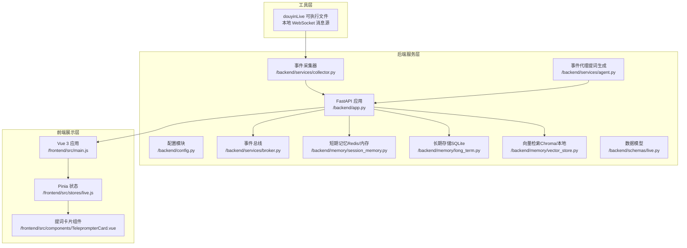
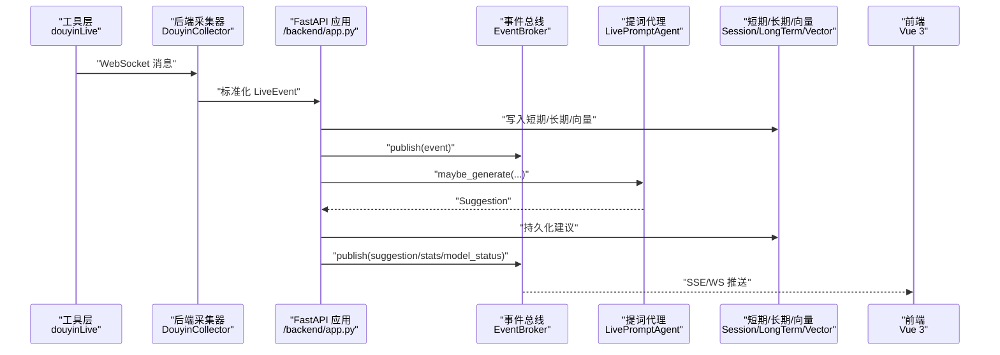
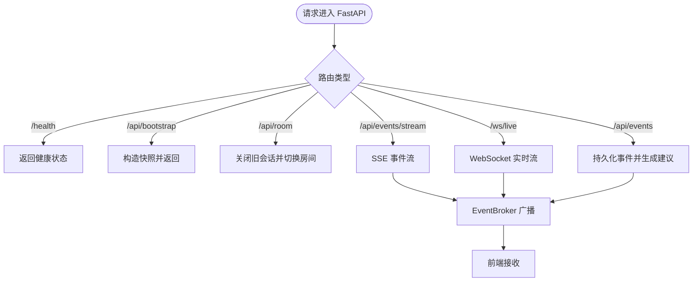
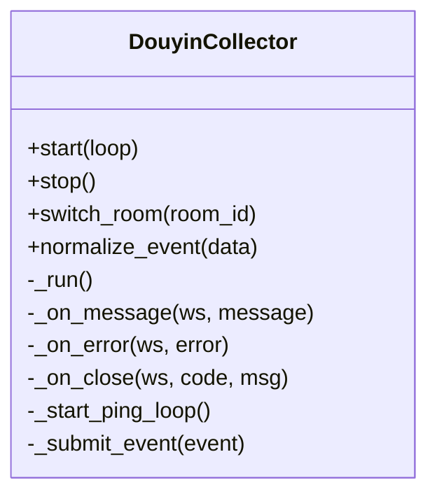
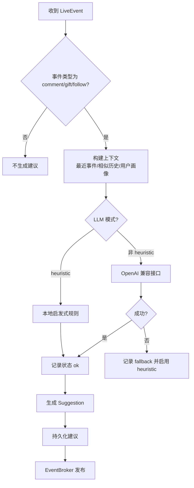
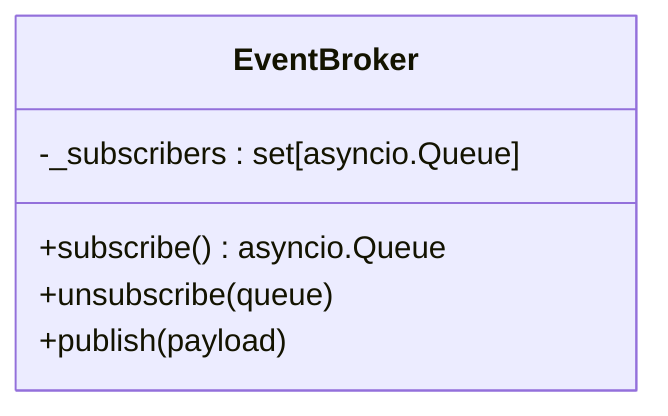
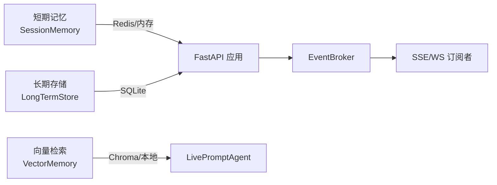
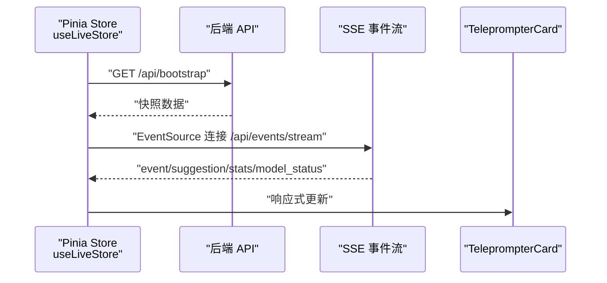

# 技术架构概览

<cite>
**本文档引用的文件**
- [README.md](file://README.md)
- [backend/app.py](file://backend/app.py)
- [backend/config.py](file://backend/config.py)
- [backend/services/collector.py](file://backend/services/collector.py)
- [backend/services/agent.py](file://backend/services/agent.py)
- [backend/services/broker.py](file://backend/services/broker.py)
- [backend/memory/session_memory.py](file://backend/memory/session_memory.py)
- [backend/memory/long_term.py](file://backend/memory/long_term.py)
- [backend/memory/vector_store.py](file://backend/memory/vector_store.py)
- [backend/schemas/live.py](file://backend/schemas/live.py)
- [frontend/src/main.js](file://frontend/src/main.js)
- [frontend/src/stores/live.js](file://frontend/src/stores/live.js)
- [frontend/src/components/TeleprompterCard.vue](file://frontend/src/components/TeleprompterCard.vue)
- [frontend/package.json](file://frontend/package.json)
- [requirements.txt](file://requirements.txt)
- [tool/config.yaml](file://tool/config.yaml)
- [start_all.ps1](file://start_all.ps1)
</cite>

## 目录
1. [简介](#简介)
2. [项目结构](#项目结构)
3. [核心组件](#核心组件)
4. [架构总览](#架构总览)
5. [详细组件分析](#详细组件分析)
6. [依赖关系分析](#依赖关系分析)
7. [性能考量](#性能考量)
8. [故障排查指南](#故障排查指南)
9. [结论](#结论)
10. [附录](#附录)

## 简介
本项目是一个面向抖音直播场景的实时提词器，采用三层架构设计：
- 工具层（douyinLive）：负责连接直播间并通过本地 WebSocket 暴露消息源
- 后端服务层（FastAPI）：负责事件采集、短期记忆、长期存储、向量检索、提词建议生成与前端推送
- 前端展示层（Vue.js）：负责事件流展示、提词建议呈现、房间切换与主题切换

系统从本地 WebSocket 消息源采集直播事件，经后端标准化与处理后，通过 SSE/WS 实时推送到前端，形成“本地消息源 → 后端API → 前端展示”的完整链路。

## 项目结构
项目采用按层与按功能混合的组织方式：
- backend：后端服务，包含 FastAPI 应用、配置、服务与内存模块
- frontend：Vue 3 前端应用，使用 Pinia 状态管理与 Tailwind 样式
- tool：抖音直播消息源工具（可执行文件）
- data：运行期数据目录（SQLite 与 Chroma 向量库）
- 根目录脚本：一键启动与环境配置

图表来源
- [backend/app.py:1-220](file://backend/app.py#L1-L220)
- [backend/config.py:1-94](file://backend/config.py#L1-L94)
- [backend/services/collector.py:1-284](file://backend/services/collector.py#L1-L284)
- [backend/services/agent.py:1-393](file://backend/services/agent.py#L1-L393)
- [backend/services/broker.py:1-40](file://backend/services/broker.py#L1-L40)
- [backend/memory/session_memory.py:1-113](file://backend/memory/session_memory.py#L1-L113)
- [backend/memory/long_term.py:1-750](file://backend/memory/long_term.py#L1-L750)
- [backend/memory/vector_store.py:1-108](file://backend/memory/vector_store.py#L1-L108)
- [backend/schemas/live.py:1-95](file://backend/schemas/live.py#L1-L95)
- [frontend/src/main.js:1-17](file://frontend/src/main.js#L1-L17)
- [frontend/src/stores/live.js:1-310](file://frontend/src/stores/live.js#L1-L310)
- [frontend/src/components/TeleprompterCard.vue:1-83](file://frontend/src/components/TeleprompterCard.vue#L1-L83)

章节来源
- [README.md:21-34](file://README.md#L21-L34)
- [backend/app.py:1-220](file://backend/app.py#L1-L220)
- [frontend/src/main.js:1-17](file://frontend/src/main.js#L1-L17)

## 核心组件
- 工具层（douyinLive）
  - 通过本地 WebSocket 暴露抖音直播事件，后端采集器连接该源进行消息接收与标准化
- 后端服务层（FastAPI）
  - 应用入口与路由：健康检查、房间切换、事件注入、SSE/WS 实时流、Viewer 相关接口
  - 事件采集器：连接本地 WebSocket，将消息标准化为 LiveEvent 并提交到事件循环
  - 事件代理（Agent）：基于启发式或 OpenAI 兼容接口生成提词建议，并维护模型状态
  - 事件总线（Broker）：在进程内广播事件、建议、统计与模型状态
  - 内存模块：短期记忆（Redis/内存）、长期存储（SQLite）、向量检索（Chroma/本地）
  - 配置模块：读取 .env 与环境变量，解析 LLM 地址与模型、数据目录等
  - 数据模型：Actor/LiveEvent/Suggestion/SessionStats/ModelStatus/SessionSnapshot
- 前端展示层（Vue.js）
  - Pinia 状态管理：房间号、连接状态、事件过滤、主题、统计数据、建议列表
  - SSE/WS 订阅：连接后端 /api/events/stream 与 /ws/live，接收事件与建议
  - 组件：TeleprompterCard 展示当前最优建议及其来源事件

章节来源
- [backend/app.py:104-220](file://backend/app.py#L104-L220)
- [backend/services/collector.py:38-284](file://backend/services/collector.py#L38-L284)
- [backend/services/agent.py:23-393](file://backend/services/agent.py#L23-L393)
- [backend/services/broker.py:10-40](file://backend/services/broker.py#L10-L40)
- [backend/memory/session_memory.py:17-113](file://backend/memory/session_memory.py#L17-L113)
- [backend/memory/long_term.py:36-750](file://backend/memory/long_term.py#L36-L750)
- [backend/memory/vector_store.py:52-108](file://backend/memory/vector_store.py#L52-L108)
- [backend/schemas/live.py:8-95](file://backend/schemas/live.py#L8-L95)
- [frontend/src/stores/live.js:70-310](file://frontend/src/stores/live.js#L70-L310)
- [frontend/src/components/TeleprompterCard.vue:1-83](file://frontend/src/components/TeleprompterCard.vue#L1-L83)

## 架构总览
系统采用事件驱动与异步处理相结合的设计：
- 异步事件循环：后端使用 asyncio，采集器在独立线程中运行，通过 run_coroutine_threadsafe 将事件提交到事件循环
- 事件总线：处理完成后将事件、建议、统计与模型状态发布到队列，供 SSE/WS 分发
- 存储与检索：短期记忆（Redis/内存）、长期存储（SQLite）、向量检索（Chroma/本地），支持可选增强
- 前端实时推送：SSE 与 WebSocket 双通道，前端通过 Pinia 管理状态与 UI 更新

图表来源
- [backend/services/collector.py:145-214](file://backend/services/collector.py#L145-L214)
- [backend/app.py:61-78](file://backend/app.py#L61-L78)
- [backend/services/broker.py:28-40](file://backend/services/broker.py#L28-L40)
- [backend/services/agent.py:73-94](file://backend/services/agent.py#L73-L94)
- [backend/memory/session_memory.py:42-64](file://backend/memory/session_memory.py#L42-L64)
- [backend/memory/long_term.py:420-454](file://backend/memory/long_term.py#L420-L454)
- [backend/memory/vector_store.py:64-83](file://backend/memory/vector_store.py#L64-L83)

## 详细组件分析

### 后端应用与路由（FastAPI）
- 生命周期管理：在 lifespan 中启动采集器，在关闭时清理会话与停止采集
- 路由功能：
  - 健康检查：返回房间号与活动会话
  - 初始化快照：返回最近事件、建议、统计与模型状态
  - 房间切换：关闭当前活动会话，切换房间并返回新快照
  - 事件注入：手动注入标准化事件（用于联调）
  - SSE 实时流：按房间过滤事件类型，推送 event/suggestion/stats/model_status
  - WebSocket 实时流：连接后先发送 bootstrap 快照，随后持续推送

图表来源
- [backend/app.py:104-220](file://backend/app.py#L104-L220)
- [backend/services/broker.py:16-40](file://backend/services/broker.py#L16-L40)

章节来源
- [backend/app.py:84-92](file://backend/app.py#L84-L92)
- [backend/app.py:104-220](file://backend/app.py#L104-L220)

### 事件采集器（DouyinCollector）
- 功能：连接本地 WebSocket，解析消息为 LiveEvent，提交到事件循环
- 线程模型：采集在独立线程运行，使用 run_coroutine_threadsafe 将协程任务提交到事件循环
- 心跳与重连：周期性发送 ping，断开后按配置延迟重连
- 标准化：将不同方法映射为统一事件类型，抽取用户与礼物元数据

图表来源
- [backend/services/collector.py:38-284](file://backend/services/collector.py#L38-L284)

章节来源
- [backend/services/collector.py:61-98](file://backend/services/collector.py#L61-L98)
- [backend/services/collector.py:117-198](file://backend/services/collector.py#L117-L198)
- [backend/services/collector.py:225-284](file://backend/services/collector.py#L225-L284)

### 提词代理（LivePromptAgent）
- 生成策略：优先调用 OpenAI 兼容接口，失败时回退到本地启发式规则
- 上下文构建：最近事件窗口、相似历史片段、用户画像
- 建议结构：包含优先级、回复文本、语调、原因、置信度等
- 模型状态：记录模式、模型名、后端地址、最后结果与错误、更新时间

图表来源
- [backend/services/agent.py:73-114](file://backend/services/agent.py#L73-L114)
- [backend/services/agent.py:183-330](file://backend/services/agent.py#L183-L330)

章节来源
- [backend/services/agent.py:23-55](file://backend/services/agent.py#L23-L55)
- [backend/services/agent.py:56-72](file://backend/services/agent.py#L56-L72)
- [backend/services/agent.py:96-114](file://backend/services/agent.py#L96-L114)

### 事件总线（EventBroker）
- 角色：在进程内广播事件，SSE/WS 订阅者从队列获取消息
- 订阅/取消订阅：动态维护订阅队列集合
- 发布：向所有活跃订阅者投递消息，清理阻塞过久的队列

图表来源
- [backend/services/broker.py:10-40](file://backend/services/broker.py#L10-L40)

章节来源
- [backend/services/broker.py:16-40](file://backend/services/broker.py#L16-L40)

### 内存与存储模块
- 短期记忆（SessionMemory）
  - Redis 模式：使用 lpush/ltrim/expire 管理事件与建议列表，支持 TTL
  - 内存模式：使用双端队列，退化为进程内缓存
- 长期存储（LongTermStore）
  - SQLite 表：events、suggestions、viewer_profiles、viewer_gifts、live_sessions、viewer_notes
  - 会话管理：活动会话创建与更新，聚合用户画像与礼物历史
  - 查询接口：最近事件/建议、统计、用户详情、会话列表等
- 向量检索（VectorMemory）
  - Chroma 模式：持久化集合，支持 upsert/query
  - 本地模式：轻量哈希嵌入函数，基于词重叠的相似检索

图表来源
- [backend/memory/session_memory.py:17-113](file://backend/memory/session_memory.py#L17-L113)
- [backend/memory/long_term.py:36-750](file://backend/memory/long_term.py#L36-L750)
- [backend/memory/vector_store.py:52-108](file://backend/memory/vector_store.py#L52-L108)
- [backend/services/broker.py:16-40](file://backend/services/broker.py#L16-L40)

章节来源
- [backend/memory/session_memory.py:42-113](file://backend/memory/session_memory.py#L42-L113)
- [backend/memory/long_term.py:420-750](file://backend/memory/long_term.py#L420-L750)
- [backend/memory/vector_store.py:64-108](file://backend/memory/vector_store.py#L64-L108)

### 前端组件与状态管理（Vue 3 + Pinia）
- 状态管理（useLiveStore）
  - 房间号、主题、连接状态、事件过滤、统计数据、建议列表
  - 初始化：bootstrap 获取快照
  - 连接：SSE 订阅 /api/events/stream，接收 event/suggestion/stats/model_status
  - 房间切换：POST /api/room，失败时回滚并重新连接
- 组件（TeleprompterCard）
  - 展示当前最优建议、来源事件摘要、生成来源与优先级/语调标签

图表来源
- [frontend/src/stores/live.js:158-205](file://frontend/src/stores/live.js#L158-L205)
- [frontend/src/stores/live.js:207-250](file://frontend/src/stores/live.js#L207-L250)
- [frontend/src/components/TeleprompterCard.vue:1-83](file://frontend/src/components/TeleprompterCard.vue#L1-L83)

章节来源
- [frontend/src/stores/live.js:70-310](file://frontend/src/stores/live.js#L70-L310)
- [frontend/src/components/TeleprompterCard.vue:1-83](file://frontend/src/components/TeleprompterCard.vue#L1-L83)

## 依赖关系分析
- 后端依赖
  - Python 生态：FastAPI、Uvicorn、websocket-client、Redis、ChromaDB
  - 项目内部模块：app.py 依赖 config、memory、schemas、services
- 前端依赖
  - Vue 3、Pinia、TailwindCSS、Vite
- 工具层
  - 本地可执行文件提供 WebSocket 消息源

```mermaid
graph TB
R["requirements.txt"] --> F["FastAPI/Uvicorn"]
R --> W["websocket-client"]
R --> RD["Redis"]
R --> C["ChromaDB"]
APP["backend/app.py"] --> CFG["backend/config.py"]
APP --> COL["backend/services/collector.py"]
APP --> BRK["backend/services/broker.py"]
APP --> AG["backend/services/agent.py"]
APP --> MEM1["backend/memory/session_memory.py"]
APP --> MEM2["backend/memory/long_term.py"]
APP --> MEM3["backend/memory/vector_store.py"]
APP --> SCH["backend/schemas/live.py"]
FE["frontend/src/main.js"] --> PIN["frontend/src/stores/live.js"]
FE --> CMP["frontend/src/components/TeleprompterCard.vue"]
```

图表来源
- [requirements.txt:1-6](file://requirements.txt#L1-L6)
- [backend/app.py:13-30](file://backend/app.py#L13-L30)
- [frontend/src/main.js:6-16](file://frontend/src/main.js#L6-L16)

章节来源
- [requirements.txt:1-6](file://requirements.txt#L1-L6)
- [frontend/package.json:11-22](file://frontend/package.json#L11-L22)

## 性能考量
- 异步与线程分离：采集器在独立线程运行，避免阻塞事件循环
- 内存管理：
  - 短期记忆使用固定长度队列与 Redis ltrim，控制内存占用
  - 向量检索在无 Chroma 时使用本地轻量方案，保证基本检索能力
- I/O 优化：
  - SSE/WS 采用事件流推送，减少轮询开销
  - SQLite 索引覆盖常见查询（房间、时间、事件类型、会话 ID 等）
- 可扩展性：
  - Redis 可选增强短期记忆，提升多实例部署时的一致性
  - Chroma 可选增强向量检索，提升相似历史召回质量

## 故障排查指南
- 采集器无法连接
  - 检查本地工具层是否运行，确认 WebSocket 地址与房间号配置
  - 查看采集器日志与重连间隔设置
- SSE/WS 连接异常
  - 前端检查 EventSource/WS 连接状态与错误回调
  - 后端检查 CORS 配置与订阅队列状态
- 模型调用失败
  - 检查 LLM_MODE、API_KEY、基础 URL 与超时设置
  - 关注模型状态（last_result/last_error）与回退逻辑
- 存储异常
  - SQLite 表结构变更与索引重建逻辑已在代码中处理
  - Chroma 不可用时向量检索会退化为本地方案

章节来源
- [backend/services/collector.py:117-198](file://backend/services/collector.py#L117-L198)
- [backend/app.py:94-101](file://backend/app.py#L94-L101)
- [backend/services/agent.py:23-55](file://backend/services/agent.py#L23-L55)
- [backend/memory/long_term.py:50-155](file://backend/memory/long_term.py#L50-L155)
- [backend/memory/vector_store.py:60-83](file://backend/memory/vector_store.py#L60-L83)

## 结论
本项目通过三层架构实现了从本地消息源到实时前端展示的完整链路。后端采用 FastAPI 与事件驱动设计，结合短期/长期/向量记忆模块，提供稳定的事件处理与提词建议生成能力；前端通过 Pinia 与组件化设计，实现直观的交互与实时反馈。技术选型兼顾易用性与可扩展性，Redis/Chroma 为可选增强，确保在无外部依赖的情况下仍可运行基本流程。

## 附录
- 快速启动脚本：一键启动后端与前端，自动检测 .env 配置
- 工具层配置：端口、Cookie 等参数可在工具层配置文件中调整

章节来源
- [start_all.ps1:1-18](file://start_all.ps1#L1-L18)
- [tool/config.yaml:1-16](file://tool/config.yaml#L1-L16)