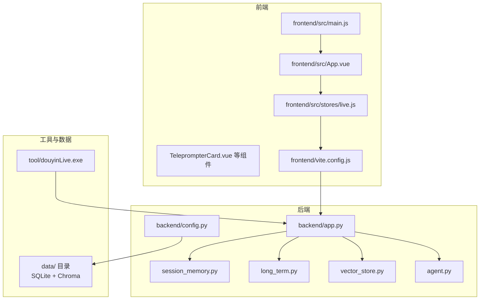
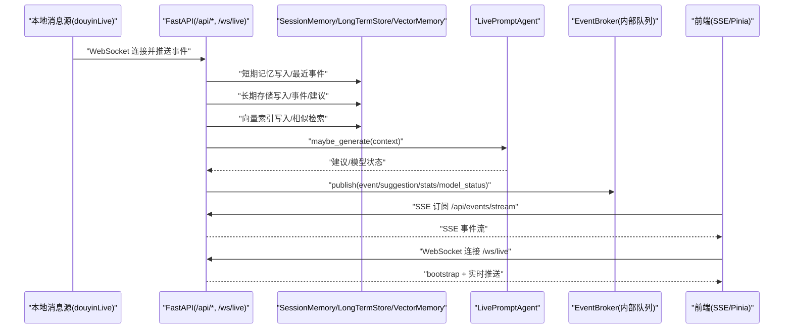
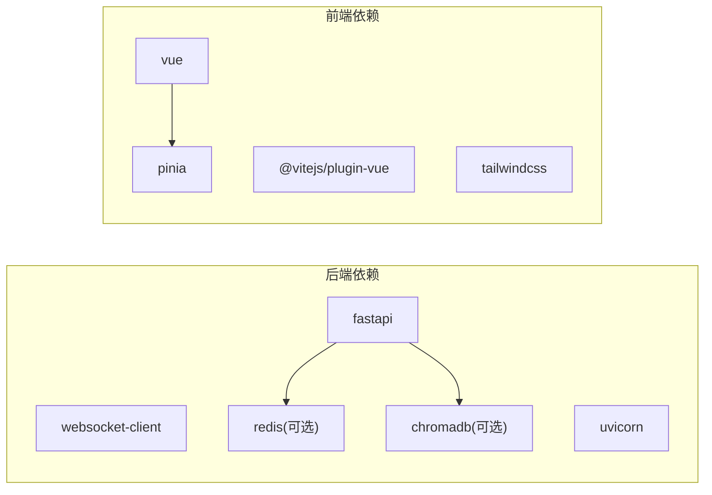

# 技术栈选型

<cite>
**本文引用的文件**
- [README.md](file://README.md)
- [backend/app.py](file://backend/app.py)
- [backend/config.py](file://backend/config.py)
- [backend/memory/session_memory.py](file://backend/memory/session_memory.py)
- [backend/memory/vector_store.py](file://backend/memory/vector_store.py)
- [backend/memory/long_term.py](file://backend/memory/long_term.py)
- [backend/services/agent.py](file://backend/services/agent.py)
- [frontend/src/main.js](file://frontend/src/main.js)
- [frontend/src/stores/live.js](file://frontend/src/stores/live.js)
- [frontend/src/App.vue](file://frontend/src/App.vue)
- [frontend/src/components/TeleprompterCard.vue](file://frontend/src/components/TeleprompterCard.vue)
- [frontend/vite.config.js](file://frontend/vite.config.js)
- [frontend/package.json](file://frontend/package.json)
- [requirements.txt](file://requirements.txt)
</cite>

## 目录
1. [简介](#简介)
2. [项目结构](#项目结构)
3. [核心组件](#核心组件)
4. [架构总览](#架构总览)
5. [详细组件分析](#详细组件分析)
6. [依赖分析](#依赖分析)
7. [性能考量](#性能考量)
8. [故障排查指南](#故障排查指南)
9. [结论](#结论)
10. [附录](#附录)

## 简介
本项目面向抖音直播场景，构建“本地消息源 + 后端实时处理 + 前端展示”的完整链路。技术栈选型围绕以下目标展开：
- 后端：快速开发、强类型保障、自动生成API文档、异步与实时推送
- 前端：响应式数据绑定、组合式API、开发体验与主题切换
- 存储：短期高吞吐（Redis）、长期持久化（SQLite）、向量检索（Chroma）
- 通信：SSE单向推送满足事件流需求，WebSocket用于需要双向交互的场景

本文件系统性阐述各技术选型的动机、优势、权衡与适用场景，并提供替代方案与最佳实践建议，帮助开发者做出更稳健的决策。

## 项目结构
项目采用前后端分离架构，后端以FastAPI为核心，前端以Vue 3 + Pinia为基础，配合Vite进行开发与代理。后端通过消息采集器接入本地douyinLive WebSocket，经由事件处理、短期记忆、长期存储、向量检索与建议生成，最终通过SSE/WS向前端推送。

图表来源
- [backend/app.py:1-220](file://backend/app.py#L1-L220)
- [frontend/src/main.js:1-17](file://frontend/src/main.js#L1-L17)
- [frontend/vite.config.js:1-23](file://frontend/vite.config.js#L1-L23)
- [backend/config.py:1-94](file://backend/config.py#L1-L94)

章节来源
- [README.md:21-50](file://README.md#L21-L50)
- [backend/app.py:1-220](file://backend/app.py#L1-L220)
- [frontend/src/main.js:1-17](file://frontend/src/main.js#L1-L17)
- [frontend/vite.config.js:1-23](file://frontend/vite.config.js#L1-L23)
- [backend/config.py:1-94](file://backend/config.py#L1-L94)

## 核心组件
- 后端应用与生命周期：FastAPI应用、CORS中间件、健康检查、REST接口、SSE与WebSocket流、事件处理与发布
- 配置中心：.env读取、运行参数解析、LLM服务地址与模型解析、数据目录确保
- 记忆与存储：
  - SessionMemory：短期会话（Redis或内存），支持TTL与限长队列
  - LongTermStore：SQLite持久化，事件、建议、用户画像、会话、备注等表
  - VectorMemory：Chroma向量检索或本地哈希嵌入降级
- 建议生成器：OpenAI兼容接口优先，失败回退本地启发式规则
- 前端应用：Vue 3 + Pinia，SSE连接、事件过滤、主题切换、房间切换、实时展示

章节来源
- [backend/app.py:1-220](file://backend/app.py#L1-L220)
- [backend/config.py:1-94](file://backend/config.py#L1-L94)
- [backend/memory/session_memory.py:1-113](file://backend/memory/session_memory.py#L1-L113)
- [backend/memory/long_term.py:1-750](file://backend/memory/long_term.py#L1-L750)
- [backend/memory/vector_store.py:1-108](file://backend/memory/vector_store.py#L1-L108)
- [backend/services/agent.py:1-393](file://backend/services/agent.py#L1-L393)
- [frontend/src/stores/live.js:1-310](file://frontend/src/stores/live.js#L1-L310)

## 架构总览
后端通过FastAPI统一入口，接收来自本地douyinLive的WebSocket事件，标准化为统一LiveEvent，写入短期记忆、长期存储与向量索引，同时触发建议生成与状态统计，通过SSE/WS实时推送到前端。前端通过Pinia集中管理状态，SSE订阅事件流，WebSocket用于需要双向交互的场景（如后续扩展）。

图表来源
- [backend/app.py:61-78](file://backend/app.py#L61-L78)
- [backend/app.py:187-220](file://backend/app.py#L187-L220)
- [backend/services/agent.py:73-114](file://backend/services/agent.py#L73-L114)
- [frontend/src/stores/live.js:173-205](file://frontend/src/stores/live.js#L173-L205)

章节来源
- [README.md:35-48](file://README.md#L35-L48)
- [backend/app.py:1-220](file://backend/app.py#L1-L220)
- [backend/services/agent.py:1-393](file://backend/services/agent.py#L1-L393)
- [frontend/src/stores/live.js:1-310](file://frontend/src/stores/live.js#L1-L310)

## 详细组件分析

### Python + FastAPI 技术选型
- 异步处理能力：FastAPI原生支持异步视图与后台任务，结合事件循环与协程，适合高并发I/O密集型场景（SSE/WS）
- 类型安全：Pydantic模型与类型注解，接口契约清晰，减少运行时错误
- 自动生成API文档：集成Swagger/OpenAPI，便于联调与测试
- 生命周期管理：lifespan钩子用于启动采集器、关闭数据库会话，保证资源正确释放
- 实时通信：SSE与WebSocket双通道，SSE用于单向事件流，WebSocket用于需要双向交互的场景

替代方案与权衡
- Flask：生态丰富但缺少原生异步与类型安全，文档生成不如FastAPI便捷
- Quart：纯异步，但生态与文档生成不及FastAPI成熟
- Tornado：异步能力强，但路由与类型安全不如FastAPI友好

章节来源
- [backend/app.py:84-92](file://backend/app.py#L84-L92)
- [backend/app.py:104-133](file://backend/app.py#L104-L133)
- [backend/app.py:187-220](file://backend/app.py#L187-L220)
- [backend/config.py:63-91](file://backend/config.py#L63-L91)

### Vue 3 + Pinia 技术选型
- 响应式数据绑定：组合式API与ref/computed提供细粒度响应式，便于复杂状态管理
- 开发体验：Vite提供热更新与快速构建，代理配置简化跨域与联调
- 状态集中：Pinia集中管理房间、连接状态、事件列表、建议、主题等，避免组件间状态碎片化
- 组件化：UI组件按功能拆分，便于维护与复用

替代方案与权衡
- React + Zustand/Jotai：生态成熟，但TypeScript集成与响应式粒度不及Vue 3
- SvelteKit：编译期优化，但生态与文档生成不如Vue 3成熟
- Angular：功能完备但学习曲线较高，不适合轻量实时场景

章节来源
- [frontend/src/main.js:1-17](file://frontend/src/main.js#L1-L17)
- [frontend/src/stores/live.js:1-310](file://frontend/src/stores/live.js#L1-L310)
- [frontend/vite.config.js:1-23](file://frontend/vite.config.js#L1-L23)
- [frontend/package.json:1-23](file://frontend/package.json#L1-L23)

### 存储技术选型：Redis/SQLite/Chroma
- Redis（短期高吞吐）：提供列表与过期键能力，支持TTL与限长，退化为内存队列时仍可运行
- SQLite（长期持久化）：轻量、无需额外服务，支持复杂查询与事务，适合作为历史数据与用户画像的主存储
- Chroma（向量检索）：提供向量索引与相似检索，不可用时以本地哈希嵌入降级，保证检索能力不断路

替代方案与权衡
- MongoDB：文档模型灵活，但向量检索能力不如Chroma成熟
- PostgreSQL：功能强大，但向量扩展需要额外插件与运维成本
- Elasticsearch：检索能力强，但向量检索与部署复杂度更高

章节来源
- [backend/memory/session_memory.py:1-113](file://backend/memory/session_memory.py#L1-L113)
- [backend/memory/long_term.py:1-750](file://backend/memory/long_term.py#L1-L750)
- [backend/memory/vector_store.py:1-108](file://backend/memory/vector_store.py#L1-L108)
- [backend/config.py:51-68](file://backend/config.py#L51-L68)

### 实时通信选型：WebSocket 与 SSE
- SSE（Server-Sent Events）：单向推送，浏览器原生支持，低开销，适合事件流（事件、建议、统计、模型状态）
- WebSocket：双向通信，适合需要客户端主动上报或未来扩展交互的场景

替代方案与权衡
- Socket.IO：功能丰富，但引入额外依赖与复杂度
- MQTT：消息队列模型，适合分布式场景，但本项目为单机链路，SSE已足够

章节来源
- [backend/app.py:187-220](file://backend/app.py#L187-L220)
- [frontend/src/stores/live.js:173-205](file://frontend/src/stores/live.js#L173-L205)

## 依赖分析
后端依赖以可选与必选分离，保证基础功能在无Redis/Chroma时仍可运行；前端依赖Vue 3与Pinia，Vite提供开发与代理能力。

图表来源
- [requirements.txt:1-6](file://requirements.txt#L1-L6)
- [frontend/package.json:11-22](file://frontend/package.json#L11-L22)

章节来源
- [requirements.txt:1-6](file://requirements.txt#L1-L6)
- [frontend/package.json:1-23](file://frontend/package.json#L1-L23)

## 性能考量
- 后端
  - SSE单向推送，CPU与内存占用低，适合高频事件流
  - Redis短期记忆具备TTL与限长，避免内存无限增长
  - SQLite写入采用批量与索引优化，查询通过索引覆盖
  - 向量检索在Chroma可用时走向量相似，不可用时以本地哈希嵌入降级
- 前端
  - Pinia集中状态，computed计算属性减少重渲染
  - Vite热更新与代理，提升开发效率
  - 事件与建议列表截断，避免DOM膨胀

[本节为通用性能讨论，不直接分析具体文件]

## 故障排查指南
- 后端
  - 健康检查：确认房间号与活动会话状态
  - LLM模式与API Key：检查LLM_MODE、LLM_API_KEY、LLM_BASE_URL解析
  - Redis/Chroma：当未配置时短期记忆退化为内存，向量检索退化为本地相似度
- 前端
  - SSE连接：观察连接状态与错误提示，必要时回退到Bootstrap快照
  - 房间切换：检查HTTP状态码与错误信息，失败时回滚并重新连接

章节来源
- [backend/app.py:104-106](file://backend/app.py#L104-L106)
- [backend/config.py:70-91](file://backend/config.py#L70-L91)
- [frontend/src/stores/live.js:207-250](file://frontend/src/stores/live.js#L207-L250)

## 结论
本项目的技术栈选型围绕“易用、可靠、可扩展”展开：后端以FastAPI为核心，结合SSE/WS满足实时需求；前端以Vue 3 + Pinia提供良好开发体验与响应式状态管理；存储层以Redis/SQLite/Chroma形成“短期高吞吐 + 长期持久化 + 向量检索”的组合，既保证性能又兼顾可用性。可选依赖的设计使得项目在不同环境下均能稳定运行，同时为未来扩展（如Socket.IO、MQTT）预留空间。

[本节为总结性内容，不直接分析具体文件]

## 附录
- 后端接口与事件类型详见README中的接口与事件定义
- 建议生成逻辑与回退策略见Agent模块
- 前端组件与状态管理见store与组件文件

章节来源
- [README.md:208-275](file://README.md#L208-L275)
- [backend/services/agent.py:73-114](file://backend/services/agent.py#L73-L114)
- [frontend/src/stores/live.js:1-310](file://frontend/src/stores/live.js#L1-L310)