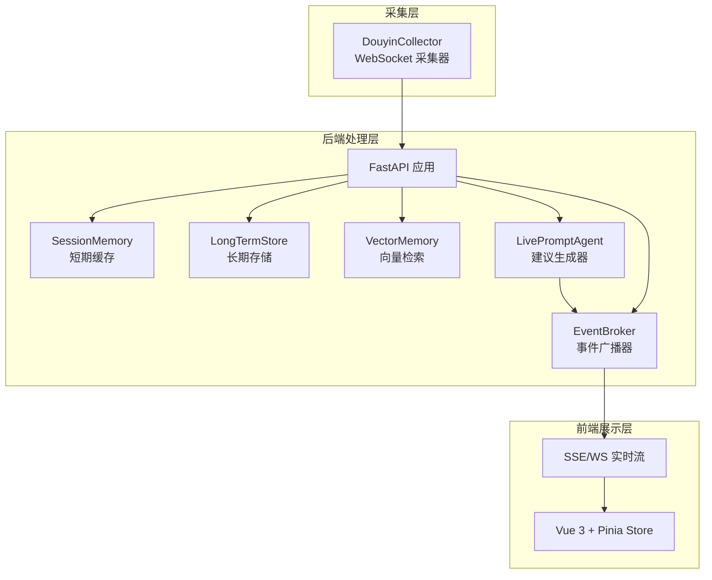
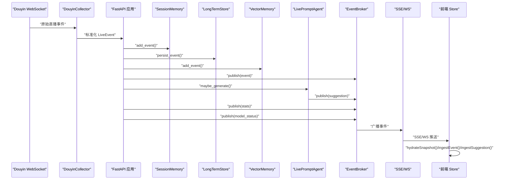
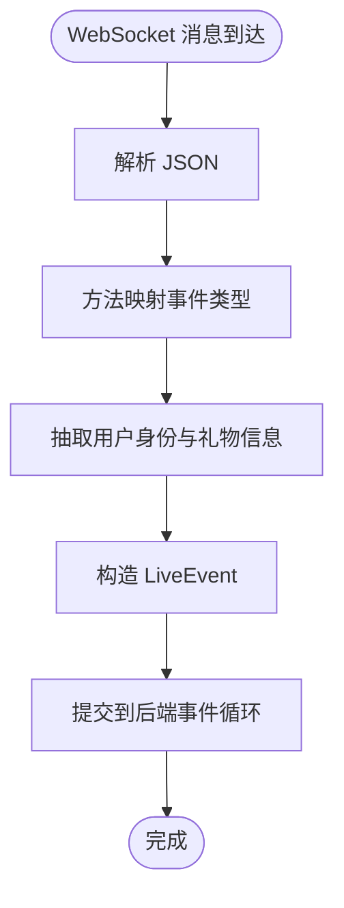
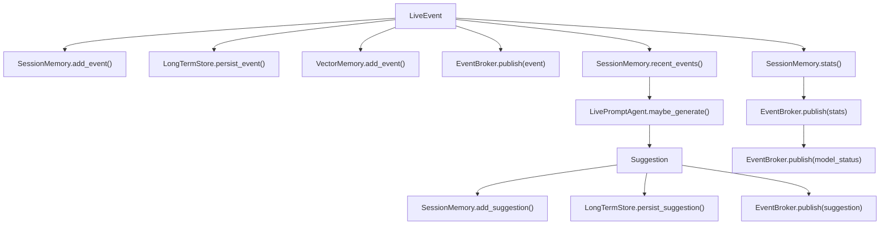
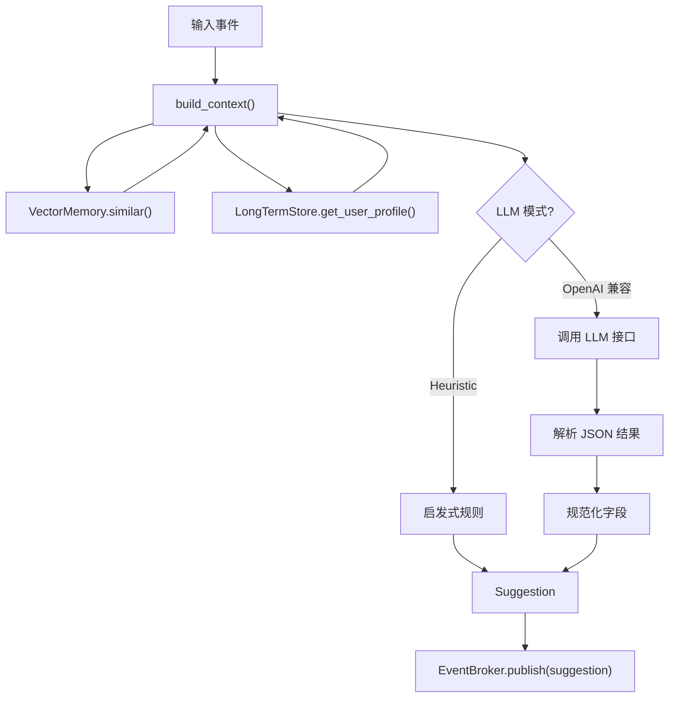
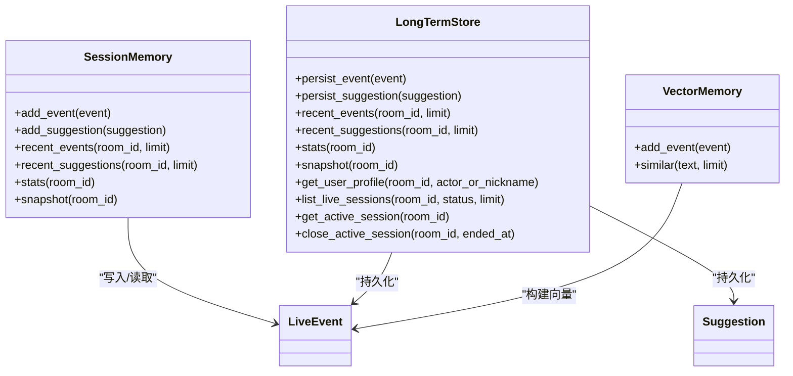
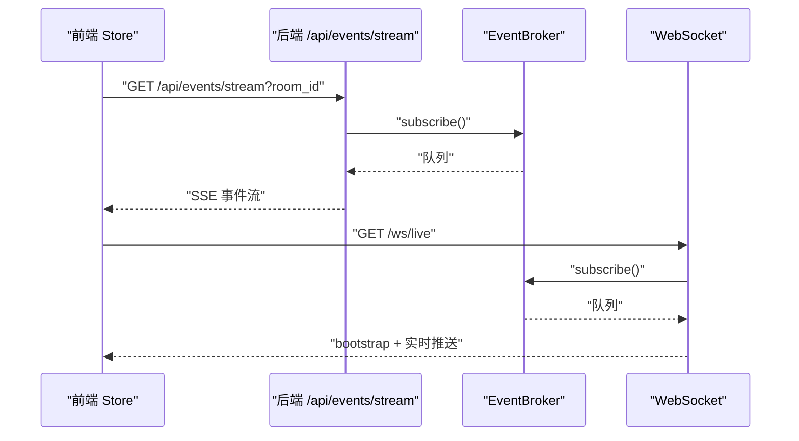
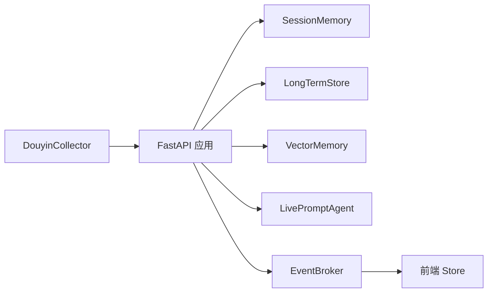

# 数据流设计

<cite>
**本文档引用的文件**
- [backend/app.py](file://backend/app.py)
- [backend/config.py](file://backend/config.py)
- [backend/memory/session_memory.py](file://backend/memory/session_memory.py)
- [backend/memory/long_term.py](file://backend/memory/long_term.py)
- [backend/memory/vector_store.py](file://backend/memory/vector_store.py)
- [backend/services/broker.py](file://backend/services/broker.py)
- [backend/services/agent.py](file://backend/services/agent.py)
- [backend/services/collector.py](file://backend/services/collector.py)
- [backend/schemas/live.py](file://backend/schemas/live.py)
- [frontend/src/stores/live.js](file://frontend/src/stores/live.js)
- [frontend/src/App.vue](file://frontend/src/App.vue)
- [frontend/src/components/EventFeed.vue](file://frontend/src/components/EventFeed.vue)
- [README.md](file://README.md)
</cite>

## 目录
1. [简介](#简介)
2. [项目结构](#项目结构)
3. [核心组件](#核心组件)
4. [架构总览](#架构总览)
5. [详细组件分析](#详细组件分析)
6. [依赖关系分析](#依赖关系分析)
7. [性能考量](#性能考量)
8. [故障排查指南](#故障排查指南)
9. [结论](#结论)
10. [附录](#附录)

## 简介
本文件系统性阐述从直播事件采集到前端展示的完整数据流设计，覆盖以下关键环节：
- WebSocket 接收的原始事件如何被采集器标准化为统一数据模型
- SessionMemory 的短期缓存策略与降级机制
- LongTermStore 的长期历史存储与会话聚合
- VectorMemory 的向量检索索引与相似历史匹配
- EventBroker 的事件广播与前端实时同步（SSE/WebSocket）
- AI 建议生成器的上下文构建与多模式回退策略
- 前端 store 到后端 API 的实时数据同步机制

该文档旨在帮助开发者快速理解复杂数据处理管道的生命周期管理、缓存策略、数据一致性保证与性能优化措施。

## 项目结构
后端采用 FastAPI 提供 REST、SSE、WebSocket 接口，前端使用 Vue 3 + Pinia 实现实时数据同步与展示。数据流从本地抖音消息源通过 WebSocket 进入采集器，标准化后进入后端处理流水线，同时写入短期与长期存储，并构建向量索引。AI 建议生成器基于上下文生成建议，经 EventBroker 广播至前端。

图表来源
- [backend/app.py:84-220](file://backend/app.py#L84-L220)
- [backend/services/collector.py:38-284](file://backend/services/collector.py#L38-L284)
- [backend/memory/session_memory.py:17-113](file://backend/memory/session_memory.py#L17-L113)
- [backend/memory/long_term.py:36-750](file://backend/memory/long_term.py#L36-L750)
- [backend/memory/vector_store.py:52-108](file://backend/memory/vector_store.py#L52-L108)
- [backend/services/agent.py:23-393](file://backend/services/agent.py#L23-L393)
- [backend/services/broker.py:10-40](file://backend/services/broker.py#L10-L40)
- [frontend/src/stores/live.js:70-310](file://frontend/src/stores/live.js#L70-L310)

章节来源
- [README.md:35-48](file://README.md#L35-L48)
- [backend/app.py:84-220](file://backend/app.py#L84-L220)

## 核心组件
- 采集器（DouyinCollector）：负责连接本地 WebSocket，解析原始消息，标准化为 LiveEvent，并提交到后端事件循环。
- 事件处理器（process_event）：在后端统一处理入口，写入短期缓存、长期存储、向量索引，触发建议生成与统计广播。
- 事件广播器（EventBroker）：维护订阅队列，将事件、建议、统计、模型状态广播给 SSE/WS 订阅者。
- 建议生成器（LivePromptAgent）：基于最近事件、相似历史、用户画像构建上下文，优先调用 OpenAI 兼容接口，失败时回退启发式规则。
- 存储层：
  - SessionMemory：短期缓存，优先 Redis，不可用时退化为进程内内存。
  - LongTermStore：SQLite 长期存储，维护事件、建议、用户画像、会话聚合等。
  - VectorMemory：向量检索索引，优先 Chroma，不可用时退化为轻量文本相似度。
- 前端 Store（Pinia）：负责连接 SSE/WS、接收事件、建议、统计与模型状态，进行本地过滤与展示。

章节来源
- [backend/services/collector.py:38-284](file://backend/services/collector.py#L38-L284)
- [backend/app.py:61-78](file://backend/app.py#L61-L78)
- [backend/services/broker.py:10-40](file://backend/services/broker.py#L10-L40)
- [backend/services/agent.py:23-393](file://backend/services/agent.py#L23-L393)
- [backend/memory/session_memory.py:17-113](file://backend/memory/session_memory.py#L17-L113)
- [backend/memory/long_term.py:36-750](file://backend/memory/long_term.py#L36-L750)
- [backend/memory/vector_store.py:52-108](file://backend/memory/vector_store.py#L52-L108)
- [frontend/src/stores/live.js:70-310](file://frontend/src/stores/live.js#L70-L310)

## 架构总览
下面的序列图展示了从 WebSocket 接收到前端展示的完整数据流：

图表来源
- [backend/services/collector.py:145-159](file://backend/services/collector.py#L145-L159)
- [backend/app.py:61-78](file://backend/app.py#L61-L78)
- [backend/services/broker.py:28-39](file://backend/services/broker.py#L28-L39)
- [frontend/src/stores/live.js:173-205](file://frontend/src/stores/live.js#L173-L205)

## 详细组件分析

### 采集与标准化（WebSocket -> LiveEvent）
- 采集器通过 WebSocket 连接到本地消息源，解析 JSON，按方法映射事件类型，抽取用户身份与礼物信息，构造 LiveEvent。
- 采集器将事件提交到后端事件循环，确保在异步上下文中处理，避免阻塞网络线程。

图表来源
- [backend/services/collector.py:225-283](file://backend/services/collector.py#L225-L283)

章节来源
- [backend/services/collector.py:38-284](file://backend/services/collector.py#L38-L284)
- [backend/schemas/live.py:29-45](file://backend/schemas/live.py#L29-L45)

### 后端处理流水线（process_event）
- 写入短期缓存（SessionMemory）：事件与建议均写入，支持 Redis 或进程内内存。
- 写入长期存储（LongTermStore）：事件持久化，维护会话聚合、用户画像与索引。
- 写入向量索引（VectorMemory）：将带内容的事件写入向量集合或本地相似度表。
- 触发建议生成（LivePromptAgent）：基于最近事件与上下文生成建议，写入短期与长期存储。
- 广播事件（EventBroker）：事件、建议、统计、模型状态实时推送到前端。

图表来源
- [backend/app.py:61-78](file://backend/app.py#L61-L78)
- [backend/memory/session_memory.py:42-102](file://backend/memory/session_memory.py#L42-L102)
- [backend/memory/long_term.py:420-454](file://backend/memory/long_term.py#L420-L454)
- [backend/memory/vector_store.py:64-83](file://backend/memory/vector_store.py#L64-L83)
- [backend/services/agent.py:73-94](file://backend/services/agent.py#L73-L94)

章节来源
- [backend/app.py:61-78](file://backend/app.py#L61-L78)

### 建议生成器（上下文构建与回退策略）
- 上下文包含：最近事件窗口、相似历史片段、用户画像。
- 生成策略：优先 OpenAI 兼容接口，失败时回退启发式规则；记录模型状态并广播。
- 输出：标准化 Suggestion，包含优先级、回复文本、语气、理由、置信度等。

图表来源
- [backend/services/agent.py:56-114](file://backend/services/agent.py#L56-L114)
- [backend/services/agent.py:183-329](file://backend/services/agent.py#L183-L329)
- [backend/memory/vector_store.py:85-108](file://backend/memory/vector_store.py#L85-L108)
- [backend/memory/long_term.py:718-734](file://backend/memory/long_term.py#L718-L734)

章节来源
- [backend/services/agent.py:23-393](file://backend/services/agent.py#L23-L393)

### 存储层设计与一致性
- SessionMemory（短期缓存）
  - Redis 模式：使用列表结构维护事件与建议，设置 TTL 控制热数据生命周期。
  - 进程内模式：使用双端队列，限制长度，保证内存占用可控。
  - 统计计算：基于近期窗口统计各类事件数量，轻量高效。
- LongTermStore（长期存储）
  - SQLite 表结构：events、suggestions、viewer_profiles、viewer_gifts、live_sessions、viewer_notes。
  - 索引优化：针对房间、时间戳、事件类型、会话 ID 等建立索引，提升查询性能。
  - 会话聚合：维护活动会话、事件计数、用户画像与礼物统计，支持重建聚合。
  - 历史检索：提供最近事件、建议、用户画像、会话历史、笔记等查询接口。
- VectorMemory（向量检索）
  - Chroma 模式：持久化向量集合，支持 upsert/query。
  - 本地退化：轻量哈希嵌入函数与文本相似度，保证检索能力不中断。

图表来源
- [backend/memory/session_memory.py:17-113](file://backend/memory/session_memory.py#L17-L113)
- [backend/memory/long_term.py:36-750](file://backend/memory/long_term.py#L36-L750)
- [backend/memory/vector_store.py:52-108](file://backend/memory/vector_store.py#L52-L108)

章节来源
- [backend/memory/session_memory.py:17-113](file://backend/memory/session_memory.py#L17-L113)
- [backend/memory/long_term.py:36-750](file://backend/memory/long_term.py#L36-L750)
- [backend/memory/vector_store.py:52-108](file://backend/memory/vector_store.py#L52-L108)

### 前端实时同步机制（SSE/WS -> Store）
- 前端通过 EventSource 连接后端 SSE 接口，监听 event、suggestion、stats、model_status 事件，更新本地状态。
- Store 支持房间切换、事件类型过滤、主题切换、连接状态管理。
- 首次连接时先获取 bootstrap 快照，确保前端初始渲染的一致性。

图表来源
- [backend/app.py:187-206](file://backend/app.py#L187-L206)
- [backend/app.py:209-220](file://backend/app.py#L209-L220)
- [backend/services/broker.py:16-21](file://backend/services/broker.py#L16-L21)
- [frontend/src/stores/live.js:173-205](file://frontend/src/stores/live.js#L173-L205)

章节来源
- [frontend/src/stores/live.js:70-310](file://frontend/src/stores/live.js#L70-L310)
- [frontend/src/App.vue:29-32](file://frontend/src/App.vue#L29-L32)

## 依赖关系分析
- 组件耦合与内聚
  - FastAPI 应用集中编排 SessionMemory、LongTermStore、VectorMemory、LivePromptAgent、EventBroker，保持高内聚低耦合。
  - 采集器与应用解耦，通过事件循环提交事件，避免阻塞网络线程。
- 外部依赖与集成点
  - WebSocket：本地消息源提供原始直播事件。
  - Redis：可选短期缓存加速。
  - Chroma：可选向量检索增强。
  - OpenAI 兼容接口：可选建议生成后端。
- 循环依赖
  - 未发现循环导入或循环依赖，模块职责清晰。

图表来源
- [backend/app.py:25-29](file://backend/app.py#L25-L29)
- [backend/services/collector.py:38-52](file://backend/services/collector.py#L38-L52)
- [backend/services/broker.py:10-14](file://backend/services/broker.py#L10-L14)

章节来源
- [backend/app.py:25-29](file://backend/app.py#L25-L29)
- [backend/services/collector.py:38-52](file://backend/services/collector.py#L38-L52)
- [backend/services/broker.py:10-14](file://backend/services/broker.py#L10-L14)

## 性能考量
- 缓存策略
  - SessionMemory：Redis 模式下列表 + TTL，进程内模式下双端队列限制长度，兼顾吞吐与内存占用。
  - LongTermStore：SQLite 索引覆盖常见查询路径，避免全表扫描。
  - VectorMemory：Chroma 模式下向量查询，本地退化为轻量相似度，保证可用性。
- 广播与订阅
  - EventBroker 使用 asyncio.Queue，避免阻塞；对满队列的订阅者进行清理，防止内存泄漏。
- 异步与并发
  - 采集器在独立线程中运行，通过 run_coroutine_threadsafe 提交事件到后端事件循环，避免阻塞。
- 建议生成
  - 仅对 comment/gift/follow 事件生成建议，减少不必要的计算；模型失败时快速回退启发式规则。
- 前端渲染
  - 事件与建议列表上限控制，避免 DOM 过大；事件类型过滤减少渲染负担。

[本节为通用性能讨论，无需特定文件来源]

## 故障排查指南
- WebSocket 连接异常
  - 检查本地消息源是否启动、端口与房间号配置是否正确。
  - 查看采集器日志与重连间隔配置。
- Redis/Chroma 不可用
  - 系统会自动退化到进程内内存与轻量相似度，不影响基本流程。
- 建议生成失败
  - 检查 LLM 模式、模型地址、API 密钥与超时配置；查看模型状态广播以定位错误原因。
- SSE/WS 断连
  - 前端会自动重连；检查后端 EventBroker 是否仍在广播，确认订阅队列未被清理。
- 数据不一致
  - LongTermStore 在事件重复时会重建聚合，确保一致性；如出现异常，可检查数据库索引与列扩展。

章节来源
- [backend/services/collector.py:117-139](file://backend/services/collector.py#L117-L139)
- [backend/services/agent.py:23-393](file://backend/services/agent.py#L23-L393)
- [backend/services/broker.py:31-39](file://backend/services/broker.py#L31-L39)
- [backend/memory/long_term.py:446-452](file://backend/memory/long_term.py#L446-L452)

## 结论
本系统通过清晰的分层与可选增强组件，实现了从直播事件采集到前端展示的完整数据流。短期缓存保障实时性，长期存储确保可追溯性，向量检索提供智能上下文，建议生成器在多模式间平滑回退，EventBroker 与前端 Store 实现低延迟实时同步。通过合理的缓存策略、索引优化与异步处理，系统在保证性能的同时具备良好的可维护性与扩展性。

[本节为总结性内容，无需特定文件来源]

## 附录
- 关键接口与行为
  - /api/events/stream：SSE 实时事件流，推送 event、suggestion、stats、model_status。
  - /ws/live：WebSocket 实时流，先发送 bootstrap 快照，随后持续推送。
  - /api/room：切换当前采集房间，关闭旧会话并启动新采集。
  - /api/bootstrap：获取前端初始化快照，包含最近事件、建议、统计与模型状态。
- 配置要点
  - ROOM_ID、COLLECTOR_*、LLM_*、REDIS_URL、CHROMA_DIR 等环境变量影响运行行为。
  - LLM_MODE 支持 heuristic、qwen、openai 等模式，自动解析最终模型地址与名称。

章节来源
- [backend/app.py:104-220](file://backend/app.py#L104-L220)
- [backend/config.py:39-94](file://backend/config.py#L39-L94)
- [README.md:208-275](file://README.md#L208-L275)