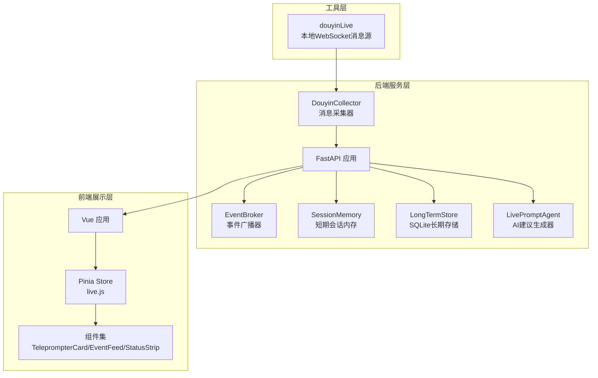
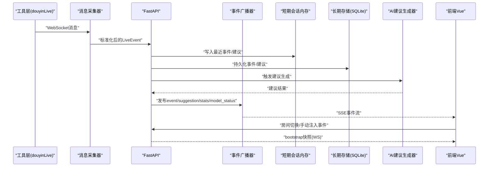
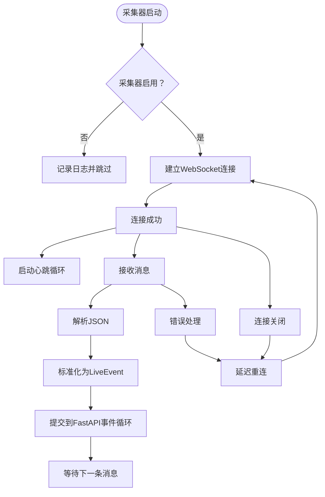
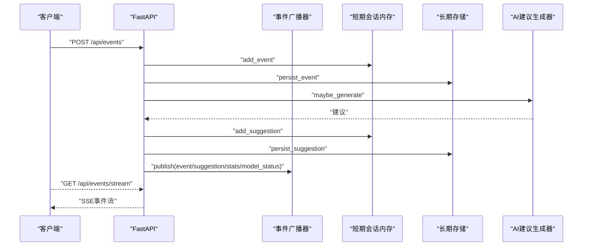
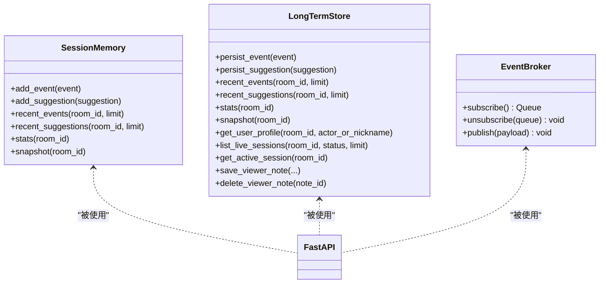
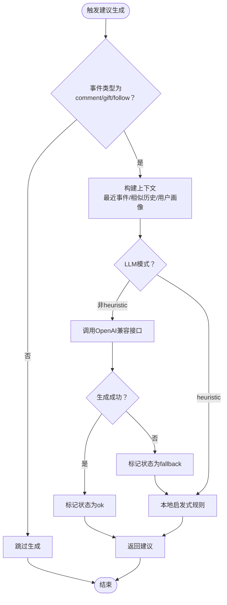
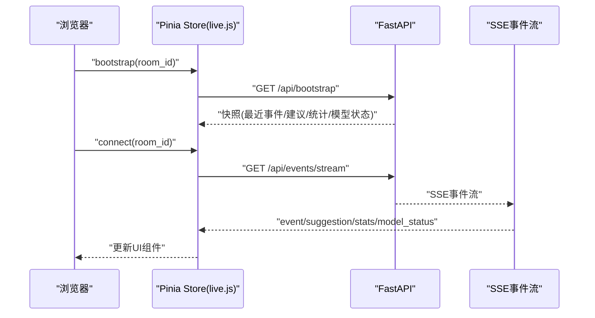
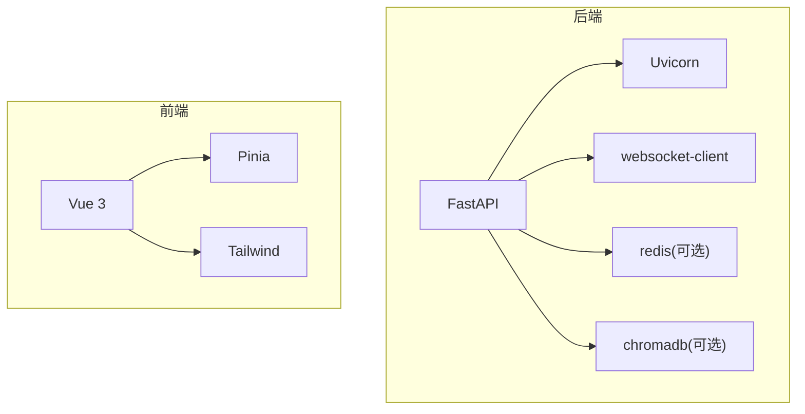

# 整体架构设计

<cite>
**本文档引用的文件**
- [README.md](file://README.md)
- [backend/app.py](file://backend/app.py)
- [backend/config.py](file://backend/config.py)
- [backend/services/collector.py](file://backend/services/collector.py)
- [backend/services/agent.py](file://backend/services/agent.py)
- [backend/services/broker.py](file://backend/services/broker.py)
- [backend/memory/session_memory.py](file://backend/memory/session_memory.py)
- [backend/memory/long_term.py](file://backend/memory/long_term.py)
- [frontend/src/main.js](file://frontend/src/main.js)
- [frontend/src/stores/live.js](file://frontend/src/stores/live.js)
- [frontend/src/components/TeleprompterCard.vue](file://frontend/src/components/TeleprompterCard.vue)
- [frontend/src/components/EventFeed.vue](file://frontend/src/components/EventFeed.vue)
- [frontend/src/components/StatusStrip.vue](file://frontend/src/components/StatusStrip.vue)
- [requirements.txt](file://requirements.txt)
</cite>

## 目录
1. [简介](#简介)
2. [项目结构](#项目结构)
3. [核心组件](#核心组件)
4. [架构总览](#架构总览)
5. [详细组件分析](#详细组件分析)
6. [依赖关系分析](#依赖关系分析)
7. [性能考量](#性能考量)
8. [故障排查指南](#故障排查指南)
9. [结论](#结论)
10. [附录](#附录)

## 简介
本项目是一个面向抖音直播场景的实时提词器，采用三层架构设计：
- 工具层（douyinLive）：负责连接直播间并通过WebSocket提供本地消息源
- 后端服务层（FastAPI）：负责事件处理、内存管理、AI建议生成与实时推送
- 前端展示层（Vue.js）：负责实时数据展示与用户交互

系统通过WebSocket连接工具层，经后端FastAPI进行事件标准化、短期/长期记忆管理、AI建议生成，再通过SSE/WS向前端实时推送事件、建议、统计与模型状态。前端支持房间切换、事件筛选、实时提词展示与主题切换。

## 项目结构
项目采用按层划分的组织方式：
- backend：后端服务，包含API、内存、服务与配置
- frontend：前端应用，基于Vue 3 + Pinia + Tailwind
- tool：外部工具（douyinLive）提供的本地WebSocket消息源
- data：运行期生成的数据目录（SQLite与向量数据库）

图表来源
- [backend/app.py:94-220](file://backend/app.py#L94-L220)
- [backend/services/collector.py:38-284](file://backend/services/collector.py#L38-L284)
- [backend/services/broker.py:10-40](file://backend/services/broker.py#L10-L40)
- [backend/memory/session_memory.py:17-113](file://backend/memory/session_memory.py#L17-L113)
- [backend/memory/long_term.py:36-750](file://backend/memory/long_term.py#L36-L750)
- [backend/services/agent.py:23-393](file://backend/services/agent.py#L23-L393)
- [frontend/src/main.js:1-17](file://frontend/src/main.js#L1-L17)
- [frontend/src/stores/live.js:70-310](file://frontend/src/stores/live.js#L70-L310)

章节来源
- [README.md:21-34](file://README.md#L21-L34)
- [backend/app.py:94-220](file://backend/app.py#L94-L220)
- [frontend/src/main.js:1-17](file://frontend/src/main.js#L1-L17)

## 核心组件
- 工具层（douyinLive）
  - 通过本地WebSocket提供抖音直播事件流，后端默认连接地址为ws://127.0.0.1:1088/ws/{room_id}
- 后端服务层（FastAPI）
  - API接口：健康检查、房间切换、事件注入、SSE流、WebSocket流、Viewer相关接口
  - 事件处理：标准化、短期/长期存储、向量检索、AI建议生成、状态推送
  - 内存管理：短期会话内存（Redis或进程内）、SQLite长期存储、向量检索（可选）
- 前端展示层（Vue.js）
  - 基于Pinia集中管理状态，支持SSE连接、事件过滤、房间切换、主题切换、实时提词展示

章节来源
- [README.md:35-48](file://README.md#L35-L48)
- [backend/app.py:104-220](file://backend/app.py#L104-L220)
- [frontend/src/stores/live.js:70-310](file://frontend/src/stores/live.js#L70-L310)

## 架构总览
系统数据流从工具层进入后端，经过标准化与处理后，同时写入短期/长期存储，并通过事件广播器向SSE与WebSocket推送。前端通过SSE订阅事件流，WebSocket接收一次性快照，实现低延迟的实时展示。

图表来源
- [backend/services/collector.py:117-284](file://backend/services/collector.py#L117-L284)
- [backend/app.py:61-78](file://backend/app.py#L61-L78)
- [backend/services/broker.py:28-40](file://backend/services/broker.py#L28-L40)
- [backend/memory/session_memory.py:42-113](file://backend/memory/session_memory.py#L42-L113)
- [backend/memory/long_term.py:420-454](file://backend/memory/long_term.py#L420-L454)
- [backend/services/agent.py:73-94](file://backend/services/agent.py#L73-L94)
- [frontend/src/stores/live.js:173-205](file://frontend/src/stores/live.js#L173-L205)

## 详细组件分析

### 工具层（douyinLive）与消息采集器
- 功能职责
  - 连接本地WebSocket消息源，解析原始消息为统一的LiveEvent结构
  - 支持房间切换、断线重连、心跳保活
- 关键特性
  - 方法到事件类型的映射，确保不同消息方法被归一化为comment/gift/like/member/follow/system
  - 通过线程+事件循环桥接，将事件提交至FastAPI事件循环
- 并发与可靠性
  - 独立线程运行WebSocket客户端，异常捕获与重连机制保障稳定性

图表来源
- [backend/services/collector.py:117-284](file://backend/services/collector.py#L117-L284)

章节来源
- [backend/services/collector.py:38-284](file://backend/services/collector.py#L38-L284)

### 后端服务层（FastAPI）与事件处理
- 应用入口与生命周期
  - 使用lifespan管理采集器启动与停止，确保资源正确释放
  - CORS中间件允许跨域访问
- API接口
  - 健康检查：返回房间号与活动会话状态
  - 房间切换：关闭当前会话，切换采集器房间并返回快照
  - 事件注入：手动注入标准化事件，便于联调
  - SSE流：按房间过滤事件类型，推送event/suggestion/stats/model_status
  - WebSocket流：先发送bootstrap快照，随后持续推送
- 事件处理流程
  - 写入短期会话内存与长期存储
  - 向量检索与用户画像构建上下文
  - AI建议生成（优先在线模型，失败回退规则）
  - 广播事件、建议、统计与模型状态

图表来源
- [backend/app.py:129-133](file://backend/app.py#L129-L133)
- [backend/app.py:61-78](file://backend/app.py#L61-L78)
- [backend/services/broker.py:28-40](file://backend/services/broker.py#L28-L40)
- [backend/services/agent.py:73-94](file://backend/services/agent.py#L73-L94)

章节来源
- [backend/app.py:84-220](file://backend/app.py#L84-L220)

### 内存与存储层
- 短期会话内存（SessionMemory）
  - 优先使用Redis（可选），否则使用进程内双端队列
  - TTL控制热数据生命周期，支持事件与建议的增删查
- 长期存储（LongTermStore）
  - SQLite表结构覆盖事件、建议、用户画像、礼物、直播会话、备注等
  - 自动建索引与列迁移，支持活跃会话管理、用户画像聚合与查询
- 向量检索（VectorMemory）
  - 作为可选增强，未安装时退化为轻量文本相似策略

图表来源
- [backend/memory/session_memory.py:17-113](file://backend/memory/session_memory.py#L17-L113)
- [backend/memory/long_term.py:36-750](file://backend/memory/long_term.py#L36-L750)
- [backend/services/broker.py:10-40](file://backend/services/broker.py#L10-L40)

章节来源
- [backend/memory/session_memory.py:17-113](file://backend/memory/session_memory.py#L17-L113)
- [backend/memory/long_term.py:36-750](file://backend/memory/long_term.py#L36-L750)

### AI建议生成器（LivePromptAgent）
- 生成策略
  - 优先调用OpenAI兼容接口（DashScope/OpenAI），失败自动回退到本地启发式规则
  - 上下文包含最近事件窗口、相似历史片段与用户画像
- 输出规范
  - 固定字段：priority/reply_text/tone/reason/confidence
  - 优先级归一化为high/medium/low
- 错误处理
  - 网络错误、超时、JSON解析失败、无效负载等均有明确状态标记与日志记录

图表来源
- [backend/services/agent.py:73-114](file://backend/services/agent.py#L73-L114)
- [backend/services/agent.py:183-329](file://backend/services/agent.py#L183-L329)

章节来源
- [backend/services/agent.py:23-393](file://backend/services/agent.py#L23-L393)

### 前端展示层（Vue.js）
- 应用入口
  - 创建Vue应用，注册Pinia，挂载到DOM
- 状态管理（Pinia Store）
  - 统一管理房间号、连接状态、事件列表、建议列表、统计、模型状态、主题与事件类型筛选
  - 支持bootstrap快照、SSE连接、房间切换、主题切换与本地持久化
- 组件
  - TeleprompterCard：展示当前最优先的建议回复
  - EventFeed：展示事件流与筛选
  - StatusStrip：展示房间号、连接状态、统计与模型状态

图表来源
- [frontend/src/stores/live.js:158-205](file://frontend/src/stores/live.js#L158-L205)
- [frontend/src/stores/live.js:207-250](file://frontend/src/stores/live.js#L207-L250)

章节来源
- [frontend/src/main.js:1-17](file://frontend/src/main.js#L1-L17)
- [frontend/src/stores/live.js:70-310](file://frontend/src/stores/live.js#L70-L310)
- [frontend/src/components/TeleprompterCard.vue:1-83](file://frontend/src/components/TeleprompterCard.vue#L1-L83)
- [frontend/src/components/EventFeed.vue:1-183](file://frontend/src/components/EventFeed.vue#L1-L183)
- [frontend/src/components/StatusStrip.vue:1-144](file://frontend/src/components/StatusStrip.vue#L1-L144)

## 依赖关系分析
- 后端依赖
  - FastAPI/Uvicorn：提供REST/SSE/WS接口
  - websocket-client：连接本地WebSocket消息源
  - redis：可选短期会话内存后端
  - chromadb：可选向量检索后端
- 前端依赖
  - Vue 3/Pinia/Tailwind：构建响应式界面与状态管理
- 运行要求
  - Windows环境、Python 3.10+、Node.js 18+

图表来源
- [requirements.txt:1-6](file://requirements.txt#L1-L6)
- [README.md:50-65](file://README.md#L50-L65)

章节来源
- [requirements.txt:1-6](file://requirements.txt#L1-L6)
- [README.md:50-65](file://README.md#L50-L65)

## 性能考量
- 事件处理吞吐
  - 采集器独立线程+事件循环桥接，避免阻塞FastAPI主线程
  - 事件广播器使用异步队列，支持多订阅者并行分发
- 内存与存储
  - 短期会话内存支持Redis或进程内，Redis模式具备TTL与容量控制
  - SQLite长期存储通过索引优化查询，列迁移与增量更新减少迁移成本
- AI生成
  - 优先在线模型，失败回退规则，降低端侧复杂度
  - 输出字段严格校验与归一化，减少前端渲染负担
- 前端体验
  - SSE长连接与WebSocket快照结合，保证低延迟与初始状态一致性
  - 事件与建议列表上限控制，避免内存膨胀

[本节为通用性能讨论，无需特定文件来源]

## 故障排查指南
- 采集器连接问题
  - 检查工具层是否运行、端口与房间号配置
  - 查看采集器日志与重连间隔设置
- 后端接口异常
  - 健康检查接口确认房间号与活动会话状态
  - 房间切换失败时检查房间号合法性与后端日志
- SSE/WS连接问题
  - 前端SSE连接状态与错误提示，必要时重试或切换房间
  - WebSocket首次连接会收到bootstrap快照，若缺失需检查后端广播器
- AI生成失败
  - 检查模型模式与API密钥配置，查看模型状态与错误码
  - 网络超时、HTTP错误、JSON解析失败均有明确状态标记

章节来源
- [backend/app.py:104-127](file://backend/app.py#L104-L127)
- [backend/services/collector.py:117-181](file://backend/services/collector.py#L117-L181)
- [frontend/src/stores/live.js:173-205](file://frontend/src/stores/live.js#L173-L205)
- [backend/services/agent.py:233-285](file://backend/services/agent.py#L233-L285)

## 结论
该架构通过清晰的三层分离实现了抖音直播实时提词的核心需求：工具层提供稳定的本地消息源，后端FastAPI承担事件处理与AI建议生成，前端Vue.js提供直观的实时展示与交互。系统具备良好的可扩展性与可维护性，支持可选的Redis与向量数据库增强，并通过SSE/WS实现低延迟的实时数据推送。房间切换与动态配置能力使系统能够灵活适配多房间并发场景。

[本节为总结性内容，无需特定文件来源]

## 附录
- 关键决策说明
  - 选择FastAPI的原因
    - 类型安全与自动生成OpenAPI文档，便于接口演进与联调
    - 异步支持与SSE/WS原生友好，满足实时推送需求
    - 生态成熟、部署简单（Uvicorn）
  - 选择Vue.js的原因
    - 组合式API与响应式系统，适合快速迭代
    - Pinia提供轻量状态管理，与组件解耦
    - Tailwind提供一致的UI风格与主题切换能力
- 可扩展性与可维护性
  - 模块化设计：采集器、广播器、内存与存储、AI生成器相互独立
  - 配置驱动：.env与Settings类集中管理运行参数
  - 可插拔增强：Redis、Chroma均为可选依赖，不影响基础流程
- 多房间并发与动态配置
  - 房间切换通过采集器与后端接口配合实现
  - SSE/WS按房间过滤，避免跨房间事件干扰
  - 配置项支持运行时调整，如模型服务地址、温度、超时等

[本节为概念性内容，无需特定文件来源]