# 组件交互关系

<cite>
**本文引用的文件**
- [backend/app.py](file://backend/app.py)
- [backend/services/broker.py](file://backend/services/broker.py)
- [backend/services/collector.py](file://backend/services/collector.py)
- [backend/memory/session_memory.py](file://backend/memory/session_memory.py)
- [backend/memory/long_term.py](file://backend/memory/long_term.py)
- [backend/memory/vector_store.py](file://backend/memory/vector_store.py)
- [backend/services/agent.py](file://backend/services/agent.py)
- [backend/schemas/live.py](file://backend/schemas/live.py)
- [backend/config.py](file://backend/config.py)
- [frontend/src/stores/live.js](file://frontend/src/stores/live.js)
- [frontend/src/App.vue](file://frontend/src/App.vue)
- [frontend/src/main.js](file://frontend/src/main.js)
- [README.md](file://README.md)
- [tool/config.yaml](file://tool/config.yaml)
</cite>

## 目录
1. [简介](#简介)
2. [项目结构](#项目结构)
3. [核心组件](#核心组件)
4. [架构总览](#架构总览)
5. [详细组件分析](#详细组件分析)
6. [依赖分析](#依赖分析)
7. [性能考量](#性能考量)
8. [故障排查指南](#故障排查指南)
9. [结论](#结论)
10. [附录](#附录)

## 简介
本文件聚焦系统中各组件之间的协作关系与数据流转，覆盖从抖音直播本地 WebSocket 消息源到后端 collector 的连接、消息解析与标准化；从 EventBroker 到 SessionMemory、LongTermStore、VectorMemory 的存储分层；从 LivePromptAgent 到 AI 模型的建议生成流程；以及从前端 store 到后端 API 的实时数据同步机制。文档同时解释接口契约、错误处理策略与性能优化措施，并提供调用链路图与具体文件路径指引。

## 项目结构
项目采用“工具(douyinLive) + 后端 + 前端”的三层结构：
- 工具层：本地可执行程序提供 WebSocket 消息源，供后端采集器连接。
- 后端层：FastAPI 应用承载业务编排，包含采集器、事件总线、多层存储与提示生成器。
- 前端层：Vue 3 + Pinia 通过 SSE/WS 实时消费后端推送，驱动 UI 展示与交互。

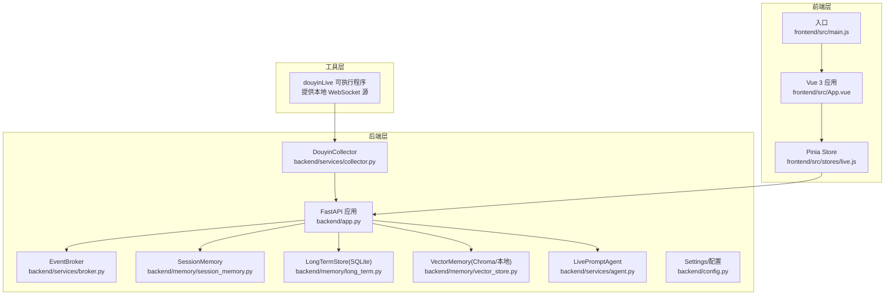

图表来源
- [backend/app.py:94-220](file://backend/app.py#L94-L220)
- [backend/services/collector.py:38-284](file://backend/services/collector.py#L38-L284)
- [backend/services/broker.py:10-40](file://backend/services/broker.py#L10-L40)
- [backend/memory/session_memory.py:17-113](file://backend/memory/session_memory.py#L17-L113)
- [backend/memory/long_term.py:36-750](file://backend/memory/long_term.py#L36-L750)
- [backend/memory/vector_store.py:52-108](file://backend/memory/vector_store.py#L52-L108)
- [backend/services/agent.py:23-393](file://backend/services/agent.py#L23-L393)
- [backend/config.py:39-94](file://backend/config.py#L39-L94)
- [frontend/src/stores/live.js:70-310](file://frontend/src/stores/live.js#L70-L310)
- [frontend/src/App.vue:1-66](file://frontend/src/App.vue#L1-L66)
- [frontend/src/main.js:1-17](file://frontend/src/main.js#L1-L17)

章节来源
- [README.md:35-48](file://README.md#L35-L48)
- [backend/app.py:94-220](file://backend/app.py#L94-L220)

## 核心组件
- 配置中心 Settings：负责从环境变量与 .env 解析运行参数，提供 LLM 地址/模型、Redis/Chroma/数据库路径等。
- DouyinCollector：连接本地 WebSocket，解析原始消息为 LiveEvent，提交至后端事件循环。
- EventBroker：进程内事件广播器，向 SSE/WS 订阅者分发事件、建议、统计与模型状态。
- SessionMemory：短期记忆，优先 Redis，否则进程内内存，保存最近事件与建议。
- LongTermStore：SQLite 长期存储，持久化事件、建议、用户画像、会话与索引。
- VectorMemory：向量检索，优先 Chroma，否则本地文本相似度，支撑建议生成的上下文召回。
- LivePromptAgent：建议生成器，优先 OpenAI 兼容接口，失败回退启发式规则。
- FastAPI 应用：提供健康检查、房间切换、事件注入、SSE/WS 实时流与 Viewer 相关查询。
- 前端 Store：封装房间切换、SSE 连接、事件/建议/统计/模型状态的本地状态与持久化。

章节来源
- [backend/config.py:39-94](file://backend/config.py#L39-L94)
- [backend/services/collector.py:38-284](file://backend/services/collector.py#L38-L284)
- [backend/services/broker.py:10-40](file://backend/services/broker.py#L10-L40)
- [backend/memory/session_memory.py:17-113](file://backend/memory/session_memory.py#L17-L113)
- [backend/memory/long_term.py:36-750](file://backend/memory/long_term.py#L36-L750)
- [backend/memory/vector_store.py:52-108](file://backend/memory/vector_store.py#L52-L108)
- [backend/services/agent.py:23-393](file://backend/services/agent.py#L23-L393)
- [backend/app.py:94-220](file://backend/app.py#L94-L220)
- [frontend/src/stores/live.js:70-310](file://frontend/src/stores/live.js#L70-L310)

## 架构总览
系统以 FastAPI 为中心，围绕“采集-广播-存储-生成-推送-消费”闭环组织组件。采集器从本地 WebSocket 接收消息，标准化为 LiveEvent 后进入应用处理流程，经短期/长期存储与向量检索构建上下文，生成建议并通过事件总线推送到前端。

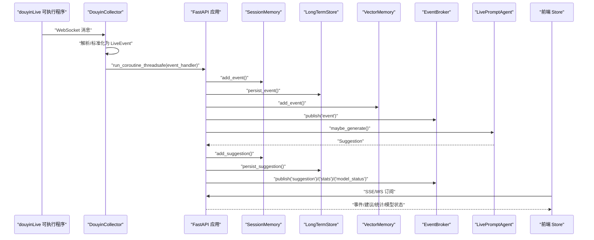

图表来源
- [backend/services/collector.py:145-160](file://backend/services/collector.py#L145-L160)
- [backend/app.py:61-78](file://backend/app.py#L61-L78)
- [backend/services/broker.py:28-40](file://backend/services/broker.py#L28-L40)
- [backend/services/agent.py:73-94](file://backend/services/agent.py#L73-L94)
- [frontend/src/stores/live.js:173-205](file://frontend/src/stores/live.js#L173-L205)

## 详细组件分析

### 组件 A：DouyinCollector（WebSocket 消息采集与标准化）
- 职责
  - 连接本地 WebSocket（端口来自配置），维持心跳与断线重连。
  - 解析 JSON 消息，按方法映射为事件类型，抽取用户与礼物元数据，构造 LiveEvent。
  - 通过线程安全方式将事件提交到后端事件循环，交由应用处理。
- 关键点
  - 方法到事件类型的映射表，确保不同消息被归一化。
  - 礼物计数与钻石数的提取策略，保障后续统计与建议质量。
  - 异常日志与线程停止逻辑，避免资源泄漏。
- 错误处理
  - 非 JSON 消息直接丢弃并记录警告。
  - WebSocket 错误/关闭时记录状态并按配置延迟重连。
  - 事件处理回调异常会被捕获并记录，不影响采集线程。
- 性能优化
  - 使用独立线程与守护线程，避免阻塞主线程。
  - 心跳线程与主采集线程分离，降低耦合。
  - 事件提交使用线程安全的 run_coroutine_threadsafe，避免跨线程事件丢失。

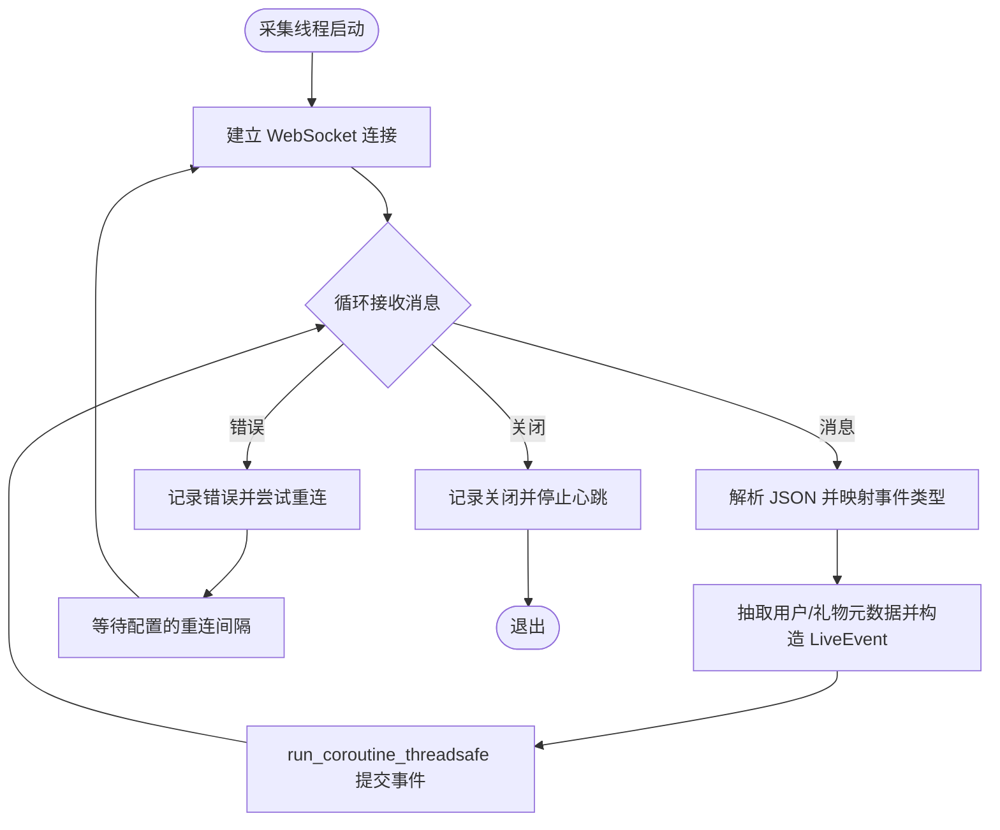

图表来源
- [backend/services/collector.py:117-181](file://backend/services/collector.py#L117-L181)
- [backend/services/collector.py:225-284](file://backend/services/collector.py#L225-L284)

章节来源
- [backend/services/collector.py:38-284](file://backend/services/collector.py#L38-L284)
- [backend/config.py:46-50](file://backend/config.py#L46-L50)
- [tool/config.yaml:4-5](file://tool/config.yaml#L4-L5)

### 组件 B：EventBroker（进程内事件广播）
- 职责
  - 维护订阅队列集合，发布时广播给所有订阅者。
  - 自动清理过期/满队列导致的陈旧队列，保持广播效率。
- 接口契约
  - subscribe()/unsubscribe() 返回/移除 asyncio.Queue。
  - publish() 异步投递，内部处理队列满的情况。
- 性能与可靠性
  - 使用异步队列避免阻塞发布线程。
  - 发布失败自动剔除异常队列，防止广播风暴。

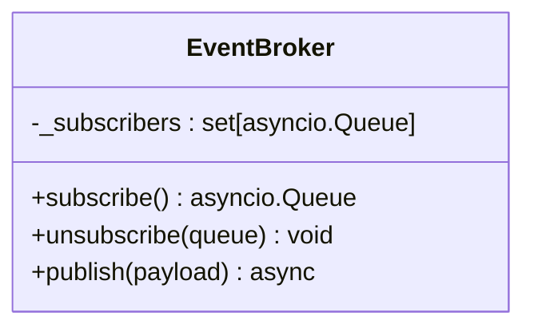

图表来源
- [backend/services/broker.py:10-40](file://backend/services/broker.py#L10-L40)

章节来源
- [backend/services/broker.py:10-40](file://backend/services/broker.py#L10-L40)

### 组件 C：SessionMemory（短期会话内存）
- 职责
  - 保存最近事件与建议，支持 Redis 与进程内两种后端。
  - 提供最近事件/建议读取与统计计算。
- 接口契约
  - add_event()/add_suggestion() 写入短期缓存。
  - recent_events()/recent_suggestions() 读取最近项。
  - stats() 基于窗口统计事件类型分布。
- 降级策略
  - 未安装 Redis 或未配置地址时，自动退化为进程内双端队列，保证功能可用。

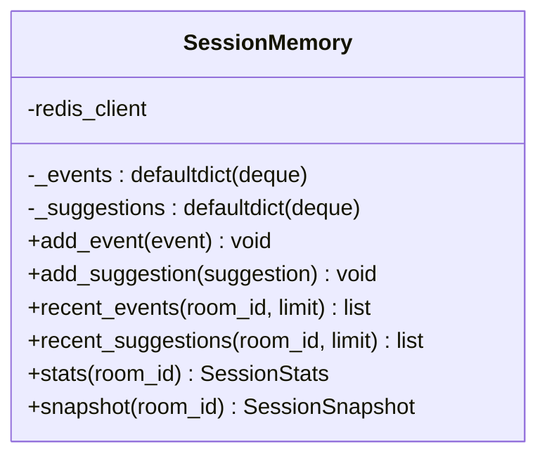

图表来源
- [backend/memory/session_memory.py:17-113](file://backend/memory/session_memory.py#L17-L113)

章节来源
- [backend/memory/session_memory.py:17-113](file://backend/memory/session_memory.py#L17-L113)

### 组件 D：LongTermStore（SQLite 长期存储）
- 职责
  - 事件、建议、用户画像、礼物历史、直播会话与备注的持久化。
  - 维护索引与列迁移，确保历史数据一致性与查询性能。
- 接口契约
  - persist_event()/persist_suggestion() 写入数据库。
  - recent_events()/recent_suggestions()/stats() 查询最近与统计。
  - get_user_profile()/get_viewer_detail() 汇总用户画像与历史。
  - list_live_sessions()/get_active_session()/close_active_session() 会话管理。
- 降级策略
  - 无 Chroma 时，向量检索退化为本地文本相似度，保证检索能力可用。

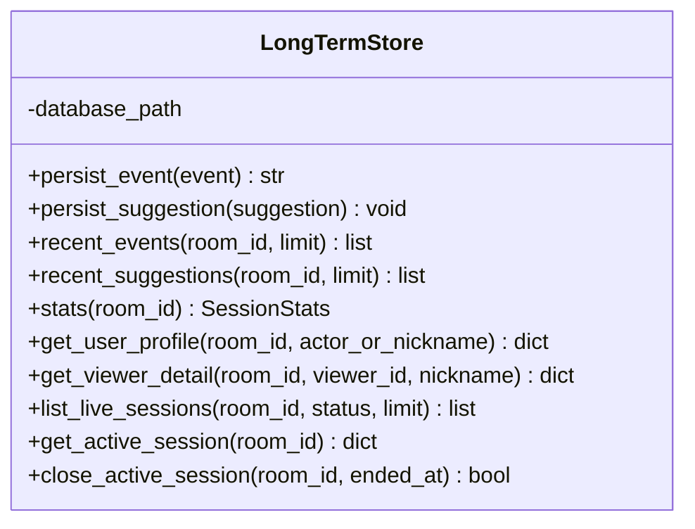

图表来源
- [backend/memory/long_term.py:36-750](file://backend/memory/long_term.py#L36-L750)

章节来源
- [backend/memory/long_term.py:36-750](file://backend/memory/long_term.py#L36-L750)

### 组件 E：VectorMemory（向量检索）
- 职责
  - 将事件内容与用户昵称组合为文档，写入向量索引。
  - 提供相似历史检索，辅助建议生成。
- 降级策略
  - 未安装 Chroma 时，使用本地哈希嵌入与简单文本相似度，保证检索可用性。

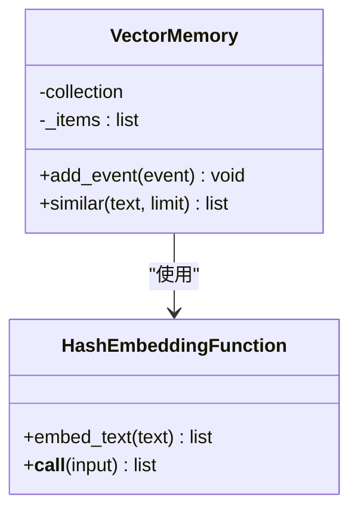

图表来源
- [backend/memory/vector_store.py:19-108](file://backend/memory/vector_store.py#L19-L108)

章节来源
- [backend/memory/vector_store.py:19-108](file://backend/memory/vector_store.py#L19-L108)

### 组件 F：LivePromptAgent（建议生成）
- 职责
  - 基于事件与上下文生成建议，优先 OpenAI 兼容接口，失败回退启发式规则。
  - 维护模型状态（模式、模型名、后端、结果与错误）。
- 上下文构建
  - 最近事件窗口、相似历史（向量检索）、用户画像（SQLite）。
- 错误处理
  - HTTP/网络/超时/JSON 解析/OS 错误均捕获并标记状态，必要时回退。
- 接口契约
  - maybe_generate() 仅对 comment/gift/follow 生成建议。
  - current_status() 返回模型状态快照。

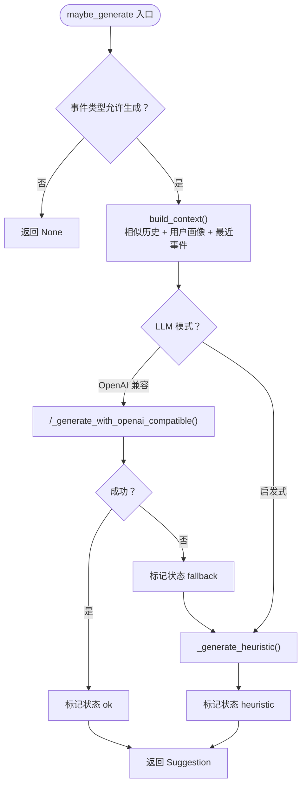

图表来源
- [backend/services/agent.py:73-114](file://backend/services/agent.py#L73-L114)
- [backend/services/agent.py:183-330](file://backend/services/agent.py#L183-L330)

章节来源
- [backend/services/agent.py:23-393](file://backend/services/agent.py#L23-L393)

### 组件 G：FastAPI 应用（编排与接口）
- 职责
  - 初始化 Broker、SessionMemory、LongTermStore、VectorMemory、Agent。
  - 生命周期：启动时启动采集器，关闭时清理活动会话与采集器。
  - 提供健康检查、房间切换、事件注入、Viewer 查询、SSE/WS 实时流。
- 接口契约
  - GET /health：返回服务状态与房间号。
  - GET /api/bootstrap：返回快照（最近事件/建议/统计/模型状态）。
  - POST /api/room：切换房间并返回新快照。
  - POST /api/events：手动注入事件并返回建议。
  - GET /api/events/stream：SSE 实时流。
  - GET /ws/live：WebSocket 实时流。
- 数据流
  - process_event() 串联短期/长期存储、向量索引、事件总线与建议生成。

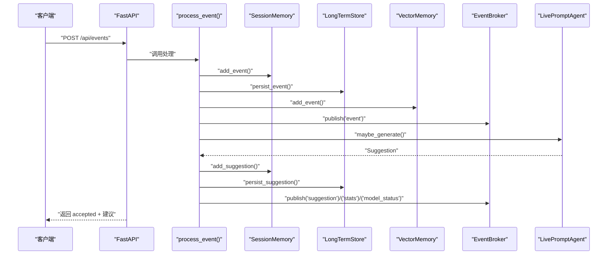

图表来源
- [backend/app.py:61-78](file://backend/app.py#L61-L78)
- [backend/app.py:129-133](file://backend/app.py#L129-L133)

章节来源
- [backend/app.py:94-220](file://backend/app.py#L94-L220)

### 组件 H：前端 Store（实时数据同步）
- 职责
  - 启动时拉取快照，随后通过 SSE 订阅事件、建议、统计与模型状态。
  - 支持房间切换、事件过滤、主题切换与本地持久化。
- 接口契约
  - bootstrap()：GET /api/bootstrap。
  - connect()：EventSource 订阅 /api/events/stream。
  - switchRoom()：POST /api/room 切换房间并重新订阅。
- 数据流
  - ingestEvent()/ingestSuggestion() 更新本地状态，触发 UI 渲染。

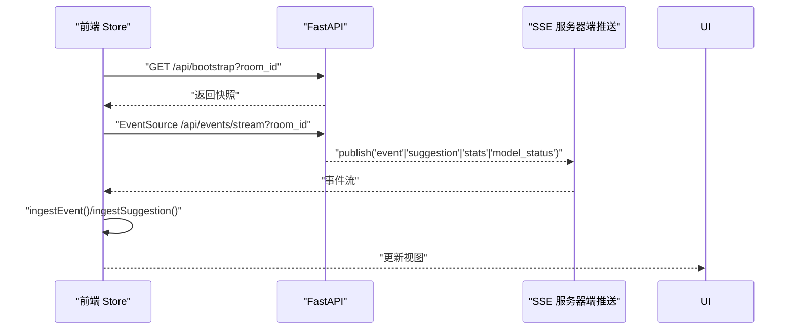

图表来源
- [frontend/src/stores/live.js:158-205](file://frontend/src/stores/live.js#L158-L205)
- [backend/app.py:187-206](file://backend/app.py#L187-L206)

章节来源
- [frontend/src/stores/live.js:70-310](file://frontend/src/stores/live.js#L70-L310)
- [frontend/src/App.vue:29-32](file://frontend/src/App.vue#L29-L32)
- [frontend/src/main.js:12-16](file://frontend/src/main.js#L12-L16)

## 依赖分析
- 组件耦合
  - FastAPI 应用集中编排 Collector、Broker、Memory、Agent，形成强内聚。
  - Broker 作为事件中枢，解耦生产者与消费者。
  - Memory 层采用分层设计，短期/长期/向量三层职责清晰。
- 外部依赖
  - Redis：可选，提升短期缓存吞吐。
  - Chroma：可选，提供高效向量检索。
  - SQLite：必选，保证长期数据持久化。
- 循环依赖
  - 未发现直接循环依赖；组件通过接口契约与事件总线间接通信。

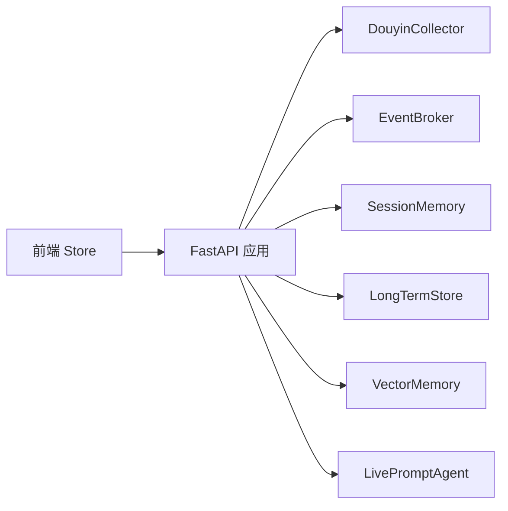

图表来源
- [backend/app.py:25-29](file://backend/app.py#L25-L29)
- [backend/app.py:81-81](file://backend/app.py#L81-L81)
- [frontend/src/stores/live.js:173-205](file://frontend/src/stores/live.js#L173-L205)

章节来源
- [backend/app.py:25-29](file://backend/app.py#L25-L29)
- [backend/app.py:81-81](file://backend/app.py#L81-L81)

## 性能考量
- 采集与处理分离
  - 采集器在独立线程运行，避免阻塞事件循环。
  - 通过 run_coroutine_threadsafe 将事件提交到后端事件循环，保证线程安全。
- 缓存与索引
  - SessionMemory 限制窗口长度，控制内存占用。
  - VectorMemory 在无 Chroma 时使用本地相似度，避免外部依赖带来的性能波动。
- 广播与订阅
  - EventBroker 使用异步队列，避免广播阻塞。
  - 订阅端按房间过滤，减少无效渲染。
- I/O 与超时
  - LLM 请求设置超时，失败快速回退启发式规则，避免前端等待。
- 存储优化
  - SQLite 索引与列迁移，保证查询效率与数据一致性。

## 故障排查指南
- 采集器无法连接
  - 检查本地 WebSocket 端口与房间号配置，确认工具层配置文件端口一致。
  - 查看采集器日志中的重连间隔与错误信息。
- SSE/WS 无法接收
  - 确认前端已正确发起 EventSource/WS 订阅。
  - 检查后端 /api/events/stream 与 /ws/live 的房间过滤逻辑。
- 建议生成失败
  - 查看模型状态（last_result/last_error），确认是否回退到启发式。
  - 检查 LLM 地址/模型/密钥与超时设置。
- 存储异常
  - SQLite 表结构变更与索引重建逻辑会在启动时执行，若异常需检查权限与磁盘空间。
- Redis/Chroma 不可用
  - 系统具备降级能力，短期/向量功能仍可用，但性能可能下降。

章节来源
- [backend/services/collector.py:117-181](file://backend/services/collector.py#L117-L181)
- [backend/services/agent.py:44-54](file://backend/services/agent.py#L44-L54)
- [backend/memory/long_term.py:50-155](file://backend/memory/long_term.py#L50-L155)
- [frontend/src/stores/live.js:173-205](file://frontend/src/stores/live.js#L173-L205)

## 结论
该系统通过清晰的组件边界与事件驱动架构，实现了从本地 WebSocket 消息源到前端实时展示的完整链路。短期/长期/向量三层存储与启发式/模型双重建议策略，既保证了基本可用性，又提供了可扩展的智能化能力。通过 SSE/WS 与事件总线，前端能够实时感知后端状态变化，实现低延迟的直播提词体验。

## 附录
- 关键文件路径与作用
  - [backend/app.py](file://backend/app.py)：应用入口、生命周期、接口与事件处理编排。
  - [backend/services/collector.py](file://backend/services/collector.py)：WebSocket 采集与消息标准化。
  - [backend/services/broker.py](file://backend/services/broker.py)：进程内事件广播。
  - [backend/memory/session_memory.py](file://backend/memory/session_memory.py)：短期会话内存。
  - [backend/memory/long_term.py](file://backend/memory/long_term.py)：SQLite 长期存储。
  - [backend/memory/vector_store.py](file://backend/memory/vector_store.py)：向量检索。
  - [backend/services/agent.py](file://backend/services/agent.py)：建议生成器。
  - [backend/schemas/live.py](file://backend/schemas/live.py)：数据模型定义。
  - [backend/config.py](file://backend/config.py)：配置解析与默认值。
  - [frontend/src/stores/live.js](file://frontend/src/stores/live.js)：前端状态与实时订阅。
  - [frontend/src/App.vue](file://frontend/src/App.vue)：应用挂载与组件布局。
  - [frontend/src/main.js](file://frontend/src/main.js)：应用入口与 Pinia 注册。
  - [README.md](file://README.md)：项目说明与架构概览。
  - [tool/config.yaml](file://tool/config.yaml)：本地 WebSocket 端口配置。