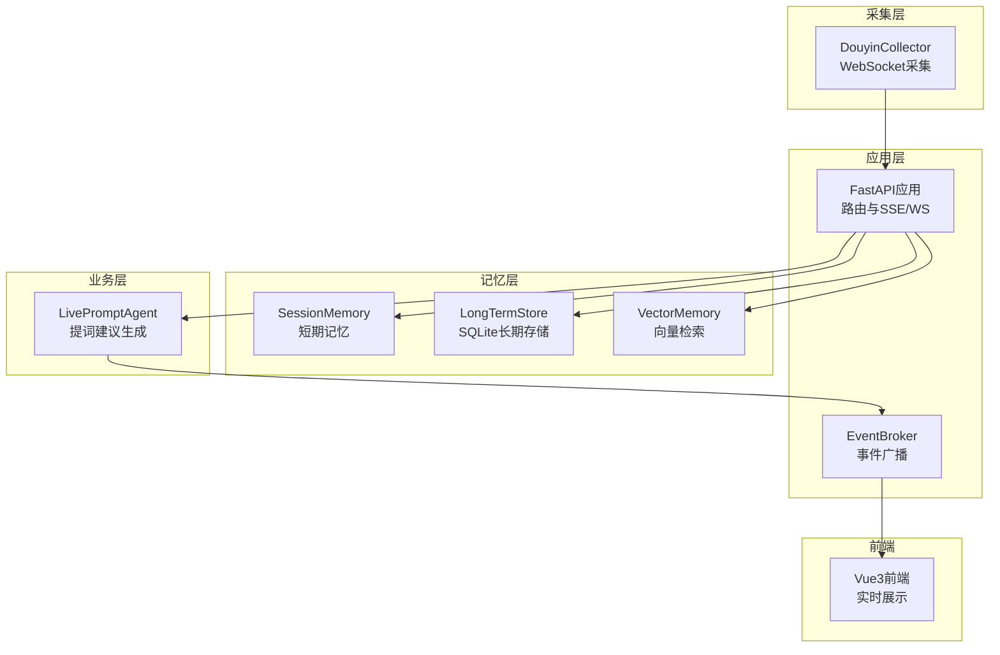
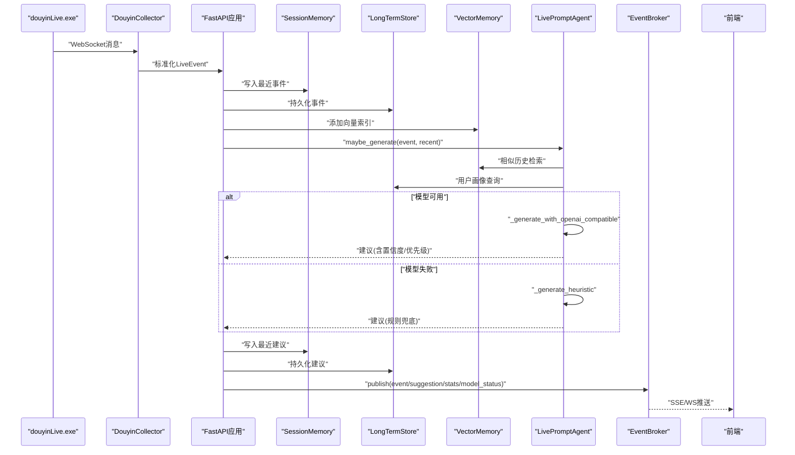
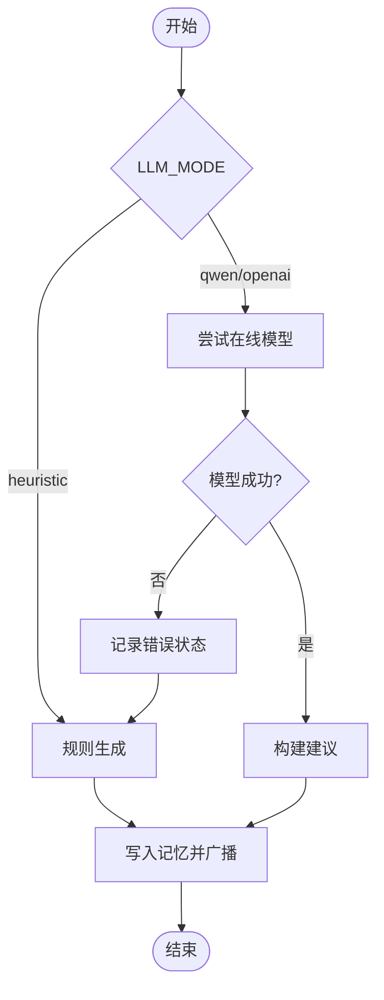
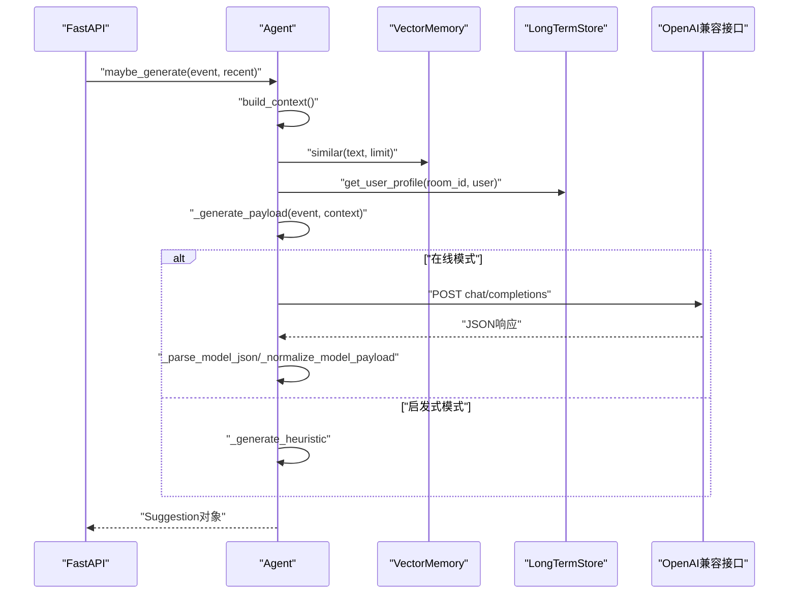
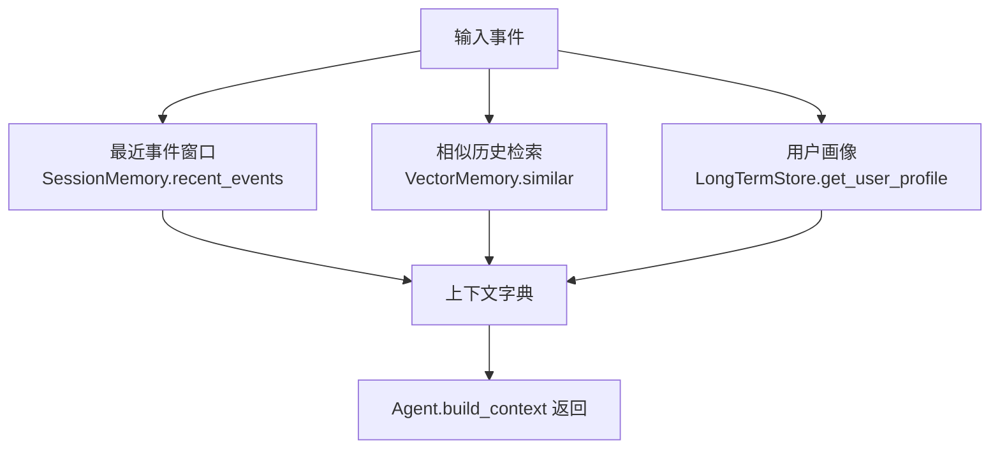
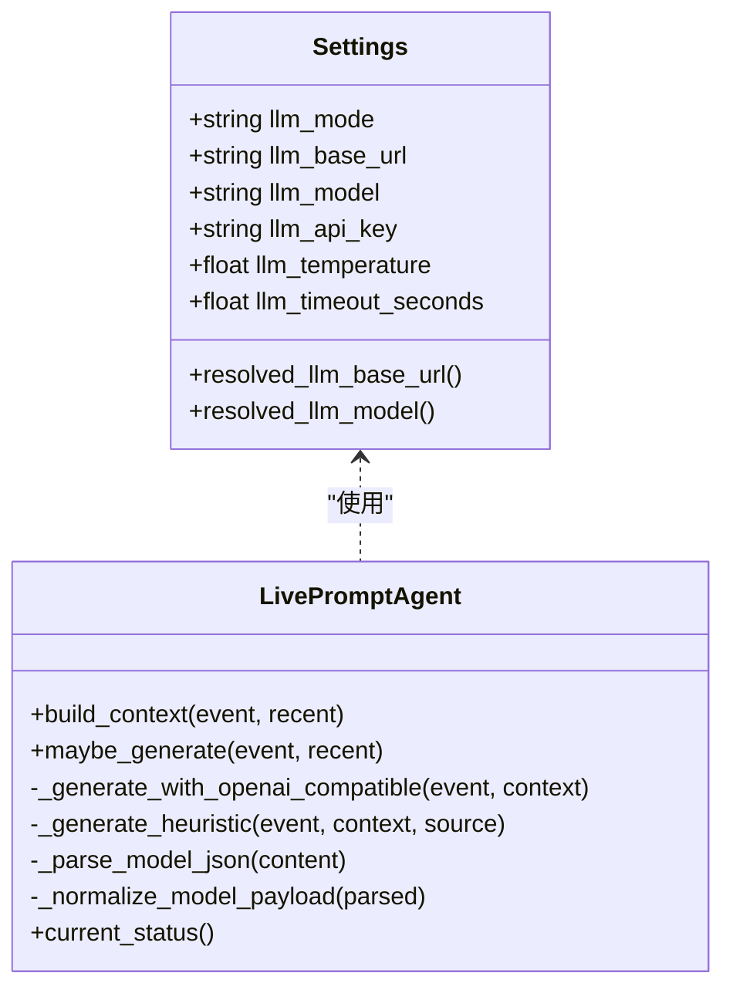
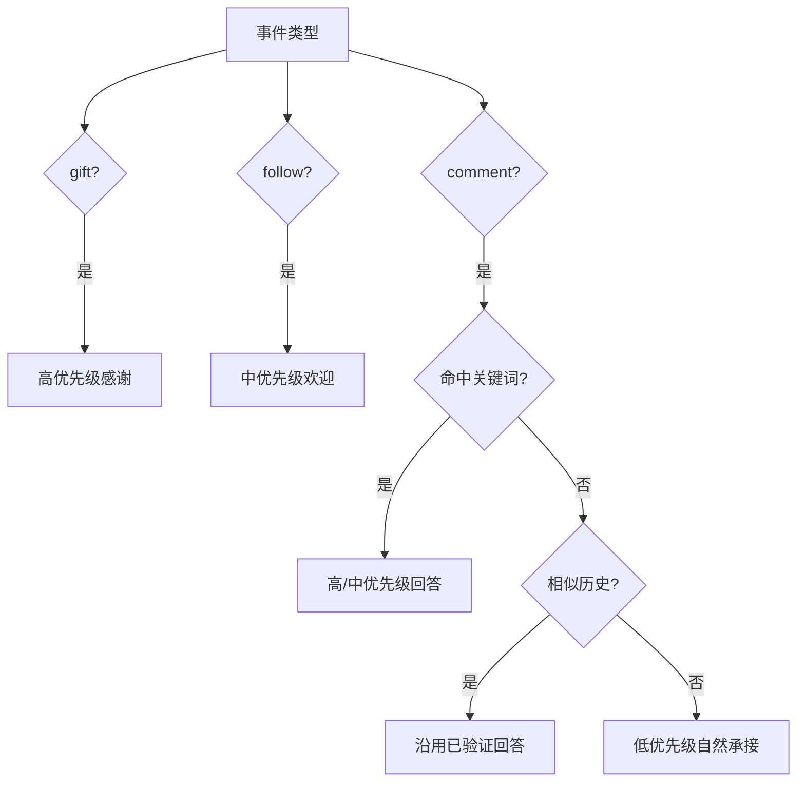
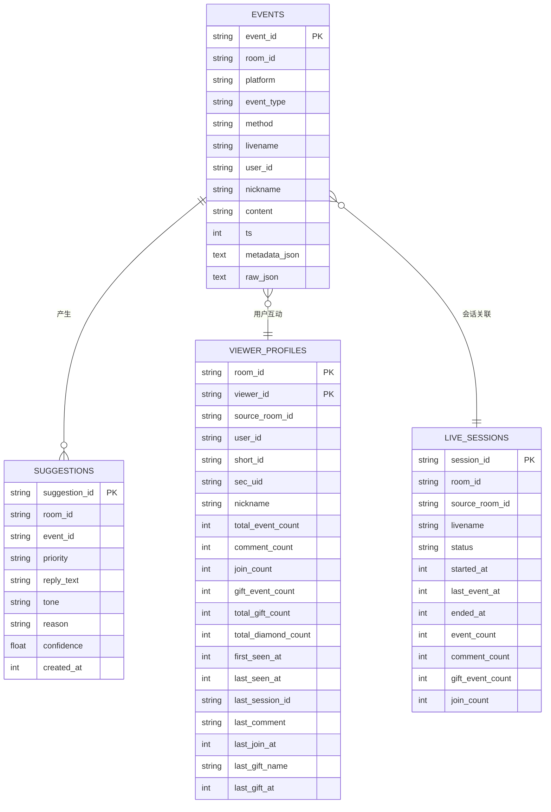
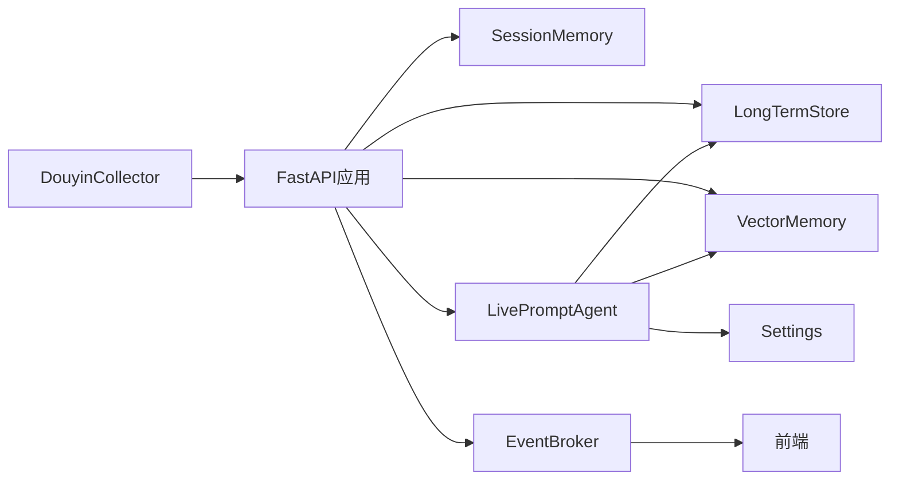

# AI提词建议生成

<cite>
**本文引用的文件**
- [backend/app.py](file://backend/app.py)
- [backend/config.py](file://backend/config.py)
- [backend/services/agent.py](file://backend/services/agent.py)
- [backend/memory/vector_store.py](file://backend/memory/vector_store.py)
- [backend/memory/session_memory.py](file://backend/memory/session_memory.py)
- [backend/memory/long_term.py](file://backend/memory/long_term.py)
- [backend/services/broker.py](file://backend/services/broker.py)
- [backend/services/collector.py](file://backend/services/collector.py)
- [backend/schemas/live.py](file://backend/schemas/live.py)
- [README.md](file://README.md)
- [USAGE.md](file://USAGE.md)
- [requirements.txt](file://requirements.txt)
- [tool/config.yaml](file://tool/config.yaml)
</cite>

## 目录
1. [简介](#简介)
2. [项目结构](#项目结构)
3. [核心组件](#核心组件)
4. [架构总览](#架构总览)
5. [详细组件分析](#详细组件分析)
6. [依赖分析](#依赖分析)
7. [性能考虑](#性能考虑)
8. [故障排查指南](#故障排查指南)
9. [结论](#结论)
10. [附录](#附录)

## 简介
本项目为抖音直播场景设计的实时提词建议系统，支持双模式AI架构：在线OpenAI兼容接口模式与本地启发式规则模式。系统通过采集器接入本地WebSocket消息源，标准化为统一事件后，写入短期记忆、长期存储与向量检索，随后由提词Agent根据事件类型与上下文选择模型或规则生成建议，并通过SSE/WS实时推送到前端。

## 项目结构
后端采用分层架构：
- 应用入口与路由：FastAPI应用负责REST、SSE、WebSocket接口
- 采集层：DouyinCollector连接本地WebSocket，标准化为LiveEvent
- 记忆层：SessionMemory（Redis/进程内）、LongTermStore（SQLite）、VectorMemory（Chroma/轻量）
- 业务层：LivePromptAgent负责上下文构建、模型调用与回退策略
- 广播层：EventBroker负责事件分发
- 配置层：Settings集中管理运行参数与模型解析

**图表来源**
- [backend/app.py:94-220](file://backend/app.py#L94-L220)
- [backend/services/collector.py:38-284](file://backend/services/collector.py#L38-L284)
- [backend/services/broker.py:10-40](file://backend/services/broker.py#L10-L40)
- [backend/memory/session_memory.py:17-113](file://backend/memory/session_memory.py#L17-L113)
- [backend/memory/long_term.py:36-750](file://backend/memory/long_term.py#L36-L750)
- [backend/memory/vector_store.py:52-108](file://backend/memory/vector_store.py#L52-L108)
- [backend/services/agent.py:23-393](file://backend/services/agent.py#L23-L393)

**章节来源**
- [README.md:35-48](file://README.md#L35-L48)
- [backend/app.py:94-220](file://backend/app.py#L94-L220)
- [backend/services/collector.py:38-284](file://backend/services/collector.py#L38-L284)
- [backend/services/broker.py:10-40](file://backend/services/broker.py#L10-L40)
- [backend/memory/session_memory.py:17-113](file://backend/memory/session_memory.py#L17-L113)
- [backend/memory/long_term.py:36-750](file://backend/memory/long_term.py#L36-L750)
- [backend/memory/vector_store.py:52-108](file://backend/memory/vector_store.py#L52-L108)
- [backend/services/agent.py:23-393](file://backend/services/agent.py#L23-L393)

## 核心组件
- 配置中心（Settings）：解析LLM模式、模型名、基础URL、API Key、温度与超时等参数，并提供最终解析后的模型与后端地址
- 采集器（DouyinCollector）：连接本地WebSocket，标准化为LiveEvent，提交至事件循环
- 应用入口（FastAPI）：写入短期/长期/向量记忆，触发Agent生成建议并通过SSE/WS广播
- Agent（LivePromptAgent）：构建上下文、优先调用OpenAI兼容接口、失败回退规则、记录状态
- 记忆层：短期SessionMemory（Redis/进程内）、长期LongTermStore（SQLite）、向量VectorMemory（Chroma/轻量）
- 广播器（EventBroker）：将事件、建议、统计与模型状态分发给SSE/WS订阅者

**章节来源**
- [backend/config.py:39-94](file://backend/config.py#L39-L94)
- [backend/services/collector.py:38-284](file://backend/services/collector.py#L38-L284)
- [backend/app.py:25-78](file://backend/app.py#L25-L78)
- [backend/services/agent.py:23-393](file://backend/services/agent.py#L23-L393)
- [backend/memory/session_memory.py:17-113](file://backend/memory/session_memory.py#L17-L113)
- [backend/memory/long_term.py:36-750](file://backend/memory/long_term.py#L36-L750)
- [backend/memory/vector_store.py:52-108](file://backend/memory/vector_store.py#L52-L108)
- [backend/services/broker.py:10-40](file://backend/services/broker.py#L10-L40)

## 架构总览
系统链路由采集器接入本地WebSocket，标准化事件后进入FastAPI处理流程：写入短期记忆、长期存储与向量索引，随后由Agent根据事件类型与上下文生成建议，最后通过SSE/WS推送到前端。Agent在非启发式模式下优先调用OpenAI兼容接口，失败时自动回退到本地规则。

**图表来源**
- [backend/services/collector.py:117-284](file://backend/services/collector.py#L117-L284)
- [backend/app.py:61-78](file://backend/app.py#L61-L78)
- [backend/services/agent.py:73-114](file://backend/services/agent.py#L73-L114)
- [backend/services/broker.py:28-40](file://backend/services/broker.py#L28-L40)

**章节来源**
- [README.md:35-48](file://README.md#L35-L48)
- [backend/app.py:61-78](file://backend/app.py#L61-L78)
- [backend/services/agent.py:73-114](file://backend/services/agent.py#L73-L114)

## 详细组件分析

### 双模式AI支持架构与切换机制
- 模式选择：通过配置项LLM_MODE决定Agent行为
  - heuristic：仅走本地规则，不调用远程模型
  - qwen/openai：调用DashScope/OpenAI兼容接口，失败自动回退规则
- 模型解析：resolved_llm_base_url与resolved_llm_model根据模式与配置解析最终地址与模型名
- 回退策略：Agent在非启发式模式下优先尝试在线模型，捕获HTTP/网络/超时/JSON解析异常后标记状态并回退规则

**图表来源**
- [backend/config.py:70-91](file://backend/config.py#L70-L91)
- [backend/services/agent.py:96-114](file://backend/services/agent.py#L96-L114)
- [backend/services/agent.py:183-329](file://backend/services/agent.py#L183-L329)

**章节来源**
- [backend/config.py:56-91](file://backend/config.py#L56-L91)
- [backend/services/agent.py:96-114](file://backend/services/agent.py#L96-L114)
- [backend/services/agent.py:183-329](file://backend/services/agent.py#L183-L329)

### 建议生成流程详解
- 事件过滤：仅对comment/gift/follow生成建议
- 上下文构建：最近事件窗口、相似历史片段、用户画像
- 模型调用：构造提示词与系统指令，发送至OpenAI兼容接口
- 结果后处理：解析JSON、规范化字段、计算置信度与优先级
- 回退规则：在无模型或失败时，依据事件类型与关键词生成规则建议

**图表来源**
- [backend/services/agent.py:73-114](file://backend/services/agent.py#L73-L114)
- [backend/services/agent.py:56-71](file://backend/services/agent.py#L56-L71)
- [backend/memory/vector_store.py:85-108](file://backend/memory/vector_store.py#L85-L108)
- [backend/memory/long_term.py:718-734](file://backend/memory/long_term.py#L718-L734)
- [backend/services/agent.py:183-329](file://backend/services/agent.py#L183-L329)

**章节来源**
- [backend/services/agent.py:73-114](file://backend/services/agent.py#L73-L114)
- [backend/services/agent.py:56-71](file://backend/services/agent.py#L56-L71)
- [backend/memory/vector_store.py:85-108](file://backend/memory/vector_store.py#L85-L108)
- [backend/memory/long_term.py:718-734](file://backend/memory/long_term.py#L718-L734)
- [backend/services/agent.py:183-329](file://backend/services/agent.py#L183-L329)

### 上下文构建策略
- 最近事件窗口：从短期记忆取最近N条事件，限定长度避免上下文过长
- 相似历史检索：基于向量检索返回与当前内容最相近的历史片段
- 用户画像：从长期存储聚合用户互动、礼物、会话等特征，辅助生成个性化建议
- 上下文整合：将最近事件、相似历史与用户画像打包传入Agent

**图表来源**
- [backend/services/agent.py:56-71](file://backend/services/agent.py#L56-L71)
- [backend/memory/session_memory.py:66-84](file://backend/memory/session_memory.py#L66-L84)
- [backend/memory/vector_store.py:85-108](file://backend/memory/vector_store.py#L85-L108)
- [backend/memory/long_term.py:718-734](file://backend/memory/long_term.py#L718-L734)

**章节来源**
- [backend/services/agent.py:56-71](file://backend/services/agent.py#L56-L71)
- [backend/memory/session_memory.py:66-84](file://backend/memory/session_memory.py#L66-L84)
- [backend/memory/vector_store.py:85-108](file://backend/memory/vector_store.py#L85-L108)
- [backend/memory/long_term.py:718-734](file://backend/memory/long_term.py#L718-L734)

### AI模型配置与调用方式
- 配置项
  - LLM_MODE：heuristic/qwen/openai
  - LLM_BASE_URL：模型服务地址（自动解析）
  - LLM_MODEL：模型名（自动解析）
  - LLM_API_KEY/DASHSCOPE_API_KEY：鉴权
  - LLM_TEMPERATURE：采样温度
  - LLM_TIMEOUT_SECONDS：超时控制
- 调用流程
  - 构造system/user消息与指令
  - 发送POST请求至/chat/completions
  - 解析响应、校验字段、规范化输出
- 错误回退
  - 捕获HTTP/网络/超时/JSON解析异常，记录状态并回退规则

**图表来源**
- [backend/config.py:39-94](file://backend/config.py#L39-L94)
- [backend/services/agent.py:23-393](file://backend/services/agent.py#L23-L393)

**章节来源**
- [backend/config.py:56-91](file://backend/config.py#L56-L91)
- [backend/services/agent.py:183-329](file://backend/services/agent.py#L183-L329)

### 启发式规则设计与应用场景
- 礼物事件：高优先级感谢，强调互动与支持
- 关注事件：中优先级欢迎，引导后续话题
- 评论关键词：针对价格/购买路径/减脂/体重等敏感词设定优先级与话术
- 相似历史：命中相似话题时沿用已验证回答路径
- 普通评论：低优先级，强调自然承接与继续互动

**图表来源**
- [backend/services/agent.py:115-181](file://backend/services/agent.py#L115-L181)

**章节来源**
- [backend/services/agent.py:115-181](file://backend/services/agent.py#L115-L181)

### 数据模型与存储
- LiveEvent：标准化直播事件
- Suggestion：建议输出模型
- SessionStats：房间统计
- ModelStatus：模型状态
- 长期存储表：events、suggestions、viewer_profiles、viewer_gifts、live_sessions、viewer_notes

**图表来源**
- [backend/memory/long_term.py:54-148](file://backend/memory/long_term.py#L54-L148)
- [backend/schemas/live.py:29-95](file://backend/schemas/live.py#L29-L95)

**章节来源**
- [backend/schemas/live.py:29-95](file://backend/schemas/live.py#L29-L95)
- [backend/memory/long_term.py:54-148](file://backend/memory/long_term.py#L54-L148)

## 依赖分析
- 组件耦合
  - FastAPI应用依赖SessionMemory、LongTermStore、VectorMemory与Agent
  - Agent依赖Settings、VectorMemory与LongTermStore
  - Collector与FastAPI通过事件循环解耦
  - Broker作为发布/订阅中介，降低耦合
- 外部依赖
  - 可选：Redis（短期记忆）、Chroma（向量检索）、websocket-client、fastapi、uvicorn

**图表来源**
- [backend/app.py:25-29](file://backend/app.py#L25-L29)
- [backend/services/agent.py:23-30](file://backend/services/agent.py#L23-L30)
- [requirements.txt:1-6](file://requirements.txt#L1-L6)

**章节来源**
- [backend/app.py:25-29](file://backend/app.py#L25-L29)
- [backend/services/agent.py:23-30](file://backend/services/agent.py#L23-L30)
- [requirements.txt:1-6](file://requirements.txt#L1-L6)

## 性能考虑
- 记忆窗口与索引
  - SessionMemory使用定长队列限制最近事件与建议数量，避免内存膨胀
  - VectorMemory在有Chroma时使用持久化集合，无Chroma时采用轻量哈希嵌入与文本相似策略
- I/O与并发
  - 采集器在独立线程中运行，通过事件循环安全提交事件
  - SSE/WS使用异步队列广播，避免阻塞
- 模型调用
  - 设置合理超时，避免阻塞主线程
  - 在线模式失败快速回退规则，保障实时性
- 存储
  - SQLite按房间索引建立多处索引，提升查询效率

**章节来源**
- [backend/memory/session_memory.py:17-113](file://backend/memory/session_memory.py#L17-L113)
- [backend/memory/vector_store.py:52-108](file://backend/memory/vector_store.py#L52-L108)
- [backend/services/collector.py:117-284](file://backend/services/collector.py#L117-L284)
- [backend/services/broker.py:10-40](file://backend/services/broker.py#L10-L40)
- [backend/memory/long_term.py:183-195](file://backend/memory/long_term.py#L183-L195)

## 故障排查指南
- 页面无建议
  - 检查douyinLive是否启动、ROOM_ID是否正确、直播间是否开播
  - 查看后端日志是否连接到本地WebSocket
- 显示fallback
  - 检查API Key是否正确、网络是否可达、是否存在超时或限流
- 显示heuristic
  - 确认LLM_MODE未被设置为heuristic或.env加载正确
- 前端无法打开
  - 检查前端端口占用与启动脚本
- 后端启动但无数据
  - 确认采集器已连接且房间有消息

**章节来源**
- [USAGE.md:198-256](file://USAGE.md#L198-L256)

## 结论
该系统通过双模式AI架构实现了直播提词建议的高可用与高实时性：在线模式提供更强的语义理解能力，失败时自动回退规则确保稳定输出。短期/长期/向量三层记忆协同，结合SSE/WS的实时推送，为前端提供了丰富的交互与状态展示。开发者可根据业务场景调整模型参数、回退策略与上下文构建逻辑，以获得更贴合直播风格的建议生成效果。

## 附录
- 快速开始与配置要点
  - 启动douyinLive.exe，配置.env中的ROOM_ID与API Key，安装依赖后启动后端与前端
- 模型配置示例
  - Qwen在线模式：LLM_MODE=qwen，设置DASHSCOPE_API_KEY与LLM_BASE_URL
  - 自定义OpenAI兼容服务：LLM_MODE=openai，设置LLM_BASE_URL与LLM_MODEL
  - 纯规则模式：LLM_MODE=heuristic
- 性能优化建议
  - 合理设置LLM_TIMEOUT_SECONDS与SessionMemory窗口大小
  - 在具备条件时启用Redis与Chroma以提升扩展性
  - 根据直播内容调优Agent规则与向量检索阈值

**章节来源**
- [README.md:66-141](file://README.md#L66-L141)
- [USAGE.md:24-115](file://USAGE.md#L24-L115)
- [backend/config.py:56-91](file://backend/config.py#L56-L91)