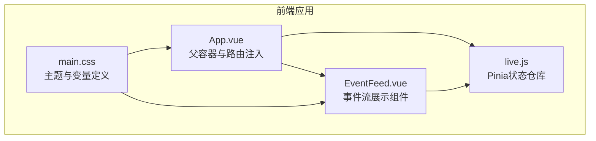
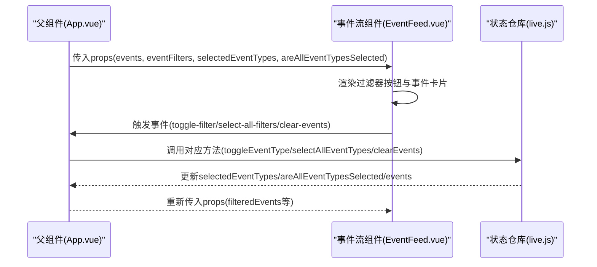
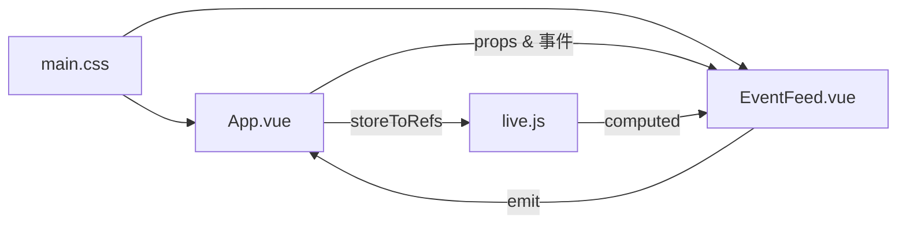
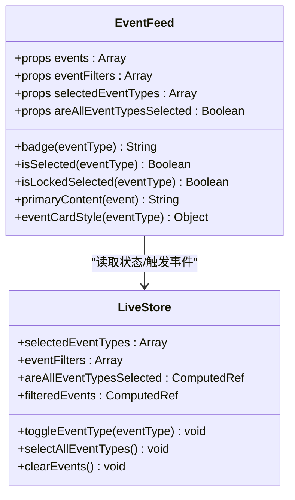

# 事件流组件

<cite>
**本文引用的文件**
- [EventFeed.vue](file://frontend/src/components/EventFeed.vue)
- [live.js](file://frontend/src/stores/live.js)
- [App.vue](file://frontend/src/App.vue)
- [main.css](file://frontend/src/assets/main.css)
</cite>

## 目录
1. [简介](#简介)
2. [项目结构](#项目结构)
3. [核心组件](#核心组件)
4. [架构总览](#架构总览)
5. [详细组件分析](#详细组件分析)
6. [依赖关系分析](#依赖关系分析)
7. [性能考量](#性能考量)
8. [故障排查指南](#故障排查指南)
9. [结论](#结论)
10. [附录](#附录)

## 简介
本文件为事件流组件(EventFeed.vue)的详细技术文档，面向前端开发者与产品/运营人员，系统性说明组件的props接口设计、事件类型徽章映射机制、事件卡片样式系统、事件过滤功能、内容展示逻辑以及事件发射机制。文档同时结合父组件(App.vue)与全局状态管理(live.js)对数据流与交互进行端到端解析，并给出可操作的优化建议与排障指引。

## 项目结构
事件流组件位于前端工程的组件目录中，通过Pinia状态管理与父组件进行数据与事件绑定，使用TailwindCSS变量实现主题化样式。

图表来源
- [App.vue:35-65](file://frontend/src/App.vue#L35-L65)
- [EventFeed.vue:88-182](file://frontend/src/components/EventFeed.vue#L88-L182)
- [live.js:70-309](file://frontend/src/stores/live.js#L70-L309)
- [main.css:1-144](file://frontend/src/assets/main.css#L1-L144)

章节来源
- [App.vue:1-66](file://frontend/src/App.vue#L1-L66)
- [EventFeed.vue:1-183](file://frontend/src/components/EventFeed.vue#L1-L183)
- [live.js:1-310](file://frontend/src/stores/live.js#L1-L310)
- [main.css:1-144](file://frontend/src/assets/main.css#L1-L144)

## 核心组件
事件流组件负责：
- 接收事件列表(events)、过滤器集合(eventFilters)、当前选中事件类型(selectedEventTypes)、是否全选状态(areAllEventTypesSelected)
- 渲染事件卡片，按事件类型应用边框与背景色
- 提供“清空”“显示全部”“切换过滤器”的交互
- 展示用户昵称与事件内容（多源优先级）

章节来源
- [EventFeed.vue:2-19](file://frontend/src/components/EventFeed.vue#L2-L19)
- [EventFeed.vue:21](file://frontend/src/components/EventFeed.vue#L21)
- [EventFeed.vue:48-85](file://frontend/src/components/EventFeed.vue#L48-L85)

## 架构总览
事件流组件与状态管理、父组件的交互如下：

图表来源
- [App.vue:54-62](file://frontend/src/App.vue#L54-L62)
- [EventFeed.vue:21](file://frontend/src/components/EventFeed.vue#L21)
- [live.js:252-277](file://frontend/src/stores/live.js#L252-L277)

## 详细组件分析

### Props接口设计
- events: 事件数组，用于渲染事件卡片列表
- eventFilters: 过滤器集合，包含每个过滤项的值与标签
- selectedEventTypes: 当前选中的事件类型数组
- areAllEventTypesSelected: 是否已全选所有事件类型

这些props由父组件从Pinia状态传递而来，确保组件无状态且可复用。

章节来源
- [EventFeed.vue:2-19](file://frontend/src/components/EventFeed.vue#L2-L19)
- [App.vue:54-58](file://frontend/src/App.vue#L54-L58)
- [live.js:77-78](file://frontend/src/stores/live.js#L77-L78)
- [live.js:78-79](file://frontend/src/stores/live.js#L78-L79)
- [live.js:106-108](file://frontend/src/stores/live.js#L106-L108)

### 事件类型徽章映射机制
组件根据事件类型返回对应的中文徽章文本，用于在事件卡片顶部展示。映射规则如下：
- comment → 弹幕
- gift → 礼物
- follow → 关注
- member → 进场
- like → 点赞
- 其他 → 系统

该映射在badge函数中实现，保证UI一致性和本地化体验。

章节来源
- [EventFeed.vue:23-38](file://frontend/src/components/EventFeed.vue#L23-L38)

### 事件卡片样式系统
组件为每种事件类型提供一组边框色与背景色，形成统一的视觉识别体系：
- comment：蓝色系
- gift：橙色系
- follow：绿色系
- member：紫色系
- like：粉色系
- 其他：基于主题变量的颜色

样式通过eventCardStyle函数返回内联样式对象，直接应用于事件卡片容器。

章节来源
- [EventFeed.vue:52-85](file://frontend/src/components/EventFeed.vue#L52-L85)
- [main.css:5-64](file://frontend/src/assets/main.css#L5-L64)

### 事件过滤功能实现
- 过滤器按钮的动态样式：选中时采用强调色边框与背景，未选中时使用浅色边框与背景；当仅剩一个选中项时，按钮禁用以防止误操作。
- 选中状态锁定机制：isLockedSelected通过isSelected与selectedEventTypes长度判断，确保至少保留一项选中。
- 全选功能：当areAllEventTypesSelected为真时，“显示全部”按钮禁用；点击后触发父组件selectAllEventTypes，恢复默认全选。

章节来源
- [EventFeed.vue:40-46](file://frontend/src/components/EventFeed.vue#L40-L46)
- [EventFeed.vue:120-135](file://frontend/src/components/EventFeed.vue#L120-L135)
- [EventFeed.vue:103-115](file://frontend/src/components/EventFeed.vue#L103-L115)
- [live.js:106-108](file://frontend/src/stores/live.js#L106-L108)
- [live.js:270-273](file://frontend/src/stores/live.js#L270-L273)

### 事件内容展示逻辑
组件采用primaryContent函数对事件内容进行多源优先级处理：
- 优先使用事件的content字段
- 若不存在，则回退到metadata.gift_name
- 再不存在则回退到method

该策略确保在不同事件类型下均能稳定展示可读内容。

章节来源
- [EventFeed.vue:48-50](file://frontend/src/components/EventFeed.vue#L48-L50)

### 事件发射机制
组件通过defineEmits声明并向上游发射三类事件：
- toggle-filter：切换某个事件类型的过滤状态
- select-all-filters：全选事件类型
- clear-events：清空事件列表

父组件监听这些事件并调用Pinia仓库的方法，完成状态更新与持久化。

章节来源
- [EventFeed.vue:21](file://frontend/src/components/EventFeed.vue#L21)
- [App.vue:59-61](file://frontend/src/App.vue#L59-L61)
- [live.js:252-268](file://frontend/src/stores/live.js#L252-L268)
- [live.js:270-273](file://frontend/src/stores/live.js#L270-L273)
- [live.js:275-277](file://frontend/src/stores/live.js#L275-L277)

### 数据流与状态管理
- 父组件从Pinia仓库解构出filteredEvents、eventFilters、selectedEventTypes、areAllEventTypesSelected等响应式数据
- filteredEvents由selectedEventTypes过滤events生成，确保组件只渲染被选中的事件
- 选中事件类型变化会触发computed areAllEventTypesSelected，影响“显示全部”按钮状态

章节来源
- [App.vue:11-27](file://frontend/src/App.vue#L11-L27)
- [live.js:109-111](file://frontend/src/stores/live.js#L109-L111)
- [live.js:106-108](file://frontend/src/stores/live.js#L106-L108)

## 依赖关系分析
事件流组件与外部模块的依赖关系如下：

图表来源
- [App.vue:54-62](file://frontend/src/App.vue#L54-L62)
- [EventFeed.vue:21](file://frontend/src/components/EventFeed.vue#L21)
- [live.js:106-111](file://frontend/src/stores/live.js#L106-L111)
- [main.css:1-144](file://frontend/src/assets/main.css#L1-L144)

章节来源
- [App.vue:1-66](file://frontend/src/App.vue#L1-L66)
- [EventFeed.vue:1-183](file://frontend/src/components/EventFeed.vue#L1-L183)
- [live.js:1-310](file://frontend/src/stores/live.js#L1-L310)
- [main.css:1-144](file://frontend/src/assets/main.css#L1-L144)

## 性能考量
- 事件列表截断：组件仅渲染events.slice(0, 10)，避免长列表造成渲染压力
- 计算属性：areAllEventTypesSelected与filteredEvents均为computed，减少重复计算
- 按需样式：事件卡片样式按事件类型动态计算，避免额外CSS类开销
- 建议：若事件量持续增长，可考虑虚拟滚动或分页加载

章节来源
- [EventFeed.vue:144](file://frontend/src/components/EventFeed.vue#L144)
- [live.js:106-111](file://frontend/src/stores/live.js#L106-L111)

## 故障排查指南
- “显示全部”按钮不可用
  - 可能原因：当前已处于全选状态
  - 处理方式：检查areAllEventTypesSelected与selectedEventTypes长度
- 过滤器按钮无法切换
  - 可能原因：按钮被isLockedSelected禁用（仅剩一个选中项）
  - 处理方式：先选择其他类型再尝试切换
- 事件内容为空
  - 可能原因：content/metadata.gift_name/method均缺失
  - 处理方式：在上游事件数据中补齐必要字段
- 清空按钮无效
  - 可能原因：events为空或事件发射未正确绑定
  - 处理方式：确认clear-events事件绑定与store.clearEvents实现

章节来源
- [EventFeed.vue:103-115](file://frontend/src/components/EventFeed.vue#L103-L115)
- [EventFeed.vue:120-135](file://frontend/src/components/EventFeed.vue#L120-L135)
- [EventFeed.vue:173-178](file://frontend/src/components/EventFeed.vue#L173-L178)
- [App.vue:61](file://frontend/src/App.vue#L61)
- [live.js:275-277](file://frontend/src/stores/live.js#L275-L277)

## 结论
事件流组件通过清晰的props接口、稳定的事件类型映射与样式系统、可靠的过滤与清空机制，实现了直播场景下的事件可视化与交互控制。配合Pinia状态管理与父组件的数据绑定，组件具备良好的可维护性与扩展性。建议在高并发场景下进一步优化渲染性能，并完善事件数据的完整性校验。

## 附录

### 组件类图（代码级）

图表来源
- [EventFeed.vue:2-19](file://frontend/src/components/EventFeed.vue#L2-L19)
- [EventFeed.vue:23-85](file://frontend/src/components/EventFeed.vue#L23-L85)
- [live.js:77-108](file://frontend/src/stores/live.js#L77-L108)
- [live.js:252-277](file://frontend/src/stores/live.js#L252-L277)