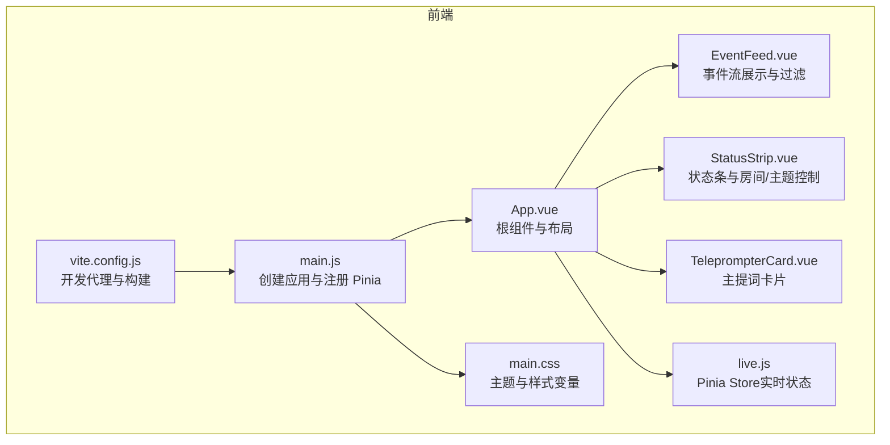
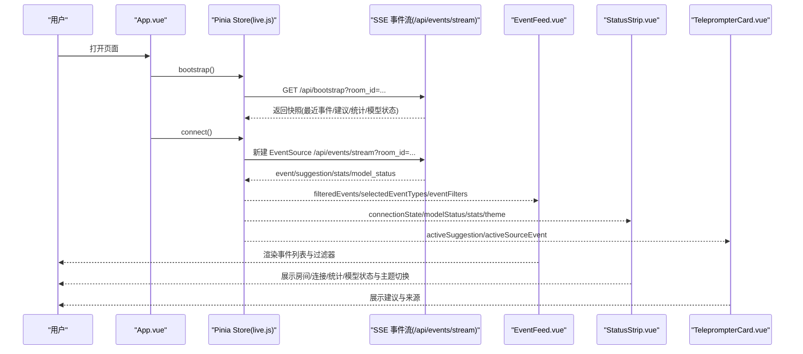
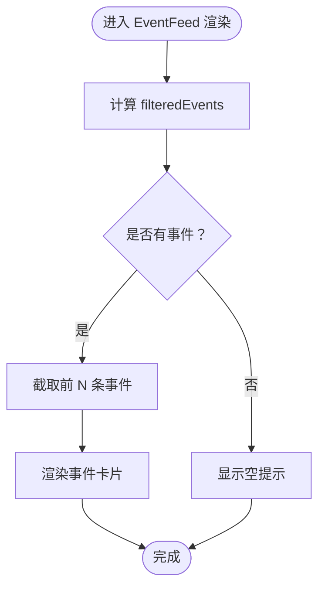
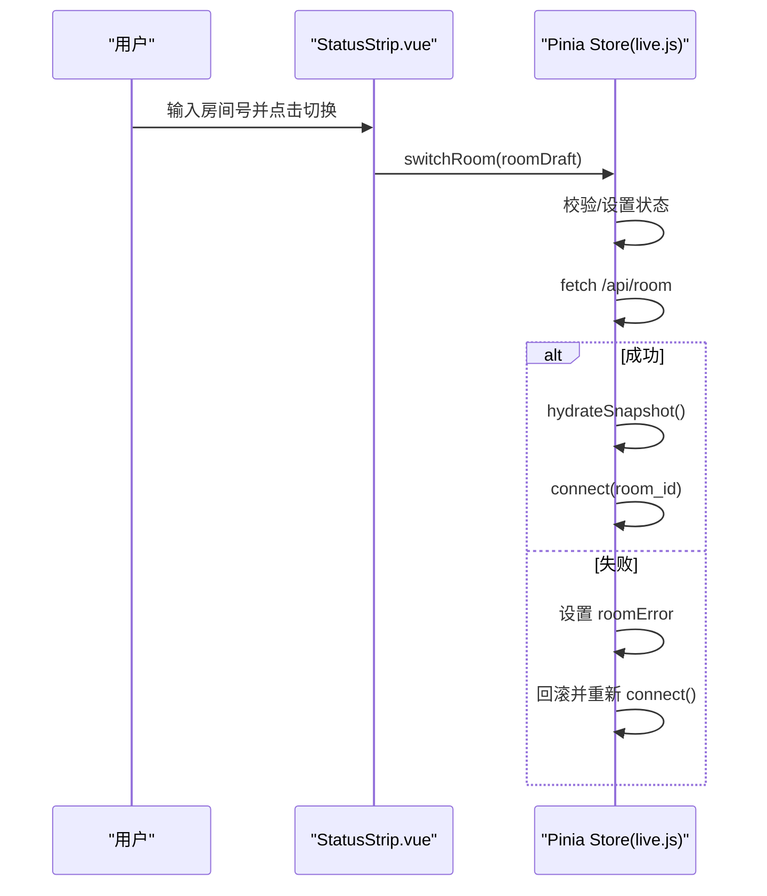
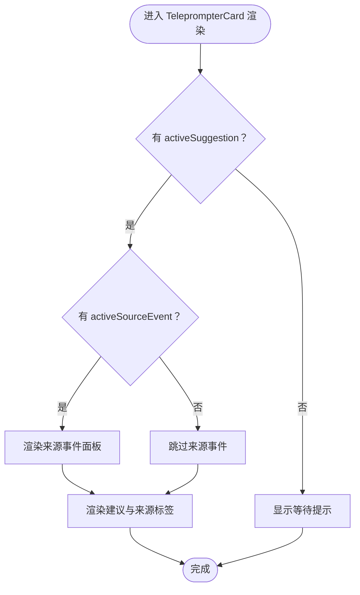
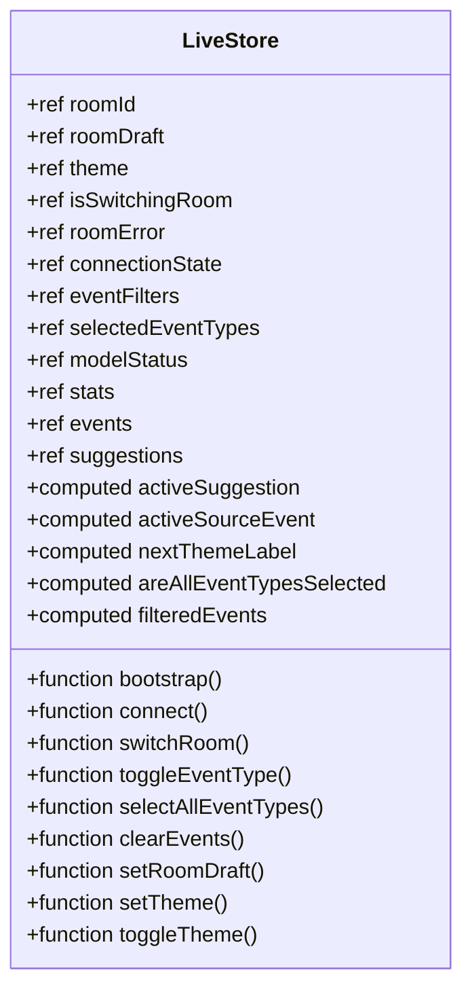
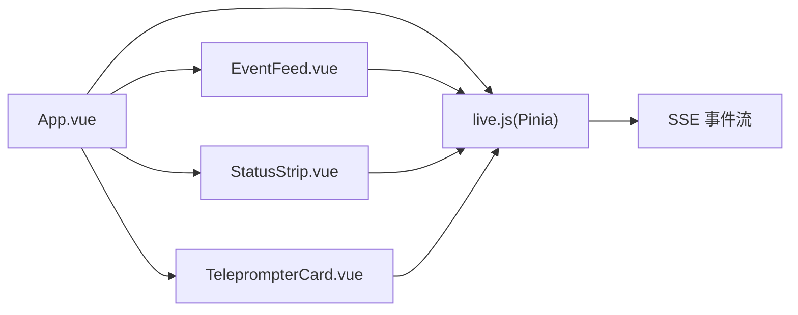

# 前端实时展示

<cite>
**本文引用的文件**
- [frontend/src/App.vue](file://frontend/src/App.vue)
- [frontend/src/main.js](file://frontend/src/main.js)
- [frontend/src/components/EventFeed.vue](file://frontend/src/components/EventFeed.vue)
- [frontend/src/components/StatusStrip.vue](file://frontend/src/components/StatusStrip.vue)
- [frontend/src/components/TeleprompterCard.vue](file://frontend/src/components/TeleprompterCard.vue)
- [frontend/src/stores/live.js](file://frontend/src/stores/live.js)
- [frontend/vite.config.js](file://frontend/vite.config.js)
- [frontend/src/assets/main.css](file://frontend/src/assets/main.css)
- [frontend/package.json](file://frontend/package.json)
- [README.md](file://README.md)
</cite>

## 目录
1. [简介](#简介)
2. [项目结构](#项目结构)
3. [核心组件](#核心组件)
4. [架构总览](#架构总览)
5. [详细组件分析](#详细组件分析)
6. [依赖关系分析](#依赖关系分析)
7. [性能考量](#性能考量)
8. [故障排查指南](#故障排查指南)
9. [结论](#结论)
10. [附录](#附录)

## 简介
本项目为面向抖音直播场景的实时提词前端，采用 Vue 3 + Pinia + Tailwind 技术栈，负责接收后端通过 SSE/WS 推送的直播事件、建议、统计与模型状态，并以可视化方式实时展示。前端提供：
- 主提词卡片：展示当前优先建议、来源事件与生成来源标签
- 事件流组件：实时展示事件列表，支持事件类型过滤、全选/清空等操作
- 状态条组件：展示房间号、连接状态、模型状态、统计数据与主题切换
- Pinia 状态管理：统一管理房间、SSE 连接、事件列表、建议、统计与主题等状态
- 主题系统：深浅色主题切换与持久化

## 项目结构
前端采用按功能分层的组织方式：
- 入口与应用根组件：main.js、App.vue
- 组件层：EventFeed、StatusStrip、TeleprompterCard
- 状态层：Pinia store（live.js）
- 样式层：Tailwind + 自定义 CSS 变量与主题类
- 构建与代理：Vite 配置，开发时将 /api 与 /ws 代理至后端

图表来源
- [frontend/src/main.js:1-17](file://frontend/src/main.js#L1-L17)
- [frontend/src/App.vue:1-66](file://frontend/src/App.vue#L1-L66)
- [frontend/src/components/EventFeed.vue:1-183](file://frontend/src/components/EventFeed.vue#L1-L183)
- [frontend/src/components/StatusStrip.vue:1-144](file://frontend/src/components/StatusStrip.vue#L1-L144)
- [frontend/src/components/TeleprompterCard.vue:1-83](file://frontend/src/components/TeleprompterCard.vue#L1-L83)
- [frontend/src/stores/live.js:1-310](file://frontend/src/stores/live.js#L1-L310)
- [frontend/src/assets/main.css:1-144](file://frontend/src/assets/main.css#L1-L144)
- [frontend/vite.config.js:1-23](file://frontend/vite.config.js#L1-L23)

章节来源
- [frontend/src/main.js:1-17](file://frontend/src/main.js#L1-L17)
- [frontend/src/App.vue:1-66](file://frontend/src/App.vue#L1-L66)
- [frontend/vite.config.js:1-23](file://frontend/vite.config.js#L1-L23)
- [frontend/src/assets/main.css:1-144](file://frontend/src/assets/main.css#L1-L144)

## 核心组件
- 根组件与入口
  - main.js：创建 Vue 应用、注册 Pinia、挂载根组件
  - App.vue：在挂载时初始化状态并发起连接；布局中组合状态条、主提词卡片与事件流
- 组件
  - EventFeed：事件列表展示、事件类型过滤按钮、清空与全选操作
  - StatusStrip：房间号、连接状态、统计数据、模型状态、主题切换与房间切换
  - TeleprompterCard：主提词建议展示、来源事件与来源标签
- 状态管理
  - live.js：集中管理房间号、主题、连接状态、事件过滤器、事件与建议队列、统计与模型状态，以及 SSE 连接、房间切换、主题切换等动作

章节来源
- [frontend/src/main.js:1-17](file://frontend/src/main.js#L1-L17)
- [frontend/src/App.vue:1-66](file://frontend/src/App.vue#L1-L66)
- [frontend/src/components/EventFeed.vue:1-183](file://frontend/src/components/EventFeed.vue#L1-L183)
- [frontend/src/components/StatusStrip.vue:1-144](file://frontend/src/components/StatusStrip.vue#L1-L144)
- [frontend/src/components/TeleprompterCard.vue:1-83](file://frontend/src/components/TeleprompterCard.vue#L1-L83)
- [frontend/src/stores/live.js:1-310](file://frontend/src/stores/live.js#L1-L310)

## 架构总览
前端通过 Pinia 统一状态，App.vue 在挂载时调用 store 的引导与连接方法，随后通过组件订阅 store 的响应式状态进行渲染。SSE 连接由 store 建立，后端推送事件、建议、统计与模型状态，store 更新本地状态，组件自动刷新。

图表来源
- [frontend/src/App.vue:29-32](file://frontend/src/App.vue#L29-L32)
- [frontend/src/stores/live.js:158-205](file://frontend/src/stores/live.js#L158-L205)
- [frontend/src/stores/live.js:165-171](file://frontend/src/stores/live.js#L165-L171)
- [frontend/src/stores/live.js:190-204](file://frontend/src/stores/live.js#L190-L204)
- [frontend/src/components/EventFeed.vue:119-180](file://frontend/src/components/EventFeed.vue#L119-L180)
- [frontend/src/components/StatusStrip.vue:44-142](file://frontend/src/components/StatusStrip.vue#L44-L142)
- [frontend/src/components/TeleprompterCard.vue:34-81](file://frontend/src/components/TeleprompterCard.vue#L34-L81)

## 详细组件分析

### 组件：EventFeed（事件流）
- 功能要点
  - 展示事件列表，支持事件类型过滤（comment/gift/follow/member/like/system）
  - 支持“全选”、“清空”与逐项切换过滤
  - 事件卡片按类型着色，显示用户昵称与内容摘要
  - 限制渲染数量，避免长列表造成性能问题
- 关键实现
  - 事件类型过滤：computed 计算 filteredEvents，依据 selectedEventTypes
  - 渲染优化：仅渲染前若干条事件
  - 交互：通过 emits 触发 toggle-filter/select-all-filters/clear-events
  - 样式：根据事件类型动态设置边框与背景色
- 复杂度
  - 过滤计算 O(n)，n 为事件总数；渲染截断 O(k)，k 为展示上限
- 错误处理
  - 当无事件且未筛选时提示“当前筛选下没有消息”
- 性能建议
  - 对超长列表可考虑虚拟滚动或分页
  - 事件卡片样式计算可缓存

图表来源
- [frontend/src/components/EventFeed.vue:109-111](file://frontend/src/components/EventFeed.vue#L109-L111)
- [frontend/src/components/EventFeed.vue:144-171](file://frontend/src/components/EventFeed.vue#L144-L171)
- [frontend/src/components/EventFeed.vue:174-178](file://frontend/src/components/EventFeed.vue#L174-L178)

章节来源
- [frontend/src/components/EventFeed.vue:1-183](file://frontend/src/components/EventFeed.vue#L1-L183)
- [frontend/src/stores/live.js:109-111](file://frontend/src/stores/live.js#L109-L111)

### 组件：StatusStrip（状态条）
- 功能要点
  - 展示房间号、连接状态、统计数据（评论数、总事件数）、模型状态（模型名、结果、错误/模式）
  - 输入房间号并触发切换房间
  - 主题切换按钮，支持深浅色切换与持久化
- 关键实现
  - 房间切换：通过 emits 触发 switch-room，store 内部处理校验、关闭旧流、调用 /api/room 并重新连接
  - 主题切换：通过 emits 触发 toggle-theme，store 内部更新 theme、写入 localStorage、应用 CSS 变量
  - 连接状态：SSE onopen/onerror 更新 connectionState
- 错误处理
  - 房间切换失败时回滚到上一个房间并重新连接
- 性能建议
  - 输入框防抖与去重提交
  - 连接状态变化时可增加动画反馈

图表来源
- [frontend/src/components/StatusStrip.vue:94-111](file://frontend/src/components/StatusStrip.vue#L94-L111)
- [frontend/src/stores/live.js:207-250](file://frontend/src/stores/live.js#L207-L250)

章节来源
- [frontend/src/components/StatusStrip.vue:1-144](file://frontend/src/components/StatusStrip.vue#L1-L144)
- [frontend/src/stores/live.js:158-205](file://frontend/src/stores/live.js#L158-L205)
- [frontend/src/stores/live.js:207-250](file://frontend/src/stores/live.js#L207-L250)

### 组件：TeleprompterCard（主提词卡片）
- 功能要点
  - 展示当前优先建议（reply_text、reason）
  - 显示建议来源（模型生成/规则生成/规则兜底）与优先级、语调
  - 展示来源事件（用户昵称与内容摘要），若无则提示等待
- 关键实现
  - activeSuggestion 与 activeSourceEvent 由 store 计算得出
  - sourceLabel/sourceEventLabel 提供标签与内容摘要
- 性能建议
  - 建议文本过长时可启用省略与展开
  - 来源事件为空时避免渲染面板

图表来源
- [frontend/src/components/TeleprompterCard.vue:43-73](file://frontend/src/components/TeleprompterCard.vue#L43-L73)
- [frontend/src/stores/live.js:92-104](file://frontend/src/stores/live.js#L92-L104)

章节来源
- [frontend/src/components/TeleprompterCard.vue:1-83](file://frontend/src/components/TeleprompterCard.vue#L1-L83)
- [frontend/src/stores/live.js:92-104](file://frontend/src/stores/live.js#L92-L104)

### 状态管理：Pinia Store（live.js）
- 状态与计算
  - 房间与主题：roomId、roomDraft、theme、nextThemeLabel
  - 连接与错误：connectionState、roomError、isSwitchingRoom
  - 事件与建议：events、suggestions、filteredEvents、activeSuggestion、activeSourceEvent
  - 统计与模型：stats、modelStatus、eventFilters、selectedEventTypes、areAllEventTypesSelected
- 行为
  - bootstrap：拉取初始快照
  - connect：建立 SSE，监听 event/suggestion/stats/model_status
  - switchRoom：校验房间号、调用 /api/room、回滚与重连
  - 主题：toggleTheme/setTheme/persistTheme/applyTheme
  - 过滤：toggleEventType/selectAllEventTypes/clearEvents
- 数据持久化
  - 事件类型过滤与主题通过 localStorage 持久化
- 复杂度
  - 事件与建议均限制最大长度，保证内存占用可控
- 错误处理
  - SSE onerror 设置 reconnecting 状态
  - 房间切换异常时回滚并重新连接

图表来源
- [frontend/src/stores/live.js:70-310](file://frontend/src/stores/live.js#L70-L310)

章节来源
- [frontend/src/stores/live.js:1-310](file://frontend/src/stores/live.js#L1-L310)

### SSE 与 WebSocket 连接处理
- SSE
  - 建立：connect 方法创建 EventSource，监听 open/error 与多类事件
  - 断线重连：onerror 设置 reconnecting 状态，onopen 设置 live 状态
  - 消息解析：JSON.parse(message.data) 后更新对应状态
- WebSocket
  - Vite 代理配置将 /ws 透传到后端 ws://127.0.0.1:8010
  - 后端提供 /ws/live，连接后先推送一次 bootstrap 快照
- 建议实践
  - 在 store 中增加指数退避与最大重试次数
  - 对 message.data 增加结构校验与异常捕获

章节来源
- [frontend/src/stores/live.js:173-205](file://frontend/src/stores/live.js#L173-L205)
- [frontend/vite.config.js:10-22](file://frontend/vite.config.js#L10-L22)
- [README.md:268-274](file://README.md#L268-L274)

### 主题切换与定制
- 主题持久化
  - localStorage 存储 theme，启动时读取并应用
- CSS 变量驱动
  - main.css 定义深浅两套变量，通过 :root[data-theme="..."] 切换
  - TeleprompterCard 使用自定义类与变量实现风格
- 定制建议
  - 新增主题时在 CSS 中添加新变量集合并扩展切换逻辑
  - 组件中使用 CSS 变量而非硬编码颜色，便于主题扩展

章节来源
- [frontend/src/stores/live.js:54-68](file://frontend/src/stores/live.js#L54-L68)
- [frontend/src/assets/main.css:5-64](file://frontend/src/assets/main.css#L5-L64)
- [frontend/src/components/TeleprompterCard.vue:34-81](file://frontend/src/components/TeleprompterCard.vue#L34-L81)

## 依赖关系分析
- 组件依赖
  - App.vue 依赖三个子组件与 Pinia store
  - 子组件通过 props 与 emits 与 store 交互
- 状态依赖
  - EventFeed 依赖 filteredEvents 与过滤器集合
  - TeleprompterCard 依赖 activeSuggestion 与 activeSourceEvent
  - StatusStrip 依赖 connectionState、stats、modelStatus、theme
- 外部依赖
  - Vue 3、Pinia、Tailwind
  - Vite 开发代理与构建工具链

图表来源
- [frontend/src/App.vue:5-63](file://frontend/src/App.vue#L5-L63)
- [frontend/src/stores/live.js:158-205](file://frontend/src/stores/live.js#L158-L205)

章节来源
- [frontend/src/App.vue:1-66](file://frontend/src/App.vue#L1-L66)
- [frontend/src/stores/live.js:1-310](file://frontend/src/stores/live.js#L1-L310)

## 性能考量
- 渲染截断
  - EventFeed 仅渲染前若干条事件，避免长列表导致卡顿
- 状态截断
  - events 与 suggestions 限制最大长度，保持内存占用稳定
- 计算优化
  - filteredEvents 与 activeSuggestion/activeSourceEvent 为 computed，减少重复计算
- I/O 优化
  - SSE 连接复用，onerror/reconnect 状态提示
- 建议
  - 对超长事件列表引入虚拟滚动
  - 对频繁输入的房间号切换增加防抖
  - 对 message.data 增加结构校验，避免异常影响渲染

## 故障排查指南
- 无法连接后端
  - 检查 Vite 代理是否正确指向后端地址
  - 确认后端健康检查与 SSE/WS 接口可用
- 房间切换失败
  - 查看 StatusStrip 的 roomError 提示
  - 确认 /api/room 返回的 payload 结构正确
  - 检查 store 的 switchRoom 异常分支是否触发回滚
- 主题切换无效
  - 检查 localStorage 是否写入成功
  - 确认 CSS 变量是否被 :root[data-theme="..."] 正确覆盖
- 事件不刷新
  - 检查 SSE 是否正常 onopen/onerror
  - 确认事件监听回调是否正确解析 message.data
- 建议不出现
  - 检查 activeSuggestion 是否存在
  - 确认后端是否推送 suggestion 事件

章节来源
- [frontend/vite.config.js:10-22](file://frontend/vite.config.js#L10-L22)
- [frontend/src/stores/live.js:207-250](file://frontend/src/stores/live.js#L207-L250)
- [frontend/src/stores/live.js:54-68](file://frontend/src/stores/live.js#L54-L68)
- [frontend/src/stores/live.js:181-204](file://frontend/src/stores/live.js#L181-L204)

## 结论
该前端以 Vue 3 + Pinia 为核心，结合 Tailwind 实现了直播事件的实时展示与交互。通过 SSE/WS 与后端紧密协作，实现了事件流、建议、统计与模型状态的实时同步。组件职责清晰、状态集中管理、主题可定制，具备良好的扩展性与可维护性。后续可在虚拟滚动、断线重连策略与消息校验等方面进一步优化。

## 附录
- 开发与构建
  - 依赖：Vue 3、Pinia、Tailwind、Vite
  - 开发代理：/api 与 /ws 代理至后端
- 后端接口参考
  - /api/bootstrap、/api/room、/api/events/stream、/ws/live

章节来源
- [frontend/package.json:11-21](file://frontend/package.json#L11-L21)
- [frontend/vite.config.js:10-22](file://frontend/vite.config.js#L10-L22)
- [README.md:218-274](file://README.md#L218-L274)