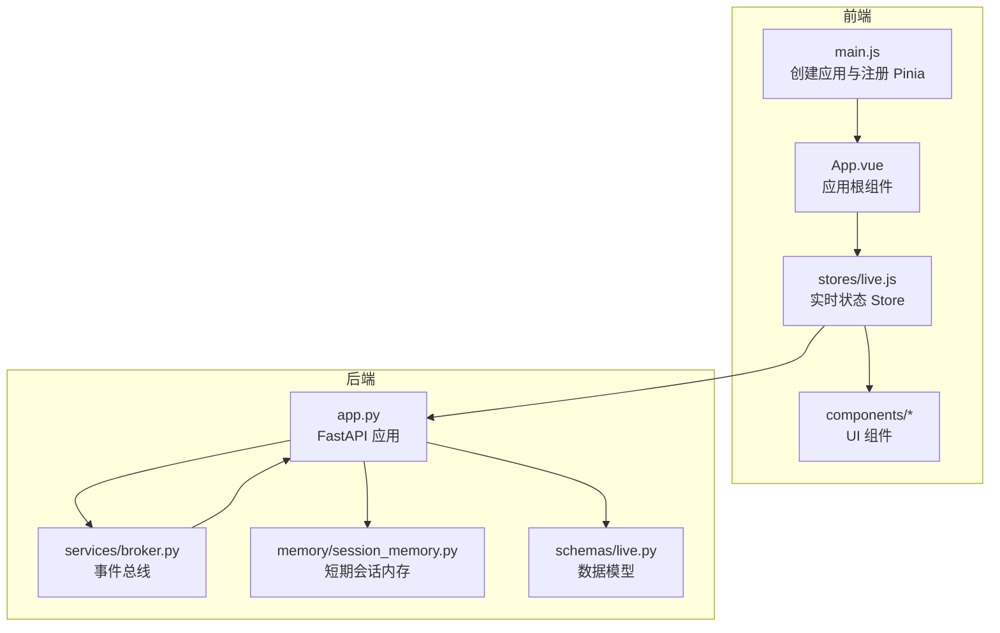
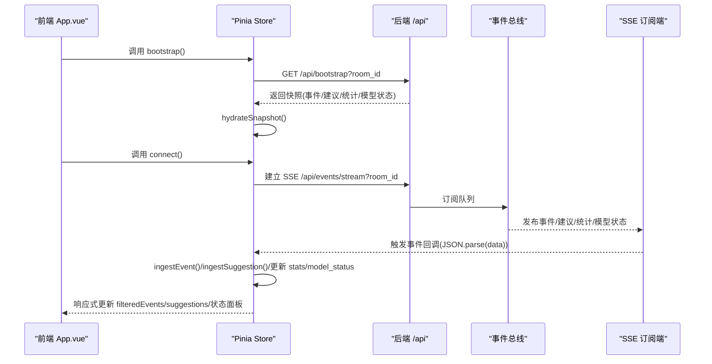
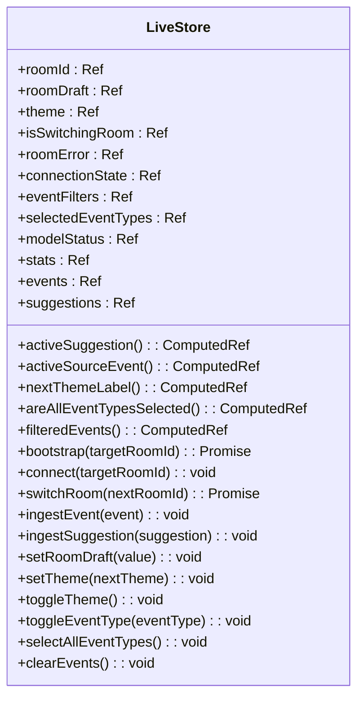
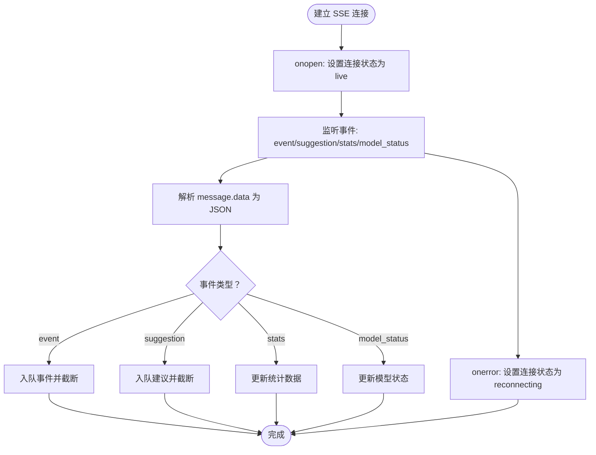
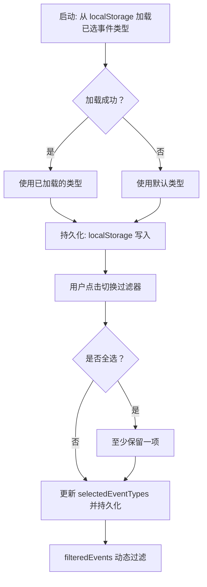
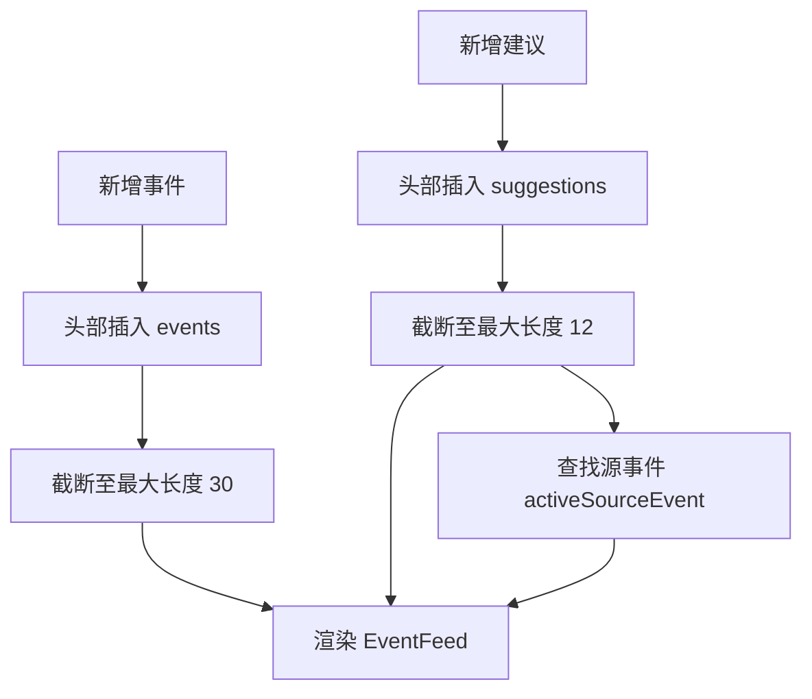
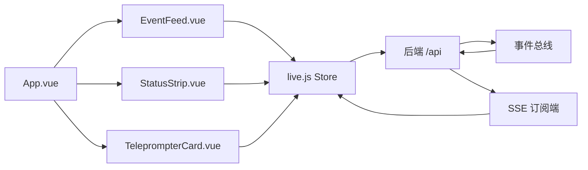
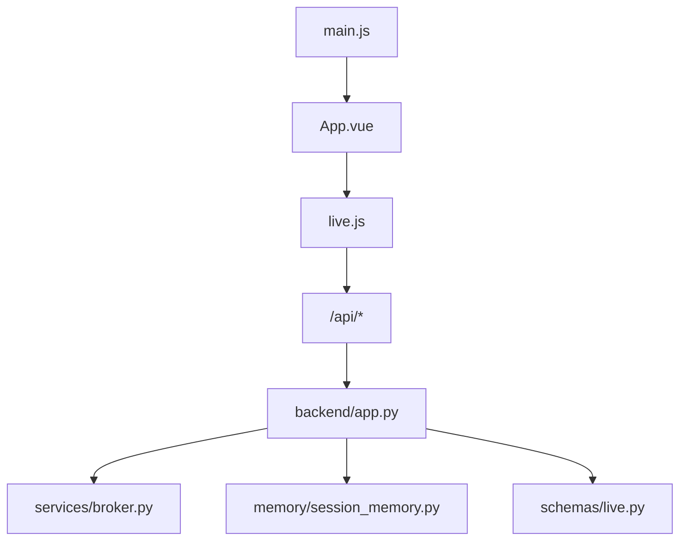

# 实时状态管理

<cite>
**本文引用的文件**
- [frontend/src/stores/live.js](file://frontend/src/stores/live.js)
- [frontend/src/App.vue](file://frontend/src/App.vue)
- [frontend/src/main.js](file://frontend/src/main.js)
- [frontend/src/components/EventFeed.vue](file://frontend/src/components/EventFeed.vue)
- [frontend/src/components/StatusStrip.vue](file://frontend/src/components/StatusStrip.vue)
- [frontend/src/components/TeleprompterCard.vue](file://frontend/src/components/TeleprompterCard.vue)
- [backend/app.py](file://backend/app.py)
- [backend/schemas/live.py](file://backend/schemas/live.py)
- [backend/services/broker.py](file://backend/services/broker.py)
- [backend/memory/session_memory.py](file://backend/memory/session_memory.py)
</cite>

## 目录
1. [简介](#简介)
2. [项目结构](#项目结构)
3. [核心组件](#核心组件)
4. [架构总览](#架构总览)
5. [详细组件分析](#详细组件分析)
6. [依赖分析](#依赖分析)
7. [性能考虑](#性能考虑)
8. [故障排查指南](#故障排查指南)
9. [结论](#结论)
10. [附录](#附录)

## 简介
本文件为前端实时状态管理（Pinia Store）的全面技术文档，聚焦于以下方面：
- Store 的设计架构：状态定义、计算属性（getter）、动作（action）的组织结构
- 实时数据同步机制：SSE 事件流处理、连接状态管理、数据更新的响应式机制
- 事件过滤系统：过滤器状态维护、用户偏好持久化、过滤条件的动态应用
- 事件队列管理策略：事件的添加、删除、排序与数量限制
- 用户会话状态：登录态、权限控制与个性化设置（主题）
- 状态持久化：localStorage 使用与状态恢复机制
- 与组件的集成方式与数据流向

## 项目结构
前端采用 Vue + Pinia 架构，核心状态集中在单个 store 文件中，通过组件进行消费与交互；后端以 FastAPI 提供 SSE/WebSocket 接口，并通过进程内事件总线进行消息广播。

图表来源
- [frontend/src/main.js:1-17](file://frontend/src/main.js#L1-L17)
- [frontend/src/App.vue:1-66](file://frontend/src/App.vue#L1-L66)
- [frontend/src/stores/live.js:1-310](file://frontend/src/stores/live.js#L1-L310)
- [backend/app.py:1-220](file://backend/app.py#L1-L220)
- [backend/services/broker.py:1-40](file://backend/services/broker.py#L1-L40)
- [backend/memory/session_memory.py:1-113](file://backend/memory/session_memory.py#L1-L113)
- [backend/schemas/live.py:1-95](file://backend/schemas/live.py#L1-L95)

章节来源
- [frontend/src/main.js:1-17](file://frontend/src/main.js#L1-L17)
- [frontend/src/App.vue:1-66](file://frontend/src/App.vue#L1-L66)
- [frontend/src/stores/live.js:1-310](file://frontend/src/stores/live.js#L1-L310)
- [backend/app.py:1-220](file://backend/app.py#L1-L220)

## 核心组件
- Pinia Store（实时状态中心）
  - 状态：房间号、草稿、主题、连接状态、过滤器、选中事件类型、模型状态、统计数据、事件队列、建议队列等
  - 计算属性：当前激活建议、激活建议对应的源事件、是否全选、过滤后的事件列表等
  - 动作：初始化引导、建立 SSE 连接、切换房间、事件/建议入队、主题切换与持久化、过滤器切换与持久化、清空事件等
- 后端服务
  - SSE 接口：按房间过滤事件，推送 event/suggestion/stats/model_status 三类事件
  - WebSocket 接口：一次性推送快照，随后持续推送增量
  - 事件总线：统一发布事件，供 SSE/WebSocket 订阅
  - 短期会话内存：维护最近事件与建议，支持 Redis 或进程内降级
  - 数据模型：标准化事件、建议、统计与快照结构

章节来源
- [frontend/src/stores/live.js:70-310](file://frontend/src/stores/live.js#L70-L310)
- [backend/app.py:187-220](file://backend/app.py#L187-L220)
- [backend/services/broker.py:10-40](file://backend/services/broker.py#L10-L40)
- [backend/memory/session_memory.py:17-113](file://backend/memory/session_memory.py#L17-L113)
- [backend/schemas/live.py:29-95](file://backend/schemas/live.py#L29-L95)

## 架构总览
从前端到后端的数据流如下：
- 前端启动后调用引导接口获取初始快照，随后建立 SSE 连接订阅实时事件
- 后端从采集器接收事件，写入短期会话内存，同时通过事件总线广播
- SSE 订阅端根据房间号过滤并推送事件；WebSocket 订阅端接收完整快照与增量
- 前端 Store 将事件/建议/统计/模型状态写入本地状态，驱动 UI 响应式更新

图表来源
- [frontend/src/App.vue:29-32](file://frontend/src/App.vue#L29-L32)
- [frontend/src/stores/live.js:158-205](file://frontend/src/stores/live.js#L158-L205)
- [backend/app.py:187-206](file://backend/app.py#L187-L206)
- [backend/services/broker.py:16-39](file://backend/services/broker.py#L16-L39)

## 详细组件分析

### Pinia Store 设计与职责
- 状态定义
  - 房间标识、草稿输入、主题、切换房间标志、错误信息、连接状态
  - 过滤器集合与已选事件类型（含默认值与持久化键）
  - 模型状态（模式、模型名、后端、上次结果、错误、更新时间）
  - 统计数据（房间号、事件总数、各类事件计数）
  - 事件与建议队列（最大长度限制）
  - SSE 连接对象
- 计算属性
  - 当前激活建议、激活建议对应的源事件（基于事件 ID 映射）
  - 下一主题标签（用于按钮文案）
  - 是否全选事件类型
  - 过滤后的事件列表（基于已选事件类型）
- 动作
  - 引导：拉取快照并填充状态
  - 连接：建立 SSE，监听 open/error 与多类事件
  - 切换房间：校验输入、调用后端切换接口、回滚与重连
  - 入队：事件/建议分别入队并截断至最大长度
  - 主题：切换主题、应用到 DOM、持久化
  - 过滤器：切换某类型、全选、持久化
  - 清空事件

图表来源
- [frontend/src/stores/live.js:70-310](file://frontend/src/stores/live.js#L70-L310)

章节来源
- [frontend/src/stores/live.js:70-310](file://frontend/src/stores/live.js#L70-L310)

### 实时数据同步机制（SSE）
- 连接建立
  - 前端发起 SSE 请求，携带房间号参数
  - 后端订阅事件总线队列，返回“retry”提示与事件流
- 事件类型
  - event：单条事件
  - suggestion：建议
  - stats：房间统计
  - model_status：模型状态
- 前端处理
  - onopen：连接成功，状态置为“live”
  - onerror：连接异常，状态置为“reconnecting”
  - 事件回调：JSON 解析后写入对应队列或状态字段
- 房间过滤
  - 非 model_status 类型事件按目标房间过滤，避免跨房间干扰

图表来源
- [frontend/src/stores/live.js:173-205](file://frontend/src/stores/live.js#L173-L205)
- [backend/app.py:187-206](file://backend/app.py#L187-L206)

章节来源
- [frontend/src/stores/live.js:173-205](file://frontend/src/stores/live.js#L173-L205)
- [backend/app.py:187-206](file://backend/app.py#L187-L206)

### 事件过滤系统
- 过滤器定义
  - 固定的事件类型集合（弹幕、礼物、关注、进场、点赞、系统）
  - 默认全部可见
- 用户偏好
  - 从 localStorage 读取已选类型，若无效则回退默认
  - 切换过滤器时持久化到 localStorage
- 动态应用
  - filteredEvents 基于 selectedEventTypes 动态过滤
  - 支持全选与逐项切换，且保证至少保留一项

图表来源
- [frontend/src/stores/live.js:41-52](file://frontend/src/stores/live.js#L41-L52)
- [frontend/src/stores/live.js:32-39](file://frontend/src/stores/live.js#L32-L39)
- [frontend/src/stores/live.js:252-268](file://frontend/src/stores/live.js#L252-L268)
- [frontend/src/stores/live.js:109-111](file://frontend/src/stores/live.js#L109-L111)

章节来源
- [frontend/src/stores/live.js:7-18](file://frontend/src/stores/live.js#L7-L18)
- [frontend/src/stores/live.js:41-52](file://frontend/src/stores/live.js#L41-L52)
- [frontend/src/stores/live.js:32-39](file://frontend/src/stores/live.js#L32-L39)
- [frontend/src/stores/live.js:252-268](file://frontend/src/stores/live.js#L252-L268)
- [frontend/src/stores/live.js:109-111](file://frontend/src/stores/live.js#L109-L111)

### 事件队列管理策略
- 事件队列
  - 最大长度：30 条
  - 入队：头部插入，尾部截断
  - 用途：展示最新事件，支持快速滚动
- 建议队列
  - 最大长度：12 条
  - 入队：头部插入，尾部截断
  - 用途：展示当前最优先的回复建议及其源事件
- 源事件映射
  - activeSourceEvent 基于建议中的事件 ID 列表查找对应事件

图表来源
- [frontend/src/stores/live.js:165-171](file://frontend/src/stores/live.js#L165-L171)
- [frontend/src/stores/live.js:92-104](file://frontend/src/stores/live.js#L92-L104)

章节来源
- [frontend/src/stores/live.js:4-5](file://frontend/src/stores/live.js#L4-L5)
- [frontend/src/stores/live.js:165-171](file://frontend/src/stores/live.js#L165-L171)
- [frontend/src/stores/live.js:92-104](file://frontend/src/stores/live.js#L92-L104)

### 用户会话状态与个性化
- 登录与权限
  - 当前代码未体现后端登录态与权限控制逻辑，建议在后端增加鉴权中间件并在前端 Store 中暴露登录状态与角色信息
- 个性化设置
  - 主题：深色/浅色，DOM 属性持久化，按钮文案动态切换
  - 过滤偏好：事件类型选择持久化
- 连接状态与错误
  - 连接状态：connecting/live/reconnecting/switching
  - 错误信息：房间切换失败等错误提示

章节来源
- [frontend/src/stores/live.js:73-76](file://frontend/src/stores/live.js#L73-L76)
- [frontend/src/stores/live.js:148-156](file://frontend/src/stores/live.js#L148-L156)
- [frontend/src/stores/live.js:173-189](file://frontend/src/stores/live.js#L173-L189)
- [frontend/src/stores/live.js:207-250](file://frontend/src/stores/live.js#L207-L250)

### 状态持久化方案
- localStorage
  - 已选事件类型：键值对持久化
  - 主题：键值对持久化
- 状态恢复
  - 启动时从 localStorage 读取并归一化（无效值回退默认）
  - DOM 主题即时应用
- 快照恢复
  - 引导接口返回初始快照，包含最近事件、建议、统计与模型状态

章节来源
- [frontend/src/stores/live.js:41-60](file://frontend/src/stores/live.js#L41-L60)
- [frontend/src/stores/live.js:129-135](file://frontend/src/stores/live.js#L129-L135)
- [frontend/src/stores/live.js:158-163](file://frontend/src/stores/live.js#L158-L163)

### 与组件的集成与数据流向
- App.vue
  - 初始化：调用 Store 引导与连接
  - 传参：将 Store 的响应式状态注入到状态条、提词卡与事件流组件
  - 事件：房间切换、主题切换、草稿输入
- EventFeed.vue
  - 输入：事件列表、过滤器、已选类型、是否全选
  - 行为：触发过滤切换、全选、清空事件
- StatusStrip.vue
  - 输入：房间号、草稿、主题、连接状态、模型状态、统计
  - 行为：触发主题切换、房间切换、草稿输入
- TeleprompterCard.vue
  - 输入：当前建议与源事件
  - 行为：展示建议与来源事件

图表来源
- [frontend/src/App.vue:10-32](file://frontend/src/App.vue#L10-L32)
- [frontend/src/components/EventFeed.vue:1-22](file://frontend/src/components/EventFeed.vue#L1-L22)
- [frontend/src/components/StatusStrip.vue:1-42](file://frontend/src/components/StatusStrip.vue#L1-L42)
- [frontend/src/components/TeleprompterCard.vue:1-12](file://frontend/src/components/TeleprompterCard.vue#L1-L12)
- [frontend/src/stores/live.js:158-205](file://frontend/src/stores/live.js#L158-L205)
- [backend/app.py:187-206](file://backend/app.py#L187-L206)
- [backend/services/broker.py:16-39](file://backend/services/broker.py#L16-L39)

章节来源
- [frontend/src/App.vue:10-32](file://frontend/src/App.vue#L10-L32)
- [frontend/src/components/EventFeed.vue:1-22](file://frontend/src/components/EventFeed.vue#L1-L22)
- [frontend/src/components/StatusStrip.vue:1-42](file://frontend/src/components/StatusStrip.vue#L1-L42)
- [frontend/src/components/TeleprompterCard.vue:1-12](file://frontend/src/components/TeleprompterCard.vue#L1-L12)
- [frontend/src/stores/live.js:158-205](file://frontend/src/stores/live.js#L158-L205)

## 依赖分析
- 前端
  - main.js 注册 Pinia，使全局共享状态
  - App.vue 作为根组件，协调 Store 与子组件
  - Store 依赖浏览器环境（localStorage、EventSource、document）
- 后端
  - FastAPI 提供 SSE 与 WebSocket 接口
  - 事件总线负责订阅与广播
  - 短期会话内存提供事件与建议的存储与统计
  - 数据模型确保前后端一致的事件/建议/统计结构

图表来源
- [frontend/src/main.js:12-16](file://frontend/src/main.js#L12-L16)
- [frontend/src/App.vue:8](file://frontend/src/App.vue#L8)
- [frontend/src/stores/live.js:1-310](file://frontend/src/stores/live.js#L1-L310)
- [backend/app.py:94-220](file://backend/app.py#L94-L220)
- [backend/services/broker.py:10-40](file://backend/services/broker.py#L10-L40)
- [backend/memory/session_memory.py:17-113](file://backend/memory/session_memory.py#L17-L113)
- [backend/schemas/live.py:29-95](file://backend/schemas/live.py#L29-L95)

章节来源
- [frontend/src/main.js:12-16](file://frontend/src/main.js#L12-L16)
- [frontend/src/App.vue:8](file://frontend/src/App.vue#L8)
- [frontend/src/stores/live.js:1-310](file://frontend/src/stores/live.js#L1-L310)
- [backend/app.py:94-220](file://backend/app.py#L94-L220)

## 性能考虑
- 队列长度限制
  - 事件与建议的最大长度分别为 30 与 12，有效控制内存占用与渲染压力
- SSE 连接与重试
  - 后端发送 retry 提示，前端 onerror 自动进入重连状态，提升稳定性
- 过滤与渲染
  - filteredEvents 基于 selectedEventTypes 动态过滤，减少渲染开销
- 内存层降级
  - 短期会话内存支持 Redis 或进程内降级，保障部署灵活性

章节来源
- [frontend/src/stores/live.js:4-5](file://frontend/src/stores/live.js#L4-L5)
- [frontend/src/stores/live.js:109-111](file://frontend/src/stores/live.js#L109-L111)
- [backend/app.py:194](file://backend/app.py#L194)
- [backend/memory/session_memory.py:17-31](file://backend/memory/session_memory.py#L17-L31)

## 故障排查指南
- 连接问题
  - 现象：连接状态停留在 reconnecting
  - 排查：检查后端 SSE 接口可用性、网络连通性、房间号参数
- 房间切换失败
  - 现象：切换房间报错并回滚
  - 排查：确认后端 /api/room 接口返回、错误信息、回退到引导接口
- 过滤失效
  - 现象：过滤不生效或回退默认
  - 排查：检查 localStorage 中的已选类型是否为有效数组，Store 归一化逻辑
- 主题不生效
  - 现象：切换主题但 DOM 未变化
  - 排查：确认 applyTheme 对 documentElement 的 dataset 修改与持久化写入

章节来源
- [frontend/src/stores/live.js:186-189](file://frontend/src/stores/live.js#L186-L189)
- [frontend/src/stores/live.js:243-249](file://frontend/src/stores/live.js#L243-L249)
- [frontend/src/stores/live.js:41-52](file://frontend/src/stores/live.js#L41-L52)
- [frontend/src/stores/live.js:62-68](file://frontend/src/stores/live.js#L62-L68)

## 结论
该实时状态管理方案以 Pinia 为核心，结合后端 SSE/WebSocket 与事件总线，实现了低延迟、可扩展的直播事件流体验。通过队列长度限制、过滤系统与持久化策略，兼顾了性能与用户体验。后续可在鉴权与权限控制、WebSocket 多路复用与断线重连策略等方面进一步增强。

## 附录
- 关键常量与键名
  - 事件与建议最大长度
  - 过滤器集合与默认可见类型
  - localStorage 键名：事件类型、主题
- 数据模型
  - 事件、建议、统计、模型状态与快照结构

章节来源
- [frontend/src/stores/live.js:4-18](file://frontend/src/stores/live.js#L4-L18)
- [backend/schemas/live.py:29-95](file://backend/schemas/live.py#L29-L95)