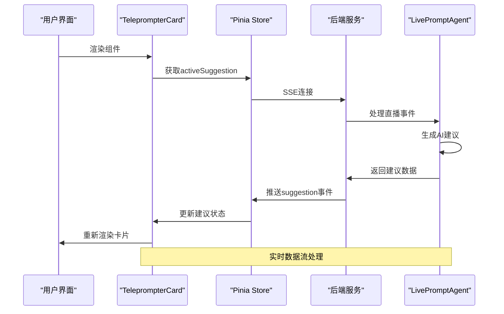
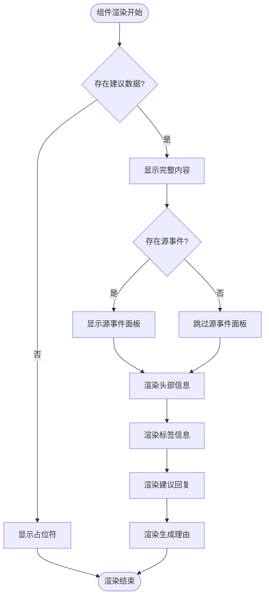
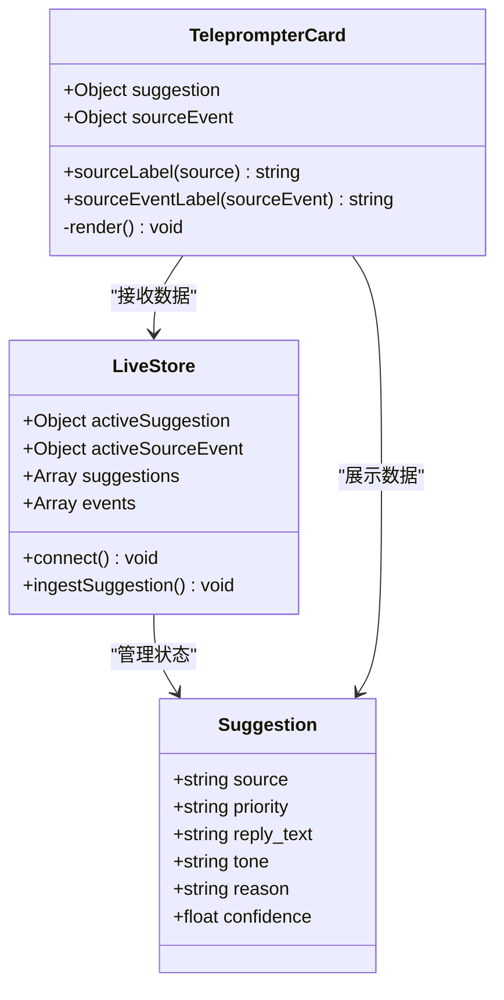
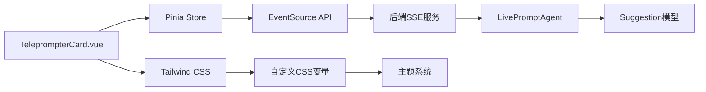
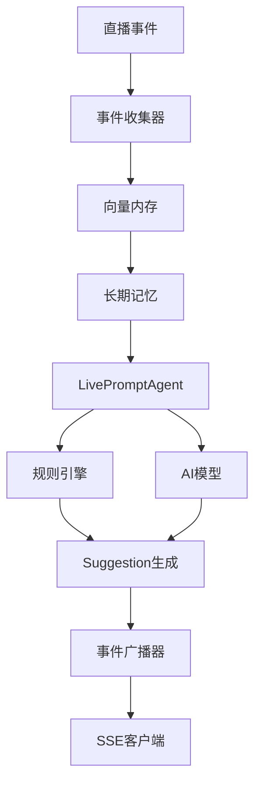

# 提词卡片组件

<cite>
**本文档引用的文件**
- [TeleprompterCard.vue](file://frontend/src/components/TeleprompterCard.vue)
- [live.js](file://frontend/src/stores/live.js)
- [main.css](file://frontend/src/assets/main.css)
- [App.vue](file://frontend/src/App.vue)
- [main.js](file://frontend/src/main.js)
- [live.py](file://backend/schemas/live.py)
- [agent.py](file://backend/services/agent.py)
- [long_term.py](file://backend/memory/long_term.py)
- [broker.py](file://backend/services/broker.py)
</cite>

## 目录
1. [简介](#简介)
2. [项目结构](#项目结构)
3. [核心组件](#核心组件)
4. [架构概览](#架构概览)
5. [详细组件分析](#详细组件分析)
6. [依赖关系分析](#依赖关系分析)
7. [性能考虑](#性能考虑)
8. [故障排除指南](#故障排除指南)
9. [结论](#结论)

## 简介

提词卡片组件(TeleprompterCard.vue)是直播提词系统的核心UI组件，负责展示AI生成的直播回复建议。该组件不仅承担着信息展示的职责，还通过精美的视觉设计和交互功能，为直播主播提供直观、高效的提词体验。

组件的主要功能包括：
- 展示AI生成的直播回复建议
- 标识建议来源（AI模型或规则引擎）
- 显示建议的优先级和语调特征
- 提供原始事件上下文展示
- 支持响应式设计以适配不同设备

## 项目结构

该项目采用前后端分离架构，前端使用Vue 3 + Pinia进行状态管理，后端使用Python构建实时数据流服务。

```mermaid
graph TB
subgraph "前端应用"
A[App.vue] --> B[TeleprompterCard.vue]
A --> C[EventFeed.vue]
D[live.js Store] --> B
E[main.js] --> A
F[main.css] --> B
end
subgraph "后端服务"
G[agent.py] --> H[LivePromptAgent]
I[schemas/live.py] --> J[Suggestion模型]
K[memory/long_term.py] --> L[向量存储]
M[services/broker.py] --> N[事件广播器]
end
B < --> D
D < --> G
G --> J
J --> K
K --> L
G --> N
```

**图表来源**
- [App.vue:1-66](file://frontend/src/App.vue#L1-L66)
- [TeleprompterCard.vue:1-83](file://frontend/src/components/TeleprompterCard.vue#L1-L83)
- [live.js:1-310](file://frontend/src/stores/live.js#L1-L310)
- [agent.py:1-393](file://backend/services/agent.py#L1-L393)

**章节来源**
- [App.vue:1-66](file://frontend/src/App.vue#L1-L66)
- [main.js:1-17](file://frontend/src/main.js#L1-L17)

## 核心组件

### 组件属性定义

组件通过props接收两个核心参数：

| 属性名 | 类型 | 默认值 | 描述 |
|--------|------|--------|------|
| suggestion | Object | null | AI生成的回复建议对象 |
| sourceEvent | Object | null | 建议来源的原始事件 |

### 数据模型结构

建议对象包含以下关键字段：
- `suggestion_id`: 建议唯一标识符
- `source`: 来源类型（model/heuristic/heuristic_fallback）
- `priority`: 优先级（high/medium/low）
- `reply_text`: 建议回复文本
- `tone`: 语调特征
- `reason`: 生成理由
- `confidence`: 置信度评分
- `created_at`: 创建时间戳

**章节来源**
- [TeleprompterCard.vue:2-11](file://frontend/src/components/TeleprompterCard.vue#L2-L11)
- [live.py:47-62](file://backend/schemas/live.py#L47-L62)

## 架构概览

提词卡片组件在整个系统中的位置和作用如下：



**图表来源**
- [live.js:173-205](file://frontend/src/stores/live.js#L173-L205)
- [agent.py:73-94](file://backend/services/agent.py#L73-L94)

## 详细组件分析

### 视觉设计系统

组件采用精心设计的视觉层次结构，通过CSS自定义属性实现主题化设计：

#### 渐变背景系统
- **主容器**: 使用线性渐变背景，深色主题从深绿到接近黑色，浅色主题从深棕色到米色
- **面板背景**: 半透明背景，配合边框和阴影营造层次感
- **强调色**: 使用明亮的绿色系作为强调色，确保在不同主题下都有良好的对比度

#### 阴影效果设计
- **主容器**: 30px模糊半径的深色阴影，营造悬浮感
- **面板**: 10px模糊的柔和阴影，突出内容区域
- **回复区域**: 12px模糊的立体阴影，强调主要内容

#### 边框样式规范
- **圆角**: 主容器36px，面板24px，回复区域30px，体现现代UI设计
- **边框宽度**: 1px细边框，配合透明度实现微妙的边界效果

### 内容渲染逻辑

组件采用条件渲染策略，根据是否有建议数据动态调整显示内容：



**图表来源**
- [TeleprompterCard.vue:43-81](file://frontend/src/components/TeleprompterCard.vue#L43-L81)

### 建议来源标识系统

组件实现了完整的建议来源识别机制：

| 来源类型 | 标识文本 | 用途场景 |
|----------|----------|----------|
| model | 模型生成 | AI模型直接生成的建议 |
| heuristic_fallback | 规则兜底 | AI模型失败时的规则建议 |
| heuristic | 规则生成 | 基于预设规则的建议 |

### 文本处理和格式化

组件在文本处理方面采用了多项优化策略：

#### 自适应字体大小
- **建议回复**: 4xl基础大小，md断点5xl，xl断点6xl，确保在大屏幕上获得最佳阅读体验
- **辅助信息**: 使用较小字号保持视觉平衡

#### 行高和字间距
- **标题级别**: 1.2倍行高，紧凑的字间距提升可读性
- **正文内容**: 1.7倍行高，提供舒适的阅读体验

### 交互功能实现

虽然当前版本的组件主要承担展示职责，但其设计为未来的交互功能预留了扩展空间：



**图表来源**
- [TeleprompterCard.vue:13-31](file://frontend/src/components/TeleprompterCard.vue#L13-L31)
- [live.js:92-104](file://frontend/src/stores/live.js#L92-L104)

**章节来源**
- [TeleprompterCard.vue:13-31](file://frontend/src/components/TeleprompterCard.vue#L13-L31)
- [live.js:92-104](file://frontend/src/stores/live.js#L92-L104)

## 依赖关系分析

### 前端依赖链

组件的依赖关系清晰且模块化：



**图表来源**
- [TeleprompterCard.vue:1-11](file://frontend/src/components/TeleprompterCard.vue#L1-L11)
- [live.js:173-205](file://frontend/src/stores/live.js#L173-L205)

### 后端数据流

后端服务通过多层架构处理直播事件：



**图表来源**
- [agent.py:56-71](file://backend/services/agent.py#L56-L71)
- [broker.py:28-39](file://backend/services/broker.py#L28-L39)

**章节来源**
- [agent.py:56-71](file://backend/services/agent.py#L56-L71)
- [broker.py:28-39](file://backend/services/broker.py#L28-L39)

## 性能考虑

### 渲染性能优化

组件在设计时充分考虑了性能因素：

- **条件渲染**: 只在有数据时渲染完整内容，避免不必要的DOM操作
- **计算属性**: 使用Vue的computed属性缓存复杂计算结果
- **事件过滤**: 通过store层的事件过滤减少不必要的数据传输

### 内存管理

- **数据截断**: Store中限制事件和建议的最大数量，防止内存泄漏
- **生命周期管理**: 正确关闭SSE连接，避免资源泄露

### 网络优化

- **SSE连接**: 使用Server-Sent Events实现实时数据推送
- **增量更新**: 只推送新增数据，减少网络负载

## 故障排除指南

### 常见问题诊断

#### 组件不显示数据
1. 检查Store连接状态
2. 验证SSE连接是否正常
3. 确认后端服务是否运行

#### 样式异常
1. 检查主题设置是否正确
2. 验证CSS变量是否加载
3. 确认Tailwind配置

#### 数据格式错误
1. 检查Suggestion模型字段完整性
2. 验证后端数据序列化
3. 确认前端类型检查

**章节来源**
- [live.js:181-188](file://frontend/src/stores/live.js#L181-L188)
- [main.css:5-64](file://frontend/src/assets/main.css#L5-L64)

## 结论

提词卡片组件通过其精心设计的视觉系统和高效的数据处理机制，为直播场景提供了优秀的用户体验。组件的设计体现了以下特点：

1. **视觉一致性**: 通过CSS自定义属性实现主题化设计，确保在不同环境下的一致体验
2. **响应式布局**: 采用渐进增强的响应式设计，适配从移动端到桌面端的各种设备
3. **性能优化**: 通过条件渲染和数据截断等策略，确保组件在大数据量下的流畅运行
4. **可扩展性**: 清晰的架构设计为未来功能扩展预留了充足的空间

该组件的成功实现展示了现代前端开发的最佳实践，为类似的实时数据展示场景提供了优秀的参考模板。