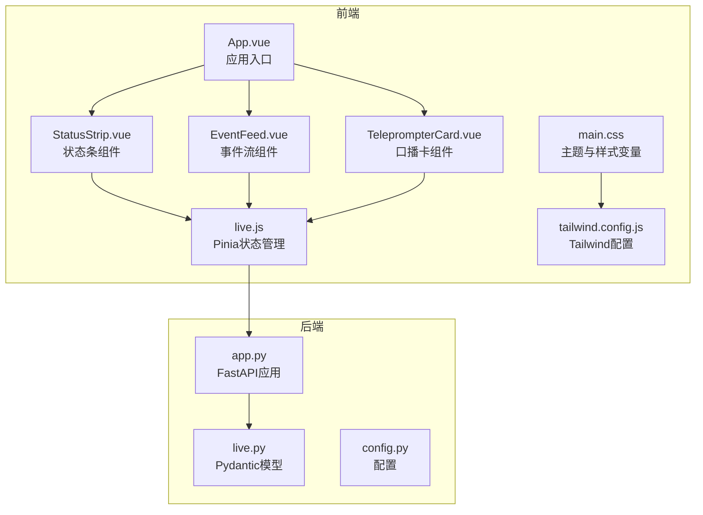
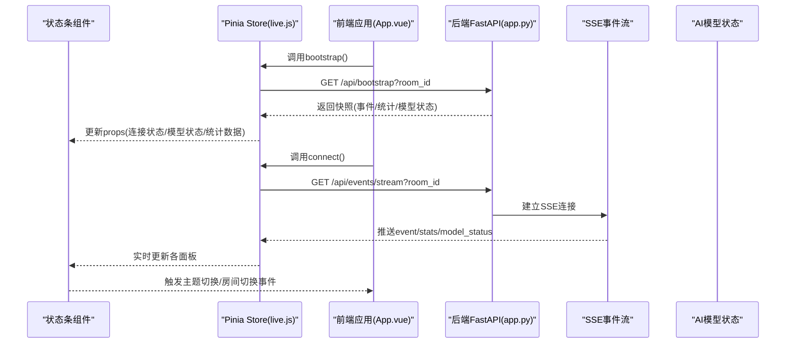
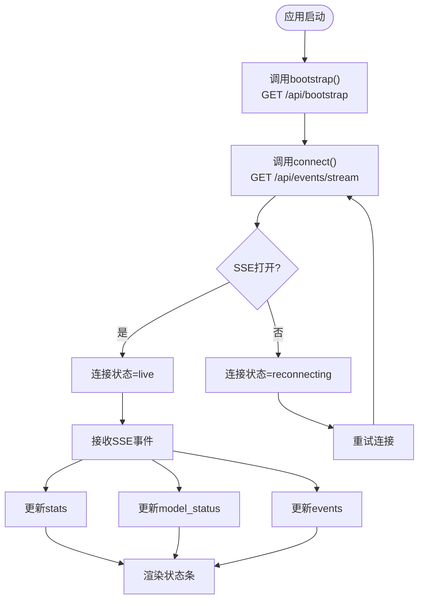
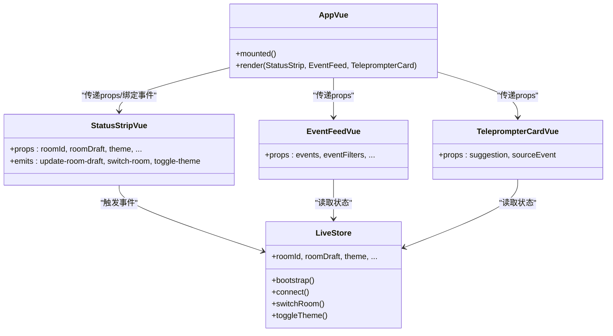
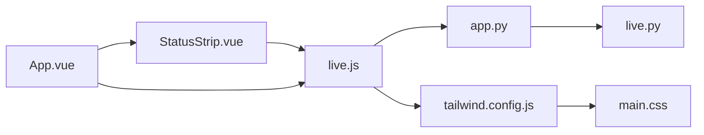

# 状态条组件

<cite>
**本文档引用的文件**
- [StatusStrip.vue](file://frontend/src/components/StatusStrip.vue)
- [live.js](file://frontend/src/stores/live.js)
- [App.vue](file://frontend/src/App.vue)
- [main.css](file://frontend/src/assets/main.css)
- [tailwind.config.js](file://frontend/tailwind.config.js)
- [EventFeed.vue](file://frontend/src/components/EventFeed.vue)
- [TeleprompterCard.vue](file://frontend/src/components/TeleprompterCard.vue)
- [app.py](file://backend/app.py)
- [live.py](file://backend/schemas/live.py)
- [config.py](file://backend/config.py)
</cite>

## 目录
1. [简介](#简介)
2. [项目结构](#项目结构)
3. [核心组件](#核心组件)
4. [架构总览](#架构总览)
5. [详细组件分析](#详细组件分析)
6. [依赖关系分析](#依赖关系分析)
7. [性能考虑](#性能考虑)
8. [故障排除指南](#故障排除指南)
9. [结论](#结论)

## 简介
本文件为状态条组件(StatusStrip.vue)的全面技术文档，重点阐述其如何实时展示系统状态信息，包括连接状态指示器、AI模型运行状态和统计数据面板；解释布局设计与响应式适配；说明状态数据的来源与更新机制（后端API与SSE通信）；展示颜色编码系统与视觉反馈；提供可配置性与主题切换能力；并描述与其他组件的交互流程。

## 项目结构
前端采用Vue 3 + Pinia + TailwindCSS架构，状态条作为应用顶部的状态栏，负责房间切换、主题切换、连接状态、模型状态与统计数据的展示，并通过事件流与后端保持实时同步。

**图表来源**
- [App.vue:35-65](file://frontend/src/App.vue#L35-L65)
- [StatusStrip.vue:44-143](file://frontend/src/components/StatusStrip.vue#L44-L143)
- [live.js:70-309](file://frontend/src/stores/live.js#L70-L309)
- [app.py:94-220](file://backend/app.py#L94-L220)
- [live.py:64-95](file://backend/schemas/live.py#L64-L95)
- [main.css:5-64](file://frontend/src/assets/main.css#L5-L64)
- [tailwind.config.js:1-23](file://frontend/tailwind.config.js#L1-L23)

**章节来源**
- [App.vue:1-66](file://frontend/src/App.vue#L1-L66)
- [StatusStrip.vue:1-144](file://frontend/src/components/StatusStrip.vue#L1-L144)
- [live.js:1-310](file://frontend/src/stores/live.js#L1-L310)
- [app.py:1-220](file://backend/app.py#L1-L220)
- [live.py:1-95](file://backend/schemas/live.py#L1-L95)
- [main.css:1-144](file://frontend/src/assets/main.css#L1-L144)
- [tailwind.config.js:1-23](file://frontend/tailwind.config.js#L1-L23)

## 核心组件
- 状态条组件(StatusStrip.vue)：展示房间号、房间切换输入与按钮、连接状态、评论数、模型状态、总事件数，并支持主题切换。
- Pinia状态管理(live.js)：集中管理房间ID、草稿、主题、连接状态、模型状态、统计数据、事件过滤等，并负责与后端的HTTP与SSE通信。
- 应用入口(App.vue)：挂载状态条并初始化bootstrap与SSE连接。
- 主题样式(main.css)：基于CSS变量的主题系统，支持深色/浅色模式。
- 后端API(app.py)：提供bootstrap、room切换、SSE事件流等接口，向前端推送事件、统计与模型状态。

**章节来源**
- [StatusStrip.vue:1-39](file://frontend/src/components/StatusStrip.vue#L1-L39)
- [live.js:70-309](file://frontend/src/stores/live.js#L70-L309)
- [App.vue:29-32](file://frontend/src/App.vue#L29-L32)
- [main.css:5-64](file://frontend/src/assets/main.css#L5-L64)
- [app.py:109-206](file://backend/app.py#L109-L206)

## 架构总览
状态条组件通过Pinia store接收来自后端的实时数据，使用TailwindCSS提供的语义化颜色类进行视觉呈现。后端通过FastAPI提供REST与SSE接口，前端通过EventSource订阅实时事件流。

**图表来源**
- [App.vue:29-32](file://frontend/src/App.vue#L29-L32)
- [live.js:158-205](file://frontend/src/stores/live.js#L158-L205)
- [app.py:109-206](file://backend/app.py#L109-L206)

## 详细组件分析

### 组件属性与事件
- 属性
  - roomId: 房间号字符串
  - roomDraft: 房间切换输入草稿
  - theme: 当前主题("dark"/"light")
  - nextThemeLabel: 下一主题提示文本
  - isSwitchingRoom: 切换房间中的布尔状态
  - roomError: 房间切换错误信息
  - connectionState: 连接状态字符串
  - modelStatus: 模型状态对象
  - stats: 统计数据对象
- 事件
  - update-room-draft: 输入框变更时触发
  - switch-room: 切换房间按钮点击时触发
  - toggle-theme: 主题切换按钮点击时触发

**章节来源**
- [StatusStrip.vue:2-39](file://frontend/src/components/StatusStrip.vue#L2-L39)
- [StatusStrip.vue:41](file://frontend/src/components/StatusStrip.vue#L41)

### 布局设计与响应式适配
- 布局网格：使用CSS Grid在大屏上按比例分配区域，小屏下自动堆叠。
- 主题按钮：绝对定位在右上角，支持悬停与过渡动画。
- 输入与按钮：在小屏下垂直排列，在中屏及以上水平排列。
- 文字层级：标题使用小号字重，数值使用中号字重，强调文字使用大写与追踪。
- 颜色体系：使用Tailwind语义色板，如text-paper、text-muted、text-accent等。

**章节来源**
- [StatusStrip.vue:44-143](file://frontend/src/components/StatusStrip.vue#L44-L143)
- [tailwind.config.js:4-19](file://frontend/tailwind.config.js#L4-L19)

### 数据来源与更新机制
- 初始化：应用挂载后调用store.bootstrap()获取初始快照。
- 实时流：调用store.connect()建立SSE连接，订阅event、suggestion、stats、model_status事件。
- 房间切换：通过store.switchRoom()发起HTTP请求，成功后重新bootstrap并connect。
- 后端接口：
  - GET /api/bootstrap：返回包含最近事件、建议、统计与模型状态的快照。
  - GET /api/events/stream：SSE事件流，推送各类事件与状态。
  - POST /api/room：切换房间并返回新房间快照。

**图表来源**
- [live.js:158-205](file://frontend/src/stores/live.js#L158-L205)
- [app.py:187-206](file://backend/app.py#L187-L206)

**章节来源**
- [App.vue:29-32](file://frontend/src/App.vue#L29-L32)
- [live.js:158-205](file://frontend/src/stores/live.js#L158-L205)
- [app.py:109-206](file://backend/app.py#L109-L206)

### 颜色编码系统与视觉反馈
- 主题变量：深色/浅色两套CSS变量，统一控制背景、面板、文字、强调色等。
- 状态颜色：
  - 连接状态：使用强调色(text-accent)突出连接状态文本。
  - 错误信息：使用rose-500表示房间切换错误。
  - 按钮与输入：使用面板色与强调色边框/背景，hover时增强对比度。
- 主题切换：根据当前主题显示太阳/月亮图标，点击触发toggle-theme事件。

**章节来源**
- [main.css:5-64](file://frontend/src/assets/main.css#L5-L64)
- [StatusStrip.vue:113-115](file://frontend/src/components/StatusStrip.vue#L113-L115)
- [StatusStrip.vue:54-86](file://frontend/src/components/StatusStrip.vue#L54-L86)

### 自定义配置与主题切换
- 显示字段：状态条固定展示房间号、连接状态、评论数、模型状态、总事件数，不支持动态增删字段。
- 主题切换：通过store.toggleTheme()切换主题并持久化到localStorage，同时应用到documentElement.dataset.theme。
- 事件过滤：虽然状态条不直接处理事件过滤，但可通过store.selectedEventTypes影响EventFeed的显示。

**章节来源**
- [live.js:54-68](file://frontend/src/stores/live.js#L54-L68)
- [live.js:148-156](file://frontend/src/stores/live.js#L148-L156)
- [EventFeed.vue:119-139](file://frontend/src/components/EventFeed.vue#L119-L139)

### 与其他组件的交互
- 与App.vue：App.vue在mounted时初始化store并挂载StatusStrip，传递所有必需props并绑定事件。
- 与EventFeed：EventFeed消费store.filteredEvents，状态条不直接参与事件列表渲染。
- 与TeleprompterCard：TeleprompterCard消费store.activeSuggestion与activeSourceEvent，状态条不直接参与口播建议展示。

**图表来源**
- [App.vue:35-65](file://frontend/src/App.vue#L35-L65)
- [StatusStrip.vue:41](file://frontend/src/components/StatusStrip.vue#L41)
- [live.js:70-309](file://frontend/src/stores/live.js#L70-L309)
- [EventFeed.vue:1-183](file://frontend/src/components/EventFeed.vue#L1-L183)
- [TeleprompterCard.vue:1-83](file://frontend/src/components/TeleprompterCard.vue#L1-L83)

**章节来源**
- [App.vue:10-32](file://frontend/src/App.vue#L10-L32)
- [StatusStrip.vue:44-143](file://frontend/src/components/StatusStrip.vue#L44-L143)
- [live.js:70-309](file://frontend/src/stores/live.js#L70-L309)

## 依赖关系分析
- 组件耦合
  - StatusStrip与App高度耦合：App负责初始化store并传入所有props。
  - StatusStrip与store松耦合：通过事件触发store方法，避免直接修改store内部状态。
- 外部依赖
  - TailwindCSS：提供语义化颜色与布局工具类。
  - FastAPI：提供REST与SSE接口。
  - Pydantic：后端数据模型校验与序列化。
- 可能的循环依赖
  - 无直接循环依赖，组件间通过store单向流动数据。

**图表来源**
- [StatusStrip.vue:1-144](file://frontend/src/components/StatusStrip.vue#L1-L144)
- [live.js:1-310](file://frontend/src/stores/live.js#L1-L310)
- [app.py:1-220](file://backend/app.py#L1-L220)
- [live.py:1-95](file://backend/schemas/live.py#L1-L95)
- [tailwind.config.js:1-23](file://frontend/tailwind.config.js#L1-L23)
- [main.css:1-144](file://frontend/src/assets/main.css#L1-L144)
- [App.vue:1-66](file://frontend/src/App.vue#L1-L66)

**章节来源**
- [StatusStrip.vue:1-144](file://frontend/src/components/StatusStrip.vue#L1-L144)
- [live.js:1-310](file://frontend/src/stores/live.js#L1-L310)
- [app.py:1-220](file://backend/app.py#L1-L220)
- [live.py:1-95](file://backend/schemas/live.py#L1-L95)
- [tailwind.config.js:1-23](file://frontend/tailwind.config.js#L1-L23)
- [main.css:1-144](file://frontend/src/assets/main.css#L1-L144)
- [App.vue:1-66](file://frontend/src/App.vue#L1-L66)

## 性能考虑
- SSE连接复用：通过store.connect()建立一次SSE连接，避免频繁重建连接带来的开销。
- 事件截断：前端仅保留最近N条事件与建议，防止内存膨胀。
- 主题切换即时生效：通过CSS变量与dataset切换，避免重排与重绘。
- 按需渲染：状态条仅渲染必要字段，减少DOM节点数量。

[本节为通用性能建议，无需特定文件引用]

## 故障排除指南
- 连接异常
  - 现象：连接状态变为reconnecting或错误信息出现。
  - 排查：检查后端SSE接口是否可达，确认网络与CORS设置。
- 房间切换失败
  - 现象：切换房间按钮禁用，显示错误信息。
  - 排查：确认POST /api/room返回的room_id与目标一致，检查后端日志。
- 主题切换无效
  - 现象：点击主题按钮无变化。
  - 排查：确认localStorage键值存在且正确，检查documentElement.dataset.theme是否更新。
- 统计数据不更新
  - 现象：评论数/总事件数长时间不变。
  - 排查：确认SSE事件流是否持续推送stats事件，检查后端事件处理逻辑。

**章节来源**
- [live.js:186-205](file://frontend/src/stores/live.js#L186-L205)
- [live.js:207-250](file://frontend/src/stores/live.js#L207-L250)
- [live.js:54-68](file://frontend/src/stores/live.js#L54-L68)
- [app.py:187-206](file://backend/app.py#L187-L206)

## 结论
状态条组件(StatusStrip.vue)通过Pinia与后端SSE实现高效、实时的状态展示，结合TailwindCSS的主题系统提供良好的视觉体验。组件职责清晰，与App、EventFeed、TeleprompterCard形成明确的分层协作。未来可在保持现有稳定性的基础上，考虑增加更多可配置字段与更细粒度的错误提示。