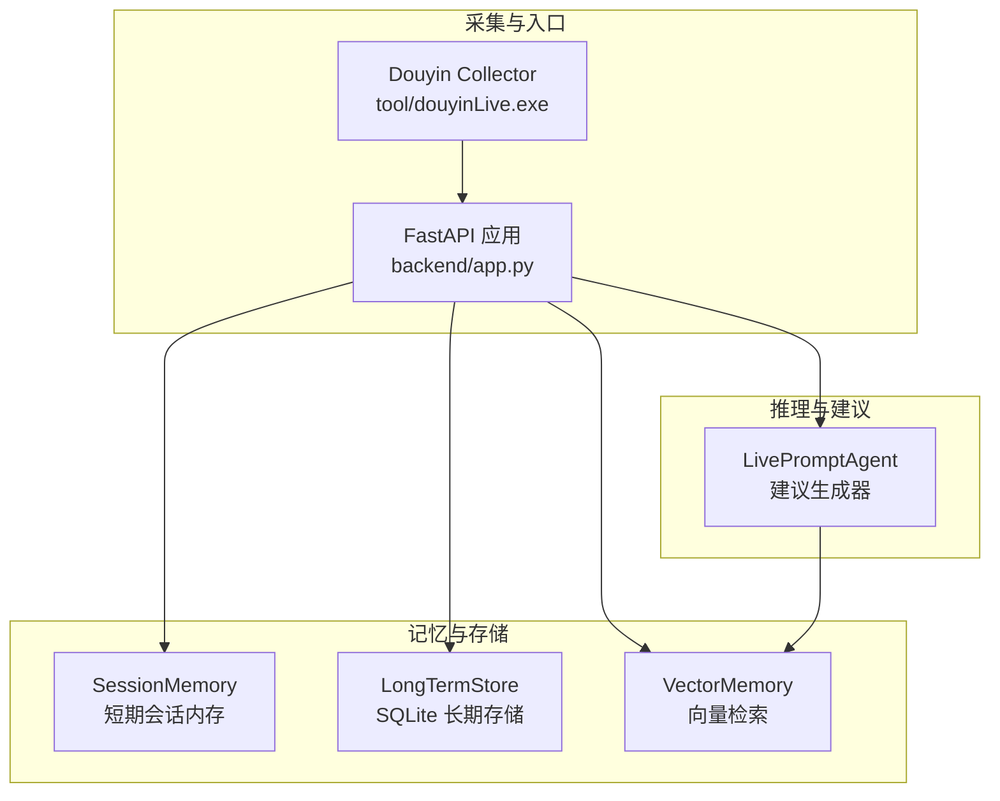
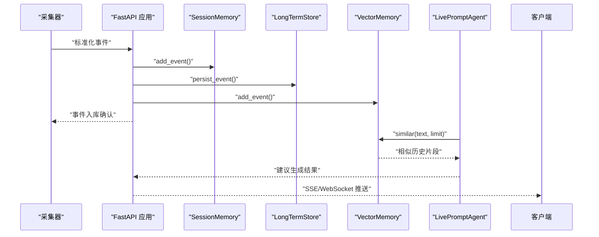
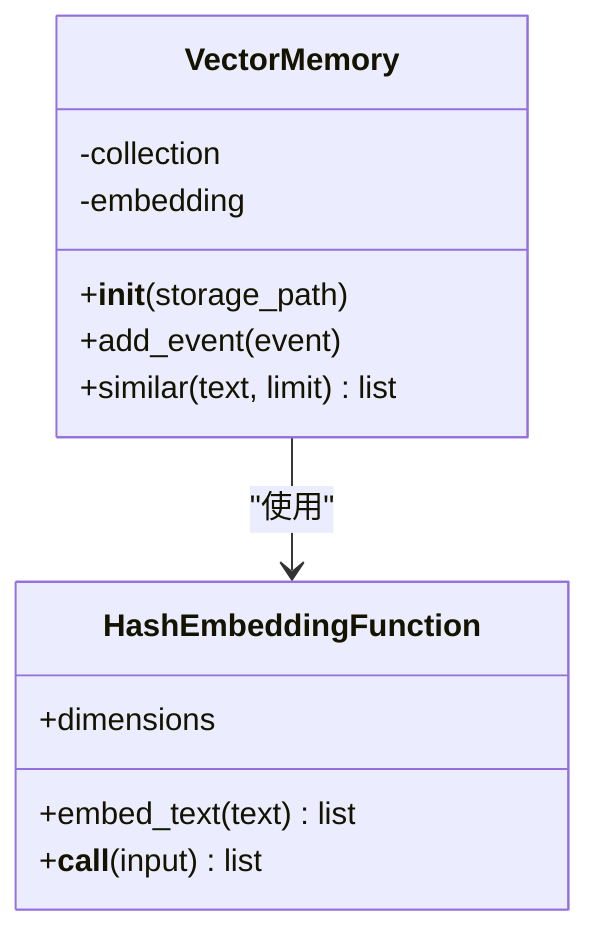
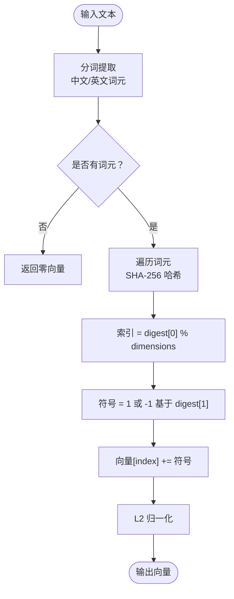
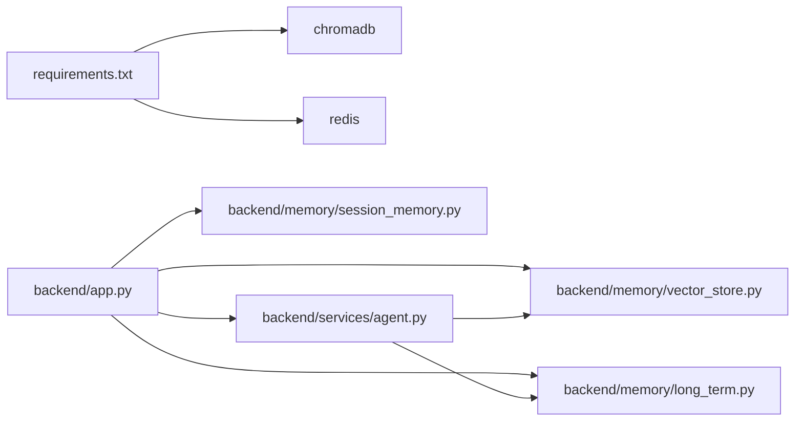

# 向量检索索引

<cite>
**本文引用的文件**
- [backend/memory/vector_store.py](file://backend/memory/vector_store.py)
- [backend/config.py](file://backend/config.py)
- [backend/schemas/live.py](file://backend/schemas/live.py)
- [backend/app.py](file://backend/app.py)
- [backend/services/agent.py](file://backend/services/agent.py)
- [backend/memory/session_memory.py](file://backend/memory/session_memory.py)
- [backend/memory/long_term.py](file://backend/memory/long_term.py)
- [tool/config.yaml](file://tool/config.yaml)
- [README.md](file://README.md)
- [USAGE.md](file://USAGE.md)
- [requirements.txt](file://requirements.txt)
- [data/DATABASE.md](file://data/DATABASE.md)
</cite>

## 目录
1. [简介](#简介)
2. [项目结构](#项目结构)
3. [核心组件](#核心组件)
4. [架构总览](#架构总览)
5. [详细组件分析](#详细组件分析)
6. [依赖关系分析](#依赖关系分析)
7. [性能考量](#性能考量)
8. [故障排查指南](#故障排查指南)
9. [结论](#结论)
10. [附录](#附录)

## 简介
本文件聚焦于向量检索索引层，系统性阐述在直播场景中如何利用 ChromaDB 作为向量搜索引擎，结合文本嵌入生成、相似度检索与语义搜索，支撑“相似事件检索”“内容推荐”“上下文构建”等能力。文档同时覆盖：
- 向量存储的数据结构与索引策略
- 嵌入维度、距离计算与索引优化
- 预处理流程、嵌入函数配置与检索参数调优
- 向量检索接口使用示例
- 嵌入模型配置、性能基准与容量规划建议
- 与传统关键词搜索的差异与优势
- 在直播场景中的落地应用

## 项目结构
后端采用分层设计：入口应用负责事件编排与接口暴露，短期记忆与长期存储分别负责热数据与历史数据，向量检索层负责相似事件索引与检索，Agent 负责上下文构建与建议生成。ChromaDB 作为可选增强，提供向量索引能力；若不可用，则退化为轻量文本相似策略，确保检索能力不中断。

图表来源
- [backend/app.py:25-29](file://backend/app.py#L25-L29)
- [backend/memory/session_memory.py:17-113](file://backend/memory/session_memory.py#L17-L113)
- [backend/memory/long_term.py:36-750](file://backend/memory/long_term.py#L36-L750)
- [backend/memory/vector_store.py:52-108](file://backend/memory/vector_store.py#L52-L108)
- [backend/services/agent.py:23-393](file://backend/services/agent.py#L23-L393)

章节来源
- [backend/app.py:25-29](file://backend/app.py#L25-L29)
- [backend/memory/session_memory.py:17-113](file://backend/memory/session_memory.py#L17-L113)
- [backend/memory/long_term.py:36-750](file://backend/memory/long_term.py#L36-L750)
- [backend/memory/vector_store.py:52-108](file://backend/memory/vector_store.py#L52-L108)
- [backend/services/agent.py:23-393](file://backend/services/agent.py#L23-L393)

## 核心组件
- 向量检索层（VectorMemory）
  - 支持 ChromaDB 持久化向量库；不可用时退化为本地轻量嵌入与文本相似策略
  - 文档向量化：将“用户名 + 评论内容”拼接为文档，元数据包含房间号与事件类型
  - 查询：基于嵌入向量进行相似检索，返回最相近的历史片段
- 嵌入函数（HashEmbeddingFunction）
  - 固定维度（默认 64）哈希嵌入，对分词后的 token 做哈希并映射到维度索引，正负号由摘要第二字节决定，最后做 L2 归一化
  - 适配 Chroma 的 embedding 接口
- 配置（Settings）
  - 提供 Chroma 数据目录、LLM 模型与 API Key、会话 TTL 等运行时参数
- 数据模型（LiveEvent）
  - 统一直播事件结构，包含用户身份、事件类型、内容与时间戳等
- 建议生成器（LivePromptAgent）
  - 构建上下文：近期事件、相似历史、用户画像
  - 优先调用在线模型，失败时回退本地启发式规则

章节来源
- [backend/memory/vector_store.py:19-108](file://backend/memory/vector_store.py#L19-L108)
- [backend/config.py:39-94](file://backend/config.py#L39-L94)
- [backend/schemas/live.py:29-44](file://backend/schemas/live.py#L29-L44)
- [backend/services/agent.py:56-114](file://backend/services/agent.py#L56-L114)

## 架构总览
向量检索在整体链路中的位置如下：采集器将直播事件标准化为统一结构，随后写入短期记忆、长期存储与向量检索；建议生成器在需要时调用向量检索获取相似历史，结合近期事件与用户画像构建上下文，生成提词建议并通过 SSE/WebSocket 推送至前端。

图表来源
- [backend/app.py:61-78](file://backend/app.py#L61-L78)
- [backend/memory/vector_store.py:64-108](file://backend/memory/vector_store.py#L64-L108)
- [backend/services/agent.py:56-114](file://backend/services/agent.py#L56-L114)

## 详细组件分析

### 向量检索层（VectorMemory）
- 初始化与退化策略
  - 若安装 ChromaDB，则创建持久化客户端与集合；否则仅维护内存中的最近 N 条记录
- 文档写入
  - 文档内容为“用户名 + 评论内容”，元数据包含房间号与事件类型
  - 使用嵌入函数生成向量，写入 Chroma 或内存队列
- 相似检索
  - Chroma：调用 query 接口，返回最相近的历史文档
  - 无 Chroma：基于 token 匹配计算重叠词数，按重叠度排序返回
- 关键点
  - 嵌入维度：默认 64，可通过构造函数调整
  - 归一化：L2 归一化，保证向量长度一致
  - 令牌化：中文与英文词元统一提取，忽略空字符

图表来源
- [backend/memory/vector_store.py:52-108](file://backend/memory/vector_store.py#L52-L108)
- [backend/memory/vector_store.py:19-50](file://backend/memory/vector_store.py#L19-L50)

章节来源
- [backend/memory/vector_store.py:52-108](file://backend/memory/vector_store.py#L52-L108)
- [backend/memory/vector_store.py:19-50](file://backend/memory/vector_store.py#L19-L50)

### 嵌入函数（HashEmbeddingFunction）
- 设计目标
  - 在无外部嵌入模型时提供可运行的近似语义能力，而非追求高精度
- 实现要点
  - 分词：提取中文与英文词元
  - 哈希：对每个词元做 SHA-256，取低字节决定维度索引，高字节决定正负号
  - 归一化：向量 L2 归一化，避免维度稀疏导致的偏差
- 参数
  - 维度：默认 64，可按内存与性能需求调整
  - 归一化：保证向量长度为 1，便于余弦相似度近似

图表来源
- [backend/memory/vector_store.py:29-44](file://backend/memory/vector_store.py#L29-L44)

章节来源
- [backend/memory/vector_store.py:29-44](file://backend/memory/vector_store.py#L29-L44)

### 相似事件检索工作原理
- 预处理流程
  - 文本清洗与分词，提取有效词元
  - 拼接用户名与内容形成文档
- 嵌入函数配置
  - 维度：64（可调）
  - 归一化：L2
- 检索参数调优
  - limit：返回相似历史数量（默认 3）
  - Chroma：可进一步配置 n_results、where 等参数（当前未启用）
- 结果解释
  - 返回历史文档片段，用于上下文构建与建议生成

章节来源
- [backend/memory/vector_store.py:64-108](file://backend/memory/vector_store.py#L64-L108)
- [backend/services/agent.py:65-71](file://backend/services/agent.py#L65-L71)

### 向量检索接口使用示例
- 相似事件查找
  - 调用 VectorMemory.similar(text, limit)，返回历史片段列表
  - 用于“复用高互动回答节奏”
- 内容推荐
  - 结合用户画像与近期事件，构建推荐语料
- 上下文构建
  - LivePromptAgent.build_context 将 recent_events、similar_history、user_profile 组合为建议生成上下文

章节来源
- [backend/memory/vector_store.py:85-108](file://backend/memory/vector_store.py#L85-L108)
- [backend/services/agent.py:56-71](file://backend/services/agent.py#L56-L71)

### 与传统关键词搜索的差异与优势
- 传统关键词搜索
  - 基于精确匹配或 TF-IDF 等统计方法
  - 对同义表达、语义相近场景表现有限
- 向量检索
  - 通过嵌入将语义映射到连续向量空间
  - 能捕获语义相似性，提升“相似事件”召回质量
- 直播场景优势
  - 快速复用高互动回答节奏
  - 降低重复劳动，提高响应一致性

## 依赖关系分析
- 外部依赖
  - ChromaDB：提供向量索引与查询能力
  - Redis：短期会话内存（可选）
  - SQLite：长期存储（必需）
- 内部依赖
  - VectorMemory 依赖 LiveEvent 数据模型
  - LivePromptAgent 依赖 VectorMemory 与 LongTermStore
  - FastAPI 应用协调各组件并暴露接口

图表来源
- [requirements.txt:1-6](file://requirements.txt#L1-L6)
- [backend/app.py:13-29](file://backend/app.py#L13-L29)

章节来源
- [requirements.txt:1-6](file://requirements.txt#L1-L6)
- [backend/app.py:13-29](file://backend/app.py#L13-L29)

## 性能考量
- 嵌入维度与内存
  - 维度越高，向量越稠密，相似度计算更精细，但内存与计算成本上升
  - 默认 64 维适合中小规模直播场景；可根据硬件资源与召回质量权衡
- 归一化与距离
  - L2 归一化后，余弦相似度与欧氏距离近似，便于快速检索
- Chroma 索引优化
  - 可扩展：设置 where 过滤、n_results 限制、元数据索引
  - 当前未启用高级参数，后续可按业务需求增加
- 退化策略
  - 无 Chroma 时，使用 token 重叠度排序，复杂度 O(N·M)（N 为历史条目，M 为平均词数），适合小规模场景

## 故障排查指南
- Chroma 不可用
  - 现象：向量检索退化为本地文本相似
  - 处理：安装 chromadb 或保持默认行为
- 嵌入维度过小导致召回不足
  - 现象：相似度偏低
  - 处理：适当增大维度（如 128），评估内存与性能
- 检索 limit 设置不当
  - 现象：召回过多或过少
  - 处理：根据业务目标调整 limit
- LLM 模型失败回退
  - 现象：模型状态显示 fallback
  - 处理：检查 API Key、网络与超时设置

章节来源
- [backend/memory/vector_store.py:13-16](file://backend/memory/vector_store.py#L13-L16)
- [backend/services/agent.py:99-113](file://backend/services/agent.py#L99-L113)

## 结论
向量检索索引层在直播场景中提供了“语义相似事件”的高效召回能力，结合短期记忆、长期存储与建议生成器，形成了从事件采集到实时提词的完整链路。通过可选的 ChromaDB 与本地退化策略，系统在不同部署环境下均能保持稳定运行。未来可在嵌入维度、索引参数与检索策略上持续优化，以满足更高召回质量与更低延迟的需求。

## 附录

### 嵌入模型配置与运行参数
- Chroma 数据目录
  - 通过配置项指定，用于持久化向量集合
- LLM 模型与 API Key
  - 支持 Qwen/OpenAI 兼容模式，失败时回退本地规则
- 会话 TTL
  - 控制短期会话数据生命周期

章节来源
- [backend/config.py:53-60](file://backend/config.py#L53-L60)
- [backend/config.py:70-90](file://backend/config.py#L70-L90)

### 数据库与存储容量规划
- SQLite 表结构
  - events、viewer_profiles、viewer_gifts、live_sessions、viewer_notes、suggestions
- 常用查询
  - 观察观众画像、评论历史、礼物聚合、当前活动场次、观众备注
- 容量建议
  - 依据房间规模与事件密度估算 events 表增长速度，预留磁盘空间与索引维护时间

章节来源
- [data/DATABASE.md:16-150](file://data/DATABASE.md#L16-L150)

### 直播场景应用示例
- 相似事件查找
  - 输入：当前评论文本
  - 输出：历史高互动回答片段
- 内容推荐
  - 输入：近期事件、用户画像
  - 输出：适合口播的短句建议
- 上下文构建
  - 输入：LiveEvent、近期事件、用户画像
  - 输出：建议生成所需上下文

章节来源
- [backend/services/agent.py:56-114](file://backend/services/agent.py#L56-L114)
- [backend/memory/vector_store.py:85-108](file://backend/memory/vector_store.py#L85-L108)