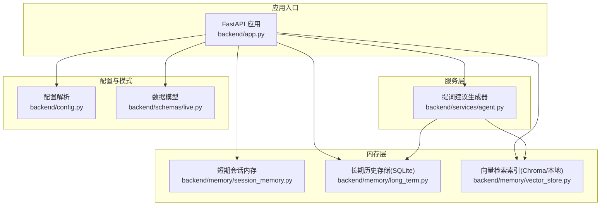
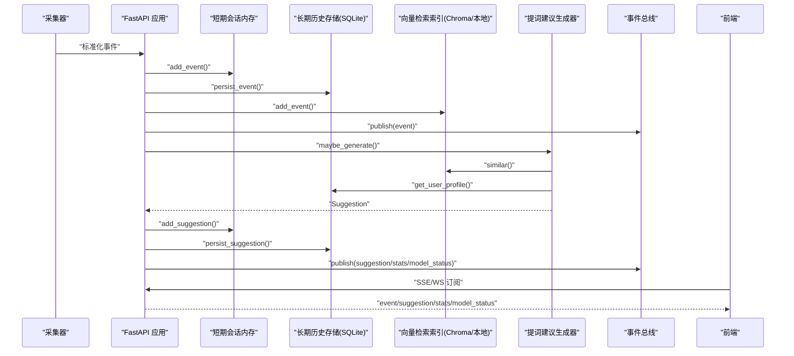
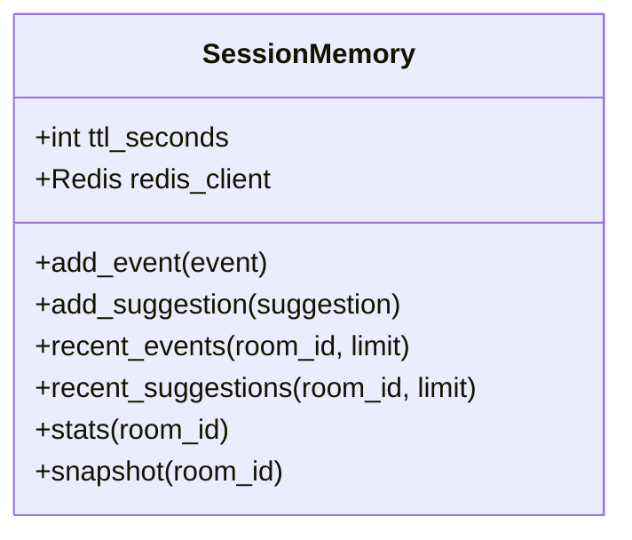
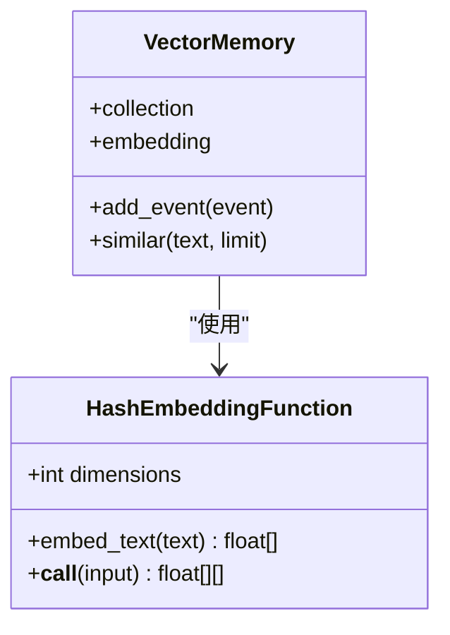
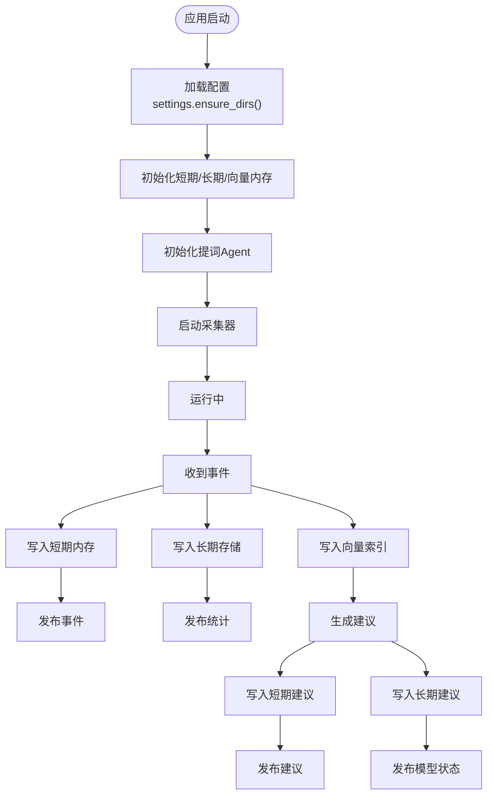
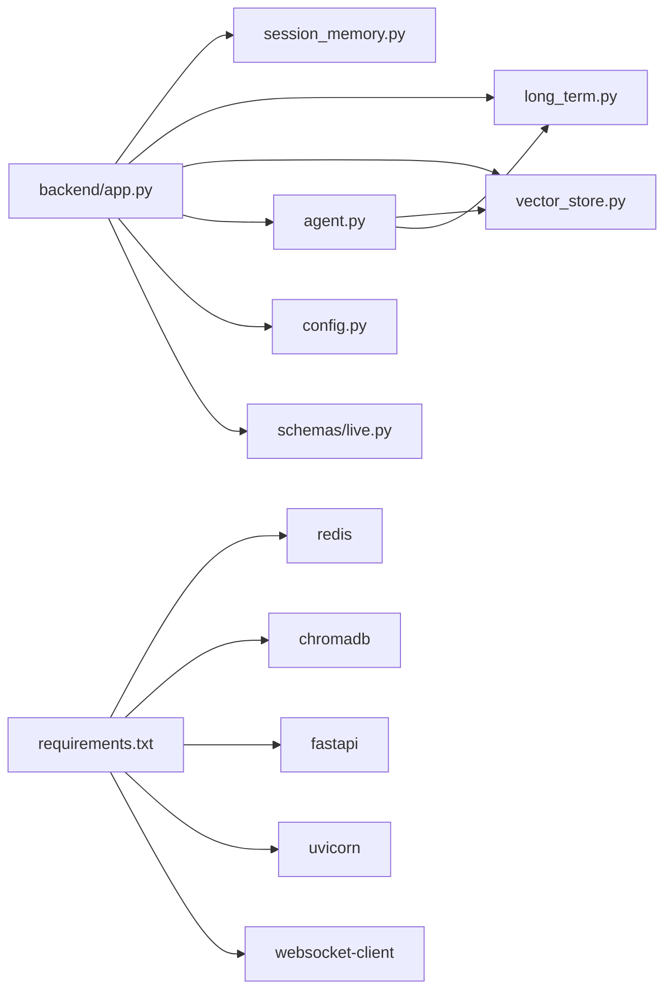

# 多层内存管理

<cite>
**本文引用的文件**
- [backend/memory/session_memory.py](file://backend/memory/session_memory.py)
- [backend/memory/long_term.py](file://backend/memory/long_term.py)
- [backend/memory/vector_store.py](file://backend/memory/vector_store.py)
- [backend/config.py](file://backend/config.py)
- [backend/schemas/live.py](file://backend/schemas/live.py)
- [backend/app.py](file://backend/app.py)
- [backend/services/agent.py](file://backend/services/agent.py)
- [requirements.txt](file://requirements.txt)
- [README.md](file://README.md)
- [data/DATABASE.md](file://data/DATABASE.md)
</cite>

## 目录
1. [简介](#简介)
2. [项目结构](#项目结构)
3. [核心组件](#核心组件)
4. [架构总览](#架构总览)
5. [详细组件分析](#详细组件分析)
6. [依赖关系分析](#依赖关系分析)
7. [性能考量](#性能考量)
8. [故障排查指南](#故障排查指南)
9. [结论](#结论)
10. [附录](#附录)

## 简介
本项目为抖音直播场景设计的实时提词系统，采用“三层内存”架构：
- 短期会话内存（Redis/进程内内存）：负责实时会话数据的高速写入与读取，支持 TTL 控制热数据生命周期。
- 长期历史存储（SQLite）：负责事件、建议、观众画像、场次等历史数据的持久化与聚合统计。
- 向量检索索引（Chroma/本地哈希嵌入）：负责基于语义相似的历史事件检索，提升建议生成质量。

系统具备优雅降级能力：当 Redis 或 Chroma 不可用时，短期内存与向量检索会自动退化为进程内内存与轻量文本相似策略，确保核心流程不受影响。

## 项目结构
后端采用 FastAPI 应用入口，内存层与服务层清晰分离，配置集中管理，便于扩展与维护。



图表来源
- [backend/app.py:25-29](file://backend/app.py#L25-L29)
- [backend/memory/session_memory.py:17-113](file://backend/memory/session_memory.py#L17-L113)
- [backend/memory/long_term.py:36-750](file://backend/memory/long_term.py#L36-L750)
- [backend/memory/vector_store.py:52-108](file://backend/memory/vector_store.py#L52-L108)
- [backend/services/agent.py:23-200](file://backend/services/agent.py#L23-L200)
- [backend/config.py:39-94](file://backend/config.py#L39-L94)
- [backend/schemas/live.py:8-95](file://backend/schemas/live.py#L8-L95)

章节来源
- [backend/app.py:25-29](file://backend/app.py#L25-L29)
- [backend/config.py:39-94](file://backend/config.py#L39-L94)
- [README.md:35-48](file://README.md#L35-L48)

## 核心组件
- 短期会话内存（SessionMemory）
  - 支持 Redis 与进程内两种模式，自动降级。
  - 提供事件与建议的写入、读取、统计与快照。
  - Redis 模式下使用列表与过期策略控制热数据生命周期。
- 长期历史存储（LongTermStore）
  - 基于 SQLite 的事件、建议、观众画像、礼物、场次与备注等表。
  - 自动建表、索引与列迁移，支持增量重建聚合。
  - 提供事件、建议、统计、观众画像与会话查询。
- 向量检索索引（VectorMemory）
  - 支持 Chroma 持久化集合与本地哈希嵌入函数。
  - 提供事件内容的向量化与相似检索，作为建议生成上下文。
- 配置（Settings）
  - 从环境变量与 .env 读取配置，提供默认值，确保本地开箱即用。
  - 包含 Redis、SQLite、Chroma、会话 TTL、LLM 模式与模型参数等。
- 数据模型（schemas.live）
  - 统一的事件、建议、统计、快照与状态模型，贯穿采集、存储与 API。

章节来源
- [backend/memory/session_memory.py:17-113](file://backend/memory/session_memory.py#L17-L113)
- [backend/memory/long_term.py:36-750](file://backend/memory/long_term.py#L36-L750)
- [backend/memory/vector_store.py:52-108](file://backend/memory/vector_store.py#L52-L108)
- [backend/config.py:39-94](file://backend/config.py#L39-L94)
- [backend/schemas/live.py:8-95](file://backend/schemas/live.py#L8-L95)

## 架构总览
三层内存协同工作：事件经采集标准化后，同时写入短期内存、长期存储与向量索引；建议生成器在短期窗口与向量相似历史之间构建上下文，优先调用在线模型，失败时回退本地规则；前端通过 SSE/WebSocket 实时接收事件、建议、统计与模型状态。



图表来源
- [backend/app.py:61-78](file://backend/app.py#L61-L78)
- [backend/services/agent.py:73-94](file://backend/services/agent.py#L73-L94)
- [backend/memory/session_memory.py:42-84](file://backend/memory/session_memory.py#L42-L84)
- [backend/memory/long_term.py:420-454](file://backend/memory/long_term.py#L420-L454)
- [backend/memory/vector_store.py:64-83](file://backend/memory/vector_store.py#L64-L83)

## 详细组件分析

### 短期会话内存（SessionMemory）
- 设计理念
  - 优先使用 Redis 保存最近事件与建议，利用列表与过期控制热数据生命周期。
  - 若未安装 Redis 或未配置地址，则自动退化为进程内 deque，保证基本可用。
- 关键职责
  - 写入：add_event/add_suggestion，支持 Redis 与进程内两种路径。
  - 读取：recent_events/recent_suggestions，支持限流与反序列化。
  - 统计：stats 基于近期事件窗口统计各类事件数量。
  - 快照：snapshot 组合近期事件、建议与统计，供前端初始化。
- 降级策略
  - Redis 不可用时，所有操作转为进程内内存，不丢失功能。
- 参数与配置
  - redis_url：Redis 地址，留空则退化。
  - ttl_seconds：Redis 键过期时间（秒），默认 14400（4 小时）。



图表来源
- [backend/memory/session_memory.py:17-113](file://backend/memory/session_memory.py#L17-L113)

章节来源
- [backend/memory/session_memory.py:17-113](file://backend/memory/session_memory.py#L17-L113)
- [backend/config.py:54-55](file://backend/config.py#L54-L55)

### 长期历史存储（LongTermStore）
- 设计理念
  - 以 SQLite 为核心，提供事件、建议、观众画像、礼物、场次与备注等表。
  - 自动建表、索引与列迁移，支持增量重建聚合，保证历史数据的完整性与可查询性。
- 关键职责
  - 事件持久化：persist_event，自动分配会话 ID，更新直播场次统计与观众画像。
  - 建议持久化：persist_suggestion。
  - 查询接口：recent_events/recent_suggestions/stats/snapshot。
  - 观众画像：viewer_event_history/viewer_gift_history/viewer_session_history/get_user_profile/get_viewer_detail。
  - 会话管理：list_live_sessions/get_active_session/close_active_session。
  - 备注管理：list_viewer_notes/get_viewer_note/save_viewer_note/delete_viewer_note。
- 数据生命周期
  - 事件按时间倒序存储，支持按房间与类型过滤。
  - 观众画像与礼物聚合通过增量重建维护，避免全量扫描。
- 性能优化
  - 多处索引覆盖常见查询路径，如房间+时间、房间+观众+时间、房间+事件类型+时间等。
  - 使用 UPSERT/ON CONFLICT 更新聚合表，减少重复计算。

```mermaid
erDiagram
EVENTS {
text event_id PK
text room_id
text source_room_id
text session_id
text platform
text event_type
text method
text livename
text viewer_id
text user_id
text short_id
text sec_uid
text nickname
text content
text gift_name
text gift_id
int gift_count
int gift_diamond_count
int ts
text metadata_json
text raw_json
}
SUGGESTIONS {
text suggestion_id PK
text room_id
text event_id
text priority
text reply_text
text tone
text reason
real confidence
int created_at
}
VIEWER_PROFILES {
text room_id PK
text viewer_id PK
text source_room_id
text user_id
text short_id
text sec_uid
text nickname
int total_event_count
int comment_count
int join_count
int gift_event_count
int total_gift_count
int total_diamond_count
int first_seen_at
int last_seen_at
text last_session_id
text last_comment
int last_join_at
text last_gift_name
int last_gift_at
}
VIEWER_GIFTS {
text room_id PK
text viewer_id PK
text gift_name PK
text source_room_id
text user_id
text short_id
text sec_uid
text nickname
text gift_id
int gift_event_count
int total_gift_count
int total_diamond_count
int first_sent_at
int last_sent_at
}
LIVE_SESSIONS {
text session_id PK
text room_id
text source_room_id
text livename
text status
int started_at
int last_event_at
int ended_at
int event_count
int comment_count
int gift_event_count
int join_count
}
VIEWER_NOTES {
text note_id PK
text room_id
text viewer_id
text author
text content
int is_pinned
int created_at
int updated_at
}
EVENTS }o--|| VIEWER_PROFILES : "按观众聚合"
EVENTS }o--|| VIEWER_GIFTS : "按礼物聚合"
EVENTS }o--o|| LIVE_SESSIONS : "归属会话"
SUGGESTIONS }o--|| EVENTS : "关联事件"
```

图表来源
- [backend/memory/long_term.py:54-148](file://backend/memory/long_term.py#L54-L148)
- [data/DATABASE.md:16-150](file://data/DATABASE.md#L16-L150)

章节来源
- [backend/memory/long_term.py:36-750](file://backend/memory/long_term.py#L36-L750)
- [data/DATABASE.md:16-150](file://data/DATABASE.md#L16-L150)

### 向量检索索引（VectorMemory）
- 设计理念
  - 优先使用 Chroma 持久化集合进行向量检索；若未安装 Chroma，则退化为本地哈希嵌入与轻量文本相似策略。
- 关键职责
  - add_event：将事件内容与元数据写入索引，支持 Redis/Chroma 与进程内两种路径。
  - similar：基于嵌入向量或关键词重叠计算相似度，返回历史片段。
- 降级策略
  - Chroma 不可用时，使用本地哈希嵌入函数生成固定维度向量，并以关键词重叠作为相似度评分。
- 嵌入函数
  - HashEmbeddingFunction：对中文与英文词元进行哈希签名，归一化后形成低维向量，兼顾可运行性与近似语义。



图表来源
- [backend/memory/vector_store.py:19-108](file://backend/memory/vector_store.py#L19-L108)

章节来源
- [backend/memory/vector_store.py:52-108](file://backend/memory/vector_store.py#L52-L108)

### 应用入口与集成（FastAPI）
- 初始化
  - 读取配置，创建短期内存、长期存储、向量索引与提词 Agent 实例。
- 事件处理流程
  - 写入短期内存、长期存储与向量索引。
  - 通过事件总线发布事件与统计。
  - 生成建议并写入短期内存与长期存储，同时通过事件总线发布建议与模型状态。
- 生命周期
  - 应用启动时启动采集器；关闭时结束当前直播会话并停止采集器。



图表来源
- [backend/app.py:22-92](file://backend/app.py#L22-L92)
- [backend/app.py:61-78](file://backend/app.py#L61-L78)

章节来源
- [backend/app.py:25-29](file://backend/app.py#L25-L29)
- [backend/app.py:61-78](file://backend/app.py#L61-L78)

## 依赖关系分析
- 外部依赖
  - Redis：用于短期内存的高性能列表与过期控制。
  - Chroma：用于向量检索的持久化客户端。
  - FastAPI/Uvicorn：后端服务框架与运行时。
  - websocket-client：采集器连接本地消息源。
- 内部耦合
  - 应用入口同时依赖短期内存、长期存储与向量索引。
  - 提词 Agent 依赖向量索引与长期存储，用于构建上下文。
  - 配置集中管理 Redis、SQLite、Chroma、会话 TTL 等参数。



图表来源
- [requirements.txt:1-6](file://requirements.txt#L1-L6)
- [backend/app.py:13-21](file://backend/app.py#L13-L21)
- [backend/services/agent.py:23-30](file://backend/services/agent.py#L23-L30)
- [backend/config.py:39-94](file://backend/config.py#L39-L94)

章节来源
- [requirements.txt:1-6](file://requirements.txt#L1-L6)
- [backend/app.py:13-21](file://backend/app.py#L13-L21)

## 性能考量
- 短期内存
  - Redis 模式下使用列表与 ltrim 控制窗口大小，结合 expire 控制 TTL，降低内存占用与查询成本。
  - 进程内模式使用双端队列，适合小规模并发与快速开发调试。
- 长期存储
  - 多处索引覆盖常见查询路径，避免全表扫描。
  - 使用 UPSERT/ON CONFLICT 更新聚合表，减少重复计算。
  - 增量重建观众画像与礼物聚合，避免大规模重算。
- 向量检索
  - Chroma 模式下使用持久化集合与嵌入向量，支持高效相似检索。
  - 本地模式使用哈希嵌入与关键词重叠，兼顾可运行性与近似语义。
- LLM 模式
  - 在线模式失败时自动回退本地规则，保证稳定性。
  - 模型参数（温度、超时、模型名）可通过配置调整。

章节来源
- [backend/memory/session_memory.py:42-84](file://backend/memory/session_memory.py#L42-L84)
- [backend/memory/long_term.py:183-195](file://backend/memory/long_term.py#L183-L195)
- [backend/memory/vector_store.py:64-108](file://backend/memory/vector_store.py#L64-L108)
- [backend/services/agent.py:96-114](file://backend/services/agent.py#L96-L114)
- [backend/config.py:56-61](file://backend/config.py#L56-L61)

## 故障排查指南
- Redis 不可用
  - 现象：短期内存退化为进程内模式，功能仍可用。
  - 处理：确认 REDIS_URL 是否为空；如需 Redis，请安装并正确配置。
- Chroma 不可用
  - 现象：向量检索退化为本地哈希嵌入与关键词相似策略。
  - 处理：确认 chromadb 是否安装；如需向量检索，请安装并正确配置。
- SQLite 表结构变更
  - 现象：列缺失或索引不足导致查询异常。
  - 处理：LongTermStore 自动执行建表、索引与列迁移；如需手动修复，参考数据库说明文档。
- LLM 模式失败
  - 现象：在线模型调用失败，自动回退本地规则。
  - 处理：检查 LLM_MODE、LLM_BASE_URL、LLM_MODEL、LLM_API_KEY 等配置；必要时切换为 heuristic 模式。
- 会话 TTL 与内存占用
  - 现象：短期内存过大或过期不生效。
  - 处理：调整 SESSION_TTL_SECONDS；Redis 模式下确保过期策略生效。

章节来源
- [README.md:193-207](file://README.md#L193-L207)
- [backend/memory/session_memory.py:11-14](file://backend/memory/session_memory.py#L11-L14)
- [backend/memory/vector_store.py:13-16](file://backend/memory/vector_store.py#L13-L16)
- [backend/memory/long_term.py:155-182](file://backend/memory/long_term.py#L155-L182)
- [backend/services/agent.py:96-114](file://backend/services/agent.py#L96-L114)
- [backend/config.py:54-55](file://backend/config.py#L54-L55)

## 结论
本项目通过三层内存架构实现了“实时响应 + 历史沉淀 + 语义检索”的完整闭环。短期内存保障实时性与可扩展性，长期存储提供历史洞察与统计分析，向量检索增强建议生成的语义相关性。系统在 Redis 与 Chroma 不可用时具备优雅降级能力，确保核心流程稳定运行。通过合理的配置与调优，可在不同部署环境下获得良好的性能与可靠性。

## 附录
- 配置参数说明
  - APP_HOST/APP_PORT：后端服务监听地址与端口。
  - ROOM_ID：默认采集房间号。
  - COLLECTOR_ENABLED/HOST/PORT/PING_INTERVAL_SECONDS/RECONNECT_DELAY_SECONDS：采集器开关与网络参数。
  - DATA_DIR/DATABASE_PATH/CHROMA_DIR：数据目录与 SQLite、Chroma 路径。
  - REDIS_URL：Redis 地址，留空则退化为进程内短期内存。
  - SESSION_TTL_SECONDS：短期内存键过期时间（秒）。
  - LLM_MODE/LLM_BASE_URL/LLM_MODEL/LLM_API_KEY/LLM_TEMPERATURE/LLM_TIMEOUT_SECONDS：LLM 模式与模型参数。
- 使用示例与最佳实践
  - 开启 Redis 与 Chroma：在 .env 中设置 REDIS_URL 与 CHROMA_DIR，获得最佳性能与语义检索能力。
  - 本地开发：保持 REDIS_URL 空，系统自动退化为进程内短期内存与本地向量检索。
  - 调整会话 TTL：根据业务峰值与内存预算调整 SESSION_TTL_SECONDS。
  - LLM 模式选择：生产环境建议使用在线模式，失败时自动回退本地规则；开发调试可使用 heuristic 模式。
  - 数据目录：确保 DATA_DIR、DATABASE_PATH、CHROMA_DIR 可写，避免权限问题。

章节来源
- [backend/config.py:43-94](file://backend/config.py#L43-L94)
- [README.md:142-207](file://README.md#L142-L207)