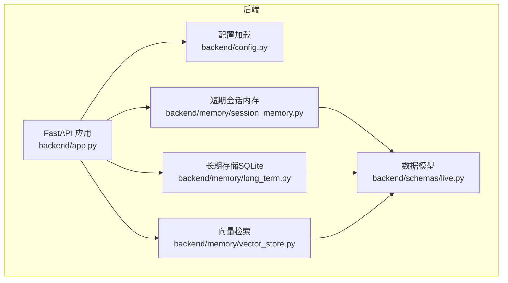
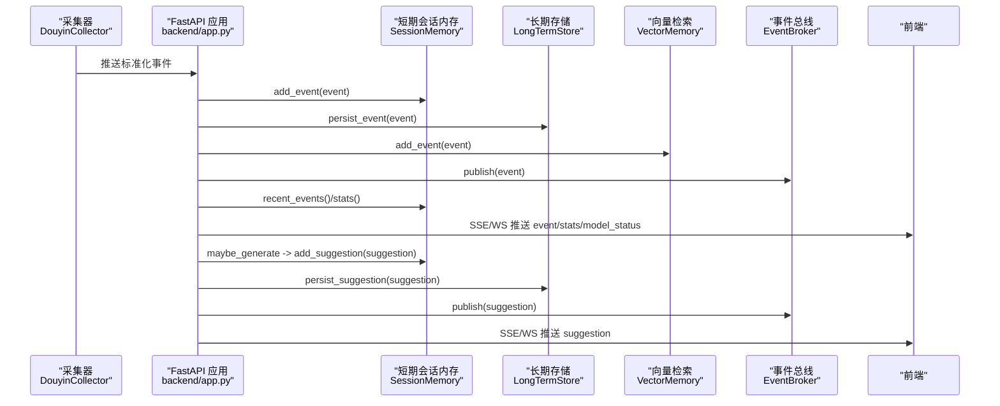
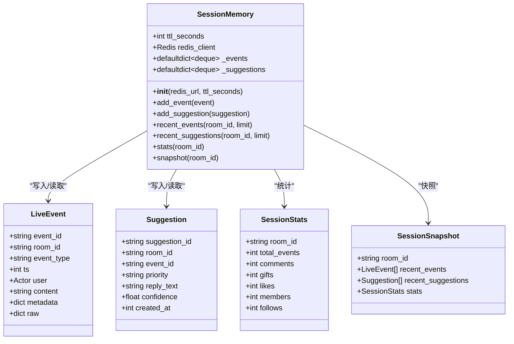
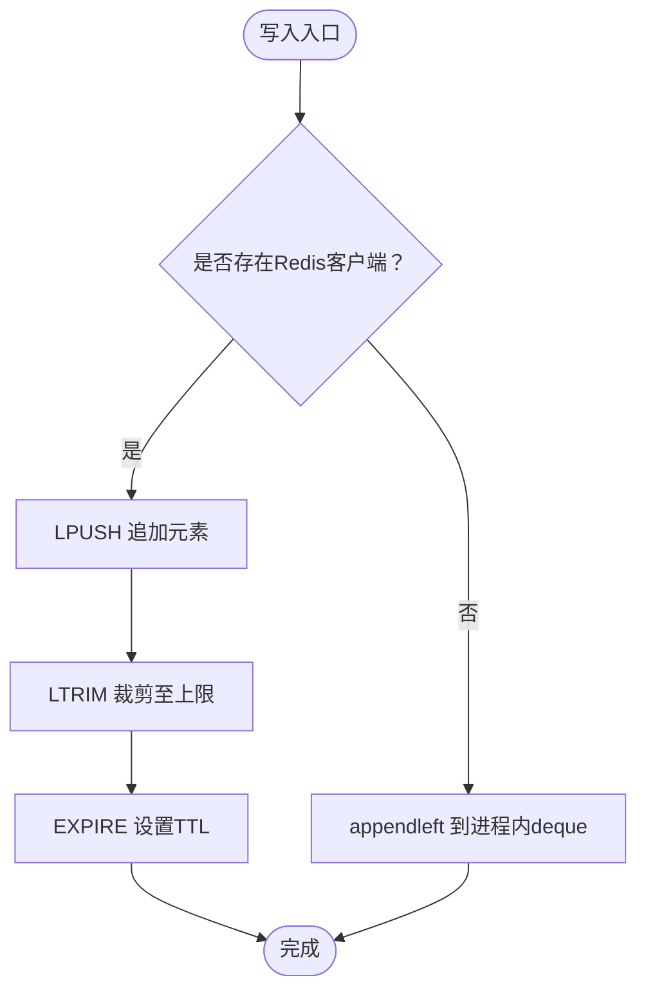
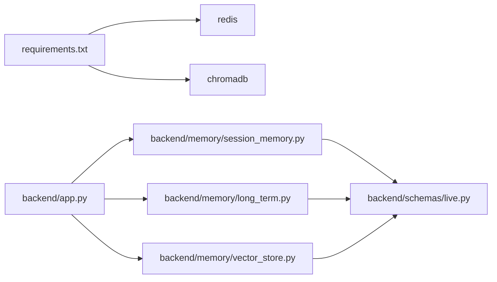

# 短期会话内存

<cite>
**本文引用的文件**
- [session_memory.py](file://backend/memory/session_memory.py)
- [live.py](file://backend/schemas/live.py)
- [app.py](file://backend/app.py)
- [config.py](file://backend/config.py)
- [long_term.py](file://backend/memory/long_term.py)
- [vector_store.py](file://backend/memory/vector_store.py)
- [requirements.txt](file://requirements.txt)
- [README.md](file://README.md)
</cite>

## 目录
1. [简介](#简介)
2. [项目结构](#项目结构)
3. [核心组件](#核心组件)
4. [架构总览](#架构总览)
5. [详细组件分析](#详细组件分析)
6. [依赖关系分析](#依赖关系分析)
7. [性能考量](#性能考量)
8. [故障排查指南](#故障排查指南)
9. [结论](#结论)
10. [附录](#附录)

## 简介
短期会话内存层负责在直播场景中缓存“最近事件”和“建议”，以支撑实时交互与前端展示。其设计采用“Redis优先 + 进程内退化”的双路径策略：
- Redis模式：高性能事件存储，支持集群部署，具备TTL生命周期管理，适合多实例共享。
- 进程内退化：当未安装或未配置Redis时，自动降级为进程内双端队列（deque），保障本地单实例可用性。

同时，短期内存与长期存储、向量检索协同工作，形成“热数据（短期）+ 历史（长期）+ 检索（向量）”的完整记忆体系。

## 项目结构
短期会话内存位于 backend/memory/session_memory.py，配合数据模型 backend/schemas/live.py，被后端应用入口 backend/app.py 初始化并注入到全局服务中。

图表来源
- [app.py:25-29](file://backend/app.py#L25-L29)
- [config.py:54-55](file://backend/config.py#L54-L55)
- [session_memory.py:17-31](file://backend/memory/session_memory.py#L17-L31)
- [live.py:29-95](file://backend/schemas/live.py#L29-L95)

章节来源
- [app.py:25-29](file://backend/app.py#L25-L29)
- [config.py:54-55](file://backend/config.py#L54-L55)
- [session_memory.py:17-31](file://backend/memory/session_memory.py#L17-L31)
- [live.py:29-95](file://backend/schemas/live.py#L29-L95)

## 核心组件
- SessionMemory：短期会话内存的核心类，提供事件与建议的写入、读取、统计与快照能力。
- 数据模型：LiveEvent、Suggestion、SessionStats、SessionSnapshot，用于统一事件与建议的结构化表示。
- 配置：Settings中包含redis_url与session_ttl_seconds，决定是否启用Redis以及TTL时长。
- 应用集成：app.py中初始化SessionMemory并将其注入到事件处理流程。

章节来源
- [session_memory.py:17-113](file://backend/memory/session_memory.py#L17-L113)
- [live.py:29-95](file://backend/schemas/live.py#L29-L95)
- [config.py:54-55](file://backend/config.py#L54-L55)
- [app.py:25-29](file://backend/app.py#L25-L29)

## 架构总览
短期会话内存与后端其他模块的协作关系如下：

图表来源
- [app.py:61-78](file://backend/app.py#L61-L78)
- [session_memory.py:42-84](file://backend/memory/session_memory.py#L42-L84)
- [long_term.py:420-454](file://backend/memory/long_term.py#L420-L454)
- [vector_store.py:64-83](file://backend/memory/vector_store.py#L64-L83)

## 详细组件分析

### SessionMemory 类设计
- 初始化
  - 从配置读取redis_url与session_ttl_seconds。
  - 若存在redis且redis_url非空，则创建Redis客户端；否则仅使用进程内数据结构。
  - 初始化两个默认字典：事件与建议的双端队列，分别设置最大长度为120与40。
- 键命名规范
  - 事件键：room:{room_id}:events
  - 建议键：room:{room_id}:suggestions
- 数据序列化
  - 写入时使用模型的JSON序列化方法；读取时反序列化为对应模型对象。
- 容量限制
  - Redis模式：lpush后立即ltrim裁剪至上限，确保容量恒定。
  - 进程内模式：deque的maxlen自动截断，避免无限增长。
- TTL生命周期
  - Redis模式：每次写入后expire设置TTL；TTL由配置项控制。
  - 进程内模式：无TTL，依赖进程内存生命周期，重启即清空。

图表来源
- [session_memory.py:17-113](file://backend/memory/session_memory.py#L17-L113)
- [live.py:29-95](file://backend/schemas/live.py#L29-L95)

章节来源
- [session_memory.py:17-113](file://backend/memory/session_memory.py#L17-L113)
- [live.py:29-95](file://backend/schemas/live.py#L29-L95)

### Redis优先级存储与进程内退化机制
- Redis模式
  - 写入：LPUSH追加，LTRIM裁剪，EXPIRE设置TTL。
  - 读取：LRANGE按范围拉取，反序列化为模型对象。
  - 优势：多实例共享、持久化、TTL自动清理、可扩展。
- 进程内退化
  - 写入：appendleft到deque，受maxlen限制。
  - 读取：切片返回指定数量。
  - 优势：无需外部依赖，本地快速可用；劣势：单进程内存，重启丢失。

图表来源
- [session_memory.py:42-64](file://backend/memory/session_memory.py#L42-L64)

章节来源
- [session_memory.py:42-64](file://backend/memory/session_memory.py#L42-L64)

### 事件与建议的存储结构
- 键命名
  - 事件：room:{room_id}:events
  - 建议：room:{room_id}:suggestions
- 数据序列化
  - 写入：使用模型的JSON序列化方法。
  - 读取：使用模型的JSON反序列化方法。
- 容量限制
  - 事件：最多120条（Redis裁剪至120，进程内deque maxlen=120）。
  - 建议：最多40条（Redis裁剪至40，进程内deque maxlen=40）。

章节来源
- [session_memory.py:32-40](file://backend/memory/session_memory.py#L32-L40)
- [session_memory.py:46-61](file://backend/memory/session_memory.py#L46-L61)
- [session_memory.py:26-27](file://backend/memory/session_memory.py#L26-L27)

### TTL生命周期管理
- Redis过期策略
  - 每次写入事件或建议后，调用EXPIRE设置TTL。
  - TTL时长由配置项session_ttl_seconds决定。
- 内存清理
  - Redis自动过期清理；进程内deque依赖maxlen，超出容量自动丢弃旧元素。
- 故障与回退
  - Redis不可用时，自动退化为进程内模式，不影响核心流程。

章节来源
- [session_memory.py:49](file://backend/memory/session_memory.py#L49)
- [session_memory.py:61](file://backend/memory/session_memory.py#L61)
- [config.py:55](file://backend/config.py#L55)

### 核心方法使用示例与性能优化建议
- add_event(event)
  - 功能：写入一条最近事件。
  - Redis模式：LPUSH + LTRIM + EXPIRE。
  - 进程内模式：appendleft。
  - 性能建议：批量写入时减少网络往返（Redis模式下可考虑流水线，但当前实现逐条写入）。
- add_suggestion(suggestion)
  - 功能：写入一条最近建议。
  - Redis模式：LPUSH + LTRIM + EXPIRE。
  - 进程内模式：appendleft。
  - 性能建议：建议数量较少（上限40），写入成本低。
- recent_events(room_id, limit)
  - 功能：读取最近事件。
  - Redis模式：LRANGE + 反序列化。
  - 进程内模式：切片返回。
  - 性能建议：limit不宜过大，避免一次性拉取过多数据。
- recent_suggestions(room_id, limit)
  - 功能：读取最近建议。
  - Redis模式：LRANGE + 反序列化。
  - 进程内模式：切片返回。
  - 性能建议：limit不宜过大，避免一次性拉取过多数据。
- stats(room_id)
  - 功能：基于短期事件窗口生成轻量统计。
  - 性能建议：遍历120条以内事件，时间复杂度O(n)，n≤120。
- snapshot(room_id)
  - 功能：构造房间快照，包含最近事件、建议与统计。
  - 性能建议：与stats配合使用，避免重复计算。

章节来源
- [session_memory.py:42-84](file://backend/memory/session_memory.py#L42-L84)
- [session_memory.py:86-112](file://backend/memory/session_memory.py#L86-L112)

### 配置参数说明
- redis_url
  - 作用：启用Redis模式；为空则退化为进程内模式。
  - 来源：Settings.redis_url。
- session_ttl_seconds
  - 作用：Redis模式下短期数据的TTL时长（秒）。
  - 默认值：14400（4小时）。
  - 来源：Settings.session_ttl_seconds。

章节来源
- [config.py:54-55](file://backend/config.py#L54-L55)
- [README.md:200](file://README.md#L200)

### 错误处理策略与故障恢复
- Redis导入失败
  - 行为：捕获ImportError，将redis设为None，自动退化为进程内模式。
- Redis客户端异常
  - 行为：当前实现未显式捕获Redis异常，若Redis不可用或连接失败，将触发异常；可在上层封装中增加重试与降级。
- 进程内模式
  - 行为：无外部依赖，异常时仍可运行；但进程重启后数据清空。
- 建议改进
  - 在SessionMemory中增加Redis异常捕获与降级日志。
  - 对Redis写入/读取操作增加超时与重试策略。

章节来源
- [session_memory.py:11-14](file://backend/memory/session_memory.py#L11-L14)
- [session_memory.py:45-52](file://backend/memory/session_memory.py#L45-L52)
- [session_memory.py:57-64](file://backend/memory/session_memory.py#L57-L64)

## 依赖关系分析
- 外部依赖
  - redis：可选，用于Redis模式。
  - chromadb：可选，用于向量检索。
- 内部依赖
  - pydantic模型：LiveEvent、Suggestion、SessionStats、SessionSnapshot。
  - FastAPI应用：初始化SessionMemory并注入事件处理流程。
  - 长期存储：在短期内存无数据时，从长期存储补充快照。
  - 向量检索：为建议生成提供相似历史检索能力。

图表来源
- [requirements.txt:1-6](file://requirements.txt#L1-L6)
- [app.py:13-29](file://backend/app.py#L13-L29)
- [session_memory.py:9](file://backend/memory/session_memory.py#L9)
- [long_term.py:8](file://backend/memory/long_term.py#L8)
- [vector_store.py:11](file://backend/memory/vector_store.py#L11)

章节来源
- [requirements.txt:1-6](file://requirements.txt#L1-L6)
- [app.py:13-29](file://backend/app.py#L13-L29)
- [session_memory.py:9](file://backend/memory/session_memory.py#L9)
- [long_term.py:8](file://backend/memory/long_term.py#L8)
- [vector_store.py:11](file://backend/memory/vector_store.py#L11)

## 性能考量
- Redis模式
  - 写入：LPUSH + LTRIM + EXPIRE，均为O(1)或O(k)（k为新增元素数），整体高效。
  - 读取：LRANGE O(k)，k为limit大小；建议limit合理设置。
  - TTL：自动过期，避免内存膨胀。
- 进程内模式
  - 写入：appendleft + maxlen裁剪，O(1)。
  - 读取：切片，O(k)。
  - 适用场景：单实例、低并发、无需跨实例共享。
- 并发与一致性
  - Redis模式下，同一房间的事件与建议写入为独立列表，互不干扰。
  - 若需要强一致，可在上层增加锁或使用Redis事务（当前实现未使用事务）。
- 优化建议
  - 写入批量化：合并多次写入，减少网络往返。
  - 读取分页：对limit进行分段拉取，避免一次性拉取过多。
  - 缓存热点：对频繁访问的房间数据进行本地缓存（如需要）。

[本节为通用性能讨论，不直接分析具体文件]

## 故障排查指南
- 无法连接Redis
  - 现象：Redis导入失败或连接异常。
  - 处理：检查redis_url配置；确认Redis服务可达；若不可用，系统将自动退化为进程内模式。
- 数据未过期
  - 现象：Redis中短期数据未按预期清理。
  - 处理：确认session_ttl_seconds配置正确；检查EXPIRE是否成功执行。
- 进程重启后数据丢失
  - 现象：进程内模式下重启后短期数据清空。
  - 处理：启用Redis模式；或接受进程内模式的临时性。
- 建议生成与推送
  - 现象：前端未收到建议。
  - 处理：确认事件处理流程中调用了add_suggestion与发布逻辑；检查EventBroker订阅与推送。

章节来源
- [session_memory.py:11-14](file://backend/memory/session_memory.py#L11-L14)
- [session_memory.py:49](file://backend/memory/session_memory.py#L49)
- [session_memory.py:61](file://backend/memory/session_memory.py#L61)
- [app.py:61-78](file://backend/app.py#L61-L78)

## 结论
短期会话内存层通过“Redis优先 + 进程内退化”的设计，在保证高性能与可扩展性的同时，确保了在无Redis环境下的可用性。其清晰的键命名、JSON序列化与容量限制策略，使得事件与建议的存储与读取高效稳定。结合长期存储与向量检索，形成了完整的直播场景记忆体系。建议在生产环境中启用Redis并合理设置TTL，以获得最佳的性能与可靠性。

[本节为总结性内容，不直接分析具体文件]

## 附录
- 关键实现路径
  - [SessionMemory.__init__:18-31](file://backend/memory/session_memory.py#L18-L31)
  - [SessionMemory.add_event:42-52](file://backend/memory/session_memory.py#L42-L52)
  - [SessionMemory.add_suggestion:54-64](file://backend/memory/session_memory.py#L54-L64)
  - [SessionMemory.recent_events:66-73](file://backend/memory/session_memory.py#L66-L73)
  - [SessionMemory.recent_suggestions:75-84](file://backend/memory/session_memory.py#L75-L84)
  - [SessionMemory.stats:86-102](file://backend/memory/session_memory.py#L86-L102)
  - [SessionMemory.snapshot:104-112](file://backend/memory/session_memory.py#L104-L112)
  - [Settings.redis_url / session_ttl_seconds:54-55](file://backend/config.py#L54-L55)
  - [README中配置说明](file://README.md#L200)