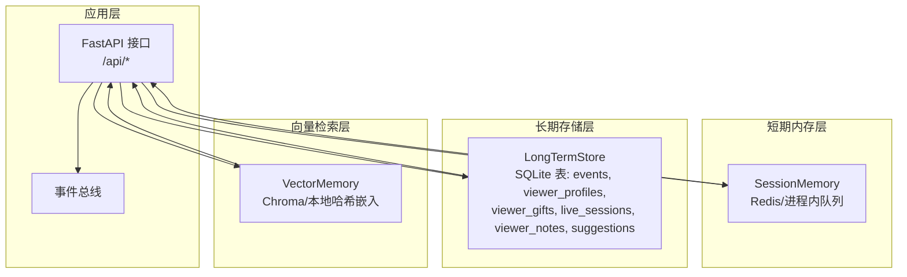
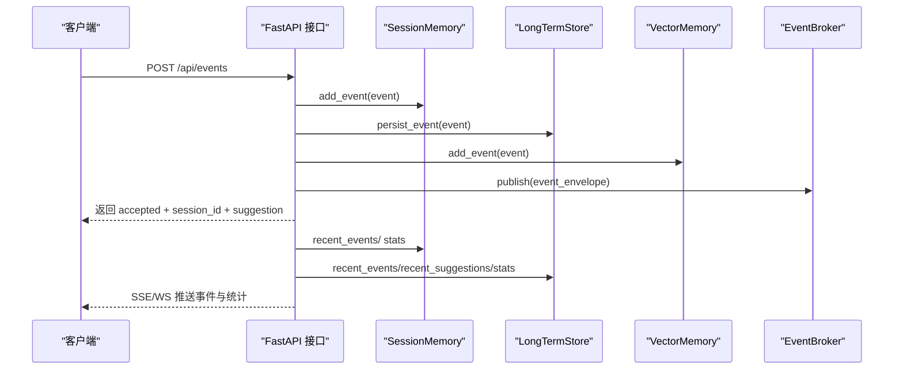
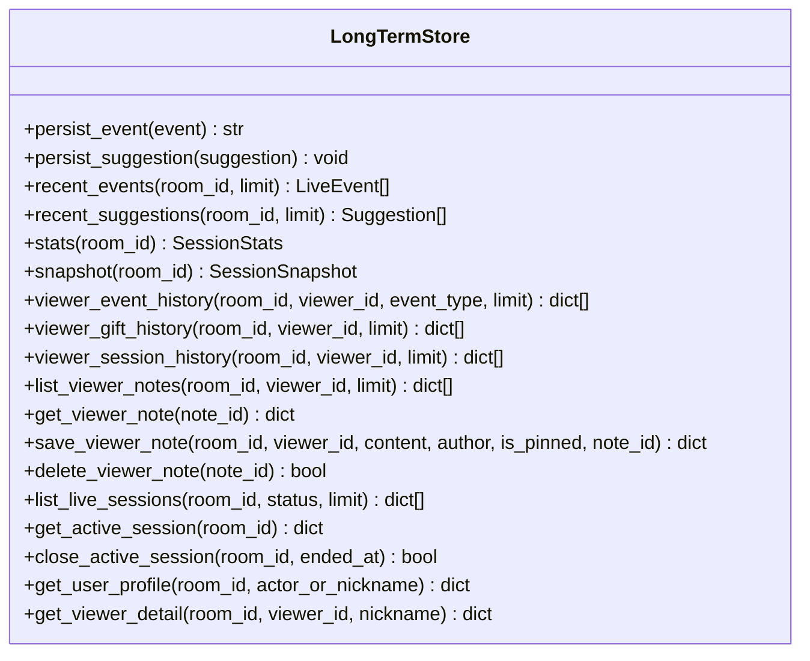
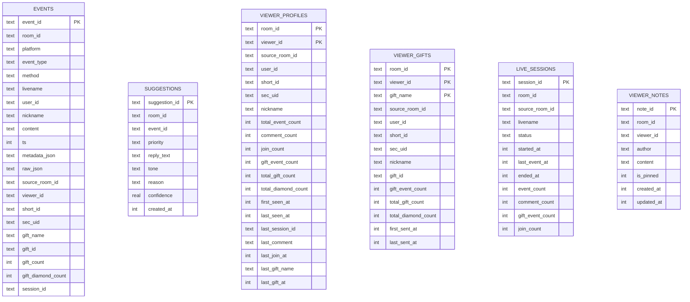
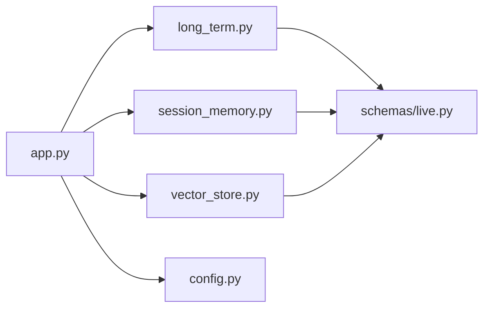

# 长期历史存储

<cite>
**本文引用的文件**
- [backend/memory/long_term.py](file://backend/memory/long_term.py)
- [backend/config.py](file://backend/config.py)
- [data/DATABASE.md](file://data/DATABASE.md)
- [backend/app.py](file://backend/app.py)
- [backend/schemas/live.py](file://backend/schemas/live.py)
- [backend/memory/session_memory.py](file://backend/memory/session_memory.py)
- [backend/memory/vector_store.py](file://backend/memory/vector_store.py)
</cite>

## 目录
1. [简介](#简介)
2. [项目结构](#项目结构)
3. [核心组件](#核心组件)
4. [架构总览](#架构总览)
5. [详细组件分析](#详细组件分析)
6. [依赖关系分析](#依赖关系分析)
7. [性能考量](#性能考量)
8. [故障排查指南](#故障排查指南)
9. [结论](#结论)
10. [附录](#附录)

## 简介
本文件为长期历史存储层的技术文档，聚焦于以 SQLite 为核心的历史事件持久化、历史数据分析与用户画像构建、数据生命周期管理（保留策略、自动清理与空间优化）、以及与短期内存层的数据同步与一致性保障。文档同时提供数据库表结构、索引策略、关系约束、常用查询与接口使用示例，并给出配置参数、性能调优建议与数据迁移方案。

## 项目结构
长期历史存储位于后端模块中，采用“短期内存 + 长期 SQLite + 向量检索”的分层架构：
- 短期内存层：基于 Redis 或进程内队列，缓存最近事件与建议，用于实时交互与统计。
- 长期存储层：基于 SQLite 的事件表、建议表、用户画像表、礼物聚合表、直播会话表与观众备注表。
- 向量检索层：基于 Chroma 或本地哈希嵌入，提供历史相似文本检索能力。
- 应用入口：FastAPI 提供事件注入、会话查询、观众详情、SSE/WS 实时流等接口。

图表来源
- [backend/app.py:1-220](file://backend/app.py#L1-L220)
- [backend/memory/long_term.py:36-750](file://backend/memory/long_term.py#L36-L750)
- [backend/memory/session_memory.py:17-113](file://backend/memory/session_memory.py#L17-L113)
- [backend/memory/vector_store.py:52-108](file://backend/memory/vector_store.py#L52-L108)

章节来源
- [backend/app.py:1-220](file://backend/app.py#L1-L220)
- [backend/memory/long_term.py:36-750](file://backend/memory/long_term.py#L36-L750)
- [backend/memory/session_memory.py:17-113](file://backend/memory/session_memory.py#L17-L113)
- [backend/memory/vector_store.py:52-108](file://backend/memory/vector_store.py#L52-L108)

## 核心组件
- 长期存储类 LongTermStore：负责 SQLite 初始化、表结构演进、事件持久化、会话管理、用户画像与礼物聚合更新、常用查询接口。
- 配置模块 Settings：集中管理数据库路径、Redis、会话 TTL、LLM 参数等。
- 数据库说明文档 DATABASE.md：描述表结构、字段含义与常用查询。
- 应用入口 app.py：集成短期内存、长期存储、向量检索与事件总线，提供 REST 接口与 SSE/WS 流。
- 数据模型 schemas/live.py：定义事件、建议、统计、快照与状态等数据结构。
- 短期内存层 SessionMemory：提供 Redis 或进程内队列的热数据缓存与统计。
- 向量检索层 VectorMemory：提供 Chroma 或本地哈希嵌入的相似文本检索。

章节来源
- [backend/memory/long_term.py:36-750](file://backend/memory/long_term.py#L36-L750)
- [backend/config.py:39-94](file://backend/config.py#L39-L94)
- [data/DATABASE.md:1-151](file://data/DATABASE.md#L1-L151)
- [backend/app.py:1-220](file://backend/app.py#L1-L220)
- [backend/schemas/live.py:1-95](file://backend/schemas/live.py#L1-L95)
- [backend/memory/session_memory.py:17-113](file://backend/memory/session_memory.py#L17-L113)
- [backend/memory/vector_store.py:52-108](file://backend/memory/vector_store.py#L52-L108)

## 架构总览
长期历史存储通过事件处理流程与短期内存层协同工作：
- 事件注入：前端或采集器将 LiveEvent 发送到后端。
- 短期内存：SessionMemory 写入最近事件与建议，生成轻量统计。
- 长期存储：LongTermStore 持久化事件、维护会话、更新用户画像与礼物聚合。
- 向量检索：VectorMemory 将可检索内容写入索引，支持相似历史检索。
- 实时推送：EventBroker 将事件与建议推送到 SSE/WS 客户端。

图表来源
- [backend/app.py:61-78](file://backend/app.py#L61-L78)
- [backend/memory/long_term.py:420-454](file://backend/memory/long_term.py#L420-L454)
- [backend/memory/session_memory.py:42-102](file://backend/memory/session_memory.py#L42-L102)
- [backend/memory/vector_store.py:64-83](file://backend/memory/vector_store.py#L64-L83)

## 详细组件分析

### 长期存储类 LongTermStore
- 初始化与表结构演进
  - 创建 events、suggestions、viewer_profiles、viewer_gifts、live_sessions、viewer_notes 表。
  - 动态添加缺失列（如 session_id、viewer_id、gift_* 字段），并回填历史数据。
  - 创建多处复合索引以优化常见查询。
- 事件持久化
  - 生成事件记录，提取礼物字段，确保 viewer_id 来自 user.identity。
  - 若事件已存在且已有 session_id，则复用；否则创建或复用活动会话。
  - 插入事件并根据是否已存在决定是否重建聚合。
- 会话管理
  - 自动创建活动会话，更新会话统计（事件数、评论数、礼物数、入房数）。
  - 结束活动会话，设置状态为 ended 并更新时间戳。
- 用户画像与礼物聚合
  - viewer_profiles 按房间+观众聚合事件总数、评论数、入房数、礼物事件数、累计礼物数与钻石数、首次/最后出现时间、最近会话与最近行为。
  - viewer_gifts 按房间+观众+礼物名称聚合礼物事件数、累计数量与钻石数、首次/最后送礼时间。
- 查询接口
  - 最近事件、最近建议、统计、房间快照。
  - 观众事件历史、礼物历史、会话历史、备注列表与详情。
  - 列出直播会话、获取当前活动会话。
  - 获取用户画像与观众详情（含最近评论、入房、礼物事件、礼物历史、最近会话、备注）。

图表来源
- [backend/memory/long_term.py:36-750](file://backend/memory/long_term.py#L36-L750)

章节来源
- [backend/memory/long_term.py:50-195](file://backend/memory/long_term.py#L50-L195)
- [backend/memory/long_term.py:216-275](file://backend/memory/long_term.py#L216-L275)
- [backend/memory/long_term.py:276-324](file://backend/memory/long_term.py#L276-L324)
- [backend/memory/long_term.py:326-402](file://backend/memory/long_term.py#L326-L402)
- [backend/memory/long_term.py:420-454](file://backend/memory/long_term.py#L420-L454)
- [backend/memory/long_term.py:467-749](file://backend/memory/long_term.py#L467-L749)

### 数据库表结构与关系
- events：事件流水表，包含事件主键、房间号、平台、事件类型、方法、直播名、用户身份字段、内容、时间戳、JSON 元数据与原始消息，以及新增的 session_id、viewer_id、礼物字段等。
- suggestions：建议表，包含建议主键、房间号、事件主键、优先级、回复文本、语调、理由、置信度、创建时间。
- viewer_profiles：按房间+观众聚合的用户画像表，包含累计事件数、评论数、入房数、礼物事件数、累计礼物数、累计钻石数、首次/最后出现时间、最近会话、最近行为等。
- viewer_gifts：按房间+观众+礼物名称聚合的礼物历史表，包含礼物事件数、累计数量、累计钻石数、首次/最后送礼时间。
- live_sessions：直播会话表，包含会话主键、房间号、源房间号、直播名、状态（active/ended）、开始/最后事件/结束时间、各类事件计数。
- viewer_notes：观众备注表，包含备注主键、房间号、观众主键、作者、内容、是否置顶、创建/更新时间。

图表来源
- [backend/memory/long_term.py:54-147](file://backend/memory/long_term.py#L54-L147)
- [data/DATABASE.md:16-151](file://data/DATABASE.md#L16-L151)

章节来源
- [backend/memory/long_term.py:54-147](file://backend/memory/long_term.py#L54-L147)
- [data/DATABASE.md:16-151](file://data/DATABASE.md#L16-L151)

### 索引策略与关系约束
- events 表索引
  - idx_events_room_ts：按房间+时间倒序，加速最近事件查询。
  - idx_events_room_viewer_ts：按房间+观众+时间倒序，加速观众事件历史。
  - idx_events_room_event_type_ts：按房间+事件类型+时间倒序，加速分类统计。
  - idx_events_session_id：按会话索引，加速会话维度统计。
- viewer_profiles 表索引
  - idx_viewer_profiles_room_nickname：按房间+昵称索引，加速昵称查找。
- viewer_gifts 表索引
  - idx_viewer_gifts_room_viewer_last_sent：按房间+观众+最后送礼时间倒序，加速礼物历史。
- live_sessions 表索引
  - idx_live_sessions_room_status_last_event：按房间+状态+最后事件时间倒序，加速活动会话查询。
- viewer_notes 表索引
  - idx_viewer_notes_room_viewer_updated：按房间+观众+更新时间倒序，加速备注列表。
- 主键与外键
  - events.event_id 主键；viewer_profiles、viewer_gifts 复合主键；live_sessions.session_id 主键；viewer_notes.note_id 主键。
  - viewer_profiles 与 events 通过 viewer_id 关联；viewer_gifts 与 events 通过 viewer_id/gift_name 关联；live_sessions 与 events 通过 session_id 关联。

章节来源
- [backend/memory/long_term.py:183-195](file://backend/memory/long_term.py#L183-L195)
- [backend/memory/long_term.py:54-147](file://backend/memory/long_term.py#L54-L147)

### 数据生命周期管理
- 事件写入与会话管理
  - 新事件写入时若无 session_id，则创建或复用活动会话；活动会话在事件写入时更新统计与时间戳。
  - 切换房间或服务关闭时，主动结束当前活动会话。
- 用户画像与礼物聚合
  - 首次写入事件时插入 viewer_profiles 与 viewer_gifts；后续事件通过 UPSERT 更新聚合字段。
  - 历史重建：当事件重复写入时，删除现有聚合并按时间顺序重算，确保聚合正确性。
- 空间优化与清理
  - 未内置自动清理策略；可通过定期维护任务执行 VACUUM、分析统计、删除过期会话或归档旧数据。
  - 建议结合业务需求制定保留策略（如 N 天/月），并在低峰期执行归档与清理。

章节来源
- [backend/memory/long_term.py:276-324](file://backend/memory/long_term.py#L276-L324)
- [backend/memory/long_term.py:404-452](file://backend/memory/long_term.py#L404-L452)
- [backend/app.py:84-92](file://backend/app.py#L84-L92)

### 数据库操作接口与使用示例
- 事件注入与建议生成
  - POST /api/events：注入事件，返回 accepted、event_id、session_id 与 suggestion（若有）。
- 房间切换
  - POST /api/room：切换房间，结束当前活动会话并切换采集器房间。
- 快照与统计
  - GET /api/bootstrap：返回房间快照（最近事件、最近建议、统计、模型状态）。
- 观众详情
  - GET /api/viewer：返回观众详情（含最近评论、入房、礼物事件、礼物历史、最近会话、备注）。
  - GET /api/viewer/notes：列出观众备注。
  - POST /api/viewer/notes：保存或更新观众备注。
  - DELETE /api/viewer/notes/{note_id}：删除备注。
- 会话查询
  - GET /api/sessions：列出直播会话（可按房间/状态过滤）。
  - GET /api/sessions/current：获取当前活动会话。
- 实时流
  - GET /api/events/stream：SSE 事件流。
  - WS /ws/live：WebSocket 实时推送。

章节来源
- [backend/app.py:109-220](file://backend/app.py#L109-L220)
- [backend/memory/long_term.py:467-749](file://backend/memory/long_term.py#L467-L749)

### 与短期内存的数据同步与一致性
- 同步机制
  - 事件处理流程中，先写入短期内存，再写入长期存储，最后通过事件总线推送。
  - 快照逻辑：若短期内存为空，则回退到长期存储的最近事件与统计。
- 一致性保障
  - session_id 在事件持久化时确保一致；若事件已存在则重建聚合，避免统计不一致。
  - 活动会话在写入时更新，结束时统一标记为 ended，避免跨会话统计混淆。

章节来源
- [backend/app.py:49-78](file://backend/app.py#L49-L78)
- [backend/memory/long_term.py:420-454](file://backend/memory/long_term.py#L420-L454)

## 依赖关系分析
- 组件耦合
  - app.py 依赖 LongTermStore、SessionMemory、VectorMemory、EventBroker 与 Settings。
  - LongTermStore 依赖 LiveEvent/Suggestion 等数据模型。
  - SessionMemory 依赖 Redis（可选）。
  - VectorMemory 依赖 Chroma（可选）。
- 外部依赖
  - SQLite：本地数据库，无需额外服务。
  - Redis：可选，用于短期内存缓存与 TTL 控制。
  - Chroma：可选，用于向量检索。

图表来源
- [backend/app.py:13-29](file://backend/app.py#L13-L29)
- [backend/memory/long_term.py:8](file://backend/memory/long_term.py#L8)
- [backend/memory/session_memory.py:9](file://backend/memory/session_memory.py#L9)
- [backend/memory/vector_store.py:11](file://backend/memory/vector_store.py#L11)
- [backend/config.py:13](file://backend/config.py#L13)

章节来源
- [backend/app.py:13-29](file://backend/app.py#L13-L29)
- [backend/memory/long_term.py:8](file://backend/memory/long_term.py#L8)
- [backend/memory/session_memory.py:9](file://backend/memory/session_memory.py#L9)
- [backend/memory/vector_store.py:11](file://backend/memory/vector_store.py#L11)
- [backend/config.py:13](file://backend/config.py#L13)

## 性能考量
- 索引优化
  - 已建立多处复合索引，覆盖常见查询模式（房间+时间、房间+观众+时间、房间+事件类型+时间、会话索引等）。
  - 建议定期分析表统计（ANALYZE）以帮助查询优化器选择最佳索引。
- 写入路径
  - 事件写入采用 INSERT OR REPLACE + UPSERT 聚合，避免重复写入导致的重复统计。
  - 会话更新使用批量更新，减少多次往返。
- 读取路径
  - 最近事件与统计优先从短期内存读取，降低数据库压力。
  - 长期存储查询限制 limit，避免全表扫描。
- 存储空间
  - 未内置自动清理；建议定期执行 VACUUM 与归档旧数据，控制文件大小增长。
- 配置参数
  - 数据库路径、Redis 地址与 TTL、会话统计窗口等通过配置集中管理。

章节来源
- [backend/memory/long_term.py:183-195](file://backend/memory/long_term.py#L183-L195)
- [backend/config.py:51-69](file://backend/config.py#L51-L69)

## 故障排查指南
- 数据库连接与权限
  - 确认数据库文件路径存在且可写；检查 SQLite 版本与权限。
- 表结构异常
  - 若缺少列（如 session_id、viewer_id、gift_*），LongTermStore 会自动添加并回填数据。
- 聚合不一致
  - 若重复写入事件，触发重建聚合流程；检查 ts 与 event_id 是否正确。
- Redis/Chroma 不可用
  - 短期内存与向量检索会自动降级为进程内队列与本地哈希嵌入，不影响核心功能。
- 实时流异常
  - 检查 EventBroker 订阅/发布链路与客户端连接状态。

章节来源
- [backend/memory/long_term.py:155-182](file://backend/memory/long_term.py#L155-L182)
- [backend/memory/long_term.py:404-452](file://backend/memory/long_term.py#L404-L452)
- [backend/memory/session_memory.py:11-14](file://backend/memory/session_memory.py#L11-L14)
- [backend/memory/vector_store.py:13-16](file://backend/memory/vector_store.py#L13-L16)

## 结论
长期历史存储层以 SQLite 为核心，结合短期内存与向量检索，实现了事件持久化、用户画像与礼物聚合、直播会话管理与实时推送的完整闭环。通过合理的索引策略与写入路径，满足了高并发场景下的实时性与稳定性。建议结合业务需求制定数据保留与归档策略，并在低峰期执行维护任务以优化存储与查询性能。

## 附录

### 数据库配置参数
- 数据库路径：由配置项 DATABASE_PATH 指定，默认 data/live_prompter.db。
- 数据目录：由 DATA_DIR 指定，默认 data。
- Redis 地址：由 REDIS_URL 指定，用于短期内存缓存。
- 会话 TTL：由 SESSION_TTL_SECONDS 指定，控制短期内存数据生命周期。

章节来源
- [backend/config.py:51-69](file://backend/config.py#L51-L69)

### 性能调优建议
- 定期执行 ANALYZE 与 VACUUM，保持统计与空间效率。
- 根据查询模式调整索引，必要时增加覆盖索引。
- 控制短期内存窗口大小与 TTL，平衡实时性与内存占用。
- 对高频查询结果进行缓存（如用户画像快照）。

章节来源
- [backend/memory/long_term.py:183-195](file://backend/memory/long_term.py#L183-L195)
- [backend/memory/session_memory.py:18-31](file://backend/memory/session_memory.py#L18-L31)

### 数据迁移方案
- 结构迁移
  - 使用 ALTER TABLE 添加缺失列，随后执行回填脚本，确保历史数据完整性。
- 数据迁移
  - 导出 events 与 viewer_profiles 等表，按业务需求裁剪或转换后导入新库。
  - 归档旧数据至独立库或压缩存储，释放主库空间。
- 一致性校验
  - 迁移后对关键统计（如总事件数、用户画像聚合）进行抽样核对。

章节来源
- [backend/memory/long_term.py:155-182](file://backend/memory/long_term.py#L155-L182)
- [backend/memory/long_term.py:245-275](file://backend/memory/long_term.py#L245-L275)