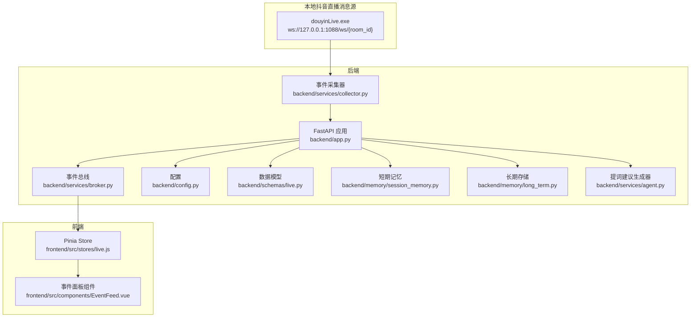
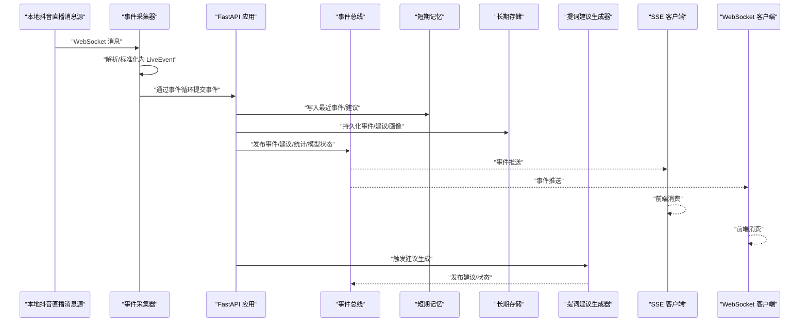
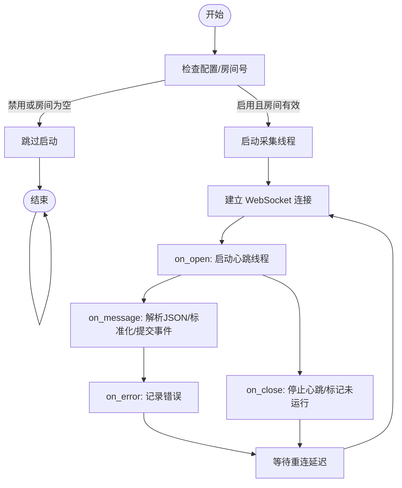
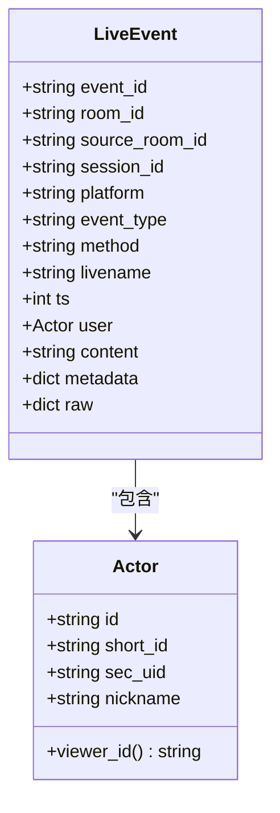
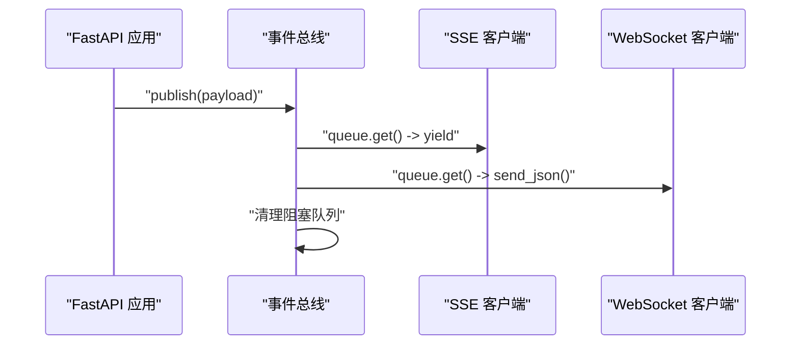
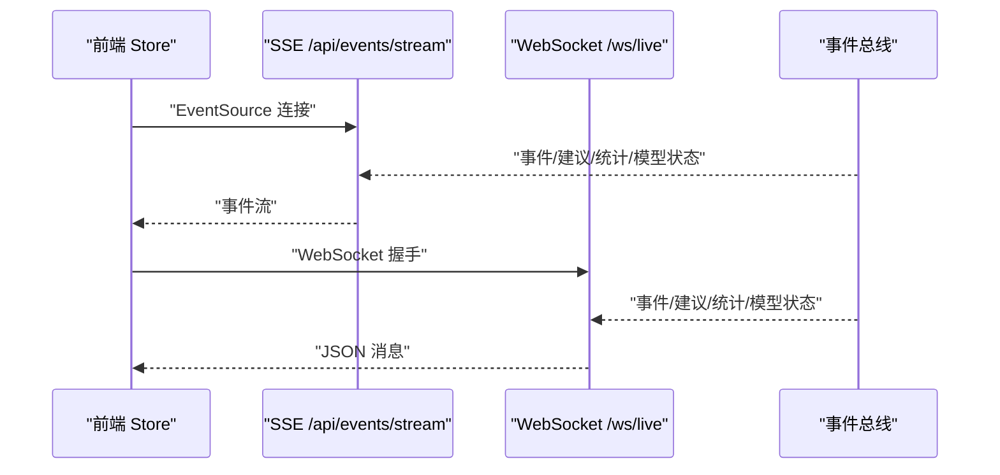
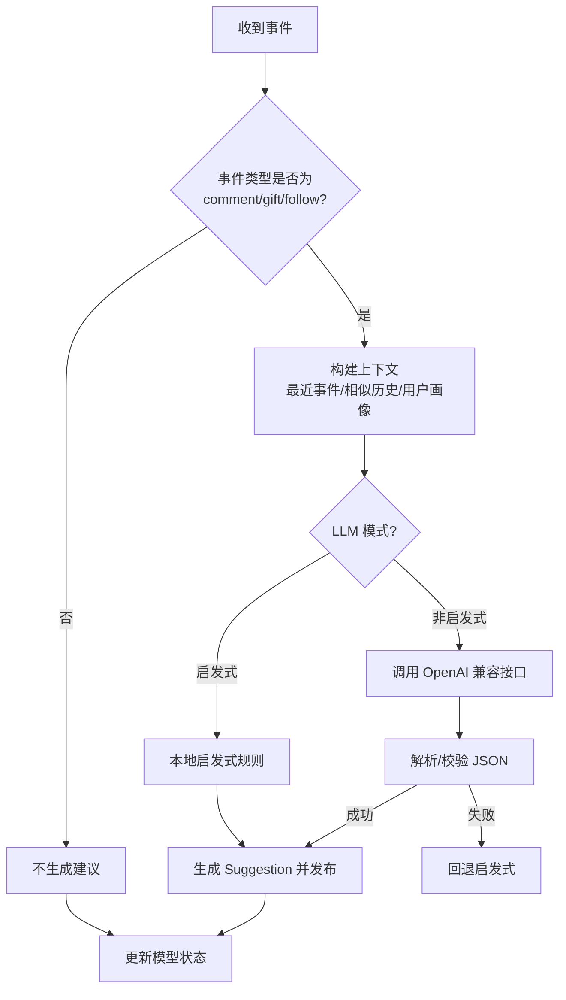
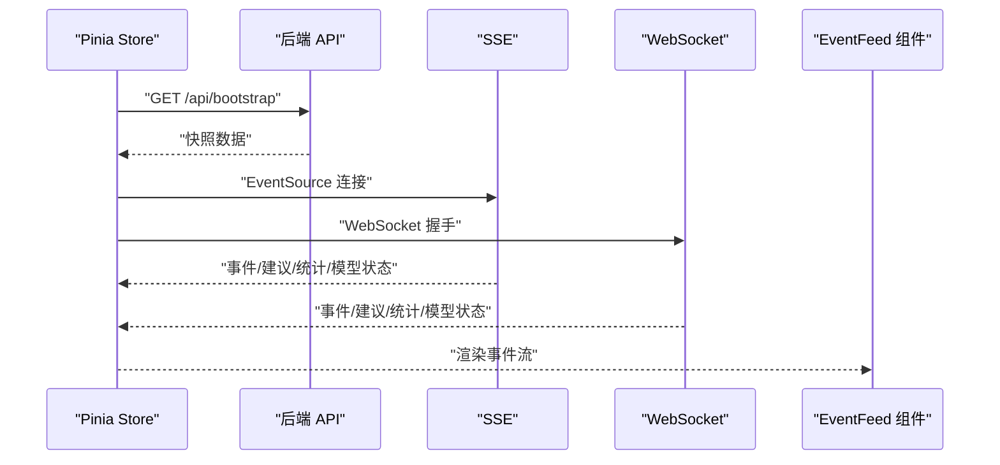
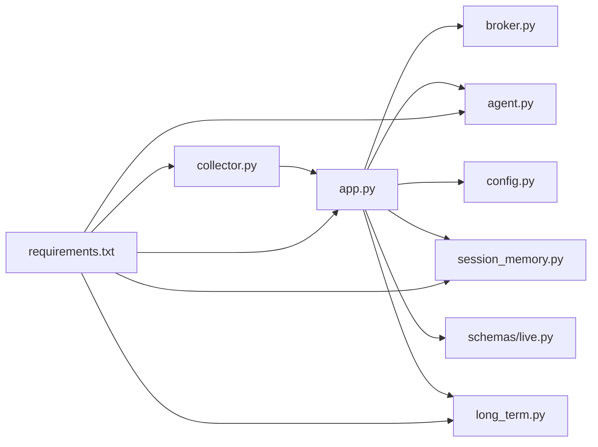

# 实时事件处理

<cite>
**本文引用的文件**
- [backend/app.py](file://backend/app.py)
- [backend/services/collector.py](file://backend/services/collector.py)
- [backend/services/broker.py](file://backend/services/broker.py)
- [backend/schemas/live.py](file://backend/schemas/live.py)
- [backend/config.py](file://backend/config.py)
- [backend/memory/session_memory.py](file://backend/memory/session_memory.py)
- [backend/memory/long_term.py](file://backend/memory/long_term.py)
- [backend/services/agent.py](file://backend/services/agent.py)
- [frontend/src/stores/live.js](file://frontend/src/stores/live.js)
- [frontend/src/components/EventFeed.vue](file://frontend/src/components/EventFeed.vue)
- [requirements.txt](file://requirements.txt)
- [tool/config.yaml](file://tool/config.yaml)
- [README.md](file://README.md)
</cite>

## 目录
1. [简介](#简介)
2. [项目结构](#项目结构)
3. [核心组件](#核心组件)
4. [架构总览](#架构总览)
5. [详细组件分析](#详细组件分析)
6. [依赖关系分析](#依赖关系分析)
7. [性能考量](#性能考量)
8. [故障排查指南](#故障排查指南)
9. [结论](#结论)
10. [附录](#附录)

## 简介
本技术文档围绕抖音直播实时事件处理功能，系统性阐述从本地抖音直播 WebSocket 消息源到后端事件采集、标准化与分发的完整链路。重点包括：
- 事件采集器的工作原理：WebSocket 连接管理、消息解析、错误重连机制
- 事件标准化过程：将不同类型的直播事件统一转换为 LiveEvent
- 事件发布订阅系统：事件分发、过滤与路由机制
- SSE 与 WebSocket 两种实时推送方式的技术差异与使用场景
- 配置参数与扩展点，帮助开发者快速理解与二次开发

## 项目结构
后端采用 FastAPI 提供 REST、SSE、WebSocket 接口；前端使用 Vue 3 + Pinia + Tailwind 实现实时展示与交互。采集器负责连接本地抖音直播 WebSocket，将原始消息标准化后进入事件处理流水线。

图表来源
- [backend/app.py:94-220](file://backend/app.py#L94-L220)
- [backend/services/collector.py:38-284](file://backend/services/collector.py#L38-L284)
- [backend/services/broker.py:10-40](file://backend/services/broker.py#L10-L40)
- [backend/config.py:39-94](file://backend/config.py#L39-L94)
- [backend/schemas/live.py:8-95](file://backend/schemas/live.py#L8-L95)
- [backend/memory/session_memory.py:17-113](file://backend/memory/session_memory.py#L17-L113)
- [backend/memory/long_term.py:36-750](file://backend/memory/long_term.py#L36-L750)
- [backend/services/agent.py:23-393](file://backend/services/agent.py#L23-L393)
- [frontend/src/stores/live.js:70-310](file://frontend/src/stores/live.js#L70-L310)
- [frontend/src/components/EventFeed.vue:1-183](file://frontend/src/components/EventFeed.vue#L1-L183)

章节来源
- [README.md:21-349](file://README.md#L21-L349)
- [backend/app.py:94-220](file://backend/app.py#L94-L220)

## 核心组件
- 事件采集器（DouyinCollector）：连接本地抖音直播 WebSocket，解析消息为 LiveEvent，并通过事件循环安全提交到后端处理流程。
- 事件总线（EventBroker）：进程内广播器，负责将事件分发给 SSE 与 WebSocket 订阅者。
- 数据模型（LiveEvent、Actor、Suggestion、SessionStats、ModelStatus）：统一事件与状态结构，确保跨模块一致性。
- 配置（Settings）：集中管理运行参数，如房间号、采集器连接参数、LLM 模式与凭据等。
- 短期记忆（SessionMemory）：优先使用 Redis 缓存最近事件与建议，否则退化为进程内内存。
- 长期存储（LongTermStore）：基于 SQLite 的持久化存储，维护事件、建议、用户画像、会话与索引。
- 提词建议生成器（LivePromptAgent）：结合最近事件、相似历史与用户画像，优先调用 OpenAI 兼容模型，失败时回退启发式规则。
- 前端 Store（Pinia）：负责连接 SSE/WS、接收事件、维护状态与过滤器，并驱动 UI 组件渲染。

章节来源
- [backend/services/collector.py:38-284](file://backend/services/collector.py#L38-L284)
- [backend/services/broker.py:10-40](file://backend/services/broker.py#L10-L40)
- [backend/schemas/live.py:8-95](file://backend/schemas/live.py#L8-L95)
- [backend/config.py:39-94](file://backend/config.py#L39-L94)
- [backend/memory/session_memory.py:17-113](file://backend/memory/session_memory.py#L17-L113)
- [backend/memory/long_term.py:36-750](file://backend/memory/long_term.py#L36-L750)
- [backend/services/agent.py:23-393](file://backend/services/agent.py#L23-L393)
- [frontend/src/stores/live.js:70-310](file://frontend/src/stores/live.js#L70-L310)

## 架构总览
系统以 FastAPI 为核心，串联采集、标准化、存储、检索与建议生成，并通过 SSE/WS 向前端推送。采集器与应用生命周期绑定，在应用启动时开启采集，在关闭时停止并清理资源。

图表来源
- [backend/app.py:61-78](file://backend/app.py#L61-L78)
- [backend/services/collector.py:145-160](file://backend/services/collector.py#L145-L160)
- [backend/services/broker.py:28-40](file://backend/services/broker.py#L28-L40)
- [backend/memory/session_memory.py:42-64](file://backend/memory/session_memory.py#L42-L64)
- [backend/memory/long_term.py:420-454](file://backend/memory/long_term.py#L420-L454)
- [backend/services/agent.py:73-94](file://backend/services/agent.py#L73-L94)

## 详细组件分析

### 事件采集器（DouyinCollector）
- WebSocket 连接管理
  - 动态拼接 ws://host:port/ws/{room_id}
  - on_open/on_message/on_error/on_close 生命周期回调
  - 心跳发送：定时发送 ping，避免连接被中间设备断开
  - 自动重连：断开后按配置延迟重试
- 消息解析与标准化
  - 解析 JSON，忽略非 JSON
  - 根据 method 映射事件类型（评论、礼物、点赞、成员、关注、系统）
  - 提取用户信息、礼物数量与钻石数、元数据等
  - 构造 LiveEvent 并通过事件循环提交
- 错误处理与日志
  - 捕获异常并记录警告
  - 停止时优雅关闭连接并等待线程退出

图表来源
- [backend/services/collector.py:61-139](file://backend/services/collector.py#L61-L139)
- [backend/services/collector.py:140-181](file://backend/services/collector.py#L140-L181)
- [backend/services/collector.py:182-199](file://backend/services/collector.py#L182-L199)
- [backend/services/collector.py:225-284](file://backend/services/collector.py#L225-L284)

章节来源
- [backend/services/collector.py:38-284](file://backend/services/collector.py#L38-L284)

### 事件标准化（LiveEvent）
- 统一字段：event_id、room_id、platform、event_type、method、livename、ts、user、content、metadata、raw
- 用户标识：Actor 提供多种唯一标识组合（id/sec_uid/short_id/nickname），便于跨系统关联
- 元数据丰富：礼物名称/ID、数量、钻石数、动作类型等
- 与采集器映射：method 与事件类型映射表确保后续处理一致性

图表来源
- [backend/schemas/live.py:8-44](file://backend/schemas/live.py#L8-L44)

章节来源
- [backend/schemas/live.py:8-44](file://backend/schemas/live.py#L8-L44)

### 事件发布订阅（EventBroker）
- 订阅/取消订阅：每个订阅者拥有独立 asyncio.Queue
- 发布：广播到所有订阅者，丢弃阻塞队列（stale）以保持系统健康
- 与 SSE/WS 集成：SSE 使用队列阻塞读取，WS 直接发送 JSON

图表来源
- [backend/services/broker.py:16-40](file://backend/services/broker.py#L16-L40)
- [backend/app.py:187-206](file://backend/app.py#L187-L206)
- [backend/app.py:209-220](file://backend/app.py#L209-L220)

章节来源
- [backend/services/broker.py:10-40](file://backend/services/broker.py#L10-L40)
- [backend/app.py:187-220](file://backend/app.py#L187-L220)

### SSE 与 WebSocket 实时推送
- SSE（Server-Sent Events）
  - 服务器持续推送事件，客户端 EventSource 自动重连
  - 支持按房间过滤，仅转发匹配房间的消息
  - 适合前端侧事件流消费与自动重连
- WebSocket
  - 一次性握手后双向通信，先下发 bootstrap 快照
  - 适合需要双向交互或更灵活协议的场景

图表来源
- [backend/app.py:187-206](file://backend/app.py#L187-L206)
- [backend/app.py:209-220](file://backend/app.py#L209-L220)
- [frontend/src/stores/live.js:173-205](file://frontend/src/stores/live.js#L173-L205)

章节来源
- [backend/app.py:187-220](file://backend/app.py#L187-L220)
- [frontend/src/stores/live.js:173-205](file://frontend/src/stores/live.js#L173-L205)

### 提词建议生成（LivePromptAgent）
- 上下文构建：最近事件窗口、相似历史（向量检索）、用户画像
- 生成策略：优先 OpenAI 兼容接口，失败回退启发式规则
- 输出规范：Suggestion 结构，包含优先级、回复文本、语气、理由、置信度等
- 状态上报：更新模型状态（模式、模型名、后端、结果、错误、时间）

图表来源
- [backend/services/agent.py:73-114](file://backend/services/agent.py#L73-L114)
- [backend/services/agent.py:183-329](file://backend/services/agent.py#L183-L329)
- [backend/services/agent.py:39-54](file://backend/services/agent.py#L39-L54)

章节来源
- [backend/services/agent.py:23-393](file://backend/services/agent.py#L23-L393)

### 前端集成与展示
- Store 负责：
  - 初始化快照 /api/bootstrap
  - 连接 SSE/WS，接收事件、建议、统计、模型状态
  - 事件过滤、主题切换、房间切换
- 组件 EventFeed 展示事件卡片，支持筛选与清空

图表来源
- [frontend/src/stores/live.js:158-205](file://frontend/src/stores/live.js#L158-L205)
- [frontend/src/stores/live.js:207-250](file://frontend/src/stores/live.js#L207-L250)
- [frontend/src/components/EventFeed.vue:88-182](file://frontend/src/components/EventFeed.vue#L88-L182)

章节来源
- [frontend/src/stores/live.js:70-310](file://frontend/src/stores/live.js#L70-L310)
- [frontend/src/components/EventFeed.vue:1-183](file://frontend/src/components/EventFeed.vue#L1-L183)

## 依赖关系分析
- 后端依赖
  - websocket-client：WebSocket 客户端
  - fastapi/uvicorn：Web 服务框架
  - redis：可选短期记忆缓存
  - chromadb：可选向量检索
- 采集器与应用生命周期
  - 应用启动时创建采集器并启动线程
  - 应用关闭时停止采集器并清理资源

图表来源
- [requirements.txt:1-6](file://requirements.txt#L1-L6)
- [backend/services/collector.py:14-17](file://backend/services/collector.py#L14-L17)
- [backend/app.py:13-20](file://backend/app.py#L13-L20)

章节来源
- [requirements.txt:1-6](file://requirements.txt#L1-L6)
- [backend/app.py:84-92](file://backend/app.py#L84-L92)

## 性能考量
- 采集器线程与事件循环隔离
  - 采集线程通过事件循环安全提交事件，避免阻塞网络 IO
- 队列容量与背压
  - 事件总线对阻塞队列进行清理，防止内存膨胀
- 存储与索引
  - SQLite 索引优化常见查询（房间+时间、房间+用户+时间、会话 ID 等）
  - Redis 缓存短期事件与建议，降低数据库压力
- 向量检索降级
  - Chroma 不可用时退化为轻量策略，保证基本可用性

[本节为通用性能讨论，无需特定文件引用]

## 故障排查指南
- 采集器无法连接
  - 检查本地消息源是否运行、端口与房间号配置
  - 查看日志中的重连延迟与错误信息
- SSE/WS 断连
  - SSE 自动重连；若前端显示 reconnecting，检查后端日志与网络
  - WebSocket 断开时会自动取消订阅，重新握手后恢复
- 事件未显示
  - 确认房间号过滤：SSE 会按房间过滤，确认查询参数
  - 检查事件类型过滤器是否全选
- 建议未生成
  - 检查 LLM 模式与凭据配置
  - 查看模型状态（model_status）了解回退原因

章节来源
- [backend/services/collector.py:136-139](file://backend/services/collector.py#L136-L139)
- [backend/app.py:187-206](file://backend/app.py#L187-L206)
- [frontend/src/stores/live.js:173-205](file://frontend/src/stores/live.js#L173-L205)

## 结论
该系统以 FastAPI 为核心，通过采集器、标准化、存储与检索、建议生成与实时推送形成闭环。采集器负责可靠地从本地抖音直播 WebSocket 源获取事件，标准化后进入统一的数据模型，短期与长期存储保障数据可用性，向量检索与用户画像提升建议质量，SSE/WS 将实时事件与建议高效推送到前端。配置灵活、可选依赖完备，既满足本地快速上手，也支持生产级扩展。

[本节为总结性内容，无需特定文件引用]

## 附录

### 关键配置参数
- 直播与采集
  - ROOM_ID：采集房间号
  - COLLECTOR_ENABLED：是否启用采集器
  - COLLECTOR_HOST/PORT：本地消息源地址与端口
  - COLLECTOR_PING_INTERVAL_SECONDS：心跳间隔
  - COLLECTOR_RECONNECT_DELAY_SECONDS：断线重连延迟
- 后端服务
  - APP_HOST/APP_PORT：后端监听地址与端口
- 模型相关
  - LLM_MODE：heuristic/qwen/openai
  - LLM_BASE_URL/LLM_MODEL/LLM_API_KEY：模型服务地址、模型名与密钥
  - LLM_TEMPERATURE/LLM_TIMEOUT_SECONDS：推理温度与超时
- 存储与记忆
  - REDIS_URL：Redis 地址（可选）
  - DATA_DIR/DATABASE_PATH/CHROMA_DIR：数据目录与数据库/向量目录
  - SESSION_TTL_SECONDS：短期记忆 TTL

章节来源
- [backend/config.py:39-94](file://backend/config.py#L39-L94)
- [README.md:142-207](file://README.md#L142-L207)

### 本地消息源配置
- tool/config.yaml 提供端口与 Cookie 示例，便于本地调试
- 若需登录态，可在 Cookie 中填入抖音登录态

章节来源
- [tool/config.yaml:1-16](file://tool/config.yaml#L1-L16)