# 数据流架构

<cite>
**本文引用的文件**
- [backend/app.py](file://backend/app.py)
- [backend/services/collector.py](file://backend/services/collector.py)
- [backend/services/broker.py](file://backend/services/broker.py)
- [backend/services/agent.py](file://backend/services/agent.py)
- [backend/memory/session_memory.py](file://backend/memory/session_memory.py)
- [backend/memory/long_term.py](file://backend/memory/long_term.py)
- [backend/memory/vector_store.py](file://backend/memory/vector_store.py)
- [backend/schemas/live.py](file://backend/schemas/live.py)
- [backend/config.py](file://backend/config.py)
- [frontend/src/stores/live.js](file://frontend/src/stores/live.js)
- [frontend/src/App.vue](file://frontend/src/App.vue)
- [frontend/src/components/EventFeed.vue](file://frontend/src/components/EventFeed.vue)
- [README.md](file://README.md)
</cite>

## 目录
1. [简介](#简介)
2. [项目结构](#项目结构)
3. [核心组件](#核心组件)
4. [架构总览](#架构总览)
5. [详细组件分析](#详细组件分析)
6. [依赖关系分析](#依赖关系分析)
7. [性能考量](#性能考量)
8. [故障排查指南](#故障排查指南)
9. [结论](#结论)
10. [附录](#附录)

## 简介
本文件面向“从抖音直播消息源到前端展示”的完整数据流，系统性梳理以下链路：
- 抖音直播消息源（本地 douyinLive WebSocket） -> 事件采集器 -> 事件标准化 -> 内存存储 -> AI建议生成 -> 实时推送 -> 前端展示
- 解释每个环节的数据格式变化与处理逻辑
- 阐述房间切换、事件过滤与状态同步的控制机制
- 说明数据一致性与错误处理策略
- 给出实时性保障与监控调试方法

## 项目结构
后端采用 FastAPI 提供 REST、SSE、WebSocket 接口；前端使用 Vue 3 + Pinia + Tailwind，通过 SSE/WS 实时消费后端推送。

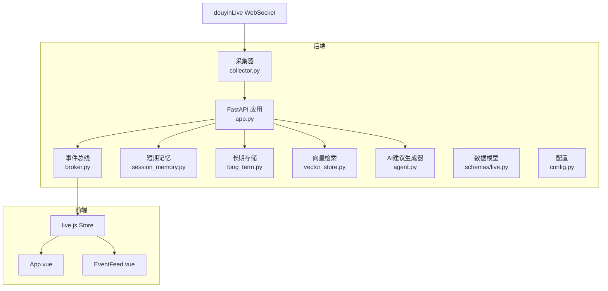

**图表来源**
- [backend/app.py:94-220](file://backend/app.py#L94-L220)
- [backend/services/collector.py:38-284](file://backend/services/collector.py#L38-L284)
- [backend/services/broker.py:10-40](file://backend/services/broker.py#L10-L40)
- [backend/memory/session_memory.py:17-113](file://backend/memory/session_memory.py#L17-L113)
- [backend/memory/long_term.py:36-750](file://backend/memory/long_term.py#L36-L750)
- [backend/memory/vector_store.py:52-108](file://backend/memory/vector_store.py#L52-L108)
- [backend/services/agent.py:23-393](file://backend/services/agent.py#L23-L393)
- [backend/schemas/live.py:29-95](file://backend/schemas/live.py#L29-L95)
- [backend/config.py:39-94](file://backend/config.py#L39-L94)
- [frontend/src/App.vue:1-66](file://frontend/src/App.vue#L1-L66)
- [frontend/src/stores/live.js:70-310](file://frontend/src/stores/live.js#L70-L310)
- [frontend/src/components/EventFeed.vue:1-183](file://frontend/src/components/EventFeed.vue#L1-L183)

**章节来源**
- [README.md:35-48](file://README.md#L35-L48)
- [backend/app.py:94-220](file://backend/app.py#L94-L220)

## 核心组件
- 采集器（DouyinCollector）：连接本地 douyinLive WebSocket，解析原始消息，标准化为 LiveEvent，提交到后端事件循环。
- 事件总线（EventBroker）：进程内广播器，将事件/建议/统计/模型状态分发给 SSE/WS 订阅者。
- 短期记忆（SessionMemory）：优先使用 Redis 保存最近事件与建议；未安装 Redis 时退化为进程内内存。
- 长期存储（LongTermStore）：SQLite 持久化，维护事件、建议、用户画像、会话、备注等。
- 向量检索（VectorMemory）：Chroma 持久化或本地哈希嵌入，用于相似历史检索。
- AI建议生成器（LivePromptAgent）：优先调用 OpenAI 兼容接口，失败回退启发式规则。
- 数据模型（schemas/live.py）：统一事件、建议、统计、状态、快照的数据结构。
- 配置（config.py）：加载 .env，解析运行参数（房间号、采集器、LLM、存储等）。
- 前端（Vue/Pinia）：通过 SSE/WS 订阅后端推送，渲染事件流、建议、统计与模型状态。

**章节来源**
- [backend/services/collector.py:38-284](file://backend/services/collector.py#L38-L284)
- [backend/services/broker.py:10-40](file://backend/services/broker.py#L10-L40)
- [backend/memory/session_memory.py:17-113](file://backend/memory/session_memory.py#L17-L113)
- [backend/memory/long_term.py:36-750](file://backend/memory/long_term.py#L36-L750)
- [backend/memory/vector_store.py:52-108](file://backend/memory/vector_store.py#L52-L108)
- [backend/services/agent.py:23-393](file://backend/services/agent.py#L23-L393)
- [backend/schemas/live.py:29-95](file://backend/schemas/live.py#L29-L95)
- [backend/config.py:39-94](file://backend/config.py#L39-L94)
- [frontend/src/stores/live.js:70-310](file://frontend/src/stores/live.js#L70-L310)

## 架构总览
数据从抖音直播消息源进入本地 WebSocket，经采集器标准化后进入后端处理流水线，同时写入短期/长期存储与向量索引，AI建议生成器按需生成建议并回写存储，随后通过事件总线实时推送到前端。

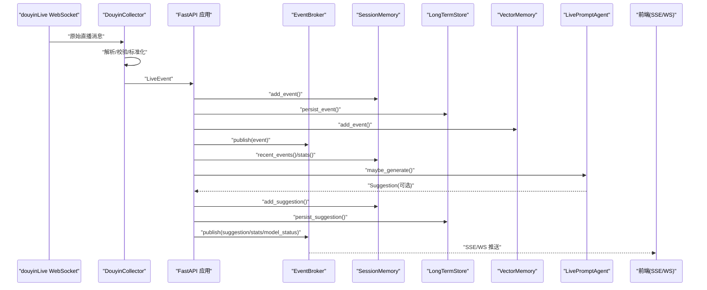

**图表来源**
- [backend/services/collector.py:145-160](file://backend/services/collector.py#L145-L160)
- [backend/app.py:61-78](file://backend/app.py#L61-L78)
- [backend/services/broker.py:28-40](file://backend/services/broker.py#L28-L40)
- [backend/services/agent.py:73-94](file://backend/services/agent.py#L73-L94)
- [backend/memory/session_memory.py:42-64](file://backend/memory/session_memory.py#L42-L64)
- [backend/memory/long_term.py:420-454](file://backend/memory/long_term.py#L420-L454)
- [backend/memory/vector_store.py:64-83](file://backend/memory/vector_store.py#L64-L83)

## 详细组件分析

### 采集器（DouyinCollector）
- 功能要点
  - 连接本地 WebSocket（ws://host:port/ws/{room_id}），周期性发送 ping，断线重连
  - 解析 JSON 消息，映射 method 到 event_type，抽取用户与礼物元数据
  - 标准化为 LiveEvent，通过线程安全方式提交到后端事件循环
- 关键数据格式
  - 输入：原始消息字典（含 common、user、gift 等）
  - 输出：LiveEvent（包含 event_id、room_id、event_type、user、content、metadata、raw 等）
- 错误处理
  - 非 JSON 消息忽略
  - 标准化异常记录日志并丢弃
  - WS 错误/关闭记录日志并触发重连
- 控制机制
  - 支持房间切换（switch_room），内部停止旧连接并建立新连接
  - 通过 settings 控制重连间隔与 ping 间隔

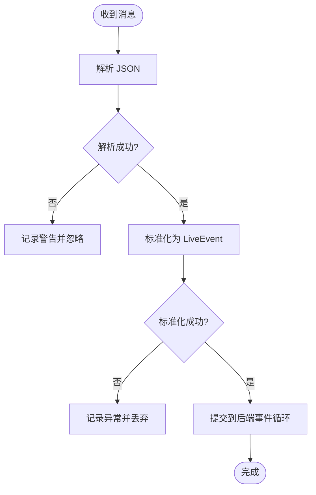

**图表来源**
- [backend/services/collector.py:145-160](file://backend/services/collector.py#L145-L160)
- [backend/services/collector.py:225-284](file://backend/services/collector.py#L225-L284)

**章节来源**
- [backend/services/collector.py:38-284](file://backend/services/collector.py#L38-L284)
- [backend/schemas/live.py:29-45](file://backend/schemas/live.py#L29-L45)

### 事件标准化与处理（FastAPI 应用）
- 功能要点
  - 接收 LiveEvent，写入短期/长期存储与向量索引
  - 通过事件总线发布 event、stats、model_status
  - 条件生成建议：当事件类型为 comment/gift/follow 且 recent_events 可用时
  - 发布 suggestion 并写入短期/长期存储
- 关键数据格式
  - 输入：LiveEvent
  - 输出：事件 envelope（type: event/suggestion/stats/model_status，data: 对应对象）
- 控制机制
  - 房间切换：/api/room，关闭当前会话并切换采集器房间
  - 快照：/api/bootstrap 返回 recent_events/recent_suggestions/stats/model_status
- 实时性
  - SSE/WS 订阅端即时消费，前端按事件类型过滤显示

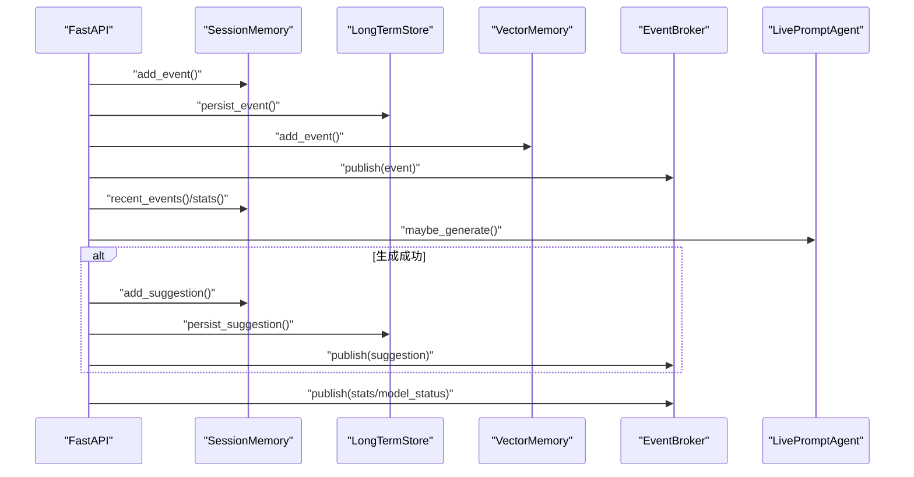

**图表来源**
- [backend/app.py:61-78](file://backend/app.py#L61-L78)
- [backend/app.py:109-127](file://backend/app.py#L109-L127)
- [backend/app.py:187-206](file://backend/app.py#L187-L206)
- [backend/app.py:209-220](file://backend/app.py#L209-L220)

**章节来源**
- [backend/app.py:61-78](file://backend/app.py#L61-L78)
- [backend/app.py:109-127](file://backend/app.py#L109-L127)
- [backend/app.py:187-220](file://backend/app.py#L187-L220)

### 事件总线（EventBroker）
- 功能要点
  - 维护订阅队列集合，发布时尝试非阻塞投递
  - 对阻塞队列进行清理，避免过期订阅占用资源
- 订阅方式
  - SSE：/api/events/stream
  - WebSocket：/ws/live
- 过滤与路由
  - SSE 侧按 room_id 过滤（非 model_status 类型）
  - WS 侧一次性发送 bootstrap 快照，后续增量推送

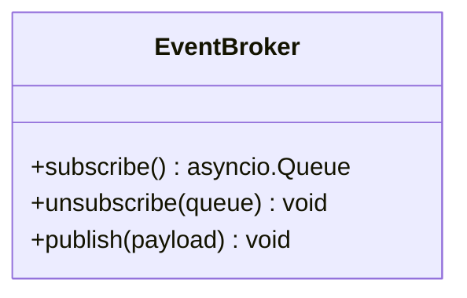

**图表来源**
- [backend/services/broker.py:10-40](file://backend/services/broker.py#L10-L40)

**章节来源**
- [backend/services/broker.py:10-40](file://backend/services/broker.py#L10-L40)
- [backend/app.py:187-220](file://backend/app.py#L187-L220)

### 短期记忆（SessionMemory）
- 功能要点
  - 优先使用 Redis 保存最近事件与建议（lpush + ltrim + expire）
  - 未安装 Redis 时退化为进程内 deque，限制窗口大小
- 查询与统计
  - recent_events/recent_suggestions：按房间查询最近 N 条
  - stats：基于短期窗口统计各类事件数量

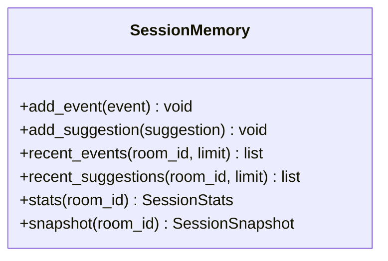

**图表来源**
- [backend/memory/session_memory.py:17-113](file://backend/memory/session_memory.py#L17-L113)

**章节来源**
- [backend/memory/session_memory.py:17-113](file://backend/memory/session_memory.py#L17-L113)

### 长期存储（LongTermStore）
- 功能要点
  - SQLite 表：events、suggestions、viewer_profiles、viewer_gifts、live_sessions、viewer_notes
  - 自动建表/索引/列补齐，确保历史数据可回填
  - 会话管理：活动会话检测、触达、结束
  - 用户画像：聚合评论/礼物/会话等维度
  - 备注管理：viewer_notes 的增删改查
- 查询与聚合
  - recent_events/recent_suggestions/stats/snapshot
  - get_user_profile/get_viewer_detail/list_live_sessions 等

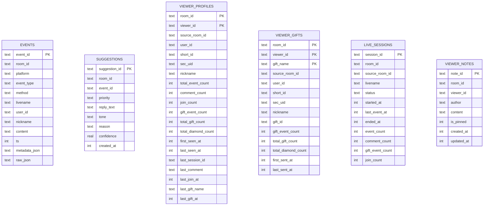

**图表来源**
- [backend/memory/long_term.py:54-148](file://backend/memory/long_term.py#L54-L148)

**章节来源**
- [backend/memory/long_term.py:36-750](file://backend/memory/long_term.py#L36-L750)

### 向量检索（VectorMemory）
- 功能要点
  - 若安装 chromadb，则使用持久化集合；否则使用本地哈希嵌入 + 文本相似度
  - add_event：写入文档与元数据（含事件 ID、房间、事件类型）
  - similar：返回与输入文本最相近的历史片段
- 降级策略
  - 无 chromadb 时维持检索能力，限制历史条数

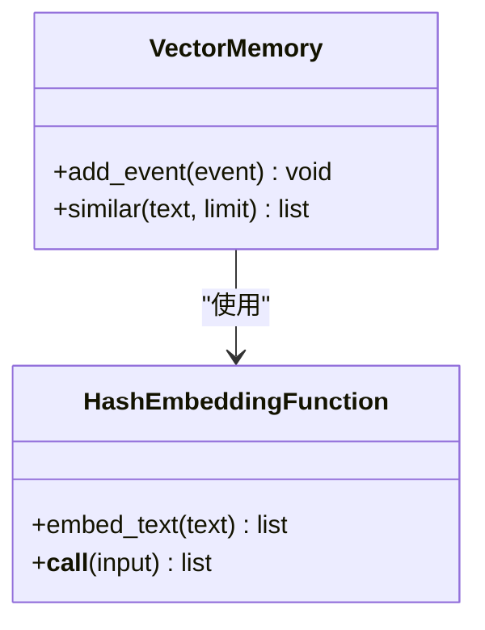

**图表来源**
- [backend/memory/vector_store.py:52-108](file://backend/memory/vector_store.py#L52-L108)

**章节来源**
- [backend/memory/vector_store.py:52-108](file://backend/memory/vector_store.py#L52-L108)

### AI建议生成器（LivePromptAgent）
- 功能要点
  - 仅对 comment/gift/follow 事件生成建议
  - 构造上下文：最近事件窗口、相似历史、用户画像
  - 优先 OpenAI 兼容接口，失败回退启发式规则
  - 更新模型状态（mode/model/backend/last_result/last_error/updated_at）
- 错误处理
  - HTTP/网络/超时/JSON 解析/缺失字段等均记录并标记状态

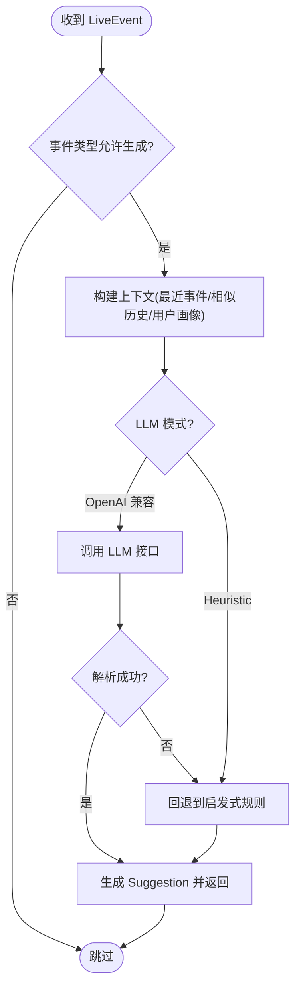

**图表来源**
- [backend/services/agent.py:73-114](file://backend/services/agent.py#L73-L114)
- [backend/services/agent.py:183-329](file://backend/services/agent.py#L183-L329)

**章节来源**
- [backend/services/agent.py:23-393](file://backend/services/agent.py#L23-L393)

### 前端（Vue/Pinia）
- 功能要点
  - 初始化：/api/bootstrap 获取快照
  - 订阅：SSE/WS 接收 event/suggestion/stats/model_status
  - 展示：EventFeed 渲染事件流；TeleprompterCard 展示建议
  - 控制：房间切换、事件类型过滤、主题切换、清空事件
- 过滤与状态
  - localStorage 持久化事件类型过滤与主题
  - 连接状态：connecting/live/reconnecting/switching

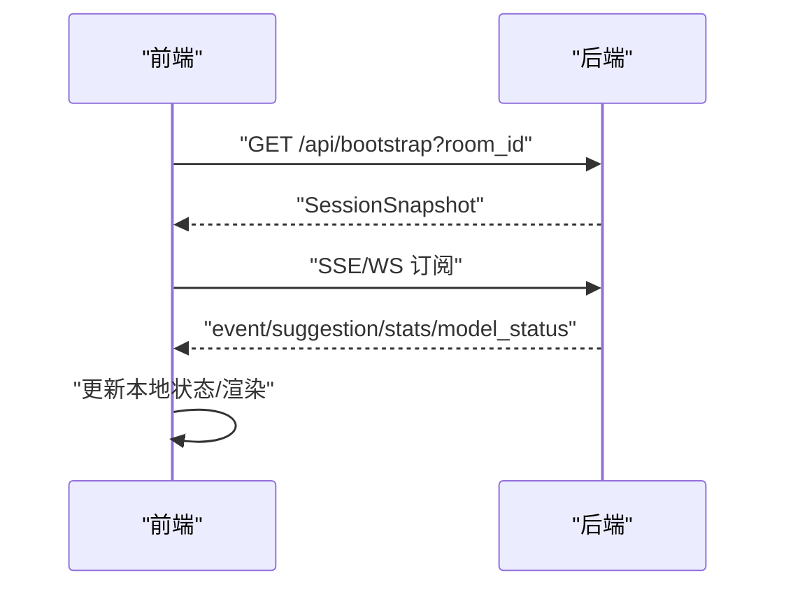

**图表来源**
- [frontend/src/stores/live.js:158-205](file://frontend/src/stores/live.js#L158-L205)
- [frontend/src/stores/live.js:207-250](file://frontend/src/stores/live.js#L207-L250)
- [frontend/src/App.vue:29-32](file://frontend/src/App.vue#L29-L32)

**章节来源**
- [frontend/src/stores/live.js:70-310](file://frontend/src/stores/live.js#L70-L310)
- [frontend/src/components/EventFeed.vue:1-183](file://frontend/src/components/EventFeed.vue#L1-L183)
- [frontend/src/App.vue:1-66](file://frontend/src/App.vue#L1-L66)

## 依赖关系分析
- 组件耦合
  - app.py 依赖 collector、broker、session_memory、long_term、vector_store、agent、schema、config
  - collector 依赖 config 与 schema
  - agent 依赖 vector_store 与 long_term
  - 前端依赖后端 REST/SSE/WS 接口
- 外部依赖
  - websocket-client（采集器）
  - fastapi/uvicorn（后端）
  - redis（短期记忆可选）
  - chromadb（向量检索可选）

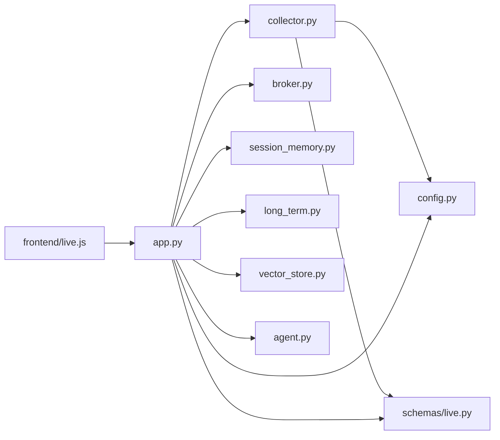

**图表来源**
- [backend/app.py:13-29](file://backend/app.py#L13-L29)
- [backend/services/collector.py:16-17](file://backend/services/collector.py#L16-L17)
- [backend/services/agent.py:24-29](file://backend/services/agent.py#L24-L29)
- [frontend/src/stores/live.js:158-205](file://frontend/src/stores/live.js#L158-L205)

**章节来源**
- [backend/app.py:13-29](file://backend/app.py#L13-L29)
- [backend/services/collector.py:16-17](file://backend/services/collector.py#L16-L17)
- [backend/services/agent.py:24-29](file://backend/services/agent.py#L24-L29)
- [frontend/src/stores/live.js:158-205](file://frontend/src/stores/live.js#L158-L205)

## 性能考量
- 实时性保障
  - SSE/WS 订阅端即时消费，前端按事件类型过滤，避免 UI 卡顿
  - 采集器 ping 与断线重连，降低长连接失效风险
- 缓冲策略
  - SessionMemory 窗口限制（事件/建议）+ Redis TTL，避免内存膨胀
  - 向量检索在无 chromadb 时使用本地相似度，保持检索可用
- 并发与线程
  - 采集器使用独立线程与 ping 线程，避免阻塞后端事件循环
  - 通过 run_coroutine_threadsafe 将事件提交到 asyncio loop
- 存储与索引
  - SQLite 索引覆盖常见查询（room_id/ts、viewer_id、event_type 等）
  - 向量检索集合按需创建，避免冷启动开销

[本节为通用性能讨论，无需特定文件引用]

## 故障排查指南
- 采集器无法连接
  - 检查 ROOM_ID、COLLECTOR_HOST/PORT 是否正确
  - 查看采集器日志（连接/断开/ping/重连）
- SSE/WS 连接异常
  - 前端连接状态：connecting/live/reconnecting/switching
  - 后端健康检查：/health
- 建议生成失败
  - 检查 LLM_MODE、LLM_BASE_URL、LLM_MODEL、LLM_API_KEY
  - 查看模型状态（model_status）与错误码
- 数据不一致
  - 确认 SQLite 表结构与索引是否完整（自动建表/索引/列补齐）
  - 检查会话状态（active/ended）与最后事件时间
- Redis/Chroma 不可用
  - 短期记忆与向量检索会自动降级，不影响基本流程

**章节来源**
- [backend/services/collector.py:117-139](file://backend/services/collector.py#L117-L139)
- [backend/app.py:104-107](file://backend/app.py#L104-L107)
- [backend/services/agent.py:39-54](file://backend/services/agent.py#L39-L54)
- [backend/memory/long_term.py:50-155](file://backend/memory/long_term.py#L50-L155)
- [backend/config.py:46-61](file://backend/config.py#L46-L61)

## 结论
该系统以“采集器 -> 标准化 -> 内存/存储 -> AI建议 -> 实时推送 -> 前端展示”为主线，通过事件总线实现解耦与扩展，短期/长期存储与向量检索提供多维上下文，前端通过 SSE/WS 实时消费。房间切换、事件过滤与状态同步均有清晰的控制点，具备良好的可运维性与可扩展性。

[本节为总结，无需特定文件引用]

## 附录

### 数据格式对照
- 原始消息（来自 douyinLive WebSocket）
  - 字段：common、user、gift、content、livename 等
- LiveEvent（标准化）
  - 字段：event_id、room_id、platform、event_type、method、livename、ts、user、content、metadata、raw
- Suggestion（建议）
  - 字段：suggestion_id、room_id、event_id、source、priority、reply_text、tone、reason、confidence、source_events、references、created_at
- SessionStats（统计）
  - 字段：room_id、total_events、comments、gifts、likes、members、follows
- ModelStatus（模型状态）
  - 字段：mode、model、backend、last_result、last_error、updated_at
- SessionSnapshot（快照）
  - 字段：room_id、recent_events、recent_suggestions、stats、model_status

**章节来源**
- [backend/schemas/live.py:29-95](file://backend/schemas/live.py#L29-L95)
- [README.md:276-307](file://README.md#L276-L307)

### 接口与事件类型
- SSE/WS 推送事件类型
  - event、suggestion、stats、model_status
- 前端订阅
  - SSE：/api/events/stream?room_id
  - WS：/ws/live

**章节来源**
- [backend/app.py:187-220](file://backend/app.py#L187-L220)
- [frontend/src/stores/live.js:173-205](file://frontend/src/stores/live.js#L173-L205)