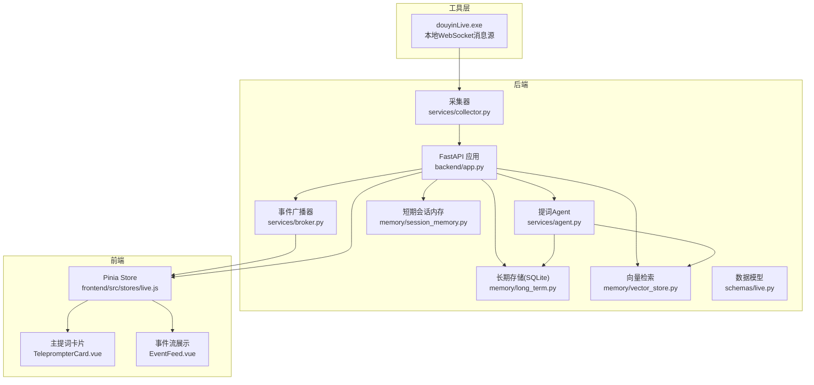
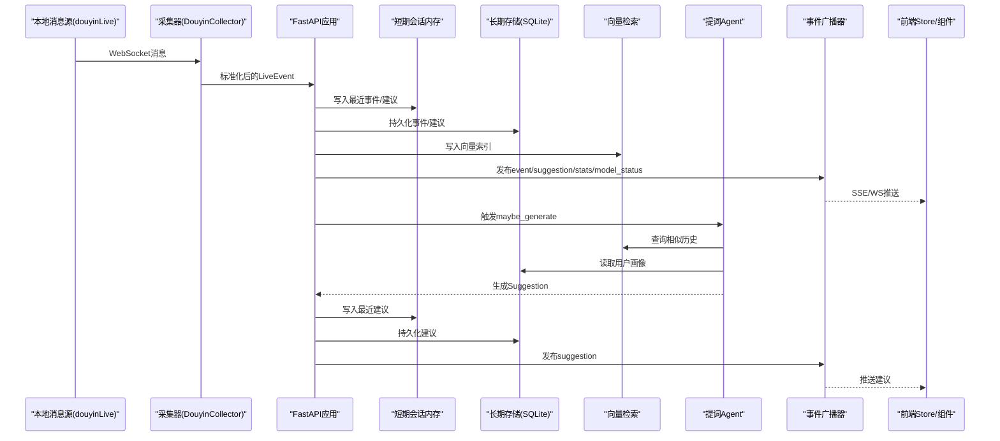
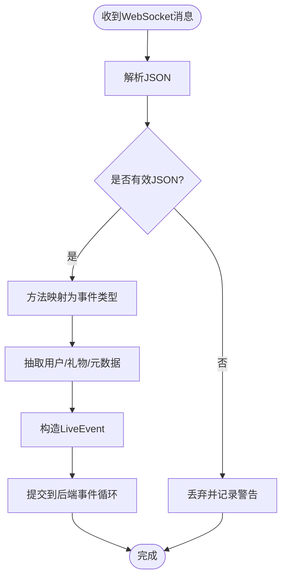
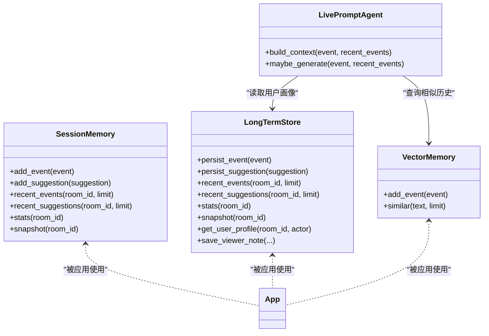
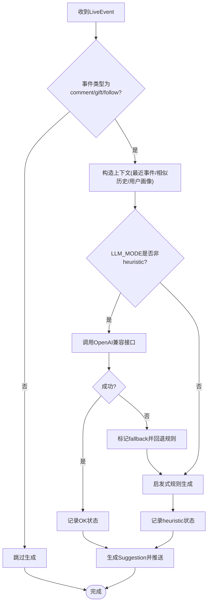
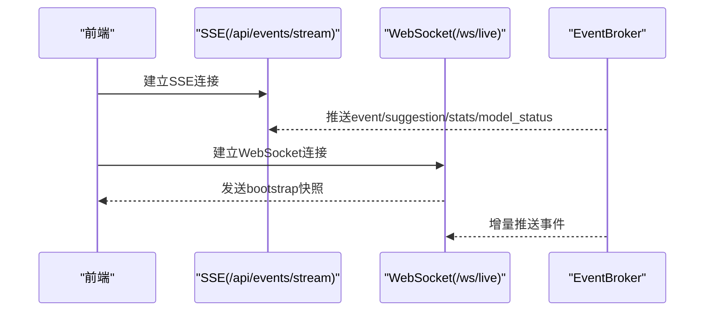
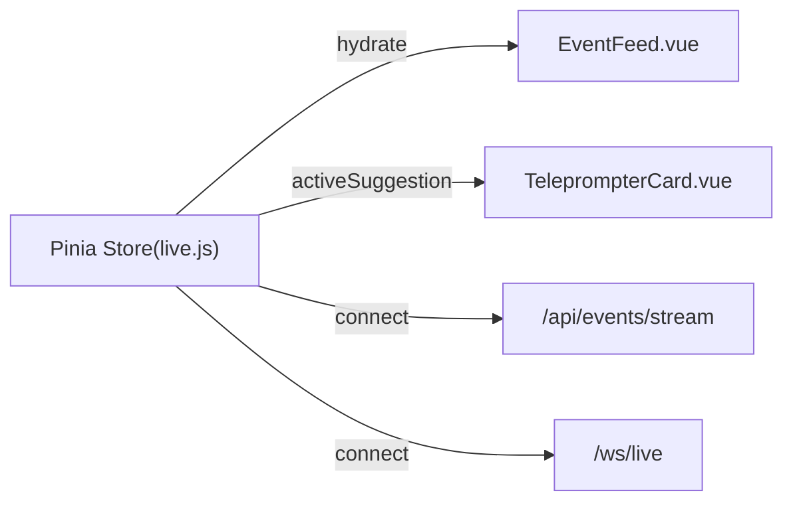
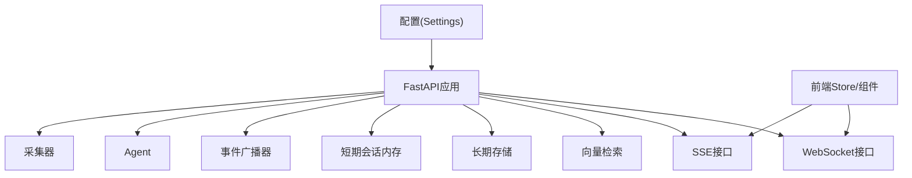

# 核心功能特性

<cite>
**本文引用的文件**
- [backend/app.py](file://backend/app.py)
- [backend/config.py](file://backend/config.py)
- [backend/services/broker.py](file://backend/services/broker.py)
- [backend/services/collector.py](file://backend/services/collector.py)
- [backend/services/agent.py](file://backend/services/agent.py)
- [backend/memory/session_memory.py](file://backend/memory/session_memory.py)
- [backend/memory/long_term.py](file://backend/memory/long_term.py)
- [backend/memory/vector_store.py](file://backend/memory/vector_store.py)
- [backend/schemas/live.py](file://backend/schemas/live.py)
- [frontend/src/stores/live.js](file://frontend/src/stores/live.js)
- [frontend/src/components/TeleprompterCard.vue](file://frontend/src/components/TeleprompterCard.vue)
- [frontend/src/components/EventFeed.vue](file://frontend/src/components/EventFeed.vue)
- [README.md](file://README.md)
- [USAGE.md](file://USAGE.md)
- [requirements.txt](file://requirements.txt)
</cite>

## 目录
1. [简介](#简介)
2. [项目结构](#项目结构)
3. [核心组件](#核心组件)
4. [架构总览](#架构总览)
5. [详细组件分析](#详细组件分析)
6. [依赖关系分析](#依赖关系分析)
7. [性能考量](#性能考量)
8. [故障排查指南](#故障排查指南)
9. [结论](#结论)
10. [附录](#附录)

## 简介
本项目为抖音直播实时提词器，围绕“本地消息源 → 后端处理 → 前端展示”的完整链路构建，提供以下核心能力：
- 实时事件采集与标准化：从本地 WebSocket 消息源抓取直播事件，统一为标准数据模型。
- 多层内存与存储：短期会话内存、长期历史存储、向量检索索引协同工作。
- 提词建议生成：双模式 AI 支持（启发式规则 + OpenAI 兼容接口），具备自动回退能力。
- 实时流推送：通过 SSE 与 WebSocket 向前端推送事件、建议、统计与模型状态。
- 前端交互：主提词卡片、事件流展示、房间切换、事件筛选、主题切换。

## 项目结构
后端采用 FastAPI 提供 REST、SSE、WebSocket 接口；前端基于 Vue 3 + Pinia + Tailwind 构建，二者通过统一数据模型进行交互。

图示来源
- [backend/app.py:94-220](file://backend/app.py#L94-L220)
- [backend/services/collector.py:38-284](file://backend/services/collector.py#L38-L284)
- [backend/services/broker.py:10-40](file://backend/services/broker.py#L10-L40)
- [backend/services/agent.py:23-393](file://backend/services/agent.py#L23-L393)
- [backend/memory/session_memory.py:17-113](file://backend/memory/session_memory.py#L17-L113)
- [backend/memory/long_term.py:36-750](file://backend/memory/long_term.py#L36-L750)
- [backend/memory/vector_store.py:52-108](file://backend/memory/vector_store.py#L52-L108)
- [backend/schemas/live.py:8-95](file://backend/schemas/live.py#L8-L95)
- [frontend/src/stores/live.js:70-310](file://frontend/src/stores/live.js#L70-L310)
- [frontend/src/components/TeleprompterCard.vue:1-83](file://frontend/src/components/TeleprompterCard.vue#L1-L83)
- [frontend/src/components/EventFeed.vue:1-183](file://frontend/src/components/EventFeed.vue#L1-L183)

章节来源
- [README.md:21-34](file://README.md#L21-L34)
- [README.md:35-48](file://README.md#L35-L48)

## 核心组件
- 采集与标准化
  - 采集器负责连接本地 WebSocket，解析消息并标准化为统一事件模型，随后提交至后端事件循环。
- 多层内存与存储
  - 短期会话内存：优先 Redis，否则退化为进程内队列，保存最近事件与建议。
  - 长期存储：SQLite，持久化事件、建议、用户画像、会话与备注等。
  - 向量检索：优先 Chroma，否则退化为轻量哈希嵌入与文本相似度。
- 提词建议生成
  - 双模式：优先在线 OpenAI 兼容接口，失败自动回退启发式规则；同时记录模型状态。
- 实时流推送
  - SSE：按事件类型推送 event/suggestion/stats/model_status。
  - WebSocket：连接即推送 bootstrap 快照，后续增量推送。
- 前端交互
  - Store 统一管理房间、连接状态、事件与建议、模型状态、主题与筛选。
  - 组件渲染主提词卡片与事件流，支持房间切换与筛选。

章节来源
- [backend/services/collector.py:225-284](file://backend/services/collector.py#L225-L284)
- [backend/memory/session_memory.py:17-113](file://backend/memory/session_memory.py#L17-L113)
- [backend/memory/long_term.py:36-750](file://backend/memory/long_term.py#L36-L750)
- [backend/memory/vector_store.py:52-108](file://backend/memory/vector_store.py#L52-L108)
- [backend/services/agent.py:23-393](file://backend/services/agent.py#L23-L393)
- [backend/app.py:187-220](file://backend/app.py#L187-L220)
- [frontend/src/stores/live.js:70-310](file://frontend/src/stores/live.js#L70-L310)
- [frontend/src/components/TeleprompterCard.vue:1-83](file://frontend/src/components/TeleprompterCard.vue#L1-L83)
- [frontend/src/components/EventFeed.vue:1-183](file://frontend/src/components/EventFeed.vue#L1-L183)

## 架构总览
从本地消息源到前端展示的完整数据流如下：

图示来源
- [backend/services/collector.py:117-181](file://backend/services/collector.py#L117-L181)
- [backend/app.py:61-78](file://backend/app.py#L61-L78)
- [backend/services/agent.py:73-94](file://backend/services/agent.py#L73-L94)
- [backend/services/broker.py:28-40](file://backend/services/broker.py#L28-L40)
- [frontend/src/stores/live.js:173-205](file://frontend/src/stores/live.js#L173-L205)

## 详细组件分析

### 实时事件采集与标准化
- 采集器职责
  - 连接本地 WebSocket，维持心跳，解析 JSON，映射方法到事件类型，构造标准 LiveEvent。
  - 通过线程安全的方式将事件提交到后端事件循环，确保异步处理。
- 标准化规则
  - 将不同方法的消息映射为统一事件类型，抽取用户身份与礼物信息，补充元数据。
- 错误与重连
  - 断线自动重连，异常日志记录，避免阻塞主线程。

图示来源
- [backend/services/collector.py:145-160](file://backend/services/collector.py#L145-L160)
- [backend/services/collector.py:225-284](file://backend/services/collector.py#L225-L284)

章节来源
- [backend/services/collector.py:38-284](file://backend/services/collector.py#L38-L284)
- [backend/schemas/live.py:29-45](file://backend/schemas/live.py#L29-L45)

### 多层内存架构与数据持久化
- 短期会话内存（SessionMemory）
  - 优先 Redis 列表，支持 TTL 控制热数据生命周期；未安装 Redis 时退化为进程内双端队列。
  - 提供最近事件、最近建议与统计计算。
- 长期存储（LongTermStore）
  - SQLite 表结构覆盖事件、建议、用户画像、礼物统计、直播会话、用户备注等。
  - 自动迁移与索引，支持活跃会话管理、用户画像聚合与历史查询。
- 向量检索（VectorMemory）
  - 优先 Chroma 持久化集合；未安装时使用哈希嵌入函数与轻量相似度策略，保持检索能力。

图示来源
- [backend/memory/session_memory.py:17-113](file://backend/memory/session_memory.py#L17-L113)
- [backend/memory/long_term.py:36-750](file://backend/memory/long_term.py#L36-L750)
- [backend/memory/vector_store.py:52-108](file://backend/memory/vector_store.py#L52-L108)
- [backend/services/agent.py:56-71](file://backend/services/agent.py#L56-L71)

章节来源
- [backend/memory/session_memory.py:17-113](file://backend/memory/session_memory.py#L17-L113)
- [backend/memory/long_term.py:36-750](file://backend/memory/long_term.py#L36-L750)
- [backend/memory/vector_store.py:52-108](file://backend/memory/vector_store.py#L52-L108)

### 提词建议生成（双模式AI）
- 生成触发条件
  - 仅对 comment/gift/follow 事件生成建议；其他事件不生成建议。
- 上下文构造
  - 最近事件窗口、相似历史片段、用户画像。
- 双模式策略
  - 在线模式：调用 OpenAI 兼容接口，严格 JSON 输出约束；失败时回退启发式规则。
  - 启发式模式：基于关键词与场景的规则，输出简短口语化建议。
- 状态追踪
  - 记录当前模式、模型名、后端地址、最后结果与错误、更新时间，便于前端展示。

图示来源
- [backend/services/agent.py:73-114](file://backend/services/agent.py#L73-L114)
- [backend/services/agent.py:183-330](file://backend/services/agent.py#L183-L330)
- [backend/services/agent.py:331-393](file://backend/services/agent.py#L331-L393)

章节来源
- [backend/services/agent.py:23-393](file://backend/services/agent.py#L23-L393)
- [backend/schemas/live.py:47-62](file://backend/schemas/live.py#L47-L62)

### 实时事件流处理（SSE与WebSocket）
- SSE（Server-Sent Events）
  - 事件类型：event、suggestion、stats、model_status。
  - 支持按房间过滤，保持长连接，自动重连。
- WebSocket
  - 连接后先发送 bootstrap 快照，随后增量推送。

图示来源
- [backend/app.py:187-206](file://backend/app.py#L187-L206)
- [backend/app.py:209-220](file://backend/app.py#L209-L220)
- [backend/services/broker.py:10-40](file://backend/services/broker.py#L10-L40)
- [frontend/src/stores/live.js:173-205](file://frontend/src/stores/live.js#L173-L205)

章节来源
- [backend/app.py:187-220](file://backend/app.py#L187-L220)
- [frontend/src/stores/live.js:173-205](file://frontend/src/stores/live.js#L173-L205)

### 前端展示与交互
- Store 职责
  - 管理房间号、连接状态、事件与建议、模型状态、主题与筛选。
  - 初始化时拉取 bootstrap 快照，建立 SSE 连接，监听事件并更新状态。
- 组件职责
  - TeleprompterCard：展示当前最优建议、来源标签、优先级与语气、建议理由。
  - EventFeed：展示事件流、事件类型筛选、清空事件等。

图示来源
- [frontend/src/stores/live.js:70-310](file://frontend/src/stores/live.js#L70-L310)
- [frontend/src/components/TeleprompterCard.vue:1-83](file://frontend/src/components/TeleprompterCard.vue#L1-L83)
- [frontend/src/components/EventFeed.vue:1-183](file://frontend/src/components/EventFeed.vue#L1-L183)

章节来源
- [frontend/src/stores/live.js:70-310](file://frontend/src/stores/live.js#L70-L310)
- [frontend/src/components/TeleprompterCard.vue:1-83](file://frontend/src/components/TeleprompterCard.vue#L1-L83)
- [frontend/src/components/EventFeed.vue:1-183](file://frontend/src/components/EventFeed.vue#L1-L183)

## 依赖关系分析
- 后端依赖
  - FastAPI、Uvicorn、websocket-client、可选 Redis、可选 Chroma。
- 运行时配置
  - 通过环境变量与 .env 解析，支持多种 LLM 模式与服务地址解析。
- 组件耦合
  - 应用层通过事件广播器解耦发布与订阅；Agent 依赖向量与长期存储；短期内存可插拔。

图示来源
- [backend/config.py:39-94](file://backend/config.py#L39-L94)
- [requirements.txt:1-6](file://requirements.txt#L1-L6)
- [backend/app.py:94-220](file://backend/app.py#L94-L220)

章节来源
- [backend/config.py:39-94](file://backend/config.py#L39-L94)
- [requirements.txt:1-6](file://requirements.txt#L1-L6)

## 性能考量
- 短期内存
  - Redis 模式下列表截断与 TTL 控制，降低内存膨胀；未安装 Redis 时进程内队列满足基本需求。
- 长期存储
  - SQLite 索引覆盖常用查询，批量重建用户画像与礼物聚合以提升查询效率。
- 向量检索
  - Chroma 持久化集合提供高效相似检索；未安装时的哈希嵌入与相似度策略保证可用性。
- 建议生成
  - 在线模式失败快速回退规则，减少前端等待；模型状态实时更新，便于前端降级提示。
- 实时流
  - SSE/WS 广播器统一发布，订阅端按房间过滤，避免无效传输。

## 故障排查指南
- 页面无建议
  - 检查本地消息源是否启动、房间号是否正确、直播间是否开播、后端是否已重启。
- 顶部显示 fallback
  - 检查在线模型 API Key、网络连通性、超时或限流情况。
- 顶部显示 heuristic
  - 检查 LLM_MODE 配置或 .env 加载是否正确。
- 前端无法打开
  - 检查前端脚本是否正常启动、端口是否被占用。
- 后端启动但无数据
  - 查看后端日志是否连接到本地 WebSocket、当前房间是否有消息。

章节来源
- [USAGE.md:198-256](file://USAGE.md#L198-L256)

## 结论
本项目通过“本地消息源 + 多层内存 + 双模式AI + 实时流推送”的设计，在保证可运行性的同时提供了直播提词的核心能力。短期会话内存、长期存储与向量检索形成互补，Agent 的双模式策略兼顾稳定性与智能化，前端以简洁直观的方式呈现关键信息，适合在真实直播场景中快速落地与迭代。

## 附录
- 快速开始与配置要点
  - 启动本地消息源、配置 .env、安装依赖、分别启动后端与前端。
- 接口与数据模型
  - 健康检查、房间切换、手动注入事件、SSE/WS 实时流、标准事件与建议模型。

章节来源
- [README.md:66-141](file://README.md#L66-L141)
- [README.md:208-275](file://README.md#L208-L275)
- [backend/schemas/live.py:8-95](file://backend/schemas/live.py#L8-L95)