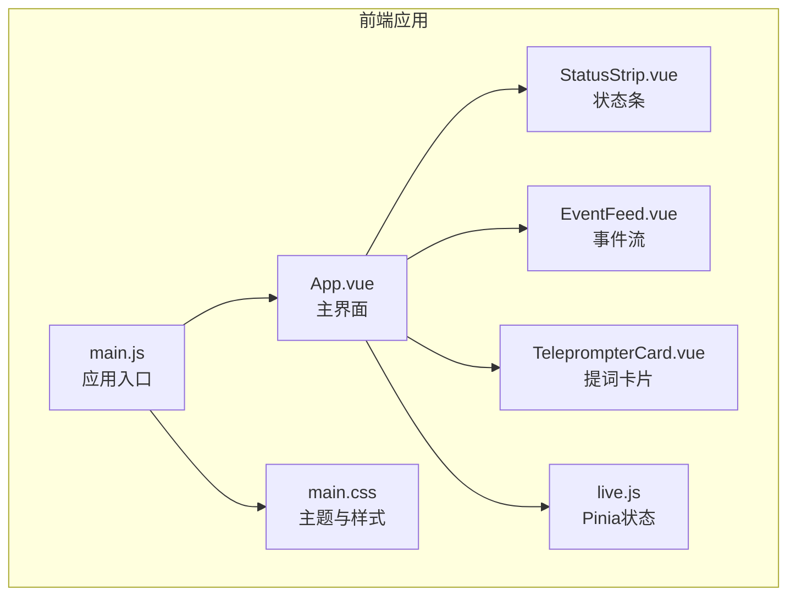
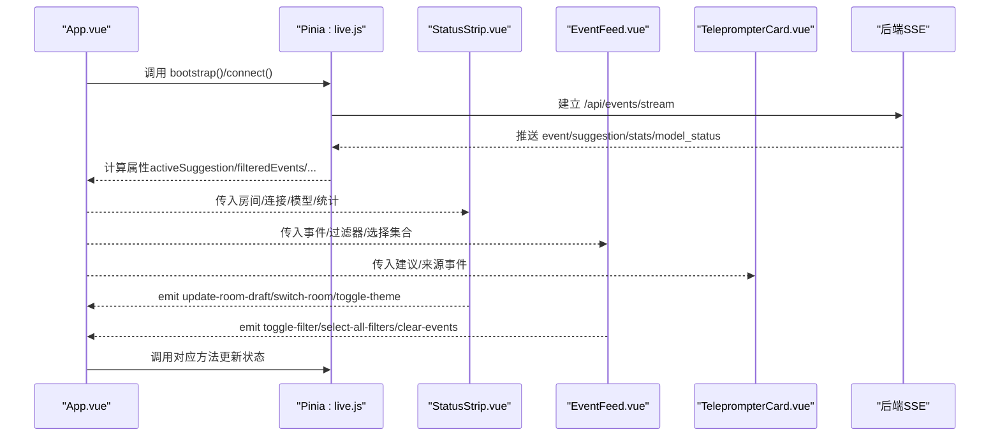
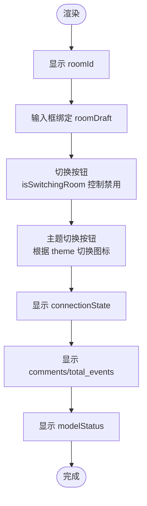
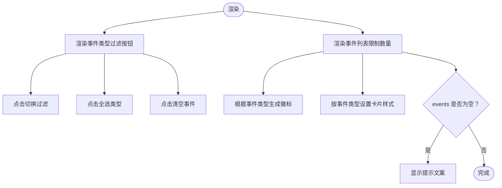
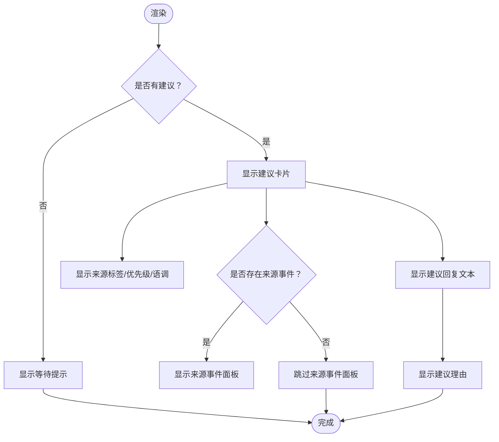
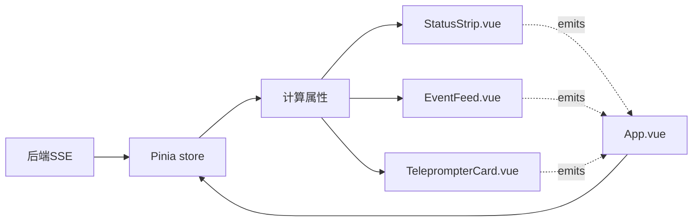

# UI组件系统

<cite>
**本文引用的文件**
- [StatusStrip.vue](file://frontend/src/components/StatusStrip.vue)
- [EventFeed.vue](file://frontend/src/components/EventFeed.vue)
- [TeleprompterCard.vue](file://frontend/src/components/TeleprompterCard.vue)
- [main.css](file://frontend/src/assets/main.css)
- [App.vue](file://frontend/src/App.vue)
- [main.js](file://frontend/src/main.js)
- [live.js](file://frontend/src/stores/live.js)
- [package.json](file://frontend/package.json)
</cite>

## 目录
1. [简介](#简介)
2. [项目结构](#项目结构)
3. [核心组件](#核心组件)
4. [架构总览](#架构总览)
5. [组件详细分析](#组件详细分析)
6. [依赖关系分析](#依赖关系分析)
7. [性能考量](#性能考量)
8. [故障排查指南](#故障排查指南)
9. [结论](#结论)
10. [附录](#附录)

## 简介
本技术文档聚焦于抖音直播实时提词器的前端UI组件系统，围绕三个核心组件展开：状态条组件（StatusStrip.vue）、事件流组件（EventFeed.vue）与提词卡片组件（TeleprompterCard.vue）。文档从组件职责、数据流、事件通信、样式与主题系统、响应式布局、以及与Pinia状态管理的协作等方面进行深入解析，并提供使用示例、定制化开发指南与性能优化建议，帮助开发者快速理解并扩展该系统。

## 项目结构
前端采用Vue 3 + Vite + TailwindCSS + Pinia的现代前端栈，组件位于frontend/src/components目录，全局样式在frontend/src/assets/main.css，应用入口在frontend/src/main.js，主界面在frontend/src/App.vue，状态管理集中在frontend/src/stores/live.js。

图表来源
- [main.js:1-17](file://frontend/src/main.js#L1-L17)
- [App.vue:1-66](file://frontend/src/App.vue#L1-L66)
- [StatusStrip.vue:1-144](file://frontend/src/components/StatusStrip.vue#L1-L144)
- [EventFeed.vue:1-183](file://frontend/src/components/EventFeed.vue#L1-L183)
- [TeleprompterCard.vue:1-83](file://frontend/src/components/TeleprompterCard.vue#L1-L83)
- [live.js:1-310](file://frontend/src/stores/live.js#L1-L310)
- [main.css:1-144](file://frontend/src/assets/main.css#L1-L144)

章节来源
- [package.json:1-23](file://frontend/package.json#L1-L23)
- [main.js:1-17](file://frontend/src/main.js#L1-L17)
- [App.vue:1-66](file://frontend/src/App.vue#L1-L66)

## 核心组件
本节概述三个核心组件的职责与交互关系：
- 状态条组件（StatusStrip.vue）
  - 负责显示房间号、连接状态、模型状态、统计数据等关键信息
  - 提供房间切换输入框、切换按钮与主题切换按钮
  - 通过事件向上抛出房间草稿更新、房间切换与主题切换
- 事件流组件（EventFeed.vue）
  - 展示实时事件流，支持按事件类型过滤
  - 提供“清空事件”、“全选类型”等操作
  - 通过事件向上抛出过滤切换、全选与清空
- 提词卡片组件（TeleprompterCard.vue）
  - 展示当前最优建议回复，包含来源事件、来源标签、优先级、语调与建议文本
  - 在无建议时提示等待新弹幕与建议

章节来源
- [StatusStrip.vue:1-144](file://frontend/src/components/StatusStrip.vue#L1-L144)
- [EventFeed.vue:1-183](file://frontend/src/components/EventFeed.vue#L1-L183)
- [TeleprompterCard.vue:1-83](file://frontend/src/components/TeleprompterCard.vue#L1-L83)

## 架构总览
应用采用“组件 + Pinia状态”的单页架构。App.vue作为根组件，注入Pinia状态并通过props向子组件传递数据，同时监听子组件发出的事件来驱动状态变更。事件流通过Server-Sent Events（SSE）由后端推送至前端，Pinia store负责接收、存储与计算派生状态。

图表来源
- [App.vue:1-66](file://frontend/src/App.vue#L1-L66)
- [live.js:158-205](file://frontend/src/stores/live.js#L158-L205)
- [StatusStrip.vue:41](file://frontend/src/components/StatusStrip.vue#L41)
- [EventFeed.vue:21](file://frontend/src/components/EventFeed.vue#L21)

## 组件详细分析

### 状态条组件（StatusStrip.vue）
- 职责
  - 显示房间号、连接状态、评论数、模型状态、总事件数
  - 提供房间号输入与切换按钮，支持回车触发切换
  - 提供主题切换按钮，根据当前主题显示不同图标
- Props
  - roomId: 字符串，必填
  - roomDraft: 字符串，必填
  - theme: 字符串，必填
  - nextThemeLabel: 字符串，必填
  - isSwitchingRoom: 布尔值，必填
  - roomError: 字符串，默认为空
  - connectionState: 字符串，必填
  - modelStatus: 对象，必填
  - stats: 对象，必填
- Emits
  - update-room-draft: 输入框值变化时触发
  - switch-room: 切换房间按钮或回车触发
  - toggle-theme: 主题切换按钮触发
- 交互要点
  - 输入框双向绑定到roomDraft，回车触发切换
  - 切换按钮禁用条件为isSwitchingRoom
  - 主题切换按钮根据nextThemeLabel显示提示
- 样式与主题
  - 使用Tailwind类名组合圆角边框、阴影、半透明背景与模糊效果
  - 主题通过data-theme属性控制，配合CSS变量实现深浅色切换

图表来源
- [StatusStrip.vue:44-143](file://frontend/src/components/StatusStrip.vue#L44-L143)

章节来源
- [StatusStrip.vue:1-144](file://frontend/src/components/StatusStrip.vue#L1-L144)
- [main.css:5-64](file://frontend/src/assets/main.css#L5-L64)

### 事件流组件（EventFeed.vue）
- 职责
  - 展示实时事件列表，支持按事件类型过滤
  - 提供“清空事件”、“全选类型”按钮
  - 限制展示数量（取前若干条），滚动容器支持纵向滚动
- Props
  - events: 数组，必填
  - eventFilters: 数组，必填
  - selectedEventTypes: 数组，必填
  - areAllEventTypesSelected: 布尔值，必填
- Emits
  - toggle-filter: 切换某个事件类型的过滤
  - select-all-filters: 全选事件类型
  - clear-events: 清空事件
- 交互要点
  - 过滤按钮根据是否被选中与是否锁定（仅剩一个选中时锁定）决定样式与禁用
  - “清空事件”按钮在events为空时禁用
  - “全选类型”按钮在已全选时禁用
- 数据与样式
  - 事件卡片按事件类型动态设置边框与背景色
  - 用户与内容区域采用网格布局，移动端自适应
  - 无事件时显示提示文案

图表来源
- [EventFeed.vue:88-182](file://frontend/src/components/EventFeed.vue#L88-L182)

章节来源
- [EventFeed.vue:1-183](file://frontend/src/components/EventFeed.vue#L1-L183)
- [live.js:106-111](file://frontend/src/stores/live.js#L106-L111)

### 提词卡片组件（TeleprompterCard.vue）
- 职责
  - 展示当前最优建议回复，包含来源事件、来源标签、优先级、语调与建议文本
  - 在无建议时提示等待新弹幕与建议
- Props
  - suggestion: 对象，可选
  - sourceEvent: 对象，可选
- 交互要点
  - 无建议时显示等待提示
  - 有建议时显示来源事件摘要与建议回复
  - 来源标签根据source字段映射中文标签
- 样式与主题
  - 使用teleprompter-*系列类名，基于CSS变量实现深浅主题下的视觉一致性
  - 大标题在不同屏幕尺寸下自适应字号

图表来源
- [TeleprompterCard.vue:34-82](file://frontend/src/components/TeleprompterCard.vue#L34-L82)

章节来源
- [TeleprompterCard.vue:1-83](file://frontend/src/components/TeleprompterCard.vue#L1-L83)
- [main.css:105-143](file://frontend/src/assets/main.css#L105-L143)

## 依赖关系分析
- 组件间耦合
  - App.vue作为父组件，通过props向子组件传递状态，通过事件回调驱动Pinia状态变更
  - 子组件之间无直接耦合，均依赖Pinia store提供的计算属性与方法
- 外部依赖
  - Vue 3 + Pinia：状态管理与响应式
  - TailwindCSS：原子化样式与主题变量
  - Vite：构建与开发服务器
- 数据流向
  - 后端SSE -> Pinia store -> 计算属性 -> 子组件props -> UI渲染
  - 子组件事件 -> App.vue -> Pinia store方法 -> 状态更新 -> 重新渲染

图表来源
- [live.js:92-111](file://frontend/src/stores/live.js#L92-L111)
- [App.vue:35-65](file://frontend/src/App.vue#L35-L65)

章节来源
- [package.json:1-23](file://frontend/package.json#L1-L23)
- [main.js:1-17](file://frontend/src/main.js#L1-L17)
- [App.vue:1-66](file://frontend/src/App.vue#L1-L66)
- [live.js:1-310](file://frontend/src/stores/live.js#L1-L310)

## 性能考量
- 渲染优化
  - 事件列表限制展示数量，避免长列表导致的重排与重绘
  - 使用虚拟滚动或分页（如需进一步优化）可减少DOM节点数量
- 状态更新
  - 通过computed派生状态，避免重复计算
  - 事件与建议数组截断长度，防止内存膨胀
- 网络与连接
  - SSE连接状态机：open时置为“live”，error时置为“reconnecting”，便于UI反馈
  - 切换房间时关闭旧连接，建立新连接，确保状态一致
- 样式与主题
  - CSS变量集中管理主题色板，减少样式切换成本
  - Tailwind原子类提升样式复用效率，降低打包体积

章节来源
- [live.js:4,5,165-171:4-5](file://frontend/src/stores/live.js#L4-L5)
- [live.js:173-205](file://frontend/src/stores/live.js#L173-L205)
- [main.css:5-64](file://frontend/src/assets/main.css#L5-L64)

## 故障排查指南
- 房间切换失败
  - 现象：切换按钮报错或提示“请输入房间号”
  - 排查：检查roomDraft是否为空；确认后端/room接口返回；查看store中的roomError
  - 参考路径：[live.js:207-250](file://frontend/src/stores/live.js#L207-L250)
- SSE连接异常
  - 现象：连接状态为“connecting/reconnecting”
  - 排查：检查后端SSE端点可用性；确认网络与跨域；查看浏览器控制台错误
  - 参考路径：[live.js:173-205](file://frontend/src/stores/live.js#L173-L205)
- 事件过滤无效
  - 现象：点击过滤按钮无反应或无法全选
  - 排查：确认selectedEventTypes与areAllEventTypesSelected计算正确；检查按钮禁用逻辑
  - 参考路径：[live.js:106-111](file://frontend/src/stores/live.js#L106-L111)
- 主题切换不生效
  - 现象：点击切换按钮后颜色未改变
  - 排查：确认data-theme写入成功；检查CSS变量是否覆盖
  - 参考路径：[live.js:62-68](file://frontend/src/stores/live.js#L62-L68), [main.css:5-64](file://frontend/src/assets/main.css#L5-L64)

章节来源
- [live.js:207-250](file://frontend/src/stores/live.js#L207-L250)
- [live.js:173-205](file://frontend/src/stores/live.js#L173-L205)
- [live.js:106-111](file://frontend/src/stores/live.js#L106-L111)
- [live.js:62-68](file://frontend/src/stores/live.js#L62-L68)

## 结论
该UI组件系统以清晰的职责划分与Pinia状态管理为核心，结合TailwindCSS的主题变量体系，实现了高内聚、低耦合的组件架构。状态条、事件流与提词卡片三大组件分别承担了连接状态、事件展示与建议呈现的关键职责，通过事件驱动与计算属性实现高效的数据流与状态同步。建议在后续迭代中引入虚拟滚动、更细粒度的错误边界与日志上报，以进一步提升性能与可观测性。

## 附录

### 组件使用示例（基于现有实现）
- 在App.vue中，通过storeToRefs读取状态并传入子组件，同时监听子组件事件：
  - 状态条：传入房间号、连接状态、模型状态、统计信息，监听主题切换与房间切换
  - 事件流：传入过滤器、选中类型集合与过滤后的事件列表，监听过滤切换、全选与清空
  - 提词卡片：传入当前建议与来源事件
  - 参考路径：[App.vue:10-65](file://frontend/src/App.vue#L10-L65)

章节来源
- [App.vue:10-65](file://frontend/src/App.vue#L10-L65)

### 定制化开发指南
- 新增事件类型
  - 在store中扩展EVENT_FILTERS与默认选中集合
  - 在EventFeed.vue中新增类型对应的徽标与样式映射
  - 参考路径：[live.js:7-14](file://frontend/src/stores/live.js#L7-L14), [EventFeed.vue:23-85](file://frontend/src/components/EventFeed.vue#L23-L85)
- 自定义主题
  - 在main.css中扩展:root[data-theme="dark/light"]下的变量
  - 在store中扩展主题枚举与持久化键
  - 参考路径：[main.css:5-64](file://frontend/src/assets/main.css#L5-L64), [live.js:54-68](file://frontend/src/stores/live.js#L54-L68)
- 扩展建议来源标签
  - 在TeleprompterCard.vue中扩展sourceLabel映射
  - 参考路径：[TeleprompterCard.vue:13-23](file://frontend/src/components/TeleprompterCard.vue#L13-L23)

章节来源
- [live.js:7-14](file://frontend/src/stores/live.js#L7-L14)
- [EventFeed.vue:23-85](file://frontend/src/components/EventFeed.vue#L23-L85)
- [TeleprompterCard.vue:13-23](file://frontend/src/components/TeleprompterCard.vue#L13-L23)