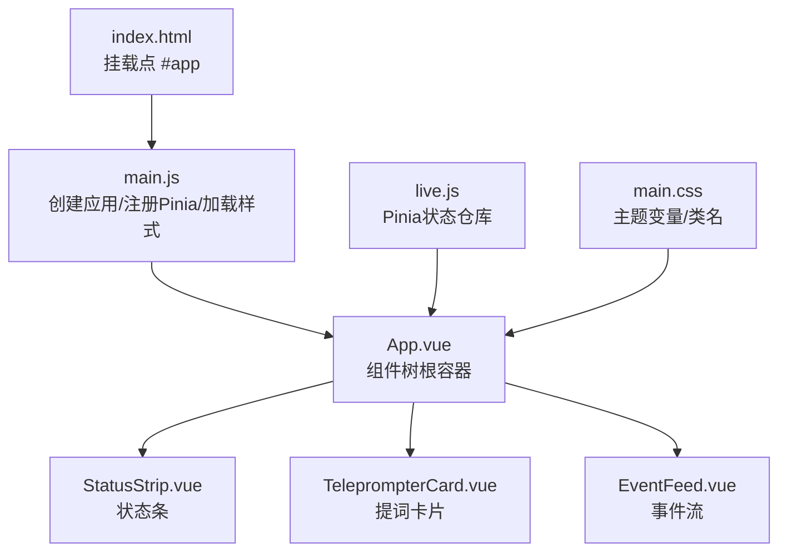
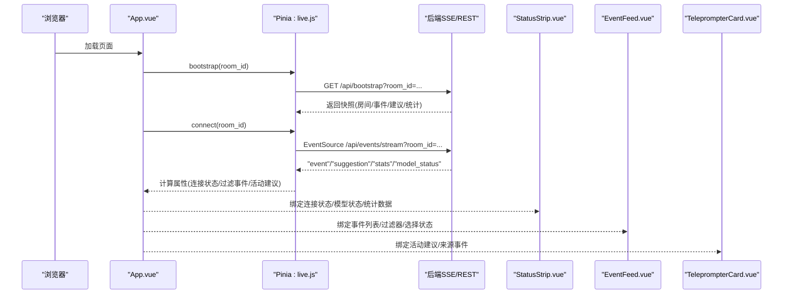
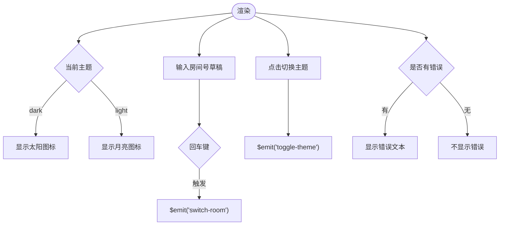
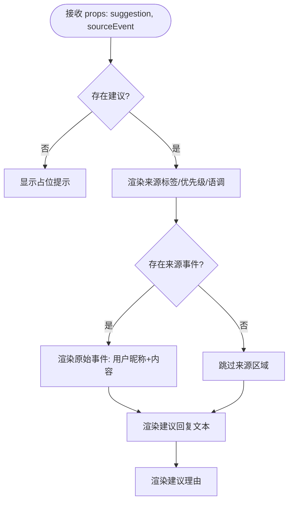
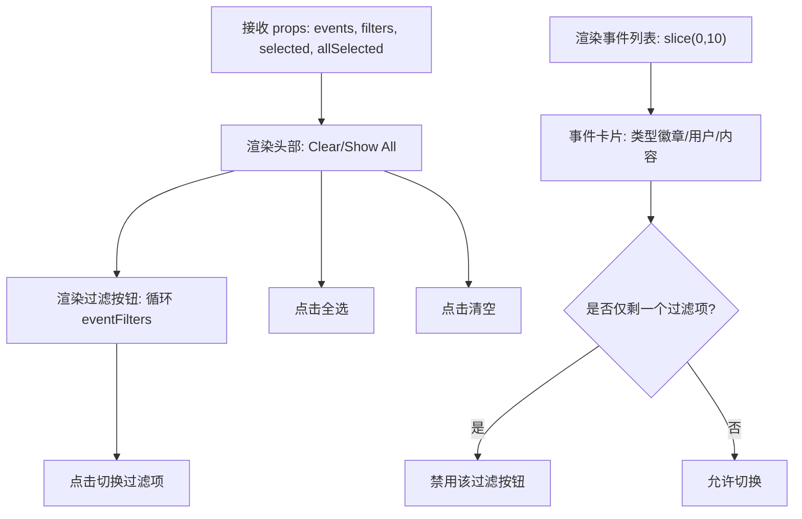
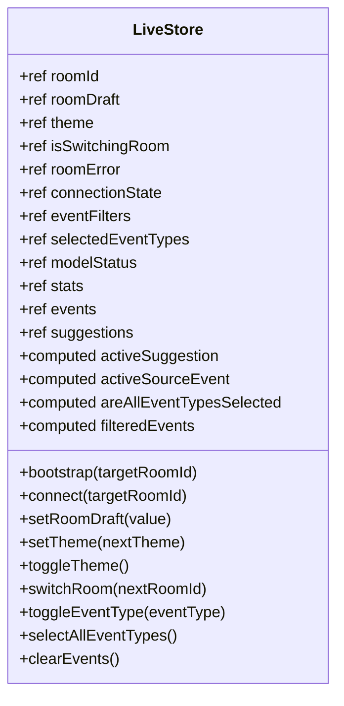
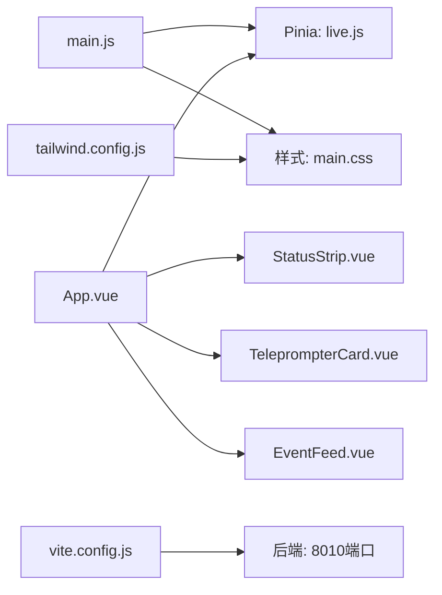

# 前端展示组件

<cite>
**本文引用的文件**
- [main.js](file://frontend/src/main.js)
- [App.vue](file://frontend/src/App.vue)
- [StatusStrip.vue](file://frontend/src/components/StatusStrip.vue)
- [EventFeed.vue](file://frontend/src/components/EventFeed.vue)
- [TeleprompterCard.vue](file://frontend/src/components/TeleprompterCard.vue)
- [live.js](file://frontend/src/stores/live.js)
- [main.css](file://frontend/src/assets/main.css)
- [package.json](file://frontend/package.json)
- [vite.config.js](file://frontend/vite.config.js)
- [tailwind.config.js](file://frontend/tailwind.config.js)
- [index.html](file://frontend/index.html)
</cite>

## 目录
1. [简介](#简介)
2. [项目结构](#项目结构)
3. [核心组件](#核心组件)
4. [架构总览](#架构总览)
5. [详细组件分析](#详细组件分析)
6. [依赖关系分析](#依赖关系分析)
7. [性能考量](#性能考量)
8. [故障排查指南](#故障排查指南)
9. [结论](#结论)
10. [附录](#附录)

## 简介
本技术文档面向抖音直播实时提词器的前端展示层，聚焦于Vue 3应用的整体架构、组件树结构、样式系统以及状态管理。文档将深入解析以下要点：
- 应用入口与初始化流程
- 组件树与数据流
- 状态管理（Pinia）与实时事件流
- 三大核心UI组件的功能与实现细节
- 组件间通信机制与响应式更新策略
- 样式系统与主题切换
- 使用指南与定制化开发方案

## 项目结构
前端采用Vue 3 + Vite + TailwindCSS + Pinia的现代组合，目录组织清晰，遵循“按功能分层”的模块化思路：
- 入口与根组件：main.js、App.vue
- 核心展示组件：StatusStrip.vue、EventFeed.vue、TeleprompterCard.vue
- 状态管理：stores/live.js
- 样式系统：assets/main.css，Tailwind配置
- 构建与开发：package.json、vite.config.js、tailwind.config.js
- 应用挂载点：index.html

图表来源
- [index.html:1-16](file://frontend/index.html#L1-L16)
- [main.js:1-17](file://frontend/src/main.js#L1-L17)
- [App.vue:1-66](file://frontend/src/App.vue#L1-L66)
- [live.js:1-310](file://frontend/src/stores/live.js#L1-L310)
- [main.css:1-144](file://frontend/src/assets/main.css#L1-L144)

章节来源
- [main.js:1-17](file://frontend/src/main.js#L1-L17)
- [App.vue:1-66](file://frontend/src/App.vue#L1-L66)
- [index.html:1-16](file://frontend/index.html#L1-L16)

## 核心组件
本节概述三大核心UI组件的职责与交互：
- 状态条组件（StatusStrip.vue）：展示房间号、连接状态、模型状态、统计数据，并支持房间切换与主题切换。
- 提词卡片组件（TeleprompterCard.vue）：展示当前最优建议回复，包含来源标识与原始事件引用。
- 事件流组件（EventFeed.vue）：实时展示事件列表，支持事件类型过滤、全选与清空。

章节来源
- [StatusStrip.vue:1-144](file://frontend/src/components/StatusStrip.vue#L1-L144)
- [TeleprompterCard.vue:1-83](file://frontend/src/components/TeleprompterCard.vue#L1-L83)
- [EventFeed.vue:1-183](file://frontend/src/components/EventFeed.vue#L1-L183)

## 架构总览
整体架构围绕“根组件 + Pinia状态 + 三组件展示”展开，数据从后端SSE流经Pinia注入到组件，组件通过事件与方法与Pinia交互，形成单向数据流与双向绑定的混合模式。

图表来源
- [App.vue:29-32](file://frontend/src/App.vue#L29-L32)
- [live.js:158-205](file://frontend/src/stores/live.js#L158-L205)
- [StatusStrip.vue:44-143](file://frontend/src/components/StatusStrip.vue#L44-L143)
- [EventFeed.vue:88-182](file://frontend/src/components/EventFeed.vue#L88-L182)
- [TeleprompterCard.vue:34-82](file://frontend/src/components/TeleprompterCard.vue#L34-L82)

## 详细组件分析

### 状态条组件（StatusStrip.vue）
职责与特性
- 展示房间号、连接状态、评论数、模型状态与总事件数
- 支持房间号草稿输入与回车触发切换
- 支持主题切换按钮，根据当前主题显示不同图标
- 错误提示在房间切换失败时显示

关键交互
- 接收来自Pinia的只读状态（如连接状态、模型状态、统计数据）
- 通过事件向上抛出：更新房间草稿、切换房间、切换主题
- 通过条件渲染与样式类名实现视觉反馈

图表来源
- [StatusStrip.vue:48-116](file://frontend/src/components/StatusStrip.vue#L48-L116)
- [StatusStrip.vue:118-141](file://frontend/src/components/StatusStrip.vue#L118-L141)

章节来源
- [StatusStrip.vue:1-144](file://frontend/src/components/StatusStrip.vue#L1-L144)

### 提词卡片组件（TeleprompterCard.vue）
职责与特性
- 展示当前最优建议回复（reply_text）
- 显示建议来源（模型/规则/规则兜底）与优先级、语调等元信息
- 可选地展示原始事件（来源事件），用于上下文关联
- 无建议时显示占位提示

关键交互
- 接收活动建议与来源事件作为props
- 通过辅助函数将内部枚举映射为可读标签
- 使用预定义的CSS类名实现统一风格

图表来源
- [TeleprompterCard.vue:13-31](file://frontend/src/components/TeleprompterCard.vue#L13-L31)
- [TeleprompterCard.vue:34-82](file://frontend/src/components/TeleprompterCard.vue#L34-L82)

章节来源
- [TeleprompterCard.vue:1-83](file://frontend/src/components/TeleprompterCard.vue#L1-L83)

### 事件流组件（EventFeed.vue）
职责与特性
- 实时展示最近事件，支持事件类型过滤
- 提供“全选/清空”操作
- 事件卡片按类型着色，突出关键信息（用户、内容）

关键交互
- 接收事件数组、过滤器、已选类型与“是否全选”状态
- 通过事件切换过滤项、全选/清空
- 渲染事件卡片，限制展示数量并支持滚动查看

图表来源
- [EventFeed.vue:1-22](file://frontend/src/components/EventFeed.vue#L1-L22)
- [EventFeed.vue:88-182](file://frontend/src/components/EventFeed.vue#L88-L182)

章节来源
- [EventFeed.vue:1-183](file://frontend/src/components/EventFeed.vue#L1-L183)

### 状态管理（live.js）与实时同步
Pinia状态仓库负责：
- 房间与草稿、主题、连接状态、过滤器、模型状态、统计数据、事件与建议队列
- 计算属性：活动建议、活动来源事件、是否全选、过滤后的事件
- 生命周期：bootstrap加载快照、connect建立SSE流、switchRoom切换房间
- 本地持久化：事件类型过滤与主题偏好

图表来源
- [live.js:70-309](file://frontend/src/stores/live.js#L70-L309)

章节来源
- [live.js:1-310](file://frontend/src/stores/live.js#L1-L310)

## 依赖关系分析
- 应用入口依赖：Vue应用实例、Pinia、全局样式
- 根组件依赖：三个子组件与Pinia状态
- 子组件依赖：Props与事件、Tailwind类名、主题变量
- 构建工具：Vite代理到后端8010端口，Tailwind扫描组件路径

图表来源
- [main.js:6-16](file://frontend/src/main.js#L6-L16)
- [App.vue:5-63](file://frontend/src/App.vue#L5-L63)
- [vite.config.js:10-22](file://frontend/vite.config.js#L10-L22)
- [tailwind.config.js:2-22](file://frontend/tailwind.config.js#L2-L22)

章节来源
- [package.json:1-23](file://frontend/package.json#L1-L23)
- [vite.config.js:1-23](file://frontend/vite.config.js#L1-L23)
- [tailwind.config.js:1-23](file://frontend/tailwind.config.js#L1-L23)

## 性能考量
- 事件与建议队列上限控制：避免内存膨胀与渲染压力
- 计算属性缓存：过滤后的事件与活动建议基于响应式状态自动更新
- 滚动容器：事件列表使用滚动容器，减少DOM节点数量
- 主题切换：通过dataset切换，避免重排抖动
- 构建优化：Vite按需加载，Tailwind按文件扫描，减少无关样式

## 故障排查指南
常见问题与定位建议
- 无法连接SSE或房间切换失败
  - 检查后端服务是否运行在8010端口
  - 查看浏览器网络面板中的SSE与REST请求
  - 关注Pinia中的连接状态与错误信息
- 切换房间后未生效
  - 确认switchRoom流程中的错误回退逻辑是否触发
  - 检查bootstrap与connect是否重新执行
- 事件未显示或过滤异常
  - 检查事件类型过滤的本地存储与默认值
  - 确认事件流是否正确推送事件、建议、统计与模型状态
- 主题切换无效
  - 检查localStorage中的主题键值与applyTheme是否执行

章节来源
- [live.js:173-250](file://frontend/src/stores/live.js#L173-L250)
- [live.js:41-60](file://frontend/src/stores/live.js#L41-L60)
- [live.js:129-135](file://frontend/src/stores/live.js#L129-L135)

## 结论
本前端展示层以Vue 3为核心，结合Pinia进行集中状态管理，配合TailwindCSS的主题系统与Vite开发体验，实现了低耦合、高内聚的组件化架构。通过SSE与REST的双通道数据流，组件能够实时响应后端变化，满足直播场景下的高效展示需求。建议在后续迭代中进一步完善错误边界与日志上报，增强可维护性与可观测性。

## 附录

### 组件使用指南
- 状态条组件
  - 适用场景：顶部状态栏，包含房间号、连接状态、模型状态与统计数据
  - 关键属性：roomId、roomDraft、theme、nextThemeLabel、isSwitchingRoom、roomError、connectionState、modelStatus、stats
  - 关键事件：update-room-draft、switch-room、toggle-theme
- 提词卡片组件
  - 适用场景：展示当前最优建议回复与来源上下文
  - 关键属性：suggestion、sourceEvent
  - 关键行为：根据来源类型与优先级渲染
- 事件流组件
  - 适用场景：展示实时事件流，支持过滤与清空
  - 关键属性：events、eventFilters、selectedEventTypes、areAllEventTypesSelected
  - 关键事件：toggle-filter、select-all-filters、clear-events

章节来源
- [StatusStrip.vue:1-42](file://frontend/src/components/StatusStrip.vue#L1-L42)
- [TeleprompterCard.vue:1-32](file://frontend/src/components/TeleprompterCard.vue#L1-L32)
- [EventFeed.vue:1-22](file://frontend/src/components/EventFeed.vue#L1-L22)

### 定制化开发方案
- 新增事件类型
  - 在Pinia中扩展事件过滤器数组与默认可见集合
  - 在事件流组件中扩展事件卡片样式与徽章映射
- 自定义主题
  - 在样式中新增主题变量，或扩展Tailwind颜色映射
  - 在Pinia中扩展主题键值与持久化逻辑
- 扩展建议来源
  - 在提词卡片中扩展来源标签映射
  - 在Pinia中扩展模型状态字段以反映新来源
- 性能优化
  - 对事件列表增加虚拟滚动
  - 对SSE连接增加心跳与断线重连策略
  - 对计算属性进行更细粒度的缓存拆分

章节来源
- [live.js:7-18](file://frontend/src/stores/live.js#L7-L18)
- [EventFeed.vue:52-85](file://frontend/src/components/EventFeed.vue#L52-L85)
- [TeleprompterCard.vue:13-23](file://frontend/src/components/TeleprompterCard.vue#L13-L23)
- [main.css:5-64](file://frontend/src/assets/main.css#L5-L64)
- [tailwind.config.js:4-19](file://frontend/tailwind.config.js#L4-L19)