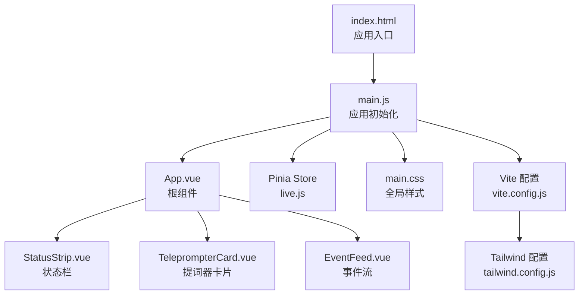
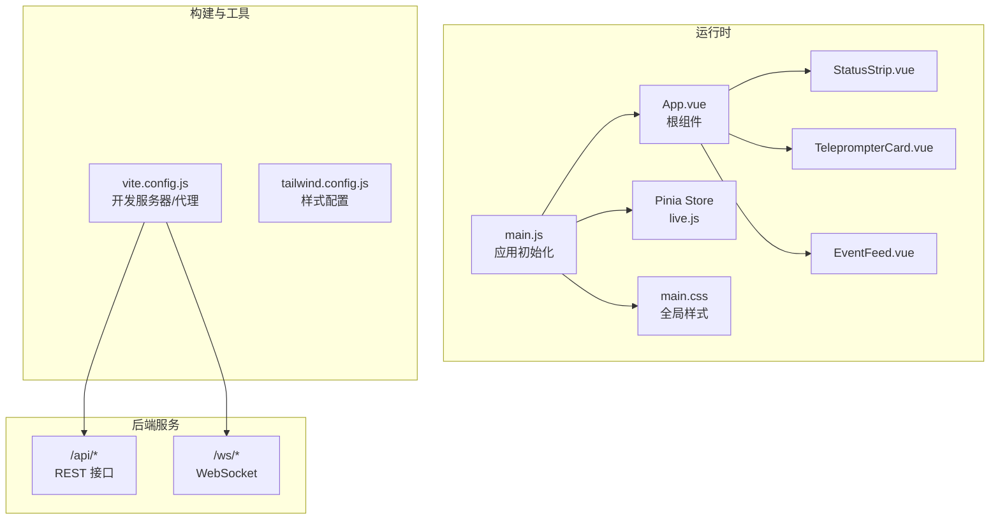
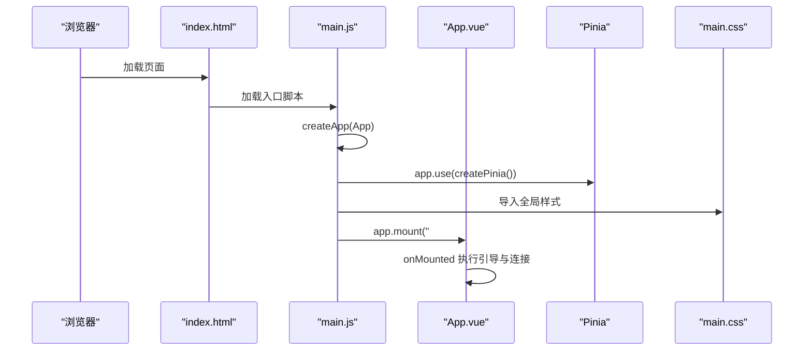
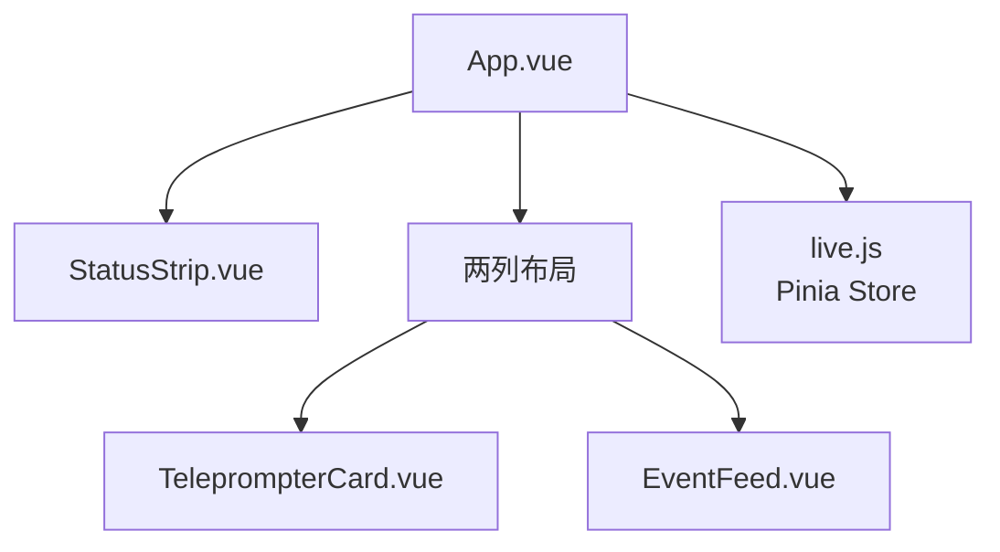
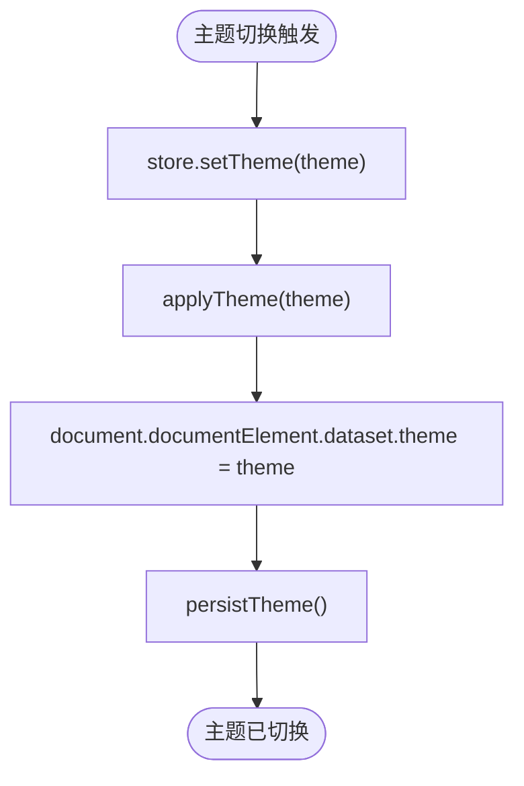
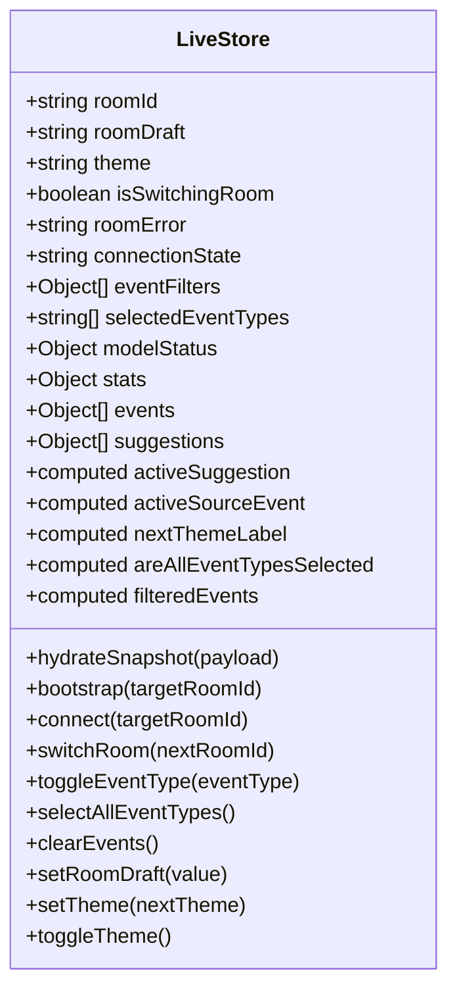
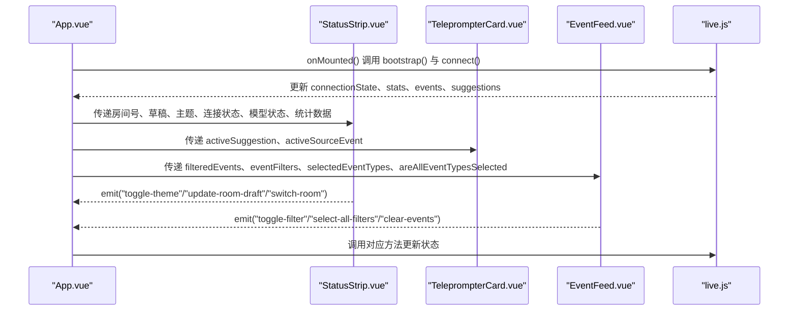
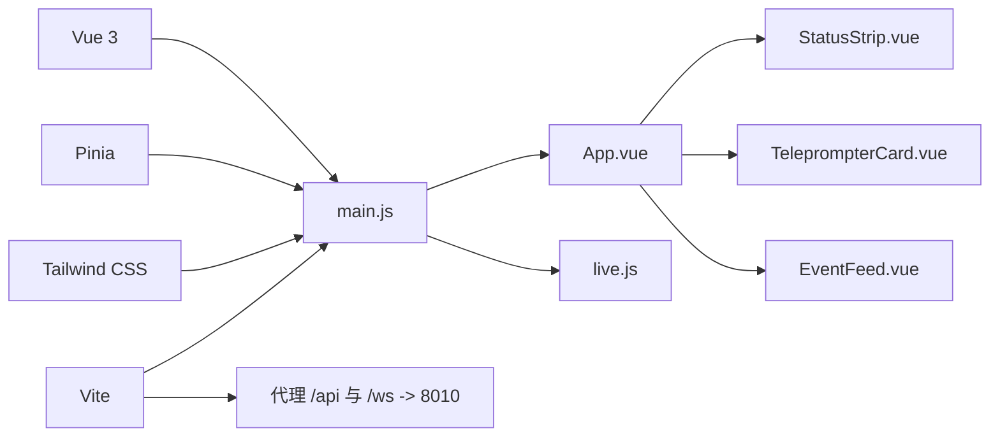

# 应用架构设计

<cite>
**本文档引用的文件**
- [main.js](file://frontend/src/main.js)
- [App.vue](file://frontend/src/App.vue)
- [main.css](file://frontend/src/assets/main.css)
- [live.js](file://frontend/src/stores/live.js)
- [EventFeed.vue](file://frontend/src/components/EventFeed.vue)
- [StatusStrip.vue](file://frontend/src/components/StatusStrip.vue)
- [TeleprompterCard.vue](file://frontend/src/components/TeleprompterCard.vue)
- [package.json](file://frontend/package.json)
- [vite.config.js](file://frontend/vite.config.js)
- [tailwind.config.js](file://frontend/tailwind.config.js)
- [index.html](file://frontend/index.html)
</cite>

## 目录
1. [简介](#简介)
2. [项目结构](#项目结构)
3. [核心组件](#核心组件)
4. [架构总览](#架构总览)
5. [详细组件分析](#详细组件分析)
6. [依赖关系分析](#依赖关系分析)
7. [性能考虑](#性能考虑)
8. [故障排除指南](#故障排除指南)
9. [结论](#结论)
10. [附录](#附录)

## 简介
本技术文档面向抖音直播实时提词器的前端应用，系统性阐述基于 Vue 3 的应用架构设计与实现细节。重点覆盖应用入口初始化流程（main.js）、根组件设计（App.vue）、Pinia 状态管理集成、全局样式主题系统（main.css）以及生命周期与依赖注入机制。文档同时提供模块化导入策略、最佳实践与扩展指南，帮助开发者快速理解并高效迭代该应用。

## 项目结构
前端采用典型的 Vue 3 单页应用（SPA）结构，核心目录与文件如下：
- 入口与根组件：src/main.js、src/App.vue
- 样式系统：src/assets/main.css
- 状态管理：src/stores/live.js
- 页面组件：src/components/EventFeed.vue、src/components/StatusStrip.vue、src/components/TeleprompterCard.vue
- 构建与工具：package.json、vite.config.js、tailwind.config.js
- HTML 入口：index.html

图表来源
- [index.html:1-16](file://frontend/index.html#L1-L16)
- [main.js:1-17](file://frontend/src/main.js#L1-L17)
- [App.vue:1-66](file://frontend/src/App.vue#L1-L66)
- [live.js:1-310](file://frontend/src/stores/live.js#L1-L310)
- [main.css:1-144](file://frontend/src/assets/main.css#L1-L144)
- [vite.config.js:1-23](file://frontend/vite.config.js#L1-L23)
- [tailwind.config.js:1-23](file://frontend/tailwind.config.js#L1-L23)

章节来源
- [index.html:1-16](file://frontend/index.html#L1-L16)
- [main.js:1-17](file://frontend/src/main.js#L1-L17)
- [package.json:1-23](file://frontend/package.json#L1-L23)

## 核心组件
本节聚焦应用入口、根组件与状态管理的核心职责与交互。

- 应用入口（main.js）
  - 创建 Vue 应用实例并挂载到 HTML 中的根节点
  - 注册 Pinia，使全局状态在应用内统一管理
  - 在挂载前加载全局样式，确保主题与布局正确渲染
  - 代码片段路径：[main.js:12-16](file://frontend/src/main.js#L12-L16)

- 根组件（App.vue）
  - 使用组合式 API 引入并使用 Pinia store
  - 在挂载阶段执行引导与连接逻辑
  - 渲染状态栏、提词器卡片与事件流三大部分
  - 代码片段路径：[App.vue:29-32](file://frontend/src/App.vue#L29-L32)

- 状态管理（live.js）
  - 定义直播相关的响应式状态与派生状态
  - 提供房间切换、事件过滤、主题切换、SSE 连接等业务方法
  - 通过本地存储持久化用户偏好
  - 代码片段路径：[live.js:70-309](file://frontend/src/stores/live.js#L70-L309)

章节来源
- [main.js:1-17](file://frontend/src/main.js#L1-L17)
- [App.vue:1-66](file://frontend/src/App.vue#L1-L66)
- [live.js:1-310](file://frontend/src/stores/live.js#L1-L310)

## 架构总览
应用采用“入口初始化 + 根组件 + 状态管理 + 组件化视图”的分层架构。入口负责应用实例创建与依赖注入；根组件负责页面布局与生命周期触发；Pinia 提供跨组件的状态共享；Tailwind CSS 与自定义变量实现主题化样式体系；Vite 提供开发与构建支持，并通过代理连接后端服务。

图表来源
- [main.js:1-17](file://frontend/src/main.js#L1-L17)
- [App.vue:1-66](file://frontend/src/App.vue#L1-L66)
- [live.js:1-310](file://frontend/src/stores/live.js#L1-L310)
- [main.css:1-144](file://frontend/src/assets/main.css#L1-L144)
- [vite.config.js:1-23](file://frontend/vite.config.js#L1-L23)
- [tailwind.config.js:1-23](file://frontend/tailwind.config.js#L1-L23)

## 详细组件分析

### 应用入口初始化流程（main.js）
- 初始化步骤
  - 创建 Vue 应用实例并引入根组件
  - 注册 Pinia 插件以启用全局状态管理
  - 导入全局样式文件，确保主题与布局在挂载前生效
  - 将应用挂载至 HTML 中的根节点
- 生命周期与控制流
  - 应用实例创建后立即注册插件，避免后续组件访问状态时出现未注册问题
  - 全局样式的导入顺序保证了 DOM 挂载时的视觉一致性
- 依赖注入机制
  - 通过 createApp(App) 将根组件注入应用实例
  - 通过 app.use(createPinia()) 注入状态管理能力
- 模块化导入策略
  - 明确的相对路径导入，便于 IDE 识别与重构
  - 入口文件保持最小化职责，避免过早引入复杂逻辑

图表来源
- [index.html:1-16](file://frontend/index.html#L1-L16)
- [main.js:1-17](file://frontend/src/main.js#L1-L17)
- [App.vue:29-32](file://frontend/src/App.vue#L29-L32)

章节来源
- [main.js:1-17](file://frontend/src/main.js#L1-L17)
- [index.html:1-16](file://frontend/index.html#L1-L16)

### 根组件设计与组件树（App.vue）
- 设计架构
  - 使用组合式 API 引入 Pinia store 并解构多个响应式状态
  - 在 mounted 生命周期中执行引导与连接，确保 DOM 可用后再发起网络请求
  - 采用语义化布局容器，约束最大宽度与间距，适配多尺寸屏幕
- 组件树结构
  - 上部：状态栏组件（StatusStrip），展示房间号、连接状态、统计信息与模型状态
  - 中部：两列布局，左侧提词器卡片（TeleprompterCard），右侧事件流（EventFeed）
  - 通过属性绑定与事件监听实现父子通信
- 数据流
  - 状态来源于 Pinia store，通过 storeToRefs 解包为可响应引用
  - 事件通过 emits 传递到父组件，再调用 store 方法更新状态

图表来源
- [App.vue:1-66](file://frontend/src/App.vue#L1-L66)
- [StatusStrip.vue:1-144](file://frontend/src/components/StatusStrip.vue#L1-L144)
- [TeleprompterCard.vue:1-83](file://frontend/src/components/TeleprompterCard.vue#L1-L83)
- [EventFeed.vue:1-183](file://frontend/src/components/EventFeed.vue#L1-L183)
- [live.js:1-310](file://frontend/src/stores/live.js#L1-L310)

章节来源
- [App.vue:1-66](file://frontend/src/App.vue#L1-L66)

### 全局样式系统与主题组织（main.css）
- 主题组织方式
  - 使用 CSS 自定义属性（CSS Variables）定义主题变量，分别在暗色与亮色主题下提供不同取值
  - 通过 data-theme 属性在根元素上切换主题，实现全站级主题切换
  - Tailwind 配置映射变量为颜色与字体族，确保类名与变量一致
- 样式管理策略
  - 采用 Tailwind 原子化类名与自定义样式类结合的方式
  - 为提词器组件定义专用样式类（如 teleprompter-*），隔离组件样式边界
  - 使用过渡动画与阴影变量，提升视觉层次与交互反馈
- 主题切换流程
  - store 中设置主题并写入 localStorage，同时更新根元素 data-theme
  - 样式文件根据主题变量自动重绘，无需重新加载页面

图表来源
- [live.js:54-68](file://frontend/src/stores/live.js#L54-L68)
- [main.css:5-64](file://frontend/src/assets/main.css#L5-L64)
- [tailwind.config.js:4-19](file://frontend/tailwind.config.js#L4-L19)

章节来源
- [main.css:1-144](file://frontend/src/assets/main.css#L1-L144)
- [tailwind.config.js:1-23](file://frontend/tailwind.config.js#L1-L23)
- [live.js:54-68](file://frontend/src/stores/live.js#L54-L68)

### 状态管理与业务逻辑（live.js）
- 状态定义
  - 房间标识、草稿、主题、连接状态、事件过滤器、选中事件类型、统计数据、事件队列、建议队列等
  - 通过 ref 与 computed 实现响应式与派生状态，减少重复计算
- 业务方法
  - 引导（bootstrap）：拉取快照数据并填充状态
  - 连接（connect）：建立 SSE 连接，监听事件、建议、统计与模型状态
  - 切换房间（switchRoom）：校验输入、调用后端接口、回滚错误处理
  - 事件过滤（toggleEventType/selectAllEventTypes/clearEvents）：维护过滤状态并持久化
  - 主题切换（toggleTheme/setTheme）：更新主题并持久化
- 错误处理与回退
  - 切换房间失败时回滚到旧快照并重新连接
  - SSE 连接异常时进入重连状态
- 性能优化
  - 限制事件与建议的最大数量，避免内存膨胀
  - 使用 computed 缓存派生结果，减少模板渲染开销

图表来源
- [live.js:70-309](file://frontend/src/stores/live.js#L70-L309)

章节来源
- [live.js:1-310](file://frontend/src/stores/live.js#L1-L310)

### 组件交互与事件流
- 状态栏（StatusStrip.vue）
  - 接收房间号、草稿、主题、连接状态、模型状态与统计数据
  - 支持切换主题、更新房间草稿、触发切换房间
- 提词器卡片（TeleprompterCard.vue）
  - 展示当前优先建议、来源事件与建议理由
  - 根据建议来源与优先级显示不同样式
- 事件流（EventFeed.vue）
  - 展示最近事件列表，支持按事件类型筛选与清空
  - 根据事件类型动态设置边框与背景色

图表来源
- [App.vue:35-64](file://frontend/src/App.vue#L35-L64)
- [StatusStrip.vue:44-143](file://frontend/src/components/StatusStrip.vue#L44-L143)
- [TeleprompterCard.vue:34-82](file://frontend/src/components/TeleprompterCard.vue#L34-L82)
- [EventFeed.vue:88-182](file://frontend/src/components/EventFeed.vue#L88-L182)
- [live.js:158-250](file://frontend/src/stores/live.js#L158-L250)

章节来源
- [App.vue:1-66](file://frontend/src/App.vue#L1-L66)
- [StatusStrip.vue:1-144](file://frontend/src/components/StatusStrip.vue#L1-L144)
- [TeleprompterCard.vue:1-83](file://frontend/src/components/TeleprompterCard.vue#L1-L83)
- [EventFeed.vue:1-183](file://frontend/src/components/EventFeed.vue#L1-L183)
- [live.js:158-250](file://frontend/src/stores/live.js#L158-L250)

## 依赖关系分析
- 外部依赖
  - Vue 3：提供响应式系统与组件框架
  - Pinia：提供集中式状态管理
  - Tailwind CSS：提供原子化样式与主题变量
  - Vite：提供开发服务器、代理与构建工具链
- 内部依赖
  - main.js 依赖 App.vue、Pinia、main.css
  - App.vue 依赖三个子组件与 live.js
  - 子组件之间无直接依赖，通过 props 与 emits 通信
- 构建与代理
  - Vite 将 /api 与 /ws 代理到后端 8010 端口，简化前后端联调

图表来源
- [package.json:11-21](file://frontend/package.json#L11-L21)
- [main.js:6-10](file://frontend/src/main.js#L6-L10)
- [vite.config.js:8-22](file://frontend/vite.config.js#L8-L22)

章节来源
- [package.json:1-23](file://frontend/package.json#L1-L23)
- [vite.config.js:1-23](file://frontend/vite.config.js#L1-L23)

## 性能考虑
- 状态规模控制
  - 事件与建议队列上限常量控制内存占用，避免无限增长
  - 通过 slice 截断与 computed 缓存降低渲染压力
- 渲染优化
  - 使用 Tailwind 原子化类名减少自定义样式体积
  - 组件内部使用 v-if/v-show 控制条件渲染，避免不必要的 DOM
- 网络与连接
  - SSE 连接状态机明确区分连接中、直播、重连等状态，便于 UI 反馈与错误恢复
  - 切换房间时关闭旧连接，防止资源泄漏
- 主题切换
  - 通过 CSS 变量与 data-theme 切换，避免样式重载带来的抖动

## 故障排除指南
- 主题不生效
  - 检查根元素是否包含正确的 data-theme 属性
  - 确认 localStorage 中的主题键值存在且有效
  - 参考路径：[live.js:54-68](file://frontend/src/stores/live.js#L54-L68)
- 切换房间失败
  - 查看 store 中的错误提示与回滚逻辑
  - 确认后端 /api/room 接口返回格式与状态码
  - 参考路径：[live.js:207-250](file://frontend/src/stores/live.js#L207-L250)
- 事件流无数据
  - 检查 SSE 连接状态与事件监听器是否正常
  - 确认 /api/events/stream 是否返回预期事件
  - 参考路径：[live.js:173-205](file://frontend/src/stores/live.js#L173-L205)
- 开发代理无法访问后端
  - 检查 Vite 代理配置与目标端口
  - 确认后端服务已在 8010 端口运行
  - 参考路径：[vite.config.js:10-22](file://frontend/vite.config.js#L10-L22)

章节来源
- [live.js:54-68](file://frontend/src/stores/live.js#L54-L68)
- [live.js:207-250](file://frontend/src/stores/live.js#L207-L250)
- [live.js:173-205](file://frontend/src/stores/live.js#L173-L205)
- [vite.config.js:10-22](file://frontend/vite.config.js#L10-L22)

## 结论
该前端应用以 Vue 3 为核心，结合 Pinia 实现统一状态管理，通过 Tailwind 与 CSS 变量构建主题化样式体系，并以组件化方式组织视图层。入口初始化流程简洁清晰，根组件承担布局与生命周期触发，状态管理封装业务逻辑与持久化策略。整体架构具备良好的可维护性与扩展性，适合进一步引入更多直播场景功能与交互优化。

## 附录
- 最佳实践
  - 将所有副作用集中在 store 中，组件仅负责渲染与事件分发
  - 使用 computed 缓存派生状态，减少模板计算成本
  - 通过 props 与 emits 明确组件间通信契约，避免隐式依赖
- 扩展指南
  - 新增事件类型：在 store 中扩展 EVENT_FILTERS 与默认可见集合，并同步 UI 与本地存储逻辑
  - 新增主题：在 main.css 中新增主题变量与映射类，更新 applyTheme 与持久化逻辑
  - 新增组件：遵循现有 props/emits 规范，避免直接访问 store，通过事件向上通信