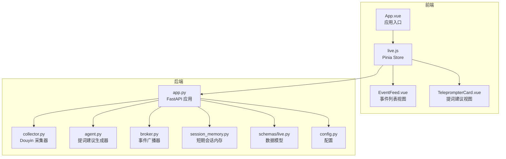
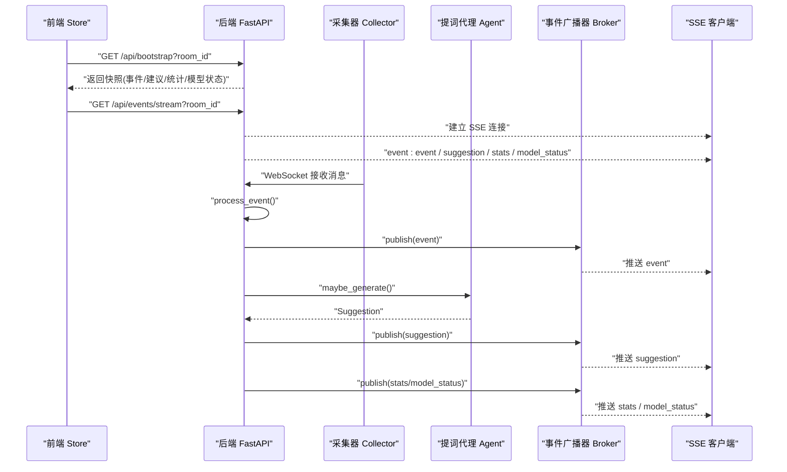
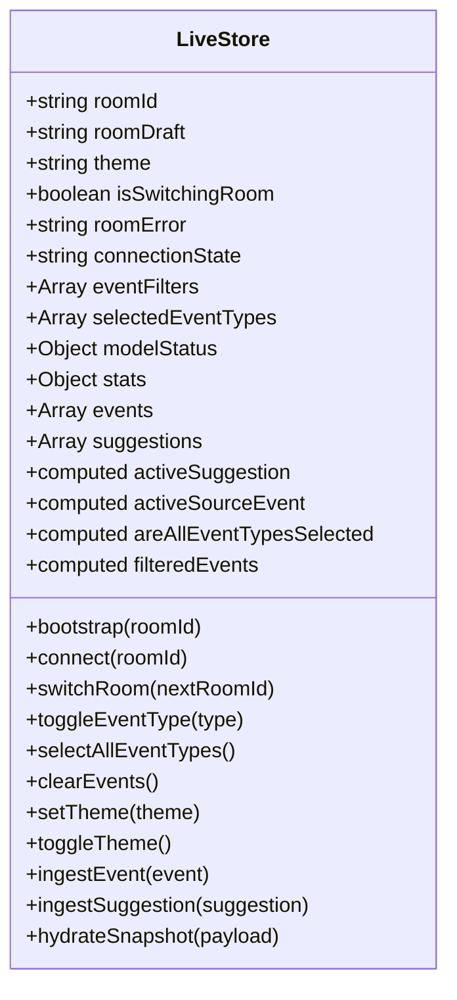
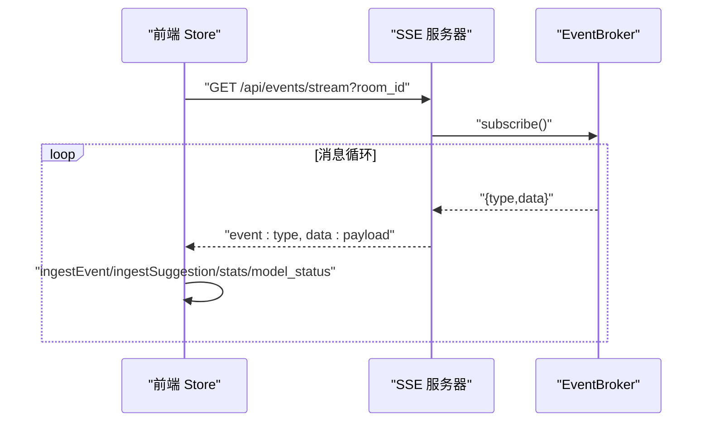
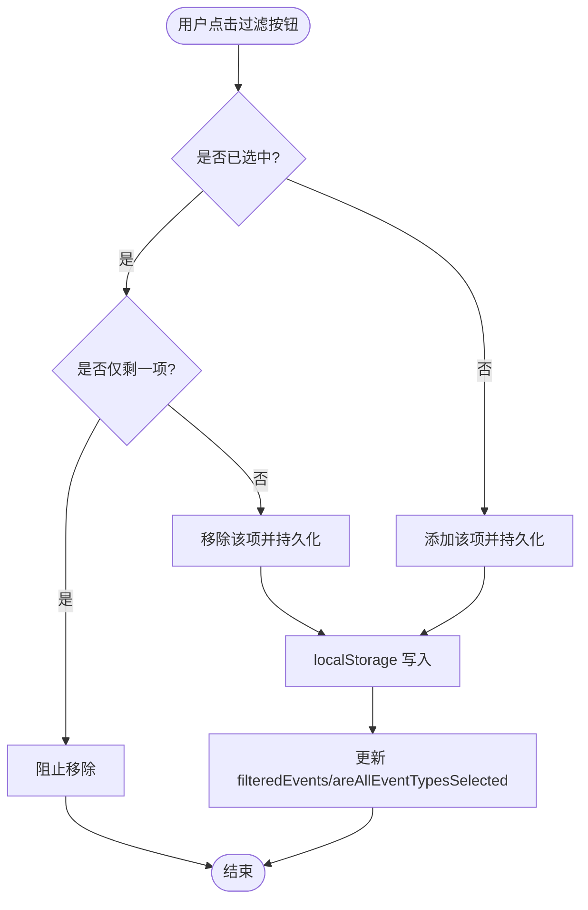
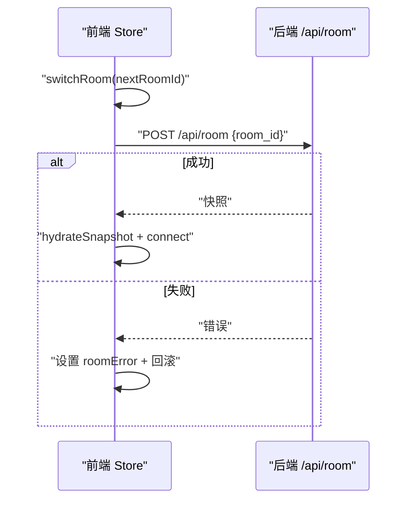
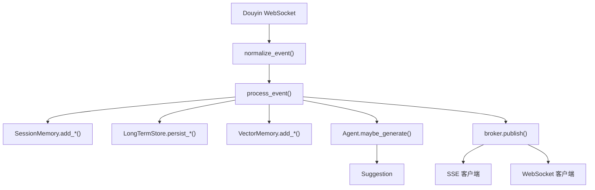
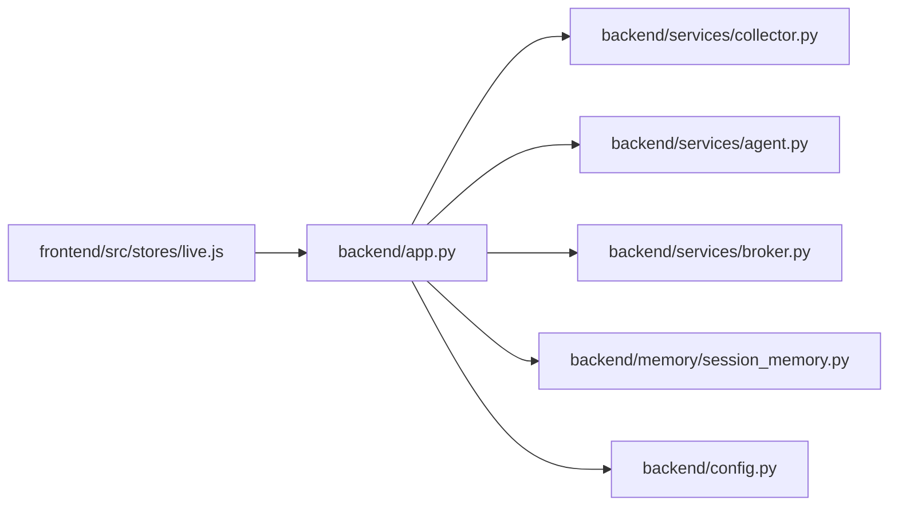

# 状态管理系统

<cite>
**本文引用的文件**
- [frontend/src/stores/live.js](file://frontend/src/stores/live.js)
- [frontend/src/components/EventFeed.vue](file://frontend/src/components/EventFeed.vue)
- [frontend/src/components/TeleprompterCard.vue](file://frontend/src/components/TeleprompterCard.vue)
- [frontend/src/App.vue](file://frontend/src/App.vue)
- [backend/app.py](file://backend/app.py)
- [backend/services/collector.py](file://backend/services/collector.py)
- [backend/services/agent.py](file://backend/services/agent.py)
- [backend/services/broker.py](file://backend/services/broker.py)
- [backend/memory/session_memory.py](file://backend/memory/session_memory.py)
- [backend/schemas/live.py](file://backend/schemas/live.py)
- [backend/config.py](file://backend/config.py)
</cite>

## 目录
1. [简介](#简介)
2. [项目结构](#项目结构)
3. [核心组件](#核心组件)
4. [架构总览](#架构总览)
5. [详细组件分析](#详细组件分析)
6. [依赖关系分析](#依赖关系分析)
7. [性能考量](#性能考量)
8. [故障排查指南](#故障排查指南)
9. [结论](#结论)
10. [附录](#附录)

## 简介
本文件面向抖音直播实时提词器的“状态管理系统”，围绕 Pinia Store 的设计与实现，系统性阐述以下主题：
- 实时状态同步机制（SSE 事件流）
- 事件过滤系统与用户交互状态
- 房间切换状态管理
- 状态数据结构（直播事件、提词建议、连接状态、模型状态）
- 核心功能：事件实时更新、过滤条件动态调整、房间状态切换
- 前后端交互模式：SSE 连接管理与消息分发
- 最佳实践与性能优化建议

## 项目结构
该系统采用前后端分离架构：
- 前端使用 Vue 3 + Pinia，集中管理直播事件、建议、过滤器、主题、连接状态等
- 后端使用 FastAPI，负责采集抖音直播消息、生成提词建议、维护会话内存、通过 SSE/WS 广播事件

图表来源
- [frontend/src/App.vue:1-66](file://frontend/src/App.vue#L1-L66)
- [frontend/src/stores/live.js:1-310](file://frontend/src/stores/live.js#L1-L310)
- [backend/app.py:1-220](file://backend/app.py#L1-L220)
- [backend/services/collector.py:1-284](file://backend/services/collector.py#L1-L284)
- [backend/services/agent.py:1-393](file://backend/services/agent.py#L1-L393)
- [backend/services/broker.py:1-40](file://backend/services/broker.py#L1-L40)
- [backend/memory/session_memory.py:1-113](file://backend/memory/session_memory.py#L1-L113)
- [backend/schemas/live.py:1-95](file://backend/schemas/live.py#L1-L95)
- [backend/config.py:1-94](file://backend/config.py#L1-L94)

章节来源
- [frontend/src/App.vue:1-66](file://frontend/src/App.vue#L1-L66)
- [frontend/src/stores/live.js:1-310](file://frontend/src/stores/live.js#L1-L310)
- [backend/app.py:1-220](file://backend/app.py#L1-L220)

## 核心组件
- Pinia Store（live.js）：集中管理房间号、过滤器、主题、连接状态、事件列表、建议列表、模型状态、统计数据等，并提供房间切换、过滤器切换、SSE 连接等方法
- 组件层（EventFeed.vue、TeleprompterCard.vue）：消费 Store 状态，渲染事件列表与提词建议
- 后端应用（app.py）：提供 /api/bootstrap、/api/room、/api/events/stream 等接口，负责事件处理、建议生成、SSE 广播
- 采集器（collector.py）：连接抖音 WebSocket，解析消息为 LiveEvent，提交到事件处理流程
- 提词代理（agent.py）：根据事件与上下文生成建议，支持在线模型与规则回退
- 事件广播器（broker.py）：维护订阅队列，向 SSE/WS 订阅者广播事件
- 会话内存（session_memory.py）：短期事件与建议存储，支持 Redis 与进程内降级
- 数据模型（schemas/live.py）：定义 LiveEvent、Suggestion、SessionStats、ModelStatus、SessionSnapshot
- 配置（config.py）：统一加载环境变量与默认值

章节来源
- [frontend/src/stores/live.js:70-310](file://frontend/src/stores/live.js#L70-L310)
- [backend/app.py:49-78](file://backend/app.py#L49-L78)
- [backend/services/collector.py:38-284](file://backend/services/collector.py#L38-L284)
- [backend/services/agent.py:23-393](file://backend/services/agent.py#L23-L393)
- [backend/services/broker.py:10-40](file://backend/services/broker.py#L10-L40)
- [backend/memory/session_memory.py:17-113](file://backend/memory/session_memory.py#L17-L113)
- [backend/schemas/live.py:29-95](file://backend/schemas/live.py#L29-L95)
- [backend/config.py:39-94](file://backend/config.py#L39-L94)

## 架构总览
系统以“前端 Store + 后端事件处理”为核心，通过 SSE 将事件与建议实时推送到前端，同时支持 WebSocket 作为补充通道。采集器负责从抖音 WebSocket 接收消息，标准化为 LiveEvent，交由后端处理链路生成建议并写入内存，随后通过广播器分发到 SSE/WS 客户端。

图表来源
- [frontend/src/stores/live.js:158-205](file://frontend/src/stores/live.js#L158-L205)
- [backend/app.py:109-206](file://backend/app.py#L109-L206)
- [backend/services/collector.py:140-284](file://backend/services/collector.py#L140-L284)
- [backend/services/agent.py:73-95](file://backend/services/agent.py#L73-L95)
- [backend/services/broker.py:28-40](file://backend/services/broker.py#L28-L40)

## 详细组件分析

### Pinia Store 设计与状态结构
- 状态键
  - 房间标识：roomId、roomDraft
  - 连接状态：connectionState（connecting/live/reconnecting/switching）
  - 过滤器：eventFilters、selectedEventTypes、areAllEventTypesSelected
  - 主题：theme、nextThemeLabel
  - 房间切换错误：isSwitchingRoom、roomError
  - 事件与建议：events（最多 MAX_EVENTS）、suggestions（最多 MAX_SUGGESTIONS）
  - 统计与模型状态：stats、modelStatus
  - 计算属性：activeSuggestion、activeSourceEvent、filteredEvents
- 方法
  - 生命周期：bootstrap()、connect()、closeStream()
  - 房间切换：switchRoom()
  - 过滤器：toggleEventType()、selectAllEventTypes()、clearEvents()
  - 主题：setTheme()、toggleTheme()
  - 数据注入：ingestEvent()、ingestSuggestion()、hydrateSnapshot()

图表来源
- [frontend/src/stores/live.js:70-310](file://frontend/src/stores/live.js#L70-L310)

章节来源
- [frontend/src/stores/live.js:70-310](file://frontend/src/stores/live.js#L70-L310)

### 实时状态同步机制（SSE）
- 前端通过 EventSource 订阅 /api/events/stream，按事件类型分发：
  - event：新增直播事件
  - suggestion：新生成的提词建议
  - stats：房间统计
  - model_status：模型状态
- 后端在 /api/events/stream 中：
  - 订阅 EventBroker 的队列
  - 过滤非目标房间的消息
  - 以 SSE 格式推送事件
- 连接状态机：
  - onopen -> connecting -> live
  - onerror -> reconnecting
  - 显式 closeStream() 用于房间切换或异常恢复

图表来源
- [frontend/src/stores/live.js:173-205](file://frontend/src/stores/live.js#L173-L205)
- [backend/app.py:187-206](file://backend/app.py#L187-L206)
- [backend/services/broker.py:16-40](file://backend/services/broker.py#L16-L40)

章节来源
- [frontend/src/stores/live.js:173-205](file://frontend/src/stores/live.js#L173-L205)
- [backend/app.py:187-206](file://backend/app.py#L187-L206)

### 事件过滤系统与用户交互状态
- 事件类型过滤器定义：comment、gift、follow、member、like、system
- 默认全选，支持用户逐项切换与一键全选
- 本地持久化：localStorage 存储 selected-event-types 与 theme
- 计算属性：
  - areAllEventTypesSelected：判断是否全选
  - filteredEvents：按 selectedEventTypes 过滤 events
  - activeSuggestion / activeSourceEvent：基于 suggestions 与 events 关联计算

图表来源
- [frontend/src/stores/live.js:252-273](file://frontend/src/stores/live.js#L252-L273)
- [frontend/src/stores/live.js:106-111](file://frontend/src/stores/live.js#L106-L111)

章节来源
- [frontend/src/stores/live.js:252-273](file://frontend/src/stores/live.js#L252-L273)
- [frontend/src/stores/live.js:106-111](file://frontend/src/stores/live.js#L106-L111)

### 房间切换状态管理
- 流程
  - 输入校验与去空格
  - 设置 isSwitchingRoom、connectionState、roomError
  - 调用 /api/room 切换房间
  - 成功：hydrateSnapshot + connect
  - 失败：设置 roomError，回滚到旧房间并重新 connect
- 后端
  - /api/room 接收 POST，校验 room_id
  - 关闭旧会话、切换采集器房间、返回快照

图表来源
- [frontend/src/stores/live.js:207-250](file://frontend/src/stores/live.js#L207-L250)
- [backend/app.py:115-126](file://backend/app.py#L115-L126)

章节来源
- [frontend/src/stores/live.js:207-250](file://frontend/src/stores/live.js#L207-L250)
- [backend/app.py:115-126](file://backend/app.py#L115-L126)

### 状态数据结构
- LiveEvent：标准化后的直播事件，包含 event_id、room_id、event_type、method、user、content、metadata、raw 等
- Suggestion：提词建议，包含 suggestion_id、event_id、source、priority、reply_text、tone、reason、confidence、source_events、references、created_at
- SessionStats：房间统计，包含 total_events、comments、gifts、likes、members、follows
- ModelStatus：模型状态，包含 mode、model、backend、last_result、last_error、updated_at
- SessionSnapshot：前端引导快照，包含 room_id、recent_events、recent_suggestions、stats、model_status

章节来源
- [backend/schemas/live.py:29-95](file://backend/schemas/live.py#L29-L95)

### 后端事件处理与广播
- 采集器（DouyinCollector）：连接抖音 WebSocket，解析消息为 LiveEvent，提交到事件处理回调
- 事件处理（process_event）：写入短期内存、持久化、向向量库与长期存储写入、生成建议、统计并广播
- 广播器（EventBroker）：维护订阅队列，向 SSE/WS 分发事件
- SSE/WS 接口：/api/events/stream（SSE）、/ws/live（WebSocket）

图表来源
- [backend/services/collector.py:225-284](file://backend/services/collector.py#L225-L284)
- [backend/app.py:61-78](file://backend/app.py#L61-L78)
- [backend/services/broker.py:28-40](file://backend/services/broker.py#L28-L40)
- [backend/memory/session_memory.py:42-84](file://backend/memory/session_memory.py#L42-L84)

章节来源
- [backend/services/collector.py:225-284](file://backend/services/collector.py#L225-L284)
- [backend/app.py:61-78](file://backend/app.py#L61-L78)
- [backend/services/broker.py:28-40](file://backend/services/broker.py#L28-L40)
- [backend/memory/session_memory.py:42-84](file://backend/memory/session_memory.py#L42-L84)

### 组件与 Store 的交互
- App.vue：挂载时 bootstrap() + connect()，并将 Store 的响应式状态传递给子组件
- EventFeed.vue：接收 events、filters、selectedEventTypes、areAllEventTypesSelected，触发过滤切换、全选、清空事件
- TeleprompterCard.vue：接收 activeSuggestion 与 activeSourceEvent，展示建议与来源

章节来源
- [frontend/src/App.vue:29-66](file://frontend/src/App.vue#L29-L66)
- [frontend/src/components/EventFeed.vue:1-183](file://frontend/src/components/EventFeed.vue#L1-L183)
- [frontend/src/components/TeleprompterCard.vue:1-83](file://frontend/src/components/TeleprompterCard.vue#L1-L83)

## 依赖关系分析
- 前端 Store 依赖：
  - 本地存储（localStorage）进行过滤器与主题持久化
  - EventSource 进行 SSE 连接
  - Fetch 进行 /api/bootstrap 与 /api/room 请求
- 后端应用依赖：
  - EventBroker：事件广播
  - SessionMemory：短期事件/建议存储
  - LongTermStore/VectorMemory：长期存储与向量检索
  - LivePromptAgent：建议生成
  - Config：运行时配置

图表来源
- [frontend/src/stores/live.js:158-205](file://frontend/src/stores/live.js#L158-L205)
- [backend/app.py:61-78](file://backend/app.py#L61-L78)
- [backend/services/collector.py:38-80](file://backend/services/collector.py#L38-L80)
- [backend/services/agent.py:23-43](file://backend/services/agent.py#L23-L43)
- [backend/services/broker.py:10-21](file://backend/services/broker.py#L10-L21)
- [backend/memory/session_memory.py:17-31](file://backend/memory/session_memory.py#L17-L31)
- [backend/config.py:39-94](file://backend/config.py#L39-L94)

章节来源
- [frontend/src/stores/live.js:158-205](file://frontend/src/stores/live.js#L158-L205)
- [backend/app.py:61-78](file://backend/app.py#L61-L78)

## 性能考量
- 前端
  - 事件与建议列表上限：MAX_EVENTS、MAX_SUGGESTIONS，避免无限增长
  - 计算属性：filteredEvents、activeSuggestion、activeSourceEvent 在渲染层按需计算，减少重复遍历
  - localStorage 持久化：仅在必要时写入，避免频繁 IO
- 后端
  - SSE/WS 订阅队列：EventBroker 使用 asyncio.Queue，避免阻塞
  - Redis 降级：SessionMemory 在无 Redis 时自动使用进程内容器，保证可用性
  - 事件处理流水线：异步写入短期/长期存储与向量库，降低主路径延迟
- 网络与稳定性
  - SSE 重连：前端 onerror -> reconnecting，后端 /api/events/stream 返回 retry 字段
  - 房间切换：失败回滚，确保前端状态一致性

章节来源
- [frontend/src/stores/live.js:4-6](file://frontend/src/stores/live.js#L4-L6)
- [frontend/src/stores/live.js:106-111](file://frontend/src/stores/live.js#L106-L111)
- [backend/services/broker.py:28-40](file://backend/services/broker.py#L28-L40)
- [backend/memory/session_memory.py:17-31](file://backend/memory/session_memory.py#L17-L31)
- [backend/app.py:187-206](file://backend/app.py#L187-L206)

## 故障排查指南
- 连接问题
  - 前端：检查 connectionState，若为 reconnecting，确认后端 SSE 是否可达
  - 后端：/api/events/stream 是否正常订阅与发布
- 房间切换失败
  - 前端：查看 roomError，确认 /api/room 返回的错误详情
  - 后端：/api/room 校验 room_id，切换采集器房间，返回快照
- 建议未生成
  - 检查事件类型是否在可生成范围内（comment/gift/follow）
  - 查看 model_status 的 last_result 与 last_error
- 过滤器异常
  - localStorage 中的 selected-event-types 可能被篡改，使用 normalizeSelectedEventTypes 归一化

章节来源
- [frontend/src/stores/live.js:181-205](file://frontend/src/stores/live.js#L181-L205)
- [backend/app.py:115-126](file://backend/app.py#L115-L126)
- [backend/services/agent.py:73-95](file://backend/services/agent.py#L73-L95)
- [backend/services/broker.py:28-40](file://backend/services/broker.py#L28-L40)

## 结论
该状态管理系统通过 Pinia Store 将前端状态与后端事件流紧密耦合，结合 SSE 的低延迟推送与 WebSocket 的双向通信，实现了抖音直播场景下的实时提词体验。其关键优势在于：
- 清晰的状态边界与计算属性，降低渲染成本
- 完整的房间切换与错误回滚机制
- 可扩展的事件过滤与主题持久化
- 后端事件处理链路与广播器解耦，便于横向扩展

建议持续关注：
- 前端渲染性能与大列表优化
- 后端广播器队列积压与订阅清理
- SSE/WS 的健康监控与告警

## 附录
- 关键 API
  - GET /api/bootstrap?room_id：返回初始快照
  - POST /api/room：切换房间并返回快照
  - GET /api/events/stream?room_id：SSE 事件流
  - POST /api/events：注入事件（内部使用）
  - GET /ws/live：WebSocket 实时推送
- 配置项（示例）
  - ROOM_ID、COLLECTOR_ENABLED、COLLECTOR_HOST、COLLECTOR_PORT、LLM_MODE、LLM_BASE_URL、LLM_MODEL、LLM_API_KEY、LLM_TEMPERATURE、LLM_TIMEOUT_SECONDS

章节来源
- [backend/app.py:109-220](file://backend/app.py#L109-L220)
- [backend/config.py:40-94](file://backend/config.py#L40-L94)