# AI建议生成引擎

<cite>
**本文档引用的文件**
- [backend/app.py](file://backend/app.py)
- [backend/services/agent.py](file://backend/services/agent.py)
- [backend/memory/session_memory.py](file://backend/memory/session_memory.py)
- [backend/memory/vector_store.py](file://backend/memory/vector_store.py)
- [backend/memory/long_term.py](file://backend/memory/long_term.py)
- [backend/schemas/live.py](file://backend/schemas/live.py)
- [backend/config.py](file://backend/config.py)
- [backend/services/broker.py](file://backend/services/broker.py)
- [backend/services/collector.py](file://backend/services/collector.py)
- [README.md](file://README.md)
- [USAGE.md](file://USAGE.md)
- [requirements.txt](file://requirements.txt)
</cite>

## 目录
1. [简介](#简介)
2. [项目结构](#项目结构)
3. [核心组件](#核心组件)
4. [架构概览](#架构概览)
5. [详细组件分析](#详细组件分析)
6. [依赖关系分析](#依赖关系分析)
7. [性能考虑](#性能考虑)
8. [故障排除指南](#故障排除指南)
9. [开发者指南](#开发者指南)
10. [结论](#结论)

## 简介

AI建议生成引擎是一个专为抖音直播场景设计的实时提词系统。该系统能够从直播消息源实时获取用户互动事件，通过多层记忆机制整合上下文信息，并基于启发式规则引擎和OpenAI兼容模式生成高质量的直播提词建议。系统采用双模式架构：优先使用在线AI模型进行智能生成，当模型不可用时自动回退到本地启发式规则，确保系统的稳定性和可靠性。

该引擎的核心价值在于：
- **实时性**：毫秒级事件处理和建议生成
- **智能化**：结合用户画像、历史相似事件和实时上下文
- **鲁棒性**：双模式架构确保服务连续性
- **可扩展性**：模块化设计便于功能扩展

## 项目结构

项目采用清晰的分层架构，主要分为以下层次：

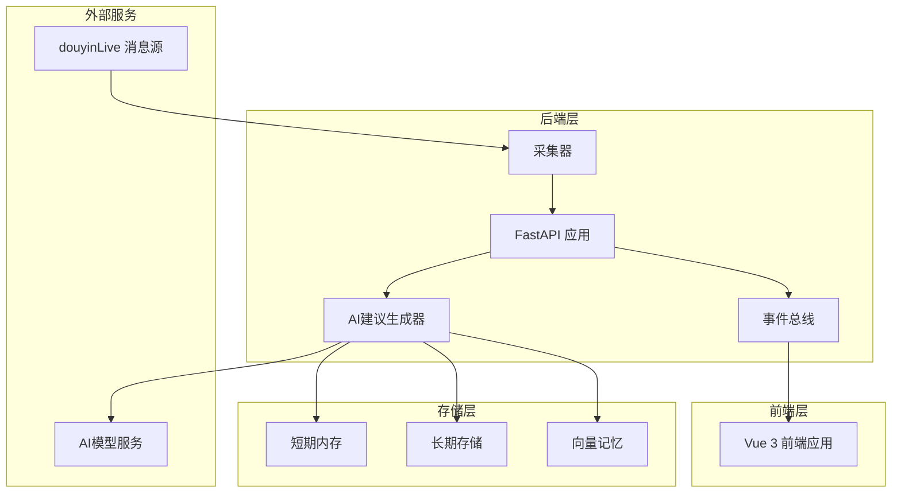

**图表来源**
- [backend/app.py:1-220](file://backend/app.py#L1-L220)
- [backend/services/agent.py:1-393](file://backend/services/agent.py#L1-L393)

**章节来源**
- [README.md:21-349](file://README.md#L21-L349)
- [backend/app.py:1-220](file://backend/app.py#L1-L220)

## 核心组件

### LivePromptAgent - AI建议生成器

LivePromptAgent是系统的核心组件，负责根据直播事件生成提词建议。其设计遵循双模式架构：

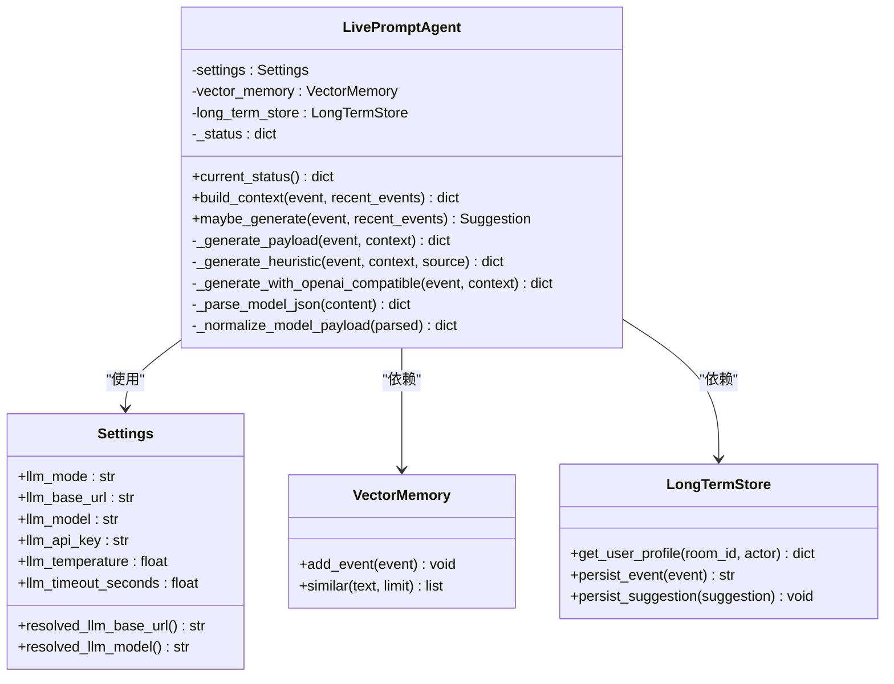

**图表来源**
- [backend/services/agent.py:23-393](file://backend/services/agent.py#L23-L393)
- [backend/config.py:39-94](file://backend/config.py#L39-L94)
- [backend/memory/vector_store.py:52-108](file://backend/memory/vector_store.py#L52-L108)
- [backend/memory/long_term.py:36-750](file://backend/memory/long_term.py#L36-L750)

### 记忆系统

系统采用三层记忆架构，确保不同时间尺度的信息都能得到有效管理：

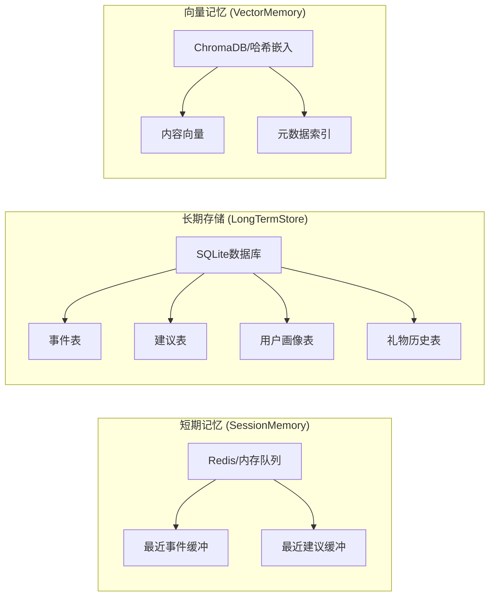

**图表来源**
- [backend/memory/session_memory.py:17-113](file://backend/memory/session_memory.py#L17-L113)
- [backend/memory/long_term.py:36-154](file://backend/memory/long_term.py#L36-L154)
- [backend/memory/vector_store.py:52-108](file://backend/memory/vector_store.py#L52-L108)

**章节来源**
- [backend/services/agent.py:56-95](file://backend/services/agent.py#L56-L95)
- [backend/memory/session_memory.py:17-113](file://backend/memory/session_memory.py#L17-L113)
- [backend/memory/long_term.py:36-154](file://backend/memory/long_term.py#L36-L154)

## 架构概览

系统采用事件驱动的异步架构，实现了从消息采集到建议生成的完整流水线：

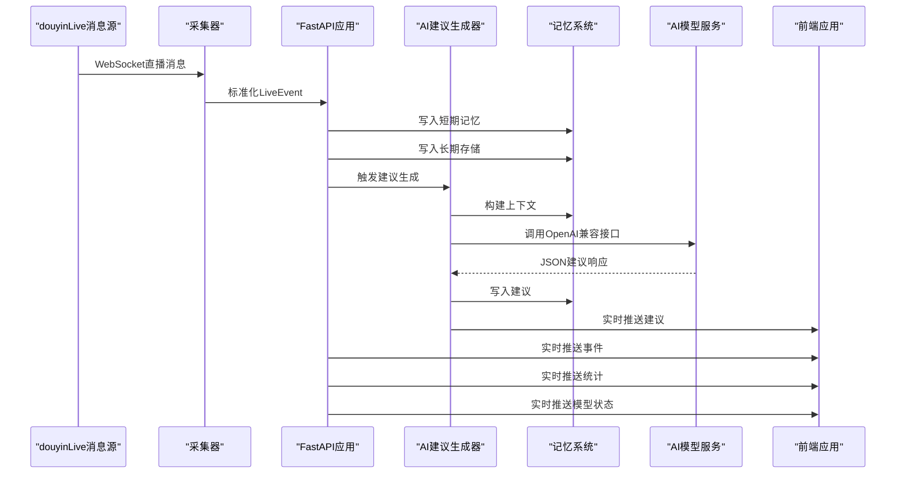

**图表来源**
- [backend/app.py:61-78](file://backend/app.py#L61-L78)
- [backend/services/agent.py:73-114](file://backend/services/agent.py#L73-L114)
- [backend/services/collector.py:145-159](file://backend/services/collector.py#L145-L159)

## 详细组件分析

### 启发式规则引擎

启发式规则引擎是系统的核心智能组件，针对不同类型的直播事件提供预定义的响应策略：

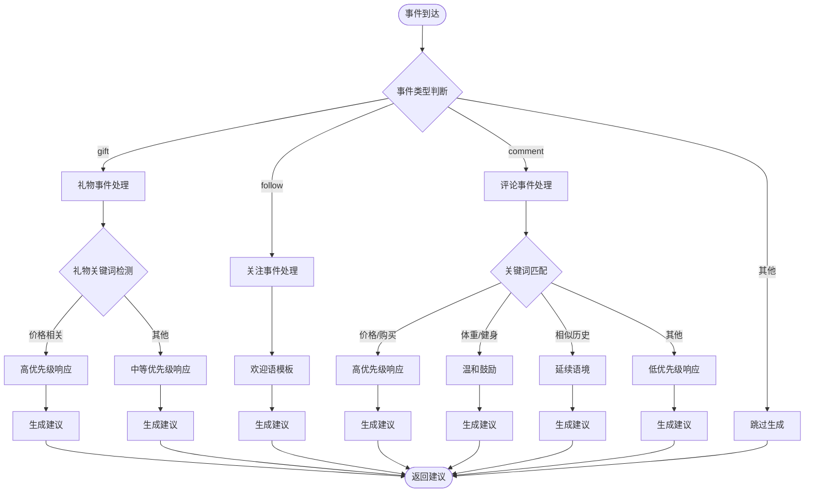

**图表来源**
- [backend/services/agent.py:115-181](file://backend/services/agent.py#L115-L181)

#### 关键规则策略

系统实现了多层次的启发式规则：

1. **礼物事件优先级**：针对价格查询、购买咨询等高价值转化机会
2. **关注事件欢迎**：针对新粉丝的轻量欢迎策略
3. **评论内容智能**：基于关键词匹配的分类处理
4. **历史相似性**：利用向量检索复用高互动历史
5. **用户画像**：结合长期用户行为特征

**章节来源**
- [backend/services/agent.py:115-181](file://backend/services/agent.py#L115-L181)

### OpenAI兼容模式

OpenAI兼容模式提供了强大的AI生成能力，支持多种模型提供商：

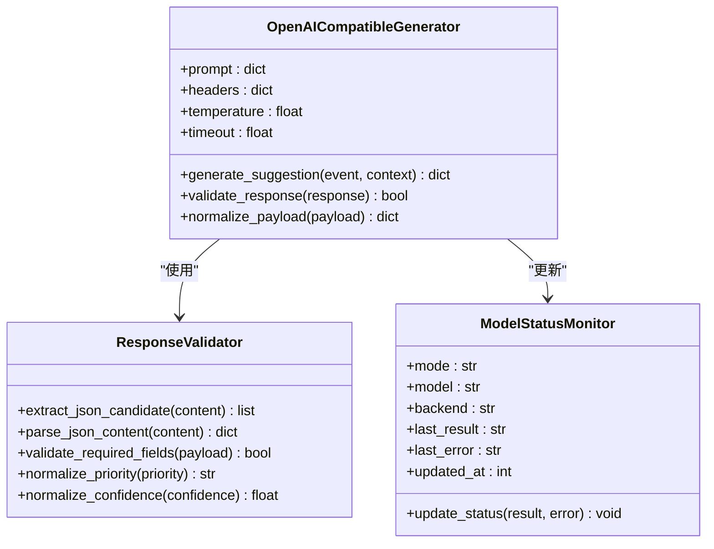

**图表来源**
- [backend/services/agent.py:183-330](file://backend/services/agent.py#L183-L330)
- [backend/services/agent.py:331-393](file://backend/services/agent.py#L331-L393)

#### 模型状态监控机制

系统实现了完整的模型状态监控和错误处理：

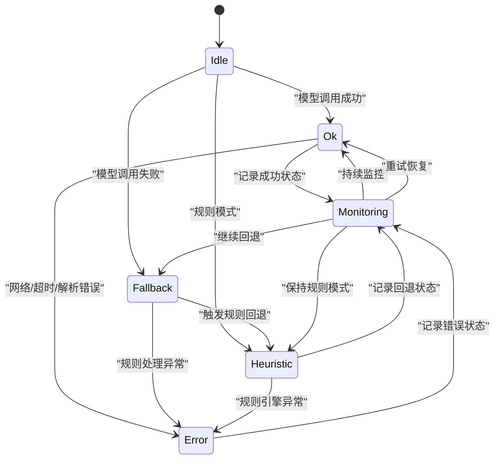

**图表来源**
- [backend/services/agent.py:44-54](file://backend/services/agent.py#L44-L54)
- [backend/services/agent.py:99-113](file://backend/services/agent.py#L99-L113)

**章节来源**
- [backend/services/agent.py:183-330](file://backend/services/agent.py#L183-L330)
- [backend/services/agent.py:44-54](file://backend/services/agent.py#L44-L54)

### 上下文构建机制

上下文构建是建议生成的核心环节，系统整合了多维度的上下文信息：

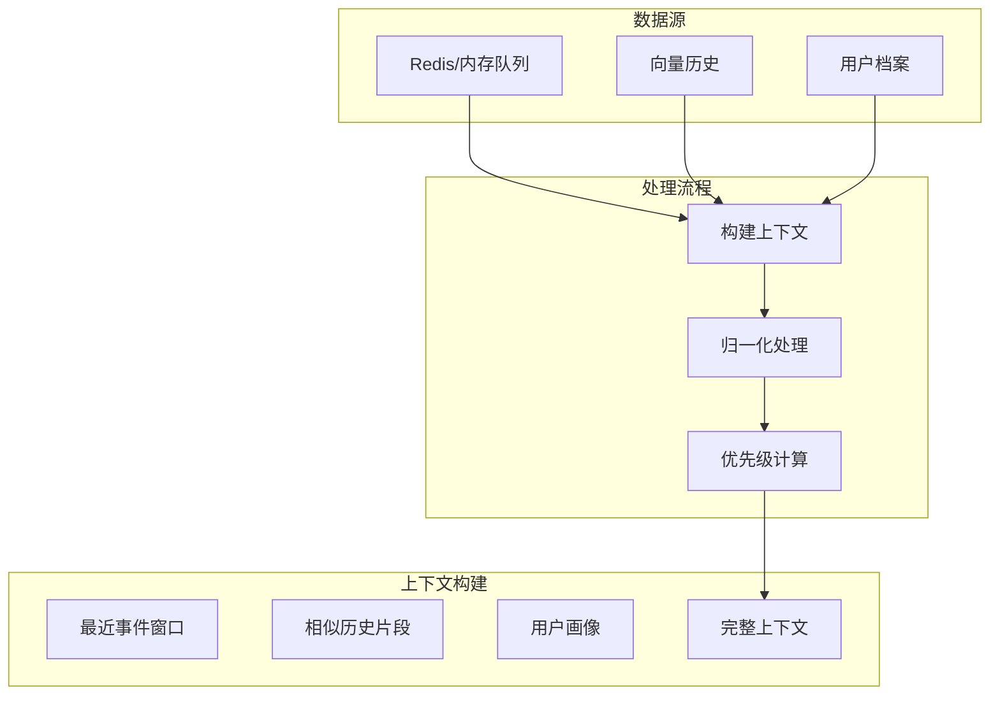

**图表来源**
- [backend/services/agent.py:56-71](file://backend/services/agent.py#L56-L71)
- [backend/memory/session_memory.py:66-84](file://backend/memory/session_memory.py#L66-L84)
- [backend/memory/vector_store.py:85-108](file://backend/memory/vector_store.py#L85-L108)
- [backend/memory/long_term.py:718-734](file://backend/memory/long_term.py#L718-L734)

#### 上下文要素详解

1. **最近事件窗口**：包含最近8个事件的精简信息
2. **相似历史片段**：通过向量检索找到的高相似历史内容
3. **用户画像**：基于长期存储的用户行为特征

**章节来源**
- [backend/services/agent.py:56-71](file://backend/services/agent.py#L56-L71)

### 事件处理流水线

系统实现了完整的事件处理流水线，确保每个直播事件都能得到及时处理：

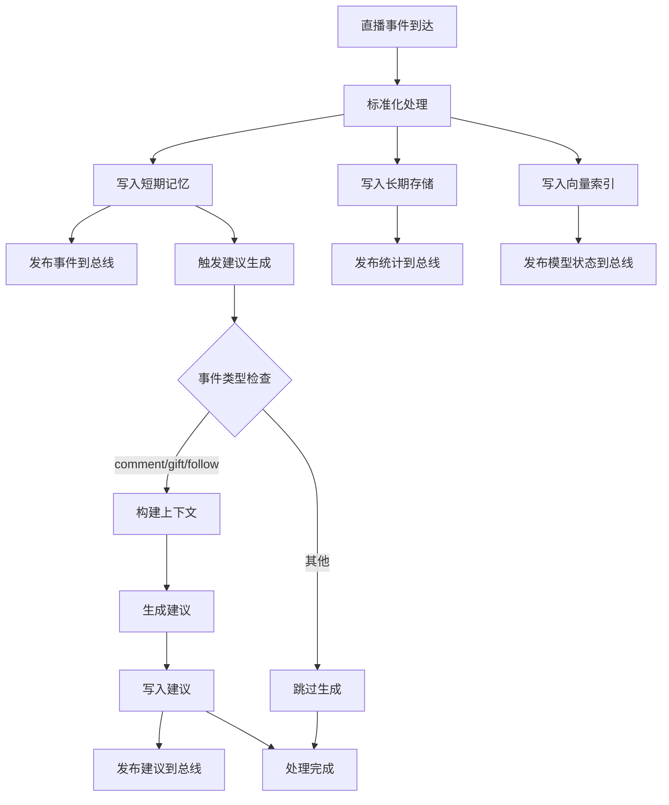

**图表来源**
- [backend/app.py:61-78](file://backend/app.py#L61-L78)
- [backend/services/agent.py:73-95](file://backend/services/agent.py#L73-L95)

**章节来源**
- [backend/app.py:61-78](file://backend/app.py#L61-L78)

## 依赖关系分析

系统采用模块化设计，各组件之间的依赖关系清晰明确：

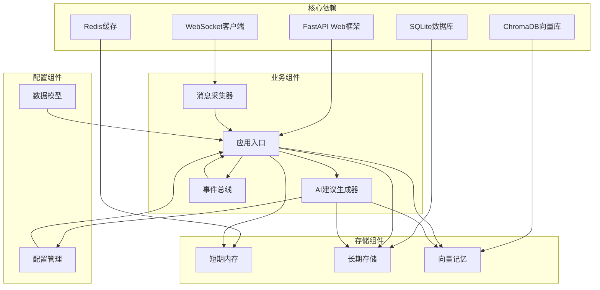

**图表来源**
- [requirements.txt:1-6](file://requirements.txt#L1-L6)
- [backend/app.py:8-21](file://backend/app.py#L8-L21)
- [backend/config.py:39-94](file://backend/config.py#L39-L94)

### 外部依赖管理

系统对外部依赖采用了灵活的降级策略：

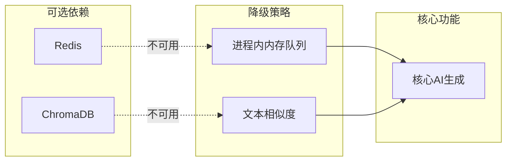

**图表来源**
- [backend/memory/session_memory.py:11-31](file://backend/memory/session_memory.py#L11-L31)
- [backend/memory/vector_store.py:13-63](file://backend/memory/vector_store.py#L13-L63)

**章节来源**
- [requirements.txt:1-6](file://requirements.txt#L1-L6)
- [backend/memory/session_memory.py:11-31](file://backend/memory/session_memory.py#L11-L31)
- [backend/memory/vector_store.py:13-63](file://backend/memory/vector_store.py#L13-L63)

## 性能考虑

### 异步处理架构

系统采用异步非阻塞的设计，确保高并发场景下的稳定性：

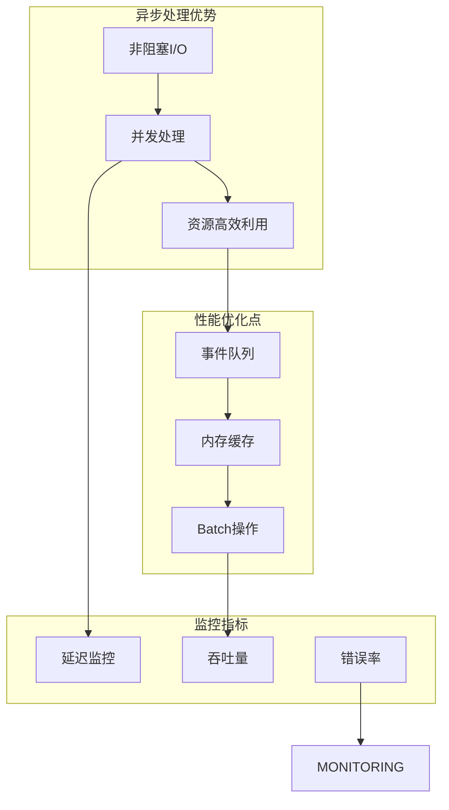

### 缓存策略

系统实现了多层次的缓存策略来提升性能：

1. **短期内存缓存**：Redis或进程内队列，支持高并发读写
2. **向量索引缓存**：ChromaDB持久化向量存储
3. **模型响应缓存**：避免重复计算相同上下文

### 错误处理和重试机制

系统具备完善的错误处理和自愈能力：

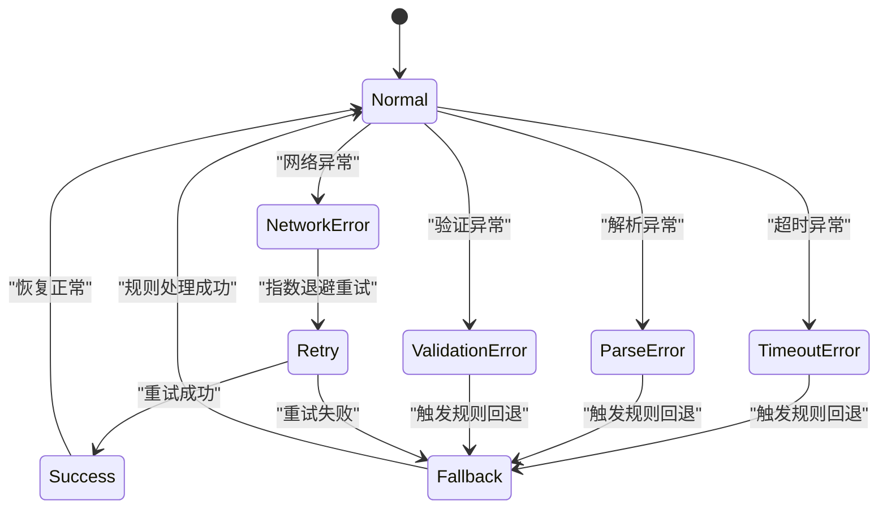

## 故障排除指南

### 常见问题诊断

#### 模型调用失败

**症状**：顶部状态显示`fallback`或`error`

**排查步骤**：
1. 检查API密钥配置
2. 验证网络连接
3. 查看超时设置
4. 检查模型可用性

**解决方案**：
- 更新正确的API密钥
- 调整超时参数
- 切换到规则模式进行测试

#### 数据存储问题

**症状**：前端无数据显示或数据不更新

**排查步骤**：
1. 检查SQLite数据库文件
2. 验证Chroma向量库
3. 确认Redis连接状态

**解决方案**：
- 重建数据库表结构
- 重新初始化向量索引
- 检查Redis配置

#### 事件处理异常

**症状**：建议生成延迟或失败

**排查步骤**：
1. 检查采集器连接状态
2. 验证事件标准化过程
3. 监控内存使用情况

**解决方案**：
- 重启采集器服务
- 清理内存队列
- 调整处理参数

**章节来源**
- [USAGE.md:198-256](file://USAGE.md#L198-L256)

### 日志分析

系统提供了丰富的日志信息用于问题诊断：

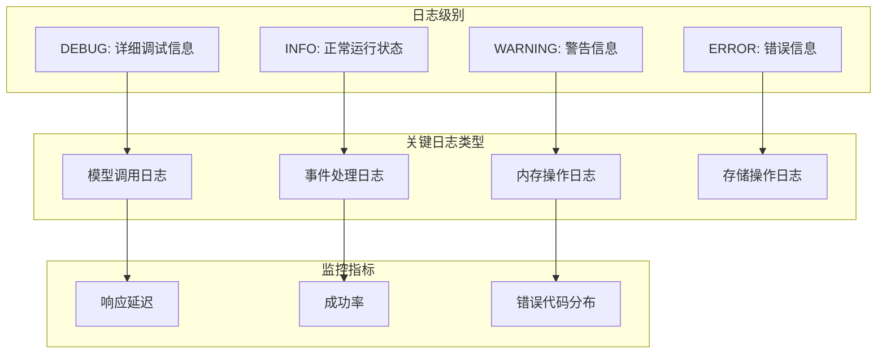

## 开发者指南

### AI模型集成指南

#### 支持的模型提供商

系统支持多种AI模型提供商，通过统一的OpenAI兼容接口进行调用：

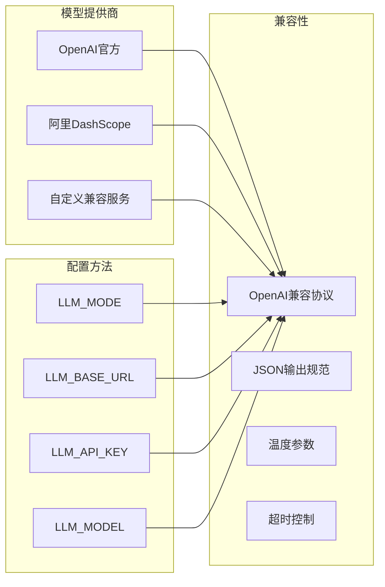

**图表来源**
- [backend/config.py:70-91](file://backend/config.py#L70-L91)
- [backend/services/agent.py:183-330](file://backend/services/agent.py#L183-L330)

#### 自定义模型集成步骤

1. **配置环境变量**：
   ```env
   LLM_MODE=openai
   LLM_BASE_URL=https://api.openai.com/v1
   LLM_MODEL=gpt-4-turbo
   LLM_API_KEY=your_api_key
   ```

2. **验证模型可用性**：
   ```bash
   curl -X POST https://api.openai.com/v1/chat/completions \
     -H "Content-Type: application/json" \
     -H "Authorization: Bearer $LLM_API_KEY" \
     -d '{"model":"gpt-4-turbo","messages":[{"role":"user","content":"test"}]}'
   ```

3. **测试建议生成**：
   ```python
   # 使用LivePromptAgent进行测试
   agent = LivePromptAgent(settings, vector_memory, long_term_store)
   test_event = LiveEvent(...)
   suggestion = agent.maybe_generate(test_event, recent_events)
   ```

#### 模型参数调优

| 参数 | 类型 | 默认值 | 说明 |
|------|------|--------|------|
| temperature | float | 0.4 | 控制创造性，0-2范围 |
| max_tokens | int | 动态计算 | 控制输出长度 |
| top_p | float | 1.0 | 核采样概率 |
| frequency_penalty | float | 0.0 | 频率惩罚 |
| presence_penalty | float | 0.0 | 存在惩罚 |

**章节来源**
- [backend/config.py:70-91](file://backend/config.py#L70-L91)
- [backend/services/agent.py:183-330](file://backend/services/agent.py#L183-L330)

### 自定义规则开发

#### 规则引擎扩展

系统提供了灵活的规则扩展机制：

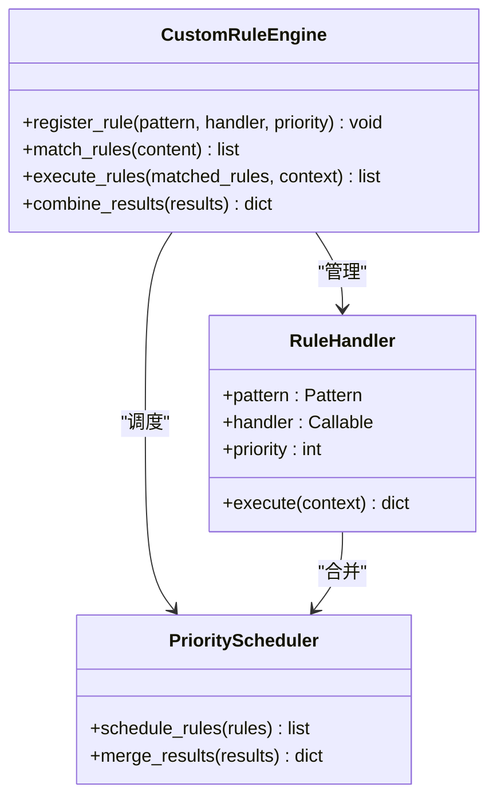

**图表来源**
- [backend/services/agent.py:115-181](file://backend/services/agent.py#L115-L181)

#### 新规则开发流程

1. **定义规则模式**：
   ```python
   # 示例：新增"产品推荐"规则
   product_patterns = [
       r"(.*?)(产品|商品|物品|东西)(.*?)",
       r"(.*?)(推荐|介绍|讲解)(.*?)"
   ]
   ```

2. **实现处理逻辑**：
   ```python
   def handle_product_recommendation(content, context):
       return {
           "priority": "high",
           "reply_text": "感谢关注，这款产品确实不错，让我详细介绍一下...",
           "tone": "专业推荐",
           "reason": "用户显式询问产品信息",
           "confidence": 0.85
       }
   ```

3. **注册规则处理器**：
   ```python
   # 在启发式引擎中注册
   self.rule_engine.register_rule(
       product_patterns,
       handle_product_recommendation,
       priority=10
   )
   ```

#### 规则优先级设计

| 优先级 | 场景 | 响应特点 |
|--------|------|----------|
| high | 转化机会、紧急需求 | 快速响应，明确指令 |
| medium | 社交互动、一般咨询 | 平衡效率和质量 |
| low | 娱乐互动、闲聊 | 自然接话，维持氛围 |

**章节来源**
- [backend/services/agent.py:115-181](file://backend/services/agent.py#L115-L181)

### 调试技巧

#### 开发环境调试

1. **启用详细日志**：
   ```python
   import logging
   logging.basicConfig(level=logging.DEBUG)
   ```

2. **单元测试编写**：
   ```python
   def test_heuristic_rules():
       agent = LivePromptAgent(settings, vector_memory, long_term_store)
       # 测试各种事件类型的规则
       test_cases = [
           ("gift", "谢谢老板"),
           ("follow", "欢迎新朋友"),
           ("comment", "价格多少？")
       ]
       for event_type, content in test_cases:
           # 验证规则输出
   ```

3. **性能监控**：
   ```python
   import time
   start_time = time.time()
   suggestion = agent.maybe_generate(event, recent_events)
   end_time = time.time()
   print(f"处理耗时: {end_time - start_time:.2f}秒")
   ```

#### 生产环境监控

1. **健康检查端点**：
   ```http
   GET /health
   ```

2. **实时状态监控**：
   ```http
   GET /api/events/stream
   ```

3. **模型状态追踪**：
   ```python
   # 通过WebSocket接收模型状态更新
   # {"type": "model_status", "data": {...}}
   ```

**章节来源**
- [backend/app.py:104-106](file://backend/app.py#L104-L106)
- [backend/app.py:187-206](file://backend/app.py#L187-L206)

## 结论

AI建议生成引擎通过精心设计的双模式架构，在保证系统稳定性的同时提供了强大的智能化能力。系统的核心优势体现在：

### 技术亮点

1. **双模式架构**：在线AI模型与本地启发式规则的无缝切换
2. **多层记忆系统**：短期、长期、向量记忆的协同工作
3. **实时处理能力**：毫秒级事件处理和建议生成
4. **可扩展设计**：模块化架构便于功能扩展和定制

### 应用价值

- **提升直播质量**：通过智能建议增强主播与观众的互动体验
- **提高转化效率**：针对转化机会的精准建议
- **降低运营成本**：自动化处理减少人工干预
- **增强用户体验**：及时的互动响应提升观众满意度

### 发展方向

未来可以在以下方面进一步优化：
1. **多模态支持**：集成语音识别和图像分析
2. **个性化定制**：基于主播风格的个性化建议
3. **反馈闭环**：建立建议效果的反馈和学习机制
4. **跨平台支持**：扩展到更多直播平台和应用场景

该系统为直播行业的智能化转型提供了坚实的技术基础，通过持续的优化和扩展，有望成为直播生态中的重要基础设施。