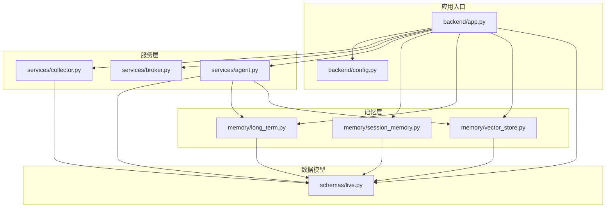
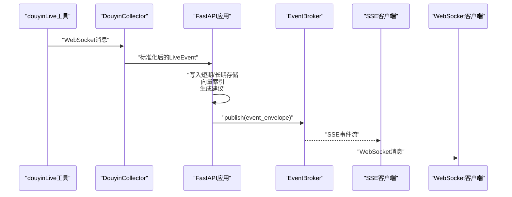
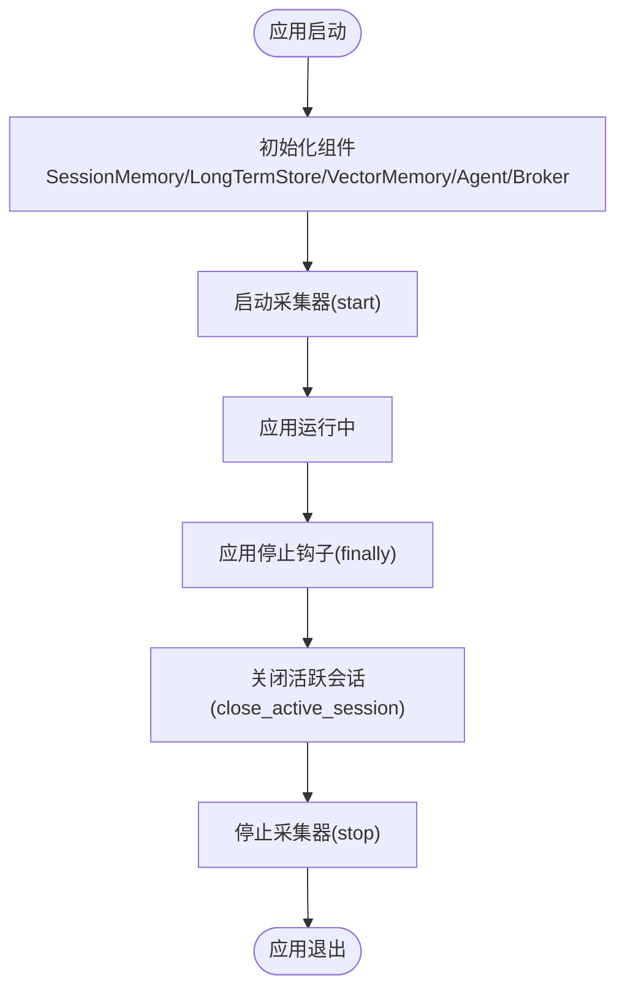
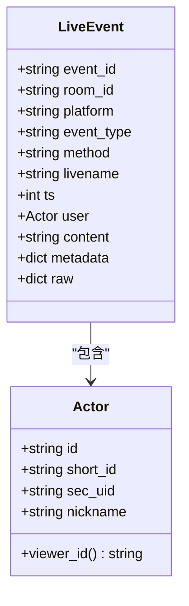
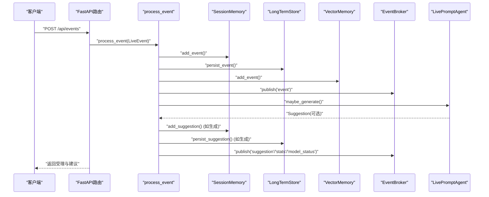
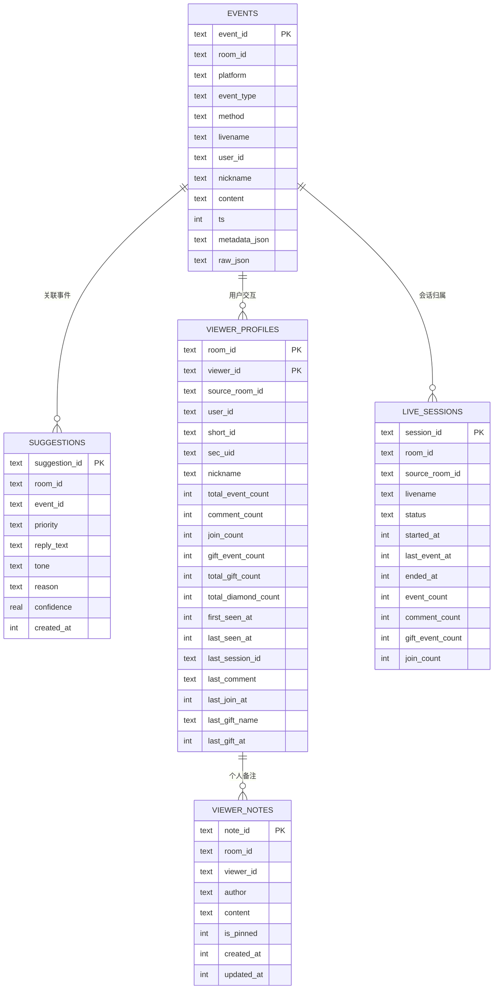
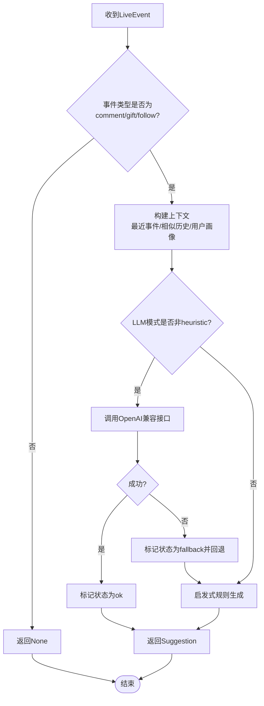
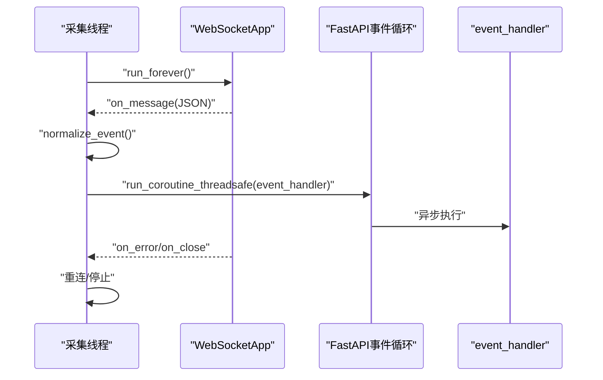
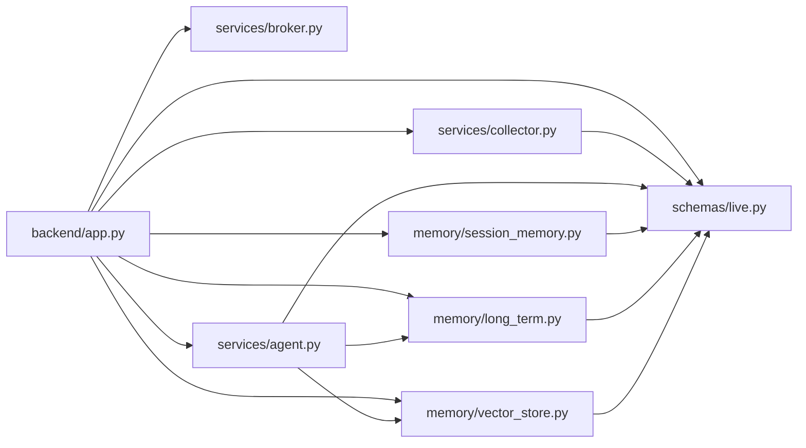

# FastAPI应用入口

<cite>
**本文档引用的文件**
- [backend/app.py](file://backend/app.py)
- [backend/config.py](file://backend/config.py)
- [backend/services/collector.py](file://backend/services/collector.py)
- [backend/services/broker.py](file://backend/services/broker.py)
- [backend/services/agent.py](file://backend/services/agent.py)
- [backend/memory/session_memory.py](file://backend/memory/session_memory.py)
- [backend/memory/long_term.py](file://backend/memory/long_term.py)
- [backend/memory/vector_store.py](file://backend/memory/vector_store.py)
- [backend/schemas/live.py](file://backend/schemas/live.py)
- [requirements.txt](file://requirements.txt)
- [README.md](file://README.md)
</cite>

## 目录
1. [简介](#简介)
2. [项目结构](#项目结构)
3. [核心组件](#核心组件)
4. [架构总览](#架构总览)
5. [详细组件分析](#详细组件分析)
6. [依赖关系分析](#依赖关系分析)
7. [性能考量](#性能考量)
8. [故障排查指南](#故障排查指南)
9. [结论](#结论)
10. [附录](#附录)

## 简介
本文件为FastAPI应用入口的深度技术文档，聚焦于应用生命周期管理（lifespan）、CORS中间件配置与安全考虑、API路由设计理念、事件封装机制（event_envelope）与消息格式标准，以及启动流程、错误处理策略与性能优化建议。该系统围绕抖音直播场景构建，提供事件采集、短期/长期存储、向量检索、提词建议生成与实时流推送能力。

## 项目结构
后端采用模块化设计，按职责划分为：
- 应用入口与路由：backend/app.py
- 配置管理：backend/config.py
- 采集器：backend/services/collector.py
- 事件总线：backend/services/broker.py
- 提词代理：backend/services/agent.py
- 记忆层：backend/memory/session_memory.py、backend/memory/long_term.py、backend/memory/vector_store.py
- 数据模型：backend/schemas/live.py
- 依赖声明：requirements.txt
- 项目说明：README.md

图表来源
- [backend/app.py:1-220](file://backend/app.py#L1-L220)
- [backend/config.py:1-94](file://backend/config.py#L1-L94)
- [backend/services/collector.py:1-284](file://backend/services/collector.py#L1-L284)
- [backend/services/broker.py:1-40](file://backend/services/broker.py#L1-L40)
- [backend/services/agent.py:1-393](file://backend/services/agent.py#L1-L393)
- [backend/memory/session_memory.py:1-113](file://backend/memory/session_memory.py#L1-L113)
- [backend/memory/long_term.py:1-750](file://backend/memory/long_term.py#L1-L750)
- [backend/memory/vector_store.py:1-108](file://backend/memory/vector_store.py#L1-L108)
- [backend/schemas/live.py:1-95](file://backend/schemas/live.py#L1-L95)

章节来源
- [backend/app.py:1-220](file://backend/app.py#L1-L220)
- [README.md:21-349](file://README.md#L21-L349)

## 核心组件
- 应用实例与生命周期：FastAPI应用实例在lifespan中启动采集器，在应用终止时清理会话并停止采集器。
- CORS中间件：全局启用跨域访问，允许任意来源、方法与头部，凭据允许。
- 事件封装：统一的event_envelope函数，确保SSE/WS推送的消息具有"type"和"data"键。
- 事件处理流水线：采集器接收原始消息→标准化为LiveEvent→写入短期/长期存储→向量索引→生成建议→发布到事件总线→SSE/WS推送。
- 数据模型：Actor、LiveEvent、Suggestion、SessionStats、ModelStatus、SessionSnapshot等。
- 记忆层：SessionMemory（Redis或进程内）、LongTermStore（SQLite）、VectorMemory（Chroma或本地哈希嵌入）。
- 提词代理：优先OpenAI兼容接口，失败回退启发式规则，维护模型状态。

章节来源
- [backend/app.py:84-101](file://backend/app.py#L84-L101)
- [backend/app.py:45-47](file://backend/app.py#L45-L47)
- [backend/schemas/live.py:8-95](file://backend/schemas/live.py#L8-L95)
- [backend/services/collector.py:38-284](file://backend/services/collector.py#L38-L284)
- [backend/services/broker.py:10-40](file://backend/services/broker.py#L10-L40)
- [backend/services/agent.py:23-393](file://backend/services/agent.py#L23-L393)
- [backend/memory/session_memory.py:17-113](file://backend/memory/session_memory.py#L17-L113)
- [backend/memory/long_term.py:36-750](file://backend/memory/long_term.py#L36-L750)
- [backend/memory/vector_store.py:52-108](file://backend/memory/vector_store.py#L52-L108)

## 架构总览
系统采用“采集器→应用→记忆层→代理→事件总线→实时流”的链路，支持SSE与WebSocket两种实时推送方式。

图表来源
- [backend/services/collector.py:117-284](file://backend/services/collector.py#L117-L284)
- [backend/app.py:61-78](file://backend/app.py#L61-L78)
- [backend/services/broker.py:28-40](file://backend/services/broker.py#L28-L40)

## 详细组件分析

### 应用生命周期管理（lifespan）
- 启动阶段：在lifespan中启动DouyinCollector，传入当前事件循环，使采集器能在后台线程中接收消息并通过run_coroutine_threadsafe回调到FastAPI事件循环。
- 终止阶段：应用退出时，finally块中关闭当前房间的活跃会话并停止采集器，确保资源释放与连接清理。

图表来源
- [backend/app.py:84-92](file://backend/app.py#L84-L92)
- [backend/services/collector.py:61-116](file://backend/services/collector.py#L61-L116)
- [backend/memory/long_term.py:700-716](file://backend/memory/long_term.py#L700-L716)

章节来源
- [backend/app.py:84-92](file://backend/app.py#L84-L92)
- [backend/services/collector.py:61-116](file://backend/services/collector.py#L61-L116)
- [backend/memory/long_term.py:700-716](file://backend/memory/long_term.py#L700-L716)

### CORS中间件配置与安全考虑
- 配置项：允许任意来源、凭据、任意方法与头部，便于开发与跨域调试。
- 安全建议：
  - 生产环境应限制allow_origins为可信域名列表。
  - 明确allow_methods与allow_headers，避免通配符带来的风险。
  - 如需鉴权，结合FastAPI的依赖注入与认证中间件使用。

章节来源
- [backend/app.py:95-101](file://backend/app.py#L95-L101)

### 事件封装机制（event_envelope）与消息格式标准
- 封装函数：统一返回{"type": kind, "data": data}结构，便于SSE与WebSocket两端一致解析。
- SSE消息格式：SSE响应中每条事件包含event类型与data负载，支持按房间过滤。
- WebSocket消息格式：与SSE一致，但以JSON对象形式推送。
- 标准事件结构：LiveEvent包含event_id、room_id、platform、event_type、method、livename、ts、user、content、metadata、raw等字段。

图表来源
- [backend/schemas/live.py:29-44](file://backend/schemas/live.py#L29-L44)
- [backend/schemas/live.py:8-27](file://backend/schemas/live.py#L8-L27)

章节来源
- [backend/app.py:45-47](file://backend/app.py#L45-L47)
- [backend/app.py:187-206](file://backend/app.py#L187-L206)
- [backend/app.py:209-220](file://backend/app.py#L209-L220)
- [backend/schemas/live.py:29-95](file://backend/schemas/live.py#L29-L95)

### API路由设计理念
- 健康检查：/health返回服务状态、当前房间号与活跃会话。
- 初始化快照：/api/bootstrap返回最近事件、建议、统计与模型状态。
- 房间切换：/api/room接收RoomSwitchRequest，切换活跃房间并返回新快照。
- 事件注入：/api/events接收LiveEvent，触发处理流水线并返回结果。
- 用户与笔记：/api/viewer、/api/viewer/notes、/api/viewer/notes/{note_id}提供用户详情与笔记CRUD。
- 会话查询：/api/sessions、/api/sessions/current列出与获取当前会话。
- 实时流：/api/events/stream（SSE）与/ws/live（WebSocket）推送事件、建议、统计与模型状态。

图表来源
- [backend/app.py:129-133](file://backend/app.py#L129-L133)
- [backend/app.py:61-78](file://backend/app.py#L61-L78)
- [backend/services/agent.py:73-94](file://backend/services/agent.py#L73-L94)

章节来源
- [backend/app.py:104-106](file://backend/app.py#L104-L106)
- [backend/app.py:109-112](file://backend/app.py#L109-L112)
- [backend/app.py:115-126](file://backend/app.py#L115-L126)
- [backend/app.py:129-133](file://backend/app.py#L129-L133)
- [backend/app.py:135-141](file://backend/app.py#L135-L141)
- [backend/app.py:144-150](file://backend/app.py#L144-L150)
- [backend/app.py:153-164](file://backend/app.py#L153-L164)
- [backend/app.py:167-171](file://backend/app.py#L167-L171)
- [backend/app.py:174-178](file://backend/app.py#L174-L178)
- [backend/app.py:181-184](file://backend/app.py#L181-L184)
- [backend/app.py:187-206](file://backend/app.py#L187-L206)
- [backend/app.py:209-220](file://backend/app.py#L209-L220)

### 记忆层与数据一致性
- SessionMemory：优先Redis（若可用且配置），否则使用进程内deque，控制窗口大小与TTL。
- LongTermStore：SQLite持久化，包含events、suggestions、viewer_profiles、viewer_gifts、live_sessions、viewer_notes表，提供事件、建议、用户画像、礼物历史、会话与笔记的查询与维护。
- VectorMemory：Chroma持久化向量库或本地HashEmbeddingFunction，支持相似历史检索。

图表来源
- [backend/memory/long_term.py:54-148](file://backend/memory/long_term.py#L54-L148)
- [backend/memory/long_term.py:420-454](file://backend/memory/long_term.py#L420-L454)
- [backend/memory/long_term.py:456-465](file://backend/memory/long_term.py#L456-L465)
- [backend/memory/long_term.py:620-661](file://backend/memory/long_term.py#L620-L661)
- [backend/memory/long_term.py:688-698](file://backend/memory/long_term.py#L688-L698)

章节来源
- [backend/memory/session_memory.py:17-113](file://backend/memory/session_memory.py#L17-L113)
- [backend/memory/long_term.py:36-750](file://backend/memory/long_term.py#L36-L750)
- [backend/memory/vector_store.py:52-108](file://backend/memory/vector_store.py#L52-L108)

### 提词代理与模型状态
- 生成策略：优先OpenAI兼容接口，失败回退启发式规则；维护当前状态（mode、model、backend、last_result、last_error、updated_at）。
- 上下文构建：最近事件窗口、相似历史片段、用户画像。
- 错误处理：网络异常、HTTP错误、超时、JSON解析失败等均有明确分支与日志记录。

图表来源
- [backend/services/agent.py:73-114](file://backend/services/agent.py#L73-L114)
- [backend/services/agent.py:183-329](file://backend/services/agent.py#L183-L329)

章节来源
- [backend/services/agent.py:23-393](file://backend/services/agent.py#L23-L393)

### 采集器与消息投递
- 采集器：连接本地douyinLive WebSocket，解析JSON消息，映射为LiveEvent，提交到FastAPI事件循环。
- 线程与心跳：独立线程运行WebSocketApp，周期性发送ping维持连接，断线重连。
- 事件投递：通过run_coroutine_threadsafe将事件处理回调提交到事件循环，异步执行。

图表来源
- [backend/services/collector.py:117-214](file://backend/services/collector.py#L117-L214)

章节来源
- [backend/services/collector.py:38-284](file://backend/services/collector.py#L38-L284)

## 依赖关系分析
- 运行时依赖：FastAPI、Uvicorn、websocket-client、Redis、ChromaDB。
- 组件耦合：
  - app.py耦合collector、broker、agent、memory与schemas。
  - collector依赖config与schemas。
  - agent依赖config、vector_memory与long_term_store。
  - memory层相互独立，通过schemas解耦。

图表来源
- [requirements.txt:1-6](file://requirements.txt#L1-L6)
- [backend/app.py:13-20](file://backend/app.py#L13-L20)
- [backend/services/collector.py:16-17](file://backend/services/collector.py#L16-L17)
- [backend/services/agent.py:17](file://backend/services/agent.py#L17)

章节来源
- [requirements.txt:1-6](file://requirements.txt#L1-L6)
- [backend/app.py:13-20](file://backend/app.py#L13-L20)

## 性能考量
- 异步与并发：事件处理在FastAPI事件循环中异步执行，采集器通过run_coroutine_threadsafe投递，避免阻塞。
- 缓存与索引：短期记忆支持Redis，降低数据库压力；向量检索优先Chroma，不足时使用本地哈希嵌入，保证可用性。
- I/O优化：SSE/WS推送采用异步队列，避免阻塞；WebSocket连接断开时及时取消订阅。
- 配置优化：合理设置会话TTL、采集器重连间隔与模型超时，平衡实时性与稳定性。

## 故障排查指南
- 采集器无法连接：
  - 检查douyinLive是否运行、端口与房间号配置。
  - 查看采集器日志中的on_error/on_close信息。
- WebSocket断线：
  - 关注ping失败与重连延迟；确认网络与防火墙设置。
- SSE/WS无数据：
  - 确认事件已写入SessionMemory/LongTermStore并发布到EventBroker。
  - 检查房间过滤参数与订阅队列状态。
- 模型调用失败：
  - 检查LLM_MODE、LLM_BASE_URL、LLM_MODEL、LLM_API_KEY配置。
  - 查看agent日志中的HTTP错误、超时与JSON解析失败信息。
- 数据库异常：
  - 检查SQLite文件权限与磁盘空间；必要时重建索引与迁移。

章节来源
- [backend/services/collector.py:161-180](file://backend/services/collector.py#L161-L180)
- [backend/services/agent.py:222-285](file://backend/services/agent.py#L222-L285)
- [backend/memory/long_term.py:155-154](file://backend/memory/long_term.py#L155-L154)

## 结论
该FastAPI应用入口通过清晰的生命周期管理、统一的事件封装与多层记忆体系，实现了从直播事件采集到实时推送的完整闭环。CORS配置便于开发调试，但在生产环境需收紧策略。建议在生产环境中限制允许来源、明确方法与头部，并结合认证中间件提升安全性。通过合理的配置与监控，系统可在保证实时性的前提下保持稳定运行。

## 附录
- 启动命令参考：使用uvicorn启动后端服务，前端通过npm运行开发服务器。
- 环境变量：通过.env文件或环境变量配置房间号、采集器参数、模型参数与存储路径。

章节来源
- [README.md:101-113](file://README.md#L101-L113)
- [README.md:142-201](file://README.md#L142-L201)