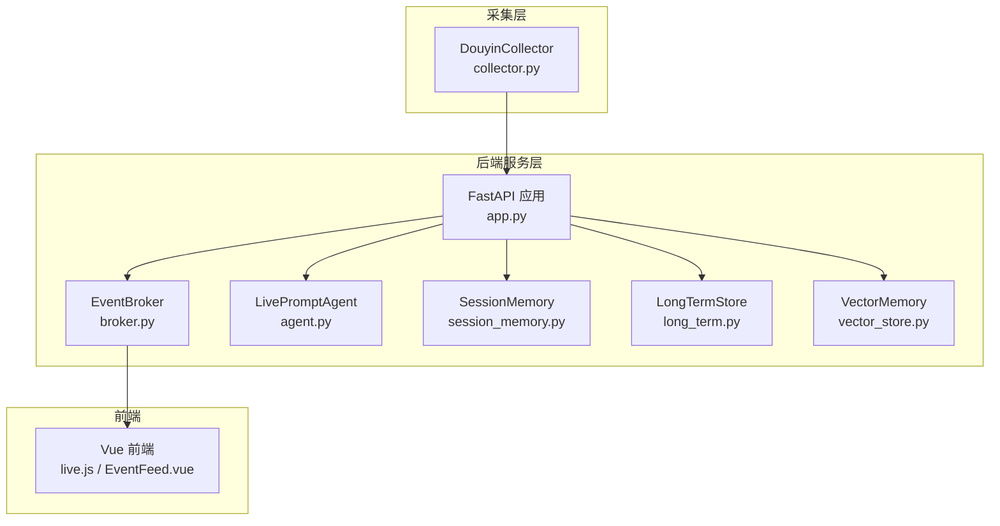
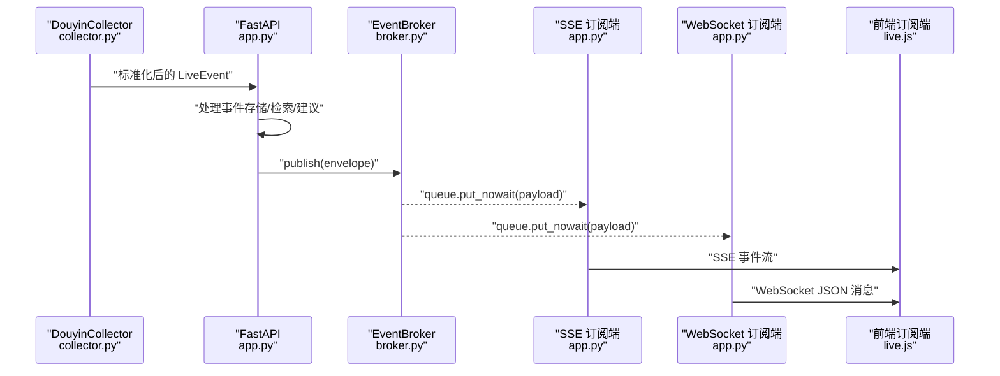
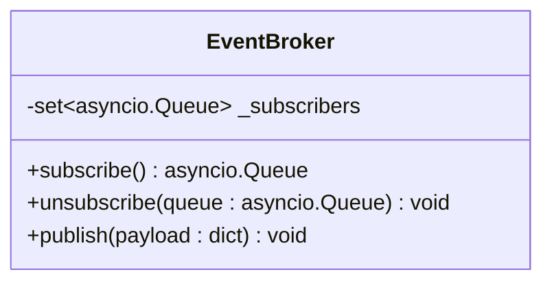
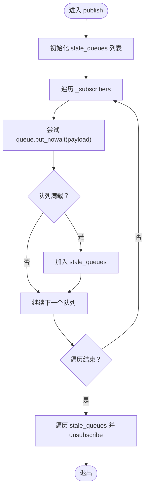
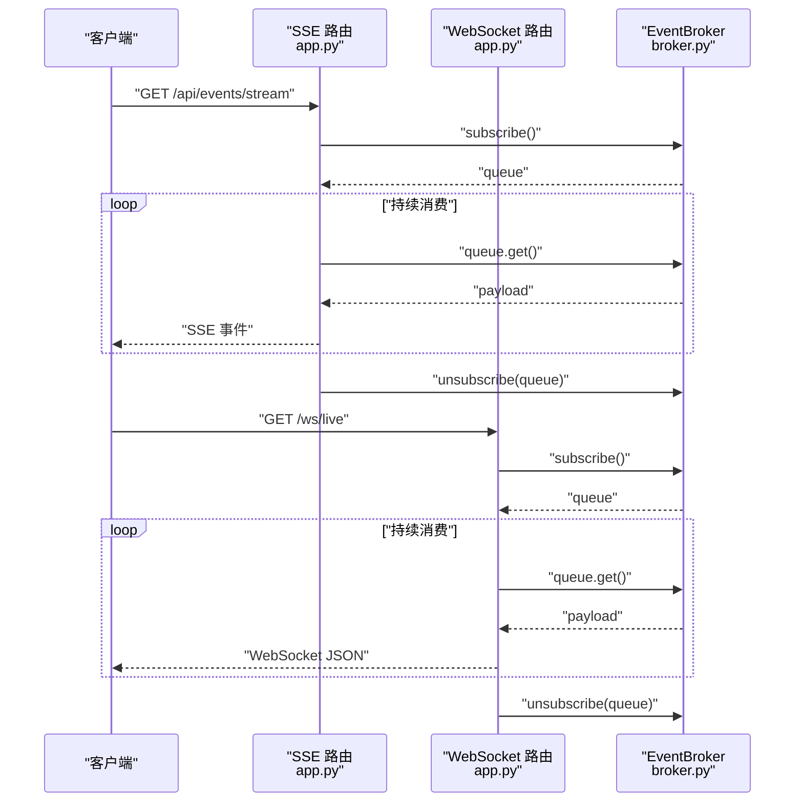
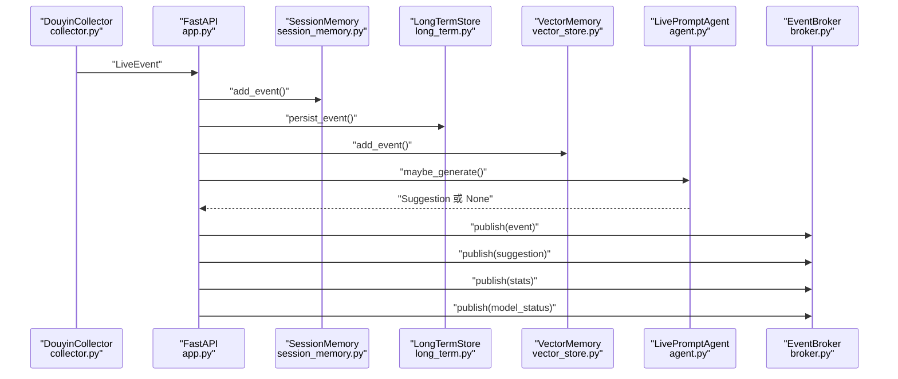
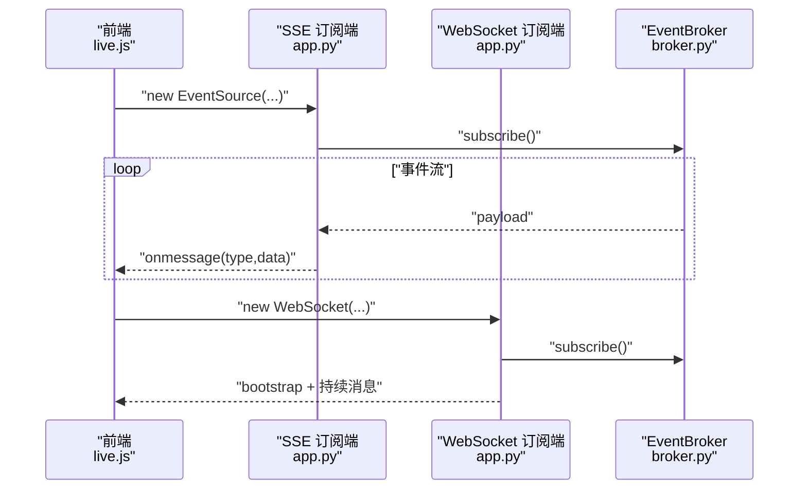
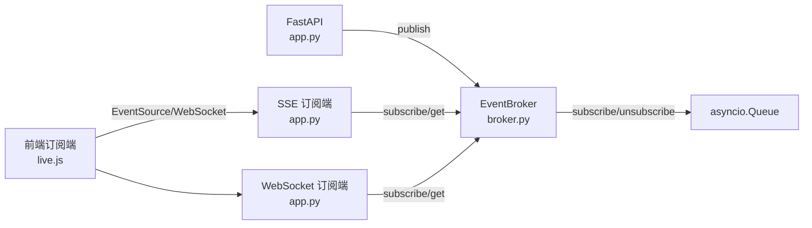

# 事件发布订阅器

<cite>
**本文引用的文件**
- [broker.py](file://backend/services/broker.py)
- [app.py](file://backend/app.py)
- [live.py](file://backend/schemas/live.py)
- [collector.py](file://backend/services/collector.py)
- [session_memory.py](file://backend/memory/session_memory.py)
- [long_term.py](file://backend/memory/long_term.py)
- [vector_store.py](file://backend/memory/vector_store.py)
- [agent.py](file://backend/services/agent.py)
- [config.py](file://backend/config.py)
- [live.js](file://frontend/src/stores/live.js)
- [EventFeed.vue](file://frontend/src/components/EventFeed.vue)
- [README.md](file://README.md)
- [USAGE.md](file://USAGE.md)
</cite>

## 目录
1. [简介](#简介)
2. [项目结构](#项目结构)
3. [核心组件](#核心组件)
4. [架构总览](#架构总览)
5. [详细组件分析](#详细组件分析)
6. [依赖关系分析](#依赖关系分析)
7. [性能考量](#性能考量)
8. [故障排查指南](#故障排查指南)
9. [结论](#结论)
10. [附录](#附录)

## 简介
本技术文档围绕事件发布订阅器（EventBroker）展开，系统性阐述其设计与实现，重点覆盖以下方面：
- 异步队列管理：订阅者注册、取消订阅、消息广播
- 队列满载处理策略：检测满载并自动移除过期队列
- 与实时直播场景的集成：SSE 与 WebSocket 的订阅端实现
- 与后端处理链路的衔接：事件采集、短期/长期存储、向量检索、提词建议生成
- 开发者最佳实践与性能优化建议

## 项目结构
该项目采用后端（FastAPI）、前端（Vue 3 + Pinia）与本地采集器（douyinLive）协同的实时直播提词系统。EventBroker 位于后端服务层，作为事件广播中枢，向上游事件处理器提供统一的异步广播能力，向下为 SSE 与 WebSocket 订阅端提供消息通道。

图表来源
- [collector.py:117-284](file://backend/services/collector.py#L117-L284)
- [app.py:61-79](file://backend/app.py#L61-L79)
- [broker.py:10-40](file://backend/services/broker.py#L10-L40)
- [agent.py:23-393](file://backend/services/agent.py#L23-L393)
- [session_memory.py:17-113](file://backend/memory/session_memory.py#L17-L113)
- [long_term.py:36-750](file://backend/memory/long_term.py#L36-L750)
- [vector_store.py:52-108](file://backend/memory/vector_store.py#L52-L108)
- [live.js:173-205](file://frontend/src/stores/live.js#L173-L205)

章节来源
- [README.md:35-48](file://README.md#L35-L48)
- [app.py:25-29](file://backend/app.py#L25-L29)

## 核心组件
- EventBroker：进程内事件广播器，维护订阅者队列集合，提供 subscribe/unsubscribe/publish 三个核心方法。
- FastAPI 接口：SSE 与 WebSocket 两条订阅通道，均通过 broker.subscribe() 获取队列并消费消息。
- LivePromptAgent：事件处理链路中的建议生成器，负责在事件到达后生成建议并推送到 broker。
- SessionMemory/LongTermStore/VectorMemory：短期/长期存储与向量检索，支撑事件处理与建议生成。
- 前端订阅端：通过 EventSource（SSE）与 WebSocket 接收实时事件流。

章节来源
- [broker.py:10-40](file://backend/services/broker.py#L10-L40)
- [app.py:187-220](file://backend/app.py#L187-L220)
- [agent.py:23-393](file://backend/services/agent.py#L23-L393)
- [session_memory.py:17-113](file://backend/memory/session_memory.py#L17-L113)
- [long_term.py:36-750](file://backend/memory/long_term.py#L36-L750)
- [vector_store.py:52-108](file://backend/memory/vector_store.py#L52-L108)
- [live.js:173-205](file://frontend/src/stores/live.js#L173-L205)

## 架构总览
EventBroker 作为事件广播中枢，上游事件经由 FastAPI 的事件处理函数进入，随后通过 broker.publish() 广播至所有订阅者。SSE 与 WebSocket 订阅端在连接时各自创建独立的 asyncio.Queue，作为订阅队列，消费来自 broker 的消息。

图表来源
- [collector.py:200-214](file://backend/services/collector.py#L200-L214)
- [app.py:61-79](file://backend/app.py#L61-L79)
- [broker.py:28-40](file://backend/services/broker.py#L28-L40)
- [app.py:187-220](file://backend/app.py#L187-L220)

## 详细组件分析

### EventBroker 类设计与实现
- 订阅者集合：使用集合维护所有活跃订阅队列，便于快速添加与移除。
- subscribe()：为每个订阅端创建新的 asyncio.Queue 并加入集合，返回该队列供订阅端消费。
- unsubscribe()：从集合中移除指定队列，通常在订阅端断开连接时调用。
- publish()：遍历当前订阅者集合，尝试非阻塞地将消息放入队列；若队列满载，则记录该队列为“过期队列”；遍历结束后统一移除这些过期队列，实现自动清理。

图表来源
- [broker.py:10-40](file://backend/services/broker.py#L10-L40)

章节来源
- [broker.py:16-21](file://backend/services/broker.py#L16-L21)
- [broker.py:23-27](file://backend/services/broker.py#L23-L27)
- [broker.py:28-40](file://backend/services/broker.py#L28-L40)

#### subscribe() 方法：创建订阅队列
- 行为：创建新的 asyncio.Queue，加入订阅者集合，返回该队列。
- 作用：为 SSE 与 WebSocket 订阅端提供独立的消息通道，避免相互影响。

章节来源
- [broker.py:16-21](file://backend/services/broker.py#L16-L21)
- [app.py:192-193](file://backend/app.py#L192-L193)
- [app.py:212-213](file://backend/app.py#L212-L213)

#### unsubscribe() 方法：移除过期订阅
- 行为：从订阅者集合中移除指定队列。
- 触发时机：SSE 与 WebSocket 订阅端在连接断开时调用，确保资源回收。

章节来源
- [broker.py:23-27](file://backend/services/broker.py#L23-L27)
- [app.py:204](file://backend/app.py#L204)
- [app.py:219](file://backend/app.py#L219)

#### publish() 方法：异步广播
- 行为：遍历所有订阅者队列，尝试非阻塞 put；若抛出队列满异常，则标记为“过期队列”；最后统一移除这些队列。
- 设计要点：使用非阻塞写入避免阻塞发布线程；通过“过期队列”机制实现自动清理，防止内存泄漏。

图表来源
- [broker.py:31-40](file://backend/services/broker.py#L31-L40)

章节来源
- [broker.py:28-40](file://backend/services/broker.py#L28-L40)

### 订阅端集成：SSE 与 WebSocket
- SSE 订阅端：在 /api/events/stream 路由中，订阅端创建队列并循环从队列取出消息，按 Server-Sent Events 协议发送。
- WebSocket 订阅端：在 /ws/live 路由中，订阅端创建队列并循环从队列取出消息，直接发送 JSON。

图表来源
- [app.py:187-206](file://backend/app.py#L187-L206)
- [app.py:209-220](file://backend/app.py#L209-L220)
- [broker.py:16-21](file://backend/services/broker.py#L16-L21)
- [broker.py:23-27](file://backend/services/broker.py#L23-L27)

章节来源
- [app.py:187-220](file://backend/app.py#L187-L220)

### 事件处理链路与数据模型
- 事件采集：DouyinCollector 从本地 WebSocket 接收消息，标准化为 LiveEvent。
- 事件处理：FastAPI 的 process_event 将事件写入短期/长期存储，调用 LivePromptAgent 生成建议，再通过 broker.publish() 推送事件、建议、统计与模型状态。
- 数据模型：LiveEvent、Suggestion、SessionStats、ModelStatus 等，用于前后端一致的数据交换。

图表来源
- [collector.py:225-284](file://backend/services/collector.py#L225-L284)
- [app.py:61-79](file://backend/app.py#L61-L79)
- [session_memory.py:42-64](file://backend/memory/session_memory.py#L42-L64)
- [long_term.py:420-454](file://backend/memory/long_term.py#L420-L454)
- [vector_store.py:64-83](file://backend/memory/vector_store.py#L64-L83)
- [agent.py:73-94](file://backend/services/agent.py#L73-L94)
- [broker.py:28-40](file://backend/services/broker.py#L28-L40)

章节来源
- [collector.py:225-284](file://backend/services/collector.py#L225-L284)
- [app.py:61-79](file://backend/app.py#L61-L79)
- [live.py:29-95](file://backend/schemas/live.py#L29-L95)

### 前端订阅端与实时展示
- SSE 订阅端：前端通过 EventSource 订阅 /api/events/stream，分别监听 event、suggestion、stats、model_status 事件，更新本地状态与 UI。
- WebSocket 订阅端：前端通过 WebSocket 接收 JSON 消息，先接收一次 bootstrap 快照，再持续接收增量事件。

图表来源
- [live.js:173-205](file://frontend/src/stores/live.js#L173-L205)
- [app.py:187-220](file://backend/app.py#L187-L220)
- [broker.py:16-21](file://backend/services/broker.py#L16-L21)

章节来源
- [live.js:173-205](file://frontend/src/stores/live.js#L173-L205)
- [EventFeed.vue:1-183](file://frontend/src/components/EventFeed.vue#L1-L183)

## 依赖关系分析
- EventBroker 依赖 asyncio.Queue 进行异步队列管理，不依赖外部中间件，保持轻量与高内聚。
- FastAPI 应用层通过 broker.publish() 与上游事件处理解耦，便于扩展其他事件源。
- 前端通过 SSE 与 WebSocket 两种协议接入，满足不同网络与浏览器兼容性需求。
- 订阅端断开连接时调用 unsubscribe()，避免资源泄露；publish() 中的“过期队列”清理进一步降低风险。

图表来源
- [broker.py:14-21](file://backend/services/broker.py#L14-L21)
- [app.py:187-220](file://backend/app.py#L187-L220)
- [live.js:173-205](file://frontend/src/stores/live.js#L173-L205)

章节来源
- [broker.py:10-40](file://backend/services/broker.py#L10-L40)
- [app.py:187-220](file://backend/app.py#L187-L220)
- [live.js:173-205](file://frontend/src/stores/live.js#L173-L205)

## 性能考量
- 队列容量与满载策略：当前实现采用非阻塞写入，一旦满载即标记为“过期队列”并清理，避免阻塞发布线程与内存膨胀。建议结合业务流量评估队列容量，必要时在订阅端增加背压控制（如限速消费）。
- 订阅端并发：SSE 与 WebSocket 订阅端各自维护独立队列，互不影响；当订阅端数量较多时，建议监控队列长度与 CPU 使用率，避免过多并发导致上下文切换开销。
- 发布频率与负载：建议在事件密集场景下，将高频事件合并或降采样，减少 broker.publish() 调用次数，提升吞吐。
- 前端消费能力：前端应避免一次性渲染大量事件，建议采用虚拟滚动与事件过滤，减轻 UI 渲染压力。
- 存储与检索：短期/长期存储与向量检索可能成为瓶颈，建议在高并发场景下引入缓存与索引优化，或考虑水平扩展。

[本节为通用性能建议，无需特定文件引用]

## 故障排查指南
- 订阅端无法接收消息
  - 检查 SSE/WS 路由是否正确调用 broker.subscribe() 与 unsubscribe()。
  - 确认前端 EventSource/WebSocket 是否成功连接并监听事件。
- 队列满载导致消息丢失
  - 查看订阅端消费速度是否过慢；适当降低事件频率或增加队列容量。
  - 关注 publish() 中的“过期队列”清理逻辑是否生效。
- 建议生成异常
  - 检查 LivePromptAgent 的模型调用与回退逻辑，确认网络与鉴权配置正确。
- 数据不一致
  - 核对 SessionMemory/LongTermStore/VectorMemory 的写入与查询路径，确保事件处理顺序正确。

章节来源
- [app.py:187-220](file://backend/app.py#L187-L220)
- [agent.py:183-330](file://backend/services/agent.py#L183-L330)
- [session_memory.py:42-84](file://backend/memory/session_memory.py#L42-L84)
- [long_term.py:420-454](file://backend/memory/long_term.py#L420-L454)
- [vector_store.py:64-108](file://backend/memory/vector_store.py#L64-L108)

## 结论
EventBroker 以极简设计实现了高效的进程内事件广播，配合 SSE 与 WebSocket 订阅端，为实时直播场景提供了可靠的事件分发能力。其非阻塞写入与“过期队列”自动清理机制有效平衡了吞吐与稳定性。结合短期/长期存储与向量检索，系统在事件采集、处理与展示方面形成了完整的闭环。建议在高并发场景下进一步优化订阅端消费速率与前端渲染策略，以获得更佳的用户体验与系统性能。

[本节为总结性内容，无需特定文件引用]

## 附录
- 配置与部署：参考 README 与 USAGE 文档，确保环境变量与依赖正确配置。
- 数据模型参考：LiveEvent、Suggestion、SessionStats、ModelStatus 等模型定义见 schemas/live.py。
- 前端组件：EventFeed.vue 展示事件流，live.js 管理订阅与状态。

章节来源
- [README.md:66-141](file://README.md#L66-L141)
- [USAGE.md:24-123](file://USAGE.md#L24-L123)
- [live.py:29-95](file://backend/schemas/live.py#L29-L95)
- [EventFeed.vue:1-183](file://frontend/src/components/EventFeed.vue#L1-L183)
- [live.js:158-205](file://frontend/src/stores/live.js#L158-L205)