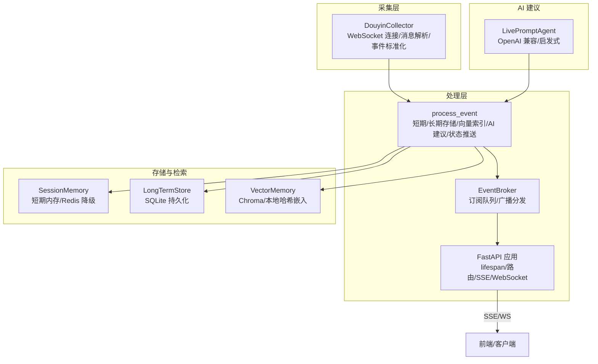
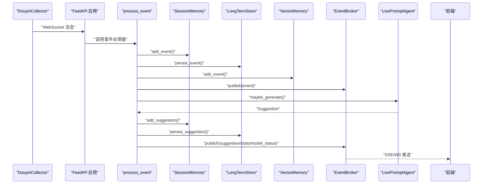
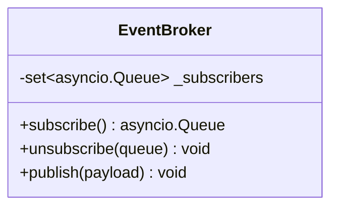
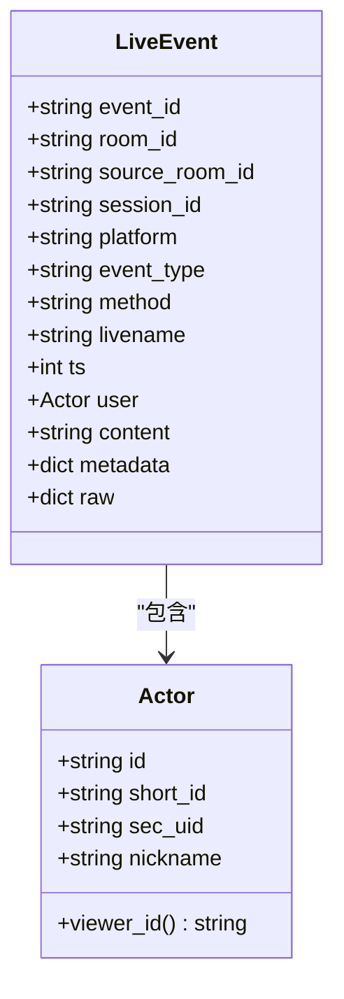
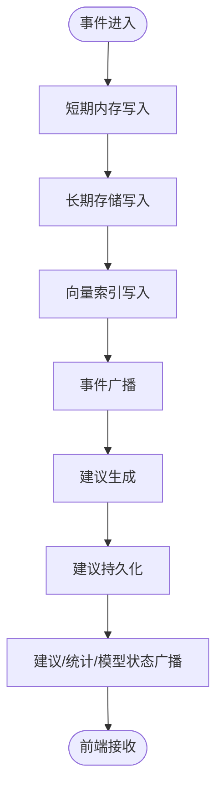
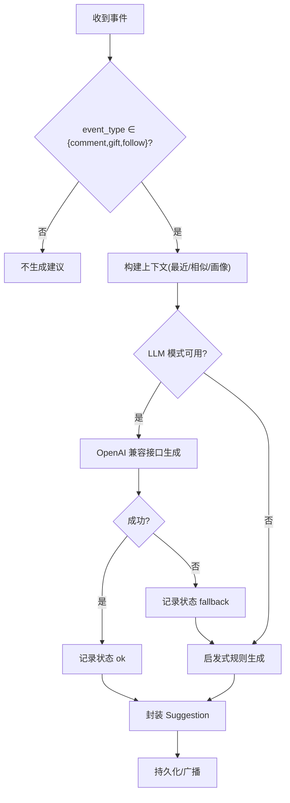
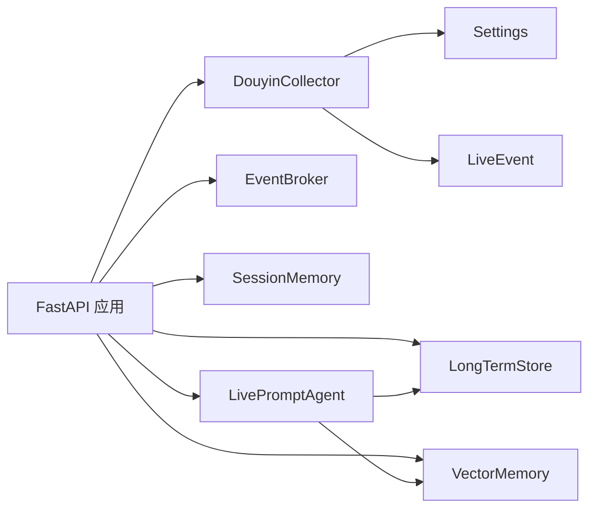

# 事件处理系统

<cite>
**本文引用的文件**
- [backend/services/broker.py](file://backend/services/broker.py)
- [backend/services/collector.py](file://backend/services/collector.py)
- [backend/schemas/live.py](file://backend/schemas/live.py)
- [backend/app.py](file://backend/app.py)
- [backend/config.py](file://backend/config.py)
- [backend/services/agent.py](file://backend/services/agent.py)
- [backend/memory/session_memory.py](file://backend/memory/session_memory.py)
- [backend/memory/long_term.py](file://backend/memory/long_term.py)
- [backend/memory/vector_store.py](file://backend/memory/vector_store.py)
- [README.md](file://README.md)
</cite>

## 目录
1. [简介](#简介)
2. [项目结构](#项目结构)
3. [核心组件](#核心组件)
4. [架构总览](#架构总览)
5. [详细组件分析](#详细组件分析)
6. [依赖分析](#依赖分析)
7. [性能考虑](#性能考虑)
8. [故障排查指南](#故障排查指南)
9. [结论](#结论)
10. [附录](#附录)

## 简介
本技术文档围绕事件处理系统展开，重点解释以下方面：
- 发布订阅模式的实现：EventBroker 的设计、订阅队列管理与消息分发机制
- DouyinCollector 的工作原理：WebSocket 连接管理、消息解析与事件标准化
- LiveEvent 数据模型：字段定义、验证规则与序列化机制
- 事件处理流水线：从采集、存储、向量检索到 AI 建议生成的完整流程
- 开发者扩展点与性能优化策略

该系统采用 FastAPI 提供 REST、SSE 与 WebSocket 接口，结合短期内存、长期存储与向量检索，形成“采集-标准化-存储-检索-建议-推送”的闭环。

## 项目结构
后端主要由以下模块构成：
- 应用入口与路由：FastAPI 应用、生命周期钩子、SSE/WebSocket 推送
- 事件采集：DouyinCollector（WebSocket 连接、消息解析、事件标准化）
- 事件总线：EventBroker（订阅队列、广播分发）
- 事件处理：process_event（短期/长期存储、向量索引、AI 建议、状态推送）
- 记忆与存储：SessionMemory（短期）、LongTermStore（SQLite）、VectorMemory（向量检索）
- AI 建议：LivePromptAgent（OpenAI 兼容/启发式双轨）
- 配置：Settings（环境变量与默认值解析）



图表来源
- [backend/services/collector.py:38-284](file://backend/services/collector.py#L38-L284)
- [backend/app.py:61-78](file://backend/app.py#L61-L78)
- [backend/services/broker.py:10-40](file://backend/services/broker.py#L10-L40)
- [backend/memory/session_memory.py:17-113](file://backend/memory/session_memory.py#L17-L113)
- [backend/memory/long_term.py:36-750](file://backend/memory/long_term.py#L36-L750)
- [backend/memory/vector_store.py:52-108](file://backend/memory/vector_store.py#L52-L108)
- [backend/services/agent.py:23-393](file://backend/services/agent.py#L23-L393)

章节来源
- [README.md:21-34](file://README.md#L21-L34)
- [backend/app.py:94-220](file://backend/app.py#L94-L220)

## 核心组件
- EventBroker：进程内事件广播器，维护订阅者集合，负责将消息广播给所有订阅队列，并清理过期队列
- DouyinCollector：连接本地 douyinLive WebSocket，解析消息，标准化为 LiveEvent，提交到 FastAPI 事件循环
- LiveEvent：统一的事件数据模型，包含平台、类型、时间戳、用户、内容、元数据等
- SessionMemory：短期会话内存，支持 Redis 与进程内降级
- LongTermStore：SQLite 长期存储，维护事件、建议、用户画像、会话、备注等表
- VectorMemory：向量检索，Chroma 可选，否则使用本地哈希嵌入函数
- LivePromptAgent：建议生成器，优先 OpenAI 兼容接口，失败回退启发式规则
- FastAPI 应用：提供健康检查、房间切换、事件注入、SSE/WS 推送、Bootstrap 快照

章节来源
- [backend/services/broker.py:10-40](file://backend/services/broker.py#L10-L40)
- [backend/services/collector.py:38-284](file://backend/services/collector.py#L38-L284)
- [backend/schemas/live.py:29-44](file://backend/schemas/live.py#L29-L44)
- [backend/memory/session_memory.py:17-113](file://backend/memory/session_memory.py#L17-L113)
- [backend/memory/long_term.py:36-750](file://backend/memory/long_term.py#L36-L750)
- [backend/memory/vector_store.py:52-108](file://backend/memory/vector_store.py#L52-L108)
- [backend/services/agent.py:23-393](file://backend/services/agent.py#L23-L393)
- [backend/app.py:61-78](file://backend/app.py#L61-L78)

## 架构总览
系统采用“采集-处理-存储-检索-建议-推送”的流水线：
- 采集：DouyinCollector 通过 WebSocket 接收原始消息，解析为 LiveEvent
- 处理：process_event 将事件写入短期/长期存储，构建向量索引，触发 AI 建议生成
- 广播：EventBroker 将事件、建议、统计、模型状态推送到 SSE/WS
- 前端：通过 SSE/WS 实时接收事件流，渲染提词卡片与状态



图表来源
- [backend/services/collector.py:145-159](file://backend/services/collector.py#L145-L159)
- [backend/app.py:61-78](file://backend/app.py#L61-L78)
- [backend/services/broker.py:28-40](file://backend/services/broker.py#L28-L40)
- [backend/services/agent.py:73-94](file://backend/services/agent.py#L73-L94)
- [backend/memory/session_memory.py:42-64](file://backend/memory/session_memory.py#L42-L64)
- [backend/memory/long_term.py:420-454](file://backend/memory/long_term.py#L420-L454)
- [backend/memory/vector_store.py:64-83](file://backend/memory/vector_store.py#L64-L83)

## 详细组件分析

### EventBroker 组件分析
- 设计要点
  - 维护订阅者集合（asyncio.Queue），提供 subscribe/unsubscribe/publish
  - publish 时尝试非阻塞入队，遇到队列满则标记为“过期队列”，随后统一清理
- 关键流程
  - 订阅：创建新队列并加入集合
  - 广播：遍历集合 put_nowait，捕获 QueueFull，收集过期队列
  - 清理：批量从集合移除过期队列，避免内存泄漏
- 错误处理
  - 非阻塞入队失败即视为订阅者消费慢，自动剔除，降低广播成本
- 性能影响
  - 队列满时清理过期队列，避免无限增长
  - 广播复杂度 O(N)，N 为订阅者数量



图表来源
- [backend/services/broker.py:10-40](file://backend/services/broker.py#L10-L40)

章节来源
- [backend/services/broker.py:10-40](file://backend/services/broker.py#L10-L40)

### DouyinCollector 组件分析
- 设计要点
  - 独立线程运行 WebSocketApp，支持重连、心跳、优雅停止
  - 将 JSON 消息解析为 LiveEvent，提交到 FastAPI 事件循环（线程安全）
  - 方法到事件类型的映射，礼物、点赞、成员、关注等
- 关键流程
  - start：创建守护线程，启动 run_forever 循环
  - _on_message：JSON 解析 -> normalize_event -> _submit_event
  - _submit_event：run_coroutine_threadsafe 提交到事件循环
  - _start_ping_loop：定期发送 ping，维持连接
  - stop：设置停止事件，关闭 WS，等待线程退出
- 错误处理
  - 连接异常、解析失败、提交失败均有日志记录
  - 重连延迟可配置，避免频繁抖动
- 性能影响
  - 线程与事件循环解耦，避免阻塞
  - 心跳线程独立，减少主线程负担

```mermaid
sequenceDiagram
participant T as "Collector 线程"
participant WS as "WebSocketApp"
participant N as "normalize_event"
participant LOOP as "FastAPI 事件循环"
participant EH as "event_handler(process_event)"
T->>WS : "run_forever()"
WS-->>T : "on_message(JSON)"
T->>N : "解析并标准化"
N-->>T : "LiveEvent"
T->>LOOP : "run_coroutine_threadsafe(EH)"
LOOP->>EH : "异步处理"
WS-->>T : "on_error/on_close"
T->>T : "重连/心跳/停止"
```

图表来源
- [backend/services/collector.py:117-139](file://backend/services/collector.py#L117-L139)
- [backend/services/collector.py:145-159](file://backend/services/collector.py#L145-L159)
- [backend/services/collector.py:200-207](file://backend/services/collector.py#L200-L207)

章节来源
- [backend/services/collector.py:38-284](file://backend/services/collector.py#L38-L284)

### LiveEvent 数据模型分析
- 字段定义
  - event_id、room_id、source_room_id、session_id、platform、event_type、method、livename、ts
  - user：Actor（id、short_id、sec_uid、nickname）
  - content、metadata、raw
- 验证规则
  - 使用 Pydantic BaseModel，字段类型与默认值约束
  - Actor 的 viewer_id 属性按 id/secUid/shortId/nickname 生成唯一标识
- 序列化机制
  - model_dump()/model_dump_json() 用于持久化与传输
  - FastAPI 路由中广泛使用 model_dump() 返回 JSON
- 扩展建议
  - 新增字段时注意数据库迁移与索引维护
  - 保持 metadata/raw 的可扩展性，便于后续解析



图表来源
- [backend/schemas/live.py:8-44](file://backend/schemas/live.py#L8-L44)

章节来源
- [backend/schemas/live.py:8-44](file://backend/schemas/live.py#L8-L44)

### 事件处理流水线分析
- 入口与生命周期
  - FastAPI lifespan 启动 Collector，应用关闭时停止
  - /api/events 接口可手动注入事件，便于联调
- 处理步骤
  - 写入短期内存（SessionMemory）
  - 写入长期存储（LongTermStore）
  - 写入向量索引（VectorMemory）
  - 广播事件（EventBroker）
  - 生成建议（LivePromptAgent）并持久化
  - 广播建议/统计/模型状态
- SSE/WS 推送
  - /api/events/stream：SSE，按 room_id 过滤
  - /ws/live：WebSocket，先发送 bootstrap 快照



图表来源
- [backend/app.py:61-78](file://backend/app.py#L61-L78)
- [backend/app.py:187-206](file://backend/app.py#L187-L206)
- [backend/app.py:209-220](file://backend/app.py#L209-L220)

章节来源
- [backend/app.py:61-78](file://backend/app.py#L61-L78)
- [backend/app.py:187-220](file://backend/app.py#L187-L220)

### 记忆与存储组件分析
- SessionMemory
  - Redis 模式：LPUSH/LTRIM/EXPIRE 控制容量与 TTL
  - 降级模式：进程内 deque，限制窗口大小
  - 提供 recent_events/recent_suggestions/stats/snapshot
- LongTermStore
  - SQLite 表：events、suggestions、viewer_profiles、viewer_gifts、live_sessions、viewer_notes
  - 自动建表/索引/列回填，保证演进兼容
  - 会话聚合：活动会话维护、用户画像与礼物历史更新
  - 提供快照、统计、用户详情、会话历史、备注等查询
- VectorMemory
  - Chroma 可选：PersistentClient + Collection
  - 降级：HashEmbeddingFunction + 文本相似度近似

章节来源
- [backend/memory/session_memory.py:17-113](file://backend/memory/session_memory.py#L17-L113)
- [backend/memory/long_term.py:36-750](file://backend/memory/long_term.py#L36-L750)
- [backend/memory/vector_store.py:52-108](file://backend/memory/vector_store.py#L52-L108)

### AI 建议生成器分析
- 生成策略
  - 仅对 comment/gift/follow 生成建议
  - 构造上下文：最近事件、相似历史、用户画像
  - 优先 OpenAI 兼容接口，失败回退启发式规则
- 状态管理
  - 维护当前模型状态（mode、model、backend、last_result、last_error、updated_at）
  - 通过 /api/events/stream 推送 model_status
- 错误处理
  - 网络错误、HTTP 错误、超时、JSON 解析失败、字段缺失均有分支处理
  - 统一记录并标记状态



图表来源
- [backend/services/agent.py:73-114](file://backend/services/agent.py#L73-L114)
- [backend/services/agent.py:183-330](file://backend/services/agent.py#L183-L330)
- [backend/services/agent.py:331-393](file://backend/services/agent.py#L331-L393)

章节来源
- [backend/services/agent.py:23-393](file://backend/services/agent.py#L23-L393)

## 依赖分析
- 组件耦合
  - FastAPI 应用依赖 Collector、EventBroker、SessionMemory、LongTermStore、VectorMemory、LivePromptAgent
  - Collector 依赖 Settings 与 LiveEvent
  - Agent 依赖 VectorMemory 与 LongTermStore
  - Memory 层之间低耦合，通过数据模型交互
- 外部依赖
  - websocket-client（WebSocket）
  - fastapi/uvicorn（HTTP/SSE/WS）
  - redis（可选）
  - chromadb（可选）
  - sqlite3（内置）



图表来源
- [backend/app.py:13-30](file://backend/app.py#L13-L30)
- [backend/services/collector.py:16-17](file://backend/services/collector.py#L16-L17)
- [backend/services/agent.py:24-29](file://backend/services/agent.py#L24-L29)

章节来源
- [backend/app.py:13-30](file://backend/app.py#L13-L30)
- [backend/config.py:39-94](file://backend/config.py#L39-L94)

## 性能考虑
- 订阅队列管理
  - EventBroker 在广播时清理过期队列，避免内存膨胀
  - 建议：合理设置订阅者上限，避免过多并发消费者导致队列积压
- WebSocket 与线程
  - Collector 使用独立线程与心跳线程，避免阻塞事件循环
  - 建议：根据流量调整 ping 间隔与重连延迟
- 存储与索引
  - SessionMemory：Redis 模式下利用 LTRIM 控制窗口，TTL 控制生命周期
  - LongTermStore：索引覆盖高频查询字段，避免全表扫描
  - VectorMemory：Chroma 可选，降级时使用哈希嵌入，保证检索可用性
- 建议生成
  - 仅对关键事件生成建议，减少不必要的计算
  - 回退策略确保稳定性，避免模型异常影响整体链路
- SSE/WS 推送
  - SSE 使用 retry 与事件过滤，降低无效推送
  - 建议：前端按 room_id 过滤，后端按类型过滤，减少带宽占用

[本节为通用性能建议，无需特定文件引用]

## 故障排查指南
- WebSocket 连接问题
  - 检查 Collector 配置（host/port/room_id）与重连延迟
  - 查看日志中的 on_error/on_close 与重连提示
- 事件未到达前端
  - 确认 SSE/WS 订阅是否正确过滤 room_id
  - 检查 EventBroker 是否仍在广播，订阅者是否被清理
- 建议未生成
  - 检查 LivePromptAgent 的状态推送与错误日志
  - 确认 LLM 模式与 API Key 配置
- 存储异常
  - SQLite 表结构变更与索引重建逻辑已在 LongTermStore 内部处理
  - 如遇列缺失，确认回填逻辑是否执行

章节来源
- [backend/services/collector.py:161-181](file://backend/services/collector.py#L161-L181)
- [backend/app.py:187-220](file://backend/app.py#L187-L220)
- [backend/services/agent.py:23-393](file://backend/services/agent.py#L23-L393)
- [backend/memory/long_term.py:155-154](file://backend/memory/long_term.py#L155-L154)

## 结论
该事件处理系统以 FastAPI 为核心，结合 Collector、EventBroker、Memory、Vector、Agent 形成完整的实时事件处理链路。系统具备良好的可扩展性与容错能力：WebSocket 采集、事件标准化、短期/长期存储、向量检索、AI 建议与实时推送。通过合理的订阅队列管理、存储索引与回退策略，能够在不同环境下稳定运行，并为后续扩展提供清晰的接口与路径。

[本节为总结性内容，无需特定文件引用]

## 附录
- 开发者扩展建议
  - 新增事件类型：在 Collector 的方法映射中添加映射，完善 normalize_event 的字段提取
  - 新增存储表：在 LongTermStore 中新增表结构与索引，遵循现有迁移与回填模式
  - 新增建议规则：在 LivePromptAgent 中扩展上下文与规则分支
  - 新增推送通道：在 FastAPI 中新增路由或修改 EventEnvelope 类型
- 性能优化策略
  - 限流与背压：在 EventBroker 中引入队列长度阈值与丢弃策略
  - 缓存热点：对高频查询结果进行缓存（如统计、快照）
  - 异步化：进一步将阻塞操作（网络/磁盘）异步化
  - 资源池：对第三方接口（LLM）使用连接池与并发控制

[本节为通用建议，无需特定文件引用]