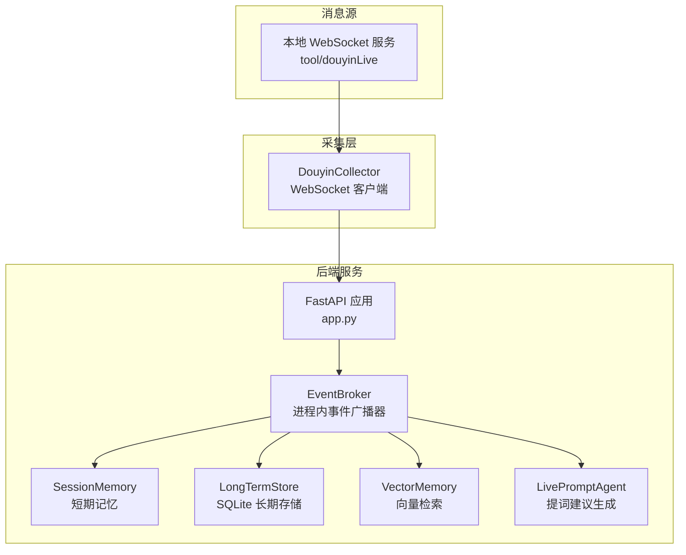
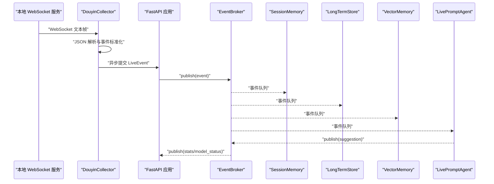
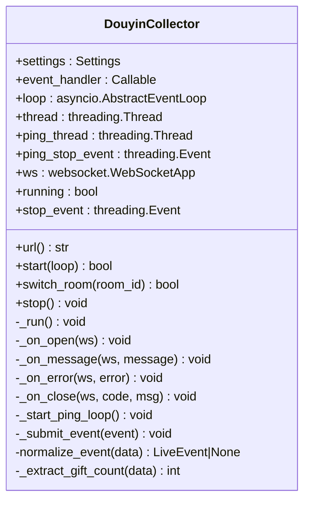
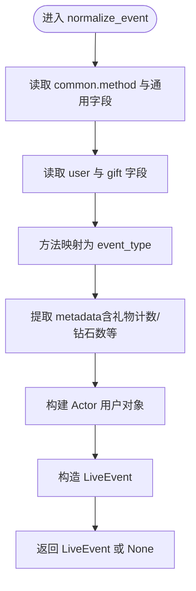
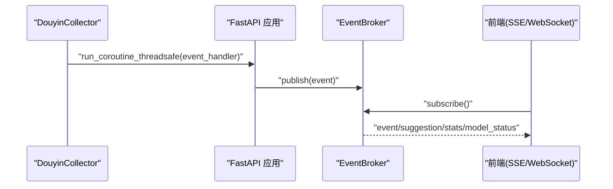
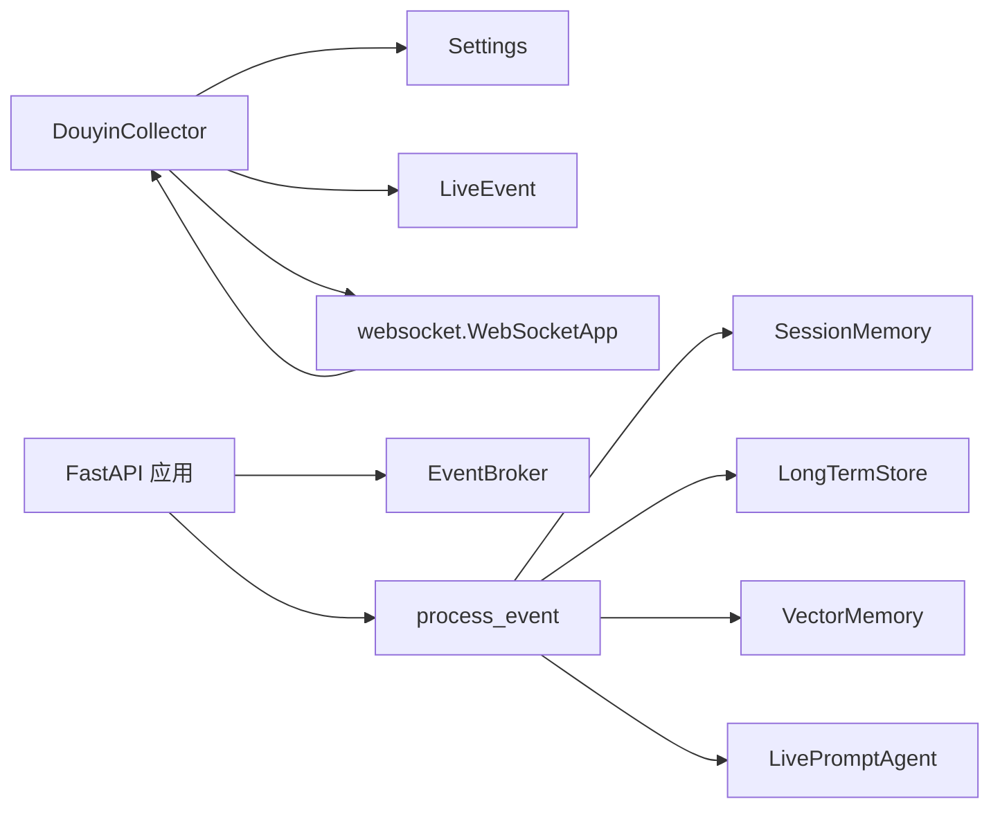

# 事件采集器

<cite>
**本文引用的文件**
- [backend/services/collector.py](file://backend/services/collector.py)
- [backend/services/broker.py](file://backend/services/broker.py)
- [backend/schemas/live.py](file://backend/schemas/live.py)
- [backend/app.py](file://backend/app.py)
- [backend/config.py](file://backend/config.py)
- [backend/memory/session_memory.py](file://backend/memory/session_memory.py)
- [backend/memory/long_term.py](file://backend/memory/long_term.py)
- [backend/services/agent.py](file://backend/services/agent.py)
- [tool/config.yaml](file://tool/config.yaml)
- [README.md](file://README.md)
</cite>

## 目录
1. [简介](#简介)
2. [项目结构](#项目结构)
3. [核心组件](#核心组件)
4. [架构总览](#架构总览)
5. [详细组件分析](#详细组件分析)
6. [依赖关系分析](#依赖关系分析)
7. [性能考量](#性能考量)
8. [故障排查指南](#故障排查指南)
9. [结论](#结论)
10. [附录](#附录)

## 简介
本技术文档围绕事件采集器展开，重点解释 DouyinCollector 类的工作原理，涵盖 WebSocket 连接建立、消息接收与事件解析、不同直播事件类型的处理、消息解析算法、错误处理机制、与 EventBroker 的集成方式以及事件流转到后续处理系统的过程。同时提供配置、调试与性能调优的实用指南，帮助开发者快速上手并稳定运行采集链路。

## 项目结构
后端采用 FastAPI 应用入口，事件采集器作为独立服务组件运行于应用生命周期内，负责从本地 WebSocket 消息源持续拉取直播事件，标准化为统一数据模型，并通过事件总线分发至后续处理模块（短期记忆、长期存储、向量检索、提词建议生成）。

图表来源
- [backend/app.py:81-81](file://backend/app.py#L81)
- [backend/services/collector.py:117-129](file://backend/services/collector.py#L117-L129)
- [backend/services/broker.py:10-39](file://backend/services/broker.py#L10-L39)
- [backend/memory/session_memory.py:17-113](file://backend/memory/session_memory.py#L17-L113)
- [backend/memory/long_term.py:36-750](file://backend/memory/long_term.py#L36-L750)
- [backend/services/agent.py:23-393](file://backend/services/agent.py#L23-L393)

章节来源
- [backend/app.py:81-81](file://backend/app.py#L81-L81)
- [backend/services/collector.py:117-129](file://backend/services/collector.py#L117-L129)
- [backend/services/broker.py:10-39](file://backend/services/broker.py#L10-L39)
- [backend/memory/session_memory.py:17-113](file://backend/memory/session_memory.py#L17-L113)
- [backend/memory/long_term.py:36-750](file://backend/memory/long_term.py#L36-L750)
- [backend/services/agent.py:23-393](file://backend/services/agent.py#L23-L393)

## 核心组件
- 事件采集器：DouyinCollector，负责连接本地 WebSocket、接收消息、解析并标准化为 LiveEvent，提交到事件循环。
- 事件总线：EventBroker，进程内广播器，将事件分发给订阅者（短期记忆、长期存储、向量检索、提词建议）。
- 数据模型：LiveEvent，统一事件结构，包含事件标识、房间信息、平台、事件类型、时间戳、用户信息、内容与元数据。
- 后端应用：FastAPI 应用，负责生命周期管理、路由、SSE/WebSocket 推送、房间切换、事件处理入口。
- 配置中心：Settings，读取环境变量与 .env，提供采集器连接参数、模型参数、存储参数等。
- 存储与记忆：SessionMemory（短期）、LongTermStore（长期）、VectorMemory（向量检索），配合 LivePromptAgent 生成建议。

章节来源
- [backend/services/collector.py:38-284](file://backend/services/collector.py#L38-L284)
- [backend/services/broker.py:10-39](file://backend/services/broker.py#L10-L39)
- [backend/schemas/live.py:29-44](file://backend/schemas/live.py#L29-L44)
- [backend/app.py:61-78](file://backend/app.py#L61-L78)
- [backend/config.py:39-94](file://backend/config.py#L39-L94)
- [backend/memory/session_memory.py:17-113](file://backend/memory/session_memory.py#L17-L113)
- [backend/memory/long_term.py:36-750](file://backend/memory/long_term.py#L36-L750)
- [backend/services/agent.py:23-393](file://backend/services/agent.py#L23-L393)

## 架构总览
事件从本地 WebSocket 消息源进入，经采集器标准化后进入 FastAPI 事件处理流水线，随后写入短期与长期存储，构建向量索引，并触发提词建议生成，最终通过 SSE/WebSocket 推送到前端。

图表来源
- [backend/services/collector.py:145-159](file://backend/services/collector.py#L145-L159)
- [backend/app.py:61-78](file://backend/app.py#L61-L78)
- [backend/services/broker.py:28-39](file://backend/services/broker.py#L28-L39)
- [backend/memory/session_memory.py:42-64](file://backend/memory/session_memory.py#L42-L64)
- [backend/memory/long_term.py:420-454](file://backend/memory/long_term.py#L420-L454)
- [backend/services/agent.py:73-94](file://backend/services/agent.py#L73-L94)

## 详细组件分析

### DouyinCollector：WebSocket 连接与事件采集
- 连接建立
  - 通过 Settings 组合 ws://host:port/ws/{room_id} 形式的 URL。
  - 使用 websocket.WebSocketApp 创建客户端，注册 on_open/on_message/on_error/on_close 回调。
  - 在独立线程中循环 run_forever，断线自动重连，重连间隔可配置。
- 心跳保活
  - 启动独立 ping 线程，按配置周期发送 ping，维持连接活跃。
- 消息接收与解析
  - 忽略 pong 心跳响应。
  - JSON 解析失败则记录警告并丢弃。
  - 调用 normalize_event 将原始消息映射为 LiveEvent。
- 事件提交
  - 通过 asyncio.run_coroutine_threadsafe 将事件回调提交到 FastAPI 事件循环。
  - 异步回调结果通过日志记录异常，避免阻塞采集线程。
- 错误处理
  - 连接异常、关闭、错误均记录日志；stop_event 控制优雅退出。
  - 重连延迟可配置，避免频繁抖动。
- 房间切换
  - 支持动态切换 room_id，内部停止旧连接并重新启动新连接。

图表来源
- [backend/services/collector.py:38-284](file://backend/services/collector.py#L38-L284)

章节来源
- [backend/services/collector.py:54-59](file://backend/services/collector.py#L54-L59)
- [backend/services/collector.py:117-139](file://backend/services/collector.py#L117-L139)
- [backend/services/collector.py:182-198](file://backend/services/collector.py#L182-L198)
- [backend/services/collector.py:145-159](file://backend/services/collector.py#L145-L159)
- [backend/services/collector.py:200-214](file://backend/services/collector.py#L200-L214)
- [backend/services/collector.py:225-284](file://backend/services/collector.py#L225-L284)

### 事件解析与标准化：normalize_event
- 方法映射
  - METHOD_EVENT_TYPE_MAP 将原始 method 映射为统一 event_type："comment"/"gift"/"like"/"member"/"follow"。
- 字段提取
  - 从 common/user/gift/content 等键提取基础字段，兼容多种消息形态。
  - 礼物事件提取 gift_name/gift_id/gift_count/gift_diamond_count/combo/group 等。
- 时间与标识
  - ts 使用 createTime（毫秒），event_id 缺省时生成本地唯一标识。
- 用户标识
  - 通过 Actor.viewer_id 统一生成 viewer_id，优先使用 id/secUid/shortId/nickname。
- 结构化输出
  - 返回 LiveEvent，包含 raw 与 metadata，便于后续处理与回溯。

图表来源
- [backend/services/collector.py:225-284](file://backend/services/collector.py#L225-L284)
- [backend/schemas/live.py:8-27](file://backend/schemas/live.py#L8-L27)

章节来源
- [backend/services/collector.py:225-284](file://backend/services/collector.py#L225-L284)
- [backend/schemas/live.py:29-44](file://backend/schemas/live.py#L29-L44)

### 事件类型处理：礼物、进入、弹幕、点赞、关注
- 礼物事件（WebcastGiftMessage）
  - 提取礼物名称、ID、数量、钻石数、组合/分组计数，标准化为 "gift" 类型。
- 弹幕事件（WebcastChatMessage）
  - 内容来自 content，标准化为 "comment" 类型。
- 点赞事件（WebcastLikeMessage）
  - 标准化为 "like" 类型。
- 用户进入（WebcastMemberMessage）
  - 标准化为 "member" 类型。
- 关注事件（WebcastSocialMessage）
  - 标准化为 "follow" 类型。
- 其他未知方法
  - 标准化为 "system" 类型，便于后续识别与调试。

章节来源
- [backend/services/collector.py:222-228](file://backend/services/collector.py#L222-L228)
- [backend/services/collector.py:244-256](file://backend/services/collector.py#L244-L256)

### 事件采集错误处理机制
- 连接重试
  - run_forever 循环断开后按配置延迟重连，避免瞬时网络波动导致长时间离线。
- 异常恢复
  - 采集线程捕获异常并记录日志，不影响其他线程；ping 线程独立停止。
- 数据完整性
  - 事件标准化失败时记录异常并丢弃，避免污染下游；LiveEvent 构造失败时返回 None。
- 优雅停机
  - stop() 设置 stop_event，关闭 ws 并等待线程退出，确保资源释放。

章节来源
- [backend/services/collector.py:117-139](file://backend/services/collector.py#L117-L139)
- [backend/services/collector.py:161-180](file://backend/services/collector.py#L161-L180)
- [backend/services/collector.py:281-283](file://backend/services/collector.py#L281-L283)

### 与 EventBroker 的集成与事件流转
- 事件提交
  - 采集器通过 _submit_event 将事件回调提交到 FastAPI 事件循环，确保线程安全。
- 广播分发
  - FastAPI 中的 process_event 将事件写入短期/长期存储、向量检索，发布事件、建议、统计与模型状态到 EventBroker。
- 订阅消费
  - SSE 与 WebSocket 接口通过 broker.subscribe 订阅队列，按房间过滤后推送至前端。

图表来源
- [backend/services/collector.py:200-206](file://backend/services/collector.py#L200-L206)
- [backend/app.py:61-78](file://backend/app.py#L61-L78)
- [backend/services/broker.py:16-21](file://backend/services/broker.py#L16-L21)
- [backend/app.py:187-206](file://backend/app.py#L187-L206)
- [backend/app.py:209-220](file://backend/app.py#L209-L220)

章节来源
- [backend/services/collector.py:200-214](file://backend/services/collector.py#L200-L214)
- [backend/app.py:61-78](file://backend/app.py#L61-L78)
- [backend/services/broker.py:16-39](file://backend/services/broker.py#L16-L39)
- [backend/app.py:187-220](file://backend/app.py#L187-L220)

### 采集器配置、调试与性能调优
- 采集器配置项（来自 Settings）
  - ROOM_ID：采集房间 ID。
  - COLLECTOR_ENABLED：是否启用采集器。
  - COLLECTOR_HOST/PORT：本地 WebSocket 地址与端口。
  - COLLECTOR_PING_INTERVAL_SECONDS：心跳间隔。
  - COLLECTOR_RECONNECT_DELAY_SECONDS：断线重连间隔。
- 环境变量与 .env
  - 通过 .env 或环境变量覆盖默认值，便于本地开发与部署。
- 调试建议
  - 开启未知消息类型日志（tool/config.yaml 中的 unknown）辅助定位。
  - 查看采集器日志中的连接、错误、重连与事件处理记录。
- 性能调优
  - 合理设置心跳与重连间隔，避免频繁抖动。
  - 若前端订阅过多，适当降低推送频率或增加订阅端限流。
  - 存储层可启用 Redis 与 Chroma 以提升短期与向量检索性能。

章节来源
- [backend/config.py:39-94](file://backend/config.py#L39-L94)
- [tool/config.yaml:1-16](file://tool/config.yaml#L1-L16)
- [README.md:142-207](file://README.md#L142-L207)

## 依赖关系分析
- 采集器依赖
  - Settings：提供连接参数与运行配置。
  - LiveEvent：标准化事件数据结构。
  - websocket.WebSocketApp：WebSocket 客户端。
- 应用层依赖
  - FastAPI 生命周期管理，事件处理函数 process_event。
  - EventBroker：事件广播。
  - SessionMemory/LongTermStore/VectorMemory/LivePromptAgent：事件处理与存储。
- 外部依赖
  - 本地 WebSocket 服务（tool/douyinLive）提供直播事件源。

图表来源
- [backend/services/collector.py:16-17](file://backend/services/collector.py#L16-L17)
- [backend/schemas/live.py:29-44](file://backend/schemas/live.py#L29-L44)
- [backend/app.py:61-78](file://backend/app.py#L61-L78)
- [backend/services/broker.py:28-39](file://backend/services/broker.py#L28-L39)
- [backend/memory/session_memory.py:42-64](file://backend/memory/session_memory.py#L42-L64)
- [backend/memory/long_term.py:420-454](file://backend/memory/long_term.py#L420-L454)
- [backend/services/agent.py:73-94](file://backend/services/agent.py#L73-L94)

章节来源
- [backend/services/collector.py:16-17](file://backend/services/collector.py#L16-L17)
- [backend/app.py:61-78](file://backend/app.py#L61-L78)
- [backend/services/broker.py:28-39](file://backend/services/broker.py#L28-L39)
- [backend/memory/session_memory.py:42-64](file://backend/memory/session_memory.py#L42-L64)
- [backend/memory/long_term.py:420-454](file://backend/memory/long_term.py#L420-L454)
- [backend/services/agent.py:73-94](file://backend/services/agent.py#L73-L94)

## 性能考量
- 线程模型
  - 采集与心跳在独立线程运行，避免阻塞事件循环。
- 异步提交
  - 通过 run_coroutine_threadsafe 提交事件处理，保证事件循环吞吐。
- 存储与检索
  - Redis 与 Chroma 可选启用，显著提升短期与向量检索性能。
- 日志与可观测性
  - 采集器与 Agent 均提供详细日志，便于定位性能瓶颈与异常。

## 故障排查指南
- 无法连接本地 WebSocket
  - 检查 tool/config.yaml 中 port 与房间号是否正确。
  - 确认本地消息源已启动且端口未被占用。
- 采集器未启动
  - 检查 COLLECTOR_ENABLED 与 ROOM_ID 是否有效。
  - 查看日志中“collector disabled/skipped”提示。
- 断线频繁
  - 调整 COLLECTOR_PING_INTERVAL_SECONDS 与 COLLECTOR_RECONNECT_DELAY_SECONDS。
- 事件未到达前端
  - 检查 SSE/WebSocket 订阅端是否正确过滤房间。
  - 查看 EventBroker 订阅队列是否积压或被清理。
- 建议生成失败
  - 检查 LLM_MODE 与 API Key 配置，确认回退逻辑是否生效。

章节来源
- [backend/services/collector.py:62-68](file://backend/services/collector.py#L62-L68)
- [backend/services/collector.py:127-138](file://backend/services/collector.py#L127-L138)
- [backend/services/broker.py:31-39](file://backend/services/broker.py#L31-L39)
- [backend/services/agent.py:96-114](file://backend/services/agent.py#L96-L114)

## 结论
DouyinCollector 通过稳定的 WebSocket 连接、健壮的错误处理与异步事件提交，实现了对抖音直播事件的可靠采集与标准化。结合 EventBroker 的广播机制与多层存储/检索能力，形成完整的实时事件处理流水线。合理配置与调优可进一步提升稳定性与性能，满足生产环境需求。

## 附录
- 标准事件格式与事件类型映射详见 README 的“标准事件格式”与“当前内置事件类型映射”。

章节来源
- [README.md:276-307](file://README.md#L276-L307)