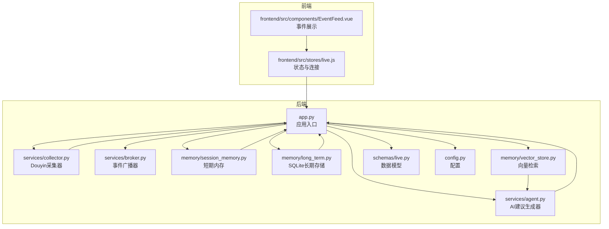
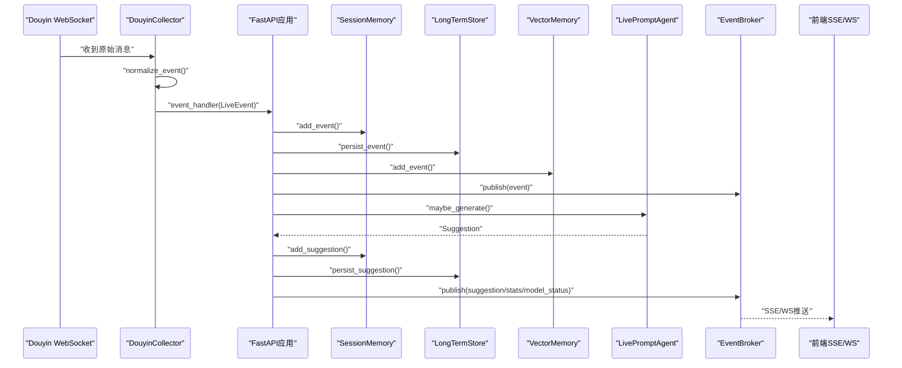
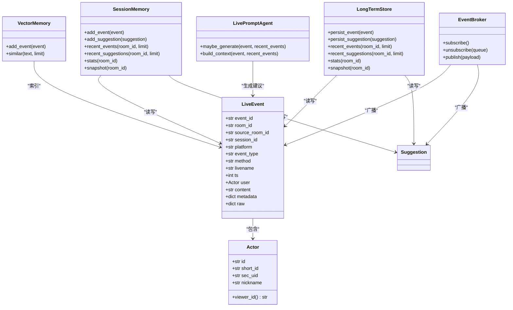
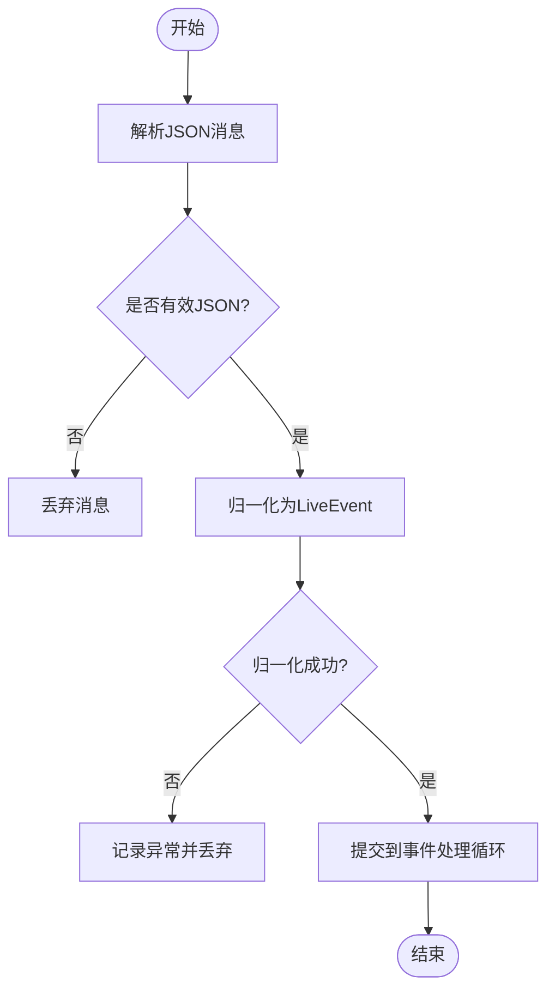
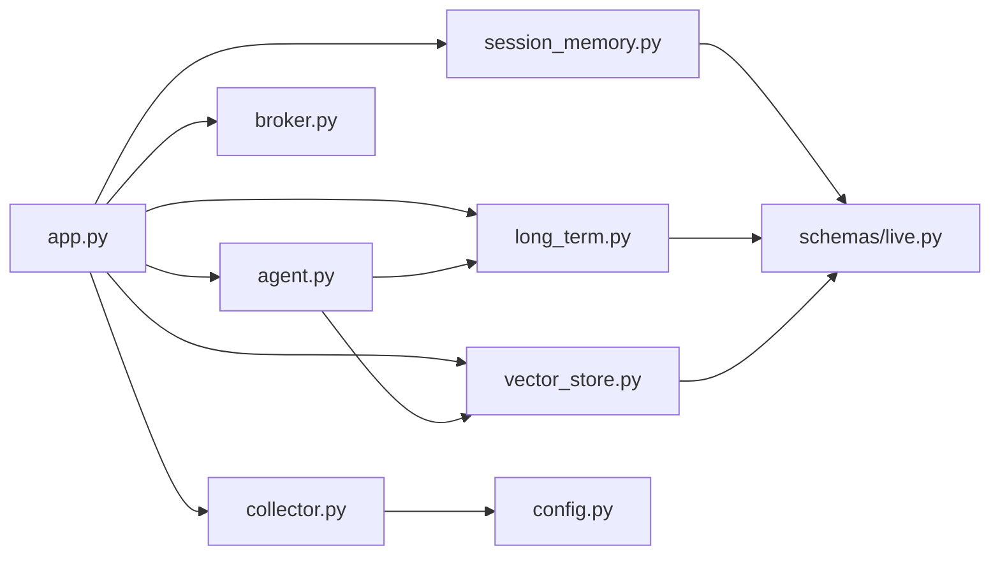

# 直播事件数据模型

<cite>
**本文档引用的文件**
- [backend/schemas/live.py](file://backend/schemas/live.py)
- [backend/memory/session_memory.py](file://backend/memory/session_memory.py)
- [backend/memory/long_term.py](file://backend/memory/long_term.py)
- [backend/memory/vector_store.py](file://backend/memory/vector_store.py)
- [backend/services/collector.py](file://backend/services/collector.py)
- [backend/services/broker.py](file://backend/services/broker.py)
- [backend/services/agent.py](file://backend/services/agent.py)
- [backend/app.py](file://backend/app.py)
- [backend/config.py](file://backend/config.py)
- [frontend/src/stores/live.js](file://frontend/src/stores/live.js)
- [frontend/src/components/EventFeed.vue](file://frontend/src/components/EventFeed.vue)
</cite>

## 目录
1. [简介](#简介)
2. [项目结构](#项目结构)
3. [核心组件](#核心组件)
4. [架构总览](#架构总览)
5. [详细组件分析](#详细组件分析)
6. [依赖关系分析](#依赖关系分析)
7. [性能考量](#性能考量)
8. [故障排查指南](#故障排查指南)
9. [结论](#结论)
10. [附录](#附录)

## 简介
本文件面向直播事件数据模型，围绕 LiveEvent 类的设计理念、字段定义、数据类型与验证规则进行深入解析；梳理事件类型分类体系（礼物、互动、系统等）；阐明数据序列化与反序列化机制（JSON 转换、字段映射、默认值处理）；解释事件数据生命周期（创建时间戳、事件状态、持久化）；说明与内存存储、向量检索、AI 建议系统的数据交互；并提供扩展方法与最佳实践，帮助开发者高效、安全地扩展事件模型。

## 项目结构
后端采用分层设计：数据模型层（schemas）、内存层（session_memory、vector_store）、长期存储层（long_term）、采集与处理层（collector、broker、agent），以及应用入口（app）与配置（config）。前端通过 SSE/WS 接收事件流，消费后端提供的事件与建议。

图表来源
- [backend/app.py:1-220](file://backend/app.py#L1-L220)
- [backend/services/collector.py:1-284](file://backend/services/collector.py#L1-L284)
- [backend/services/broker.py:1-40](file://backend/services/broker.py#L1-L40)
- [backend/memory/session_memory.py:1-113](file://backend/memory/session_memory.py#L1-L113)
- [backend/memory/long_term.py:1-750](file://backend/memory/long_term.py#L1-L750)
- [backend/memory/vector_store.py:1-108](file://backend/memory/vector_store.py#L1-L108)
- [backend/services/agent.py:1-393](file://backend/services/agent.py#L1-L393)
- [backend/schemas/live.py:1-95](file://backend/schemas/live.py#L1-L95)
- [backend/config.py:1-94](file://backend/config.py#L1-L94)
- [frontend/src/stores/live.js:1-310](file://frontend/src/stores/live.js#L1-L310)
- [frontend/src/components/EventFeed.vue:1-183](file://frontend/src/components/EventFeed.vue#L1-L183)

章节来源
- [backend/app.py:1-220](file://backend/app.py#L1-L220)
- [backend/schemas/live.py:1-95](file://backend/schemas/live.py#L1-L95)

## 核心组件
- 数据模型层：以 Pydantic BaseModel 定义，确保字段类型、默认值与验证一致性。
- 内存层：短期内存（Redis/本地deque）与向量检索（Chroma/本地近似）。
- 长期存储：SQLite 表结构与索引，支持事件、建议、用户画像、会话等。
- 采集与处理：WebSocket 连接、消息归一化、事件处理流水线。
- AI 建议：OpenAI 兼容接口或本地启发式规则。
- 应用入口：FastAPI 提供健康检查、事件流、房间切换、引导快照等接口。
- 前端：SSE/WS 接收事件流，渲染事件与建议。

章节来源
- [backend/schemas/live.py:29-44](file://backend/schemas/live.py#L29-L44)
- [backend/memory/session_memory.py:17-113](file://backend/memory/session_memory.py#L17-L113)
- [backend/memory/long_term.py:36-750](file://backend/memory/long_term.py#L36-L750)
- [backend/memory/vector_store.py:52-108](file://backend/memory/vector_store.py#L52-L108)
- [backend/services/collector.py:38-284](file://backend/services/collector.py#L38-L284)
- [backend/services/agent.py:23-393](file://backend/services/agent.py#L23-L393)
- [backend/app.py:61-220](file://backend/app.py#L61-L220)
- [frontend/src/stores/live.js:70-310](file://frontend/src/stores/live.js#L70-L310)

## 架构总览
事件从采集器进入，经归一化后进入处理流水线：短期内存缓存、长期存储落盘、向量检索索引、AI 建议生成、事件广播器分发、前端接收渲染。

图表来源
- [backend/services/collector.py:145-284](file://backend/services/collector.py#L145-L284)
- [backend/app.py:61-78](file://backend/app.py#L61-L78)
- [backend/memory/session_memory.py:42-84](file://backend/memory/session_memory.py#L42-L84)
- [backend/memory/long_term.py:420-454](file://backend/memory/long_term.py#L420-L454)
- [backend/memory/vector_store.py:64-83](file://backend/memory/vector_store.py#L64-L83)
- [backend/services/agent.py:73-94](file://backend/services/agent.py#L73-L94)
- [backend/services/broker.py:28-40](file://backend/services/broker.py#L28-L40)
- [frontend/src/stores/live.js:173-205](file://frontend/src/stores/live.js#L173-L205)

## 详细组件分析

### LiveEvent 数据模型设计
LiveEvent 是跨采集、存储、API 的标准化事件载体，采用 Pydantic BaseModel，具备强类型约束与默认值处理。

- 字段定义与类型
  - event_id: str（唯一标识）
  - room_id: str（房间标识）
  - source_room_id: str（来源房间，用于跨房间事件）
  - session_id: str（会话标识，用于同一直播会话）
  - platform: str（平台，默认 douyin）
  - event_type: str（事件类型）
  - method: str（来源方法，默认 unknown）
  - livename: str（直播间名称，默认“未知直播间”）
  - ts: int（毫秒级时间戳）
  - user: Actor（用户身份，含 id、short_id、sec_uid、nickname）
  - content: str（事件内容）
  - metadata: dict[str, Any]（元数据字典）
  - raw: dict[str, Any]（原始消息）

- 默认值与验证规则
  - 平台默认值、昵称默认值、时间戳缺失时回退策略在归一化阶段处理。
  - user 的 viewer_id 属性提供统一标识生成逻辑，优先级：id > sec_uid > short_id > nickname。
  - metadata 与 raw 保留原始结构，便于后续扩展与溯源。

- 字段映射与序列化
  - 使用 model_dump()/model_dump_json() 进行序列化，便于内存与网络传输。
  - 反序列化使用 model_validate_json()，确保输入合法性。

- 生命周期与状态
  - 创建：采集器归一化时生成 event_id、ts、room_id 等。
  - 处理：短期内存缓存、长期存储落盘、向量索引、建议生成。
  - 状态：通过 session_id 关联直播会话，通过 metadata 记录来源与行为。

章节来源
- [backend/schemas/live.py:29-44](file://backend/schemas/live.py#L29-L44)
- [backend/schemas/live.py:8-27](file://backend/schemas/live.py#L8-L27)
- [backend/services/collector.py:225-284](file://backend/services/collector.py#L225-L284)
- [backend/memory/session_memory.py:42-84](file://backend/memory/session_memory.py#L42-L84)
- [backend/memory/long_term.py:420-454](file://backend/memory/long_term.py#L420-L454)
- [backend/memory/vector_store.py:64-83](file://backend/memory/vector_store.py#L64-L83)

### 事件类型分类体系
事件类型由采集器根据 method 映射而来，支持以下类别：
- 礼物事件：WebcastGiftMessage → event_type="gift"
- 互动事件：WebcastChatMessage → event_type="comment"
- 系统事件：其他未匹配方法 → event_type="system"
- 其他常见事件：点赞、成员加入、关注等

采集器还对不同事件类型补充 metadata 字段，如礼物事件包含 gift_name、gift_id、gift_count、gift_diamond_count 等，便于后续统计与建议生成。

章节来源
- [backend/services/collector.py:22-28](file://backend/services/collector.py#L22-L28)
- [backend/services/collector.py:225-284](file://backend/services/collector.py#L225-L284)
- [backend/memory/session_memory.py:86-102](file://backend/memory/session_memory.py#L86-L102)

### 数据序列化与反序列化机制
- 序列化
  - 内存层：使用 model_dump_json() 将 LiveEvent/Suggestion 序列化为 JSON 字符串，写入 Redis 列表或本地 deque。
  - 长期存储：将 metadata/raw 作为 JSON 文本存入 events/suggestions 表。
  - 向量检索：将用户昵称+内容拼接为 document，计算嵌入向量后写入向量库或本地近似方案。
- 反序列化
  - 内存层：从 Redis 读取 JSON 字符串，使用 model_validate_json() 还原为对象。
  - 长期存储：从 events/suggestions 表读取 JSON 文本，还原为 LiveEvent/Suggestion。
- 默认值处理
  - Pydantic 字段默认值在模型定义中声明；归一化阶段对缺失字段提供回退策略（如 ts、livename、viewer_id）。

章节来源
- [backend/memory/session_memory.py:42-84](file://backend/memory/session_memory.py#L42-L84)
- [backend/memory/long_term.py:420-502](file://backend/memory/long_term.py#L420-L502)
- [backend/memory/vector_store.py:64-108](file://backend/memory/vector_store.py#L64-L108)
- [backend/services/collector.py:225-284](file://backend/services/collector.py#L225-L284)

### 事件数据生命周期管理
- 创建时间戳：采集器从原始消息提取 createTime，若缺失则回退到当前时间戳。
- 事件状态：通过 live_sessions 表记录会话状态（active/ended），并统计事件计数。
- 数据持久化：
  - 短期：Redis 列表（lpush/ltrim/expire）或本地 deque，控制窗口大小与 TTL。
  - 长期：SQLite 表 events/suggestions，带索引优化查询。
  - 向量：Chroma 或本地近似嵌入，支持相似历史检索。
- 统计与快照：短期内存按事件类型统计，生成 SessionStats；应用层聚合长期统计，形成 SessionSnapshot 返回前端。

章节来源
- [backend/services/collector.py:270-271](file://backend/services/collector.py#L270-L271)
- [backend/memory/session_memory.py:86-113](file://backend/memory/session_memory.py#L86-L113)
- [backend/memory/long_term.py:276-324](file://backend/memory/long_term.py#L276-L324)
- [backend/memory/long_term.py:504-523](file://backend/memory/long_term.py#L504-L523)
- [backend/schemas/live.py:87-94](file://backend/schemas/live.py#L87-L94)

### 与其他组件的数据交互
- 与内存存储交互
  - 写入：短期内存 add_event/add_suggestion；长期存储 persist_event/persist_suggestion。
  - 读取：短期内存 recent_events/recent_suggestions；长期存储 recent_events/recent_suggestions/stats。
- 与 AI 建议系统交互
  - 采集器触发建议生成：process_event 调用 agent.maybe_generate，结合向量检索与用户画像构建上下文。
  - 回退策略：当 LLM 不可用时，使用启发式规则生成建议。
- 与前端交互
  - SSE/WS：EventBroker 将事件与建议推送给前端；前端通过 EventSource/WS 接收并渲染。
  - 引导快照：/api/bootstrap 返回 SessionSnapshot，包含近期事件、建议与统计。

图表来源
- [backend/schemas/live.py:29-61](file://backend/schemas/live.py#L29-L61)
- [backend/memory/session_memory.py:17-113](file://backend/memory/session_memory.py#L17-L113)
- [backend/memory/long_term.py:36-750](file://backend/memory/long_term.py#L36-L750)
- [backend/memory/vector_store.py:52-108](file://backend/memory/vector_store.py#L52-L108)
- [backend/services/agent.py:23-393](file://backend/services/agent.py#L23-L393)
- [backend/services/broker.py:10-40](file://backend/services/broker.py#L10-L40)

章节来源
- [backend/app.py:61-78](file://backend/app.py#L61-L78)
- [backend/services/agent.py:56-94](file://backend/services/agent.py#L56-L94)
- [backend/services/broker.py:10-40](file://backend/services/broker.py#L10-L40)
- [frontend/src/stores/live.js:173-205](file://frontend/src/stores/live.js#L173-L205)

### 采集与归一化流程
采集器负责连接 WebSocket，解析 JSON，将原始消息归一化为 LiveEvent，并提交到事件处理循环。关键点：
- method 到 event_type 的映射表。
- 礼物事件的多重计数字段提取（repeatCount、comboCount、groupCount）。
- 缺失字段的回退策略（如 content 来自 gift_name）。
- 事件提交到异步循环，避免阻塞网络线程。

图表来源
- [backend/services/collector.py:145-284](file://backend/services/collector.py#L145-L284)

章节来源
- [backend/services/collector.py:145-284](file://backend/services/collector.py#L145-L284)

### 建议生成与回退策略
- 触发条件：仅对 comment/gift/follow 三类事件生成建议。
- 上下文构建：最近事件窗口、相似历史片段、用户画像。
- 生成策略：优先 OpenAI 兼容接口，失败则回退启发式规则。
- 结果落盘：建议写入短期与长期存储，并广播给前端。

章节来源
- [backend/services/agent.py:73-114](file://backend/services/agent.py#L73-L114)
- [backend/services/agent.py:183-329](file://backend/services/agent.py#L183-L329)
- [backend/app.py:61-78](file://backend/app.py#L61-L78)

## 依赖关系分析
- 组件耦合
  - app.py 作为中枢，依赖 collector、broker、session_memory、long_term、vector_memory、agent。
  - collector 依赖 settings 与 schemas。
  - agent 依赖 vector_memory 与 long_term。
  - session_memory 依赖 schemas。
  - long_term 依赖 schemas。
  - vector_store 依赖 schemas。
- 外部依赖
  - Redis（可选）、Chroma（可选）、websocket、urllib（HTTP LLM 调用）。
- 循环依赖
  - 未发现循环导入；各模块职责清晰，通过接口契约交互。

图表来源
- [backend/app.py:1-30](file://backend/app.py#L1-L30)
- [backend/services/collector.py:16-17](file://backend/services/collector.py#L16-L17)
- [backend/services/agent.py:24-29](file://backend/services/agent.py#L24-L29)
- [backend/memory/session_memory.py:9](file://backend/memory/session_memory.py#L9)
- [backend/memory/long_term.py:8](file://backend/memory/long_term.py#L8)
- [backend/memory/vector_store.py:11](file://backend/memory/vector_store.py#L11)
- [backend/config.py:39-94](file://backend/config.py#L39-L94)

章节来源
- [backend/app.py:1-30](file://backend/app.py#L1-L30)
- [backend/services/collector.py:16-17](file://backend/services/collector.py#L16-L17)
- [backend/services/agent.py:24-29](file://backend/services/agent.py#L24-L29)

## 性能考量
- 内存层
  - Redis 模式下使用 lpush/ltrim 控制窗口大小，expire 控制 TTL，适合高吞吐场景。
  - 本地 deque 作为降级方案，容量固定，避免内存无限增长。
- 长期存储
  - SQLite 表建立多索引（room_id/ts、viewer_id、event_type 等），提升查询效率。
  - 按需重建聚合字段，减少重复计算。
- 向量检索
  - Chroma 提供高性能相似检索；本地哈希嵌入函数作为降级方案，保证基本检索能力。
- 建议生成
  - 仅对关键事件类型生成建议，降低 LLM 调用频率。
  - 回退策略确保在 LLM 不可用时仍可稳定工作。

[本节为通用性能讨论，不直接分析具体文件]

## 故障排查指南
- WebSocket 连接问题
  - 检查 collector_host/port、room_id 配置；确认网络可达性。
  - 查看重连延迟与 ping 机制日志。
- 事件丢失或重复
  - 检查 Redis 是否启用及连接参数；确认 ltrim 窗口大小与 expire 设置。
  - 核对 event_id 唯一性与数据库主键约束。
- 建议生成失败
  - 检查 LLM 基础地址、模型名、API Key、超时设置。
  - 查看 agent 日志中的错误码与回退标记。
- 前端无法接收事件
  - 确认 SSE/WS 地址正确；检查 EventSource/WS 连接状态与重连逻辑。
  - 核对过滤器与主题设置，确保事件类型未被全部隐藏。

章节来源
- [backend/services/collector.py:117-198](file://backend/services/collector.py#L117-L198)
- [backend/services/agent.py:232-285](file://backend/services/agent.py#L232-L285)
- [frontend/src/stores/live.js:173-205](file://frontend/src/stores/live.js#L173-L205)

## 结论
LiveEvent 数据模型通过 Pydantic 实现强类型与默认值保障，配合采集、内存、长期存储与向量检索的分层架构，实现了从原始消息到建议输出的完整闭环。事件类型分类清晰，序列化/反序列化机制完善，生命周期管理可控。建议在扩展新事件类型时遵循现有字段命名规范与归一化流程，确保与 AI 建议系统和前端展示的一致性。

[本节为总结性内容，不直接分析具体文件]

## 附录

### 字段与类型对照表
- LiveEvent
  - event_id: str
  - room_id: str
  - source_room_id: str
  - session_id: str
  - platform: str
  - event_type: str
  - method: str
  - livename: str
  - ts: int
  - user: Actor
  - content: str
  - metadata: dict[str, Any]
  - raw: dict[str, Any]
- Actor
  - id: str
  - short_id: str
  - sec_uid: str
  - nickname: str
  - viewer_id: str（属性）

章节来源
- [backend/schemas/live.py:29-61](file://backend/schemas/live.py#L29-L61)

### 事件类型映射表
- WebcastChatMessage → comment
- WebcastGiftMessage → gift
- WebcastLikeMessage → like
- WebcastMemberMessage → member
- WebcastSocialMessage → follow

章节来源
- [backend/services/collector.py:22-28](file://backend/services/collector.py#L22-L28)

### 扩展方法与最佳实践
- 新增事件类型
  - 在采集器映射表中添加 method→event_type 映射。
  - 在 LiveEvent 中补充必要的 metadata 字段。
  - 在建议生成器中增加对应规则或 LLM 指令。
- 字段扩展
  - 保持字段命名与现有风格一致；为新字段提供合理的默认值。
  - 更新长期存储的列迁移逻辑，确保向后兼容。
- 性能优化
  - 对高频事件类型启用 Redis 短期内存；合理设置窗口大小与 TTL。
  - 为常用查询建立索引；定期清理过期数据。
- 前端展示
  - 在前端事件过滤器中新增类型标签；确保样式与交互一致。
  - 保持事件卡片内容解析逻辑与后端字段一致。

[本节为通用指导，不直接分析具体文件]