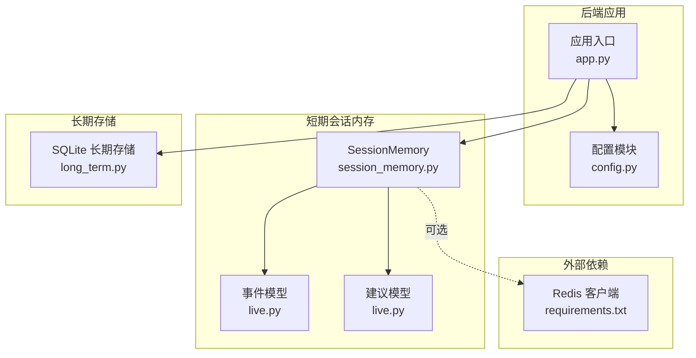
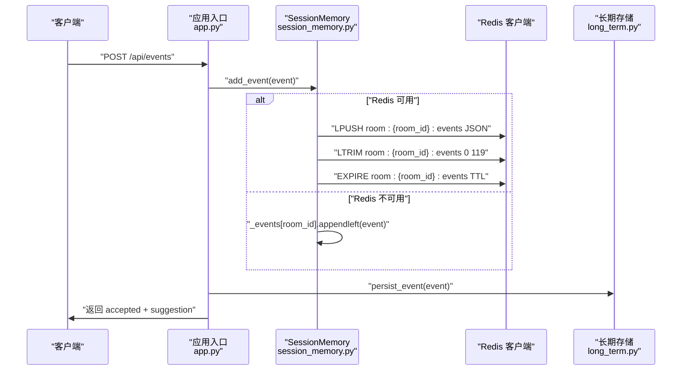
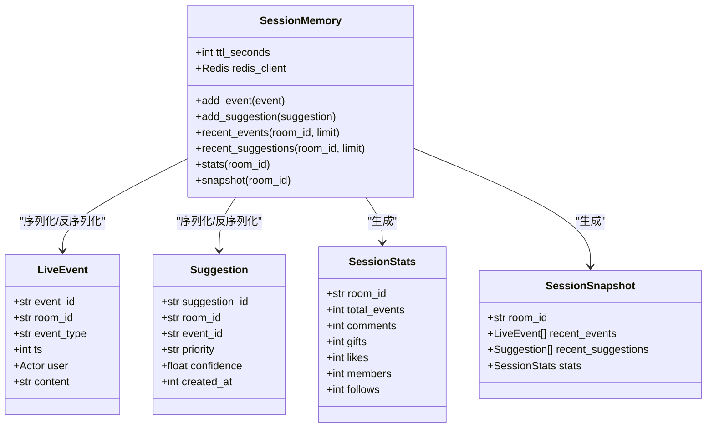
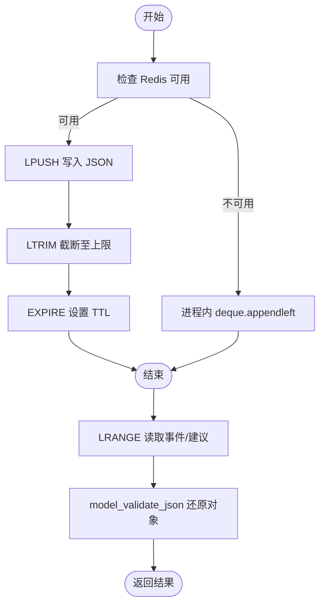

# 会话内存（Redis）

<cite>
**本文引用的文件**
- [session_memory.py](file://backend/memory/session_memory.py)
- [config.py](file://backend/config.py)
- [app.py](file://backend/app.py)
- [live.py](file://backend/schemas/live.py)
- [long_term.py](file://backend/memory/long_term.py)
- [requirements.txt](file://requirements.txt)
- [README.md](file://README.md)
</cite>

## 目录
1. [简介](#简介)
2. [项目结构](#项目结构)
3. [核心组件](#核心组件)
4. [架构总览](#架构总览)
5. [组件详细分析](#组件详细分析)
6. [依赖关系分析](#依赖关系分析)
7. [性能考量](#性能考量)
8. [故障排查指南](#故障排查指南)
9. [结论](#结论)
10. [附录](#附录)

## 简介
本文件面向“会话内存（Redis）”组件，系统性阐述短期会话存储的设计与实现，重点覆盖：
- Redis 客户端初始化与可选依赖
- 键空间设计与过期策略
- 事件与建议的数据结构与序列化
- 列表操作（LPUSH/LTRIM）与 TTL 管理
- 进程内退化机制（deque + 容量限制）
- 房间隔离与数据序列化方案
- Redis 配置指南、性能优化建议与故障排查

## 项目结构
该组件位于后端 memory 层，与配置、应用入口、数据模型、以及长期存储共同协作，形成“短期热数据 + 长期冷数据”的双层存储体系。

图表来源
- [app.py:25-29](file://backend/app.py#L25-L29)
- [config.py:54-55](file://backend/config.py#L54-L55)
- [session_memory.py:17-30](file://backend/memory/session_memory.py#L17-L30)
- [live.py:29-61](file://backend/schemas/live.py#L29-L61)
- [long_term.py:36-40](file://backend/memory/long_term.py#L36-L40)
- [requirements.txt:4](file://requirements.txt#L4)

章节来源
- [app.py:25-29](file://backend/app.py#L25-L29)
- [config.py:54-55](file://backend/config.py#L54-L55)
- [session_memory.py:17-30](file://backend/memory/session_memory.py#L17-L30)
- [live.py:29-61](file://backend/schemas/live.py#L29-L61)
- [long_term.py:36-40](file://backend/memory/long_term.py#L36-L40)
- [requirements.txt:4](file://requirements.txt#L4)

## 核心组件
- SessionMemory：短期会话内存的核心类，负责事件与建议的写入、读取、统计与快照生成，并在 Redis 可用时启用 Redis 模式，在不可用时退化为进程内内存。
- 数据模型：LiveEvent、Suggestion、SessionStats、SessionSnapshot，用于序列化与反序列化。
- 配置：Settings 提供 REDIS_URL 与 SESSION_TTL_SECONDS 等关键参数。
- 应用入口：app.py 初始化 SessionMemory 并将其注入到处理流程中。

章节来源
- [session_memory.py:17-113](file://backend/memory/session_memory.py#L17-L113)
- [live.py:29-95](file://backend/schemas/live.py#L29-L95)
- [config.py:54-55](file://backend/config.py#L54-L55)
- [app.py:25-29](file://backend/app.py#L25-L29)

## 架构总览
短期会话内存通过 Redis 列表实现房间级隔离的热数据缓存，结合 TTL 控制生命周期；当 Redis 不可用时，自动退化为进程内的双端队列，维持基本功能。

图表来源
- [app.py:61-78](file://backend/app.py#L61-L78)
- [session_memory.py:42-52](file://backend/memory/session_memory.py#L42-L52)
- [long_term.py:420-454](file://backend/memory/long_term.py#L420-L454)

## 组件详细分析

### Redis 客户端初始化与可选依赖
- 可选导入：尝试导入 redis，若失败则保持 redis=None，避免强制依赖。
- 初始化：当传入的 redis_url 非空且可导入 redis 时，创建 Redis 客户端实例，设置 decode_responses=True 以便直接获得字符串结果。
- 配置来源：settings.redis_url 与 settings.session_ttl_seconds 分别来自环境变量或默认值。

章节来源
- [session_memory.py:11-14](file://backend/memory/session_memory.py#L11-L14)
- [session_memory.py:29-30](file://backend/memory/session_memory.py#L29-L30)
- [config.py:54-55](file://backend/config.py#L54-L55)
- [README.md:196](file://README.md#L196)

### 键空间设计与房间隔离
- 事件键：room:{room_id}:events
- 建议键：room:{room_id}:suggestions
- 房间隔离：每个房间独立维护各自的列表键，天然实现房间级隔离。
- 命名规范：采用冒号分隔，便于后续运维与监控识别。

章节来源
- [session_memory.py:32-40](file://backend/memory/session_memory.py#L32-L40)

### 过期策略与TTL管理
- 写入路径：LPUSH 后立即 LTRIM 限制长度，再设置 EXPIRE。
- TTL 来源：settings.session_ttl_seconds（秒），默认 14400（4小时）。
- 作用范围：仅在 Redis 模式下生效，进程内退化模式不设置 TTL。

章节来源
- [session_memory.py:47-49](file://backend/memory/session_memory.py#L47-L49)
- [session_memory.py:58-61](file://backend/memory/session_memory.py#L58-L61)
- [config.py:55](file://backend/config.py#L55)
- [README.md:200](file://README.md#L200)

### 事件与建议的存储结构与序列化
- 序列化：使用 Pydantic 的 model_dump_json() 将对象转为 JSON 字符串，确保跨语言与跨进程兼容。
- 反序列化：读取时使用 model_validate_json() 还原为强类型对象。
- 结构字段：事件包含 event_id、room_id、event_type、ts、user、content 等；建议包含 suggestion_id、priority、reply_text、reason、confidence、references 等。

章节来源
- [session_memory.py:46](file://backend/memory/session_memory.py#L46)
- [session_memory.py:58](file://backend/memory/session_memory.py#L58)
- [live.py:29-61](file://backend/schemas/live.py#L29-L61)

### 列表操作（LPUSH/LTRIM）与读取
- 写入：LPUSH 将新元素插入列表头部，保证最新事件在前。
- 截断：LTRIM 限制列表长度，避免无限增长。
- 读取：LRANGE 读取指定范围，按需转换为对象列表。
- 限制：
  - 事件列表上限：120
  - 建议列表上限：40
  - 读取 limit 默认值：事件 30，建议 10

章节来源
- [session_memory.py:47-49](file://backend/memory/session_memory.py#L47-L49)
- [session_memory.py:58-61](file://backend/memory/session_memory.py#L58-L61)
- [session_memory.py:66-73](file://backend/memory/session_memory.py#L66-L73)
- [session_memory.py:75-84](file://backend/memory/session_memory.py#L75-L84)

### 进程内退化机制（deque + 容量限制）
- 退化触发：当 Redis 不可用或未配置时，使用进程内字典 + 双端队列。
- 容量限制：
  - 事件队列：120
  - 建议队列：40
- 行为：写入时 appendleft，读取时切片限制 limit，天然具备 LRU 效果。

章节来源
- [session_memory.py:26-27](file://backend/memory/session_memory.py#L26-L27)
- [session_memory.py:52](file://backend/memory/session_memory.py#L52)
- [session_memory.py:64](file://backend/memory/session_memory.py#L64)

### 房间隔离与数据序列化方案
- 房间隔离：键名包含 room_id，不同房间互不影响。
- 序列化方案：JSON 字符串，兼容性强，便于 Redis 管理工具查看与调试。
- 类型安全：通过 Pydantic 模型进行序列化与反序列化，保证字段一致性与类型正确性。

章节来源
- [session_memory.py:32-40](file://backend/memory/session_memory.py#L32-L40)
- [live.py:29-61](file://backend/schemas/live.py#L29-L61)

### 统计与快照
- 统计：基于近期事件窗口统计各类事件数量，用于前端展示。
- 快照：聚合最近事件、最近建议与统计信息，作为前端引导数据。

章节来源
- [session_memory.py:86-102](file://backend/memory/session_memory.py#L86-L102)
- [session_memory.py:104-112](file://backend/memory/session_memory.py#L104-L112)

### 与长期存储的协作
- 应用入口在处理事件时，同时写入短期与长期存储，确保热数据快速响应与冷数据持久化。
- 当短期无数据时，前端引导逻辑会回退到长期存储读取。

章节来源
- [app.py:49-58](file://backend/app.py#L49-L58)
- [app.py:61-78](file://backend/app.py#L61-L78)
- [long_term.py:420-454](file://backend/memory/long_term.py#L420-L454)

## 依赖关系分析

图表来源
- [session_memory.py:17-113](file://backend/memory/session_memory.py#L17-L113)
- [live.py:29-95](file://backend/schemas/live.py#L29-L95)

章节来源
- [session_memory.py:17-113](file://backend/memory/session_memory.py#L17-L113)
- [live.py:29-95](file://backend/schemas/live.py#L29-L95)

## 性能考量
- 列表截断成本低：LTRIM 在写入后立即执行，避免内存膨胀。
- TTL 降低冷数据占用：Redis 自动回收过期键，减少内存压力。
- 读取限制：LRANGE 限制读取范围，避免一次性拉取过多数据。
- 退化模式：进程内 deque 适合单实例场景，避免网络开销。
- 建议生成链路：建议生成与推送在应用入口完成，短期存储承担热数据缓存职责。

章节来源
- [session_memory.py:47-49](file://backend/memory/session_memory.py#L47-L49)
- [session_memory.py:58-61](file://backend/memory/session_memory.py#L58-L61)
- [session_memory.py:66-84](file://backend/memory/session_memory.py#L66-L84)

## 故障排查指南
- Redis 不可用
  - 现象：写入/读取失败或抛出异常。
  - 排查：确认 REDIS_URL 是否为空；检查 Redis 服务连通性；确认 decode_responses 设置是否符合预期。
  - 参考：可选导入与初始化逻辑。
- 键空间异常
  - 现象：房间数据错乱或缺失。
  - 排查：核对房间 ID 是否一致；确认键命名格式 room:{room_id}:events/suggestions。
- TTL 未生效
  - 现象：数据未被自动清理。
  - 排查：确认 SESSION_TTL_SECONDS 设置；检查 Redis 版本与过期策略支持情况。
- 读取为空
  - 现象：前端引导数据为空。
  - 排查：短期无数据时会回退到长期存储；检查长期存储是否正常；确认应用入口的引导逻辑。
- 依赖缺失
  - 现象：无法导入 redis。
  - 排查：确认 requirements.txt 中 redis 依赖已安装。

章节来源
- [session_memory.py:11-14](file://backend/memory/session_memory.py#L11-L14)
- [session_memory.py:29-30](file://backend/memory/session_memory.py#L29-L30)
- [session_memory.py:32-40](file://backend/memory/session_memory.py#L32-L40)
- [config.py:54-55](file://backend/config.py#L54-L55)
- [app.py:49-58](file://backend/app.py#L49-L58)
- [requirements.txt:4](file://requirements.txt#L4)

## 结论
该短期会话内存组件通过 Redis 列表实现房间级隔离的热数据缓存，结合 TTL 与 LTRIM 控制内存占用，具备良好的扩展性与稳定性；在 Redis 不可用时，自动退化为进程内内存，确保系统可用性。配合长期存储与应用入口的处理流程，形成完整的“热 + 冷”双层存储架构。

## 附录

### Redis 配置指南
- REDIS_URL：Redis 连接字符串，如为空则退化为进程内内存。
- SESSION_TTL_SECONDS：短期数据过期时间（秒），默认 14400（4小时）。
- 参考：README 中的环境变量示例与说明。

章节来源
- [README.md:196](file://README.md#L196)
- [README.md:200](file://README.md#L200)
- [config.py:54-55](file://backend/config.py#L54-L55)

### 关键流程图：事件写入与读取

图表来源
- [session_memory.py:42-64](file://backend/memory/session_memory.py#L42-L64)
- [session_memory.py:66-84](file://backend/memory/session_memory.py#L66-L84)