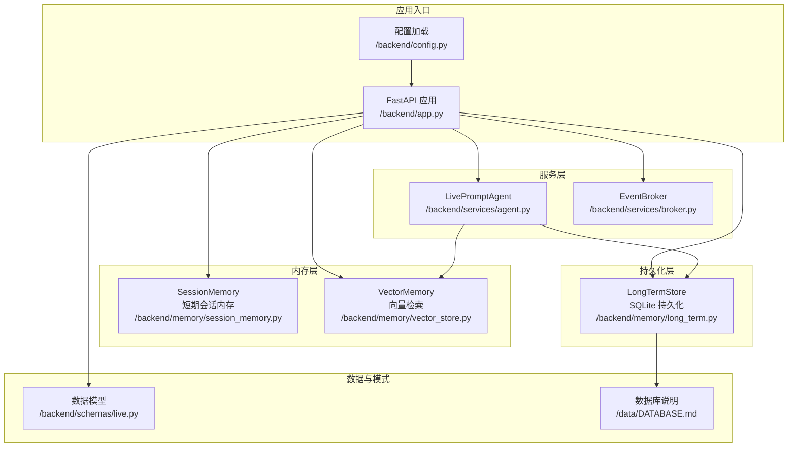
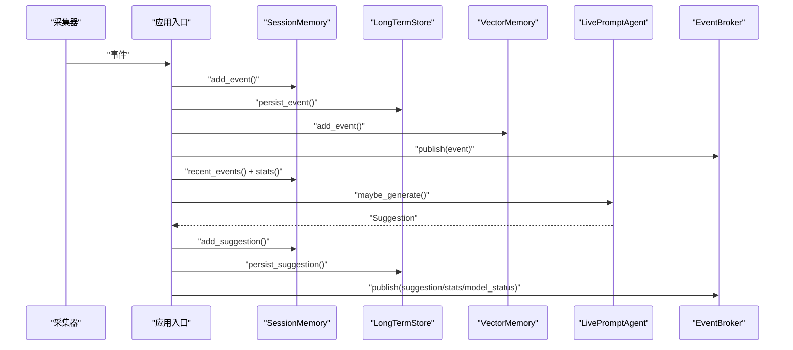
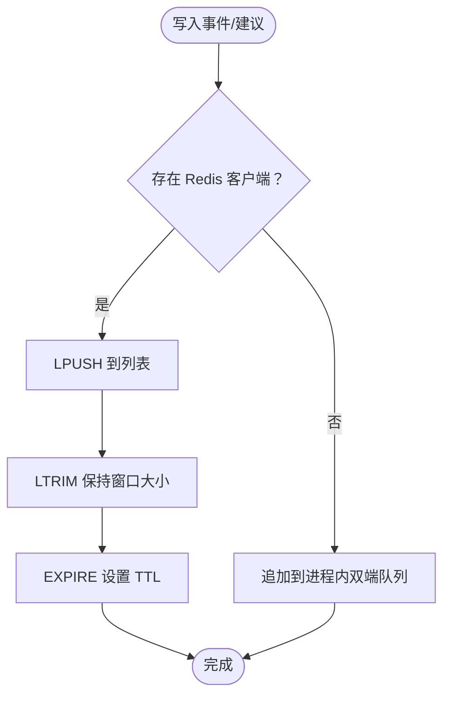
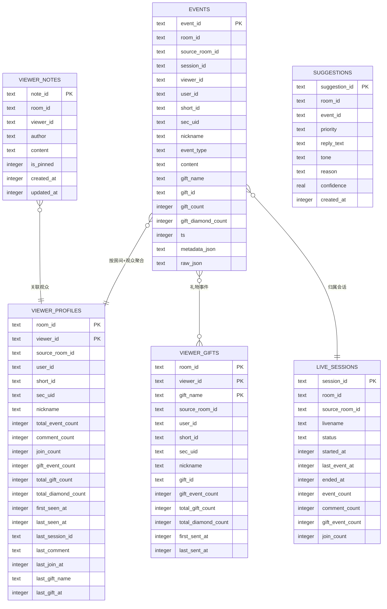
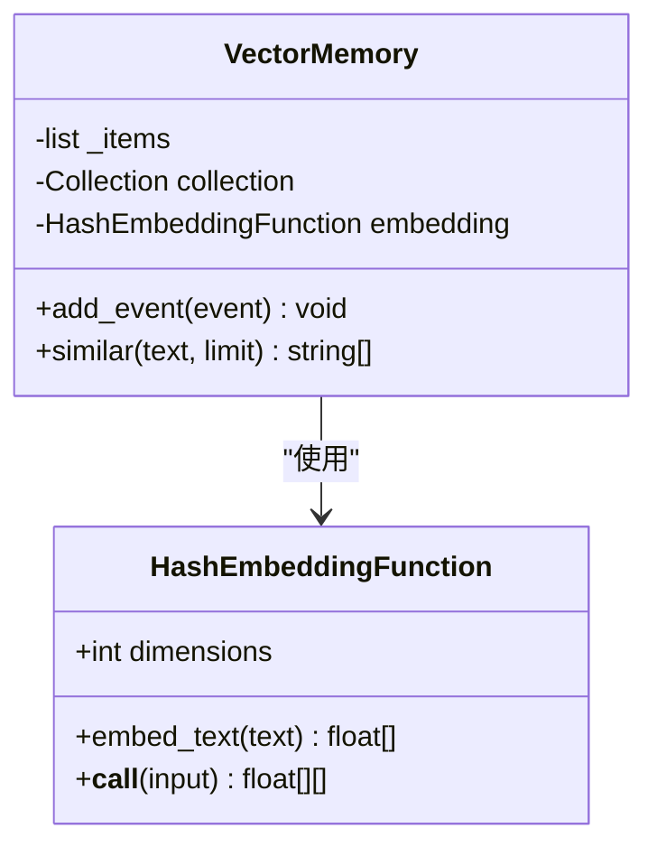
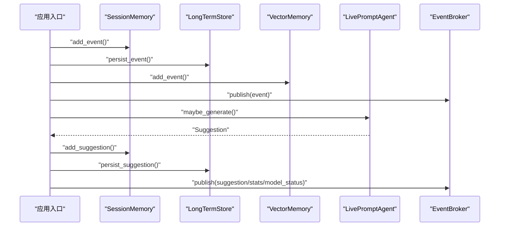
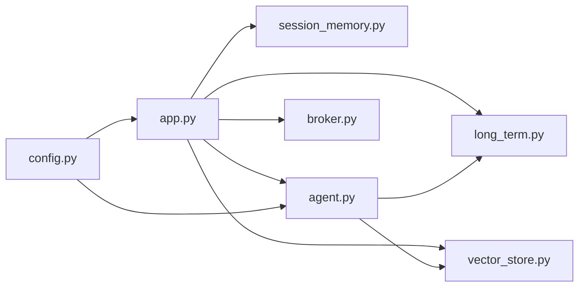

# 内存管理系统

<cite>
**本文引用的文件**
- [backend/memory/session_memory.py](file://backend/memory/session_memory.py)
- [backend/memory/long_term.py](file://backend/memory/long_term.py)
- [backend/memory/vector_store.py](file://backend/memory/vector_store.py)
- [backend/schemas/live.py](file://backend/schemas/live.py)
- [backend/config.py](file://backend/config.py)
- [backend/app.py](file://backend/app.py)
- [backend/services/agent.py](file://backend/services/agent.py)
- [backend/services/broker.py](file://backend/services/broker.py)
- [data/DATABASE.md](file://data/DATABASE.md)
- [requirements.txt](file://requirements.txt)
</cite>

## 目录
1. [简介](#简介)
2. [项目结构](#项目结构)
3. [核心组件](#核心组件)
4. [架构总览](#架构总览)
5. [详细组件分析](#详细组件分析)
6. [依赖关系分析](#依赖关系分析)
7. [性能考量](#性能考量)
8. [故障排查指南](#故障排查指南)
9. [结论](#结论)
10. [附录](#附录)

## 简介
本技术文档围绕三层存储架构展开，系统性阐述短期会话内存（SessionMemory）、长期持久化存储（LongTermStore）与向量检索（VectorMemory）的设计理念与实现细节。重点包括：
- SessionMemory（Redis）的短期存储机制与过期策略
- LongTermStore（SQLite）的表结构、索引策略与查询优化
- VectorMemory（Chroma）的向量检索实现、嵌入函数与相似度计算
- 各存储层之间的协调机制与数据一致性保障
- 面向开发者的扩展指南与性能调优建议

## 项目结构
后端采用“三层存储 + 事件总线 + 提词代理”的分层架构，入口应用负责接收事件、写入三类存储、触发建议生成并通过事件总线推送至前端。

图表来源
- [backend/app.py:25-29](file://backend/app.py#L25-L29)
- [backend/memory/session_memory.py:17-113](file://backend/memory/session_memory.py#L17-L113)
- [backend/memory/vector_store.py:52-108](file://backend/memory/vector_store.py#L52-L108)
- [backend/memory/long_term.py:36-750](file://backend/memory/long_term.py#L36-L750)
- [backend/services/agent.py:23-393](file://backend/services/agent.py#L23-L393)
- [backend/services/broker.py:10-40](file://backend/services/broker.py#L10-L40)
- [backend/schemas/live.py:8-95](file://backend/schemas/live.py#L8-L95)
- [data/DATABASE.md:1-151](file://data/DATABASE.md#L1-L151)

章节来源
- [backend/app.py:25-29](file://backend/app.py#L25-L29)
- [backend/config.py:39-94](file://backend/config.py#L39-L94)

## 核心组件
- SessionMemory：基于 Redis 的短期会话内存，提供事件与建议的 LIFO 列表、TTL 过期与轻量统计；若无 Redis，则回退到进程内双端队列。
- LongTermStore：基于 SQLite 的持久化存储，负责事件、建议、观众画像、礼物聚合、直播会话与备注等数据的写入、聚合与查询。
- VectorMemory：基于 Chroma 的向量检索，提供嵌入函数与相似度检索；若无 Chroma，则回退到轻量文本重叠相似度方案。
- LivePromptAgent：根据事件与上下文生成提词建议，优先使用在线模型，失败时回退到本地规则。
- EventBroker：进程内事件广播器，统一向 SSE 与 WebSocket 推送事件与统计。

章节来源
- [backend/memory/session_memory.py:17-113](file://backend/memory/session_memory.py#L17-L113)
- [backend/memory/long_term.py:36-750](file://backend/memory/long_term.py#L36-L750)
- [backend/memory/vector_store.py:52-108](file://backend/memory/vector_store.py#L52-L108)
- [backend/services/agent.py:23-393](file://backend/services/agent.py#L23-L393)
- [backend/services/broker.py:10-40](file://backend/services/broker.py#L10-L40)

## 架构总览
三层存储在事件处理流程中的协作如下：
- 事件到达后，同时写入 SessionMemory（Redis/进程内）、LongTermStore（SQLite）与 VectorMemory（Chroma/进程内）
- 生成建议后，同样写入 SessionMemory 与 LongTermStore，并通过 EventBroker 推送给前端
- 前端通过 SSE/WebSocket 获取实时事件流与统计

图表来源
- [backend/app.py:61-78](file://backend/app.py#L61-L78)
- [backend/memory/session_memory.py:42-102](file://backend/memory/session_memory.py#L42-L102)
- [backend/memory/long_term.py:420-454](file://backend/memory/long_term.py#L420-L454)
- [backend/memory/vector_store.py:64-83](file://backend/memory/vector_store.py#L64-L83)
- [backend/services/agent.py:73-94](file://backend/services/agent.py#L73-L94)
- [backend/services/broker.py:28-39](file://backend/services/broker.py#L28-L39)

## 详细组件分析

### SessionMemory（Redis 短期会话内存）
- 设计理念
  - 优先使用 Redis 保存最近事件与建议，利用其高性能与 TTL 过期特性，确保热数据快速访问与自动清理
  - 若未安装 Redis 或未配置地址，则回退到进程内双端队列，保证系统可用性
- 关键实现
  - 事件与建议分别维护 LIFO 列表，上限分别为 120 与 40
  - 使用 Redis 的 LPUSH/LTRIM/EXPIRE 维护窗口长度与生命周期
  - 提供最近事件/建议读取与轻量统计（按事件类型计数）
- 过期策略
  - 通过 TTL 控制热数据生命周期，避免无限增长
  - 读取时若为空，自动回退到进程内队列
- 适用场景
  - 实时交互反馈、建议窗口展示、轻量统计

图表来源
- [backend/memory/session_memory.py:42-64](file://backend/memory/session_memory.py#L42-L64)
- [backend/memory/session_memory.py:18-31](file://backend/memory/session_memory.py#L18-L31)

章节来源
- [backend/memory/session_memory.py:17-113](file://backend/memory/session_memory.py#L17-L113)

### LongTermStore（SQLite 持久化存储）
- 设计理念
  - 将事件、建议、观众画像、礼物聚合、直播会话与备注等数据持久化，支撑历史查询与统计
  - 通过索引与列迁移策略提升查询效率与兼容性
- 表结构与索引
  - events：事件流水表，包含事件 ID、房间 ID、来源房间 ID、会话 ID、用户身份、事件类型、内容、礼物信息、时间戳与 JSON 字段
  - viewer_profiles：按房间与观众 ID 聚合的画像表，包含事件总数、各类事件计数、首次/最后出现时间、最近会话 ID、最近评论/礼物等
  - viewer_gifts：按房间、观众 ID 与礼物名称聚合的礼物历史
  - live_sessions：直播会话表，包含会话 ID、房间 ID、状态、起止时间、事件计数等
  - viewer_notes：观众备注表
  - 索引覆盖：按房间+时间、房间+观众+时间、房间+事件类型+时间、会话 ID、昵称等维度建立索引
- 查询与聚合
  - 提供最近事件、最近建议、统计、观众画像、礼物历史、会话历史、备注等查询
  - 通过 UPSERT/ON CONFLICT 实现画像与礼物聚合的增量更新
  - 会话生命周期管理：自动创建活动会话、更新会话指标、结束会话
- 数据一致性
  - 事件写入时先查询是否存在已有会话 ID，若存在则沿用；否则创建新会话
  - 画像与礼物聚合通过重建逻辑保证历史一致性

图表来源
- [backend/memory/long_term.py:54-148](file://backend/memory/long_term.py#L54-L148)
- [data/DATABASE.md:16-151](file://data/DATABASE.md#L16-L151)

章节来源
- [backend/memory/long_term.py:36-750](file://backend/memory/long_term.py#L36-L750)
- [data/DATABASE.md:1-151](file://data/DATABASE.md#L1-L151)

### VectorMemory（Chroma 向量检索）
- 设计理念
  - 优先使用 Chroma 进行向量检索，提供更高质量的相似度匹配
  - 若未安装 Chroma，则回退到轻量哈希嵌入与文本重叠相似度方案，保证检索能力不中断
- 嵌入函数
  - HashEmbeddingFunction：对分词后的 token 做 SHA256 哈希，按维度取模分配正负权重，最后进行 L2 归一化
  - 适配 Chroma 的 embedding 接口，支持批量嵌入
- 相似度计算与批量操作
  - Chroma 模式：使用 collection.query 返回与输入文本最接近的历史片段
  - 回退模式：对输入与候选文档进行分词，计算词集交集大小排序，返回前 N 个文档
- 文档构建
  - 仅对含内容的事件写入索引，文档为“昵称 + 内容”，元数据包含房间 ID 与事件类型

图表来源
- [backend/memory/vector_store.py:19-50](file://backend/memory/vector_store.py#L19-L50)
- [backend/memory/vector_store.py:52-108](file://backend/memory/vector_store.py#L52-L108)

章节来源
- [backend/memory/vector_store.py:1-108](file://backend/memory/vector_store.py#L1-L108)

### 协调机制与数据一致性
- 事件处理流程
  - 应用入口在收到事件后，依次写入 SessionMemory、LongTermStore 与 VectorMemory，并通过 EventBroker 广播事件
  - 建议生成由 LivePromptAgent 基于最近事件、向量相似历史与用户画像决定是否生成，并写入 SessionMemory 与 LongTermStore
- 一致性保障
  - 事件写入时优先沿用已存在的会话 ID，确保跨层一致
  - 画像与礼物聚合通过重建逻辑与 UPSERT 保证历史一致性
  - 会话生命周期管理：自动创建、更新指标、结束会话，避免脏数据
- 前端推送
  - EventBroker 统一分发事件、统计与模型状态，前端通过 SSE/WebSocket 实时接收

图表来源
- [backend/app.py:61-78](file://backend/app.py#L61-L78)
- [backend/services/broker.py:28-39](file://backend/services/broker.py#L28-L39)
- [backend/services/agent.py:73-94](file://backend/services/agent.py#L73-L94)

章节来源
- [backend/app.py:49-78](file://backend/app.py#L49-L78)
- [backend/services/agent.py:56-94](file://backend/services/agent.py#L56-L94)

## 依赖关系分析
- 组件耦合
  - 应用入口依赖三类存储与事件总线，形成清晰的分层
  - 提词代理依赖向量存储与长期存储，用于构建上下文
- 外部依赖
  - Redis：用于 SessionMemory 的高性能短期存储
  - Chroma：用于 VectorMemory 的向量检索
  - SQLite：用于 LongTermStore 的持久化存储
- 配置与环境
  - 通过配置模块加载环境变量，确保本地开箱即用
  - 存储路径与 TTL 等参数可通过环境变量调整

图表来源
- [backend/app.py:13-29](file://backend/app.py#L13-L29)
- [backend/config.py:39-94](file://backend/config.py#L39-L94)
- [backend/services/agent.py:23-30](file://backend/services/agent.py#L23-L30)

章节来源
- [backend/app.py:13-29](file://backend/app.py#L13-L29)
- [backend/config.py:39-94](file://backend/config.py#L39-L94)
- [requirements.txt:1-6](file://requirements.txt#L1-L6)

## 性能考量
- SessionMemory（Redis）
  - 利用 LPUSH/LTRIM/EXPIRE 保持窗口与 TTL，避免无限增长
  - 建议合理设置 TTL（默认 14400 秒），平衡内存占用与实时性
- LongTermStore（SQLite）
  - 索引覆盖常见查询维度（房间+时间、房间+观众+时间、会话 ID 等）
  - UPSERT 与重建逻辑减少重复计算，提升画像与礼物聚合效率
  - 建议定期维护数据库文件，避免 WAL/锁竞争影响
- VectorMemory（Chroma）
  - Chroma 模式下建议启用持久化客户端，避免重启丢失
  - 回退模式下注意候选文档数量与相似度阈值，避免 O(N^2) 计算
- 整体建议
  - 在高并发场景下，建议将 Redis 与 Chroma 部署在独立节点
  - 对长查询（如画像与会话历史）增加分页与缓存策略
  - 监控模型调用延迟与错误率，必要时降低温度或缩短提示

[本节为通用性能指导，无需特定文件来源]

## 故障排查指南
- Redis 不可用
  - 现象：SessionMemory 回退到进程内队列，事件与建议仍可读写
  - 处理：检查 Redis 地址与网络连通性；确认环境变量配置
- Chroma 不可用
  - 现象：向量检索回退到轻量相似度方案
  - 处理：检查 Chroma 安装与权限；确认存储路径可写
- SQLite 写入异常
  - 现象：事件写入失败或画像不更新
  - 处理：检查数据库文件权限与磁盘空间；确认索引与列迁移是否成功
- 建议生成失败
  - 现象：模型调用失败，回退到本地规则
  - 处理：检查模型服务地址与 API Key；查看日志中的错误码与超时信息

章节来源
- [backend/memory/session_memory.py:11-14](file://backend/memory/session_memory.py#L11-L14)
- [backend/memory/vector_store.py:13-16](file://backend/memory/vector_store.py#L13-L16)
- [backend/services/agent.py:183-329](file://backend/services/agent.py#L183-L329)

## 结论
本内存管理系统通过三层存储实现“热数据高速响应 + 历史数据可靠沉淀 + 上下文检索增强”的协同架构。SessionMemory 提供实时体验，LongTermStore 保障可追溯性与统计能力，VectorMemory 增强语义检索与建议质量。通过事件总线与提词代理，系统实现了从事件到建议的闭环，既满足生产可用性，也为后续扩展与优化提供了清晰路径。

[本节为总结性内容，无需特定文件来源]

## 附录
- 开发者扩展指南
  - 新增存储后端：遵循现有接口风格（写入、读取、统计、快照），并在应用入口注册
  - 自定义嵌入函数：实现与 Chroma 相同的调用接口，替换 VectorMemory 的 embedding
  - 优化查询：为常用查询添加索引，减少全表扫描；对大结果集分页与缓存
- 性能调优建议
  - 调整 SessionMemory TTL 与窗口大小，平衡内存与实时性
  - 对 LongTermStore 的 UPSERT 与重建逻辑进行批量化处理
  - 在高负载场景下，拆分 Redis/Chroma/SQLite 的部署拓扑

[本节为通用指导，无需特定文件来源]