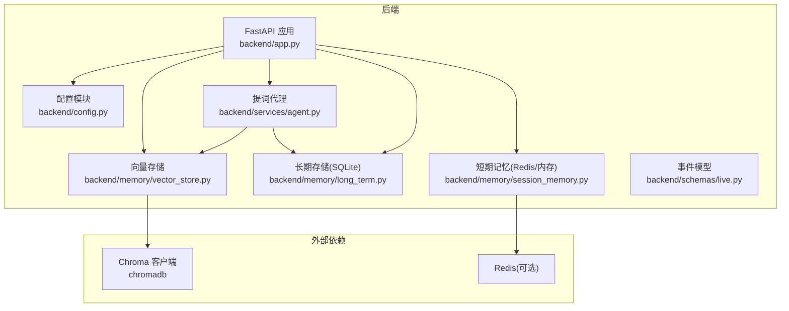
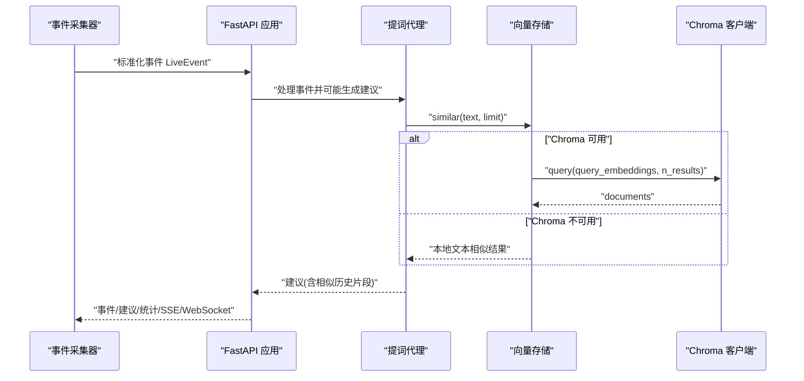
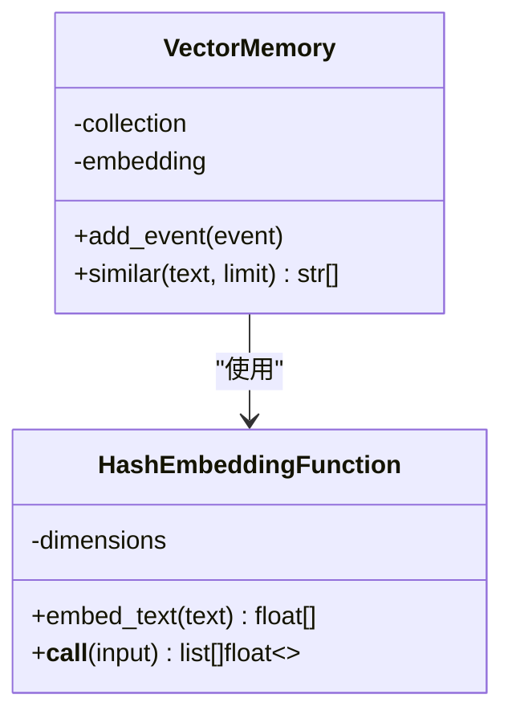
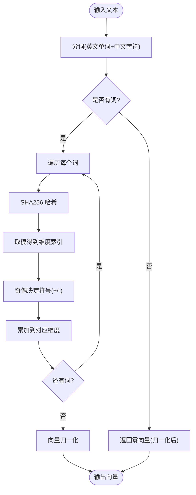
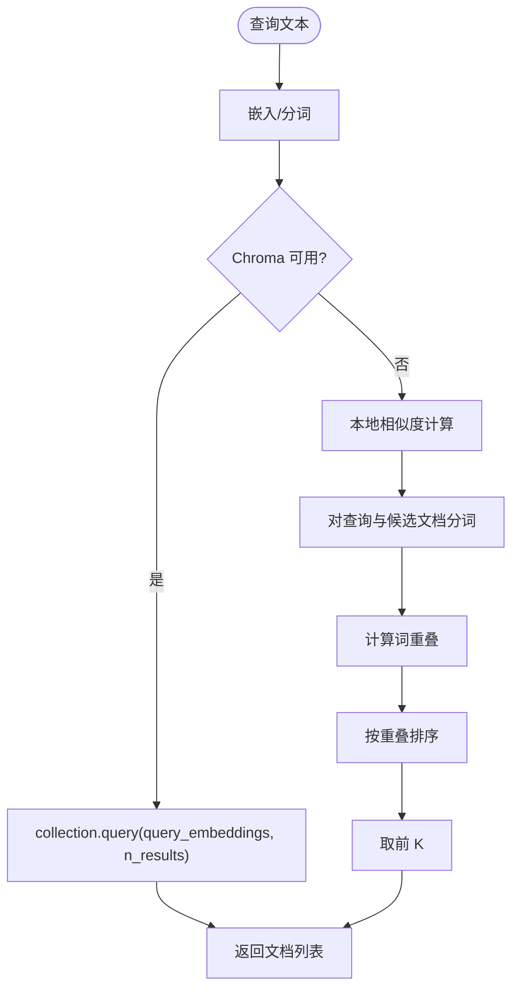
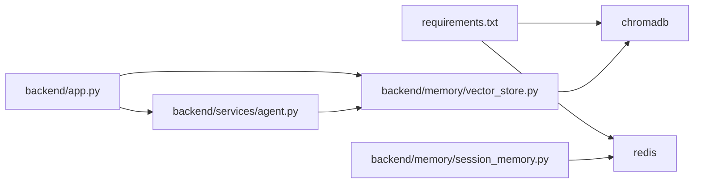

# 向量存储（Chroma）

<cite>
**本文引用的文件**
- [backend/memory/vector_store.py](file://backend/memory/vector_store.py)
- [backend/config.py](file://backend/config.py)
- [backend/app.py](file://backend/app.py)
- [backend/schemas/live.py](file://backend/schemas/live.py)
- [backend/services/agent.py](file://backend/services/agent.py)
- [backend/memory/long_term.py](file://backend/memory/long_term.py)
- [backend/memory/session_memory.py](file://backend/memory/session_memory.py)
- [requirements.txt](file://requirements.txt)
- [README.md](file://README.md)
- [USAGE.md](file://USAGE.md)
- [data/DATABASE.md](file://data/DATABASE.md)
</cite>

## 目录
1. [简介](#简介)
2. [项目结构](#项目结构)
3. [核心组件](#核心组件)
4. [架构总览](#架构总览)
5. [详细组件分析](#详细组件分析)
6. [依赖关系分析](#依赖关系分析)
7. [性能考量](#性能考量)
8. [故障排查指南](#故障排查指南)
9. [结论](#结论)
10. [附录](#附录)

## 简介
本技术文档聚焦于向量存储组件，围绕 Chroma 向量数据库的集成实现进行深入说明，涵盖以下方面：
- 客户端初始化与集合管理
- 嵌入函数配置与降级策略
- 向量检索算法与相似度计算
- 数据预处理流程（文本清洗、分词与向量化）
- 索引策略与查询性能优化
- 向量模型选择指南、存储容量规划与查询调优建议

该组件在后端应用中承担“历史相似文本检索”的职责，为提词建议生成提供“相似历史片段”上下文，从而提升建议的连贯性与复用率。

## 项目结构
向量存储位于后端子系统中，与短期记忆、长期存储、事件采集与提词生成共同构成完整的直播提词链路。

图表来源
- [backend/app.py:22-29](file://backend/app.py#L22-L29)
- [backend/config.py:53](file://backend/config.py#L53)
- [backend/memory/vector_store.py:60-63](file://backend/memory/vector_store.py#L60-L63)
- [backend/services/agent.py:65](file://backend/services/agent.py#L65)
- [backend/memory/long_term.py:36](file://backend/memory/long_term.py#L36)
- [backend/memory/session_memory.py:17](file://backend/memory/session_memory.py#L17)

章节来源
- [backend/app.py:22-29](file://backend/app.py#L22-L29)
- [backend/config.py:53](file://backend/config.py#L53)
- [requirements.txt:5](file://requirements.txt#L5)

## 核心组件
- 向量存储类：负责向量库初始化、集合管理、事件写入与相似检索。
- 嵌入函数：提供向量化的文本表示，支持 Chroma 接口与本地降级方案。
- 提词代理：在建议生成时调用向量检索，构建上下文。
- 配置模块：提供 Chroma 数据目录等运行时参数。
- 事件模型：标准化直播事件，作为向量检索的输入文本来源。

章节来源
- [backend/memory/vector_store.py:52-108](file://backend/memory/vector_store.py#L52-L108)
- [backend/services/agent.py:65](file://backend/services/agent.py#L65)
- [backend/config.py:53](file://backend/config.py#L53)
- [backend/schemas/live.py:29](file://backend/schemas/live.py#L29)

## 架构总览
向量存储在应用启动时被注入到全局对象图中，随后在事件处理流程中被提词代理调用，用于检索与当前事件内容相似的历史片段。

图表来源
- [backend/app.py:61-78](file://backend/app.py#L61-L78)
- [backend/services/agent.py:65](file://backend/services/agent.py#L65)
- [backend/memory/vector_store.py:85-108](file://backend/memory/vector_store.py#L85-L108)

## 详细组件分析

### 向量存储类（VectorMemory）
- 初始化与集合管理
  - 若检测到 Chroma 客户端，使用持久化客户端并获取/创建名为“live_history”的集合。
  - 若不可用，则退化为内存列表，最多保留有限条目，用于本地相似检索。
- 文档写入
  - 将事件内容与用户昵称拼接为文档，同时写入元数据（房间号、事件类型）。
  - 若集合存在，调用 upsert 写入文档、元数据与嵌入向量；否则写入内存列表。
- 相似检索
  - 若集合存在，将查询文本嵌入后调用 query，返回 top-K 文档。
  - 若集合不存在，采用本地轻量策略：对查询与候选文档进行分词求交集，按重叠词数排序返回。

图表来源
- [backend/memory/vector_store.py:52-108](file://backend/memory/vector_store.py#L52-L108)
- [backend/memory/vector_store.py:19-50](file://backend/memory/vector_store.py#L19-L50)

章节来源
- [backend/memory/vector_store.py:52-108](file://backend/memory/vector_store.py#L52-L108)

### 嵌入函数（HashEmbeddingFunction）
- 设计目标
  - 在无外部嵌入模型时提供本地替代方案，目标是“可运行的近似能力”，而非高精度。
- 实现要点
  - 维度固定，通过哈希与符号累加到指定维度，最后做向量归一化。
  - 分词策略：匹配英文单词与中文字符，忽略空字符串。
  - 接口兼容：提供 __call__ 以适配 Chroma 的批量嵌入调用签名。

图表来源
- [backend/memory/vector_store.py:29-44](file://backend/memory/vector_store.py#L29-L44)

章节来源
- [backend/memory/vector_store.py:19-50](file://backend/memory/vector_store.py#L19-L50)

### 事件到文档与元数据
- 文档内容
  - 由“用户昵称 + 事件内容”拼接而成，确保检索时兼顾说话人与内容。
- 元数据
  - 包含房间号与事件类型，便于后续过滤与溯源。

章节来源
- [backend/memory/vector_store.py:70-71](file://backend/memory/vector_store.py#L70-L71)

### 相似检索算法与距离度量
- Chroma 路径
  - 使用 upsert 写入时，向量维度与嵌入函数一致；查询时对查询文本嵌入后调用 query，返回 top-K 文档。
  - 由于未显式设置距离度量，遵循 Chroma 默认策略（通常为余弦距离）。
- 本地降级路径
  - 采用词级 Jaccard 重叠（交集大小/并集大小）近似相似度，排序取前 K。
  - 该策略适合小规模、低延迟场景，但无法捕捉语义层面的相似。

图表来源
- [backend/memory/vector_store.py:85-108](file://backend/memory/vector_store.py#L85-L108)

章节来源
- [backend/memory/vector_store.py:85-108](file://backend/memory/vector_store.py#L85-L108)

### 数据预处理流程
- 文本清洗
  - 去除空白与多余空格，保留昵称与内容。
- 分词处理
  - 使用正则匹配英文单词与中文字符，形成词集合。
- 向量化转换
  - Chroma 路径：调用嵌入函数生成向量。
  - 本地路径：使用哈希嵌入函数生成固定维度向量并归一化。

章节来源
- [backend/memory/vector_store.py:70-71](file://backend/memory/vector_store.py#L70-L71)
- [backend/memory/vector_store.py:33-44](file://backend/memory/vector_store.py#L33-L44)

### 索引策略与查询优化
- Chroma 集合
  - 使用 upsert 写入文档、元数据与向量，集合名为“live_history”。
  - 查询时传入 n_results 控制返回数量。
- 本地降级
  - 无索引，直接遍历候选列表，按词重叠排序。
- 优化建议
  - 在生产环境启用 Chroma 并保持集合规模可控。
  - 适当降低查询 limit，减少网络/磁盘 IO。
  - 对高频查询可考虑缓存热门查询结果（需结合业务场景评估）。

章节来源
- [backend/memory/vector_store.py:60-63](file://backend/memory/vector_store.py#L60-L63)
- [backend/memory/vector_store.py:74-83](file://backend/memory/vector_store.py#L74-L83)
- [backend/memory/vector_store.py:92-96](file://backend/memory/vector_store.py#L92-L96)

### 向量模型选择指南
- 外部嵌入模型
  - 若需更高语义相似度，可在嵌入函数中接入外部模型（如本地 Ollama 或云端 API），替换当前哈希嵌入。
  - 替换后需同步调整向量维度与距离度量配置。
- 本地哈希嵌入
  - 优点：无需额外依赖，部署简单。
  - 局限：语义相似度有限，适合小规模、快速迭代场景。

章节来源
- [backend/memory/vector_store.py:19-50](file://backend/memory/vector_store.py#L19-L50)

### 存储容量规划与查询调优
- 存储容量
  - Chroma 数据目录由配置项提供，默认位于 data/chroma。
  - 建议定期清理过期房间或事件，避免集合无限增长。
- 查询调优
  - 控制 n_results，避免一次性返回过多文档。
  - 在高并发场景下，建议将向量检索与建议生成解耦，必要时引入队列或异步处理。
  - 对于本地降级路径，可考虑对候选文档进行采样或分桶，减少排序成本。

章节来源
- [backend/config.py:53](file://backend/config.py#L53)
- [backend/memory/vector_store.py:92-96](file://backend/memory/vector_store.py#L92-L96)

## 依赖关系分析
- 运行时依赖
  - chromadb：向量数据库客户端，用于持久化与检索。
  - redis：可选，用于短期记忆的分布式存储。
- 组件耦合
  - VectorMemory 与 Chroma 客户端强耦合；当 chromadb 不可用时，通过异常捕获退化为本地策略。
  - 提词代理依赖 VectorMemory 的 similar 接口，实现“相似历史片段”上下文。

图表来源
- [requirements.txt:5](file://requirements.txt#L5)
- [backend/app.py:22-29](file://backend/app.py#L22-L29)
- [backend/memory/vector_store.py:60-63](file://backend/memory/vector_store.py#L60-L63)
- [backend/services/agent.py:65](file://backend/services/agent.py#L65)

章节来源
- [requirements.txt:5](file://requirements.txt#L5)
- [backend/app.py:22-29](file://backend/app.py#L22-L29)

## 性能考量
- 向量检索性能
  - Chroma 路径：受磁盘 IO、索引构建与查询算法影响；建议控制 n_results 与文档长度。
  - 本地降级路径：时间复杂度与候选数量成正比，适合小规模数据。
- 内存与磁盘
  - 本地降级使用内存列表，容量上限受实现限制；Chroma 使用持久化存储，容量更大但需定期维护。
- 网络与超时
  - 外部模型调用需考虑网络延迟与超时，当前实现未涉及外部模型，因此不适用。

章节来源
- [backend/memory/vector_store.py:85-108](file://backend/memory/vector_store.py#L85-L108)
- [backend/memory/vector_store.py:58](file://backend/memory/vector_store.py#L58)

## 故障排查指南
- Chroma 不可用
  - 现象：向量检索退化为本地策略。
  - 排查：确认 chromadb 是否安装；检查数据目录权限与磁盘空间。
- 查询无结果
  - 确认集合是否已创建且有文档；检查写入流程是否成功。
- 本地相似度不理想
  - 调整分词策略或增加维度；或切换到外部嵌入模型。
- 配置问题
  - 确认 CHROMA_DIR 设置正确；确保 DATA_DIR、DATABASE_PATH 等路径存在。

章节来源
- [backend/config.py:53](file://backend/config.py#L53)
- [backend/memory/vector_store.py:60-63](file://backend/memory/vector_store.py#L60-L63)
- [backend/memory/vector_store.py:85-108](file://backend/memory/vector_store.py#L85-L108)

## 结论
本向量存储组件通过 Chroma 提供持久化与高效检索能力，并在不可用时以本地哈希嵌入实现“可运行”的降级方案。其设计兼顾易用性与可扩展性：在小规模场景下可快速落地，在需要更高语义相似度时可通过替换嵌入函数接入外部模型。建议在生产环境中启用 Chroma 并配合合理的容量规划与查询调优，以获得更稳定的检索体验。

## 附录
- 相关文档
  - [README.md](file://README.md)
  - [USAGE.md](file://USAGE.md)
  - [data/DATABASE.md](file://data/DATABASE.md)