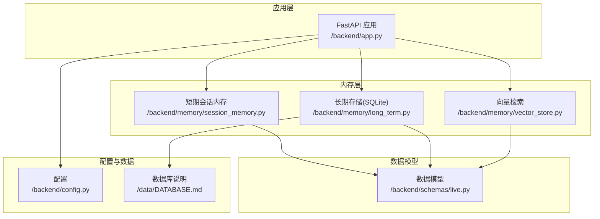
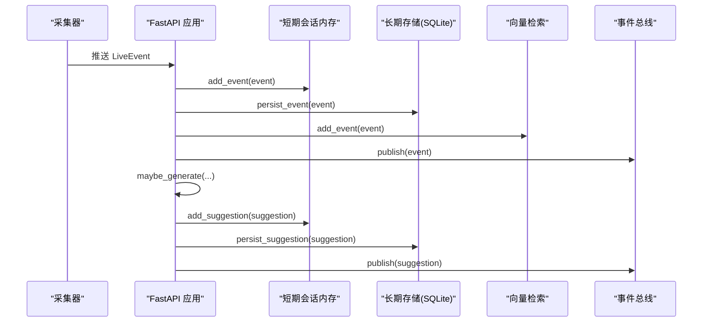
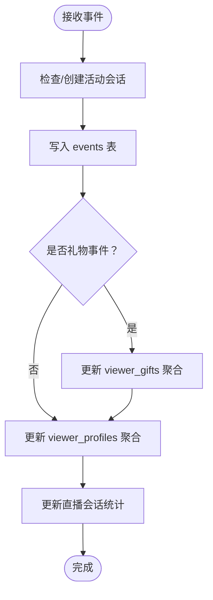
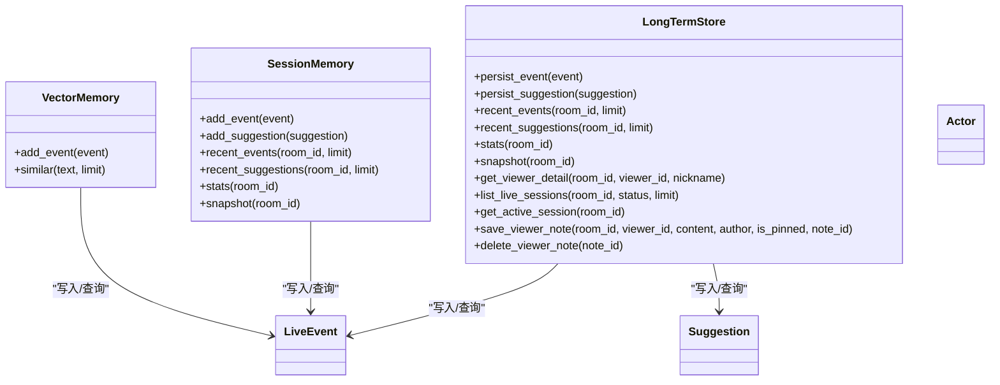

# 长期存储（SQLite）

<cite>
**本文引用的文件**
- [backend/memory/long_term.py](file://backend/memory/long_term.py)
- [backend/memory/vector_store.py](file://backend/memory/vector_store.py)
- [backend/memory/session_memory.py](file://backend/memory/session_memory.py)
- [backend/schemas/live.py](file://backend/schemas/live.py)
- [backend/config.py](file://backend/config.py)
- [backend/app.py](file://backend/app.py)
- [data/DATABASE.md](file://data/DATABASE.md)
</cite>

## 目录
1. [简介](#简介)
2. [项目结构](#项目结构)
3. [核心组件](#核心组件)
4. [架构总览](#架构总览)
5. [详细组件分析](#详细组件分析)
6. [依赖关系分析](#依赖关系分析)
7. [性能与查询优化](#性能与查询优化)
8. [数据生命周期与存储优化](#数据生命周期与存储优化)
9. [数据库迁移与备份恢复](#数据库迁移与备份恢复)
10. [并发访问控制](#并发访问控制)
11. [故障排查指南](#故障排查指南)
12. [结论](#结论)

## 简介
本文件聚焦于长期存储组件（SQLite）的设计与实现，涵盖数据库表结构、字段类型与约束、事件与用户画像的数据模型、查询优化策略、数据生命周期管理、迁移与备份恢复以及并发访问控制。该组件通过事件归档、观众画像聚合与直播场次管理，支撑实时互动场景下的历史回溯与智能建议生成。

## 项目结构
长期存储位于后端内存层中，与短期会话内存、向量检索、应用入口共同构成完整的直播数据处理链路。

图表来源
- [backend/app.py:25-29](file://backend/app.py#L25-L29)
- [backend/memory/session_memory.py:17-31](file://backend/memory/session_memory.py#L17-L31)
- [backend/memory/long_term.py:36-39](file://backend/memory/long_term.py#L36-L39)
- [backend/memory/vector_store.py:52-59](file://backend/memory/vector_store.py#L52-L59)
- [backend/config.py:51-53](file://backend/config.py#L51-L53)
- [data/DATABASE.md:1-151](file://data/DATABASE.md#L1-L151)

章节来源
- [backend/app.py:25-29](file://backend/app.py#L25-L29)
- [backend/config.py:51-53](file://backend/config.py#L51-L53)
- [data/DATABASE.md:1-151](file://data/DATABASE.md#L1-L151)

## 核心组件
- 长期存储（SQLite）：负责事件流水、建议、观众画像、礼物聚合、直播场次与备注的持久化与查询。
- 短期会话内存：提供 Redis 或进程内缓存，承载热数据与高频统计。
- 向量检索：提供相似历史事件检索能力，支持 Chroma 或本地轻量方案。
- 数据模型：统一事件、建议、统计与快照的数据结构。

章节来源
- [backend/memory/long_term.py:36-39](file://backend/memory/long_term.py#L36-L39)
- [backend/memory/session_memory.py:17-31](file://backend/memory/session_memory.py#L17-L31)
- [backend/memory/vector_store.py:52-59](file://backend/memory/vector_store.py#L52-L59)
- [backend/schemas/live.py:8-95](file://backend/schemas/live.py#L8-L95)

## 架构总览
应用启动时初始化短期会话内存、长期存储与向量检索，并在事件到达时写入短期与长期存储，同时触发智能建议生成与广播。

图表来源
- [backend/app.py:61-78](file://backend/app.py#L61-L78)
- [backend/memory/long_term.py:420-454](file://backend/memory/long_term.py#L420-L454)
- [backend/memory/session_memory.py:42-64](file://backend/memory/session_memory.py#L42-L64)
- [backend/memory/vector_store.py:64-83](file://backend/memory/vector_store.py#L64-L83)

## 详细组件分析

### 表结构与字段设计
- events：事件流水表，包含事件主键、房间号、平台、事件类型、方法、直播名、用户身份字段、内容、时间戳、JSON 元数据与原始消息。新增字段包括 source_room_id、viewer_id、user_id、short_id、sec_uid、gift_name、gift_id、gift_count、gift_diamond_count、session_id，用于增强溯源与聚合能力。
- suggestions：建议表，记录建议主键、房间号、事件关联、优先级、回复文本、语调、理由、置信度与创建时间。
- viewer_profiles：观众画像表，按 (room_id, viewer_id) 聚合，包含累计事件数、评论数、加入数、礼物事件数、礼物总数、钻石总数、首次/末次出现时间、最近会话ID、最近评论、最近加入时间、最近礼物名称与时间等。
- viewer_gifts：礼物聚合表，按 (room_id, viewer_id, gift_name) 聚合，包含礼物事件次数、礼物总数、钻石总数、首次/末次赠送时间。
- live_sessions：直播场次表，包含会话ID、房间号、源房间号、直播名、状态（active/ended）、开始/最后事件/结束时间、各类事件计数。
- viewer_notes：观众备注表，包含备注ID、房间号、观众ID、作者、内容、是否置顶、创建/更新时间。

章节来源
- [backend/memory/long_term.py:54-148](file://backend/memory/long_term.py#L54-L148)
- [data/DATABASE.md:16-151](file://data/DATABASE.md#L16-L151)

### 数据模型设计
- 事件模型（LiveEvent）：标准化事件结构，包含事件ID、房间ID、源房间ID、会话ID、平台、事件类型、方法、直播名、时间戳、用户身份（Actor）、内容、元数据与原始消息。
- 用户身份（Actor）：统一用户标识生成规则，优先级为 id -> secUid -> shortId -> nickname，形成 viewer_id。
- 建议模型（Suggestion）：建议生成后的结构，包含建议ID、房间ID、事件ID、来源、优先级、回复文本、语调、理由、置信度、来源事件列表、引用列表、创建时间。
- 统计与快照（SessionStats、SessionSnapshot）：用于前端展示的轻量统计与初始快照。

章节来源
- [backend/schemas/live.py:29-95](file://backend/schemas/live.py#L29-L95)

### 写入流程与聚合
- 事件写入：先确保或创建活动直播会话，再写入 events；若为礼物事件，同步更新 viewer_gifts；同时更新 viewer_profiles 的累计与最近指标。
- 建议写入：直接写入 suggestions。
- 聚合重建：当检测到重复事件或历史回放时，可重建 viewer_profiles 与 viewer_gifts 的聚合状态，保证统计一致性。

图表来源
- [backend/memory/long_term.py:276-324](file://backend/memory/long_term.py#L276-L324)
- [backend/memory/long_term.py:326-402](file://backend/memory/long_term.py#L326-L402)
- [backend/memory/long_term.py:420-454](file://backend/memory/long_term.py#L420-L454)

章节来源
- [backend/memory/long_term.py:276-402](file://backend/memory/long_term.py#L276-L402)
- [backend/memory/long_term.py:420-454](file://backend/memory/long_term.py#L420-L454)

### 查询接口与典型场景
- 最近事件：按房间与时间倒序分页查询。
- 最近建议：按房间与创建时间倒序分页查询。
- 房间统计：按事件类型统计总数。
- 观众画像：支持按 viewer_id 或昵称查询，返回累计与最近行为。
- 观众事件历史：按观众ID与事件类型查询历史。
- 观众礼物历史：按观众ID查询礼物聚合。
- 直播场次：按房间与状态查询，支持当前活动场次。
- 备注：支持查询、保存、删除。

章节来源
- [backend/memory/long_term.py:467-520](file://backend/memory/long_term.py#L467-L520)
- [backend/memory/long_term.py:525-598](file://backend/memory/long_term.py#L525-L598)
- [backend/memory/long_term.py:600-618](file://backend/memory/long_term.py#L600-L618)
- [backend/memory/long_term.py:663-698](file://backend/memory/long_term.py#L663-L698)
- [backend/memory/long_term.py:642-661](file://backend/memory/long_term.py#L642-L661)

## 依赖关系分析
- 应用入口依赖：应用在启动时创建短期会话内存、长期存储与向量检索实例，并注入到处理流程。
- 配置驱动：数据库路径由配置决定，确保目录存在并可写。
- 数据模型：所有写入与查询均基于统一的数据模型，保证跨层一致性。

图表来源
- [backend/memory/long_term.py:36-39](file://backend/memory/long_term.py#L36-L39)
- [backend/memory/session_memory.py:17-31](file://backend/memory/session_memory.py#L17-L31)
- [backend/memory/vector_store.py:52-59](file://backend/memory/vector_store.py#L52-L59)
- [backend/schemas/live.py:29-95](file://backend/schemas/live.py#L29-L95)

章节来源
- [backend/app.py:25-29](file://backend/app.py#L25-L29)
- [backend/config.py:51-53](file://backend/config.py#L51-L53)
- [backend/schemas/live.py:29-95](file://backend/schemas/live.py#L29-L95)

## 性能与查询优化
- 索引设计
  - events：按 (room_id, ts DESC)、(room_id, viewer_id, ts DESC)、(room_id, event_type, ts DESC)、session_id 建立索引，覆盖常见房间筛选、时间倒序、按观众/事件类型过滤与会话关联。
  - viewer_profiles：按 (room_id, nickname) 建立索引，便于按昵称查找。
  - viewer_gifts：按 (room_id, viewer_id, last_sent_at DESC) 建立索引，支持礼物时间倒序与观众维度查询。
  - live_sessions：按 (room_id, status, last_event_at DESC) 建立索引，支持活动场次快速定位。
  - viewer_notes：按 (room_id, viewer_id, updated_at DESC) 建立索引，支持备注排序与查询。
- 列类型与约束
  - 主键采用 TEXT 类型，便于与业务ID对齐；时间戳使用 INTEGER 存储毫秒级时间。
  - JSON 字段使用 TEXT 存储，避免结构化索引带来的维护成本。
  - 聚合字段默认值为 0，减少空值处理复杂度。
- 查询计划与调优
  - 使用 LIMIT 控制结果集大小，避免全表扫描。
  - 在高频查询上利用复合索引，减少排序与过滤成本。
  - 对于重建聚合场景，采用批量扫描与增量更新策略，降低锁竞争。
- 并发与事务
  - 单条写入使用单事务提交，保证原子性；批量重建聚合时逐条更新，避免长事务阻塞。

章节来源
- [backend/memory/long_term.py:183-195](file://backend/memory/long_term.py#L183-L195)
- [backend/memory/long_term.py:467-520](file://backend/memory/long_term.py#L467-L520)
- [backend/memory/long_term.py:566-618](file://backend/memory/long_term.py#L566-L618)
- [backend/memory/long_term.py:663-698](file://backend/memory/long_term.py#L663-L698)
- [backend/memory/long_term.py:642-661](file://backend/memory/long_term.py#L642-L661)

## 数据生命周期与存储优化
- 数据归档与清理
  - 建议通过外部工具定期导出历史数据，或在应用层增加“归档”开关，将过期房间或事件迁移到冷存储。
  - 清理策略可基于时间阈值（如超过 N 天未活跃的观众画像与礼物聚合），但需谨慎评估对统计准确性的影响。
- 存储空间优化
  - events 表中的 JSON 字段仅存储必要元数据，避免冗余字段。
  - viewer_profiles 与 viewer_gifts 采用聚合计数字段，减少重复记录数量。
  - live_sessions 仅保留活动与近期结束的场次，定期清理历史场次。
- 历史回放与一致性
  - 提供重建聚合接口，可在 schema 变更或数据修复后重新计算 viewer_profiles 与 viewer_gifts。
  - 事件去重与会话关联通过 session_id 保障，避免重复写入导致的统计偏差。

章节来源
- [backend/memory/long_term.py:404-420](file://backend/memory/long_term.py#L404-L420)
- [backend/memory/long_term.py:155-182](file://backend/memory/long_term.py#L155-L182)

## 数据库迁移与备份恢复
- 迁移指南
  - 版本演进：通过 _ensure_event_columns 与 _ensure_viewer_profile_columns 动态添加缺失列，保持向后兼容。
  - 结构变更：新增索引通过 _create_indexes 安装；如需删除或重命名列，应先迁移数据，再重建索引。
  - 聚合重建：schema 变更后执行 _rebuild_viewer_aggregates，确保 viewer_profiles 与 viewer_gifts 一致。
- 备份与恢复
  - SQLite 备份：使用 sqlite3 的 .backup 命令或复制数据库文件进行备份。
  - 恢复：停止服务后替换数据库文件，或使用 .restore 命令恢复。
  - 导出导入：可使用 .dump/.read 机制导出 SQL 脚本，便于跨版本迁移。
- 配置与路径
  - 数据库存放在 data 目录，可通过环境变量 DATABASE_PATH 指定路径，确保目录存在且具备写权限。

章节来源
- [backend/memory/long_term.py:155-182](file://backend/memory/long_term.py#L155-L182)
- [backend/memory/long_term.py:404-420](file://backend/memory/long_term.py#L404-L420)
- [backend/config.py:51-68](file://backend/config.py#L51-L68)

## 并发访问控制
- 连接与事务
  - 每次操作建立独立连接，使用 row_factory 返回字典式行对象，简化读取。
  - 写入采用单事务提交，保证原子性；批量重建聚合时逐条更新，避免长时间持有锁。
- 锁竞争与隔离
  - 读多写少场景下，合理使用索引减少锁等待；对大范围扫描（如重建聚合）安排在低峰时段执行。
  - 对于高并发写入，建议拆分房间维度的写入任务，避免热点房间造成锁争用。
- 会话管理
  - 活动直播会话通过 _ensure_active_session 自动创建，结束时通过 _close_active_session 标记状态，避免并发写入冲突。

章节来源
- [backend/memory/long_term.py:41-44](file://backend/memory/long_term.py#L41-L44)
- [backend/memory/long_term.py:289-300](file://backend/memory/long_term.py#L289-L300)
- [backend/memory/long_term.py:700-716](file://backend/memory/long_term.py#L700-L716)

## 故障排查指南
- 常见问题
  - 数据库文件不可写：检查 DATABASE_PATH 指向的目录权限与磁盘空间。
  - 索引缺失：确认 _create_indexes 是否成功执行；必要时手动创建索引。
  - 聚合不一致：执行 _rebuild_viewer_aggregates 重建 viewer_profiles 与 viewer_gifts。
  - 事件重复：检查 event_id 唯一性；若重复，先删除旧记录再写入。
- 日志与监控
  - 应用日志输出写入与查询耗时，便于定位慢查询。
  - 建议在生产环境开启 WAL 模式与合适的 PRAGMA 设置以提升并发性能。

章节来源
- [backend/config.py:51-68](file://backend/config.py#L51-L68)
- [backend/memory/long_term.py:183-195](file://backend/memory/long_term.py#L183-L195)
- [backend/memory/long_term.py:404-420](file://backend/memory/long_term.py#L404-L420)

## 结论
长期存储（SQLite）通过清晰的表结构与索引设计，结合事件流水、观众画像与直播场次的聚合，为直播场景提供了可靠的历史数据支撑。配合短期会话内存与向量检索，实现了从热数据到冷数据的完整生命周期管理。建议在生产环境中定期备份、监控慢查询、按需扩展索引，并在 schema 变更时执行聚合重建，以确保数据一致性与查询性能。