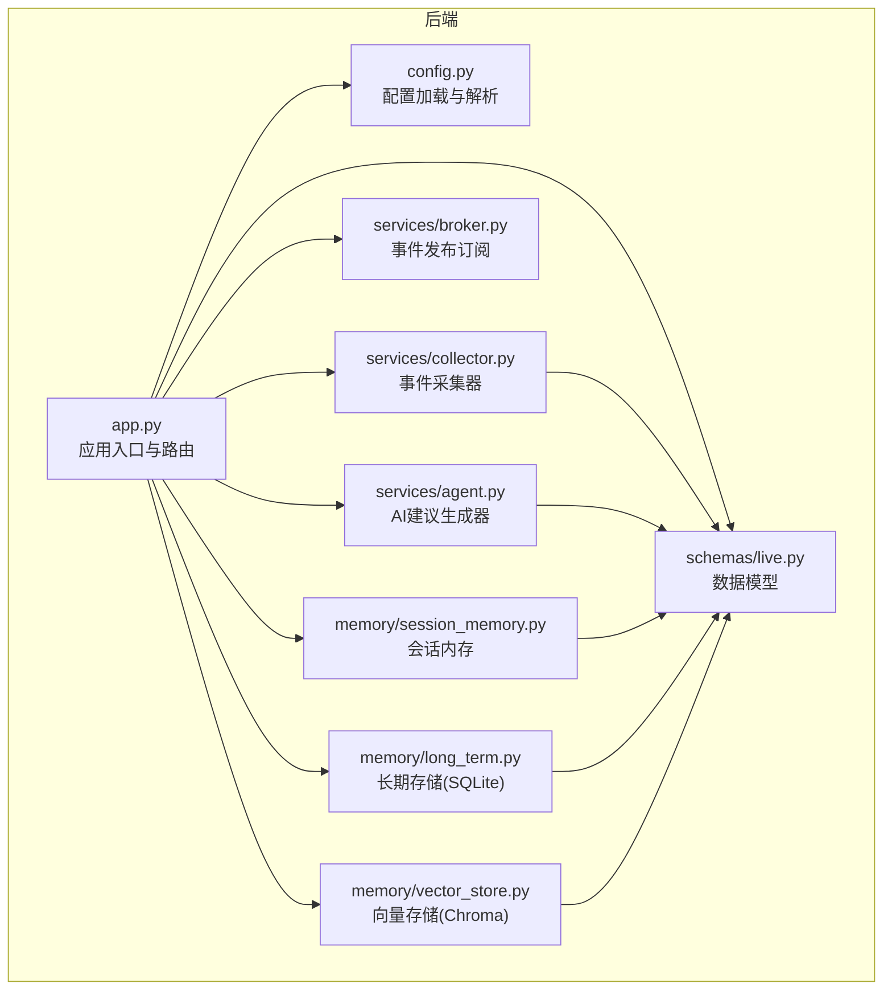
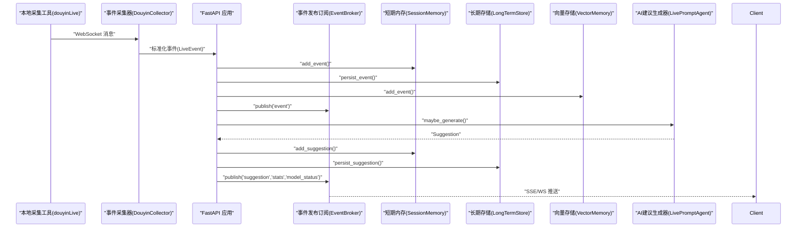
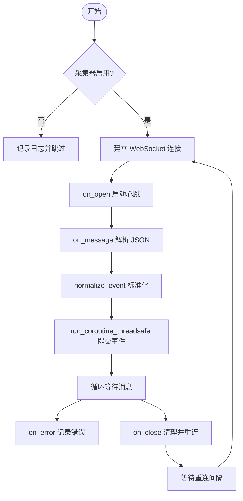
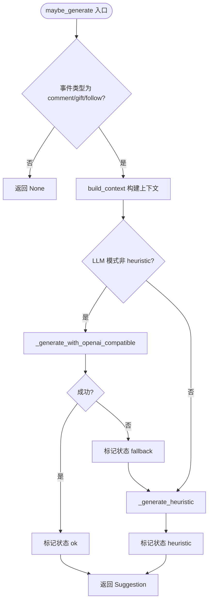
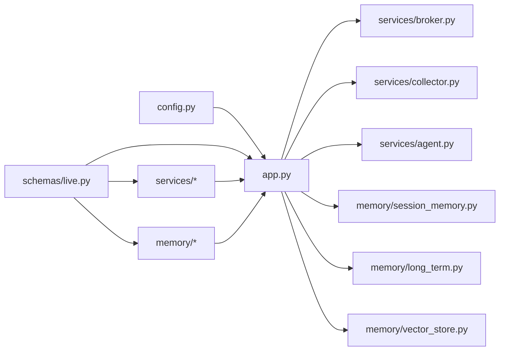

# 后端服务组件

<cite>
**本文引用的文件**
- [backend/app.py](file://backend/app.py)
- [backend/config.py](file://backend/config.py)
- [backend/services/collector.py](file://backend/services/collector.py)
- [backend/services/broker.py](file://backend/services/broker.py)
- [backend/services/agent.py](file://backend/services/agent.py)
- [backend/memory/session_memory.py](file://backend/memory/session_memory.py)
- [backend/memory/long_term.py](file://backend/memory/long_term.py)
- [backend/memory/vector_store.py](file://backend/memory/vector_store.py)
- [backend/schemas/live.py](file://backend/schemas/live.py)
- [requirements.txt](file://requirements.txt)
- [README.md](file://README.md)
</cite>

## 目录
1. [简介](#简介)
2. [项目结构](#项目结构)
3. [核心组件](#核心组件)
4. [架构总览](#架构总览)
5. [详细组件分析](#详细组件分析)
6. [依赖关系分析](#依赖关系分析)
7. [性能考量](#性能考量)
8. [故障排查指南](#故障排查指南)
9. [结论](#结论)
10. [附录](#附录)

## 简介
本文件为抖音直播实时提词器后端服务组件的完整技术文档。重点覆盖以下方面：
- FastAPI 应用入口的设计架构：路由定义、中间件配置、生命周期管理
- 配置管理系统：环境变量读取、设置类设计、配置加载机制
- 事件处理系统：事件采集器、事件发布订阅、AI建议生成器
- 内存管理系统：会话内存、长期存储、向量存储的三层架构
- 开发者扩展指南与最佳实践

## 项目结构
后端采用按职责分层的组织方式：
- 应用入口与路由：backend/app.py
- 配置管理：backend/config.py
- 事件处理：backend/services/collector.py、broker.py、agent.py
- 内存与存储：backend/memory/session_memory.py、long_term.py、vector_store.py
- 数据模型：backend/schemas/live.py
- 依赖声明：requirements.txt
- 顶层说明：README.md

图表来源
- [backend/app.py:1-220](file://backend/app.py#L1-L220)
- [backend/config.py:1-94](file://backend/config.py#L1-L94)
- [backend/services/collector.py:1-284](file://backend/services/collector.py#L1-L284)
- [backend/services/broker.py:1-40](file://backend/services/broker.py#L1-L40)
- [backend/services/agent.py:1-393](file://backend/services/agent.py#L1-L393)
- [backend/memory/session_memory.py:1-113](file://backend/memory/session_memory.py#L1-L113)
- [backend/memory/long_term.py:1-750](file://backend/memory/long_term.py#L1-L750)
- [backend/memory/vector_store.py:1-108](file://backend/memory/vector_store.py#L1-L108)
- [backend/schemas/live.py:1-95](file://backend/schemas/live.py#L1-L95)

章节来源
- [backend/app.py:1-220](file://backend/app.py#L1-L220)
- [README.md:21-349](file://README.md#L21-L349)

## 核心组件
- 应用入口与生命周期：FastAPI 应用、CORS 中间件、健康检查、SSE/WS 实时流、WebSocket 连接、生命周期钩子
- 事件采集器：连接本地 douyinLive WebSocket，标准化事件，提交到事件循环
- 事件发布订阅：进程内广播器，支持 SSE 与 WebSocket 订阅
- AI 建议生成器：优先 OpenAI 兼容接口，失败回退启发式规则，输出结构化建议
- 内存管理：短期（Redis/进程内）、长期（SQLite）、向量（Chroma/轻量哈希）
- 配置系统：.env 读取、Settings 类、默认值与解析逻辑

章节来源
- [backend/app.py:84-220](file://backend/app.py#L84-L220)
- [backend/services/collector.py:38-284](file://backend/services/collector.py#L38-L284)
- [backend/services/broker.py:10-40](file://backend/services/broker.py#L10-L40)
- [backend/services/agent.py:23-393](file://backend/services/agent.py#L23-L393)
- [backend/memory/session_memory.py:17-113](file://backend/memory/session_memory.py#L17-L113)
- [backend/memory/long_term.py:36-750](file://backend/memory/long_term.py#L36-L750)
- [backend/memory/vector_store.py:52-108](file://backend/memory/vector_store.py#L52-L108)
- [backend/config.py:39-94](file://backend/config.py#L39-L94)

## 架构总览
后端整体处理链路如下：
- 采集端（本地 douyinLive WebSocket）将原始消息推送到采集器
- 采集器标准化为统一事件模型，提交到 FastAPI 事件循环
- 处理流程：写入短期内存、持久化到长期存储、写入向量索引
- 发布订阅：事件、建议、统计、模型状态通过 SSE/WS 推送
- 建议生成：结合近期事件、相似历史、用户画像，优先在线模型，失败回退启发式规则

图表来源
- [backend/services/collector.py:117-284](file://backend/services/collector.py#L117-L284)
- [backend/app.py:61-78](file://backend/app.py#L61-L78)
- [backend/services/broker.py:28-40](file://backend/services/broker.py#L28-L40)
- [backend/services/agent.py:73-114](file://backend/services/agent.py#L73-L114)
- [backend/memory/session_memory.py:42-64](file://backend/memory/session_memory.py#L42-L64)
- [backend/memory/long_term.py:420-454](file://backend/memory/long_term.py#L420-L454)
- [backend/memory/vector_store.py:64-83](file://backend/memory/vector_store.py#L64-L83)

## 详细组件分析

### 应用入口与路由（FastAPI）
- 生命周期管理：使用 lifespan 钩子在应用启动时启动采集器，在关闭时清理活动会话并停止采集器
- CORS 中间件：允许跨域访问
- 路由与端点：
  - GET /health：健康检查，返回房间号与活动会话
  - GET /api/bootstrap：返回前端初始化快照（最近事件、建议、统计、模型状态）
  - POST /api/room：切换房间，关闭旧会话并切换采集器
  - POST /api/events：手动注入事件（便于联调）
  - GET /api/viewer、/api/viewer/notes、/api/viewer/notes/{note_id}：观众详情与备注 CRUD
  - GET /api/sessions、/api/sessions/current：会话查询与当前活动会话
  - GET /api/events/stream：SSE 实时事件流
  - WS /ws/live：WebSocket 实时事件流，连接后先发送 bootstrap 快照
- 事件封装与快照：event_envelope 统一封装事件类型与数据；snapshot_with_status 合并短期与长期数据，补充模型状态

章节来源
- [backend/app.py:84-220](file://backend/app.py#L84-L220)
- [backend/app.py:45-78](file://backend/app.py#L45-L78)

### 配置管理系统
- .env 读取：load_dotenv 读取项目根目录 .env，支持 KEY=VALUE、注释与空行
- Settings 类：集中管理所有运行参数，包含直播采集、后端服务、LLM 模式与凭据、存储路径、Redis TTL 等
- 默认值与解析：
  - 解析 LLM 基础地址与模型名：优先使用显式配置，否则根据模式自动选择（如 qwen/openai）
  - ensure_dirs：确保数据目录、数据库目录、向量存储目录存在
- 环境变量优先级：.env 文件优先于当前 shell 环境变量

章节来源
- [backend/config.py:11-94](file://backend/config.py#L11-L94)

### 事件采集器（collector.py）
- WebSocket 连接：基于 websocket-client，连接本地 douyinLive WebSocket
- 重连与心跳：断线自动重连，周期性发送 ping，异常日志记录
- 事件标准化：根据 method 映射到事件类型，抽取用户信息、礼物信息、元数据，构造 LiveEvent
- 线程安全：通过 asyncio.run_coroutine_threadsafe 将事件提交到 FastAPI 事件循环
- 房间切换：动态修改 settings.room_id 并重启采集线程

图表来源
- [backend/services/collector.py:117-284](file://backend/services/collector.py#L117-L284)

章节来源
- [backend/services/collector.py:38-284](file://backend/services/collector.py#L38-L284)

### 事件发布订阅（broker.py）
- 订阅队列：每个订阅者获得一个 asyncio.Queue
- 广播：publish 将消息投递到所有订阅队列，丢弃已满队列
- 去重：自动剔除已满导致阻塞的陈旧队列

章节来源
- [backend/services/broker.py:10-40](file://backend/services/broker.py#L10-L40)

### AI 建议生成器（agent.py）
- 生成策略：优先 OpenAI 兼容接口，失败回退启发式规则
- 上下文构建：近期事件窗口、相似历史片段、用户画像
- 输出结构：Suggestion 包含优先级、回复文本、语调、理由、置信度、来源事件与参考历史
- 状态追踪：current_status 返回模型模式、模型名、后端地址、最后结果、错误与更新时间
- 错误处理：网络错误、HTTP 错误、超时、JSON 解析失败、OS 错误等均有细化分支与状态标记

图表来源
- [backend/services/agent.py:73-114](file://backend/services/agent.py#L73-L114)
- [backend/services/agent.py:183-329](file://backend/services/agent.py#L183-L329)

章节来源
- [backend/services/agent.py:23-393](file://backend/services/agent.py#L23-L393)

### 内存管理系统（三层架构）

#### 会话内存（session_memory.py）
- 短期存储：优先 Redis（lpush/ltrim/expire），未安装或未配置时退化为进程内 deque
- 写入：add_event/add_suggestion，限制长度并设置 TTL
- 读取：recent_events/recent_suggestions，统计 stats 基于短期窗口
- 快照：snapshot 组合最近事件、建议与统计

章节来源
- [backend/memory/session_memory.py:17-113](file://backend/memory/session_memory.py#L17-L113)

#### 长期存储（long_term.py）
- SQLite 表结构：events、suggestions、viewer_profiles、viewer_gifts、live_sessions、viewer_notes
- 事件持久化：persist_event 自动维护活动会话、触达会话指标、更新用户画像与礼物聚合
- 建议持久化：persist_suggestion
- 查询接口：recent_events/recent_suggestions/stats/snapshot
- 用户画像：get_user_profile/get_viewer_detail，聚合评论、礼物、会话与备注
- 会话管理：list_live_sessions/get_active_session/close_active_session

章节来源
- [backend/memory/long_term.py:36-750](file://backend/memory/long_term.py#L36-L750)

#### 向量存储（vector_store.py）
- Chroma：若可用则使用 PersistentClient 创建/获取集合，upsert 文档与元数据
- 轻量降级：若不可用则使用哈希嵌入函数与简单文本相似度，维持检索能力
- 相似事件：similar 返回与输入文本最相近的历史片段

章节来源
- [backend/memory/vector_store.py:52-108](file://backend/memory/vector_store.py#L52-L108)

### 数据模型（schemas/live.py）
- Actor：最小化用户身份，支持多种标识符与 viewer_id 计算
- LiveEvent：标准化直播事件，包含事件 ID、房间、平台、类型、方法、时间戳、用户、内容、元数据与原始数据
- Suggestion：建议模型，包含来源、优先级、回复文本、语调、理由、置信度、来源事件与参考历史
- SessionStats：房间统计（事件总数与各类事件计数）
- ModelStatus：模型状态（模式、模型名、后端、最后结果、错误、更新时间）
- SessionSnapshot：前端初始化快照（最近事件、建议、统计、模型状态）

章节来源
- [backend/schemas/live.py:8-95](file://backend/schemas/live.py#L8-L95)

## 依赖关系分析
- 运行时依赖：websocket-client、fastapi、uvicorn、redis、chromadb
- 组件耦合：
  - app.py 依赖 config、memory、services、schemas
  - services 依赖 schemas 与 config
  - memory 依赖 schemas
- 外部集成点：本地 WebSocket、Redis、Chroma、SQLite

图表来源
- [backend/app.py:13-29](file://backend/app.py#L13-L29)
- [backend/config.py:39-94](file://backend/config.py#L39-L94)
- [backend/schemas/live.py:1-95](file://backend/schemas/live.py#L1-L95)
- [requirements.txt:1-6](file://requirements.txt#L1-L6)

章节来源
- [requirements.txt:1-6](file://requirements.txt#L1-L6)
- [backend/app.py:13-29](file://backend/app.py#L13-L29)

## 性能考量
- 事件处理流水线：
  - 采集器与 FastAPI 事件循环解耦，通过线程安全提交避免阻塞
  - Redis 短期存储具备 TTL 控制，降低内存占用
  - SQLite 事务批量写入，索引优化查询
  - 向量检索在可用时使用 Chroma，不可用时使用哈希嵌入与轻量相似度
- I/O 与并发：
  - SSE/WS 订阅采用 asyncio.Queue，避免阻塞
  - 采集器心跳与重连策略减少连接抖动
- 可观测性：
  - 模型状态与错误分类，便于定位问题
  - 日志记录关键事件与异常

## 故障排查指南
- 采集器无法连接：
  - 检查 ROOM_ID、COLLECTOR_HOST/PORT、COLLECTOR_ENABLED
  - 查看日志中的重连与 ping 失败记录
- SSE/WS 无数据：
  - 确认订阅房间号与事件过滤逻辑
  - 检查 broker 是否有订阅队列
- 建议生成失败：
  - 检查 LLM_MODE、LLM_BASE_URL、LLM_MODEL、LLM_API_KEY
  - 关注模型状态 last_result 与 last_error
- 存储异常：
  - Redis/Chroma 不可用时会自动降级，确认 DATA_DIR、DATABASE_PATH、CHROMA_DIR 权限
  - SQLite 表结构迁移与索引重建逻辑

章节来源
- [backend/services/collector.py:117-181](file://backend/services/collector.py#L117-L181)
- [backend/services/broker.py:28-40](file://backend/services/broker.py#L28-L40)
- [backend/services/agent.py:44-54](file://backend/services/agent.py#L44-L54)
- [backend/config.py:63-91](file://backend/config.py#L63-L91)
- [backend/memory/long_term.py:50-155](file://backend/memory/long_term.py#L50-L155)
- [backend/memory/vector_store.py:60-83](file://backend/memory/vector_store.py#L60-L83)

## 结论
该后端服务以 FastAPI 为核心，围绕“采集—标准化—存储—检索—建议—推送”的闭环构建，具备良好的可扩展性与鲁棒性。通过三层内存与存储体系、双模式建议生成策略以及进程内事件广播，满足直播场景对实时性与稳定性的要求。开发者可在保持现有接口稳定的前提下，按需扩展采集器、调整建议策略、优化存储与检索。

## 附录
- 快速启动与配置要点参见 README
- 依赖安装与运行命令参见 README
- 接口清单与示例参见 README

章节来源
- [README.md:66-141](file://README.md#L66-L141)
- [README.md:208-349](file://README.md#L208-L349)