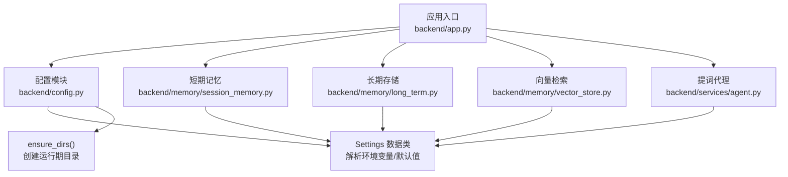
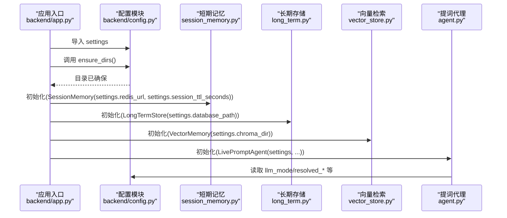
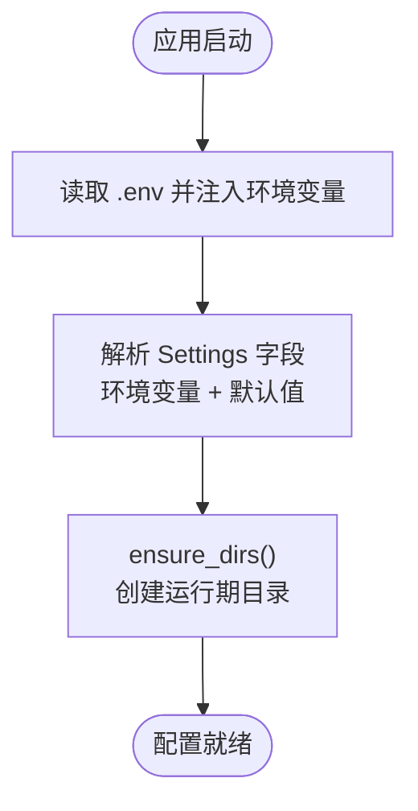
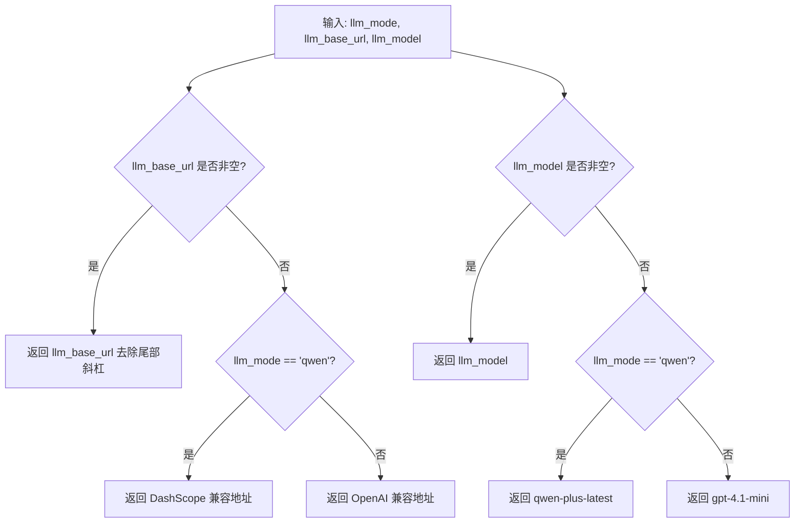
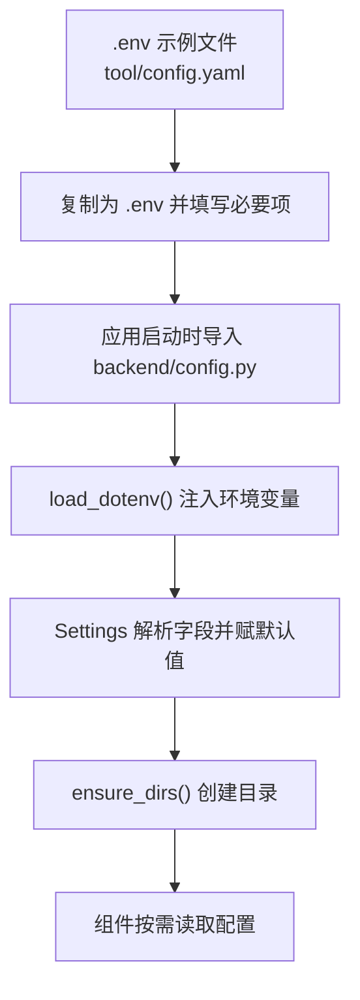
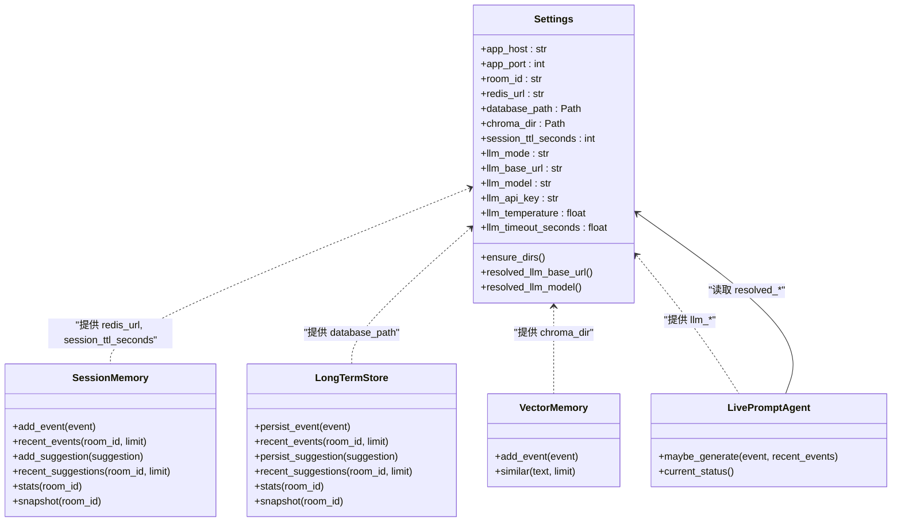
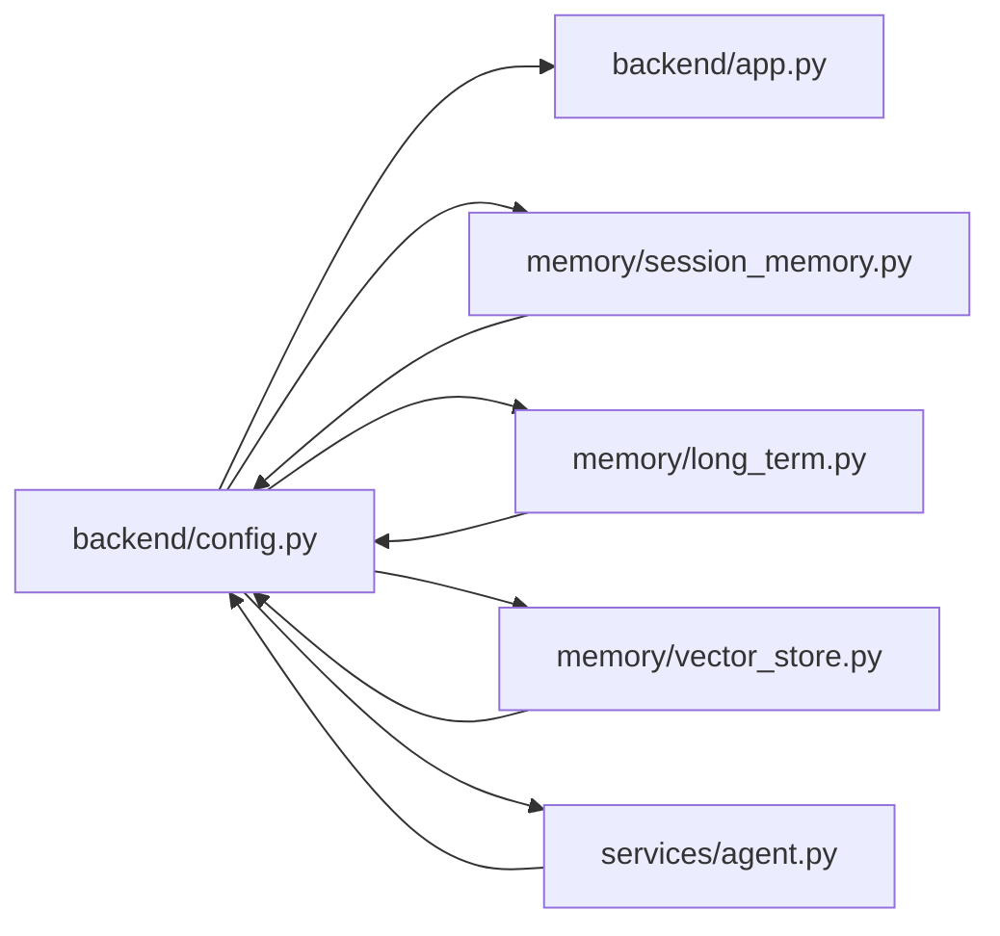

# 配置管理系统

<cite>
**本文档引用的文件**
- [backend/config.py](file://backend/config.py)
- [backend/app.py](file://backend/app.py)
- [backend/services/agent.py](file://backend/services/agent.py)
- [backend/memory/session_memory.py](file://backend/memory/session_memory.py)
- [backend/memory/vector_store.py](file://backend/memory/vector_store.py)
- [backend/memory/long_term.py](file://backend/memory/long_term.py)
- [tool/config.yaml](file://tool/config.yaml)
- [README.md](file://README.md)
</cite>

## 目录
1. [简介](#简介)
2. [项目结构](#项目结构)
3. [核心组件](#核心组件)
4. [架构总览](#架构总览)
5. [详细组件分析](#详细组件分析)
6. [依赖关系分析](#依赖关系分析)
7. [性能考虑](#性能考虑)
8. [故障排除指南](#故障排除指南)
9. [结论](#结论)

## 简介
本文件系统性梳理配置管理系统的架构设计与实现细节，重点覆盖以下方面：
- settings 类的设计与职责边界
- 环境变量解析与默认值策略
- 配置验证与解析机制
- 关键配置项的作用与影响范围
- 配置文件加载流程与目录确保机制
- 配置在各组件中的使用方式与依赖关系
- 开发者最佳实践与常见问题排查

## 项目结构
配置系统位于后端模块，采用“环境变量优先 + .env 文件辅助”的策略，结合数据类封装与运行时目录确保，形成轻量、可移植且易于扩展的配置体系。

图表来源
- [backend/app.py:22-29](file://backend/app.py#L22-L29)
- [backend/config.py:39-94](file://backend/config.py#L39-L94)

章节来源
- [backend/config.py:1-94](file://backend/config.py#L1-L94)
- [backend/app.py:1-220](file://backend/app.py#L1-L220)

## 核心组件
- 配置加载器：负责读取项目根目录 .env 文件，将其键值对注入到 os.environ，供后续解析使用。
- Settings 数据类：集中声明所有运行时配置项，提供默认值与类型转换，同时提供 ensure_dirs() 确保运行期目录存在。
- 解析与回退：针对 LLM 相关配置提供 resolved_* 方法，按模式自动解析最终使用的模型服务地址与模型名。
- 组件依赖：短期记忆、长期存储、向量检索、提词代理均直接或间接依赖 Settings 的值。

章节来源
- [backend/config.py:11-36](file://backend/config.py#L11-L36)
- [backend/config.py:39-94](file://backend/config.py#L39-L94)
- [backend/app.py:22-29](file://backend/app.py#L22-L29)

## 架构总览
配置系统在应用启动阶段完成环境变量解析与目录确保，随后由各组件按需读取配置。其关键流程如下：

图表来源
- [backend/app.py:22-29](file://backend/app.py#L22-L29)
- [backend/config.py:63-94](file://backend/config.py#L63-L94)

## 详细组件分析

### 配置加载与解析（Settings）
- 环境变量来源优先级：.env 文件（项目根目录） > shell 环境变量
- .env 加载器：逐行解析 KEY=VALUE，忽略注释与空行，去除引号，注入 os.environ
- 默认值策略：所有配置项均提供合理默认值，确保本地开箱即用
- 类型转换：字符串到整数、浮点数、布尔值的转换遵循约定
- 目录确保：ensure_dirs() 自动创建 data_dir、数据库父目录、chroma_dir

图表来源
- [backend/config.py:11-36](file://backend/config.py#L11-L36)
- [backend/config.py:63-68](file://backend/config.py#L63-L68)

章节来源
- [backend/config.py:11-36](file://backend/config.py#L11-L36)
- [backend/config.py:39-61](file://backend/config.py#L39-L61)
- [backend/config.py:63-68](file://backend/config.py#L63-L68)

### LLM 解析与回退策略
- resolved_llm_base_url：若显式配置 llm_base_url 则使用；否则根据 llm_mode 返回 DashScope 或 OpenAI 的兼容地址；否则返回空
- resolved_llm_model：若显式配置 llm_model 则使用；否则根据 llm_mode 返回 qwen-plus-latest 或 gpt-4.1-mini；否则返回空
- 该策略确保在不同模式下无需手动维护地址与模型名的一致性

图表来源
- [backend/config.py:70-90](file://backend/config.py#L70-L90)

章节来源
- [backend/config.py:70-90](file://backend/config.py#L70-L90)
- [backend/services/agent.py:24-54](file://backend/services/agent.py#L24-L54)

### 关键配置项详解
- redis_url
  - 作用：短期记忆（SessionMemory）的 Redis 地址；未安装 Redis 或未配置时退化为进程内内存
  - 影响：短期事件与建议的存储位置与生命周期
  - 使用：SessionMemory.__init__ 与 add/recent 接口
- database_path
  - 作用：长期存储（LongTermStore）的 SQLite 数据库路径
  - 影响：事件、建议、用户画像、会话等持久化数据
  - 使用：LongTermStore.__init__ 与各类查询/写入接口
- chroma_dir
  - 作用：向量检索（VectorMemory）的 Chroma 持久化目录
  - 影响：历史相似事件检索能力；未安装 Chroma 时退化为轻量文本相似策略
  - 使用：VectorMemory.__init__ 与 add_event/similar 接口
- session_ttl_seconds
  - 作用：短期记忆在 Redis 模式下的 TTL 秒数
  - 影响：热数据生命周期与内存占用
  - 使用：SessionMemory.add_event/add_suggestion 中 expire 调用
- 其他常用配置
  - app_host/app_port：后端服务监听地址与端口
  - room_id：默认采集房间 ID
  - collector_*：采集器连接参数
  - llm_*：模型模式、API 地址、模型名、密钥、温度、超时等
  - data_dir：通用数据目录

章节来源
- [backend/config.py:43-61](file://backend/config.py#L43-L61)
- [backend/memory/session_memory.py:17-31](file://backend/memory/session_memory.py#L17-L31)
- [backend/memory/long_term.py:36-39](file://backend/memory/long_term.py#L36-L39)
- [backend/memory/vector_store.py:52-63](file://backend/memory/vector_store.py#L52-L63)
- [backend/services/agent.py:183-220](file://backend/services/agent.py#L183-L220)

### 配置文件加载流程与目录确保机制
- .env 加载：在模块导入时自动执行 load_dotenv，仅解析 KEY=VALUE、注释与空行
- 环境变量优先：os.getenv(key, default) 优先读取注入后的环境变量
- 目录确保：ensure_dirs() 递归创建 data_dir、数据库父目录、chroma_dir，避免运行时报错

图表来源
- [tool/config.yaml:1-16](file://tool/config.yaml#L1-L16)
- [backend/config.py:11-36](file://backend/config.py#L11-L36)
- [backend/config.py:63-68](file://backend/config.py#L63-L68)

章节来源
- [tool/config.yaml:1-16](file://tool/config.yaml#L1-L16)
- [backend/config.py:11-36](file://backend/config.py#L11-L36)
- [backend/config.py:63-68](file://backend/config.py#L63-L68)

### 配置在各组件中的使用方式与依赖关系
- 应用入口（app.py）
  - 调用 settings.ensure_dirs() 确保目录
  - 将 settings 传入 SessionMemory、LongTermStore、VectorMemory、LivePromptAgent
- SessionMemory
  - 读取 redis_url 与 session_ttl_seconds，决定 Redis 模式与过期策略
- LongTermStore
  - 读取 database_path，建立 SQLite 连接并进行表结构初始化与索引创建
- VectorMemory
  - 读取 chroma_dir，尝试使用 Chroma；不可用时使用轻量哈希嵌入与内存列表
- LivePromptAgent
  - 读取 llm_mode、resolved_llm_base_url、resolved_llm_model、llm_api_key、llm_temperature、llm_timeout_seconds，决定模型调用与回退策略

图表来源
- [backend/config.py:39-94](file://backend/config.py#L39-L94)
- [backend/memory/session_memory.py:17-113](file://backend/memory/session_memory.py#L17-L113)
- [backend/memory/long_term.py:36-750](file://backend/memory/long_term.py#L36-L750)
- [backend/memory/vector_store.py:52-108](file://backend/memory/vector_store.py#L52-L108)
- [backend/services/agent.py:23-393](file://backend/services/agent.py#L23-L393)

章节来源
- [backend/app.py:22-29](file://backend/app.py#L22-L29)
- [backend/memory/session_memory.py:17-113](file://backend/memory/session_memory.py#L17-L113)
- [backend/memory/long_term.py:36-750](file://backend/memory/long_term.py#L36-L750)
- [backend/memory/vector_store.py:52-108](file://backend/memory/vector_store.py#L52-L108)
- [backend/services/agent.py:23-393](file://backend/services/agent.py#L23-L393)

## 依赖关系分析
- 组件耦合
  - app.py 与 config.py 强耦合：应用启动依赖 settings.ensure_dirs() 与 settings.* 字段
  - 各存储与检索组件与 Settings 弱耦合：仅在构造函数中读取必要字段
  - 提词代理与 Settings 强耦合：频繁读取 llm_* 与 resolved_* 字段
- 外部依赖
  - Redis：可选，未安装时短期记忆退化为内存队列
  - Chroma：可选，未安装时向量检索退化为轻量文本相似
  - SQLite：必选，用于长期存储
- 循环依赖
  - 未发现循环依赖，配置模块被其他模块单向依赖

图表来源
- [backend/app.py:13-29](file://backend/app.py#L13-L29)
- [backend/config.py:39-94](file://backend/config.py#L39-L94)

章节来源
- [backend/app.py:13-29](file://backend/app.py#L13-L29)
- [backend/config.py:39-94](file://backend/config.py#L39-L94)

## 性能考虑
- 目录确保：ensure_dirs() 在应用启动时一次性执行，避免运行期重复 IO
- Redis TTL：session_ttl_seconds 控制短期记忆在 Redis 中的生命周期，平衡内存占用与访问延迟
- 向量检索降级：未安装 Chroma 时使用轻量哈希嵌入与内存列表，降低部署复杂度但牺牲检索精度
- SQLite 索引：LongTermStore 在初始化时创建多处索引，提升查询性能
- LLM 调用：超时与回退策略减少网络抖动对主线程的影响

## 故障排除指南
- 启动时报目录权限错误
  - 检查 DATA_DIR、DATABASE_PATH、CHROMA_DIR 的父目录权限
  - 确认 ensure_dirs() 已在应用启动时执行
- Redis 连接失败或性能异常
  - 检查 REDIS_URL 格式与可达性
  - 调整 SESSION_TTL_SECONDS 以优化内存占用
- Chroma 无法使用
  - 确认已安装 chromadb；如未安装，向量检索将自动退化为轻量策略
- LLM 调用失败或超时
  - 检查 LLM_MODE、LLM_BASE_URL、LLM_MODEL、LLM_API_KEY
  - 调整 LLM_TIMEOUT_SECONDS 与 LLM_TEMPERATURE
- .env 未生效
  - 确认 .env 文件位于项目根目录
  - 确认 KEY=VALUE 格式正确，无多余空格或引号
- 房间切换无效
  - 检查 ROOM_ID 与采集器连接参数（COLLECTOR_HOST/PORT）

章节来源
- [backend/config.py:11-36](file://backend/config.py#L11-L36)
- [backend/config.py:63-68](file://backend/config.py#L63-L68)
- [backend/memory/session_memory.py:17-31](file://backend/memory/session_memory.py#L17-L31)
- [backend/memory/vector_store.py:52-63](file://backend/memory/vector_store.py#L52-L63)
- [backend/services/agent.py:183-285](file://backend/services/agent.py#L183-L285)
- [README.md:142-207](file://README.md#L142-L207)

## 结论
配置管理系统以 Settings 为核心，通过 .env 与环境变量的双通道解析、合理的默认值与目录确保机制，实现了低门槛部署与灵活扩展。各组件按需读取配置，耦合度低、可测试性强。建议在生产环境中：
- 显式配置必要的敏感信息（如 LLM_API_KEY、REDIS_URL）
- 根据资源情况调整 SESSION_TTL_SECONDS 与 LLM_TIMEOUT_SECONDS
- 在具备条件时启用 Redis 与 Chroma，以获得更好的性能与体验