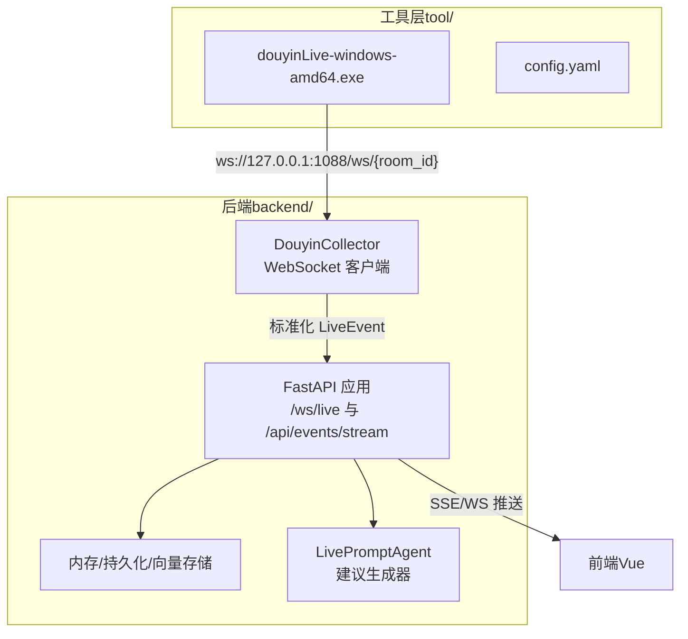
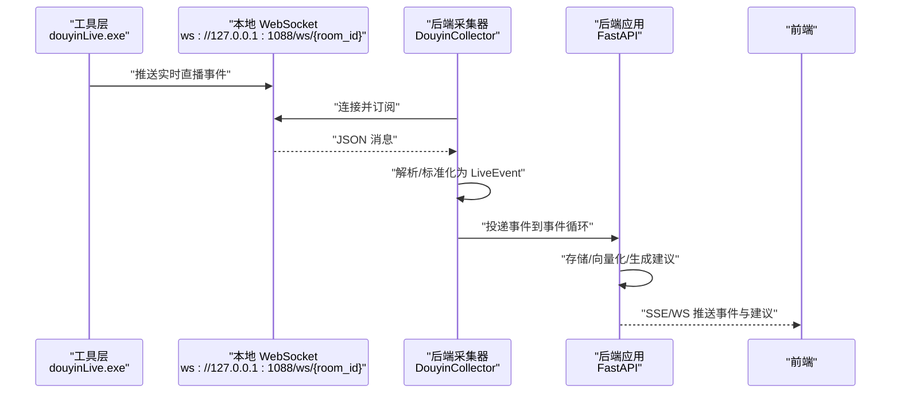
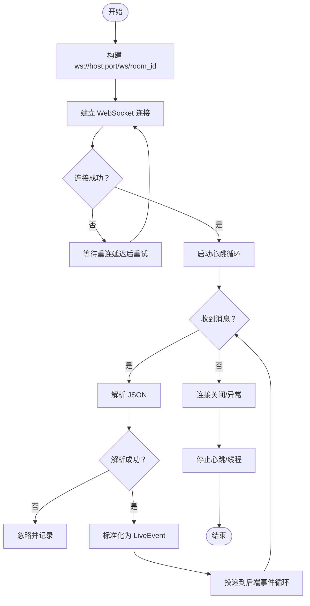
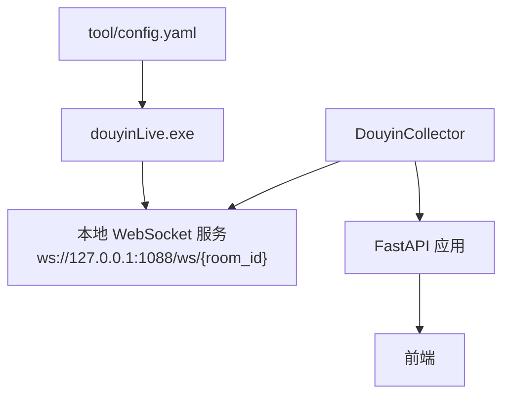

# 工具层组件

<cite>
**本文引用的文件**
- [README.md](file://README.md)
- [USAGE.md](file://USAGE.md)
- [requirements.txt](file://requirements.txt)
- [tool/config.yaml](file://tool/config.yaml)
- [backend/config.py](file://backend/config.py)
- [backend/services/collector.py](file://backend/services/collector.py)
- [backend/app.py](file://backend/app.py)
- [start_all.ps1](file://start_all.ps1)
- [start_backend_qwen.ps1](file://start_backend_qwen.ps1)
- [start_frontend.ps1](file://start_frontend.ps1)
- [deprecated/debug_client.py](file://deprecated/debug_client.py)
</cite>

## 目录
1. [简介](#简介)
2. [项目结构](#项目结构)
3. [核心组件](#核心组件)
4. [架构总览](#架构总览)
5. [详细组件分析](#详细组件分析)
6. [依赖分析](#依赖分析)
7. [性能考虑](#性能考虑)
8. [故障排查指南](#故障排查指南)
9. [结论](#结论)
10. [附录](#附录)

## 简介
本文件面向抖音直播实时提词器的“工具层组件”，聚焦于本地消息源程序 douyinLive 的作用、配置与使用，以及其与后端服务的通信协议。工具层负责连接抖音直播间的实时消息，并在本地以 WebSocket 形式对外暴露，供后端采集器订阅与标准化，最终驱动提词建议生成与前端展示。

## 项目结构
工具层位于 tool/ 目录下，核心为可执行文件 douyinLive-windows-amd64.exe；同时提供配置文件 config.yaml 用于端口、Cookie 等参数设置。后端通过内置采集器连接该本地 WebSocket，进行消息标准化与事件分发。

图表来源
- [README.md:35-48](file://README.md#L35-L48)
- [backend/services/collector.py:54-59](file://backend/services/collector.py#L54-L59)
- [backend/app.py:209-220](file://backend/app.py#L209-L220)

章节来源
- [README.md:21-34](file://README.md#L21-L34)
- [tool/config.yaml:1-16](file://tool/config.yaml#L1-L16)

## 核心组件
- 工具层可执行文件：负责连接抖音直播、抓取实时消息，并在本地以 WebSocket 暴露，端口默认 1088。
- 配置文件 config.yaml：定义端口、未知消息调试开关、Cookie（可选）等。
- 后端采集器 DouyinCollector：连接本地 WebSocket，解析消息为统一 LiveEvent，并投递到后端事件循环。
- 后端应用：提供健康检查、SSE/WS 实时流、房间切换等接口，驱动事件处理与建议生成。

章节来源
- [README.md:5-10](file://README.md#L5-L10)
- [tool/config.yaml:4-16](file://tool/config.yaml#L4-L16)
- [backend/services/collector.py:38-53](file://backend/services/collector.py#L38-L53)
- [backend/app.py:104-133](file://backend/app.py#L104-L133)

## 架构总览
工具层作为“上游消息源”，将抖音直播事件以统一格式通过本地 WebSocket 推送至后端采集器，后端完成事件标准化、存储、向量化与建议生成，并通过 SSE/WS 推送到前端。

图表来源
- [README.md:37-48](file://README.md#L37-L48)
- [backend/services/collector.py:117-139](file://backend/services/collector.py#L117-L139)
- [backend/app.py:209-220](file://backend/app.py#L209-L220)

## 详细组件分析

### 工具层可执行文件与配置
- 可执行文件：位于 tool/douyinLive-windows-amd64.exe，负责连接抖音直播并以 WebSocket 暴露消息。
- 配置文件：tool/config.yaml
  - 端口 port：默认 1088
  - 未知消息调试 unknown：默认 false
  - Cookie 配置 cookie：可选，用于需要登录态的请求；获取方式见注释提示
- 启动方式：直接运行可执行文件即可启动本地 WebSocket 服务；默认监听 ws://127.0.0.1:1088/ws/{room_id}

章节来源
- [USAGE.md:49-72](file://USAGE.md#L49-L72)
- [tool/config.yaml:4-16](file://tool/config.yaml#L4-L16)

### 后端采集器与连接管理
- 连接目标：ws://{host}:{port}/ws/{room_id}，默认 host=127.0.0.1，port=1088，room_id 来自 .env 的 ROOM_ID
- 连接生命周期：
  - start：启动采集线程，建立 WebSocket 连接
  - 断线重连：按配置的重连延迟等待后重试
  - 停止：停止心跳、关闭连接、等待线程退出
- 心跳机制：定期发送 ping，避免连接空闲断开
- 错误处理：忽略非 JSON 消息；记录错误日志；异常崩溃时重试

图表来源
- [backend/services/collector.py:117-139](file://backend/services/collector.py#L117-L139)
- [backend/services/collector.py:140-198](file://backend/services/collector.py#L140-L198)
- [backend/services/collector.py:225-283](file://backend/services/collector.py#L225-L283)

章节来源
- [backend/services/collector.py:54-59](file://backend/services/collector.py#L54-L59)
- [backend/services/collector.py:117-198](file://backend/services/collector.py#L117-L198)
- [backend/services/collector.py:225-283](file://backend/services/collector.py#L225-L283)

### 消息处理与事件标准化
- 方法到事件类型的映射：WebcastChatMessage → comment，WebcastGiftMessage → gift，WebcastLikeMessage → like，WebcastMemberMessage → member，WebcastSocialMessage → follow，其他 → system
- 标准化字段：event_id、room_id、platform、event_type、method、livename、ts、user、content、metadata、raw
- 特殊字段提取：礼物事件提取 gift_name、gift_id、gift_count、gift_diamond_count、combo_count、group_count；点赞/入场/关注事件提取 action

章节来源
- [backend/services/collector.py:22-28](file://backend/services/collector.py#L22-L28)
- [backend/services/collector.py:225-283](file://backend/services/collector.py#L225-L283)

### 后端服务与通信协议
- WebSocket 接口：/ws/live，连接后先推送一次 bootstrap 快照，随后持续推送 event/suggestion/stats/model_status
- SSE 接口：/api/events/stream，支持按房间过滤
- 房间切换：/api/room，支持动态切换采集房间
- 健康检查：/health，返回服务状态与当前房间号
- 事件注入：/api/events，支持手动注入标准化事件（联调用途）

章节来源
- [backend/app.py:104-133](file://backend/app.py#L104-L133)
- [backend/app.py:187-206](file://backend/app.py#L187-L206)
- [backend/app.py:209-220](file://backend/app.py#L209-L220)

### 配置与环境
- 后端配置来源：优先读取根目录 .env，其次读取当前 Shell 环境变量
- 关键配置项（后端）：ROOM_ID、COLLECTOR_ENABLED、COLLECTOR_HOST、COLLECTOR_PORT、COLLECTOR_PING_INTERVAL_SECONDS、COLLECTOR_RECONNECT_DELAY_SECONDS、APP_HOST、APP_PORT 等
- 依赖：websocket-client、fastapi、uvicorn、redis、chromadb

章节来源
- [README.md:142-201](file://README.md#L142-L201)
- [backend/config.py:40-61](file://backend/config.py#L40-L61)
- [requirements.txt:1-6](file://requirements.txt#L1-L6)

## 依赖分析
工具层与后端之间的耦合点主要体现在 WebSocket 协议约定与消息格式一致性上。后端通过配置控制连接参数，工具层通过配置控制本地服务行为。

图表来源
- [tool/config.yaml:4-16](file://tool/config.yaml#L4-L16)
- [backend/services/collector.py:54-59](file://backend/services/collector.py#L54-L59)
- [backend/app.py:209-220](file://backend/app.py#L209-L220)

章节来源
- [backend/config.py:40-61](file://backend/config.py#L40-L61)
- [backend/services/collector.py:54-59](file://backend/services/collector.py#L54-L59)

## 性能考虑
- 心跳间隔与重连延迟：可通过配置调整，平衡网络稳定性与资源占用
- 事件处理异步化：采集器将事件投递到后端事件循环，避免阻塞 WebSocket 接收线程
- 存储与检索：Redis、Chroma 为可选增强，不安装也可运行基本流程

## 故障排查指南
- 页面打开但无建议：检查工具层是否已启动、.env 的 ROOM_ID 是否正确、直播间是否开播、后端是否已重启
- 顶部显示 fallback：说明在线模型调用失败，系统回退到规则；优先检查 DASHSCOPE_API_KEY、网络可达性、超时或限流
- 顶部显示 heuristic：当前未走模型，检查 LLM_MODE 设置或 .env 加载
- 前端无法打开：检查前端启动脚本与端口占用
- 后端启动但无数据写入：确认工具层运行、后端日志已连接到 ws://127.0.0.1:1088/ws/{room_id}、房间确有消息
- 调试原始消息：可使用废弃脚本 deprecated/debug_client.py 连接本地 WebSocket 并打印原始 JSON，日志输出到 logs/

章节来源
- [USAGE.md:198-239](file://USAGE.md#L198-L239)
- [deprecated/debug_client.py:68-98](file://deprecated/debug_client.py#L68-L98)

## 结论
工具层组件通过本地 WebSocket 将抖音直播事件以统一格式提供给后端，是系统上游的关键节点。配合后端的采集、存储、检索与建议生成，形成完整的实时提词链路。正确配置工具层与后端，可确保稳定、低延迟的消息流转与建议产出。

## 附录

### 安装与启动步骤
- 准备配置：复制 .env.example 为 .env，填写 ROOM_ID、LLM_MODE、DASHSCOPE_API_KEY 等
- 启动工具层：运行 tool/douyinLive-windows-amd64.exe
- 安装后端依赖：pip install -r requirements.txt
- 启动后端：python -m uvicorn backend.app:app --host 127.0.0.1 --port 8010 --reload
- 启动前端：cd frontend && npm install && npm run dev -- --host 127.0.0.1 --strictPort --port 5173
- 或使用脚本：start_all.ps1、start_backend_qwen.ps1、start_frontend.ps1

章节来源
- [USAGE.md:24-114](file://USAGE.md#L24-L114)
- [start_all.ps1:1-18](file://start_all.ps1#L1-L18)
- [start_backend_qwen.ps1:1-13](file://start_backend_qwen.ps1#L1-L13)
- [start_frontend.ps1:1-22](file://start_frontend.ps1#L1-L22)

### 配置文件参数说明（工具层）
- port：本地 WebSocket 服务端口（默认 1088）
- unknown：是否输出未知消息类型（调试用）
- cookie：可选 Cookie 配置，用于需要登录态的请求

章节来源
- [tool/config.yaml:4-16](file://tool/config.yaml#L4-L16)

### 后端配置项（关键）
- ROOM_ID：采集房间标识
- COLLECTOR_ENABLED：是否启用内置采集器
- COLLECTOR_HOST/PORT：采集器连接的主机与端口
- COLLECTOR_PING_INTERVAL_SECONDS：心跳间隔
- COLLECTOR_RECONNECT_DELAY_SECONDS：断线重连延迟
- APP_HOST/APP_PORT：后端服务监听地址与端口

章节来源
- [README.md:146-162](file://README.md#L146-L162)
- [backend/config.py:40-61](file://backend/config.py#L40-L61)