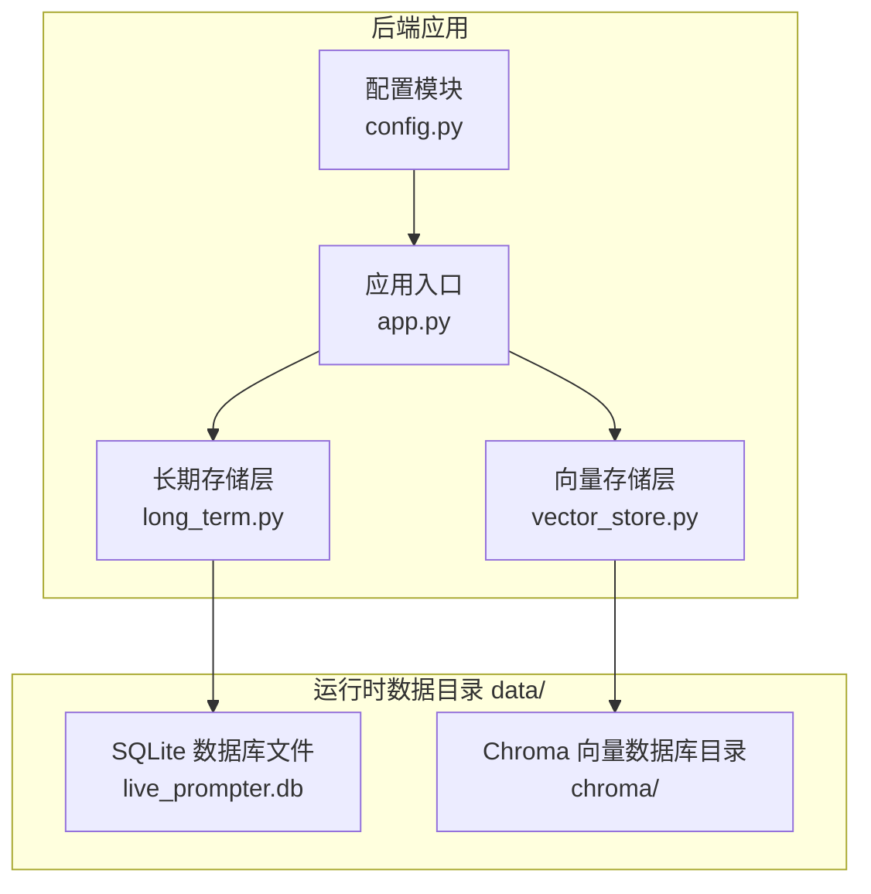
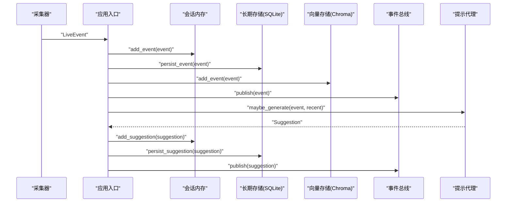
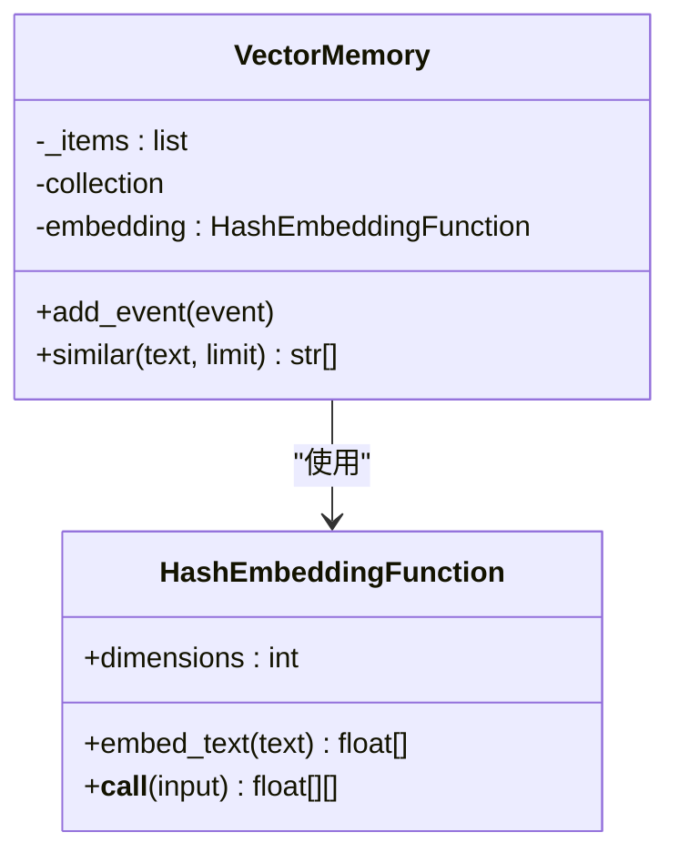
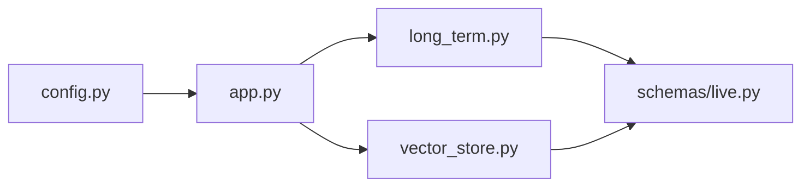

# 数据存储组件

<cite>
**本文引用的文件列表**
- [backend/memory/long_term.py](file://backend/memory/long_term.py)
- [backend/memory/vector_store.py](file://backend/memory/vector_store.py)
- [backend/config.py](file://backend/config.py)
- [backend/schemas/live.py](file://backend/schemas/live.py)
- [backend/app.py](file://backend/app.py)
- [data/DATABASE.md](file://data/DATABASE.md)
</cite>

## 目录
1. [简介](#简介)
2. [项目结构](#项目结构)
3. [核心组件](#核心组件)
4. [架构总览](#架构总览)
5. [详细组件分析](#详细组件分析)
6. [依赖关系分析](#依赖关系分析)
7. [性能考量](#性能考量)
8. [故障排查指南](#故障排查指南)
9. [结论](#结论)
10. [附录](#附录)

## 简介
本文件针对抖音直播实时提词器的数据存储组件进行全面技术文档化，重点覆盖：
- 运行时数据目录（data/）的结构与用途，包括 SQLite 长期存储与 Chroma 向量数据库的落地方式
- 长期存储系统（long_term.py）的数据库设计：事件表、建议表、用户画像表等的字段、索引与查询优化
- 向量存储系统（vector_store.py）的 Chroma 集成实现：嵌入函数选择、相似度检索算法与性能优化
- 数据生命周期管理：清理策略、备份恢复与存储空间管理
- 数据迁移指南与存储扩展方案
- 面向数据库管理员的监控与维护最佳实践

## 项目结构
数据存储相关的核心位置与职责如下：
- 运行时数据目录 data/：默认路径由配置决定，包含 SQLite 数据库文件与 Chroma 向量数据库目录
- 长期存储层（SQLite）：负责事件流水、会话、观众画像、礼物聚合、建议与备注等结构化数据
- 向量存储层（Chroma）：负责事件内容的向量化与相似检索，支持降级为轻量文本相似度方案
- 应用入口与配置：统一初始化数据目录、加载配置并协调各存储组件



图表来源
- [backend/config.py:63-69](file://backend/config.py#L63-L69)
- [backend/app.py:22-29](file://backend/app.py#L22-L29)
- [backend/memory/long_term.py:36-39](file://backend/memory/long_term.py#L36-L39)
- [backend/memory/vector_store.py:52-63](file://backend/memory/vector_store.py#L52-L63)

章节来源
- [backend/config.py:50-69](file://backend/config.py#L50-L69)
- [backend/app.py:22-29](file://backend/app.py#L22-L29)

## 核心组件
- 长期存储层（SQLite）
  - 负责事件流水、会话、观众画像、礼物聚合、建议与备注等的持久化
  - 提供事件写入、统计、快照、观众画像查询、会话管理等接口
- 向量存储层（Chroma）
  - 负责事件内容的向量化与相似检索；若未安装 Chroma，则回退为基于词重叠的轻量相似度
  - 提供事件写入与相似检索接口

章节来源
- [backend/memory/long_term.py:36-750](file://backend/memory/long_term.py#L36-L750)
- [backend/memory/vector_store.py:52-108](file://backend/memory/vector_store.py#L52-L108)

## 架构总览
整体数据流从采集器接收直播事件，经会话内存、长期存储与向量存储协同处理，再通过代理生成建议并推送至前端。



图表来源
- [backend/app.py:61-78](file://backend/app.py#L61-L78)
- [backend/memory/long_term.py:420-454](file://backend/memory/long_term.py#L420-L454)
- [backend/memory/vector_store.py:64-84](file://backend/memory/vector_store.py#L64-L84)

## 详细组件分析

### 长期存储层（SQLite）设计与实现
- 数据库初始化与表结构
  - 初始化时创建事件表、建议表、观众画像表、礼物聚合表、直播会话表、观众备注表
  - 自动迁移：确保新增列存在、重建索引、回填历史字段、重建聚合
- 关键表与字段
  - 事件表（events）：事件主键、房间号、平台、事件类型、方法、昵称、用户标识、内容、时间戳、元数据与原始 JSON
  - 观众画像表（viewer_profiles）：按房间+观众聚合的互动统计、首次/最近时间、最近会话、最近评论/加入/礼物等
  - 礼物聚合表（viewer_gifts）：按房间+观众+礼物名聚合的事件数、总量、钻石数、首次/最近送礼时间
  - 直播会话表（live_sessions）：会话状态、开始/最后事件/结束时间、各类计数
  - 建议表（suggestions）：建议主键、房间号、事件关联、优先级、回复文本、语调、原因、置信度、创建时间
  - 观众备注表（viewer_notes）：备注主键、房间号、观众、作者、内容、是否置顶、创建/更新时间
- 索引策略
  - 事件表：按房间+时间倒序、房间+观众+时间倒序、房间+事件类型+时间倒序、会话索引
  - 观众画像表：按房间+昵称索引
  - 礼物聚合表：按房间+观众+最近送礼时间倒序
  - 会话表：按房间+状态+最后事件时间倒序
  - 备注表：按房间+观众+更新时间倒序
- 查询优化
  - 使用索引覆盖常见查询路径（最近事件、观众画像、礼物历史、会话列表）
  - 使用 UPSERT/ON CONFLICT 实现增量聚合，避免全表扫描
  - 重建聚合时按时间顺序扫描，保证一致性
- 生命周期管理
  - 会话管理：自动创建活动会话，支持切换房间时关闭当前会话
  - 清理策略：代码中未见显式过期清理逻辑，建议结合业务需求制定定期清理策略
  - 备份与恢复：建议定期导出 SQLite 数据库文件；生产环境建议使用数据库备份工具进行周期性备份
  - 存储空间管理：监控 data/ 下 live_prompter.db 与 chroma/ 的增长趋势，必要时进行归档或压缩

```mermaid
erDiagram
EVENTS {
text event_id PK
text room_id
text source_room_id
text session_id
text platform
text viewer_id
text user_id
text short_id
text sec_uid
text nickname
text event_type
text method
text livename
text content
text gift_name
text gift_id
int gift_count
int gift_diamond_count
int ts
text metadata_json
text raw_json
}
VIEWER_PROFILES {
text room_id PK
text viewer_id PK
text source_room_id
text user_id
text short_id
text sec_uid
text nickname
int total_event_count
int comment_count
int join_count
int gift_event_count
int total_gift_count
int total_diamond_count
int first_seen_at
int last_seen_at
text last_session_id
text last_comment
int last_join_at
text last_gift_name
int last_gift_at
}
VIEWER_GIFTS {
text room_id PK
text viewer_id PK
text gift_name PK
text source_room_id
text user_id
text short_id
text sec_uid
text nickname
text gift_id
int gift_event_count
int total_gift_count
int total_diamond_count
int first_sent_at
int last_sent_at
}
LIVE_SESSIONS {
text session_id PK
text room_id
text source_room_id
text livename
text status
int started_at
int last_event_at
int ended_at
int event_count
int comment_count
int gift_event_count
int join_count
}
SUGGESTIONS {
text suggestion_id PK
text room_id
text event_id
text priority
text reply_text
text tone
text reason
real confidence
int created_at
}
VIEWER_NOTES {
text note_id PK
text room_id
text viewer_id
text author
text content
int is_pinned
int created_at
int updated_at
}
EVENTS }o--|| VIEWER_PROFILES : "按房间+观众聚合"
EVENTS }o--|| VIEWER_GIFTS : "按房间+观众+礼物聚合"
EVENTS }o--o|| LIVE_SESSIONS : "归属会话"
SUGGESTIONS }o--|| EVENTS : "关联事件"
```

图表来源
- [backend/memory/long_term.py:54-148](file://backend/memory/long_term.py#L54-L148)
- [data/DATABASE.md:16-151](file://data/DATABASE.md#L16-L151)

章节来源
- [backend/memory/long_term.py:50-155](file://backend/memory/long_term.py#L50-L155)
- [backend/memory/long_term.py:420-454](file://backend/memory/long_term.py#L420-L454)
- [backend/memory/long_term.py:663-717](file://backend/memory/long_term.py#L663-L717)
- [data/DATABASE.md:16-151](file://data/DATABASE.md#L16-L151)

### 向量存储层（Chroma）集成实现
- 集成策略
  - 若安装了 Chroma，则使用持久化客户端与集合“live_history”
  - 若未安装 Chroma，则回退为轻量文本相似度：基于词重叠计算相似度，仅缓存最近若干条历史项
- 嵌入函数
  - 默认使用 HashEmbeddingFunction：对中文与英文词进行分词，使用 SHA256 对每个词生成向量维度索引，正负号交替累加，最后做 L2 归一化
  - 维度可配置，默认 64 维
- 相似度检索
  - Chroma 模式：对查询文本进行嵌入，调用 collection.query 返回最相似的历史文档
  - 回退模式：对查询与历史项进行词重叠计数排序，返回前 N 条
- 性能优化
  - Chroma 模式：利用向量索引与嵌入加速相似检索
  - 回退模式：限制历史项数量（默认 500），避免 O(N) 搜索膨胀



图表来源
- [backend/memory/vector_store.py:19-50](file://backend/memory/vector_store.py#L19-L50)
- [backend/memory/vector_store.py:52-108](file://backend/memory/vector_store.py#L52-L108)

章节来源
- [backend/memory/vector_store.py:13-16](file://backend/memory/vector_store.py#L13-L16)
- [backend/memory/vector_store.py:19-50](file://backend/memory/vector_store.py#L19-L50)
- [backend/memory/vector_store.py:64-108](file://backend/memory/vector_store.py#L64-L108)

### 数据目录与配置
- 默认路径
  - SQLite 数据库：data/live_prompter.db
  - Chroma 向量数据库：data/chroma/
- 目录创建
  - 启动时自动创建 data/、数据库父目录与 chroma/ 目录
- 环境变量
  - DATA_DIR、DATABASE_PATH、CHROMA_DIR 可用于自定义路径
  - 其他运行参数如房间号、会话 TTL、LLM 模型等也在此配置

章节来源
- [backend/config.py:50-69](file://backend/config.py#L50-L69)
- [backend/config.py:63-69](file://backend/config.py#L63-L69)
- [backend/config.py:93](file://backend/config.py#L93)

## 依赖关系分析
- 应用入口依赖配置模块、长期存储层与向量存储层
- 长期存储层依赖数据模型（事件、建议、会话统计等）
- 向量存储层依赖事件模型与可选的 Chroma 客户端



图表来源
- [backend/app.py:13-29](file://backend/app.py#L13-L29)
- [backend/memory/long_term.py:8](file://backend/memory/long_term.py#L8)
- [backend/memory/vector_store.py:11](file://backend/memory/vector_store.py#L11)

章节来源
- [backend/app.py:13-29](file://backend/app.py#L13-L29)
- [backend/schemas/live.py:8-95](file://backend/schemas/live.py#L8-L95)

## 性能考量
- SQLite
  - 利用索引覆盖高频查询路径（事件按房间+时间、观众画像按房间+昵称、礼物按最近送礼时间等）
  - 使用 UPSERT/ON CONFLICT 实现增量聚合，减少全表扫描
  - 建议定期分析表统计与执行计划，必要时调整索引
- Chroma
  - 向量索引与嵌入函数直接影响检索性能；可根据数据规模调整维度与距离度量
  - 在高并发场景下，注意集合查询的批量大小与超时设置
- 回退方案
  - 词重叠相似度在小规模数据下可满足基本检索需求，但不适用于大规模场景

[本节为通用性能建议，无需特定文件引用]

## 故障排查指南
- 数据库文件损坏或锁冲突
  - 确认 SQLite 数据库文件权限与磁盘空间充足
  - 建议离线备份后再进行修复操作
- Chroma 无法启动或找不到集合
  - 检查 data/chroma/ 是否存在且可写
  - 若未安装 chromadb，向量检索将回退为词重叠方案
- 事件重复或会话异常
  - 查看 events 表中的 event_id 与 session_id 是否正确写入
  - 检查 live_sessions 表的状态与时间戳
- 观众画像不一致
  - 使用重建聚合流程（内部已提供重建逻辑），确保按时间顺序扫描并更新

章节来源
- [backend/memory/long_term.py:404-420](file://backend/memory/long_term.py#L404-L420)
- [backend/memory/vector_store.py:13-16](file://backend/memory/vector_store.py#L13-L16)

## 结论
该数据存储组件采用“结构化 SQLite + 向量检索”的双层架构，既保证了直播事件的完整记录与高效查询，又提供了基于内容的相似检索能力。通过合理的索引策略、增量聚合与回退方案，系统在不同部署环境下均能保持稳定的可用性。建议结合业务需求制定数据清理与备份策略，并持续监控存储空间与检索性能。

[本节为总结性内容，无需特定文件引用]

## 附录

### 数据生命周期管理
- 数据清理策略
  - 建议按房间与时间维度定期清理过期事件与会话记录
  - 对于大体量数据，可考虑分区或归档策略
- 备份与恢复
  - 定期导出 SQLite 数据库文件
  - 对于 Chroma，备份其持久化目录
- 存储空间管理
  - 监控 data/ 下 live_prompter.db 与 chroma/ 的增长趋势
  - 必要时进行压缩、归档或迁移至更高容量存储

[本节为通用运维建议，无需特定文件引用]

### 数据迁移指南
- 迁移步骤
  - 停止服务，备份现有 SQLite 数据库与 Chroma 目录
  - 更新配置中的 DATABASE_PATH 与 CHROMA_DIR 指向新路径
  - 启动服务，验证事件写入与检索功能正常
- 扩展方案
  - SQLite：可考虑升级到更高版本或引入 WAL 模式提升并发
  - Chroma：根据数据规模增加资源或采用集群部署

[本节为通用迁移建议，无需特定文件引用]

### 面向数据库管理员的最佳实践
- 监控指标
  - SQLite：关注表大小、索引命中率、慢查询日志
  - Chroma：关注集合大小、向量索引性能、磁盘占用
- 维护任务
  - 定期备份与演练恢复
  - 分析与优化慢查询 SQL
  - 控制事件写入速率，避免瞬时高峰导致锁竞争

[本节为通用运维建议，无需特定文件引用]