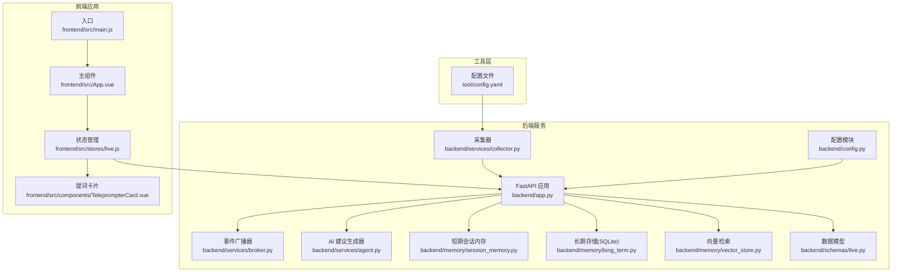
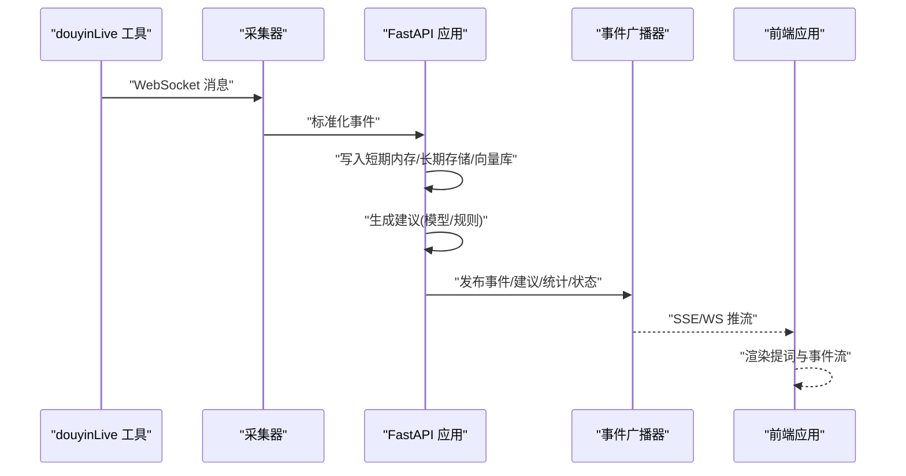
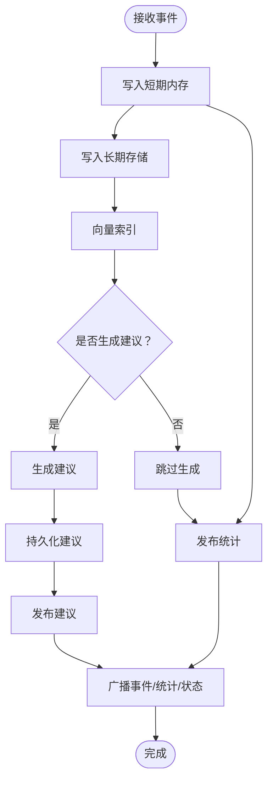
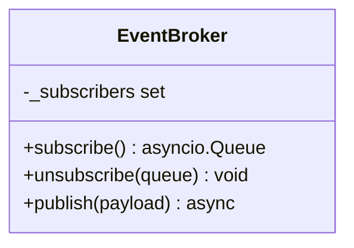
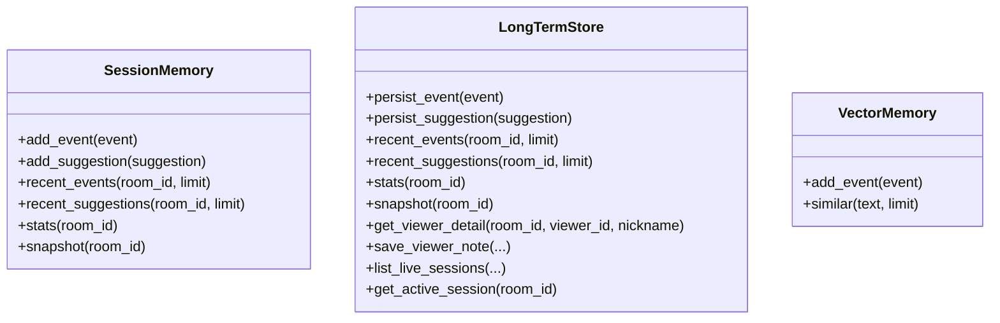
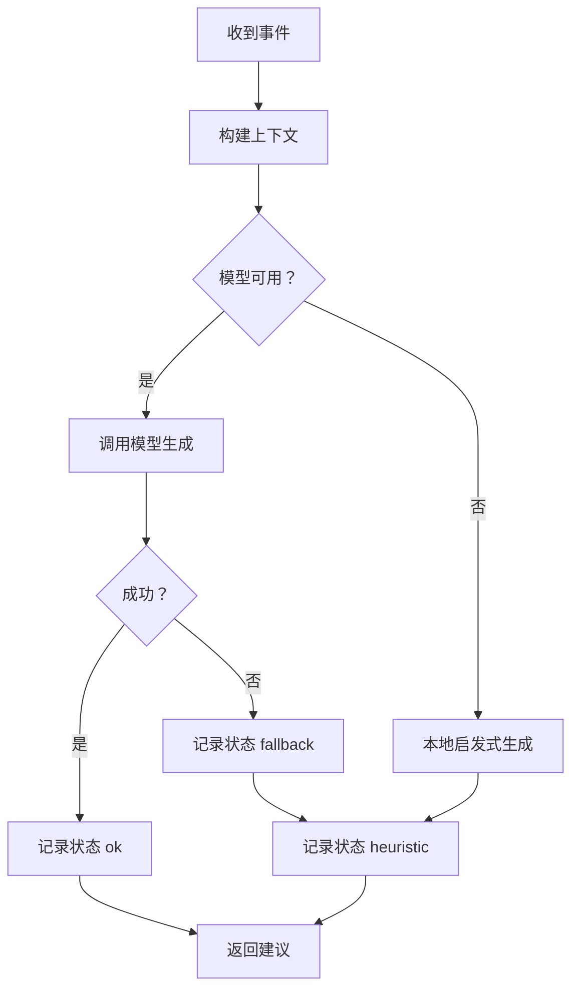
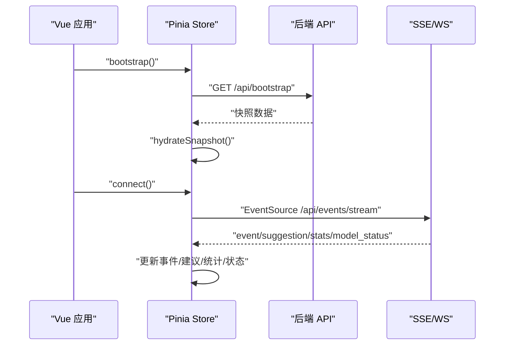
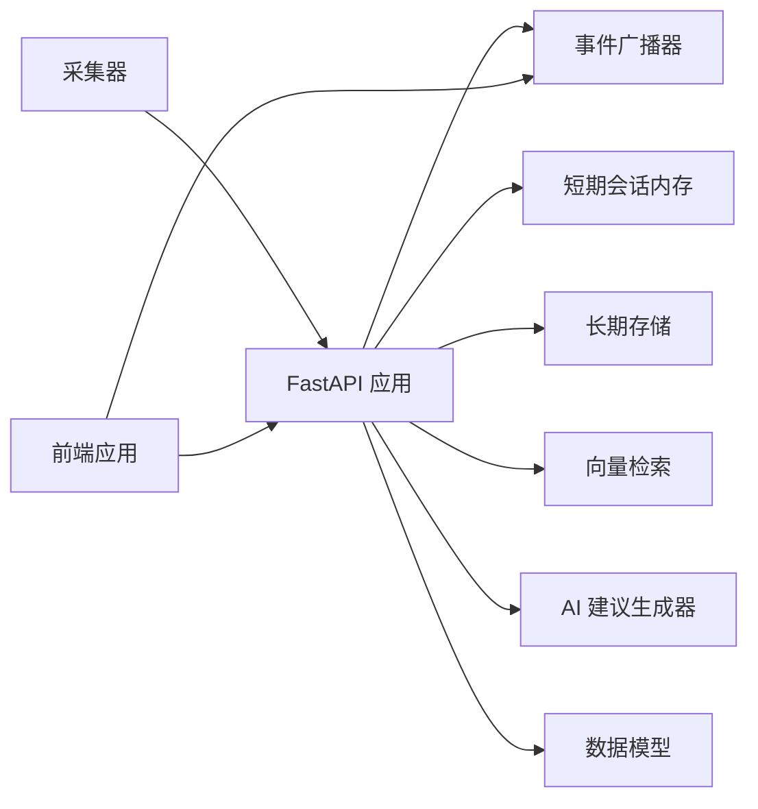

# 系统组件说明

<cite>
**本文档引用的文件**
- [backend/app.py](file://backend/app.py)
- [backend/config.py](file://backend/config.py)
- [backend/memory/session_memory.py](file://backend/memory/session_memory.py)
- [backend/memory/long_term.py](file://backend/memory/long_term.py)
- [backend/memory/vector_store.py](file://backend/memory/vector_store.py)
- [backend/services/agent.py](file://backend/services/agent.py)
- [backend/services/broker.py](file://backend/services/broker.py)
- [backend/services/collector.py](file://backend/services/collector.py)
- [backend/schemas/live.py](file://backend/schemas/live.py)
- [frontend/src/main.js](file://frontend/src/main.js)
- [frontend/src/App.vue](file://frontend/src/App.vue)
- [frontend/src/stores/live.js](file://frontend/src/stores/live.js)
- [frontend/src/components/TeleprompterCard.vue](file://frontend/src/components/TeleprompterCard.vue)
- [frontend/package.json](file://frontend/package.json)
- [tool/config.yaml](file://tool/config.yaml)
</cite>

## 目录
1. [简介](#简介)
2. [项目结构](#项目结构)
3. [核心组件](#核心组件)
4. [架构总览](#架构总览)
5. [详细组件分析](#详细组件分析)
6. [依赖关系分析](#依赖关系分析)
7. [性能考虑](#性能考虑)
8. [故障排除指南](#故障排除指南)
9. [结论](#结论)

## 简介
本项目是一个抖音直播实时提词器，旨在为直播主播提供即时的回复建议与事件流展示。系统采用前后端分离架构：后端基于 FastAPI 提供事件采集、存储、AI 建议生成与消息广播；前端基于 Vue 3 + Pinia 实现事件流订阅、状态管理和 UI 展示。同时包含一个独立的可执行工具用于连接抖音直播 WebSocket 并转发消息。

## 项目结构
项目分为三个主要部分：
- 后端服务：FastAPI 应用、事件处理、AI 建议生成、内存管理、消息广播、采集器
- 前端应用：Vue 3 + Pinia 状态管理、组件化 UI、SSE/WS 订阅
- 工具层：douyinLive 可执行文件（通过配置文件进行端口与 Cookie 设置）



**图表来源**
- [backend/app.py:1-220](file://backend/app.py#L1-L220)
- [backend/config.py:1-94](file://backend/config.py#L1-L94)
- [backend/services/collector.py:1-284](file://backend/services/collector.py#L1-L284)
- [backend/services/broker.py:1-40](file://backend/services/broker.py#L1-L40)
- [backend/services/agent.py:1-393](file://backend/services/agent.py#L1-L393)
- [backend/memory/session_memory.py:1-113](file://backend/memory/session_memory.py#L1-L113)
- [backend/memory/long_term.py:1-750](file://backend/memory/long_term.py#L1-L750)
- [backend/memory/vector_store.py:1-108](file://backend/memory/vector_store.py#L1-L108)
- [backend/schemas/live.py:1-95](file://backend/schemas/live.py#L1-L95)
- [frontend/src/main.js:1-17](file://frontend/src/main.js#L1-L17)
- [frontend/src/App.vue:1-66](file://frontend/src/App.vue#L1-L66)
- [frontend/src/stores/live.js:1-310](file://frontend/src/stores/live.js#L1-L310)
- [frontend/src/components/TeleprompterCard.vue:1-83](file://frontend/src/components/TeleprompterCard.vue#L1-L83)
- [tool/config.yaml:1-16](file://tool/config.yaml#L1-L16)

**章节来源**
- [backend/app.py:1-220](file://backend/app.py#L1-L220)
- [frontend/src/main.js:1-17](file://frontend/src/main.js#L1-L17)
- [frontend/src/App.vue:1-66](file://frontend/src/App.vue#L1-L66)
- [frontend/src/stores/live.js:1-310](file://frontend/src/stores/live.js#L1-L310)
- [frontend/src/components/TeleprompterCard.vue:1-83](file://frontend/src/components/TeleprompterCard.vue#L1-L83)
- [tool/config.yaml:1-16](file://tool/config.yaml#L1-L16)

## 核心组件
- 后端 FastAPI 应用：负责健康检查、房间切换、事件注入、SSE/WS 推流、Viewer 笔记与会话查询等
- 采集器：连接本地 douyinLive WebSocket，解析消息为统一事件模型并提交到后端事件循环
- 事件广播器：进程内队列广播，供 SSE/WS 分发
- 内存层：短期会话内存（Redis/进程内）、长期 SQLite 存储、向量检索（Chroma/本地哈希）
- AI 建议生成器：OpenAI 兼容接口或本地启发式规则，生成带优先级与理由的回复建议
- 前端 Vue 应用：通过 SSE 订阅事件与建议，Pinia 管理状态，组件化展示
- 工具层：douyinLive 可执行文件，配合配置文件提供 WebSocket 服务

**章节来源**
- [backend/app.py:104-220](file://backend/app.py#L104-L220)
- [backend/services/collector.py:38-284](file://backend/services/collector.py#L38-L284)
- [backend/services/broker.py:10-40](file://backend/services/broker.py#L10-L40)
- [backend/memory/session_memory.py:17-113](file://backend/memory/session_memory.py#L17-L113)
- [backend/memory/long_term.py:36-750](file://backend/memory/long_term.py#L36-L750)
- [backend/memory/vector_store.py:52-108](file://backend/memory/vector_store.py#L52-L108)
- [backend/services/agent.py:23-393](file://backend/services/agent.py#L23-L393)
- [frontend/src/main.js:1-17](file://frontend/src/main.js#L1-L17)
- [frontend/src/stores/live.js:70-310](file://frontend/src/stores/live.js#L70-L310)
- [tool/config.yaml:1-16](file://tool/config.yaml#L1-L16)

## 架构总览
系统采用“采集-处理-存储-建议-广播-前端展示”的流水线架构。采集器从本地 WebSocket 接收抖音直播事件，后端统一处理并持久化，同时生成建议并通过广播器推送给前端。前端通过 SSE/WS 实时接收事件与建议，渲染提词卡片与事件流。



**图表来源**
- [backend/services/collector.py:117-284](file://backend/services/collector.py#L117-L284)
- [backend/app.py:61-78](file://backend/app.py#L61-L78)
- [backend/services/broker.py:28-40](file://backend/services/broker.py#L28-L40)
- [frontend/src/stores/live.js:173-205](file://frontend/src/stores/live.js#L173-L205)

**章节来源**
- [backend/app.py:61-78](file://backend/app.py#L61-L78)
- [backend/services/collector.py:117-284](file://backend/services/collector.py#L117-L284)
- [backend/services/broker.py:28-40](file://backend/services/broker.py#L28-L40)
- [frontend/src/stores/live.js:173-205](file://frontend/src/stores/live.js#L173-L205)

## 详细组件分析

### 后端 FastAPI 应用
- 职责
  - 生命周期管理：启动采集器、关闭活动会话、停止采集器
  - API 端点：健康检查、房间切换、事件注入、Viewer 查询与笔记管理、会话查询、SSE/WS 推流
  - 事件处理：写入短期内存、长期存储、向量库，触发建议生成，广播状态
- 关键流程
  - 房间切换：关闭旧会话、切换房间、返回快照
  - 事件注入：写入短期与长期存储，向量索引，生成建议并广播
  - 推流：SSE 返回事件/建议/统计/模型状态；WS 发送引导快照
- 错误处理
  - 参数校验与异常响应
  - SSE/WS 断开清理订阅队列



**图表来源**
- [backend/app.py:61-78](file://backend/app.py#L61-L78)
- [backend/memory/session_memory.py:42-64](file://backend/memory/session_memory.py#L42-L64)
- [backend/memory/long_term.py:420-454](file://backend/memory/long_term.py#L420-L454)
- [backend/memory/vector_store.py:64-83](file://backend/memory/vector_store.py#L64-L83)
- [backend/services/agent.py:73-94](file://backend/services/agent.py#L73-L94)

**章节来源**
- [backend/app.py:84-92](file://backend/app.py#L84-L92)
- [backend/app.py:104-220](file://backend/app.py#L104-L220)

### 采集器（DouyinCollector）
- 职责
  - 连接本地 WebSocket，解析消息为 LiveEvent
  - 将事件提交到后端事件循环，保持心跳与重连
- 关键特性
  - 线程安全：通过 asyncio.run_coroutine_threadsafe 提交事件
  - 自动重连：断线后按配置延迟重试
  - 映射方法到事件类型：聊天、礼物、点赞、成员、关注
- 数据转换
  - 礼物事件提取数量与钻石数
  - 生成统一事件模型（含元数据与原始数据）

```mermaid
sequenceDiagram
participant WS as "WebSocket"
participant DC as "DouyinCollector"
participant Loop as "后端事件循环"
participant Handler as "事件处理器"
WS->>DC : "消息"
DC->>DC : "解析/映射/标准化"
DC->>Loop : "run_coroutine_threadsafe(事件)"
Loop->>Handler : "调度处理"
Handler-->>Loop : "完成"
```

**图表来源**
- [backend/services/collector.py:145-284](file://backend/services/collector.py#L145-L284)
- [backend/services/collector.py:200-214](file://backend/services/collector.py#L200-L214)

**章节来源**
- [backend/services/collector.py:38-284](file://backend/services/collector.py#L38-L284)

### 事件广播器（EventBroker）
- 职责
  - 维护订阅队列集合
  - 广播消息给所有订阅者，清理阻塞队列
- 使用场景
  - SSE/WS 订阅端通过 subscribe 获取队列
  - 后端处理完成后 publish 广播



**图表来源**
- [backend/services/broker.py:10-40](file://backend/services/broker.py#L10-L40)

**章节来源**
- [backend/services/broker.py:10-40](file://backend/services/broker.py#L10-L40)

### 内存管理组件
- 短期会话内存（SessionMemory）
  - 优先使用 Redis 列表保存最近事件与建议，支持 TTL
  - 未安装 Redis 时退化为进程内双端队列
  - 提供最近事件/建议读取与统计计算
- 长期存储（LongTermStore）
  - SQLite 表结构：events、suggestions、viewer_profiles、viewer_gifts、live_sessions、viewer_notes
  - 自动迁移与索引优化，支持活跃会话维护与聚合统计
  - 提供 Viewer 画像、礼物历史、会话历史、笔记管理等查询
- 向量检索（VectorMemory）
  - 若存在 Chroma，则使用持久化集合；否则使用本地哈希嵌入与简单相似度



**图表来源**
- [backend/memory/session_memory.py:17-113](file://backend/memory/session_memory.py#L17-L113)
- [backend/memory/long_term.py:36-750](file://backend/memory/long_term.py#L36-L750)
- [backend/memory/vector_store.py:52-108](file://backend/memory/vector_store.py#L52-L108)

**章节来源**
- [backend/memory/session_memory.py:17-113](file://backend/memory/session_memory.py#L17-L113)
- [backend/memory/long_term.py:36-750](file://backend/memory/long_term.py#L36-L750)
- [backend/memory/vector_store.py:52-108](file://backend/memory/vector_store.py#L52-L108)

### AI 建议生成器（LivePromptAgent）
- 职责
  - 构造上下文：最近事件、相似历史、用户画像
  - 优先调用 OpenAI 兼容接口；失败时回退本地启发式规则
  - 输出标准化建议（含优先级、语气、理由、置信度）
- 状态管理
  - 记录当前模式、模型、后端、最后结果与错误、更新时间



**图表来源**
- [backend/services/agent.py:73-114](file://backend/services/agent.py#L73-L114)
- [backend/services/agent.py:183-330](file://backend/services/agent.py#L183-L330)

**章节来源**
- [backend/services/agent.py:23-393](file://backend/services/agent.py#L23-L393)

### 前端 Vue 应用
- 入口与状态
  - main.js 创建应用并注册 Pinia
  - App.vue 在挂载时执行引导与连接
- 状态管理（Pinia Store）
  - 管理房间号、主题、连接状态、事件过滤、统计数据、事件与建议列表
  - 通过 SSE 订阅事件、建议、统计与模型状态
  - 支持房间切换、主题切换、事件类型筛选
- UI 组件
  - TeleprompterCard：展示当前最优建议及其来源事件与生成来源标签
  - EventFeed、StatusStrip 等（在本节不展开具体实现）



**图表来源**
- [frontend/src/main.js:12-17](file://frontend/src/main.js#L12-L17)
- [frontend/src/App.vue:29-32](file://frontend/src/App.vue#L29-L32)
- [frontend/src/stores/live.js:158-205](file://frontend/src/stores/live.js#L158-L205)

**章节来源**
- [frontend/src/main.js:1-17](file://frontend/src/main.js#L1-L17)
- [frontend/src/App.vue:1-66](file://frontend/src/App.vue#L1-L66)
- [frontend/src/stores/live.js:70-310](file://frontend/src/stores/live.js#L70-L310)
- [frontend/src/components/TeleprompterCard.vue:1-83](file://frontend/src/components/TeleprompterCard.vue#L1-L83)

### 工具层（douyinLive 可执行文件）
- 配置文件
  - 端口设置、未知消息开关、Cookie 配置（可选）
- 作用
  - 作为本地 WebSocket 服务，供采集器连接并转发抖音直播消息

**章节来源**
- [tool/config.yaml:1-16](file://tool/config.yaml#L1-L16)

## 依赖关系分析
- 后端模块耦合
  - app.py 依赖配置、内存层、广播器、AI 代理、采集器与数据模型
  - 采集器依赖配置与事件模型，通过回调将事件提交到后端
  - 广播器与内存层解耦，仅通过事件模型交互
- 前后端通信
  - 前端通过 SSE/WS 订阅后端推送的消息
  - 前端通过 REST API 完成房间切换与引导
- 外部依赖
  - Redis（可选）、Chroma（可选）、websocket-client、urllib（网络请求）



**图表来源**
- [backend/app.py:13-30](file://backend/app.py#L13-L30)
- [backend/services/collector.py:38-53](file://backend/services/collector.py#L38-L53)
- [backend/services/broker.py:10-21](file://backend/services/broker.py#L10-L21)
- [frontend/src/stores/live.js:173-205](file://frontend/src/stores/live.js#L173-L205)

**章节来源**
- [backend/app.py:13-30](file://backend/app.py#L13-L30)
- [backend/services/collector.py:38-53](file://backend/services/collector.py#L38-L53)
- [backend/services/broker.py:10-21](file://backend/services/broker.py#L10-L21)
- [frontend/src/stores/live.js:173-205](file://frontend/src/stores/live.js#L173-L205)

## 性能考虑
- 内存层
  - Redis 模式下短期事件与建议使用列表并设置 TTL，避免内存无限增长
  - 未安装 Redis 时使用进程内队列，容量有限但保证可用性
- 存储层
  - SQLite 表建立多索引，支持高频查询；增量重建聚合以减少重复扫描
- 向量检索
  - Chroma 持久化集合提供高效相似检索；本地哈希嵌入作为降级方案
- 网络与并发
  - 采集器使用线程与心跳维持连接，断线重连；事件通过线程安全方式提交到事件循环
  - 前端 SSE/WS 采用事件源与长连接，降低轮询开销
- 可扩展性
  - 模块化设计便于替换存储与检索实现
  - 配置驱动的 LLM 模式与回退策略提升鲁棒性

[本节为通用指导，无需特定文件来源]

## 故障排除指南
- 采集器无法连接
  - 检查工具层配置文件端口与 Cookie 设置
  - 查看采集器日志与重连间隔配置
- SSE/WS 连接异常
  - 前端检查连接状态与错误回调
  - 后端确认广播器订阅队列未被清理
- 房间切换失败
  - 校验房间号参数与后端返回错误
  - 确认采集器已停止并重新连接新房间
- 建议生成失败
  - 检查模型配置与 API 密钥
  - 查看模型状态与错误码，确认是否回退到启发式规则

**章节来源**
- [backend/services/collector.py:99-116](file://backend/services/collector.py#L99-L116)
- [frontend/src/stores/live.js:207-250](file://frontend/src/stores/live.js#L207-L250)
- [backend/services/agent.py:96-114](file://backend/services/agent.py#L96-L114)

## 结论
本系统通过清晰的模块划分与事件驱动架构，实现了从抖音直播 WebSocket 到前端实时展示的完整链路。后端以 FastAPI 为核心，结合短期/长期内存与向量检索，辅以可回退的 AI 建议生成，确保在不同环境下均能稳定运行。前端通过 SSE/WS 实时订阅，提供直观的提词与事件流展示。整体设计具备良好的可扩展性与可维护性，便于后续迭代与功能增强。