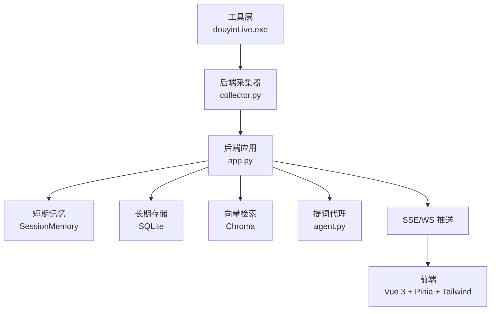
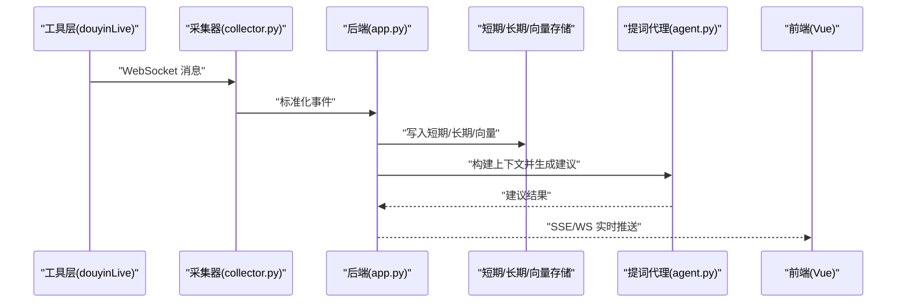
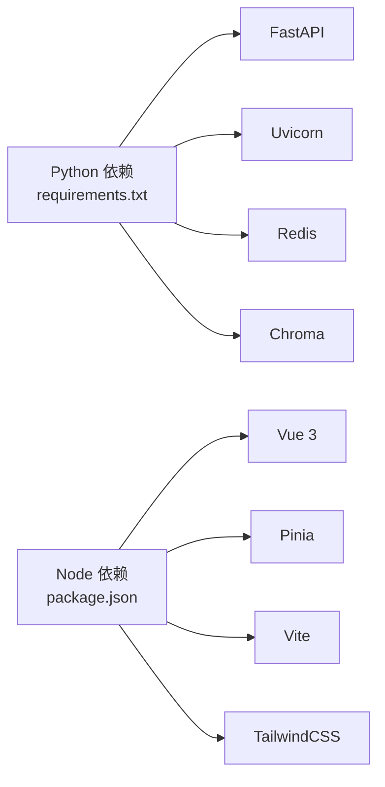

# 运行环境要求

<cite>
**本文引用的文件**
- [requirements.txt](file://requirements.txt)
- [backend/config.py](file://backend/config.py)
- [backend/app.py](file://backend/app.py)
- [backend/services/collector.py](file://backend/services/collector.py)
- [backend/services/agent.py](file://backend/services/agent.py)
- [frontend/package.json](file://frontend/package.json)
- [README.md](file://README.md)
- [USAGE.md](file://USAGE.md)
- [start_all.ps1](file://start_all.ps1)
- [start_backend_qwen.ps1](file://start_backend_qwen.ps1)
- [start_frontend.ps1](file://start_frontend.ps1)
</cite>

## 目录
1. [简介](#简介)
2. [项目结构](#项目结构)
3. [核心组件](#核心组件)
4. [架构总览](#架构总览)
5. [详细组件分析](#详细组件分析)
6. [依赖关系分析](#依赖关系分析)
7. [性能考虑](#性能考虑)
8. [故障排查指南](#故障排查指南)
9. [结论](#结论)
10. [附录](#附录)

## 简介
本文件面向抖音直播实时提词器项目的运行环境准备，提供从硬件到软件、从系统到依赖的完整清单与最佳实践。项目采用 Windows 环境，后端使用 Python 3.10+，前端使用 Node.js 18+，并支持可选组件（Redis 缓存、Chroma 向量数据库）。文档同时覆盖依赖安装、配置要点、常见问题与排障方法，帮助开发者快速搭建并稳定运行。

## 项目结构
项目由三部分组成：
- 工具层：本地 Windows 可执行程序负责连接抖音直播并提供 WebSocket 消息源
- 后端：FastAPI + Uvicorn 提供 REST/SSE/WebSocket 接口，处理事件采集、短期记忆、长期存储、向量检索与提词建议
- 前端：Vue 3 + Pinia + Tailwind，提供实时事件流、提词展示与状态面板

图表来源
- [backend/app.py:1-220](file://backend/app.py#L1-L220)
- [backend/services/collector.py:1-284](file://backend/services/collector.py#L1-L284)
- [backend/services/agent.py:1-393](file://backend/services/agent.py#L1-L393)
- [frontend/package.json:1-23](file://frontend/package.json#L1-L23)

章节来源
- [README.md:21-33](file://README.md#L21-L33)
- [USAGE.md:15-23](file://USAGE.md#L15-L23)

## 核心组件
- 后端配置与环境变量：通过读取 .env 与环境变量初始化运行参数，支持 Redis、Chroma、LLM 等可选组件
- 采集器：连接本地 WebSocket，标准化为统一事件结构并交由后端处理
- 提词代理：优先调用在线模型，失败时回退到本地启发式规则
- 前端：实时展示事件流、提词卡片、模型状态与主题切换

章节来源
- [backend/config.py:11-94](file://backend/config.py#L11-L94)
- [backend/services/collector.py:38-284](file://backend/services/collector.py#L38-L284)
- [backend/services/agent.py:23-393](file://backend/services/agent.py#L23-L393)
- [frontend/package.json:11-21](file://frontend/package.json#L11-L21)

## 架构总览
系统运行链路：工具层提供 WebSocket 消息源，后端采集器将其标准化并写入短期/长期存储，结合向量检索生成提词建议，通过 SSE/WS 推送至前端展示。

图表来源
- [backend/app.py:61-78](file://backend/app.py#L61-L78)
- [backend/services/collector.py:145-159](file://backend/services/collector.py#L145-L159)
- [backend/services/agent.py:73-114](file://backend/services/agent.py#L73-L114)

## 详细组件分析

### 后端配置与可选组件
- 环境变量优先级：.env 文件优先于系统环境变量；未设置时采用默认值
- 可选组件：
  - Redis：用于短期记忆（SessionMemory），未配置时退化为进程内内存
  - Chroma：用于向量检索（VectorMemory），不可用时退化为轻量文本相似策略
- LLM 模式：支持 heuristic、qwen、openai 三种模式，自动解析模型地址与模型名

章节来源
- [backend/config.py:11-94](file://backend/config.py#L11-L94)
- [backend/app.py:25-29](file://backend/app.py#L25-L29)

### 采集器与事件处理
- 采集器负责连接本地 WebSocket，解析消息并标准化为统一事件结构
- 事件进入后端事件循环，写入短期记忆、长期存储与向量库，并触发提词代理生成建议
- 支持房间切换与断线重连

章节来源
- [backend/services/collector.py:38-284](file://backend/services/collector.py#L38-L284)
- [backend/app.py:61-78](file://backend/app.py#L61-L78)

### 提词代理与回退策略
- 优先调用在线 OpenAI 兼容接口生成建议
- 失败时自动回退到本地启发式规则，保证系统可用性
- 状态上报：模型模式、模型名、后端地址、最后结果、错误信息、更新时间

章节来源
- [backend/services/agent.py:23-393](file://backend/services/agent.py#L23-L393)

### 前端依赖与启动
- 前端使用 Vue 3、Pinia、Tailwind，开发服务器默认监听 127.0.0.1:5173
- 依赖安装与启动脚本位于 frontend 目录，支持自动检测 Node.js 并安装依赖

章节来源
- [frontend/package.json:11-21](file://frontend/package.json#L11-L21)
- [start_frontend.ps1:7-22](file://start_frontend.ps1#L7-L22)

## 依赖关系分析
- Python 依赖：websocket-client、fastapi、uvicorn、redis、chromadb
- Node.js 依赖：Vue 3、Pinia、Vite、TailwindCSS 等
- 可选组件：Redis、Chroma

图表来源
- [requirements.txt:1-6](file://requirements.txt#L1-L6)
- [frontend/package.json:11-21](file://frontend/package.json#L11-L21)

章节来源
- [requirements.txt:1-6](file://requirements.txt#L1-L6)
- [frontend/package.json:11-21](file://frontend/package.json#L11-L21)

## 性能考虑
- 短期记忆：Redis 可显著提升高并发下的会话查询与统计性能；未配置时退化为内存，适合小规模测试
- 向量检索：Chroma 提供高效的相似事件检索；不可用时采用轻量策略，避免阻塞主流程
- SSE/WS：后端使用事件队列与订阅机制，前端按房间过滤，降低无效推送
- LLM 调用：设置合理超时与回退策略，避免阻塞主线程

[本节为通用指导，无需具体文件分析]

## 故障排查指南
- 页面无建议
  - 检查工具层是否已启动、.env 中 ROOM_ID 是否正确、直播间是否开播、后端是否已重启
- 顶部显示 fallback
  - 检查 LLM API Key 是否正确、网络是否可达、是否存在超时或限流
- 顶部显示 heuristic
  - 检查 .env 中 LLM_MODE 设置或 .env 加载是否生效
- 前端无法打开
  - 检查 start_frontend.ps1 是否正常、5173 端口是否被占用
- 后端启动但无数据写入
  - 检查工具层是否运行、后端日志是否连接到本地 WebSocket、当前房间是否有消息

章节来源
- [USAGE.md:198-240](file://USAGE.md#L198-L240)

## 结论
本项目在 Windows 环境下，通过 Python 3.10+ 与 Node.js 18+ 即可运行。可选组件（Redis、Chroma）可按需增强短期记忆与向量检索能力。遵循本文档的环境准备、依赖安装与配置步骤，可快速搭建并稳定运行抖音直播实时提词器。

[本节为总结，无需具体文件分析]

## 附录

### 硬件与操作系统要求
- 操作系统：Windows（工具层为 Windows 可执行文件）
- Python：3.10+（推荐 3.11+）
- Node.js：18+（前端开发与构建）

章节来源
- [README.md:50-56](file://README.md#L50-L56)
- [USAGE.md:17-21](file://USAGE.md#L17-L21)

### 依赖安装与配置

- Python 依赖安装
  - 在项目根目录执行安装命令，安装 requirements.txt 中列出的依赖
  - 依赖包括：websocket-client、fastapi、uvicorn、redis、chromadb

章节来源
- [requirements.txt:1-6](file://requirements.txt#L1-6)
- [USAGE.md:75-79](file://USAGE.md#L75-L79)

- 前端依赖安装
  - 进入 frontend 目录，执行 npm install 安装依赖
  - 开发服务器默认监听 127.0.0.1:5173

章节来源
- [USAGE.md:81-87](file://USAGE.md#L81-L87)
- [start_frontend.ps1:15-22](file://start_frontend.ps1#L15-L22)
- [frontend/package.json:11-21](file://frontend/package.json#L11-L21)

- 环境变量与配置
  - 复制 .env.example 为 .env，至少填写 ROOM_ID、LLM_MODE、API Key 等
  - 后端会优先读取 .env，其次读取系统环境变量
  - 可选配置：REDIS_URL、CHROMA_DIR、LLM 相关参数等

章节来源
- [README.md:84-94](file://README.md#L84-L94)
- [USAGE.md:24-48](file://USAGE.md#L24-L48)
- [backend/config.py:11-94](file://backend/config.py#L11-L94)

- 可选组件作用与安装方式
  - Redis：用于短期记忆（SessionMemory），未配置时退化为进程内内存
  - Chroma：用于向量检索（VectorMemory），不可用时退化为轻量策略
  - 两者均为可选，不安装也可运行基本流程

章节来源
- [README.md:50-56](file://README.md#L50-L56)
- [USAGE.md:195-201](file://USAGE.md#L195-L201)
- [backend/app.py:25-29](file://backend/app.py#L25-L29)

- 启动脚本与顺序
  - start_all.ps1：同时启动后端与前端
  - start_backend_qwen.ps1：启动后端（内置采集器）
  - start_frontend.ps1：启动前端开发服务器

章节来源
- [start_all.ps1:11-17](file://start_all.ps1#L11-L17)
- [start_backend_qwen.ps1:11-12](file://start_backend_qwen.ps1#L11-L12)
- [start_frontend.ps1:20-22](file://start_frontend.ps1#L20-L22)