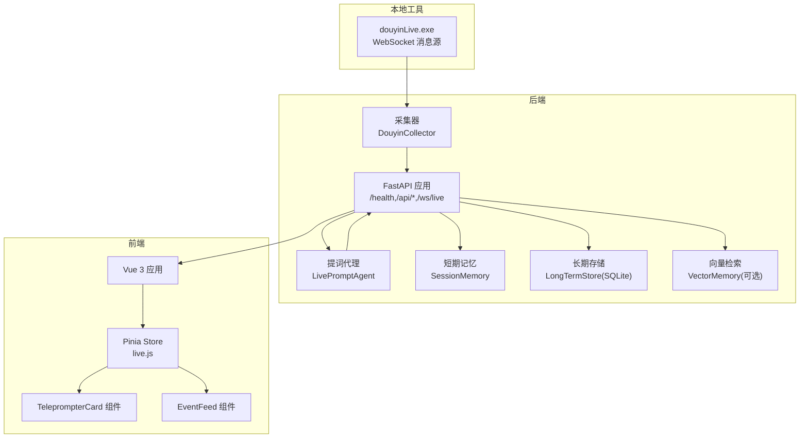
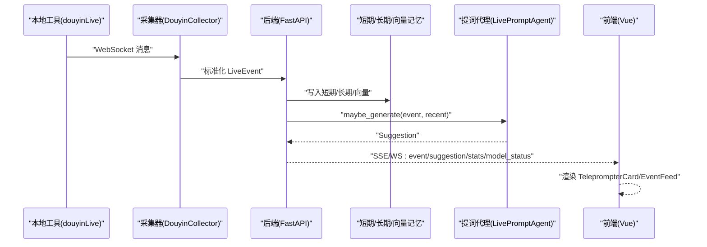
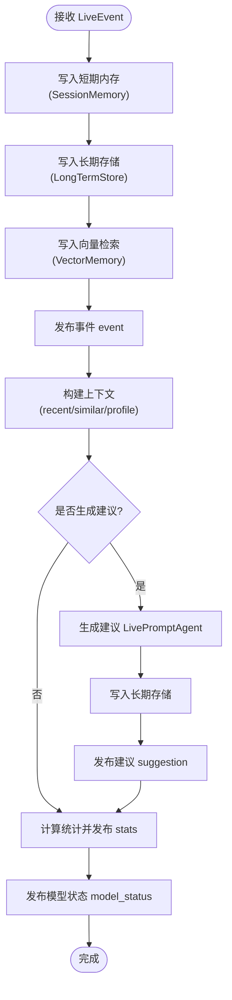
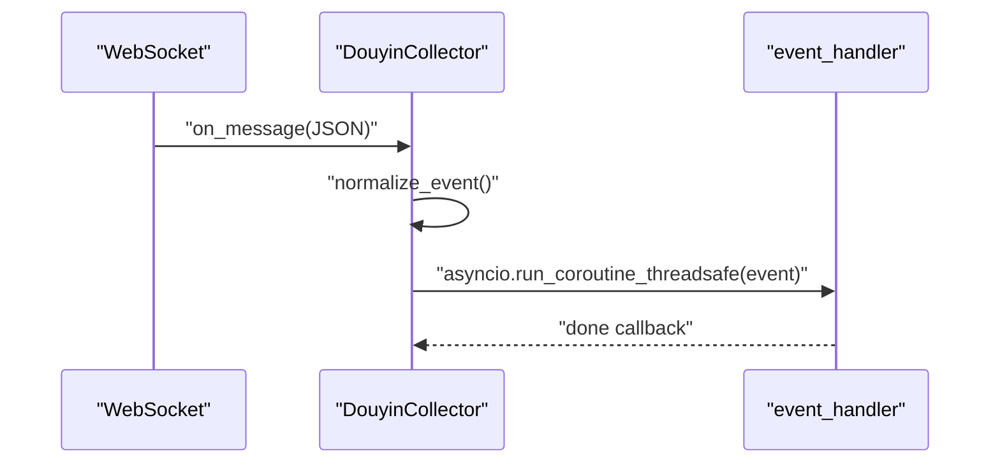
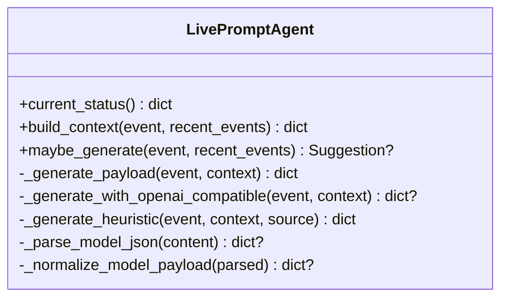
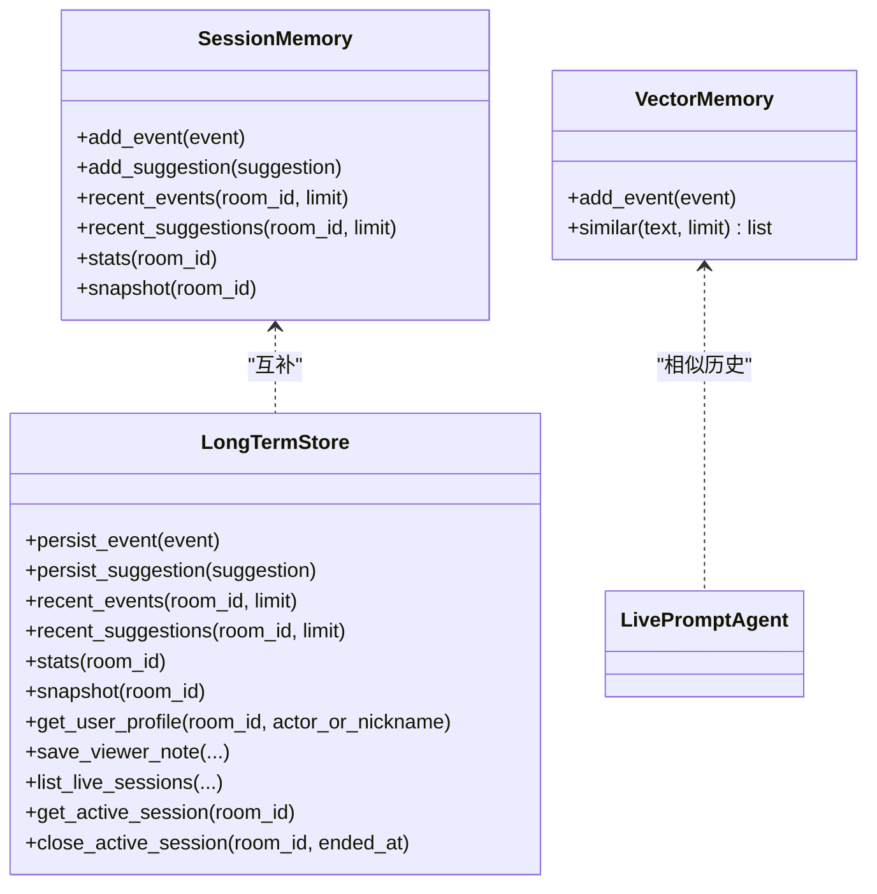
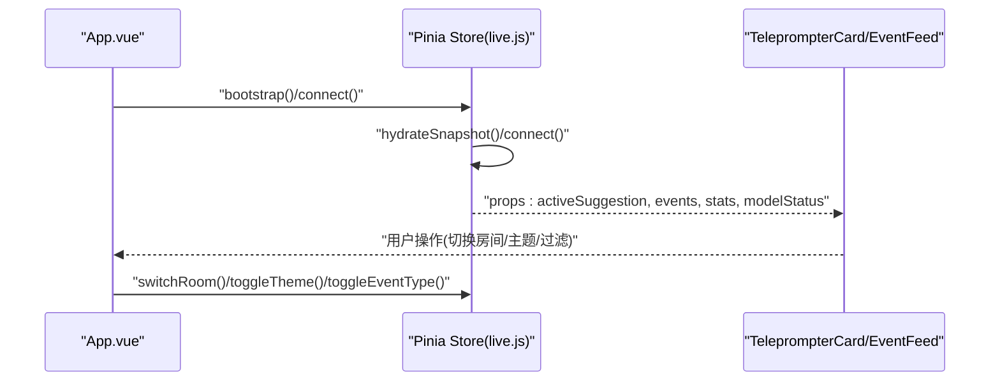
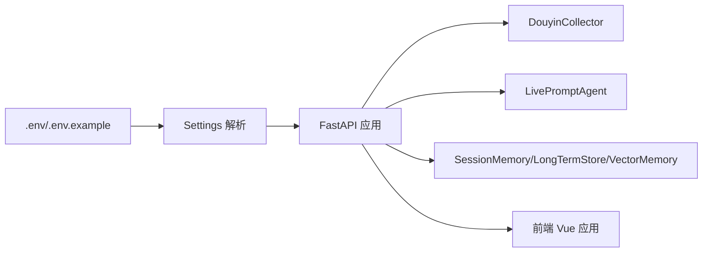

# 项目介绍

<cite>
**本文引用的文件**
- [README.md](file://README.md)
- [USAGE.md](file://USAGE.md)
- [backend/app.py](file://backend/app.py)
- [backend/config.py](file://backend/config.py)
- [backend/services/collector.py](file://backend/services/collector.py)
- [backend/services/agent.py](file://backend/services/agent.py)
- [backend/memory/session_memory.py](file://backend/memory/session_memory.py)
- [backend/memory/long_term.py](file://backend/memory/long_term.py)
- [backend/memory/vector_store.py](file://backend/memory/vector_store.py)
- [frontend/src/App.vue](file://frontend/src/App.vue)
- [frontend/src/stores/live.js](file://frontend/src/stores/live.js)
- [frontend/src/components/TeleprompterCard.vue](file://frontend/src/components/TeleprompterCard.vue)
- [frontend/src/components/EventFeed.vue](file://frontend/src/components/EventFeed.vue)
- [frontend/package.json](file://frontend/package.json)
</cite>

## 目录
1. [简介](#简介)
2. [项目结构](#项目结构)
3. [核心组件](#核心组件)
4. [架构总览](#架构总览)
5. [详细组件分析](#详细组件分析)
6. [依赖关系分析](#依赖关系分析)
7. [性能考量](#性能考量)
8. [故障排查指南](#故障排查指南)
9. [结论](#结论)
10. [附录](#附录)

## 简介
本项目是面向抖音直播场景的实时提词器，旨在帮助主播在直播过程中获得即时、可口播的回复建议，提升互动效率与直播效果。系统由三部分组成：
- 本地工具：负责连接抖音直播间并通过 WebSocket 暴露消息源（douyinLive）
- 后端服务：事件采集、短期/长期记忆、向量检索、建议生成与前端推送（FastAPI）
- 前端界面：Vue 3 + Pinia + Tailwind，提供实时提词展示、事件流与状态面板

项目核心价值在于：
- 实时性：从本地 WebSocket 持续接收直播事件，毫秒级生成建议并推送
- 双模式 AI 支持：既可调用在线模型，也可回退到本地启发式规则
- 多层记忆架构：短期会话内存、SQLite 长期存储、可选向量检索
- 开放的事件流：SSE/WS 实时推送事件、建议、统计与模型状态
- 易用性：一键启动脚本、可配置的房间切换、主题切换与事件筛选

## 项目结构
项目采用前后端分离与模块化设计，后端以 FastAPI 为核心，前端以 Vue 3 为核心，配合 Pinia 状态管理与 Tailwind 样式框架。

图表来源
- [backend/app.py:94-220](file://backend/app.py#L94-L220)
- [backend/services/collector.py:38-284](file://backend/services/collector.py#L38-L284)
- [backend/services/agent.py:23-393](file://backend/services/agent.py#L23-L393)
- [backend/memory/session_memory.py:17-113](file://backend/memory/session_memory.py#L17-L113)
- [backend/memory/long_term.py:36-750](file://backend/memory/long_term.py#L36-L750)
- [backend/memory/vector_store.py:52-108](file://backend/memory/vector_store.py#L52-L108)
- [frontend/src/App.vue:1-66](file://frontend/src/App.vue#L1-L66)
- [frontend/src/stores/live.js:70-310](file://frontend/src/stores/live.js#L70-L310)
- [frontend/src/components/TeleprompterCard.vue:1-83](file://frontend/src/components/TeleprompterCard.vue#L1-L83)
- [frontend/src/components/EventFeed.vue:1-183](file://frontend/src/components/EventFeed.vue#L1-L183)

章节来源
- [README.md:21-34](file://README.md#L21-L34)
- [backend/app.py:94-220](file://backend/app.py#L94-L220)
- [frontend/src/App.vue:1-66](file://frontend/src/App.vue#L1-L66)

## 核心组件
- 采集器（DouyinCollector）：连接本地 WebSocket，标准化为统一 LiveEvent，提交至后端事件循环
- 提词代理（LivePromptAgent）：根据事件类型与上下文生成建议，支持在线模型与本地规则双模式
- 记忆层（SessionMemory/LongTermStore/VectorMemory）：短期会话内存、SQLite 长期存储、可选向量检索
- 后端应用（FastAPI）：健康检查、房间切换、事件注入、SSE/WS 实时流
- 前端（Vue 3 + Pinia）：主提词卡片、事件流、过滤器、房间切换、主题切换

章节来源
- [backend/services/collector.py:38-284](file://backend/services/collector.py#L38-L284)
- [backend/services/agent.py:23-393](file://backend/services/agent.py#L23-L393)
- [backend/memory/session_memory.py:17-113](file://backend/memory/session_memory.py#L17-L113)
- [backend/memory/long_term.py:36-750](file://backend/memory/long_term.py#L36-L750)
- [backend/memory/vector_store.py:52-108](file://backend/memory/vector_store.py#L52-L108)
- [backend/app.py:104-220](file://backend/app.py#L104-L220)
- [frontend/src/stores/live.js:70-310](file://frontend/src/stores/live.js#L70-L310)

## 架构总览
系统从本地工具获取直播事件，经后端标准化后写入短期/长期记忆，并生成建议。建议与事件通过 SSE/WS 推送到前端，实时展示。

图表来源
- [backend/services/collector.py:145-160](file://backend/services/collector.py#L145-L160)
- [backend/app.py:61-78](file://backend/app.py#L61-L78)
- [backend/services/agent.py:73-94](file://backend/services/agent.py#L73-L94)
- [frontend/src/stores/live.js:173-205](file://frontend/src/stores/live.js#L173-L205)

## 详细组件分析

### 后端应用与事件处理流
- 生命周期：应用启动时启动采集器，关闭时清理会话与连接
- 处理流程：事件写入短期内存与长期存储，触发建议生成，发布事件/建议/统计/模型状态
- 接口：健康检查、房间切换、事件注入、SSE/WS 实时流

图表来源
- [backend/app.py:61-78](file://backend/app.py#L61-L78)
- [backend/services/agent.py:73-94](file://backend/services/agent.py#L73-L94)
- [backend/memory/session_memory.py:42-84](file://backend/memory/session_memory.py#L42-L84)
- [backend/memory/long_term.py:420-454](file://backend/memory/long_term.py#L420-L454)
- [backend/memory/vector_store.py:64-83](file://backend/memory/vector_store.py#L64-L83)

章节来源
- [backend/app.py:84-92](file://backend/app.py#L84-L92)
- [backend/app.py:104-220](file://backend/app.py#L104-L220)

### 采集器（DouyinCollector）
- 连接本地 WebSocket，解析消息为 LiveEvent
- 标准化事件类型（评论/礼物/关注/进场/点赞/系统）
- 通过线程与事件循环安全提交事件
- 支持房间切换与断线重连

图表来源
- [backend/services/collector.py:145-160](file://backend/services/collector.py#L145-L160)
- [backend/services/collector.py:225-284](file://backend/services/collector.py#L225-L284)

章节来源
- [backend/services/collector.py:38-284](file://backend/services/collector.py#L38-L284)

### 提词代理（LivePromptAgent）
- 双模式：在线 OpenAI 兼容接口优先，失败回退本地启发式规则
- 上下文：最近事件、相似历史、用户画像
- 输出：建议文本、语气、优先级、置信度、来源与理由
- 状态：记录模式、模型、后端、最后结果与错误

图表来源
- [backend/services/agent.py:23-393](file://backend/services/agent.py#L23-L393)

章节来源
- [backend/services/agent.py:23-393](file://backend/services/agent.py#L23-L393)

### 记忆层（SessionMemory/LongTermStore/VectorMemory）
- SessionMemory：Redis 或进程内队列，保存最近事件与建议，支持 TTL
- LongTermStore：SQLite，持久化事件、建议、用户画像、礼物历史、直播会话、备注
- VectorMemory：可选 Chroma 向量库或轻量哈希嵌入，检索相似历史

图表来源
- [backend/memory/session_memory.py:17-113](file://backend/memory/session_memory.py#L17-L113)
- [backend/memory/long_term.py:36-750](file://backend/memory/long_term.py#L36-L750)
- [backend/memory/vector_store.py:52-108](file://backend/memory/vector_store.py#L52-L108)
- [backend/services/agent.py:56-71](file://backend/services/agent.py#L56-L71)

章节来源
- [backend/memory/session_memory.py:17-113](file://backend/memory/session_memory.py#L17-L113)
- [backend/memory/long_term.py:36-750](file://backend/memory/long_term.py#L36-L750)
- [backend/memory/vector_store.py:52-108](file://backend/memory/vector_store.py#L52-L108)

### 前端（Vue 3 + Pinia）
- App.vue：状态条、主提词卡片、事件流
- live.js：状态管理（房间号、主题、事件过滤、模型状态、统计数据、SSE 连接）
- TeleprompterCard.vue：展示建议来源、优先级、语气、建议文本与理由
- EventFeed.vue：事件筛选、清空、展示最近事件

图表来源
- [frontend/src/App.vue:1-66](file://frontend/src/App.vue#L1-L66)
- [frontend/src/stores/live.js:158-250](file://frontend/src/stores/live.js#L158-L250)
- [frontend/src/components/TeleprompterCard.vue:1-83](file://frontend/src/components/TeleprompterCard.vue#L1-L83)
- [frontend/src/components/EventFeed.vue:1-183](file://frontend/src/components/EventFeed.vue#L1-L183)

章节来源
- [frontend/src/App.vue:1-66](file://frontend/src/App.vue#L1-L66)
- [frontend/src/stores/live.js:70-310](file://frontend/src/stores/live.js#L70-L310)
- [frontend/src/components/TeleprompterCard.vue:1-83](file://frontend/src/components/TeleprompterCard.vue#L1-L83)
- [frontend/src/components/EventFeed.vue:1-183](file://frontend/src/components/EventFeed.vue#L1-L183)

## 依赖关系分析
- 后端依赖：FastAPI、websocket-client、redis、chromadb、sqlite3
- 前端依赖：Vue 3、Pinia、Tailwind、Vite
- 配置：.env 读取与运行时解析，支持房间切换、模型模式、存储路径、Redis/Chroma 可选

图表来源
- [backend/config.py:39-94](file://backend/config.py#L39-L94)
- [backend/app.py:22-29](file://backend/app.py#L22-L29)
- [frontend/package.json:11-22](file://frontend/package.json#L11-L22)

章节来源
- [backend/config.py:11-94](file://backend/config.py#L11-L94)
- [frontend/package.json:1-23](file://frontend/package.json#L1-L23)

## 性能考量
- 事件吞吐：采集器与事件处理在独立线程中进行，避免阻塞后端事件循环
- 内存与存储：短期内存支持 Redis 或进程内队列，降低延迟；长期存储使用 SQLite，兼顾可靠性
- 向量检索：可选 Chroma，若不可用则使用轻量哈希嵌入，保证检索能力
- 建议生成：在线模型失败时快速回退本地规则，确保稳定性
- 前端渲染：Pinia 状态管理与组件化设计，减少不必要的重渲染

## 故障排查指南
- 页面无建议：检查本地工具是否运行、房间号是否正确、直播间是否开播
- 顶部显示 fallback：检查在线模型 API Key、网络连通性、超时或限流
- 顶部显示 heuristic：检查 LLM_MODE 配置或 .env 加载
- 前端无法打开：检查前端端口占用与启动脚本
- 后端未写入数据：确认本地工具连接、后端日志与房间状态

章节来源
- [USAGE.md:198-256](file://USAGE.md#L198-L256)

## 结论
本项目通过“本地工具 + 后端 + 前端”的组合，实现了抖音直播场景下的实时提词系统。其双模式 AI 支持、多层记忆架构与开放事件流，使得系统在稳定性与智能化之间取得平衡，适合主播在直播中提升互动效率与内容质量。对于初学者，建议从本地工具与后端启动脚本入手，逐步理解事件采集、建议生成与前端展示的完整链路。

## 附录
- 快速开始与配置说明见 README 与 USAGE 文档
- 接口定义与事件格式见 README 的后端接口与标准事件格式章节
- 已知边界与注意事项见 README 的已知边界章节

章节来源
- [README.md:66-141](file://README.md#L66-L141)
- [README.md:208-307](file://README.md#L208-L307)
- [README.md:330-337](file://README.md#L330-L337)
- [USAGE.md:1-256](file://USAGE.md#L1-L256)