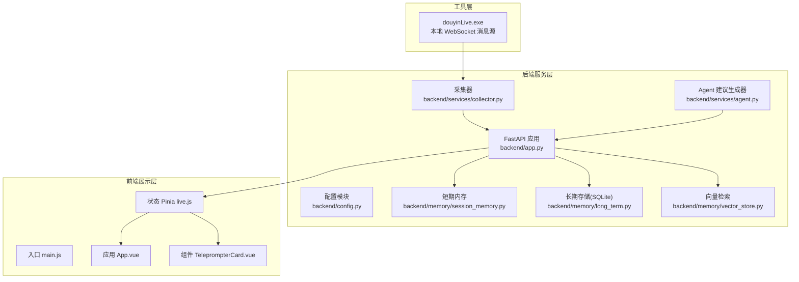
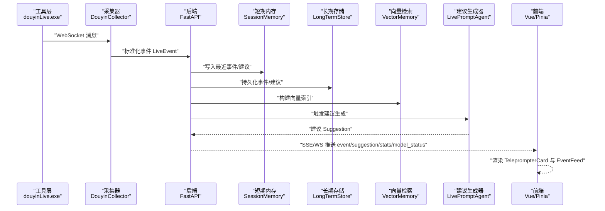
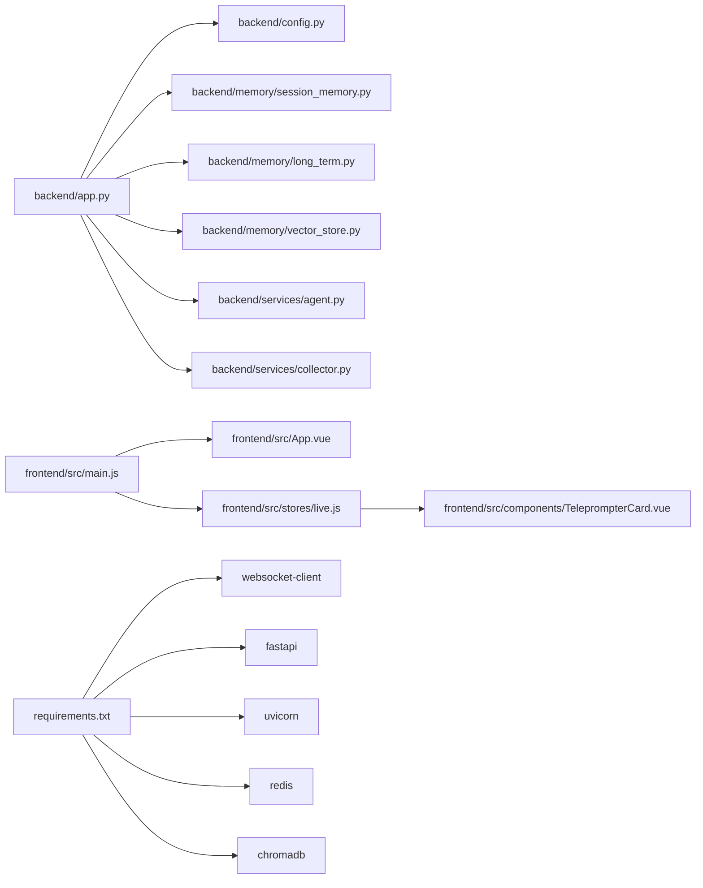

# 项目概述

<cite>
**本文引用的文件**
- [README.md](file://README.md)
- [USAGE.md](file://USAGE.md)
- [backend/app.py](file://backend/app.py)
- [backend/config.py](file://backend/config.py)
- [backend/services/collector.py](file://backend/services/collector.py)
- [backend/services/agent.py](file://backend/services/agent.py)
- [backend/memory/session_memory.py](file://backend/memory/session_memory.py)
- [backend/memory/long_term.py](file://backend/memory/long_term.py)
- [backend/memory/vector_store.py](file://backend/memory/vector_store.py)
- [frontend/src/main.js](file://frontend/src/main.js)
- [frontend/src/App.vue](file://frontend/src/App.vue)
- [frontend/src/components/TeleprompterCard.vue](file://frontend/src/components/TeleprompterCard.vue)
- [frontend/src/stores/live.js](file://frontend/src/stores/live.js)
- [requirements.txt](file://requirements.txt)
</cite>

## 目录
1. [简介](#简介)
2. [项目结构](#项目结构)
3. [核心组件](#核心组件)
4. [架构总览](#架构总览)
5. [详细组件分析](#详细组件分析)
6. [依赖关系分析](#依赖关系分析)
7. [性能考量](#性能考量)
8. [故障排查指南](#故障排查指南)
9. [结论](#结论)
10. [附录](#附录)

## 简介
本项目是面向抖音直播场景的实时提词器，目标是在直播过程中为主播提供即时、口语化、可直接念出的回复建议。系统由三层协同构成：
- 工具层（douyinLive）：负责连接抖音直播间并通过本地 WebSocket 暴露消息源。
- 后端服务层（FastAPI）：负责事件采集、短期/长期记忆、向量检索、建议生成与实时推送。
- 前端展示层（Vue.js）：负责房间切换、事件筛选、实时提词展示与主题切换。

系统支持双模式 AI：在线 OpenAI 兼容接口与本地启发式规则，并具备多层内存架构（短期内存、SQLite 长期存储、可选向量检索），以及实时事件流（SSE/WebSocket）处理能力。

## 项目结构
项目采用按层划分的组织方式，便于理解与扩展：
- backend：后端服务，包含 FastAPI 应用、配置、服务与内存模块
- frontend：Vue 3 前端，包含组件、状态管理与入口
- tool：本地抖音消息源可执行文件
- data：运行期数据目录（SQLite 与向量库）
- 日志与脚本：日志目录与启动脚本

图表来源
- [backend/app.py:1-220](file://backend/app.py#L1-L220)
- [backend/services/collector.py:1-284](file://backend/services/collector.py#L1-L284)
- [backend/services/agent.py:1-393](file://backend/services/agent.py#L1-L393)
- [backend/memory/session_memory.py:1-113](file://backend/memory/session_memory.py#L1-L113)
- [backend/memory/long_term.py:1-750](file://backend/memory/long_term.py#L1-L750)
- [backend/memory/vector_store.py:1-108](file://backend/memory/vector_store.py#L1-L108)
- [frontend/src/main.js:1-17](file://frontend/src/main.js#L1-L17)
- [frontend/src/App.vue:1-66](file://frontend/src/App.vue#L1-L66)
- [frontend/src/components/TeleprompterCard.vue:1-83](file://frontend/src/components/TeleprompterCard.vue#L1-L83)
- [frontend/src/stores/live.js:1-310](file://frontend/src/stores/live.js#L1-L310)

章节来源
- [README.md:21-34](file://README.md#L21-L34)
- [backend/app.py:94-220](file://backend/app.py#L94-L220)
- [frontend/src/main.js:1-17](file://frontend/src/main.js#L1-L17)

## 核心组件
- 工具层（douyinLive）：通过本地 WebSocket 暴露抖音直播事件，供后端采集器订阅。
- 后端 FastAPI 应用：提供健康检查、房间切换、事件注入、SSE/WS 实时流等接口。
- 采集器（DouyinCollector）：连接本地 WebSocket，标准化为统一事件结构，提交到事件循环。
- 建议生成器（LivePromptAgent）：优先调用在线 OpenAI 兼容接口，失败时回退本地启发式规则。
- 内存层：
  - SessionMemory：短期内存（Redis 或进程内队列），保存最近事件与建议。
  - LongTermStore：SQLite 长期存储，维护事件、建议、用户画像、会话与备注等。
  - VectorMemory：向量检索（Chroma 或轻量哈希嵌入），用于相似历史检索。
- 前端 Vue 应用：基于 Pinia 管理状态，通过 SSE 订阅事件与建议，实时渲染主提词卡与事件流。

章节来源
- [README.md:12-20](file://README.md#L12-L20)
- [backend/services/collector.py:38-284](file://backend/services/collector.py#L38-L284)
- [backend/services/agent.py:23-393](file://backend/services/agent.py#L23-L393)
- [backend/memory/session_memory.py:17-113](file://backend/memory/session_memory.py#L17-L113)
- [backend/memory/long_term.py:36-750](file://backend/memory/long_term.py#L36-L750)
- [backend/memory/vector_store.py:52-108](file://backend/memory/vector_store.py#L52-L108)
- [frontend/src/stores/live.js:70-310](file://frontend/src/stores/live.js#L70-L310)

## 架构总览
系统从本地消息源到前端展示的完整数据流如下：
- 工具层（douyinLive）持续推送直播事件至本地 WebSocket。
- 后端采集器订阅该 WebSocket，标准化为统一 LiveEvent 并提交到 FastAPI 事件循环。
- 事件进入处理管线：写入短期内存、长期存储、向量索引；生成建议；通过 SSE/WS 推送到前端。
- 前端通过 Pinia 状态管理与组件渲染，实时呈现提词建议、事件流与模型状态。

图表来源
- [backend/services/collector.py:117-284](file://backend/services/collector.py#L117-L284)
- [backend/app.py:61-78](file://backend/app.py#L61-L78)
- [backend/services/agent.py:73-114](file://backend/services/agent.py#L73-L114)
- [frontend/src/stores/live.js:173-205](file://frontend/src/stores/live.js#L173-L205)

## 详细组件分析

### 后端应用与接口（FastAPI）
- 生命周期管理：应用启动时启动采集器，关闭时清理会话与停止采集。
- 接口能力：
  - 健康检查：返回房间号与活动会话状态。
  - 初始化快照：返回最近事件、建议、统计与模型状态。
  - 房间切换：关闭当前会话，切换房间并返回新快照。
  - 事件注入：手动注入标准化事件，用于联调或替换采集端。
  - 实时流：SSE 与 WebSocket，推送事件、建议、统计与模型状态。
- 事件处理：写入短期内存、长期存储、向量索引；生成建议；发布到事件总线。

章节来源
- [backend/app.py:84-220](file://backend/app.py#L84-L220)

### 配置模块（Settings）
- 优先读取项目根目录 .env，其次读取当前 Shell 环境变量。
- 关键配置项：
  - 直播与采集：房间号、采集开关、主机与端口、心跳间隔与重连延迟。
  - 服务：监听地址与端口。
  - 模型：模式（heuristic/qwen/openai）、基础 URL、模型名、API Key、温度与超时。
  - 存储：数据目录、SQLite 路径、Chroma 目录、短期内存 TTL。
- 解析逻辑：根据模式解析最终使用的模型服务地址与模型名。

章节来源
- [backend/config.py:11-94](file://backend/config.py#L11-L94)

### 采集器（DouyinCollector）
- 功能要点：
  - 连接本地 WebSocket，处理连接、错误、关闭与心跳。
  - 将原始消息映射为统一 LiveEvent 结构，包含事件类型、用户信息、元数据与原始数据。
  - 将事件提交到后端事件循环，异步处理并记录结果。
- 房间切换：动态停止当前连接，更新房间号并重新启动采集。

章节来源
- [backend/services/collector.py:38-284](file://backend/services/collector.py#L38-L284)

### 建议生成器（LivePromptAgent）
- 双模式策略：
  - 在线模式：调用 OpenAI 兼容接口，解析 JSON 输出并规范化字段。
  - 回退模式：若在线失败，使用本地启发式规则生成建议。
- 上下文构建：最近事件窗口、相似历史片段、用户画像。
- 事件过滤：仅对 comment、gift、follow 生成建议。
- 模型状态：记录模式、模型、后端、最后结果、错误与更新时间。

章节来源
- [backend/services/agent.py:23-393](file://backend/services/agent.py#L23-L393)

### 内存层

#### 短期内存（SessionMemory）
- 优先使用 Redis 保存最近事件与建议；未安装 Redis 时退化为进程内队列。
- TTL 控制热数据生命周期；提供最近事件/建议查询与统计。

章节来源
- [backend/memory/session_memory.py:17-113](file://backend/memory/session_memory.py#L17-L113)

#### 长期存储（LongTermStore）
- SQLite 表结构：events、suggestions、viewer_profiles、viewer_gifts、live_sessions、viewer_notes。
- 功能：
  - 事件持久化与会话管理（活动会话创建、触达、结束）。
  - 用户画像与礼物历史聚合。
  - 观众备注与会话历史查询。
  - 统计与快照生成。

章节来源
- [backend/memory/long_term.py:36-750](file://backend/memory/long_term.py#L36-L750)

#### 向量检索（VectorMemory）
- 若安装 Chroma，则使用持久化集合进行相似检索。
- 否则使用轻量哈希嵌入函数，基于词重叠计算相似度，保证检索能力不断路。

章节来源
- [backend/memory/vector_store.py:52-108](file://backend/memory/vector_store.py#L52-L108)

### 前端组件与状态（Vue/Pinia）

#### 入口与应用
- 入口 main.js：创建 Vue 应用、注册 Pinia、挂载根节点。
- App.vue：布局容器，组合状态条、主提词卡与事件流。

章节来源
- [frontend/src/main.js:1-17](file://frontend/src/main.js#L1-L17)
- [frontend/src/App.vue:1-66](file://frontend/src/App.vue#L1-L66)

#### 状态管理（live.js）
- 状态：房间号、草稿、主题、连接状态、事件过滤、模型状态、统计、事件与建议列表。
- 能力：
  - 初始化快照：调用 /api/bootstrap 获取最近事件、建议、统计与模型状态。
  - 实时订阅：通过 SSE 订阅 event/suggestion/stats/model_status，更新状态。
  - 房间切换：POST /api/room 切换房间，失败时回滚并重连。
  - 事件过滤：支持多类型过滤与全选/清空。
  - 主题切换：深浅色主题持久化。

章节来源
- [frontend/src/stores/live.js:70-310](file://frontend/src/stores/live.js#L70-L310)

#### 主提词卡（TeleprompterCard）
- 展示当前最优先的建议回复，包含来源标签（模型生成/规则兜底/规则生成）、优先级、语气与理由。
- 显示原始来源事件的关键信息，便于主播快速理解建议背景。

章节来源
- [frontend/src/components/TeleprompterCard.vue:1-83](file://frontend/src/components/TeleprompterCard.vue#L1-L83)

## 依赖关系分析

图表来源
- [backend/app.py:13-21](file://backend/app.py#L13-L21)
- [backend/config.py:39-94](file://backend/config.py#L39-L94)
- [requirements.txt:1-6](file://requirements.txt#L1-L6)

章节来源
- [backend/app.py:13-21](file://backend/app.py#L13-L21)
- [requirements.txt:1-6](file://requirements.txt#L1-L6)

## 性能考量
- 多层内存架构：
  - 短期内存（Redis 或进程内队列）降低高频读写压力，支持高并发事件吞吐。
  - SQLite 长期存储提供稳定的持久化与查询能力，索引优化提升统计与画像查询效率。
  - 向量检索在安装 Chroma 时提供高效相似检索；未安装时使用轻量哈希嵌入，保证基本检索能力。
- 实时事件流：
  - SSE/WS 采用事件总线发布，前端按房间过滤，避免无关事件干扰。
  - 建议生成器仅对关键事件（comment/gift/follow）生成建议，减少不必要的计算。
- 可选依赖：
  - Redis、Chroma 为增强项，未安装时系统仍可运行，具备降级能力。

## 故障排查指南
- 页面打开但无建议：
  - 检查工具层是否已启动、房间号是否正确、直播间是否开播、后端是否重启到最新版本。
- 顶部显示 fallback：
  - 检查在线模型 API Key、网络访问、超时或限流情况。
- 顶部显示 heuristic：
  - 检查 .env 中 LLM_MODE 设置或环境变量加载是否正确。
- 前端无法打开：
  - 检查前端启动脚本、端口占用情况。
- 后端启动但未写入数据：
  - 检查工具层是否运行、后端日志是否连接到本地 WebSocket、当前房间是否有消息。
- 调试原始消息：
  - 使用调试客户端打印完整 JSON 并写入日志，确认消息字段与采集层连接状态。

章节来源
- [USAGE.md:198-256](file://USAGE.md#L198-L256)

## 结论
本项目通过三层架构与多层内存设计，在抖音直播场景下实现了从本地消息源到前端展示的完整实时提词链路。双模式 AI 支持与向量检索增强了建议质量与稳定性，SSE/WS 实时流确保了低延迟与高可用。对于初学者，项目提供了清晰的启动流程与配置说明；对于有经验的开发者，系统具备良好的扩展性与可维护性。

## 附录
- 快速开始与运行要求见使用说明与 README。
- 后端接口与标准事件格式详见 README。
- 前端功能与交互详见 README 与前端组件。