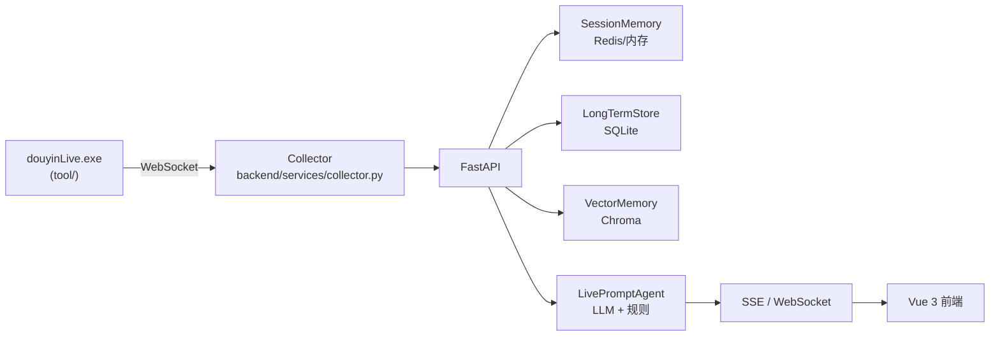

# Live Prompter Stack

一个面向抖音直播场景的实时提词与观众记忆工作台。

它的核心目标不是“自动开播”，而是给主播提供一套实时辅助系统：接收直播间事件，沉淀观众长期记忆，做真实语义召回，再把可操作的信息反馈到前端工作台，帮助主播更自然地接话、识别老观众、维护互动关系。

## 项目定位

这个项目更适合下面这类直播场景：

- 聊天型直播
- 陪伴型直播
- 人设型直播
- 需要“记住观众、理解上下文、给出下一句建议”的互动场景

当前版本已经移除了“历史事件向量召回”，只保留“观众记忆召回”这条主语义链路。

## 当前已实现

- 直播事件采集：接入 `douyinLive` 的 WebSocket 事件流，归一化为统一 `LiveEvent`
- 后端实时处理：FastAPI 负责事件入库、观众画像聚合、记忆抽取、语义召回、提词生成与 SSE/WebSocket 推送
- 长期记忆存储：`SQLite + Chroma` 保存观众记忆、观众备注、会话数据
- 真语义召回链路：支持真实 embedding 与向量检索，不再依赖“历史事件召回”
- embedding 严格模式：`EMBEDDING_STRICT=true` 时，禁用 hash fallback，确保不是“口头上的语义召回”
- 评论处理状态可视化：前端可看到每条评论是否入库、是否写入观众记忆、是否参与召回、是否生成提词
- 观众记忆人工纠偏：前端工作台支持人工新增、编辑、失效、恢复、置顶、删除和查看时间线
- 记忆状态同步召回：只有有效记忆参与语义召回；失效/删除记忆不会再被召回；人工新增和置顶记忆在排序上优先
- 模型设置面板：前端可直接在线修改模型名和系统提示词

## 架构总览



## 观众记忆纠偏工作流

在右侧 `ViewerWorkbench` 中，现在已经可以对单个观众记忆执行完整纠偏：

- 人工新增记忆
- 编辑自动抽取或人工新增的记忆文本
- 标记记忆失效
- 恢复失效记忆
- 置顶高优先级记忆
- 删除错误记忆
- 查看单条记忆的处理时间线

语义召回规则：

- `active` 记忆才会参与语义召回
- `invalid` 和 `deleted` 记忆不会参与语义召回
- 人工新增记忆和置顶记忆在排序时优先级更高

## 评论处理状态

针对“新进入系统并被实时处理的评论”，前端事件流会展示处理轨迹：

- 是否已入库
- 是否成功保存为观众记忆
- 是否参与语义召回
- 是否命中观众记忆召回
- 是否生成提词建议

展开后还能看到：

- `saved_memory_ids`
- `recalled_memory_ids`
- `suggestion_id`
- 未生成建议时的阻断原因

说明：

- 这套状态主要覆盖新进入系统的评论
- 历史 bootstrap 事件允许没有 `processing_status`
- 当前召回只针对观众记忆，不再包含历史事件相似召回

## 快速启动

1. 启动采集器

```powershell
.\tool\douyinLive-windows-amd64.exe
```

2. 复制环境变量

```powershell
Copy-Item .env.example .env
```

至少需要配置：

- `ROOM_ID`
- `LLM_API_KEY` 或 `DASHSCOPE_API_KEY`
- 如果使用云端 embedding，再配置 `EMBEDDING_API_KEY`

3. 安装后端依赖

```powershell
pip install -r requirements.txt
```

4. 启动后端

```powershell
python -m uvicorn backend.app:app --host 127.0.0.1 --port 8010 --reload
```

5. 启动前端

```powershell
cd frontend
npm install
npm run dev -- --host 127.0.0.1 --strictPort --port 5173
```

6. 或者直接使用脚本

```powershell
.\start_all.ps1
```

默认访问地址：

- 前端：`http://127.0.0.1:5173`
- 健康检查：`http://127.0.0.1:8010/health`

## 关键配置

### LLM 相关

- `LLM_MODE`
- `LLM_BASE_URL`
- `LLM_MODEL`
- `LLM_API_KEY`
- `DASHSCOPE_API_KEY`
- `LLM_TIMEOUT_SECONDS`
- `LLM_TEMPERATURE`
- `LLM_MAX_TOKENS`

### 向量与 embedding 相关

- `DATA_DIR`
- `DATABASE_PATH`
- `CHROMA_DIR`
- `EMBEDDING_MODE`
- `EMBEDDING_MODEL`
- `EMBEDDING_BASE_URL`
- `EMBEDDING_API_KEY`
- `SEMANTIC_*`

### 本地模型目录约定

项目根目录保留了 `model/` 作为本地模型存放目录，方便团队成员统一放置不提交到仓库的大模型文件：

| 路径 | 用途 |
| --- | --- |
### 观众记忆抽取（Ollama）

观众记忆抽取现在使用 Ollama / OpenAI-compatible chat 接口，推荐按以下方式配置：

1. 启动 Ollama 服务
2. 拉取一个用于记忆抽取的模型
3. 设置 `MEMORY_EXTRACTOR_ENABLED=true`
4. 设置 `MEMORY_EXTRACTOR_BASE_URL=http://127.0.0.1:11434/v1`
5. 设置 `MEMORY_EXTRACTOR_MODEL=<your ollama model name>`

说明：之前的 in-process GGUF runtime 路径已移除。

### Embedding

embedding 现在通过 Ollama / OpenAI-compatible `/embeddings` 接口调用，不再走应用内本地 SentenceTransformer 直连。

### 严格语义模式

如果你要求的是“真实 embedding + 真实语义召回”，建议显式开启：

```powershell
EMBEDDING_STRICT=true
```

开启后：

- embedding 生成失败时，不再回退到 hash embedding
- 向量召回失败时，不再回退到词项匹配
- `rebuild_embeddings.py` 不会写入伪 embedding 结果

`GET /health` 里可查看：

- `embedding_strict`
- `semantic_backend_ready`
- `semantic_backend_reason`

这能区分“确实没有召回到记忆”和“语义后端本身不可用”。

## 目录结构

| 路径 | 说明 |
| --- | --- |
| `backend/app.py` | FastAPI 入口，提供 REST、SSE、WebSocket 接口 |
| `backend/services/collector.py` | 对接 douyinLive WebSocket，转换并分发事件 |
| `backend/services/agent.py` | 提词生成、语义召回上下文拼装、模型状态输出 |
| `backend/memory/` | SessionMemory、SQLite LongTermStore、Chroma VectorMemory、EmbeddingService |
| `frontend/src/App.vue` | 前端主布局 |
| `frontend/src/stores/live.js` | Pinia Store，管理事件流、状态、ViewerWorkbench、LLM 设置 |
| `frontend/src/components/ViewerWorkbench.vue` | 观众详情、备注、记忆纠偏与时间线 UI |
| `tests/` | Python 单元测试 |
| `docs/` | 设计稿与实施计划 |

## 后端接口速览

| 方法 | 路径 | 说明 |
| --- | --- | --- |
| `GET /health` | 健康状态、房间号、strict mode、语义后端状态 |
| `GET /api/bootstrap?room_id=` | 前端初始化数据 |
| `POST /api/room` | 切换房间 |
| `POST /api/events` | 手动注入事件 |
| `GET /api/viewer` | 获取观众画像、记忆、备注、近期互动 |
| `POST /api/viewer/memories` | 新增观众记忆 |
| `PUT /api/viewer/memories/{memory_id}` | 更新观众记忆 |
| `POST /api/viewer/memories/{memory_id}/invalidate` | 标记记忆失效 |
| `POST /api/viewer/memories/{memory_id}/reactivate` | 恢复记忆有效 |
| `DELETE /api/viewer/memories/{memory_id}` | 删除观众记忆 |
| `GET /api/viewer/memories/{memory_id}/logs` | 获取单条记忆时间线 |
| `GET /api/viewer/notes` / `POST /api/viewer/notes` / `DELETE /api/viewer/notes/{id}` | 观众备注 CRUD |
| `GET /api/settings/llm` / `PUT /api/settings/llm` | 获取/保存模型设置 |
| `GET /api/events/stream` | SSE 实时流 |
| `GET /ws/live` | WebSocket 实时流 |

## 测试

前端：

```powershell
node frontend/src/components/event-feed-processing-presenter.test.mjs
node frontend/src/components/viewer-memory-presenter.test.mjs
node frontend/src/stores/viewer-workbench.test.mjs
npm --prefix frontend run build
```

后端：

```powershell
python -m unittest `
  tests.test_comment_processing_status `
  tests.test_long_term `
  tests.test_vector_store `
  tests.test_viewer_memory_api
```

语义链路自检：

```powershell
python tests/verify_memory_pipeline.py --mode internal
python tests/verify_memory_pipeline.py --mode e2e
python -m unittest tests.test_verify_memory_pipeline
```

## 数据文件

- `data/live_prompter.db`：事件、建议、观众记忆、观众备注、LLM 设置、会话记录
- `data/chroma/`：观众记忆向量索引
- `logs/`：调试日志

### `live_prompter.db` 业务表说明

| 表名 | 作用 | 关键内容 |
| --- | --- | --- |
| `events` | 直播事件总表，也是最底层原始流水 | 评论、进场、点赞、送礼、关注、系统事件；包含 `event_type`、`content`、`viewer_id`、`session_id`、`raw_json` |
| `viewer_profiles` | 观众行为聚合画像表，不是语义画像 | 累计评论数、进场数、礼物数、最近评论、首次/最近出现时间 |
| `viewer_gifts` | 观众送礼聚合表 | 按 `room_id + viewer_id + gift_name` 聚合礼物次数、总数量、总钻石数、最近送礼时间 |
| `live_sessions` | 直播场次表 | 一场直播一个 `session_id`，记录开始/结束时间、事件数、评论数、进场数、礼物数 |
| `suggestions` | AI 提词建议表 | 每次为某条事件生成的建议回复、优先级、语气、原因、置信度 |
| `viewer_memories` | 观众长期记忆表，是语义召回的核心业务表 | 从评论中抽取出的 `memory_text`、`memory_type`、`confidence`、`status`、`source_kind`、`recall_count` |
| `viewer_memory_logs` | 观众记忆操作日志表 | 记录记忆的创建、编辑、失效、恢复、删除、置顶等前后变化，适合做时间线审计 |
| `viewer_notes` | 主播/运营人工备注表 | 与自动抽取记忆分开存放，保存人工写入的备注内容和置顶状态 |
| `app_settings` | 轻量应用设置表 | 简单键值配置，例如模型相关设置 |

说明：

- 语义召回主链路直接相关的表主要是 `viewer_memories`，对应的向量索引存放在 `data/chroma/`。
- `viewer_profiles` 当前主要是行为统计画像，不等同于结构化语义画像。
- SQLite 本身不支持像 MySQL 那样在表结构上原生写 `COMMENT`，所以这里用 README 维护数据字典。

如果需要重建观众记忆向量索引：

```powershell
python backend/memory/rebuild_embeddings.py
```

## 当前记忆抽取的主要问题

当前版本的观众记忆抽取已经能跑通“评论入库 -> 记忆保存 -> 语义召回 -> 提词生成”的主链路，但从直播提词场景反推，现有抽取策略仍然比较粗糙，主要问题包括：

1. 有 LLM 却没有用于记忆抽取
   当前项目已经集成了 LLM 和 embedding，但记忆抽取仍主要依赖关键词和长度规则。LLM 更适合理解隐含偏好、口语、省略表达和复杂句意，例如“这碗面跟我在日本吃的一个味”这类句子，仅靠关键词抽取很容易漏掉。

2. 抽取目标和提词目标不一致
   观众记忆存在的目的，不是“尽量多存评论”，而是帮助主播更自然地接话、识别老观众、延续互动。当前抽取更关注“这句话像不像记忆”，但没有充分判断“这条信息对主播后续互动是否真的有用”，导致低价值内容可能进入长期记忆池。

3. 缺少语义合并和更新机制
   同一个观众多次表达相近信息时，系统容易生成多条语义重复的记忆。例如“我挺喜欢拉面”和“我超爱豚骨拉面”目前更可能被保存为两条独立记忆，而不是合并成更稳定、更高质量的偏好画像。

4. 只处理评论，忽略礼物等高价值行为信号
   当前自动抽取主要面向评论事件，尚未系统吸收礼物、复购、持续互动等更强的行为信号。对直播场景来说，反复送礼、首次送礼、贵重礼物、连续复购等信息，往往比普通聊天评论更值得沉淀为关键记忆。

5. 缺少否定、反向偏好和不确定性建模
   像“我不喜欢辣的”“别再推荐这个了”“我可能下周去”这类表达，和“我喜欢吃辣”“我下周一定会去”在业务上完全不同。当前抽取还没有稳定地区分正向偏好、负向偏好、猜测、计划和事实，容易造成错误召回。

6. 置信度计算较机械，不能真实反映记忆质量
   现有置信度更多是由长度、关键词命中、“我”这类表面特征拼凑得到，不能准确反映“这条记忆对主播有多重要、是否稳定、是否值得长期保留”。结果就是高价值记忆和低价值流水句之间，分数可能出现倒挂。

7. 缺少时间衰减和长期/短期分层
   “我准备去日本”“这周总在加班”“今晚想吃面”这类信息通常具有明显时效性，但当前长期记忆池里缺少明确的过期、衰减、降权或迁移机制。短期状态如果长期参与召回，会直接降低后续提词的准确性。

8. 问句、互动句和原句整存仍然会污染长期记忆
   当前抽取结果更接近“把看起来像记忆的整句评论存起来”，而不是“提炼出可复用的关键记忆”。这会带来两个后果：一是问句、反问、试探句可能被误当作事实记忆；二是入库文本过长、过杂，不利于后续语义召回和主播快速理解。

9. 当前缺少专门针对抽取精度的评测
   项目已经有语义召回评测，但还缺少“哪些评论不该入库”“问句误入库率”“短期计划是否应过期”“负向偏好是否识别正确”这类抽取质量评测。没有这层约束，记忆池会随着时间推移逐步变脏。

## 还可以继续改进的点

1. 语义链路可观测性
   现在已经能看到 strict mode 和评论处理轨迹，但还缺少 embedding 成功率、召回命中率、失败原因聚合、恢复建议等运维级指标。

2. 后端初始化副作用收敛
   当前 `backend.app` 在导入阶段仍会做较多初始化，影响测试隔离、启动时序和调试体验。

3. 失败恢复与告警
   现在前端能看到“为什么没生成提词”，但缺少连续失败告警、自动恢复提示、值守视角的排障面板。

4. 多房间与权限体系
   当前更适合单人、本地、单直播间使用，还没有多房间并行、多操作者协作、登录鉴权等能力。

5. 人工纠偏的批量能力
   现在已经能单条纠偏，但还没有批量失效、批量审核、筛选待纠偏记忆、人工确认队列这类更强的运营入口。

## 已知限制

1. 采集端当前仍依赖 Windows 可执行文件 `tool/douyinLive-windows-amd64.exe`
2. 当前默认是单房间串行接入，不支持多直播间并行监听
3. 尚未实现登录鉴权与多租户隔离，不适合直接暴露公网
4. 观众记忆人工纠偏已经可用，但批量审核和运营工作流仍不完整
5. 系统级观测与告警能力仍偏弱，定位问题还比较依赖人工查看日志

## 致谢

- [jwwsjlm/douyinLive](https://github.com/jwwsjlm/douyinLive)
- 所有在 issue / PR 中持续推动这个项目演进的贡献者
